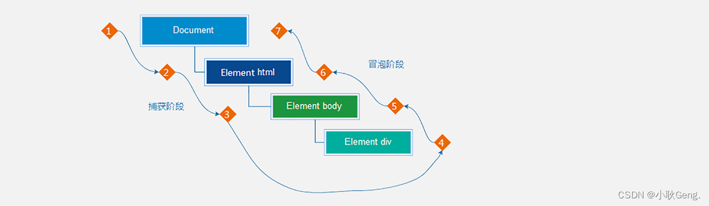

## 事件流

事件流是对事件执行过程的描述，了解事件的执行过程有助于加深对事件的理解，提升开发实践中对事件运用的灵活度。



如上图所示，任意事件被触发时总会经历两个阶段：【捕获阶段】和【冒泡阶段】。

简言之，捕获阶段是【从父到子】的传导过程，冒泡阶段是【从子向父】的传导过程。

#### 捕获和冒泡

了解了什么是事件流之后，我们来看事件流是如何影响事件执行的：

```javascript
<body>
  <h3>事件流</h3>
  <p>事件流是事件在执行时的底层机制，主要体现在父子盒子之间事件的执行上。</p>
  <div class="outer">
    <div class="inner">
      <div class="child"></div>
    </div>
  </div>
  <script>
    // 获取嵌套的3个节点
    const outer = document.querySelector('.outer');
    const inner = document.querySelector('.inner');
    const child = document.querySelector('.child');
        
    // html 元素添加事件
    document.documentElement.addEventListener('click', function () {
      console.log('html...')
    })
        
    // body 元素添加事件
    document.body.addEventListener('click', function () {
      console.log('body...')
    })

    // 外层的盒子添加事件
    outer.addEventListener('click', function () {
      console.log('outer...')
    })
    
    // 中间的盒子添加事件
    outer.addEventListener('click', function () {
      console.log('inner...')
    })
    
    // 内层的盒子添加事件
    outer.addEventListener('click', function () {
      console.log('child...')
    })
  </script>
</body>
```

执行上述代码后发现，当单击事件触发时，其祖先元素的单击事件也【相继触发】，这是为什么呢？

结合事件流的特征，我们知道当某个元素的事件被触发时，事件总是会先经过其祖先才能到达当前元素，然后再由当前元素向祖先传递，事件在流动的过程中遇到相同的事件便会被触发。

再来关注一个细节就是事件相继触发的【执行顺序】，事件的执行顺序是可控制的，即可以在捕获阶段被执行，也可以在冒泡阶段被执行。

如果事件是在冒泡阶段执行的，我们称为冒泡模式，它会先执行子盒子事件再去执行父盒子事件，默认是冒泡模式。

如果事件是在捕获阶段执行的，我们称为捕获模式，它会先执行父盒子事件再去执行子盒子事件。

```html
<body>
  <h3>事件流</h3>
  <p>事件流是事件在执行时的底层机制，主要体现在父子盒子之间事件的执行上。</p>
  <div class="outer">
    <div class="inner"></div>
  </div>
  <script>
    // 获取嵌套的3个节点
    const outer = document.querySelector('.outer')
    const inner = document.querySelector('.inner')

    // 外层的盒子
    outer.addEventListener('click', function () {
      console.log('outer...')
    }, true) // true 表示在捕获阶段执行事件
    
    // 中间的盒子
    outer.addEventListener('click', function () {
      console.log('inner...')
    }, true)
  </script>
</body>
html12345678910111213141516171819202122Copy to clipboardErrorCopied
```

结论：

1. `addEventListener` 第3个参数决定了事件是在捕获阶段触发还是在冒泡阶段触发
2. `addEventListener` 第3个参数为 `true` 表示捕获阶段触发， `false` 表示冒泡阶段触发，默认值为 `false`
3. 事件流只会在父子元素具有相同事件类型时才会产生影响
4. 绝大部分场景都采用默认的冒泡模式（其中一个原因是早期 IE 不支持捕获）

#### 阻止冒泡

阻止冒泡是指阻断事件的流动，保证事件只在当前元素被执行，而不再去影响到其对应的祖先元素。

```html
<body>
  <h3>阻止冒泡</h3>
  <p>阻止冒泡是指阻断事件的流动，保证事件只在当前元素被执行，而不再去影响到其对应的祖先元素。</p>
  <div class="outer">
    <div class="inner">
      <div class="child"></div>
    </div>
  </div>
  <script>
    // 获取嵌套的3个节点
    const outer = document.querySelector('.outer')
    const inner = document.querySelector('.inner')
    const child = document.querySelector('.child')

    // 外层的盒子
    outer.addEventListener('click', function () {
      console.log('outer...')
    })

    // 中间的盒子
    inner.addEventListener('click', function (ev) {
      console.log('inner...')

      // 阻止事件冒泡
      ev.stopPropagation()
    })

    // 内层的盒子
    child.addEventListener('click', function (ev) {
      console.log('child...')

      // 借助事件对象，阻止事件向上冒泡
      ev.stopPropagation()
    })
  </script>
</body>
```

结论：事件对象中的 `ev.stopPropagation` 方法，专门用来阻止事件冒泡。

> 鼠标经过事件：
>
> mouseover 和 mouseout 会有冒泡效果
>
> mouseenter 和 mouseleave 没有冒泡效果 (推荐)

#### 事件解绑

`addEventListener` 方式，必须使用：

`removeEventListener` (事件类型, 事件处理函数, [获取捕获或者冒泡阶段]) 例如:

```javascript
function fn(){
  alert('点击了')
}
// 绑定事件
btn.addEventListener('click',fn)
// 解绑事件
btn.removeEventListener('click',fn)
javascript1234567Copy to clipboardErrorCopied
```

注意：匿名函数无法被解析。

> 两种注册事件的区别：
>
> 1. 传统on注册（L0）
>    1. 同一个对象,后面注册的事件会覆盖前面注册(同一个事件)
>    2. 直接使用null覆盖偶就可以实现事件的解绑
>    3. 都是冒泡阶段执行的
> 2. l 事件监听注册（L2）
>    1. 语法: addEventListener(事件类型, 事件处理函数, 是否使用捕获)
>    2. 后面注册的事件不会覆盖前面注册的事件(同一个事件)
>    3. 可以通过第三个参数去确定是在冒泡或者捕获阶段执行
>    4. 必须使用removeEventListener(事件类型, 事件处理函数, 获取捕获或者冒泡阶段) Ø 匿名函数无法被解绑

## 事件委托

事件委托是利用事件流的特征解决一些开发需求的知识技巧

优点：减少注册次数，可以提高程序性能

原理：事件委托其实是利用事件冒泡的特点。

**给父元素注册事件，当我们触发子元素的时候，会冒泡到父元素身上，从而触发父元素的事件**

实现：事件对象.target. tagName 可以获得真正触发事件的元素

我们的最终目的是保证只有点击的子元素才去执行事件的回调函数，如何判断用户点击是哪一个子元素呢？


事件对象中的属性 `target` 或 `srcElement` 属性表示真正触发事件的元素，它是一个元素类型的节点。

```html
<body>
  <ul>
    <li>第1个孩子</li>
    <li>第2个孩子</li>
    <li>第3个孩子</li>
    <li>第4个孩子</li>
    <li>第5个孩子</li>
    <p>我不需要变色</p>
  </ul>
  <script>
    // 点击每个小li 当前li 文字变为红色
    // 按照事件委托的方式  委托给父级，事件写到父级身上
    // 1. 获得父元素
    const ul = document.querySelector('ul')
    ul.addEventListener('click', function (e) {
      // alert(11)
      // this.style.color = 'red'
      // console.dir(e.target) // 就是我们点击的那个对象
      // e.target.style.color = 'red'
      // 我的需求，我们只要点击li才会有效果
      if (e.target.tagName === 'LI') {
        e.target.style.color = 'red'
      }
    })
  </script>
</body>
```

