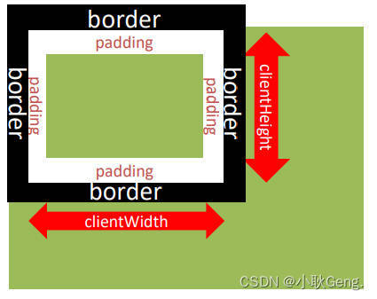

## 其他事件

### 页面加载事件

加载外部资源（如图片、外联CSS和JavaScript等）加载完毕时触发的事件

有些时候需要等页面资源全部处理完了做一些事情

不光可以监听整个页面资源加载完毕，也可以针对某个资源绑定load事件

**事件名：load**

监听页面所有资源加载完毕：

```javascript
window.addEventListener('load', function() {
    // xxxxx
})

img.addEventListener('load', function() {
    // xxxxx
})
javascript1234567Copy to clipboardErrorCopied
```

另一种页面加载事件：

当初始的HTML文档被完全加载和解析完成之后，DOMContentLoaded事件被触发，而无需等待样式表、图像等完
全加载
事件名：DOMContentLoaded
监听页面DOM加载完毕：

> 给document添加DOMContentLoaded事件

```javascript
document.addEventListener('DOMContentLoaded',function (){
// 执行的操作
})
javascript123Copy to clipboardErrorCopied
```

区别：

`load` 等待外部资源全部加载完毕再执行， `DOMContentLoaded` 是不需要等待外部资源。

`load` 监听整个页面资源给 `window` 加。 `DOMContentLoaded` 给 `document` 加

### 元素滚动事件

滚动条在滚动的时候持续触发的事件

`scrollTop`:被卷去的头部

`scrollLeft`:被卷去的左侧

检测页面被卷去距离 `document.documentElement.scrollTop`

```javascript
window.addEventListener('scroll', function() {
    // xxxxx
})
javascript123Copy to clipboardErrorCopied
window.addEventListener('scroll',function (){
      //document.documentElement是获取HTML元素的方式
    console.log(document.documentElement.scrollTop)
  })
javascript1234Copy to clipboardErrorCopied
```

当页面滚动100像素是div就会显示

```javascript
const div = document.querySelector('div')
  window.addEventListener('scroll',function (){
    const n = document.documentElement.scrollTop
    if(n>=100){
      div.style.display = 'block'
    }else{
      div.style.display = 'none'
    }
  })
javascript123456789Copy to clipboardErrorCopied
```

### 页面尺寸事件

会在窗口尺寸改变的时候触发事件：

```javascript
window.addEventListener('resize', function() {
    // xxxxx
})
javascript123Copy to clipboardErrorCopied
```

检测屏幕宽度：

```javascript
window.addEventListener('resize',function (){
  let w = document.documentElement.clientwidth
  console.log(w)
  })
javascript1234Copy to clipboardErrorCopied
```

获取元素宽高：

获取元素的可见部分宽高（不包含边框，margin，滚动条等）

`clientWidth` 和 `clientHeigh`



### 元素尺寸与位置

获取宽高：

获取元素的自身宽高、包含元素自身设置的宽高、padding、border

offsetWidth和offsetHeight

获取出来的是数值,方便计算

注意: 获取的是可视宽高, 如果盒子是隐藏的,获取的结果是0

获取位置：

获取元素距离自己定位父级元素的左、上距离

offsetLeft和offsetTop 注意是只读属

