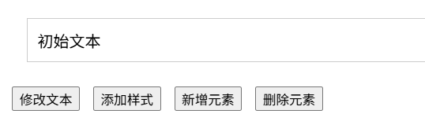
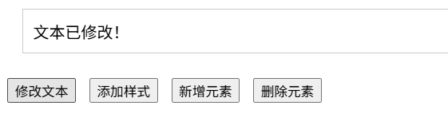
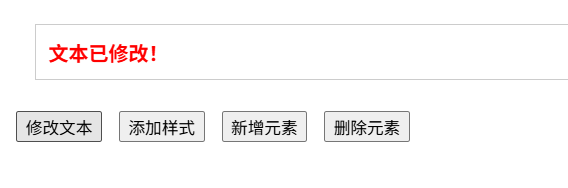
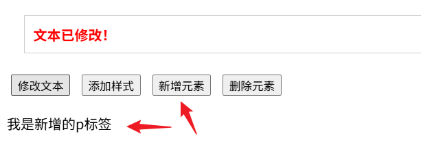
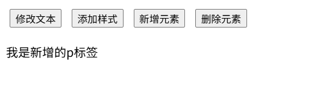

## DOM节点

> 掌握元素节点创建、复制、插入、删除等操作的方法，能够依据元素节点的结构关系查找节点

回顾之前 DOM 的操作都是针对元素节点的属性或文本的，除此之外也有专门针对元素节点本身的操作，如插入、复制、删除、替换等。

## 查找节点

DOM 树中的任意节点都不是孤立存在的，它们要么是父子关系，要么是兄弟关系，不仅如此，我们可以依据节点之间的关系查找节点。

### 父节点查找

`parentNode` 属性，返回最近一级的父节点，找不到返回null

语法：子元素.`parentNode`

```javascript
<table>
    <tr>
      <td width="60">序号</td>
      <td>课程名</td>
      <td>难度</td>
      <td width="80">操作</td>
    </tr>
    <tr>
      <td>1</td>
      <td><span>HTML</span></td>
      <td>初级</td>
      <td><button>变色</button></td>
    </tr>
    <tr>
      <td>2</td>
      <td><span>CSS</span></td>
      <td>初级</td>
      <td><button>变色</button></td>
    </tr>
    <tr>
      <td>3</td>
      <td><span>Web APIs</span></td>
      <td>中级</td>
      <td><button>变色</button></td>
    </tr>
  </table>
  <script>
    // 获取所有 button 节点，并添加事件监听
    const buttons = document.querySelectorAll('table button')
    for(let i = 0; i < buttons.length; i++) {
      buttons[i].addEventListener('click', function () {
        // console.log(this.parentNode); // 父节点 td
        // console.log(this.parentNode.parentNode); // 爷爷节点 tr
        this.parentNode.parentNode.style.color = 'red'
      })
    }
  </script>
```

列如：当我点击关闭div会消失。

```javascript
<div class="box">
    我是广告
    <div class="box1">X</div>
  </div>

// 1. 获取事件源
const box1 = document.querySelector('.box1')
// 2. 事件侦听
box1.addEventListener('click', function () {
   this.parentNode.style.display = 'none'
 })
```

需要关闭多个按钮时：

```javascript
/1.获取三个关闭按钮
const closeBtn document.querySelectorAll('.box1')
for (let i=0;i<closeBtn.length;i++){
closeBtn[i].addEventListener('click',function ()
//只关闭当前父元素                             
this.parentNode.style.display ='none
})
```

#### 子节点查找：

`childNodes` 属性获得所有子节点，包括文本节点（空格、换行）、注释节点等。

`children` 仅获得所有元素节点，返回还是一个伪数组

语法：父元素.`children`

```javascript
<body>
  <button class="btn1">所有的子节点</button>
  <!-- 获取 ul 的子节点 -->
  <ul>
    <li>HTML</li>
    <li>CSS</li>
    <li>JavaScript 基础</li>
    <li>Web APIs</li>
  </ul>
  <script>
    const btn1 = document.querySelector('.btn1')
    btn1.addEventListener('click', function () {
      // 父节点
      const ul = document.querySelector('ul')

      // 所有的子节点
      console.log(ul.childNodes)
      // 只包含元素子节点
      console.log(ul.children)
    })
  </script>
</body>
```

#### 兄弟关系查找

`previousSibling` 获取前一个节点，以相对位置查找节点，实际应用中非常灵活。

`nextSibling` 获取后一个节点，以相对位置查找节点，实际应用中非常灵活。

```javascript
<body>
  <ul>
    <li>HTML</li>
    <li>CSS</li>
    <li>JavaScript 基础</li>
    <li>Web APIs</li>
  </ul>
  <script>
    // 获取所有 li 节点
    const lis = document.querySelectorAll('ul li')

    // 对所有的 li 节点添加事件监听
    for(let i = 0; i < lis.length; i++) {
      lis[i].addEventListener('click', function () {
        // 前一个节点
        console.log(this.previousSibling)
        // 下一下节点
        console.log(this.nextSibling)
      })
    }
  </script>
</body>
```

## 增加节点

### 创建节点

创建一个新的网页元素，再添加到网页内，一般先创建节点，然后再插入节点

创建元素节点方法：

```javascript
document.createElement('标签名')
```

### 追加节点

想要在界面看到还得插入到某个父元素中。

插入到父元素 **最后一个子元素** ：

```javascript
父元素.appendChild(要插入的元素)
javascript1Copy to clipboardErrorCopied
const ul document.querySelector('ul')
//创建新节点li
const li document.createElement('li')
//追加节点
ul.appendchild(li)
```

插入到父元素中 **某个子元素的前面** ：

```javascript
父元素.insertBefore(要插入的元素，在哪个元素前面)
javascript1Copy to clipboardErrorCopied
ul.insertBefore(li,ul.children[0])
```

### 克隆节点

复制一个原有的节点，把复制的节点放入到指定的元素内部。

```javascript
元素.cloneNode(布尔值)
javascript1Copy to clipboardErrorCopied
const ul document.querySelector('ul')
//1克隆节点元素.cLoneNode(true)】
//const Li1 ul.children[0].cLoneNode(true) 和下面的一样
//console.Log(Li1)
//2.追加
ul.appendChild(ul.children[0].cloneNode(true))
```

> cloneNode会克隆一个跟原标签一样的元素，括号内传入布尔值
>
> 若为true则代表克隆时会包含后代节点一起克隆，所有的都克隆
>
> 若为false则代表克隆时不包含后代节点，只克隆标签
>
> 默认为false

### 删除节点

在JavaScript原生DOM操作中，要删除元素必须通父元素删除

语法：

```javascript
父元素.removeChild（要删除的元素）
javascript1Copy to clipboardErrorCopied
const ul document.querySelector('ul')
//刚删除节点父元素.removeChLid(子元素)
ul.removeChild(ul.children[0])
NaNpx
```

> 如果不存在父子关系则删除不成功
>
> 删除节点和隐藏节点（display：none）有区别：
>
> 隐藏节点还是存在的，但是删除则是从HTML中删除节点

## M端事件

移动端也有自己独特的地方。比如触屏事件 touch（也称触摸事件），Android 和 IOS 都有。

- 触屏事件 touch（也称触摸事件），Android 和 IOS 都有。

- touch 对象代表一个触摸点。触摸点可能是一根手指，也可能是一根触摸笔。触屏事件可响应用户手指（或触控笔 ）对屏幕或者触控板操作。

- 常见的触屏事件如下：

  | 触屏touch事件 | 说明                          |
  | :------------ | :---------------------------- |
  | touchstart    | 手指触摸到一个DOM元素时触发   |
  | touchmove     | 手指在一个DOM元素上滑动时触发 |
  | touchend      | 手指从一个OM元素上移动时触发  |

## 极简DOM操作示例

```html
<!DOCTYPE html>
<html lang="zh-CN">
<head>
    <meta charset="UTF-8">
    <title>极简DOM操作示例</title>
    <style>
        /* 仅保留最基础的样式，方便查看效果 */
        #box {
            margin: 20px;
            padding: 10px;
            border: 1px solid #ccc;
        }
        button {
            margin: 5px;
        }
        .highlight {
            color: red;
            font-weight: bold;
        }
    </style>
</head>
<body>
<div id="box">初始文本</div>
<button onclick="changeText()">修改文本</button>
<button onclick="addStyle()">添加样式</button>
<button onclick="addElement()">新增元素</button>
<button onclick="delElement()">删除元素</button>

<script>
    // 1. 修改文本内容
    function changeText() {
        const box = document.getElementById('box');
        box.textContent = '文本已修改！';
    }

    // 2. 添加样式类
    function addStyle() {
        const box = document.getElementById('box');
        box.classList.add('highlight');
    }

    // 3. 新增元素
    function addElement() {
        const newP = document.createElement('p');
        newP.textContent = '我是新增的p标签';
        document.body.appendChild(newP);
    }

    // 4. 删除元素
    function delElement() {
        const box = document.getElementById('box');
        box.remove();
    }
</script>
</body>
</html>
```



修改文本



添加样式



新增元素



删除元素

