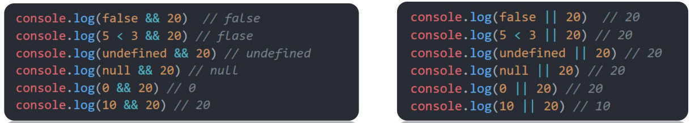

> 想静下心来系统的学习一下javascript，为什么有这样的想法，那是因为自己之前学习的比较零散！
>
> 总是每次在用的时候再去查，很麻烦！所以有了这篇笔记！
>
> 目的：系统的复盘一次，或者是为了后续查起来方便！

## 1、javascript引入方式

JavaScript 代码在 HTML 页面中有 **三种标准、常用的引入方式**，分别是：**行内引入、内部引入、外部引入**，三种方式各有适用场景，下面逐一详细讲解，所有示例可直接复制运行。

### 1.1 行内引入

✅ 语法特点 

将 JavaScript 代码直接写在 HTML 标签的事件属性中，是最原始、最基础的引入方式。 核心依赖：HTML 标签的事件属性（以on开头的属性），最常用的是 onclick（点击事件）、onmouseover（鼠标悬浮事件）等。 

✅ 代码示例：

```javascript
<!DOCTYPE html>
<html lang="zh-CN">
<head>
    <meta charset="UTF-8">
    <title>行内引入JS</title>
</head>
<body>
    <!-- 点击按钮，执行行内的JS代码：弹窗提示 -->
    <button onclick="alert('你点击了按钮，这是行内JS效果')">点我试试</button>
    <!-- 鼠标悬浮到div上，执行行内的JS代码：弹窗提示 -->
    <div onmouseover="alert('鼠标悬浮上来了')" style="width:100px;height:100px;background:red;">悬浮我</div>
</body>
</html>
```

### 1.2 内部引入

通过 script 标签包裹 JavaScript 代码。

```javascript
<!DOCTYPE html>
<html lang="en">

<head>
  <meta charset="UTF-8">
  <title>JavaScript 基础 - 引入方式</title>
</head>

<body>
  <!-- 内联形式：通过 script 标签包裹 JavaScript 代码 -->
  <script>
    alert('hello word')
  </script>
</body>

</html>
```

### 1.3 外部引入

一般将 JavaScript 代码写在独立的以.js 结尾的文件中，然后通过 script 标签的 src 属性引入。

```javascript
<!DOCTYPE html>
<html lang="en">
<head>
  <meta charset="UTF-8">
  <title>JavaScript 基础 - 引入方式</title>
</head>
<body>
  <!-- 外部形式：通过 script 的 src 属性引入独立的 .js 文件 -->
  <script src="demo.js"></script>
</body>
</html>
```

## 2、注释和结束符

- 单行注释：使用 // 注释单行代码
- 多行注释：使用 /* */ 注释多行代码

## 3、输入输出

输入：prompt() 是弹窗让用户输入向一些内容。

```javascript
<!DOCTYPE html>
<html lang="en">
<head>
    <meta charset="UTF-8">
    <title>输入</title>
</head>
<body>
<script>

    let pokes = prompt('请输入您的姓名:');
    document.body.innerHTML = pokes

</script>

</body>
</html>
```

> 注意：document.write('要输出的内容') 已经被弃用。所以这里使用document.body.innerHTML，至于是什么后续再说
> 

## 4、变量

变量是计算机中用来存储数据的“容器”，它可以让计算机变得有记忆，通俗的理解变量就是使用【某个符号】来代表【某个具体的数值】（数据）。

```javascript
<script>
  // x 符号代表了 5 这个数值
  x = 5
  // y 符号代表了 6 这个数值
  y = 6
    
  //举例： 在 JavaScript 中使用变量可以将某个数据（数值）记录下来！

  // 将用户输入的内容保存在 num 这个变量（容器）中
  num = prompt('请输入一数字!')

  // 通过 num 变量（容器）将用户输入的内容输出出来
  alert(num)
</script>

```

### 变量的声明和赋值

声明(定义)变量有两部分构成：声明关键字、变量名（标识）。

关键字是 JavaScript 中内置的一些英文词汇（单词或缩写），它们代表某些特定的含义，如 let 的含义是声明变量的，看到 let 后就可想到这行代码的意思是在声明变量，如 let age;

let 和 var 都是 JavaScript 中的声明变量的关键字，推荐使用 let 声明变量！！！

```javascript
<!DOCTYPE html>
<html lang="en">
<head>
  <meta charset="UTF-8">
  <title>JavaScript 基础 - 声明和赋值</title>
</head>
<body>
  
  <script> 
    // 声明(定义)变量有两部分构成：声明关键字、变量名（标识）
    // let 即关键字，所谓关键字是系统提供的专门用来声明（定义）变量的词语
    // age 即变量的名称，也叫标识符
    let age
    // 赋值，将 18 这个数据存入了 age 这个“容器”中
    age = 18
    // 这样 age 的值就成了 18
    document.write(age)
    
    // 也可以声明和赋值同时进行
    let str = 'hello world!'
    alert(str);
  </script>
</body>
</html>

```

JavaScript 使用专门的关键字 `let` 和 `var` 来声明（定义）变量，在使用时需要注意一些细节：

以下是使用 `let` 时的注意事项：

1. 允许声明和赋值同时进行

2. 不允许重复声明

   ```javascript
   let age = 'this'
   // 重复 'let' 会导致 error
   let age = 'that' // SyntaxError: 'message' has already been declared
   javascript123Copy to clipboardErrorCopied
   ```

3. 允许同时声明多个变量并赋值

4. JavaScript 中内置的一些关键字不能被当做变量名

以下是使用 `var` 时的注意事项：

> 1. 允许声明和赋值同时进行
> 2. 允许重复声明
> 3. 允许同时声明多个变量并赋值

大部分情况使用 `let` 和 `var` 区别不大，但是 `let` 相较 `var` 更严谨，因此推荐使用 `let` 。

### 变量名命名规则

关于变量的名称（标识符）有一系列的规则需要遵守：

1. 只能是字母、数字、下划线、c194a9eg<!-- begin-inline-katex，且不能能数字开头
2. 字母区分大小写，如 Age 和 age 是不同的变量
3. JavaScript 内部已占用于单词（关键字或保留字）不允许使用
4. 尽量保证变量具有一定的语义，见字知义

注：所谓关键字是指 JavaScript 内部使用的词语，如 `let` 和 `var` ，保留字是指 JavaScript 内部目前没有使用的词语，但是将来可能会使用词语。

```javascript
<!DOCTYPE html>
<html lang="en">
<head>
  <meta charset="UTF-8">
  <title>JavaScript 基础 - 变量名命名规则</title>
</head>
<body>
  
  <script> 
    let age = 18 // 正确
    let age1 = 18 // 正确
    let _age = 18 // 正确

    // let 1age = 18; // 错误，不可以数字开头
    let $age = 18 // 正确
    let Age = 24 // 正确，它与小写的 age 是不同的变量
    // let let = 18; // 错误，let 是关键字
    let int = 123 // 不推荐，int 是保留字
  </script>
</body>
</html>

```

## 5、常量

- 概念：使用 const 声明的变量称为“常量”。

- 使用场景：当某个变量永远不会改变的时候，就可以使用 const 来声明，而不是let。

- 命名规范：和变量一致

```javascript
const PI = 3.14
```

> 注意： 常量不允许重新赋值,声明的时候必须赋值（初始化）

```javascript
const myBirthday = '18.04.1982';
myBirthday = '01.01.2001'; // 错误，不能对常量重新赋值
```

## 6、数据类型

> 计算机世界中的万事成物都是数据。

计算机程序可以处理大量的数据，为了方便数据的管理，将数据分成了不同的类型。

### typeof用于检测数据类型 

通过 typeof 关键字检测数据类型

```javascript
<!DOCTYPE html>
<html>
	<head>
		<meta charset="utf-8">
		<title>数据类型</title>
	</head>
	<body>

		<p> typeof 操作符返回变量或表达式的类型。</p>
		<p id="demo"></p>
		<script>
			document.getElementById("demo").innerHTML =
				typeof "john" + "<br>" +
				typeof 3.14 + "<br>" +
				typeof false + "<br>" +
				typeof [1, 2, 3, 4] + "<br>" +
				typeof {
					name: 'john',
					age: 34
				};
		</script>

	</body>
</html>
```

### Number 类型

即我们数学中学习到的数字，可以是整数、小数、正数、负数

```javascript
<!DOCTYPE html>
<html lang="en">
<head>
  <meta charset="UTF-8">
  <title>JavaScript 基础 - 数据类型</title>
</head>
<body>
  
  <script> 
    let score = 100 // 正整数
    let price = 12.345 // 小数
    let temperature = -40 // 负数

    document.write(typeof score) // 结果为 number
    document.write(typeof price) // 结果为 number
    document.write(typeof temperature) // 结果为 number
  </script>
</body>
</html>

```

JavaScript 中的数值类型与数学中的数字是一样的，分为正数、负数、小数等。

除了上述的常规数字外还有三种特殊数值：

- `Infinity` 代表数学概念中的 `无穷大` ∞。是一个比任何数字都大的特殊值。

  ```javascript
  alert( 1 / 0 ); // Infinity
  javascript1Copy to clipboardErrorCopied
  ```

- `NaN` 代表一个计算错误`.NaN `是粘性的。任何对` NaN `的进一步数学运算都会返回` NaN（0除外）

  ```javascript
  alert( "not a number" / 2 ); // NaN，这样的除法是错误的
  javascript1Copy to clipboardErrorCopied
  ```

同时使用多个 运算符 编写程序时，会按着某种顺序先后执行，我们称为优先级。 

> JavaScript中 优先级越高越先被执行，优先级相同时以书从左向右执行。
>
> - 乘、除、取余优先级相同
>
> - 加、减优先级相同
>
> - 乘、除、取余优先级大于加、减
>
> - 使用 () 可以提升优先级
>
> 总结： 先乘除后加减，有括号先算括号里面的

### String 类型

通过单引号（ '' ） 、双引号（ "" ）或反引号包裹的数据都叫 字符串。单引号和双引号没有本质上的区别，推荐使用单引号。

> 注意事项：
>
> - 无论单引号或是双引号必须成对使用
>
> - 单引号/双引号可以互相嵌套，但是不以自已嵌套自已
>
> - 必要时可以使用转义符 \ ，输出单引号或双引号

```javascript
<!DOCTYPE html>
<html lang="en">
<head>
<meta charset="UTF-8">
<title>JavaScript 基础 - 数据类型</title>
</head>
<body>

<script> 
 let user_name = '小明' // 使用单引号
 let gender = "男" // 使用双引号
 let str = '123' // 看上去是数字，但是用引号包裹了就成了字符串了
 let str1 = '' // 这种情况叫空字符串
     
 documeent.write(typeof user_name) // 结果为 string
 documeent.write(typeof gender) // 结果为 string
 documeent.write(typeof str) // 结果为 string
</script>
</body>
</html>
```

### Boolean 类型

表示肯定或否定时在计算机中对应的是布尔类型数据，它有两个固定的值 `true` 和 `false` ，表示肯定的数据用 `true` ，表示否定的数据用 `false` 。

```html
<!DOCTYPE html>
<html lang="en">
<head>
  <meta charset="UTF-8">
  <title>JavaScript 基础 - 数据类型</title>
</head>
<body>
  
  <script> 
    //  pink老师帅不帅？回答 是 或 否
    let isCool = true // 是的，摔死了！
    isCool = false // 不，套马杆的汉子！

    document.write(typeof isCool) // 结果为 boolean
  </script>
</body>
</html>Copy to clipboardErrorCopied
```

### undefined

未定义是比较特殊的类型，只有一个值 undefined，只声明变量，不赋值的情况下，变量的默认值为 undefined，一般很少【直接】为某个变量赋值为 undefined。

```html
<!DOCTYPE html>
<html lang="en">
<head>
  <meta charset="UTF-8">
  <title>JavaScript 基础 - 数据类型</title>
</head>
<body>
  
  <script> 
    // 只声明了变量，并末赋值
    let tmp;
    document.write(typeof tmp) // 结果为 undefined
  </script>
</body>
</html>Copy to clipboardErrorCopied
```

**注：JavaScript 中变量的值决定了变量的数据类型。**

### null

代表无、空或值未知的特殊值。

```javascript
let age = null;Copy to clipboardErrorCopied
```

> undefined和null的区别：
>
> - undefined代表没有赋值
>
> - null代表赋值了但是为空

### 类型转换

在 JavaScript 中数据被分成了不同的类型，如数值、字符串、布尔值、undefined，在实际编程的过程中，不同数据类型之间存在着转换的关系。

#### 隐式转换

某些运算符被执行时，系统内部自动将数据类型进行转换，这种转换称为隐式转换。

> 规则：
>
> - +号两边只要有一个是字符串，都会把另外一个转成字符串
>
> - 除了+以外的算术运算符 比如 - * / 等都会把数据转成数字类型
>
> - +号作为正号解析可以转换成数字型
>
> - 任何数据和字符串相加结果都是字符串

实例如下：

```javascript
<script>
    console.log(11 + 11)      	//22
    console.log('11' + 11)		//1111
    console.log(11 - 11)		//0
    console.log('11' - 11)		//0
    console.log(1 * 1)			//0
    console.log('1' * 1)		//0
    console.log(typeof '123')	//string
    console.log(typeof +'123')	//number
    console.log(+'11' + 11)		//22
</script>
```


```javascript
<!DOCTYPE html>
<html lang="en">
<head>
  <meta charset="UTF-8">
  <title>JavaScript 基础 - 隐式转换</title>
</head>
<body>
  <script> 
    let num = 13	 // 数值
    let num2 = '2'	 // 字符串，结果为 132
    // 原因是将数值 num 转换成了字符串，相当于 '13'
    // 然后 + 将两个字符串拼接到了一起
    console.log(num + num2)			// 结果为 11
    // 原因是将字符串 num2 转换成了数值，相当于 2
    // 然后数值 13 减去 数值 2
    console.log(num - num2)

    let a = prompt('请输入一个数字')
    let b = prompt('请再输入一个数字')

    alert(a + b);
  </script>
</body>
</html>

```

注：数据类型的隐式转换是 JavaScript 的特征，后续学习中还会遇到，目前先需要理解什么是隐式转换。

补充介绍模板字符串的拼接的使用

### 显式转换

编写程序时过度依靠系统内部的隐式转换是不严禁的，因为隐式转换规律并不清晰，大多是靠经验总结的规律。为了避免因隐式转换带来的问题，通常根逻辑需要对数据进行显示转换。

转换为数字型 Number(数据）

转换为字符型String(数据)

parseInt(数据) 只保留整数

parseFloat(数据) 可以保留小

#### Number

通过 `Number` 显示转换成数值类型，当转换失败时结果为 `NaN` （Not a Number）即不是一个数字。

```javascript
<!DOCTYPE html>
<html lang="en">
<head>
  <meta charset="UTF-8">
  <title>JavaScript 基础 - 隐式转换</title>
</head>
<body>
  <script>
    let t = '12'
    let f = 8

    // 显式将字符串 12 转换成数值 12
    t = Number(t)

    // 检测转换后的类型
    // console.log(typeof t);
    console.log(t + f) // 结果为 20

    // 并不是所有的值都可以被转成数值类型
    let str = 'hello'
    // 将 hello 转成数值是不现实的，当无法转换成
    // 数值时，得到的结果为 NaN （Not a Number）
    console.log(Number(str))
  </script>
</body>
</html>

```

#### 布尔型转换

转换规则如下：

- 直观上为“空”的值（如 `0` 、空字符串、 `null` 、 `undefined` 和 `NaN` ）将变为 `false` 。

- 其他值变成 `true` 。

- 例如：

  ```javascript
  alert( Boolean(1) ); // true
  alert( Boolean(0) ); // false
  alert( Boolean("hello") ); // true
  alert( Boolean("") ); // false
  ```

## 7、运算符

运算元：运算符应用的对象。比如说乘法运算 `5 * 2` ，有两个运算元：左运算元 `5` 和右运算元 `2` 。有时候人们也称其为“参数”而不是“运算元”。

#### 算术运算符

数字是用来计算的，比如：乘法 * 、除法 / 、加法 + 、减法 - 等等，所以经常和算术运算符一起。

算术运算符：也叫数学运算符，主要包括加、减、乘、除、取余（求模）等

| 运算符 | 作用                                                 |
| :----- | :--------------------------------------------------- |
| +      | 求和                                                 |
| -      | 求差                                                 |
| *      | 求积                                                 |
| /      | 求商                                                 |
| **%**  | 取模（取余数），开发中经常用于作为某个数字是否被整除 |

取余

```javascript
alert( 5 % 2 ); // 1，5 除以 2 的余数
alert( 8 % 3 ); // 2，8 除以 3 的余数
javascript12Copy to clipboardErrorCopied
```

求幂

求幂运算 `a ** b` 将 `a` 提升至 `a` 的 `b` 次幂。

在数学运算中我们将其表示为 ab。

例如：

```javascript
alert( 2 ** 2 ); // 2² = 4
alert( 2 ** 3 ); // 2³ = 8
alert( 2 ** 4 ); // 2⁴ = 16
```

#### 赋值运算符

对变量进行赋值的运算符

= 将等号右边的值赋予给左边, 要求左边必须是一个容器

| 运算符 | 作用     |
| :----- | :------- |
| +=     | 加法赋值 |
| -+     | 减法赋值 |
| *=     | 乘法赋值 |
| /=     | 除法赋值 |
| %=     | 取余赋值 |

```javascript
let num = 1
    num = num+1  //结果为2
    console.log(num)

     let num = 1
    num += 1   //结果为2
    console.log(num)Copy to clipboardErrorCopied
```

#### 自增/自减运算符

| 符号 | 作用 | 说明                       |
| :--- | :--- | :------------------------- |
| ++   | 自增 | 变量自身的值加1，例如: x++ |
| –    | 自减 | 变量自身的值减1，例如: x–  |

1. ++在前和++在后在单独使用时二者并没有差别，而且一般开发中我们都是独立使用
2. ++在后（后缀式）我们会使用更多

> 注意：
>
> 1. 只有变量能够使用自增和自减运算符
> 2. ++、-- 可以在变量前面也可以在变量后面，比如: x++ 或者 ++x

**前置自增/后置自增**

- 前置自增：先自增再使用（++在前先加） 
- 后置自增：先使用再自加（++在后后加）

```javascript
    let i = 1
    console.log(++i + 2)  //结果为3

    /*
    此时i是1，i先与后面的2相加，先运算输出完毕后，i再加是2
    */

    let i =1
    console.log(i++ + ++i + i)   //输出为7
```


#### 比较运算符

使用场景：比较两个数据大小、是否相等，根据比较结果返回一个布尔值（true / false）

| 运算符 | 作用                                       |
| ------ | ------------------------------------------ |
| \>     | 左边是否大于右边                           |
| <      | 左边是否小于右边                           |
| \>=    | 左边是否大于或等于右边                     |
| <=     | 左边是否小于或等于右边                     |
| \===   | 左右两边是否 `类型` 和 `值` 都相等（重点） |
| \==    | 左右两边 `值` 是否相等                     |
| !=     | 左右值不相等                               |
| !==    | 左右两边是否不全等                         |

实例：

```javascript
<script>
  console.log(3 > 5)
  console.log(3 >= 3)
  console.log(2 == 2)
  // 比较运算符有隐式转换 把'2' 转换为 2  双等号 只判断值
  console.log(2 == '2')  // true
  // console.log(undefined === null)
  // === 全等 判断 值 和 数据类型都一样才行
  // 以后判断是否相等 请用 ===  
  console.log(2 === '2')
  console.log(NaN === NaN) // NaN 不等于任何人，包括他自己
  console.log(2 !== '2')  // true  
  console.log(2 != '2') // false 
  console.log('-------------------------')
  console.log('a' < 'b') // true
  console.log('aa' < 'ab') // true
  console.log('aa' < 'aac') // true
  console.log('-------------------------')
</script>
```

#### 逻辑运算符

使用场景：可以把多个布尔值放到一起运算，最终返回一个布尔值

| 符号 | 名称   | 日常读法 | 特点                       | 口诀           |
| :--- | :----- | :------- | :------------------------- | :------------- |
| &&   | 逻辑与 | 并且     | 符号两边有一个假的结果为假 | 一假则假       |
| \|\| | 逻辑或 | 或者     | 符号两边有一个真的结果为真 | 一真则真       |
| !    | 逻辑非 | 取反     | true变false false变true    | 真变假，假变真 |

| A     | B     | A && B | A\|\|B | !A    |
| :---- | :---- | :----- | :----- | :---- |
| false | false | false  | false  | true  |
| false | true  | false  | true   | true  |
| true  | false | false  | true   | false |
| true  | true  | true   | true   | false |

```javascript
<script>
    // 逻辑与 一假则假
    console.log(true && true)
    console.log(false && true)
    console.log(3 < 5 && 3 > 2)
    console.log(3 < 5 && 3 < 2)
    console.log('-----------------')
    // 逻辑或 一真则真
    console.log(true || true)
    console.log(false || true)
    console.log(false || false)
    console.log('-----------------')
    // 逻辑非  取反
    console.log(!true)
    console.log(!false)

    console.log('-----------------')

    let num = 6
    console.log(num > 5 && num < 10)
    console.log('-----------------')
  </script>
javascript12345678910111213141516171819202122Copy to clipboardErrorCopied
```

#### 运算符优先级

| 优先级 | 运算符     | 顺序                |
| :----- | :--------- | :------------------ |
| 1      | 小括号     | `()`                |
| 2      | 一元运算符 | `++ -- !`           |
| 3      | 算数运算符 | 先 `* / %` 后 `+ -` |
| 4      | 关系运算符 | `> >= < <=`         |
| 5      | 相等运算符 | `== != === !==`     |
| 6      | 逻辑运算符 | 先 `&&` 后 `        |      | `    |
| 7      | 赋值运算符 | `=`                 |
| 8      | 逗号运算符 | `,`                 |

补充说明：

- 一元运算符里的逻辑非（`!`）优先级很高
- 逻辑与（`&&`）比逻辑或（`||`）优先级高

## 8、表达式和语句

### if语句

- if单分支语句

- if双分支语句

- if多分支语句
- if语句的嵌套

> 语法：
>
> if(条件表达式) {
>   //满足条件要执行的语句
> }

小括号内的条件结果是布尔值，为 true 时，进入大括号里执行代码；为false，则不执行大括号里面代码

小括号内的结果若不是布尔类型时，会发生类型转换为布尔值，类似Boolean()

如果大括号只有一个语句，大括号可以省略，但是，不提倡这么做.

```javascript
<!DOCTYPE html>
<html lang="en">
<head>
    <meta charset="UTF-8">
    <title>Title</title>
</head>
<body>

<script>

    // 1. 用户输入
    let score = +prompt('请输入成绩')
    // 2. 进行判断输出
    if (score >= 700) {
        alert('恭喜考入重点大学')
    }
    console.log('-----------------')

</script>

</body>
</html>
```

if双分支语句

> if (条件表达式){
>    // 满足条件要执行的语句
>   } else {
>    // 不满足条件要执行的语句
>   }


```javascript
<script>
    // 1. 用户输入
    let uname = prompt('请输入用户名:')
    let pwd = prompt('请输入密码:')
    // 2. 判断输出
    if (uname === 'pink' && pwd === '123456') {
      alert('恭喜登录成功')
    } else {
      alert('用户名或者密码错误')
    }
  </script>
```

if多分支语句

```javascript
<script>
    // 1. 用户输入
    let score = +prompt('请输入成绩：')
    // 2. 判断输出
    if (score >= 90) {
      alert('成绩优秀，宝贝，你是我的骄傲')
    } else if (score >= 70) {
      alert('成绩良好，宝贝，你要加油哦~~')
    } else if (score >= 60) {
      alert('成绩及格，宝贝，你很危险~')
    } else {
      alert('成绩不及格，宝贝，我不想和你说话，我只想用鞭子和你说话~')
    }
  </script>
```

### 三元运算符

使用场景：一些简单的双分支，可以使用 三元运算符（三元表达式），写起来比 if else双分支 更简单。

> 语法：
>
> 条件 ? 表达式1 ： 表达式2 javascript1

执行过程： 如果条件为真，则执行表达式1，如果条件为假，则执行表达式2。

案例1：

```javascript
5 > 3 ? '真的' : '假的'
console.log(5 < 3 ? '真的' : '假的')
```

案例2：

```javascript
let num = prompt('请您输入一个数字:')
num = num >= 10 ? '你输入的数字大于等于10' : '你输入的数字小于10'
alert(num)
```

### switch语句

使用场景： 适合于有多个条件的时候，也属于分支语句，大部分情况下和 if多分支语句 功能相同

> 注意：
>
> - switch case语句一般用于等值判断, if适合于区间判断
> - switchcase一般需要配合break关键字使用 没有break会造成case穿透
> - if 多分支语句开发要比switch更重要，使用也更多

例如：

```javascript
<script>
  switch (2) {
    case 1:
    console.log('您选择的是1')
    break  // 退出switch
    case 2:
    console.log('您选择的是2')
    break  // 退出switch
    case 3:
    console.log('您选择的是3')
    break  // 退出switch
    default:
    console.log('没有符合条件的')
  }
</script>
```


### if多分支语句和switch的区别

> 1. 共同点
>    - 都能实现多分支选择， 多选1
>    - 大部分情况下可以互换
> 2. 区别：
>    - switch…case语句通常处理case为比较 **确定值** 的情况，而if…else…语句更加灵活，通常用于 **范围判断** (大于，等于某个范围)。
>    - switch 语句进行判断后直接执行到程序的语句，效率更高，而if…else语句有几种判断条件，就得判断多少次
>    - switch 一定要注意 必须是 === 全等，一定注意 数据类型，同时注意break否则会有穿透效果
>    - 结论：
>      - 当分支比较少时，if…else语句执行效率高。
>      - 当分支比较多时，switch语句执行效率高，而且结构更清晰。


### for循环

> for(起始值; 终止条件; 变化量) {
>
> ​    要重复执行的代码
>
> }


```javascript
<script>
for(let i = 1; i <= 6; i++) {
 document.write(\`<h${i}>循环控制，即重复执行<h${i}>\`)
}
</script>
```


### while循环语句

while: 在…. 期间， 所以 while循环 就是在满足条件期间，重复执行某些代码。 

> 语法：
>
> while (条件表达式) {
>      // 循环体    
> }

循环三要素： 

- 初始值（经常用变量）

- 终止条件

- 变量的变化量

例如：

```javascript
// while循环: 重复执行代码
// 1. 需求: 利用循环重复打印3次 '月薪过万不是梦，毕业时候见英雄'

let i = 1
while (i <= 3) {
  document.write('月薪过万不是梦，毕业时候见英雄~<br>')
  i++   // 这里千万不要忘了变量自增否则造成死循环
}
```

### break与continue

-  `break` 中止整个循环，一般用于结果已经得到, 后续的循环不需要的时候可以使用（提高效率） 
- `continue` 中止本次循环，一般用于排除或者跳过某一个选项的时候

```javascript
<script>
    let i = 1
    while (i <= 5) {
       console.log(i)
       if (i === 3) {
         break  // 退出循环
       }
       i++
    }
    
    
    let i = 1
    while (i <= 5) {
      if (i === 3) {
        i++
        continue  
      }
      console.log(i)
      i++
    }
  </script>
```

同样也适用于for循环

```javascript
<script>
 // 1. continue 
 for (let i = 1; i <= 5; i++) {
     if (i === 3) {
         continue  // 结束本次循环，继续下一次循环
     }
     console.log(i)
 }
 // 2. break
 for (let i = 1; i <= 5; i++) {
     if (i === 3) {
         break  // 退出结束整个循环
     }
     console.log(i)
 }
</script>
```

结论：

- `JavaScript` 提供了多种语句来实现循环控制，但无论使用哪种语句都离不开循环的3个特征，即起始值、变化量、终止条件，做为初学者应着重体会这3个特征，不必过多纠结三种语句的区别。
- 起始值、变化量、终止条件，由开发者根据逻辑需要进行设计，规避死循环的发生。
- 当如果明确了循环的次数的时候推荐使用 `for` 循环,当不明确循环的次数的时候推荐使用 `while` 循环

### 循环嵌套

利用循环的知识来对比一个简单的天文知识，我们知道地球在自转的同时也在围绕太阳公转，如果把自转和公转都看成是循环的话，就相当于是循环中又嵌套了另一个循环。

```javascript
<script>
    for (let i = 1; i < 4; i++) {
        document.body.innerHTML += `第${i}天 <br>`
        for (let j = 1; j < 6; j++) {
            document.body.innerHTML += `记住第${j}个单词<br>`
        }
    }
</script>

--------------------------------------------------------------
运行结果：
第1天
记住第1个单词
记住第2个单词
记住第3个单词
记住第4个单词
记住第5个单词
第2天
记住第1个单词
记住第2个单词
记住第3个单词
记住第4个单词
记住第5个单词
第3天
记住第1个单词
记住第2个单词
记住第3个单词
记住第4个单词
记住第5个单词
```


打印三角形

```javascript
<script>

    document.body.innerHTML = '';
    for (let i = 1; i <= 5; i++) {
        // 里层打印几个星星
        for (let j = 1; j <= i; j++) {
            document.body.innerHTML += '★'; // += 追加星星
        }
        document.body.innerHTML += '<br>'; // += 追加换行
    }


</script>

--------------------------------------------------------------
运行结果：

★
★★
★★★
★★★★
★★★★★
```


打印九九乘法表

```javascript
<script>
// 初始化清空页面原有内容
document.body.innerHTML = '';
// 外层循环：控制行数 i  1-9行
for (let i = 1; i <= 9; i++) {
    // 内层循环：控制列数 j  1-当前行数i
    for (let j = 1; j <= i; j++) {
        // 拼接乘法公式 + 空格隔开，排版整齐
        document.body.innerHTML += `${j} × ${i} = ${i*j} &nbsp;&nbsp;`;
    }
    // 每行打印完毕后，换行
    document.body.innerHTML += '<br>';
}
</script>
--------------------------------------------------------------
运行结果：

1 × 1 = 1  
1 × 2 = 2  2 × 2 = 4  
1 × 3 = 3  2 × 3 = 6   3 × 3 = 9  
1 × 4 = 4  2 × 4 = 8   3 × 4 = 12  4 × 4 = 16  
1 × 5 = 5  2 × 5 = 10  3 × 5 = 15  4 × 5 = 20  5 × 5 = 25  
1 × 6 = 6  2 × 6 = 12  3 × 6 = 18  4 × 6 = 24  5 × 6 = 30  6 × 6 = 36  
1 × 7 = 7  2 × 7 = 14  3 × 7 = 21  4 × 7 = 28  5 × 7 = 35  6 × 7 = 42  7 × 7 = 49  
1 × 8 = 8  2 × 8 = 16  3 × 8 = 24  4 × 8 = 32  5 × 8 = 40  6 × 8 = 48  7 × 8 = 56  8 × 8 = 64  
1 × 9 = 9  2 × 9 = 18  3 × 9 = 27  4 × 9 = 36  5 × 9 = 45  6 × 9 = 54  7 × 9 = 63  8 × 9 = 72  9 × 9 = 81  
```

## 9、数组

数组是什么？数组： (Array)是一种可以按顺序保存数据的数据类型

使用场景：如果有多个数据可以用数组保存起来，然后放到一个变量中，管理非常方便.

### 数组的基本使用

- 定义数组和数组单元，通过 `[]` 定义数组，数据中可以存放真正的数据，如小明、小刚、小红等这些都是数组中的数据，我们这些数据称为数组单元，数组单元之间使用英文逗号分隔。

- 数组做为数据的集合，它的单元值可以是任意数据类型

- 使用数组存放数据并不是最终目的，关键是能够随时的访问到数组中的数据（单元）。其实 JavaScript 为数组中的每一个数据单元都编了号，通过数据单元在数组中的编号便可以轻松访问到数组中的数据单元了。

- 我们将数据单元在数组中的编号称为索引值，也有人称其为下标。

- 索引值实际是按着数据单元在数组中的位置依次排列的，注意是从 `0` 开始的

```javascript
<script>
  let classes = ['小明', '小刚', '小红', '小丽', '小米']
  
  // 1. 访问数组，语法格式为：变量名[索引值]
  document.write(classes[0]) // 结果为：小明
  document.write(classes[1]) // 结果为：小刚
  document.write(classes[4]) // 结果为：小米
  
  // 2. 通过索引值还可以为数组单重新赋值
  document.write(classes[3]) // 结果为：小丽
  // 重新为索引值为 3 的单元赋值
  classes[3] = '小小丽'
  document.wirte(classes[3]); // 结果为： 小小丽
</script>
```

### 数组长度属性

```javascript
<script>
  // 定义一个数组
  let arr = ['html', 'css', 'javascript']
  // 数组对应着一个 length 属性，它的含义是获取数组的长度
  console.log(arr.length) // 3
</script>
```

### 操作数组

数组做为对象数据类型，不但有 length 属性可以使用，还提供了许多方法：

- push 动态向数组的尾部添加一个单元
- unshit 动态向数组头部添加一个单元
- pop 删除最后一个单元
- shift 删除第一个单元
- splice 动态删除任意单元

使用以上4个方法时，都是直接在原数组上进行操作，即成功调任何一个方法，原数组都跟着发生相应的改变。

> 注意：在添加或删除单元时 length 并不会发生错乱。

```javascript
<script>
  // 定义一个数组
  let arr = ['html', 'css', 'javascript']

  // 1. push 动态向数组的尾部添加一个单元
  arr.push('Nodejs')
  console.log(arr)
  arr.push('Vue')

  // 2. unshit 动态向数组头部添加一个单元
  arr.unshift('VS Code')
  console.log(arr)

  // 3. splice 动态删除任意单元
  arr.splice(2, 1) // 从索引值为2的位置开始删除1个单元
  console.log(arr)

  // 4. pop 删除最后一个单元
  arr.pop()
  console.log(arr)

  // 5. shift 删除第一个单元
  arr.shift()
  console.log(arr)
</script>
```

## 10、函数

### 声明和调用


声明（定义）的函数必须调用才会真正被执行，使用 () 调用函数。

```javascript
<!DOCTYPE html>
<html lang="en">
<head>
  <meta charset="UTF-8">
  <title>JavaScript 基础 - 声明和调用</title>
</head>
<body>
  <script>
    // 声明（定义）了最简单的函数，既没有形式参数，也没有返回值
    function sayHi() {
      console.log('嗨~')
    }
    // 函数调用，这些函数体内的代码逻辑会被执行
    // 函数名()
        
    sayHi()
    // 可以重复被调用，多少次都可以
    sayHi()
  </script>
</body>
</html>
```

> 注：函数名的命名规则与变量是一致的，并且尽量保证函数名的语义。
>
> - 在函数中声明的变量只在该函数内可见。
> - 函数也可以访问外部变量
> - 函数对外部变量拥有全部的访问权限。函数也可以修改外部变量。
> - 只有在没有局部变量的情况下才会使用外部变量。如果在函数内部声明了同名变量，那么函数会 **遮蔽** 外部变量

### 参数

通过向函数传递参数，可以让函数更加灵活多变，参数可以理解成是一个变量。

声明（定义）一个功能为打招呼的函数

- 传入数据列表
- 声明这个函数需要传入几个数据
- 多个数据用逗号隔开

```javascript
<!DOCTYPE html>
<html lang="en">
<head>
<meta charset="UTF-8">
<title>JavaScript 基础 - 函数参数</title>
</head>
<body>

<script>

	//name为形参
  function sayHi(name) {
    // 参数 name 可以被理解成是一个变量
    console.log(name)
    console.log('嗨~' + name)
  }

  sayHi('小明')// 小明为实参，结果为 嗨~小明
  sayHi('小红') // 结果为 嗨~小红

</script>
</body>
</html>
```

总结：

- 声明（定义）函数时的形参没有数量限制，当有多个形参时使用 , 分隔
- 调用函数传递的实参要与形参的顺序一致
- 开发中尽量保持形参和实参个数一致

### 返回值

函数的本质是封装（包裹），函数体内的逻辑执行完毕后，函数外部如何获得函数内部的执行结果呢？要想获得函数内部逻辑的执行结果，需要通过 return 这个关键字，将内部执行结果传递到函数外部，这个被传递到外部的结果就是返回值。

```javascript
function getSum(x, y) {
    return x + y
}

let num = getSum(10, 30)
document.write(num)
```

总结：

- 在函数体中使用return，关键字能将内部的执行结果交给函数外部使用
- 函数内部只能出现1 次 return，并且 return 下一行代码不会再被执行，所以return 后面的数据不要换行写
- return会立即结束当前函数
- 函数可以没有return，这种情况默认返回值为 undefined
- 如果返回多个返回值以数组的形式返回。


多个返回值实例：


### 作用域

通常来说，一段程序代码中所用到的名字并不总是有效和可用的，而限定这个名字的可用性的代码范围就是这个名字的作用域。

作用域的使用提高了程序逻辑的局部性，增强了程序的可靠性，减少了名字冲突。

#### 全局作用域

作用于所有代码执行的环境(整个 script 标签内部)或者一个独立的 js 文件

处于全局作用域内的变量，称为全局变量

#### 局部作用域

作用于函数内的代码环境，就是局部作用域。 因为跟函数有关系，所以也称为函数作用域。

处于局部作用域内的变量称为局部变量

> 如果函数内部，变量没有声明，直接赋值，也当全局变量看，但是强烈不推荐
>
> 但是有一种情况，函数内部的形参可以看做是局部变量。

#### 变量访问原则

采取就近原则的方式来查找变量最终的值，在能够访问到的情况下 先局部，局部没有在找全局.

### 匿名函数

函数可以分为具名函数和匿名函数

匿名函数：没有名字的函数,无法直接使用。

使用方式：

- 函数表达式 将匿名函数赋值给一个变量，并且通过变量名称进行调用 我们将这个称为函数表达

  ```javascript
  let fn = function() { 
     console.log('函数表达式')
  }
  // 调用
  fn()
  ```

- 立即执行函数

  ```javascript
  (function(){ xxx  })();
  (function(){xxxx}());
  ```

多个立即执行函数要用; 隔开，要不然会报错。

## 11、逻辑中断

逻辑运算符里的短路

短路：只存在于 && 和 || 中，当满足一定条件会让右边代码不执行

| 符号 | 短路条件          |
| :--- | :---------------- |
| &&   | 左边为false就短路 |
| \|\| | 左边为true就短路  |

原因：通过左边能得到整个式子的结果，因此没必要再判断右边 l 运算结果：无论 && 还是 || ，运算结果都是最后被执行的表达式值，一般用在变量赋值

## 12、转换为布尔型

```javascript
console.log(Boolean('pink'))   //true
  console.log(Boolean(''))		//false
  console.log(Boolean(0))	//false
  console.log(Boolean(90))   //true
  console.log(Boolean(-1))   //true
  console.log(Boolean(undefined))	//false
  console.log(Boolean(null))	//false
  console.log(Boolean(NaN))	//false
```




> 显示转换：
>
> ‘’ 、0、undefined、null、false、NaN 转换为布尔值后都是false, 其余则为 true
>
> 隐式转换：
>
> 1. 有字符串的加法 “” + 1 ，结果是 “1”
> 2. 减法 - （像大多数数学运算一样）只能用于数字，它会使空字符串 “” 转换为 0
> 3. null 经过数字转换之后会变为 0
> 4. undefined 经过数字转换之后会变为 NaN

