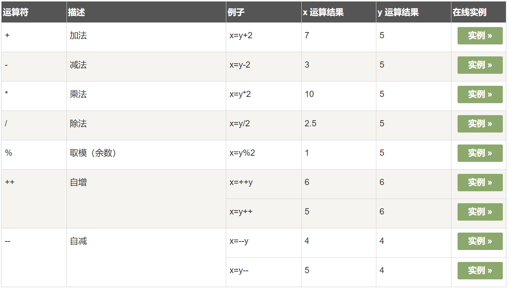
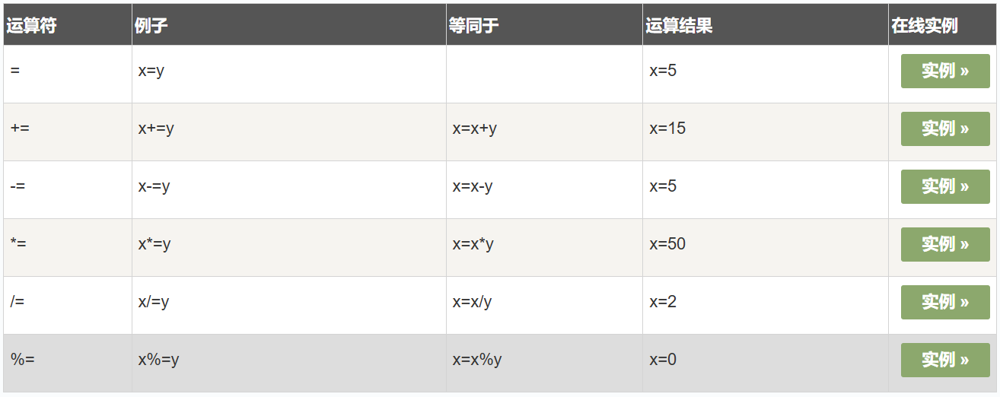

# 运算符


运算符 = 用于赋值。

运算符 + 用于加值。

运算符 = 用于给 JavaScript 变量赋值。

算术运算符 + 用于把值加起来。


```javascript
<!DOCTYPE html>
<html>
	<head>
		<meta charset="utf-8">
		<title>运算符</title>
	</head>
	<body>
		<p>点击按钮计算 x 的值.</p>
		<button onclick="myFunction()">点击这里</button>
		<p id="demo"></p>
		<script>
			function myFunction() {
				y = 5;
				z = 2;
				x = y + z;
				document.getElementById("demo").innerHTML = x;
			}
		</script>
	</body>
</html>
```


## JavaScript算术运算符

与/或值之间的算术运算。y=5，下面的表格解释了这些算术运算符：




## JavaScript 赋值运算符

赋值运算符用于给 JavaScript 变量赋值。

给定 **x=10** 和 **y=5**，下面的表格解释了赋值运算符：



## 用于字符串的 + 运算符

\+ 运算符用于把文本值或字符串变量加起来（连接起来）。

