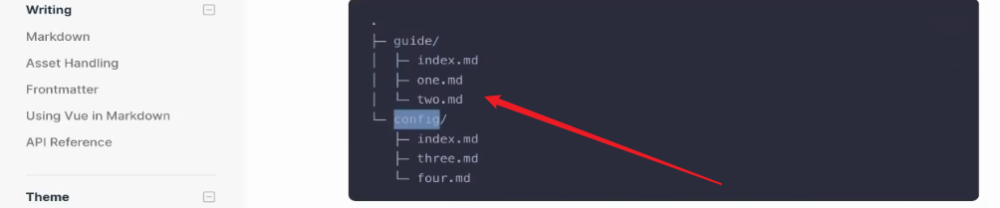

# VitePress安装步骤

## 安装 Node环境

官网下载：https://nodejs.org/zh-cn

傻瓜式安装到完成

##  npm环境

 安装完Node环境之后，可以直接运行下面的命令安装npm

```json
npm install -g pnpm
```

> 关于pnpm源：
>
> 有时候需要国内源，不全的时候又要切换到默认源，比较麻烦，以下提供几个源：
>
> 设置镜像源，可以使用淘宝源
> pnpm config set registry https://registry.npm.taobao.org/
>
> 切回官方镜像
>
> npm config set registry https://registry.npmmirror.com/
>
> 具体的教程可以参考：https://blog.csdn.net/qq_43684588/article/details/134554654

## 初始化项目

新建一个空的目录：`D:\project2024\VitePress`

```json
Anita@Y8100 MINGW64 /d/project2024/VitePress
$ pnpm init    # 初始化目录
Wrote to D:\project2024\VitePress\package.json

{
  "name": "VitePress",
  "version": "1.0.0",
  "description": "",
  "main": "index.js",
  "scripts": {
    "test": "echo \"Error: no test specified\" && exit 1"
  },
  "keywords": [],
  "author": "",
  "license": "ISC"
}

```

## 安装VitePress

```json
Anita@Y8100 MINGW64 /d/project2024/VitePress

这里淘宝源无法下载，我又切回了官方源
$ npm config set registry https://registry.npmmirror.com/

Anita@Y8100 MINGW64 /d/project2024/VitePress
$ pnpm add -D vitepress    # 安装VitePress
Progress: resolved 1, reused 0, downloaded 0, added 0
Progress: resolved 17, reused 0, downloaded 4, added 0
Progress: resolved 58, reused 0, downloaded 14, added 0
Progress: resolved 60, reused 0, downloaded 31, added 0
Progress: resolved 75, reused 0, downloaded 55, added 0
Packages: +85
++++++++++++++++++++++++++++++++++++++++++++++++++++++++++++++++++++++++++++++++
Progress: resolved 123, reused 0, downloaded 82, added 0
Progress: resolved 123, reused 0, downloaded 84, added 52
Progress: resolved 123, reused 0, downloaded 84, added 68
Progress: resolved 123, reused 0, downloaded 84, added 69
Progress: resolved 123, reused 0, downloaded 85, added 85, done
.../esbuild@0.21.5/node_modules/esbuild postinstall$ node install.js
.../node_modules/vue-demi postinstall$ node -e "try{require('./scripts/postinstall.js')}catch(e){}"
.../node_modules/vue-demi postinstall: Done
.../esbuild@0.21.5/node_modules/esbuild postinstall: Done

devDependencies:
+ vitepress 1.2.3

Done in 13.5s

```

## 初始化VitePress

需要注意的是：我习惯用git的命令窗口，上面的步骤都是在git的命令窗口做的，但是到了这一步的时候git命令窗口就会出现问题。所以我切换成了cmd命令窗口

```json
D:\project2024\VitePress>npx vitepress init   # 初始化VitePress

T  Welcome to VitePress!
|
o  Where should VitePress initialize the config?
|  ./docs
|
o  Site title:
|  My Awesome Project
|
o  Site description:
|  A VitePress Site
|
o  Theme:
|  Default Theme + Customization
|
o  Use TypeScript for config and theme files?
|  Yes
|
o  Add VitePress npm scripts to package.json?
|  Yes
|
—  Done! Now run npm run docs:dev and start writing.

Tips:
- Since you've chosen to customize the theme, you should also explicitly install vue as a dev dependency.
```

## 项目目录结构

 **在 `docs` 文件夹中创建 `public` 文件夹，用于存放项目图片** 

```
.
├── docs
│   ├── .vitepress
│   │   └── config.mts
│   ├── api-examples.md
│   ├── index.md
│   ├── markdown-examples.md
│   └── public # 手动增加public文件夹，用于存放项目开发使用的图片
├── package.json
└── pnpm-lock.yaml
```

## 运行项目

```
pnpm run docs:dev


  vitepress v1.2.3

  ➜  Local:   http://localhost:5173/
  ➜  Network: use --host to expose
  ➜  press h to show help

```

这样就部署完成了

## 修改部分

### 站点信息修改

首页部分的修改基本都在`.vitepress/config.mts`,这个文件内修改。

- title  站点名称

- description  描述

### top导航栏修改

继续在`.vitepress/config.mts`这个文件内nav

```
    nav: [
      { text: '首页', link: '/' },
      { text: 'python', link: '/python笔记' },
      { text: '华为HCIE', link: '/华为HCIE' },
      { text: 'Linux运维', link: '/linux运维' },
      { text: '数据库', link: '/数据库databases' },
      { text: '其他', link: '/markdown-examples' }
```

### 左侧菜单栏修改

情况1：点击导航栏，左侧的菜单栏是固定不变的

```js
    nav: [
      { text: '首页', link: '/' },
      { text: 'Python', link: '/python笔记' },
      { text: '华为HCIE', link: '/华为HCIE' },
      { text: 'Linux运维', link: '/linux运维' },
      { text: '数据库', link: '/数据库databases' },
      { text: '其他', link: '/markdown-examples' }
    ],

    sidebar: [
      {
        text: 'Python',
        items: [
          { text: 'Python项目001', link: '/Python项目001' },
          { text: 'Python项目002', link: '/Python项目002' }
        ]
      },
    ],

    sidebar: [
      {
        text: '华为HCIE',
        items: [
          { text: 'Python项目001', link: '/Python项目001' },
          { text: 'Python项目002', link: '/Python项目002' }
        ]
      }

    ]
```

情况2：点击导航栏，每个栏目的左侧菜单栏是不同的

先必须更改目录结构：



## 左侧导航栏的修改

首先在config.mfs中，引入：

- import { route_swc }  from "./sideBar/route_swc";
- sidebar中写入路由

然后新建route_swc.js:

```JS

// 路由与交换:左侧导航栏
export const route_swc = [
    {


      text: "路由与交换基础",
      items: [
        {
          text: "01.route001",
          link: "/HCIE/路由与交换/route001",
        },
        {
          text: "02.route002",
          link: "/HCIE/路由与交换/route002"
        }


      ]
    }
  ];
```


