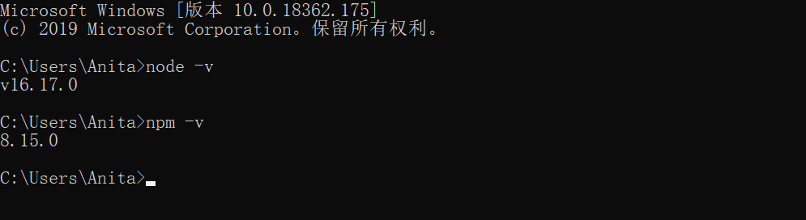
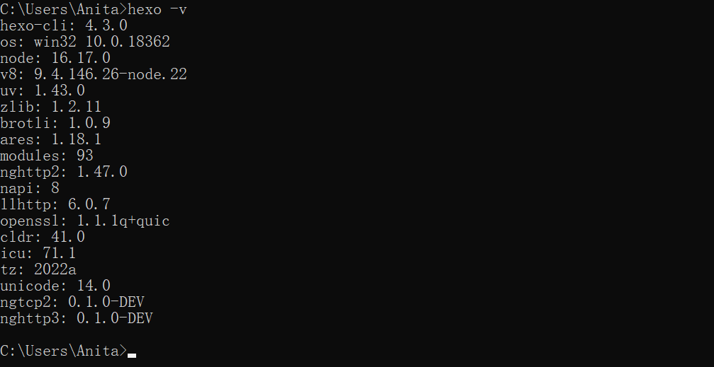
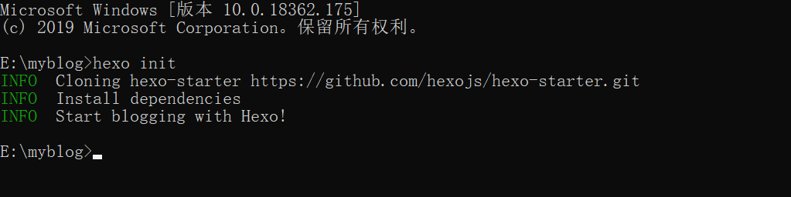
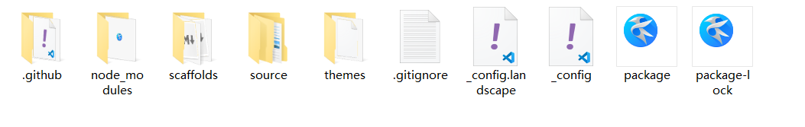
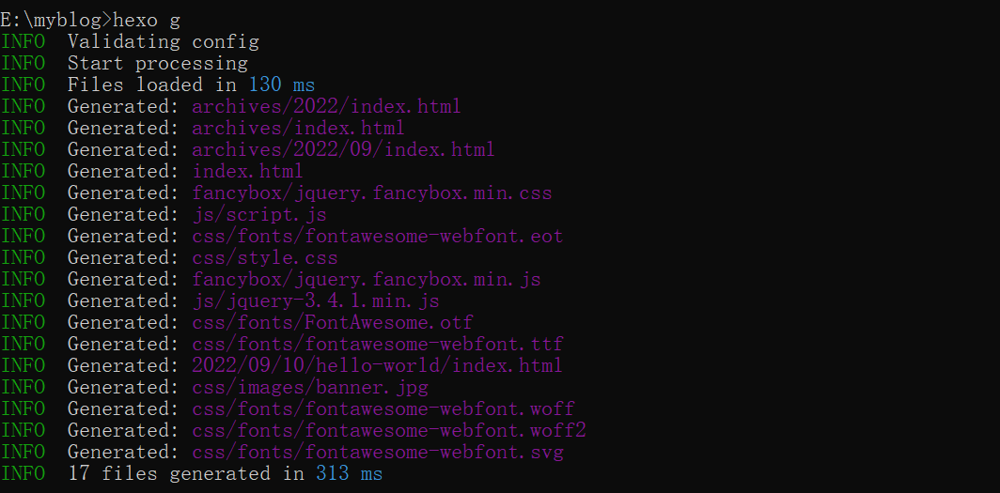
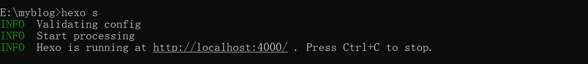
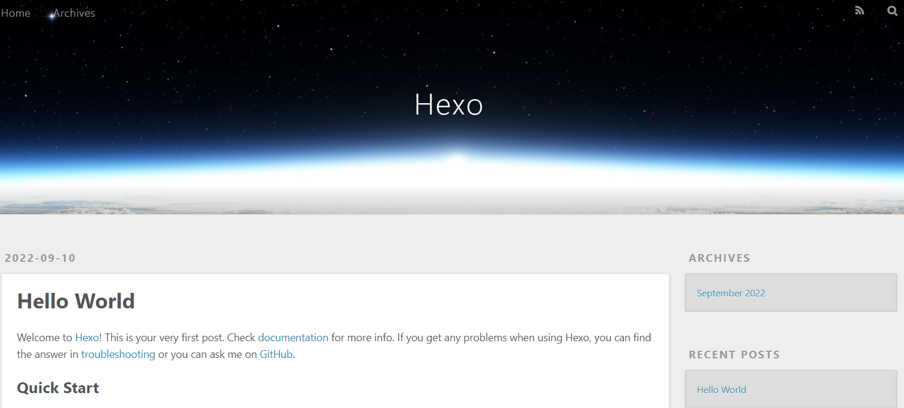

# windows搭建hexo教程


## node.js安装

进入node.js官网（ https://nodejs.org/ ），下载windows平台nodejs环境安装包，找到DOWNLOADS点击，找到Windows Installer 如果为64位电脑可以选择64位版本。点击下载。

安装windows版nodejs，点击下载后的文件安装，然后点next，然后选中同意安装协议，然后点next，建议安装目录改为这样：d:\nodejs\，然后点next，到了下面这一步，建议不要勾选更多组件。我勾选之后一直卡在进度条，然后重新安装了。


安装完成之后用以下命令检测是否安装成功

```bash
PS C:\Users\Anita> node -v
v16.17.0
PS C:\Users\Anita> npm -v
8.15.0
PS C:\Users\Anita> npm root -g
C:\Users\Anita\AppData\Roaming\npm\node_modules
PS C:\Users\Anita>
```

环境变量也会自动加好




## 安装Hexo

执行下面命令进行安装

```
npm install -g hexo-cli
```

安装完验证一下




创建myblog目录并进入，进行初始化。



## 初始化

```bash
E:\myblog>hexo init
INFO  Cloning hexo-starter https://github.com/hexojs/hexo-starter.git
INFO  Install dependencies
INFO  Start blogging with Hexo!

E:\myblog>
```

会在目录中生成下面的文件



- node_modules: 依赖包
- public：存放生成的页面
- scaffolds：生成文章的一些模板
- source：用来存放你的文章
- themes：主题
- _config.yml: 博客的配置文件
- db.json：source解析所得到的
- package.json：项目所需模块项目的配置信息


##  生成静态网页



## 开启本地服务



 

在浏览器输入网址[http://localhost:4000](http://localhost:4000)
就可以查看你的本地博客网页了。 

 如果想关闭本地服务，Ctrl+C 就可以了 或者关闭这个命令窗口。 

