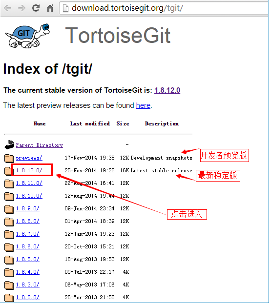
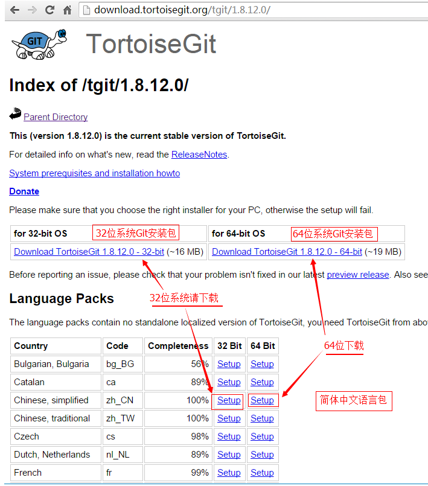
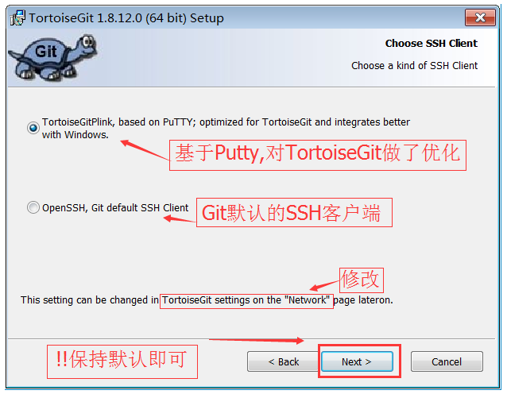
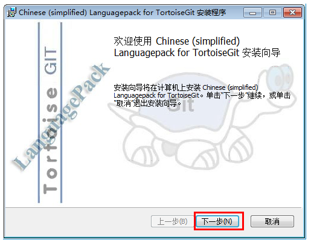
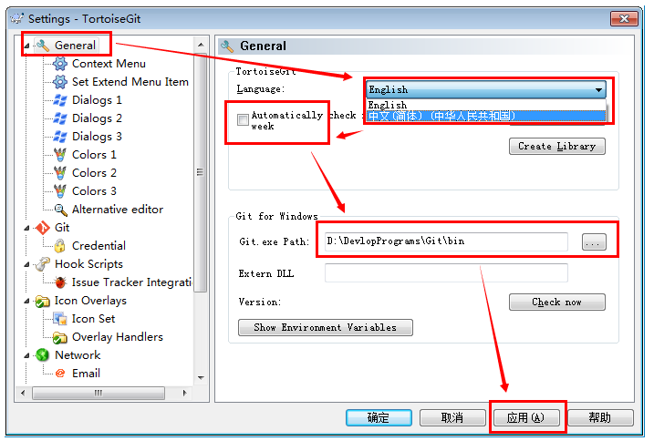
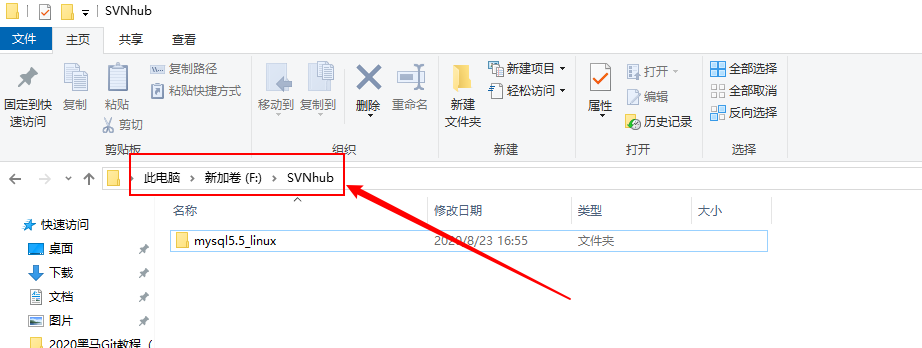
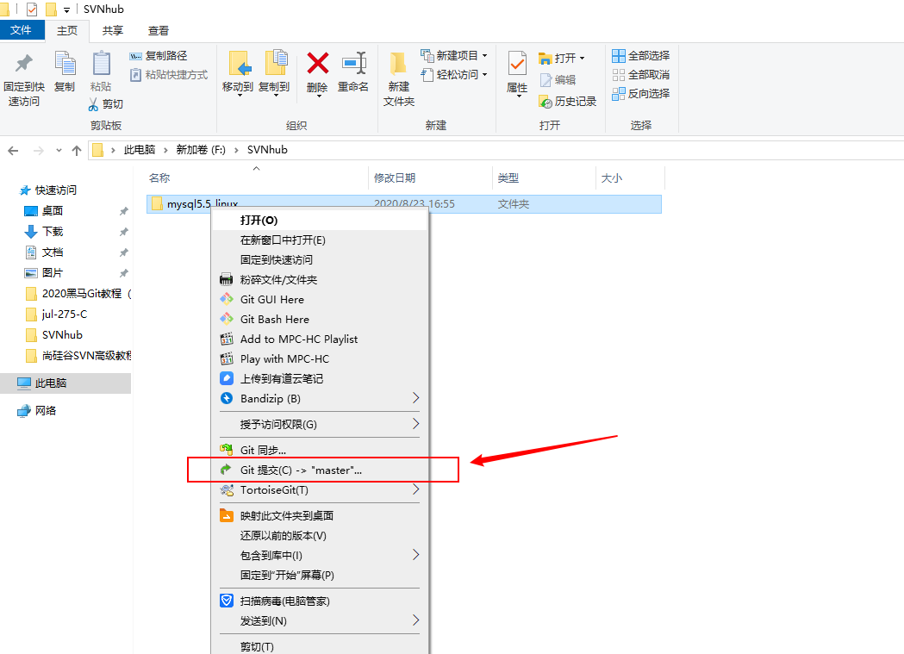
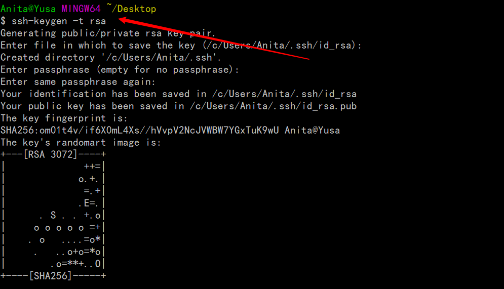
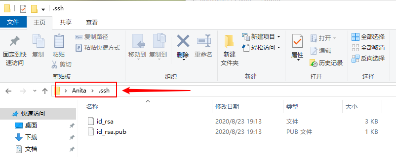

# git和svn的学习


TortoiseGit 简称 tgit, 中文名海龟Git. 海龟Git只支持神器 Windows 系统, 有一个前辈海龟SVN, TortoiseSVN和TortoiseGit都是非常优秀的开源的版本库客户端. 分为32位版与64位版.并且支持各种语言,包括简体中文(Chinese, simplified; zh_CN).

注意: XP系统已经不支持最新的安装包,请尽量使用 Win7 或更高版本的操作系统.

官方说明是: Windows XP 只兼容 1.8.16.0 及之前的版本: (last version which is compatible with Windows XP is 1.8.16.0;

## 下载

TortoiseGit-2.6中文版与Git安装包: https://download.tortoisegit.org/tgit/2.6.0.0/

TortoiseGit下载页面: http://download.tortoisegit.org/tgit/

打开下载页面后, 找到对应的 Latest stable release (最新稳定版) 目录,如当前为 [2.3.0.0版本](https://download.tortoisegit.org/tgit/2.3.0.0/) , 点击进入对应的页面.




3.进入具体版本页面后,根据Windows操作系统版本选择相应的程序安装包和中文语言包.

比如, 32位系统(带32bit,或者 x86, i586等标识).

- 32位程序安装包下载地址: https://download.tortoisegit.org/tgit/2.3.0.0/TortoiseGit-2.3.0.0-32bit.msi
- 32位中文语言包下载地址: https://download.tortoisegit.org/tgit/2.3.0.0/TortoiseGit-LanguagePack-2.3.0.0-32bit-zh_CN.msi

同样, 64位系统(带64bit,或者 x86_64, x64等标识).

- 64位程序安装包下载地址: https://download.tortoisegit.org/tgit/2.3.0.0/TortoiseGit-2.3.0.0-64bit.msi
- 64位中文语言包下载地址: https://download.tortoisegit.org/tgit/2.3.0.0/TortoiseGit-LanguagePack-2.3.0.0-64bit-zh_CN.msi

版本下载页面如下所示:




请下载对应的安装包和语言包,放到某个目录下. 然后像上一节所说的 Git 安装包一样, 查看下载完成的文件属性,解除锁定.

## 安装

 我们需要先安装程序包,然后安装语言包(LanguagePack). 因为TortoiseGit 只是一个程序壳,必须依赖一个 Git Core,也就是上一节我们安装的 Git. 所以安装前请确定已完成[上一节的操作](http://blog.csdn.net/renfufei/article/details/41647875). 下面以64位版本为演示(64,32位除文件名不一样,其他的操作都一致)

双击安装程序 `TortoiseGit-2.3.0.0-64bit.msi`. 弹出安装向导界面:




putty  是没有加密的，所以这里建议使用ssh

安装中文语言包



## 配置

首先,请选定一个存放Git项目的目录,这样管理方便. 如: F:\STUDY\GIT_STUDY , 然后在资源管理器中打开.

在空白处点击鼠标右键, 选择 --> TortoiseGit --> Settings, 然后就可以看到配置界面:




选中General,在右边的 Language中选择中文. 不勾选自动升级的复选框,可能还需要指定 Git.exe 文件的路径,如 "`D:\DevlopPrograms\Git\bin`". 完成后,点击应用,确定关闭对话框.(当然,你也可以继续使用英文)

再次点击鼠标右键,可以看到弹出菜单中已经变成中文. 原来的 Settings 变成 设置; Clone 变为 克隆.

 配置右键菜单. 在设置对话框中,点选左边的"右键菜单",然后在右边将所有的复选框都去掉,这样右键菜单显得比较干净

## 创建本地版本库



创建完目录之后，进入目录。点击右键创建版本库即可。

## 本地仓库中添加文件

如上图，我放了一个MySQL的安装包目录




创建SSH密钥及在git中配置公钥




生成的密钥在当前用户文件夹内的.ssh内

没有后缀的是私钥，有后缀的是公钥




搭建本地SVN

```
yum -y install subversion
mkdir -p /project/demo
svnadmin create /project/demo
cd /project/demo
```

配置

```
cd conf
vim passwd
```

修改文件passwd，设置哪些用户可以访问SVN资源库，

[users]
\# harry = harryssecret
\# sally = sallyssecret
admin = admin
user = 123
user2 = 1234

\# 这样创建了3个用户，以上语句必须顶格写，左侧不能留有空格


查看版本

```
$ git --version
git version 2.28.0.windows.1
```


初始化本地仓库

```
git init
```

