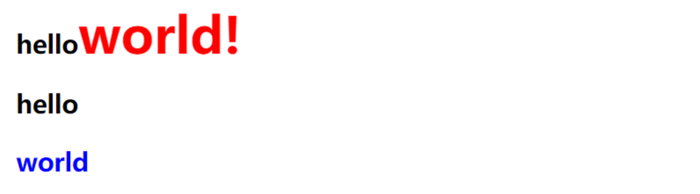
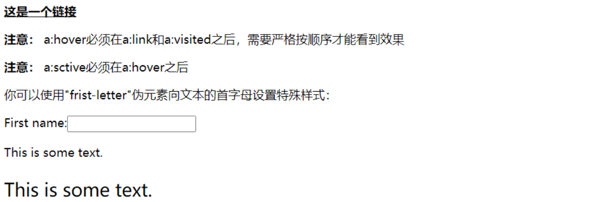

# CSS基础超详解

# css 基础笔记

参考资料：

https://blog.csdn.net/m0_52896041/article/details/128110021

1.css 基础知识

---

### 1.1 基础知识

Css (层叠样式表)是种格式化网页的标准方式， 用于控制设置网页的样式，并且允许 CSS 样式信息与网页内容 (由 HTML 语言定义) 分离的一种技术。

* 格式和结构分离：有利于格式的重用以及网页的修改与维护。
* 精确控制页面布局：对网页实现更加精确的控制，如网页的布局，字体，颜色，背景等。
* 实现多个网页同时更新。

### 1.2 css 基本语法

CSS 的定义是由三部分组成的，包括选择符 (selector)、属性 ( properties)、属性值（value）语法如下：

```
选择器{
    属性1:属性值1;
    属性2:属性值2;
    ……
    }
```

注意：每个属性有一个值，属性和值用冒号隔开。如果要定义不止一一个 “属性: 属性值” 的声明时，需要用分号将每个声明分开，最后一条声明规则可以不加分号（建议每条声明的末尾都加上分号，会减少出错的可能。）

例如：

```
h1{              /*标记选择器h1选中网页的所有<h1>标记*/
color :red;      /*设置文字的颜色属性为红色*/
font-size:14px;  /*设置文字的大小属性为14像素*/
}
```

注意：css 中 /* */ 是注释。

如果属性值由多个单词组成是 需要用引号括起来，例如：

```
h2{
   font-family: 'New Century Schoolbook' ;
}
```

注意：

* 包含空格不会影响 CSS 在浏览器中的工作效果
* CSS 对大小写是不敏感的
* 如果涉及与 HTML 文档一起工作， class 类选择器和 id 选择器对名称的大小写是敏感的。
  需要使用几个属性值进行定义，每个属性值之间用逗号隔开，例如：

```
h2{
     font-family: Times, ' New Century Schoolbook' ，Georgia;
}
```

### 1.3 css 使用方法

主要有四种方法：内嵌样式、内部样式、使用 `<link> `标记链接外部样式表、使用 `CSS 的 @import `标记导入外部样式文件。

#### 1.3.1 内嵌样式

内嵌样式指将 CSS 规则混合在 HTML 标记中使用的方式。CSS 规则作为 HTML 标记 style 属性的属性值。例如:

注意：内嵌样式只対其所在的标记起作用，其他的同类标记不受影响。不建以使用这种方法。

#### 1.3.2 内部样式

内嵌样式只能定义某一个标记的样式，如果要对整个网页文档的某个标记进行特定样式定义时，就需要使用内部样式。内部样式一般是在 `<head> `标记中并使用`< style >`标记进行定义。语法格式如下所示:

```
<style type="text/css">
    选择器{
      属性:属性值;
          属性:属性值;
          ……
        }
 </style>
```

例如：

```html
<!DOCTYPE html>
<html>
<head>
<meta charset="utf-8">
<meta >
 <title>样式使用</title>
<style type="text/css">
     #p{
      color: red;
         font-size: 28px;
     }

</style>
</head>
<body>
<a href="http://www.taobao.com">淘宝</a> <br>
<a href="http://www.taobao.com" >淘宝</a>
</body>

</html>
```

#### 1.3.3 外部样式

外部样式是将样式表以单独的文件 (文件后缀一般为. css) 存放，让网站的所有网页通过 < link > 标记均可引用此样式文件。

优点：

* 降低网站的维护成本
* 让网站拥有统一的风格。

注意：`<link> `标记一般放到页面的 < head > 区域内。使用` < link >` 标记引人外部样式文件的语法格式如下:

```
<link rel="stylesheet" type="text/css" href=" 样式表源文件地址:">
```

- `href` 属性中的外部样式文件地址的填写方法和超链接的链接地址的写法一样;
- `rel="stylesheet"` 的作用是告诉浏览器链接的是一个样式表文件，是固定格式;
- `type="text/css" `表示传输的文本类型为样式表类型文件，也是固定格式。

例如：

```
<!DOCTYPE html>
<html>
<head>
 <meta charset="utf-8">
 <meta >
 <title>样式使用</title>
</head>
 <link rel="stylesheet" type="text/css" href="css3-3.css">
<body>
 <a href="http://www.taobao.com">淘宝</a> <br>
 <a href="http://www.taobao.com" >淘宝</a>
</body>
</html>
```

外部样式文件：

```
#p{
  color:red;
  font-size:20px;
}
```

内嵌样式、内部样式、外部样式之间的本质区别:
(1) 外部样式用于定义整个网站样式。
(2) 内部样式用于定义整个网页样式。
(3) 内嵌样式用于定义某个标记样式。

#### 1.3.4 使用import 引入外部样式

格式：`@import url(样式表源文件地址)`

注意：`@import `只能放在 `<style>` 标记内使用，而且必须放在其他 CSS 样式之前。其中，urI 为关键字，不能随便更改。

例如：

```
<!DOCTYPE html>
<html>
<head>
 <meta charset="utf-8">
 <meta >
 <title>样式使用</title>
 <style type="text/css">
     @import url("css3-3.css")
 </style>
</head>
<body>
<a href="http://www.taobao.com">淘宝</a> <br>
 <a href="http://www.taobao.com" >淘宝</a>
</body>
</html>
```

外部样式文件：

```
#p{
  color:red;
  font-size:20px;
}
```

#### 1.3.5 叠层样式优先级

CSS 层叠样式表中的层叠指样式的优先级，当内嵌样式、内部样式、外部样式都对某个 HTML 标记进行了样式定义，即当样式定义发生冲突时，以优先级高的为最终显示效果。

浏览器会按照不同的方式来确定样式的优先级，其原则如下:

- 按照样式来源不同，其优先级: 内嵌样式 > 内部样式 > 外部样式 > 浏览器默认样式
- 按照选择器不同，其优先级:<mark>id 选择器>class 类选择器 > 元素选择器</mark>
- 当样式定义的优先级相同时，取后面定义的样式。

#### 1.3.6 注释

注释用来说明所写代码的含义，对读者读懂这些代码很有帮助。CSS 用 C/C++ 的语法进注释，其中 “/ *” 放在注释的开始处，“* /” 放在结束处。

例如:

```
h1{              /*标记选择器h1选中网页的所有<h1>标记*/
color :red;      /*设置文字的颜色属性为红色*/
font-size:14px;  /*设置文字的大小属性为14像素*/
}
```

2.CSS 选择器

---

### 2.1 元素选择器

元素选择器最常见的是 CSS 选择器，又称为类型选择器。

元素选择器基本语法格式如下：

```
HTML元素名{
     样式属性:属性值;
     样式属性:属性值;
     ……
}
```

**实例：**

```
h2{
 color:blue;
 font-size:26px;
}
```

**例如：**

```html
<!DOCTYPE html>
<html>
<head>
    <meta charset="utf-8">
    <meta >
    <title>元素选择器</title>
    <style type="text/css">
        h2{
            color: red;
        }
        span{
            color: blue;
            font-size: 48px;
        }
    </style>
</head>
<body>
     <h2>hello</h2>
     <h3>hello</h3>
     <span>hello</span>
</body>
</html>
```

### 2.2 类选择器

元素选择器可以设置网页中所有相同标记的统一格式，但如果需要对相同标记中某些个别标记做其他效果设置时，使用 HTML 元素标记就无法实现。  类 (class) 选择器允许以一种独立于文档元素的方式来指定样式。该选择器可以单独使用，也可以与其他元素结合使用。语法格式如下所示:

```html
.类选择器名称{
     样式属性:属性值;
     样式属性:属性值;
     ……
}
```

注意: 类选择器的定义是以英文圆点开头。类选择器的名称可以任意 (但是不能用中文) 但最好以驼峰方式命名。

类选择器的使用语法格式如下：

```html
< 标记名称 class="类选择器名称1 类选择器名称2 ..."
```

例如：

```html
<div class="myBoxColor myBoxBackground"> </div>
```

这里定义了两个类选择器, 在 HTML 的 div 标记使用这两个类选择器，在使用两个以上的类选择器时，其名称之间要用空格分隔，最终这两选择器定义的样式会叠加，并在 div 标记中呈现。如果在两个类选择器中都对同一个样式属进行了样式定义，则最后定义的样式起作用。

**例：**

```html
<!DOCTYPE html>
<html>
<head>
    <meta charset="utf-8">
    <meta >
    <title>类选择器</title>
    <style type="text/css">
        .p1{
            color: red;
            font-size: 25px;
        }
        .p2{

            font-size: 36px;
            text-decoration: underline;
            color: green;
        }
    </style>
</head>
<body>
    <h2 class="p1">hello</h2>
    <h2 class=p2>hello</h2>
</body>
</html>
```

**结果：**


### 2.3 ID 选择器

ID 选择器类似于类选择器，但也有一些差别。

相同点：类选择器和 ID 选择器在定义和使用时都是区分大小写。

主要区别：
(1)定义上 ID 选择器前面使用 “#” 号，而不是类选择器的点。

(2) ID 选择器在引用时不是通过 class 属性， 而是使用 id 属性。
(3) 在一个 HTML 文档中，ID 选择器仅允许使用一次，而类选择器可以使用多次。
(4) ID 选择器不能结合使用，因为 ID 属性不允许有以空格分隔的词列表。

ID 选择器的语法格式：

```
#ID选择器名称{
 样式属性:属性值;
 样式属性:属性值;
 ......
}
```

使用 ID 选择器的语法格式如下所示:

```
<标记名称id="ID选择器名称" >

```

**例如：**

```
<!DOCTYPE html>
<html>
<head>
    <meta charset="utf-8">
    <meta >
    <title>类选择器</title>
    <style type="text/css">
        #p1{
            color: red;
            font-size: 25px;
        }
        #p2{

            font-size: 36px;
            text-decoration: underline;
            color: green;
        }
    </style>
</head>
<body>
    <h2 id="p1">hello</h2>
    <h2 id=p2>hello</h2>
</body>
</html>
```

**结果：和类选择器运行一样**

### 2.4 包含选择器

包含选择器又称后代选择器，该选择器可以选择作为某元素后代的元素。

语法格式：

```html
祖先选择器 后代选择器{
     样式属性: 属性值;
     样式属性: 属性值;
     ......
}
```

注意：祖先选择器和后代选择器之间必须用空格进行分隔。祖先选择器可以包括一个或多个用空格分隔的选择器。

例如：

```html
h2 p span{ color:red; font-size:28px; }
```

**例：**

```html
<!DOCTYPE html>
<html>
<head>
    <meta charset="utf-8">
    <meta >
    <title>包含选择器</title>
    <style type="text/css">
        h2 span{
            color: red;
            font-size: 48px;
        }

    </style>
</head>
<body>
    <h2>hello <span>word!</span></h2>
    <h3>hello <span>word!</span></h3>
    <h4>hello <span>word!</span></h4>
    <span>world</span>
</body>
</html>
```

**结果：**


### 2.5 组合选择器

组合选择器也称为并集选择器，是各个选择器通过逗号连接而成的，任何形式的选择器 (包括标记选择器、类选择器及 id 选择器等) 都可以作为组合选择器的一部分。

组合选择器的语法格式如下:

```
选择器1，选择器2，.... ,选择器n{
 样式属性:属性值;
 样式属性:属性值;
 ......
}
```

**例如：**

```html
<!DOCTYPE html>
<html>
<head>
    <meta charset="utf-8">
    <meta >
    <title>组合选择器</title>
    <style type="text/css">
        p,h2,span{
            color: red;
            font-size: 28px;
        }
    </style>
</head>
<body>
    <h2>hello</h2>
    <h3>hello world!</h3>
    <h4>hello world!</h4>
    <h5>hello world!</h5>
    <span>world</span>
    <p>hello</p>

</body>
</html>
```

**结果：**


### 2.6 父子选择器

不选择所有后代，只选择某个元素的子元素。父子选择器使用大于号作为选择器的分隔符。格式如下：

```html
父选择器>子选择器{
 样式属性:属性值;
 样式属性:属性值;
 ......
}
```

注意：父选择器包含子选择器，样式只能作用在子选择器上，而不能作用到父选择器上。

**例如：**

```html
<!DOCTYPE html>
<html>
<head>
    <meta charset="utf-8">
    <meta >
    <title>父子选择器</title>
    <style type="text/css">
        h2 span{
            color: blue;
        }
        h2>span{
            color: red;
            font-size: 48px;
        }
    </style>
</head>
<body>
    <h2>hello<span>world!</span></h2>
    <h2>hello <p><span>world</span></p></h2>
</body>
</html>
```

**结果：**



### 2.6 相邻选择器

> 如果需要选择紧接在某一个元素后的元素， 并且二者有相同的父元素，可以使用相邻选择器。相邻选择器使用加号作为选择器的分隔符，其语法格式如下:
>
> ```
> 选择器1+选择器2 {
>     样式属性:属性值;
>     样式属性:属性值;
>     ......
> }
> ```

**例如：**

```html
<!DOCTYPE html>
<html>
<head>
    <meta charset="utf-8">
    <meta >
    <title>相邻选择器</title>
    <style type="text/css">
        h2+span{
            color: red;
            font-size: 48px;
        }
    </style>
</head>
<body>
    <h2>hello<span>hello</span></h2>
    <span>hello</span>
    <span>hello</span>
</body>
</html>
```

**结果：**


### 2.8 属性选择器

属性选择器是 CSS3 选择器，其主要作用是对带有指定属性的 HTML 元素进行样式设置。

语法格式如下:

```
标记名称[属性选择符] {
 样式属性:属性值;
 样式属性:属性值;
 ......
}
```

例如：定义具有 href 属性的超链接元素，让文字显示为红色，语法格式如下:

```
a[href] {
 color:red;
}
```

|选择器|说明|
| -------------------| ----------------------------------------------------------|
|[attribute]|用于选取带有指定属性的元素|
|[attribute~ =value]|用于选取属性值中包含指定词汇的元素|
|[attribute=value]|用于选取带有指定属性和属性值的元素|
|[attribute\|=value]|用于选取带有以指定值开头的属性值的元素，该值必须是整个单词|
|[attribute^=value]|匹配属性值以指定值开头的每个元素|
|[attribute$=value]|匹配属性值以指定值结尾的每个元素|
|[attribute*=value]|匹配属性值中包含指定值的每个元素|

**例如：**

```html
<!DOCTYPE html>
<html>
<head>
    <meta charset="utf-8">
    <meta >
    <title>属性选择器</title>
    <style type="text/css">
        p[align]{
            color: red;
            font-size: 38px;
        }
        p[align=right]{
            color: blue;
            font-size: 24px;
        }
    </style>
</head>
<body>
    <p align="center"> hello </p>
    <p align="right"> world </p>
</body>
</html>
```

**结果：**


### 2.9 通用选择器

>  通用选择器的作用就像是通配符，匹配所有可用元素。
>
> 语法格式如下：
>
> ```
> *{
>     样式属性:属性值;
>     样式属性:属性值;
>     ......
> }
> ```
>
> 注意：* 代表所有

**例如：**

```html
<!DOCTYPE html>
<html>
<head>
    <meta charset="utf-8">
    <meta >
    <title>通用选择器</title>
    <style type="text/css">
        *{
            color: red;
            font-size: 36px;
        }
    </style>
</head>
<body>
    <h5>hello</h5>
    <p> world</p>
    <span>hello world</span>
</body>
</html>
```

**结果：**


3.CSS 基本属性

---

### 3.1 字体属性

|字体属性|说明|
| :----------: | -----------------------------------------------------------------------------------------------------------------------------------------------|
|属性|说明|
|font|简写属性。把所有针对字体的属性设置在一个声明中|
|font-size|设置字体的尺寸。常用单位为像素(px)|
|font-style|设置字体风格。Normal 为正常; italic 为斜体; oblique 为倾斜|
|font weight|设置字体的粗细。Normal 为正常; lighter 为细体; bold 为粗体; bolder 为特粗体|
|font- family|设置字体系列。例如“隶书”等，当指定多种字体时，用逗号分隔，如果浏览器不支持第一个字体，则会尝试下一个字体;当字体由多个单词组成时由双引号括起来|

**例如：**

```html
<!DOCTYPE html>
<html>
<head>
    <meta charset="utf-8">
    <meta >
    <title>字体属性</title>
    <style type="text/css">
        #p1{
            font-family: Times New Roman,serif;         
            /*设置字体类型*/
            font-size: 28px;
            /*设置字体大小*/
            font-weight: bold;
            /*设置字体粗细*/
        }
        #p2{
            font-family:Arial,sans-serif; 
            font-size:20px;
            font-style: italic;
            /*设置字体风格*/
            font-weight:lighter;
        }
        #p3{
            /*设置字体倾斜、加粗、大小为24像素，行高为36像素，字体为arial,sans-serif*/
            font:oblique bold 24px/36px arial,sans-serif;
        }
    </style>
</head>
<body>
    <p id=p1>hello world1</p>
    <p id="p2">hello world2</p>
    <p id="p3">helllo world3</p>
</body>
</html>
```

**结果：**


### 3.2 文本属性

文本属性包括阴影效果、大小写、文本缩进、对齐方式等等。

|属性|说明|
| :--------------| --------------------------------------------------------------------------------------------------------------------------|
|color|设置文本颜色。|
|direction|设置文本方向|
|letter-spacing|设置字符间距，就是字符与字符之间的空白。其属性值可以为不同单位的数值，并且允许使用负值，默认值为normal|
|line-height|设置行高，单位为像索。此属性在用于进行文字垂直方向对齐时，属性值与height属性值的设置相同|
|text-align|设置文本内容的水平对齐方式。left 为左对齐( 默认值)，center 为居中对齐，right为右对齐|
|text-decoration|向文本添加修饰。none 为无修饰(默认值)，underline 为下划线，overline 为上划线，line-through为删除线|
|text-overflow|设置对象内溢出的文本处理方法。clip 为不显示溢出文本，ellipsis 为用省略标记"..."标示溢出文本|
|text-indent|设置首行文本的缩进|
|text-transform|控制文本转换。none为不转换(默认值)，capitalize 为首字母大写。uppercase为全部字符转换成大写，lowercase 为全部字符转换成小写|
|text-shadow|设置文本阴影|
|unicode-bidi|设置文本方向|
|word-spacing|设置字间距。只针对英文单词|
|white-space|设置元素中空白的处理方式|

例如：

```html
<!DOCTYPE html>
<html>
<head>
    <meta charset="utf-8">
    <meta >
    <title>文本属性</title>
    <style type="text/css">
        #one{
            text-align: center;
            /*文字左对齐*/
            word-spacing: 30px;
            /*单词之间的间距为30像素*/

        }
        #two{
            text-align: center;
            /*文字居中对齐*/
            word-spacing: -10px;
            /*单词之间的间距为-15像素*/
        }
        #three{
            text-align: center;
            /*文字右对齐*/
            letter-spacing: 5px;
            /*字母之间距离为28个像素*/
            text-decoration: underline;
            /*文字修饰：加下划线*/
            text-transform: uppercase;
            /*文字全部大写*/
        }
    </style>
</head>
<body>
    <p id=one>hello  world</p>
    <p id="two">hello  world</p>
    <p id="three">hello  world</p>
</body>
</html>
```

**结果：**


text-shadow 属性是 css3 的属性，是向文本添加一个或多个阴影，该属性是用逗号分割的阴影列表，每个阴影由两个或三个长度值和一个可选的颜色值进行规定， 省略的长度是0语法格式定义如下:

```html
text- shadow: h-shadow v-shadow blur color[,h- shadow v-shadow blur cglore];
```

其中，h-shadow 是必须定义的，表示水平阴影的位置，如果是正值则表示阴影向右位移的距离，如果是负值则表示阴影向左位移的距离: v-shadow 是必须定义的，表示垂直阴影的位置，如果是正值则表示阴影向下位移的距离，如果是负值则表示阴影向上位移的距离; blur 是可选项，表示阴影的模糊距离; color 是可选项，表示阴影的颜色。

**例如：**

```html
<!DOCTYPE html>
<html>
<head>
    <meta charset="utf-8">
    <meta >
    <title>文本属性</title>
    <style type="text/css">
        h2{
            font-size: 50px;
            font-family: 黑体;
            text-shadow: red 6px -6px 6px,yellow 16px -16px 10px;
        }
    </style>
</head>
<body>
    <h2>hello world</h2>
</body>
</html>
```

**结果：**


### 3.3 背景属性

#### 3.3.1 常见背景属性

CSS 背景属性主要用于设置对象的背景颜色、背景图片、背景图片的重复性、背景图片的位置等

|常见的背景属性及说明||
| :-------------------: | ----------------------------------------------------------------------------------------------------------------------------------|
|属性|说明|
|background|简写属性，将背景的所有属性设置在一个声明中|
|background-attachment|设置背景图像是否固定或者随着页面的其余部分滚动。scroll指背景图像随内容滚动; fixed 指背景图像不随内容滚动|
|background-color|设置元素的背景颜色（不能继承，默认值是transparent“透明”）|
|background-image|把图像设置为背景|
|background-position|设置背景图像的起始位置。left 为水平居左，right 为水平居右，center 为水平居中或垂直居中，top 为垂直靠上，bottom为垂直靠下或精确的值|
|background-repeat|设置背景图像是否重复及如何重复。repeat-x 为横向平铺; repeat-y 为纵向平铺; norepeat 为不平铺; repeat 为平铺背景图片，该值为默认值|

background-clip 属性规定背景的绘制区域，该属性是 CSS3 的属性，主要用于设置背景图像的裁剪区域，其基本语法格式是:

```
background-clip : border-box|padding-box|content-box;
```

其中，border-box 是默认值，表示从边框区域向外裁剪背景; padding-box 表示从内边距区域向外裁剪背景; content-box 表示从内容区域向外裁剪背景。

**例如：**

```html
<!DOCTYPE html>
<html>
<head>
 <meta charset="utf-8">
 <meta >
 <title>背景裁剪属性</title>
 <style type="text/css">
     div{
         width: 400px;             /*设置div块宽度为400px*/
         height: 230px;                 /*设置div块高度为230px*/
         padding: 25px;             /*设置div块内边距为25px*/
         background-color: #00ff00;     /*设置div块背景颜色*/
         background-clip: content-box;     /*设置div块裁剪属性为从内容区域向外裁剪*/
         border: 10px solid black;      /* 设置div块边框为10px、实心线、黑色*/
     }
 </style>
</head>
<body>
 <div>
     hello world hello world hello world hello world hello world hello world hello world hello world hello world hello world hello world hello world hello world hello world hello world hello world hello world hello world hello world hello world hello world hello world hello world hello world hello world hello world hello world hello world hello world hello world hello world hello world hello world hello world hello world hello world hello world hello world hello world hello world hello world hello world hello world hello world 
 </div>
</body>
</html>
```

结果：


#### 3.3.2 css3 背景渐变属性

CSS3 的渐变属性可以使两个或多个指定的颜色之间显示平稳的过渡，CSS3 定义两种类型的渐变: 一种是线性渐变， 即向下 / 向上 / 向左 / 向右 / 对角方向; 另一种是径向渐变，及由中心定义。

**1. 线性渐变**

必须至少定义两种颜色节点

语法格式如下:

```
background:linear-gradient(direction, color-stop1, color-top2,...)
```

其中，direction 指明线性渐变的方向。默认是从上到下。

**例: 从顶部开始的线性渐变，起点是红色，慢慢过渡到黄色:**

```
background: linear-gradient(red, yellow);

```

**从左到右的线性渐变:**

```
background: linear-gradient(to right, red, yellow);

```

**例：从左上角开始到右下角的线性渐变。起点是红色，慢慢过渡到黄色:**

```
blackground: linear-gradient(to bottom right, red ，yellow);

```

渐变方向上可以做更多的控制，可以定义一个 角度，而不用预定义方向 (to bottom、to top、 to right、to left、to bottom right, 等等)。

**例：45 度的线性渐变。起点是红色， 慢慢过渡到黄色:**

```
background: linear-gradient(45deg, red 30%， yellow 70%)

```

**2. 径向渐变**

必须至少定义两种颜色节点

shape 参数定义形状，其值可以是 circle 或 ellipse。其中，circle 表示圆形，ellipse 表示椭圆形。默认值是 ellipse。

例如：

```
background: radial-gradient(circle, red, yellow, green);

```

默认情况下：渐变的形状是 ellipse，渐变的大小是 farthest-corner (表示到最远的角落) 其定义的基本语法如下:

```
background:radial-gradient(shape,start-color,..., last-color);

```

**3. 重复径向渐变**

 repeating-radial-gradient() 函数用于重复径向渐变，该函数的所有参数及语法与径向渐变相同。

**例：**

```html
<!DOCTYPE html>
<html>
<head>
    <meta charset="utf-8">
    <meta >
    <title>背景</title>
    <style type="text/css">
        *{
            padding: 0;
        }
        #box1{
            width: 100px;
            height: 100px;
            border-radius: 50%;              /*  设置DIV块的边框半径为50%，即圆*/
            /*div球背景色渐变从左上到右下，即45度，其中红色占30%，黄色占60%*/
            background-image: linear-gradient(45deg,#f00 30%,#ff0 60%);
        }
        #box2{
            width: 100px;
            height: 100px;
            border-radius: 50%;
            /*背景重复径向渐变，圆形，且有红黄蓝三色*/
            background-image: repeating-radial-gradient(circle at 50% 50%,red,yellow 10%,blue 15%);
        }
        #box3{
            width: 100px;
            height: 100px;
            background: linear-gradient(45deg,red 30%,yellow 70%);
        }

    </style>
</head>
<body>
    <div id="box1"></div>
    <div id="box2"></div>
    <div id="box3"></div>
</body>
</html>
```

**结果：**


### 3.4 边框属性

CSS 边框属性可以设置对象边框的颜色、样式以及宽度。使用对象的边框属性之
必须先设定对象的高度及宽度。语法格式如下：

```
border :边框宽度 边框样式 边框颜色
```

注意：border-width 属性可以单独设置边框宽度; border-style 属性可以单独设边框样式; border-color 属性可以单独设置边框颜色。

|边框样式的取值及说明||||
| :------------------: | ----------------------------| --------| ----------------|
|边框样式|说明|边框样式|说明|
|none|无边框，无论边框宽度设为多大|ridge|菱形边框|
|double|双线边框|dashed|虚线边框|
|hidden|隐藏边框|solid|实线边框，默认值|
|groove|3D凹槽边框|inset|3D内嵌边框|
|dotted|点线边框|outset|3D凸边框|

例如：

```html
<!DOCTYPE html>
<html>
<head>
    <meta charset="utf-8">
    <meta >
    <title>边框样式</title>
    <style type="text/css">
        p.dotted {border-style: dotted;}
        p.dashed{border-style: dashed;}
        p.solid {border-style:solid ;}
        p.double {border-style:double ;}
        p.groove{border-style: groove;}
        p.ridge{border-style:ridge ;}
        p.inset {border-style:inset ;}
        p.outset {border-style: outset;}
    </style>
</head>
<body>
    <p class="dotted">A dotted border</p>
    <p class="dashed">A dashed border</p>
    <p class="solid">A solid border</p>
    <p class="double">A double border</p>
    <p class="groove">A groove border</p>
    <p class="ridge">A ridge border</p>
    <p class="inset">An inset border</p>
    <p class="outset">An outset border</p>
</body>
</html>
```

**结果：** 


在 CSS3 中可以通过 border-radius 属性为元素增加圆角边框，语法如下:

```
border-radius :像素值|百分比
```

**例如：**

```html
<!DOCTYPE html>
<html>
<head>
    <meta charset="utf-8">
    <meta >
    <title>边框样式</title>
    <style type="text/css">
        #circle{
            width: 110px;
            height: 110px;
            border-radius: 50%;          
            border: 10px solid red;
            background: yellow;
        }
        #circle2{
            width: 110px;
            height: 110px;
            border-radius: 30px;   
            border: 10px solid red;
            background: yellow;
        }
    </style>
</head>
<body>
<div id="circle"></div>
<div id="circle2"></div>

</body>
</html>
```

**结果：** 


### 3.5 列表属性

常用的列表属性: `list-style-type `、`list-style-image`、 `list-style-position` 以及 `list-style`

- `list-style-type` 属性用于设置列表项标记的类型，主要有 disp (实心圆)、circle (空心圆)、square (实心方块)、none (不使用项目符号) ;
- `list-styl-image` 属性用于设置使用什么图像作为列表符号;
- `list-style-position` 属 t 用来指定列表符号的显示位置，当值为 outside 时， 表示将列表符号放在文本块之外，该值为默认值，当值为 inside 时，表示将列表符号放在文本块之内。

例: 制作一个横向导航菜单

```html
<!DOCTYPE html>
<html>
<head>
    <meta charset="utf-8">

    <title>列表样式</title>
    <style type="text/css">
        #box{
            background-color: pink;           /*设置背景颜色*/
            margin: 0 auto;                  /*设置div块的标记自动水平居中*/
            height: 40px;                   /*  设置高度属性为40像素*/
        }
        #box ul{
            list-style: none;                     /*   设置列表显示风格为无，即不显示类表标记*/
        }
        #box ul li{
            width: 80px;
            height: 40px;
            text-align: center;    /* 设置列表元素内的文字水平方向居中*/
            line-height: 40px;     /* 设置列表元素内的文字垂直方向居中*/
            float: left;           /* 设置列表元素浮动，目的是把列表元素水平排列*/
        }
        #box ul li.strong{
            font-weight: bold;     /*设置选中列表元素内的文字加粗显示*/
        }
        #box ul li:hover{          /*  鼠标指针放到li标记时Li所显示的样式*/
            background-color: red;     
             cursor: pointer;         /*设置鼠标指针为手性*/

        }
        #box ul li a{            /*选中#BOX内的ul内的所有a标记*/
            text-decoration: none;    /*超链接指针文字无下划线*/

        }
        #box ul li:hover a{          /*选中鼠标所在的li元素上的a标记*/
            text-decoration: underline;       /*超链接指针文字有下划线*/
        }
    </style>
</head>
<body>
    <div id="box">
    <ul>
    <li>机票</li>
    <li>火车票</li>
    <li>汽车票</li>
    <li>船票</li>
    </ul>
    </div>
</body>
</html>
```

结果：


### 3.6 鼠标属性

 CSS 中可以通过鼠标指针的 cursor 属性设置鼠标指针的显示图形，语法格式如下：

```
cursor:鼠标指针样式;
```

|cursor属性的取值和说明||||
| :--------------------: | ------------| ---------| --------------|
|crosshair|十字准线|s-resize|向下改变大小|
|pointer \| hand|手形|e-resize|向右改变大小|
|wait|表或沙漏|w-resize|向左改变大小|
|help|问号或气球|ne-resize|向上右改变大小|
|no-drop|无法释放|nw-resize|向上左改变大小|
|text|文字或编辑|se-resize|向下右改变大小|
|move|移动|sw-resize|向下左改变大小|
|n-resize|向上改变大小|||

4.伪类和伪元素

---

### 4.1 伪类

CSS 引入伪类和伪元素的概念是为了实现基于文档树之处的信息的格式化。

伪类和伪元素的区别是:

* 为类的操作对象是文档树中已有的元素，而伪元素创建了一个文档树之外的元素。
* CSS3 规范中要求使用双冒号 (::) 表示伪元素，以此来区分伪元素和伪类。
* IE8 及以版本的一些浏览器不兼容双冒号 (::) 表示方法、所以除了少部分伪元素: 其余伪元素既司使用单冒号(:)，也可以使用双冒号(::)。

伪类是一种特殊的类选择符，是能够被支持 CSS 的浏览器自动识别的特殊选择符.

最大的用途是为超链接定义不同状态下的样式效果。

伪类的语法是在原有选择符后加一个伪类，格式如下:

```
选择器:伪类{
 属性:属性值;
 属性:属性值;
 ......
}
```

注意：伪类是在 CSS 中已经定义好的，不能像类选择符那样使用其他名字。

常用的伪类如下:

1. 表示状态

* :link: 选择未访问的链接。
* :visited: 选择已访问的链接。
* :hover: 选择鼠标指针移人链接。
* :active: 被激活的链接，即按下鼠标左键但未松开。
* :focus: 选择获取焦点的输人字段。

2. 结构化伪类

* :not: 否定伪类，用于匹配不符合参数选择器的元素。
* :first-child: 匹配元素的第一个子元素。
* :last-child: 匹配元素的最后一个子元素。
* :first-of-type: 匹配属于其父元素的首个特定类型的子元素的每个元素。
* :last-of-type: 匹配元素的最后一个子元素。
* :nth-child: 根据元素的位置匹配一个或者多个元素，并接受一个 an+b 形式的参数 (an+b 最大数为匹配元素的个数)。
* :nth-last-child: 与: nth-child 相似，不同之处在于是从最后一个子元素开始计数的。
* :nth-of-type: 与 nth-child 相似，不同之处在于只匹配特定类型的元素。
* :nth-last-type: 与 nth-of-type 相似，不同之处在于是从最后一个子元素开始计数的。
* :only-child: 当元素是其父元素中唯一一个子元素时，:only-child 匹配该元素。
* :only-of-type: 当元素是其父元素中唯一一个特定类型的子元素时，:only-child 匹 C 配该元素。
* :target: 当 URL 带有锚名称，指向文档内某个具体元素时，:target 匹配该元素。

3. 表单相关伪类

* :checked: 匹配被选中的 input 元素， 这个 input 元素包括 radio 和 checkbox。
* :default: 匹配默认选中的元素，例如，提交按钮总是表单的默认按钮。
* :disabled: 匹配禁用的表单元素。
* :empty: 匹配没有子元素的元素。如果元素中含有文本节点、HTML 元素或者一个空格，则: empty 不能匹配这个元素。
* :enabled: 匹配没有设置 disabled 属性的表单元素。
* :valid: 匹配条件验证正确的表单元素。
* :invalid: 与: valid 相反，匹配条件验证错误的表单元素。
* :optional: 匹配具有 optional 属性的表单元素。当表单元素没有设置为 required 时， 即为 optional 属性。
* :required: 匹配设置了 required 属性的表单元素。

**例如：**

```html
<!DOCTYPE html>
<html>
<head>
    <meta charset="utf-8">
    <meta >
    <title>伪类</title>
    <style type="text/css">
        a:link{               /*未访问链接*/
            color: #000000;
        }
        a:visited{            /*已访问链接*/
            color: #00FF00;
        }
        a:hover{               /* 鼠标移动到连接上*/
            color: #FF00FF;
        }
        a:active{               /*鼠标单击时*/
            color: #0000FF;
        }
        input:focus{          /* input标记获得焦点时*/
            background-color: yellow;
        }
        p:last-child{          /* p标记的最后一个标记*/
            font-size: 24px;
        }

    </style>

</head>
<body>
<p><b><a href="/css/" target="_blank">这是一个链接</a></b></p>
<p>
    <b>注意：</b>
    a:hover必须在a:link和a:visited之后，需要严格按顺序才能看到效果
</p>
<p><b>注意：</b> a:sctive必须在a:hover之后</p>
<p>你可以使用"frist-letter"伪元素向文本的首字母设置特殊样式：</p>
First name:<input type="text" >
<p>This is some text.</p>
<p>This is some text.</p>
</body>
</html>
```

结果： 



### 4.2 伪元素

> CSS 的伪元素之所以被称为伪元素，是因为其不是真正的页面元素，即没有对应的 HTML 元素， 但是其所有用法和表现行为与真正的页面元素一样，可以对其使用如页面元素一样的 CSS 样式，

常用的伪元素：

* :before: 在某个元素之前插人一些内容。
* :after: 在某个元素之后插人一 - 些内容。
* :first-letter: 为某个元素中文字的首字母或第一个字使用样式。
* :first-line: 为某个元素的第一行文字使用样式。
* :selection: 匹配被用户选中或者处于高亮状态的部分。
* :placeholder: 匹配占位符的文本，只有元素设置了 placeholder 属性时，该伪元素才能生效。

例如：

```html
<!DOCTYPE html>
<html>
<head>
    <meta charset="utf-8">

    <title>伪元素</title>
    <style type="text/css">
        p.f1:first-line
        {
            color: #ff00ff;
            font-size: 24px;
        }
        p.myClass:first-letter
        {
            color: #ff0000;
            font-size: xx-large;
        }
        p.youClass:before
        {
            content: "hello";
        }
        p.youClass:after
        {
            content: "world";
        }
    </style>
</head>
<body>
    <p class="f1">
        向文本的首行设置特殊样式<br/>可以使用"first-line"伪元素
    </p>
    <p class="myClass">
        可以使用"first-line"伪元素向文本的首字母设置特殊样式
    </p>
    <p class="youClass"> hello</p>
</body>
</html>
```


