# 盒子模型


## 字体属性

| 字体属性         | 说明                                                                       |
|:------------:| ------------------------------------------------------------------------ |
| 属性           | 说明                                                                       |
| font         | 简写属性。把所有针对字体的属性设置在一个声明中                                                  |
| font-size    | 设置字体的尺寸。常用单位为像素(px)                                                      |
| font-style   | 设置字体风格。Normal 为正常; italic 为斜体; oblique 为倾斜                               |
| font weight  | 设置字体的粗细。Normal 为正常; lighter 为细体; bold 为粗体; bolder 为特粗体                   |
| font- family | 设置字体系列。例如“隶书”等，当指定多种字体时，用逗号分隔，如果浏览器不支持第一个字体，则会尝试下一个字体;当字体由多个单词组成时由双引号括起来 |

## 文本属性

文本属性包括阴影效果、大小写、文本缩进、对齐方式等等。

| 属性              | 说明                                                                              |
|:--------------- | ------------------------------------------------------------------------------- |
| color           | 设置文本颜色。                                                                         |
| direction       | 设置文本方向                                                                          |
| letter-spacing  | 设置字符间距，就是字符与字符之间的空白。其属性值可以为不同单位的数值，并且允许使用负值，默认值为normal                          |
| line-height     | 设置行高，单位为像索。此属性在用于进行文字垂直方向对齐时，属性值与height属性值的设置相同                                 |
| text-align      | 设置文本内容的水平对齐方式。left 为左对齐( 默认值)，center 为居中对齐，right为右对齐                            |
| text-decoration | 向文本添加修饰。none 为无修饰(默认值)，underline 为下划线，overline 为上划线，line-through为删除线            |
| text-overflow   | 设置对象内溢出的文本处理方法。clip 为不显示溢出文本，ellipsis 为用省略标记"..."标示溢出文本                         |
| text-indent     | 设置首行文本的缩进                                                                       |
| text-transform  | 控制文本转换。none为不转换(默认值)，capitalize 为首字母大写。uppercase为全部字符转换成大写，lowercase 为全部字符转换成小写 |
| text-shadow     | 设置文本阴影                                                                          |
| unicode-bidi    | 设置文本方向                                                                          |
| word-spacing    | 设置字间距。只针对英文单词                                                                   |
| white-space     | 设置元素中空白的处理方式                                                                    |

## 文字边框

```html
<!DOCTYPE html>
<html>
<head>
<style>
p.dotted {border-style: dotted;}
p.dashed {border-style: dashed;}
p.solid {border-style: solid;}
p.double {border-style: double;}
p.groove {border-style: groove;}
p.ridge {border-style: ridge;}
p.inset {border-style: inset;}
p.outset {border-style: outset;}
p.none {border-style: none;}
p.hidden {border-style: hidden;}
p.mix {border-style: dotted dashed solid double;}
</style>
</head>
<body>

<h1>border-style 属性</h1>

<p>此属性规定要显示的边框类型：</p>

<p class="dotted">点状边框。</p>
<p class="dashed">虚线边框。</p>
<p class="solid">实线边框。</p>
<p class="double">双线边框。</p>
<p class="groove">凹槽边框。</p>
<p class="ridge">垄状边框。</p>
<p class="inset">3D inset 边框。</p>
<p class="outset">3D outset 边框。</p>
<p class="none">无边框。</p>
<p class="hidden">隐藏边框。</p>
<p class="mix">混合边框。</p>

</body>
</html>
```

效果：

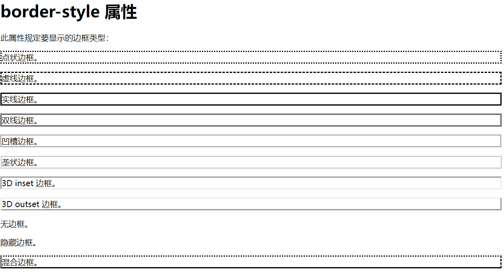

定义一个盒子

```html
<div id="box1">定义一个盒子</div>
```

样式

```html
    <style>
      #box1 {
        /* 盒子内的字体颜色 */
        color: #fff;
        /* 盒子内文字水平居中 */
        text-align: center;

        /* 尺寸 */
        width: 300px;
        height: 300px;

        /* 背景 */
        background-color: #c3296c;

        /* 边框 */
        border-style: solid;
        border-width: 5px;
        border-color: pink;
        /* 边框的复合型写法 */
        border-top: 5px solid red;
        border-bottom: 5px solid green;
      }
    </style>
```

效果如下：


## 盒子


## 盒子的尺寸、背景色

```
color: #fff;    盒子内的字体颜色
width: 300px;
height: 300px;
background-color: #06bb69;  背景
```

代码

```html
<!DOCTYPE html>
<html lang="en">
  <head>
    <meta charset="UTF-8" />
    <meta name="viewport" content="width=device-width, initial-scale=1.0" />
    <title>Document</title>
    <style>
      #box1 {
        color: #fff;
        width: 100px;
        height: 100px;
        background-color: #c3296c;
      }
      #box2 {
        color: #fff;
        width: 100px;
        height: 100px;
        background-color: #06bb69;
      }

      #box3 {
        color: #fff;
        width: 100px;
        height: 100px;
        background-color: #0ba1ec;
      }
    </style>
  </head>
  <body>
    <div id="box1">1</div>
    <div id="box2">2</div>
    <div id="box3">3</div>
  </body>
</html>

```

效果

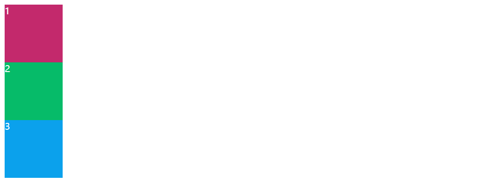

## 背景

#### 背景属性

CSS 背景属性主要用于设置对象的背景颜色、背景图片、背景图片的重复性、背景图片的位置等

| 常见的背景属性及说明            |                                                                                      |
|:---------------------:| ------------------------------------------------------------------------------------ |
| 属性                    | 说明                                                                                   |
| background            | 简写属性，将背景的所有属性设置在一个声明中                                                                |
| background-attachment | 设置背景图像是否固定或者随着页面的其余部分滚动。scroll指背景图像随内容滚动; fixed 指背景图像不随内容滚动                          |
| background-color      | 设置元素的背景颜色（不能继承，默认值是transparent“透明”）                                                  |
| background-image      | 把图像设置为背景                                                                             |
| background-position   | 设置背景图像的起始位置。left 为水平居左，right 为水平居右，center 为水平居中或垂直居中，top 为垂直靠上，bottom为垂直靠下或精确的值      |
| background-repeat     | 设置背景图像是否重复及如何重复。repeat-x 为横向平铺; repeat-y 为纵向平铺; norepeat 为不平铺; repeat 为平铺背景图片，该值为默认值 |

## 常用方法

### 给段内部分文字加背景

```html
<p><span>此页面拥有浅蓝色背景色！</span></p>

<style>
span {
  background-color: lightblue;
}
</style>
```

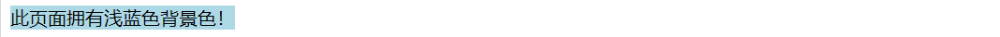

## 盒子背景透明


## 盒子的背景图片

默认是平铺

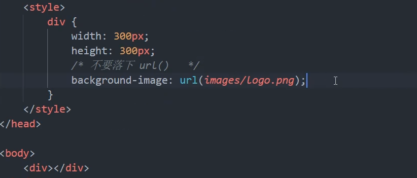

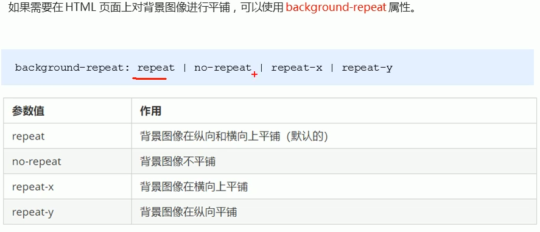


## 背景图片的位置


### 背景位置方位


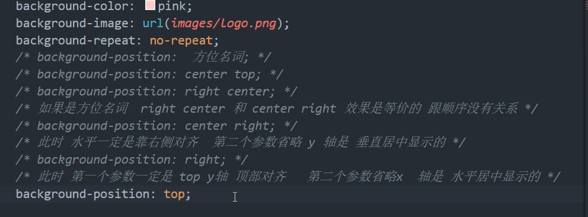

### 背景位置精确


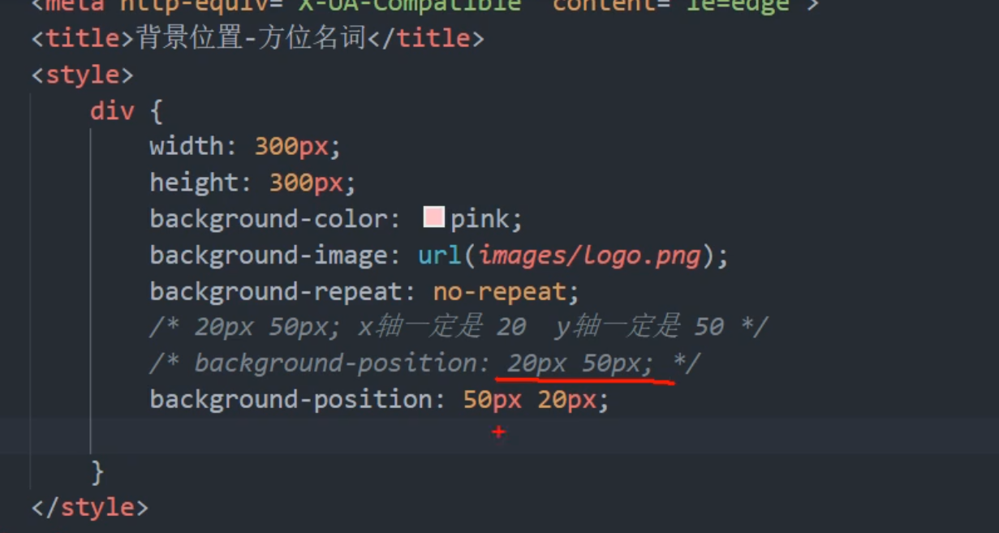

### 背景位置方位和精确的混合模式

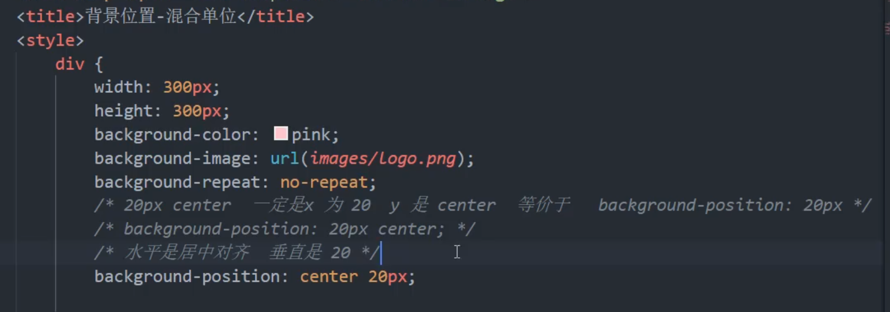

### 背景图像固定

就是在拖动滚动条时，背景不动。

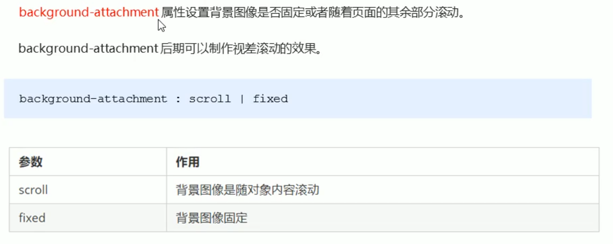

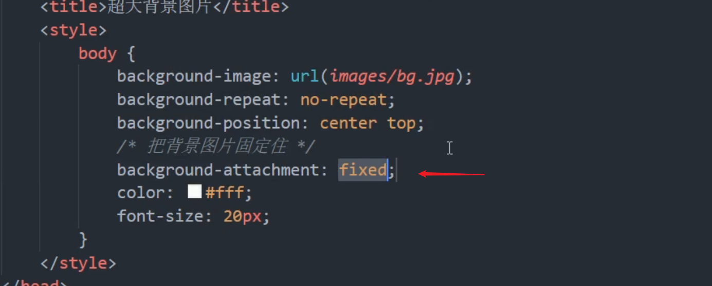

### 背景属性的复核写法

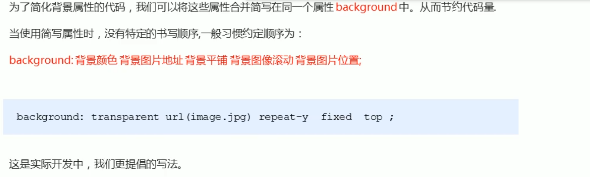

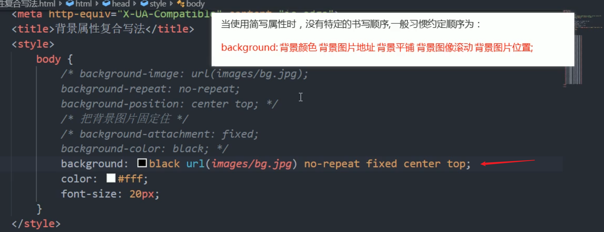

### 背景色半透明

效果：

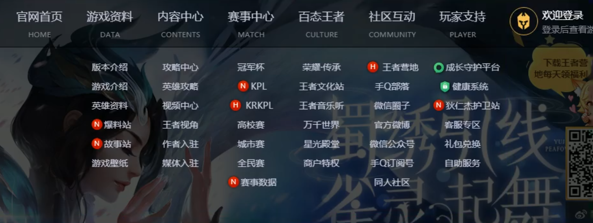

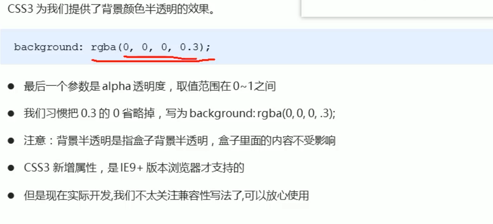

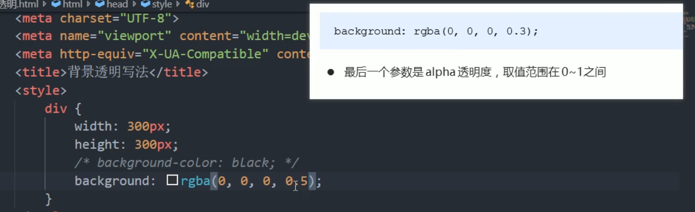

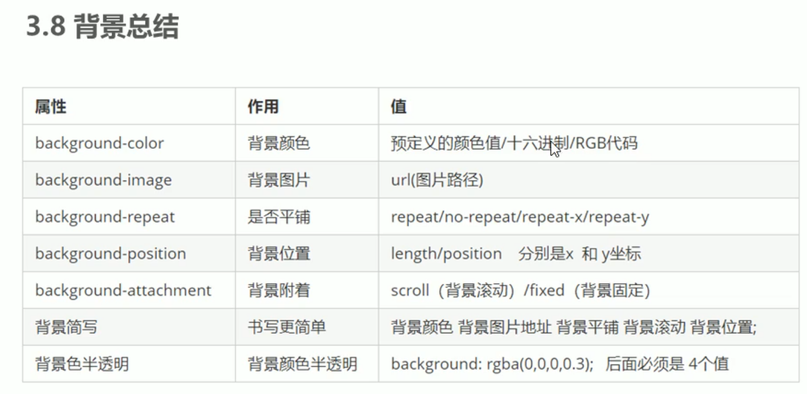

## 盒子的边框

### 边框的普通写法

```
border-style: solid;
border-width: 5px;
border-color: pink;
```

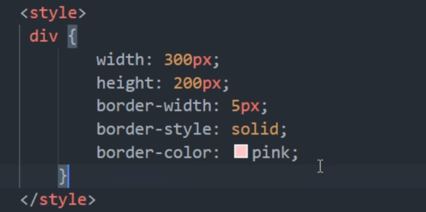

### 边框的复合型写法

复合型写法：没有顺序

```
border-top: 5px solid red;   像素即粗细，样式为实线，颜色为红色
border-bottom: 5px solid green;
```


上下左右边框，可以单独写属性

## 内边距


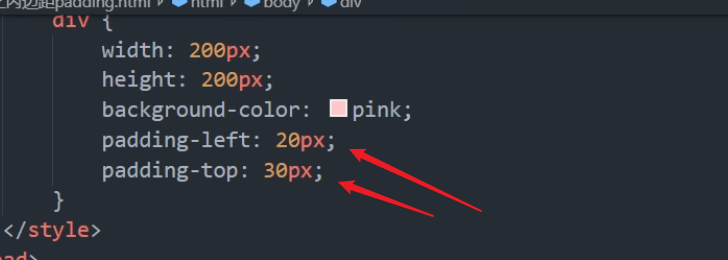

复核写法


## 外边距


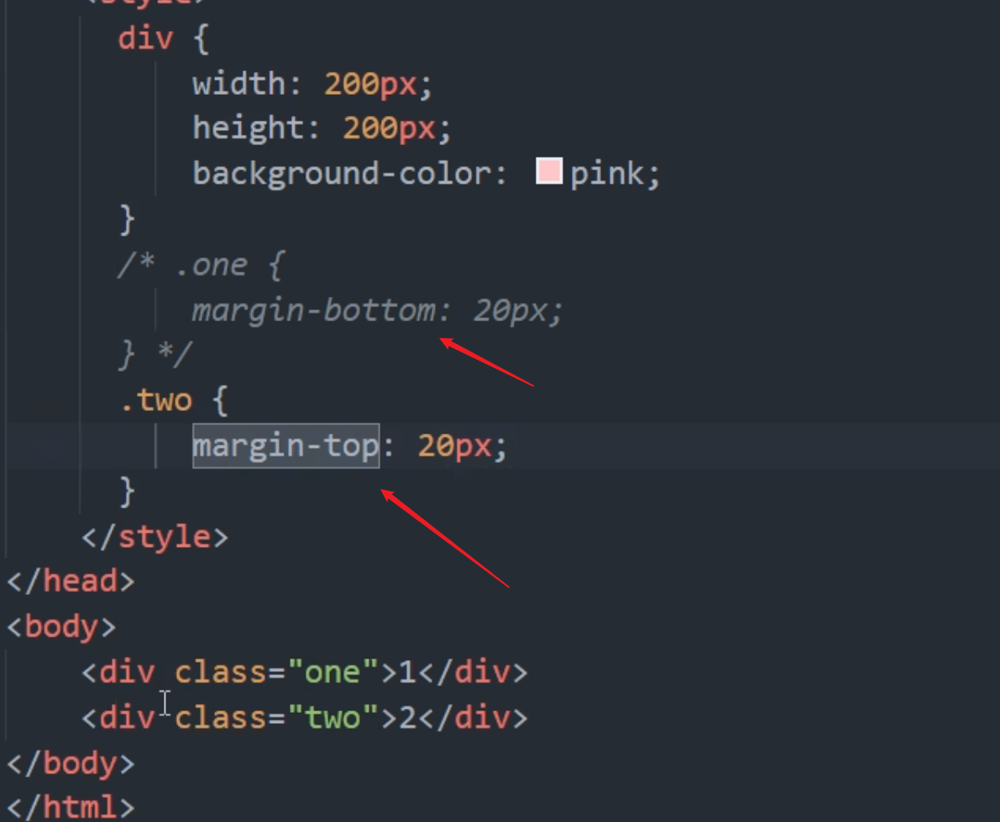