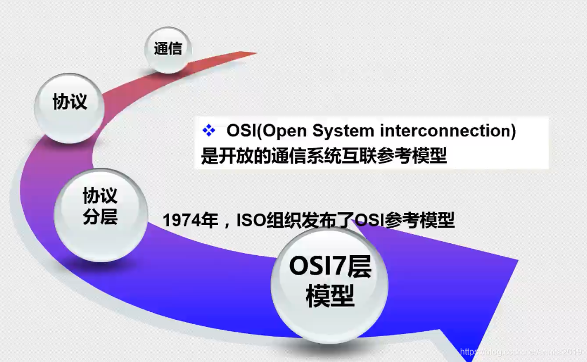
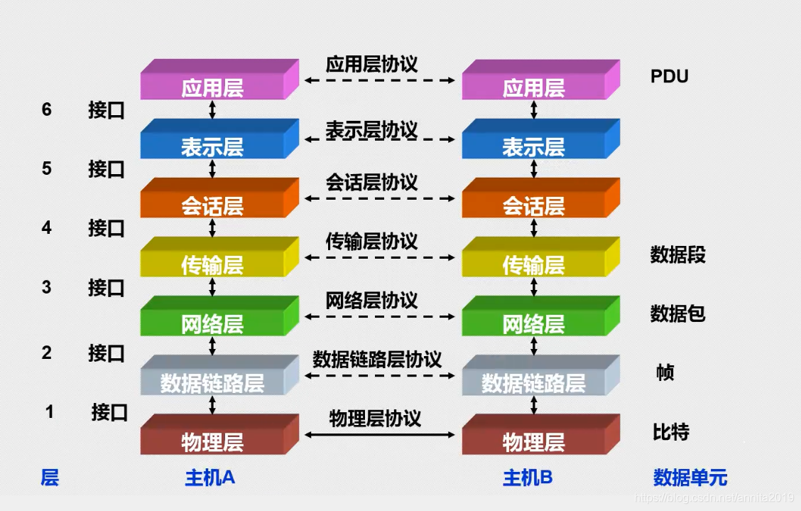
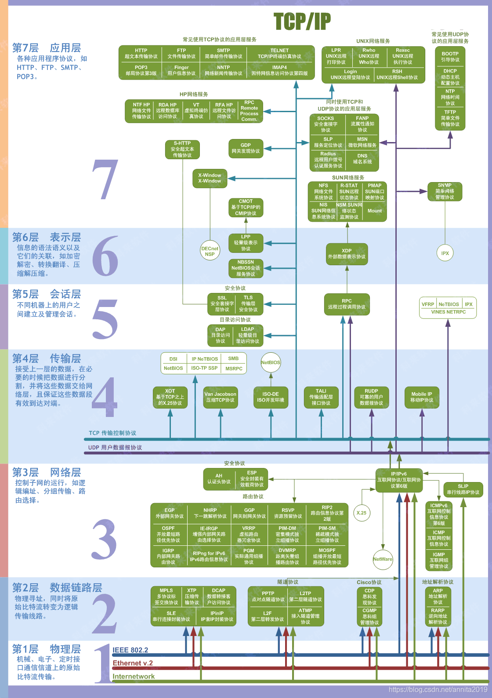

# 第一节：OSI七层模型

OSI 七层模型通过七个层次化的结构模型使不同的系统不同的网络之间实现可靠的通讯，因此其最主要的功能就是帮助不同类型的主机实现数据传输 。

完成中继功能的节点通常称为`中继系统`。在OSI七层模型中，处于不同层的中继系统具有不同的名称。   

一个设备工作在哪一层，关键看它工作时利用哪一层的数据头部信息。网桥工作时，是以MAC头部来决定转发端口的，因此显然它是数据链路层的设备。
具体说:

- ==物理层：网卡，网线，集线器，中继器，调制解调器==
- ==数据链路层：网桥，交换机==
- ==网络层：路由器==

网关工作在第四层传输层及其以上

集线器是物理层设备,采用广播的形式来传输信息。

交换机就是用来进行报文交换的机器。多为链路层设备(二层交换机)，能够进行地址学习，采用存储转发的形式来交换报文.。

路由器的一个作用是连通不同的网络，另一个作用是选择信息传送的线路。选择通畅快捷的近路，能大大提高通信速度，减轻网络系统通信负荷，节约网络系统资源，提高网络系统畅通率。

## 一、ISO七层模型

### 1、物理层
在OSI参考模型中，物理层（Physical Layer）是参考模型的最低层，也是OSI模型的第一层。负责最后将信息编码成电流脉冲或其它信号用于网上传输如发送电信号的硬件等 ，大多物理层和链路层几乎都是配套的 以前的HUB集线器就是工作在物理层。

物理层的主要功能：利用传输介质为数据链路层提供物理连接，实现比特流的透明传输。

物理层的作用：实现相邻计算机节点之间比特流的透明传送，尽可能屏蔽掉具体传输介质和物理设备的差异。使其上面的数据链路层不必考虑网络的具体传输介质是什么。“透明传送比特流”表示经实际电路传送后的比特流没有发生变化，对传送的比特流来说，这个电路好像是看不见的。

### 2、链路层
数据链路层（Data Link Layer）是OSI模型的第二层，负责建立和管理节点间的链路。该层的主要功能是：通过各种控制协议，将有差错的物理信道变为无差错的、能可靠传输数据帧的数据链路。
在计算机网络中由于各种干扰的存在，物理链路是不可靠的。因此，这一层的主要功能是在物理层提供的比特流的基础上，通过差错控制、流量控制方法，使有差错的物理线路变为无差错的数据链路，即提供可靠的通过物理介质传输数据的方法。

该层通常又被分为介质`访问控制（MAC）`和`逻辑链路控制（LLC）`两个子层。

> - MAC子层的主要任务是解决共享型网络中多用户对信道竞争的问题，完成网络介质的访问控制；
> - LLC子层的主要任务是建立和维护网络连接，执行差错校验、流量控制和链路控制。 数据链路层的具体工作是接收来自物理层的位流形式的数据，并封装成帧，传送到上一层；同样，也将来自上层的数据帧，拆装为位流形式的数据转发到物理层；并且，还负责处理接收端发回的确认帧的信息，以便提供可靠的数据传输。

交换机数据传输 硬件单片机程序，单片机上面的汇编，控制寄存器，操作一组硬件，维持底层信号的连接，mac 驱动等都是工作在数据链路层。

协议包括：

> - ethenet:IEE802.3以太网协议
> - IEEE802.11WiFi
> - bulue tooth
> - zigbee
> - PPP点对点协议
> - pppoe (在以太网链路层上面在加一层链路层计费功能的协议 ) 
> - ATM 
> - FDDI
> - ADSL

### 3、网络层
网络层，常用的协议都在这一层。

> - `ip协议、 arp地址解析协议` （绑定IP和mac的作用）
> - `icmp`（互联网管理控制协议 辅助ip协议的协议，测试经过几个路由器，网络是否存在异常，是否连通的测试协议）
>  - `igmp`（互联网组管理协议 组播）  
>  - `dns域名解析协议`
> - `dhcp动态主机配置协议` 
> `NAT网络地址转换协议` 路由器使用的，内外网转换协议。

路由器是工作在网络层的，路由器相当于拥有多个网卡的微信计算机，有多个网段的地址 。

网络层（`Network Layer`）是OSI模型的第三层，它是OSI参考模型中最复杂的一层，也是通信子网的最高一层。它在下两层的基础上向资源子网提供服务。

网络层作用：负责数据的包装、寻址和路由

其主要任务是通过路由选择算法，为报文或分组通过通信子网选择最适当的路径。该层控制数据链路层与传输层之间的信息转发，建立、维持和终止网络的连接。具体地说，数据链路层的数据在这一层被转换为数据包，然后通过路径选择、分段组合、顺序、进/出路由等控制，将信息从一个网络设备传送到另一个网络设备。

一般地，数据链路层是解决同一网络内节点之间的通信，而网络层主要==解决不同子网间的通信。==例如在广域网之间通信时，必然会遇到路由（即两节点间可能有多条路径）选择问题。 

在实现网络层功能时，需要解决的主要问题如下：

>  - 寻址：数据链路层中使用的物理地址（如MAC地址）仅解决网络内部的寻址问题。在不同子网之间通信时，为了识别和找到网络中的设备，每一子网中的设备都会被分配一个唯一的地址。由于各子网使用的物理技术可能不同，因此这个地址应当是逻辑地址（如IP地址）。
>  - 交换：规定不同的信息交换方式。常见的交换技术有：线路交换技术和存储转发技术，后者又包括报文交换技术和分组交换技术。
>  - 路由算法：当源节点和目的节点之间存在多条路径时，本层可以根据路由算法，通过网络为数据分组选择最佳路径，并将信息从最合适的路径由发送端传送到接收端。
>  - 连接服务：与数据链路层流量控制不同的是，前者控制的是网络相邻节点间的流量，后者控制的是从源节点到目的节点间的流量。其目的在于防止阻塞，并进行差错检测。

### 4、传输层

OSI下三层的主要任务是数据通信，上三层的任务是数据处理。而传输层（`Transport Layer`）是OSI模型的第4层。因此该层是通信子网和资源子网的接口和桥梁，起到承上启下的作用。

传输层的主要任务：向用户提供可靠的端到端的差错和流量控制，保证报文的正确传输。

传输层的作用是向高层屏蔽下层数据通信的细节，即向用户透明地传送报文。

该层常见的协议：

> `TCP/IP中的TCP协议`、Novell网络中的`SPX协议`和微软的`NetBIOS/NetBEUI协议`。

传输层提供会话层和网络层之间的传输服务，这种服务从会话层获得数据，并在必要时，对数据进行分割。然后，传输层将数据传递到网络层，并确保数据能正确无误地传送到网络层。因此，传输层负责提供两节点之间数据的可靠传送，当两节点的联系确定之后，传输层则负责监督工作。

传输层的主要功能：

> - 传输连接管理：提供建立、维护和拆除传输连接的功能。传输层在网络层的基础上为高层提供“面向连接”和“面向无接连”的两种服务。
> - 处理传输差错：提供可靠的“面向连接”和不太可靠的“面向无连接”的数据传输服务、差错控制和流量控制。在提供“面向连接”服务时，通过这一层传输的数据将由目标设备确认，如果在指定的时间内未收到确认信息，数据将被重发。
> - 监控服务质量。

### 5、会话层
会话层（Session Layer）是OSI模型的第5层，是用户应用程序和网络之间的接口。

会话层主要任务：

会话层主要任务是向两个实体的表示层提供建立和使用连接的方法。将不同实体之间的表示层的连接称为会话。因此会话层的任务就是组织和协调两个会话进程之间的通信，并对数据交换进行管理。

用户可以按照半双工、单工和全双工的方式建立会话。当建立会话时，用户必须提供他们想要连接的远程地址。而这些地址与MAC（介质访问控制子层）地址或网络层的逻辑地址不同，它们是为用户专门设计的，更便于用户记忆。域名（DN）就是一种网络上使用的远程地址例如：`www.3721.com`就是一个域名。

会话层的具体功能：

> - 会话管理：允许用户在两个实体设备之间建立、维持和终止会话，并支持它们之间的数据交换。例如提供单方向会话或双向同时会话，并管理会话中的发送顺序，以及会话所占用时间的长短。
> - 会话流量控制：提供会话流量控制和交叉会话功能。 寻址：使用远程地址建立会话连接。l
> - 出错控制：从逻辑上讲会话层主要负责数据交换的建立、保持和终止，但实际的工作却是接收来自传输层的数据，并负责纠正错误。会话控制和远程过程调用均属于这一层的功能。但应注意，此层检查的错误不是通信介质的错误，而是磁盘空间、打印机缺纸等类型的高级错误。

传输数据的过程称为一个会话，指的是一个过程

### 6、表示层

表示层（`Presentation Layer`）是OSI模型的第六层，它对来自应用层的命令和数据进行解释，对各种语法赋予相应的含义，并按照一定的格式传送给会话层。

表示层主要功能是“处理用户信息的表示问题，如编码、数据格式转换和加密解密”等。

具体功能如下：

> - 数据格式处理：协商和建立数据交换的格式，解决各应用程序之间在数据格式表示上的差异。
> - 数据的编码：处理字符集和数字的转换。例如由于用户程序中的数据类型（整型或实型、有符号或无符号等）、用户标识等都可以有不同的表示方式，因此，在设备之间需要具有在不同字符集或格式之间转换的功能。
> - 压缩和解压缩：为了减少数据的传输量，这一层还负责数据的压缩与恢复。
> - 数据的加密和解密：可以提高网络的安全性。

对数据细腻度的区分，比如该数据的一段话，或者一张图片，视频流等

### 7、应用层
应用层（`Application Layer`）是OSI参考模型的最高层，它是计算机用户，以及各种应用程序和网络之间的接口，其功能是直接向用户提供服务，完成用户希望在网络上完成的各种工作。

它在其他6层工作的基础上，负责完成网络中应用程序与网络操作系统之间的联系，建立与结束使用者之间的联系，并完成网络用户提出的各种网络服务及应用所需的监督、管理和服务等各种协议。此外，该层还负责协调各个应用程序间的工作。

应用层为用户提供的服务和协议

> 文件服务、目录服务、文件传输服务（FTP）、远程登录服务（Telnet）、电子邮件服务（E-mail）、打印服务、安全服务、网络管理服务、数据库服务等。上述的各种网络服务由该层的不同应用协议和程序完成，不同的网络操作系统之间在功能、界面、实现技术、对硬件的支持、安全可靠性以及具有的各种应用程序接口等各个方面的差异是很大的。

应用层的主要功能

> - 用户接口：应用层是用户与网络，以及应用程序与网络间的直接接口，使得用户能够与网络进行交互式联系。
> - 实现各种服务：该层具有的各种应用程序可以完成和实现用户请求的各种服务。

 对表示层和会话层的一个整体管理，比如该程序可以发视频  可以发文字，可以发图片。包括协议 `telnet 远程终端登录协议`、`ssh协议`、`http ftp文件传输协议`、 `smtp（邮件协议` 是现在在互联网 上发送电子邮件的事实标准）  pop （,邮局协议 是支持通过客户端访问电子邮件的服务）snmp  imap  ldap（轻型目录访问协议 微软提供的域协议，公司对员工电脑的控制，监视）

## 二、总体逻辑划分

上面的七层模型可以总体划分为四层，依次为 ：
- 物理层（物理层、链路层合为一层）
- 网络层
- 传输层
- 应用层

子网掩码 和Ip地址&运算出来的是网段，子网掩码，掩掉主机位，留下网络位
数据的传输方向及解析过程大致如下：

在电脑启动的时候会通过ARP协议 广播同网段ip mac告诉其他的主机 同时其他主机也会回自己的mac ip 。 在发送数据的时候， 数据打包过程是，数据+ip+mac地址，由网卡发送出去，接收端网卡收到数据 mac链路层解析是否是自己的mac及一些其他的信息的正确性，是且正确的话去掉mac头，往上仍给IP网络层，网络层查看IP等信息是否正确，又去掉ip头继续网上扔给传输层，传输层拿到数据进行相应的操作

总的来说七层协议数据在发送的时候是由上层协议到下层，接受数据由下层逐渐往上   不同网段的数据发送要经过路由器，发送者先发送数据到同网段路由器，由路由器解析后，从路由器的另一个具有和目的主机相同的网段的网卡发出。

## 三、交换机和路由器的区别
交换机拥有一条很高带宽的背部总线和内部交换矩阵。交换机的所有的端口都挂接在这条总线上，控制电路收到数据包以后，处理端口会查找内存中的地址对照表以确定目的MAC（网卡的硬件地址）的NIC（网卡）挂接在哪个端口上，通过内部交换矩阵迅速将数据包传送到目的端口，目的MAC若不存在则广播到所有的端口，接收端口回应后交换机会“学习”新的地址，并把它添加入内部MAC地址表中。 

使用交换机也可以把网络“分段”，通过对照MAC地址表，交换机只允许必要的网络流量通过交换机。通过交换机的过滤和转发，可以有效的隔离广播风暴，减少误包和错包的出现，避免共享冲突。 
交换机在同一时刻可进行多个端口对之间的数据传输。每一端口都可视为独立的网段，连接在其上的网络设备独自享有全部的带宽，无须同其他设备竞争使用。当节点A向节点D发送数据时，节点B可同时向节点C发送数据，而且这两个传输都享有网络的全部带宽，都有着自己的虚拟连接。假使这里使用的是10Mbps的以太网交换机，那么该交换机这时的总流通量就等于2×10Mbps＝20Mbps，而使用10Mbps的共享式HUB时，一个HUB的总流通量也不会超出10Mbps。

总之，==交换机是一种基于MAC地址识别，能完成封装转发数据包功能的网络设备。==交换机可以“学习”MAC地址，并把其存放在内部地址表中，通过在数据帧的始发者和目标接收者之间建立临时的交换路径，使数据帧直接由源地址到达目的地址。

从过滤网络流量的角度来看，路由器的作用与交换机和网桥非常相似。但是与工作在网络物理层，从物理上划分网段的交换机不同，路由器使用专门的软件协议从逻辑上对整个网络进行划分。例如，一台支持IP协议的路由器可以把网络划分成多个子网段，只有指向特殊IP地址的网络流量才可以通过路由器。对于每一个接收到的数据包，路由器都会重新计算其校验值，并写入新的物理地址。因此，使用路由器转发和过滤数据的速度往往要比只查看数据包物理地址的交换机慢。但是，对于那些结构复杂的网络，使用路由器可以提高网络的整体效率。路由器的另外一个明显优势就是可以自动过滤网络广播。

## 四、集线器与路由器在功能上有什么不同?
首先说HUB,也就是集线器。它的作用可以简单的理解为将一些机器连接起来组成一个局域网。而交换机（又名交换式集线器）作用与集线器大体相同。但是两者在性能上有区别：集线器采用的式共享带宽的工作方式，而交换机是独享带宽。这样在机器很多或数据量很大时，两者将会有比较明显的。而路由器与以上两者有明显区别，它的作用在于连接不同的网段并且找到网络中数据传输最合适的路径。路由器是产生于交换机之后，就像交换机产生于集线器之后，所以路由器与交换机也有一定联系，不是完全独立的两种设备。==路由器主要克服了交换机不能路由转发数据包的不足。 ==

总的来说，路由器与交换机的主要区别体现在以下几个方面： 

（1）工作层次不同 
最初的的交换机是工作在数据链路层，而路由器一开始就设计工作在网络层。由于交换机工作在数据链路层，所以它的工作原理比较简单，而路由器工作在网络层，可以得到更多的协议信息，路由器可以做出更加智能的转发决策。 

（2）数据转发所依据的对象不同 
交换机是利用物理地址或者说MAC地址来确定转发数据的目的地址。而路由器则是利用IP地址来确定数据转发的地址。IP地址是在软件中实现的，描述的是设备所在的网络。MAC地址通常是硬件自带的，由网卡生产商来分配的，而且已经固化到了网卡中去，一般来说是不可更改的。而IP地址则通常由网络管理员或系统自动分配。 

（3）传统的交换机只能分割冲突域，不能分割广播域；而路由器可以分割广播域 
由交换机连接的网段仍属于同一个广播域，广播数据包会在交换机连接的所有网段上传播，在某些情况下会导致通信拥挤和安全漏洞。连接到路由器上的网段会被分配成不同的广播域，广播数据不会穿过路由器。虽然第三层以上交换机具有VLAN功能，也可以分割广播域，但是各子广播域之间是不能通信交流的，它们之间的交流仍然需要路由器。 

（4）路由器提供了防火墙的服务 
路由器仅仅转发特定地址的数据包，不传送不支持路由协议的数据包传送和未知目标网络数据包的传送，从而可以防止广播风暴。

详细推荐看这里：https://blog.csdn.net/ChenGuiGan/article/details/80963507

# 第二节：TCP-IP协议

TCP/IP协议是互联网的核心通信协议套件，它定义了数据如何在网络中封装、寻址、传输和路由。

严格来说，TCP/IP 不是一个协议，而是一个**协议族**，其中最重要的两个是**TCP**和**IP**，这也是它名字的由来。

下面为你分层解析它的核心结构。

## 核心分层模型

TCP/IP 采用分层模型，每一层负责不同功能，上层依赖下层。它通常被描述为四层：

1.  **网络接口层**
    -   **功能**：处理与物理硬件（网线、Wi-Fi）的通信，将数据转换为电信号或光信号。它涵盖了以太网、Wi-Fi（802.11）等协议。
    -   **核心**：定义了数据如何在单一网络（如局域网）的物理介质上传输。

2.  **网络互联层**
    -   **功能**：负责将数据包从源主机发送到目标主机，解决跨网络寻址和路由问题。
    -   **核心协议**：**IP协议**。
        -   **IP地址**：为每台设备提供逻辑标识（如 `192.168.1.1`）。
        -   **路由**：决定数据从A到B的最佳路径。
        -   **无连接**：IP发送数据包前不建立连接，也不保证包能按序、不重复、不丢失地到达。
    -   **辅助协议**：
        -   **ARP**：IP地址 → MAC地址的解析。
        -   **ICMP**：传递网络错误或诊断信息（如 `ping` 命令依赖它）。

3.  **传输层**
    -   **功能**：为上层应用提供端到端的数据传输服务，可以看作网络层的“增强版”。
    -   **核心协议**：**TCP** 和 **UDP**。
        -   **TCP（传输控制协议）**：**面向连接、可靠**。
            -   传输前需三次握手建立连接。
            -   提供确认重传、流量控制、拥塞控制、数据排序。
            -   适用场景：网页浏览、邮件、文件下载（需要数据完整的场景）。
        -   **UDP（用户数据报协议）**：**无连接、不可靠**。
            -   直接发送数据，不提供确认、重传、排序。
            -   优势是延迟低、开销小。
            -   适用场景：实时音视频、在线游戏、DNS查询。
    -   **核心概念**：**端口**。
        -   用端口号区分同一台设备上的不同应用（如Web服务通常用80端口，HTTPS用443，SSH用22）。传输层通过 `IP地址 + 端口号` 这一组合（套接字）唯一标识一个通信会话。

4.  **应用层**
    -   **功能**：为用户提供具体的网络服务接口，数据在这一层变成用户能直接理解的形式。
    -   **常见协议**：
        -   `HTTP/HTTPS`：网页浏览。
        -   `FTP`：文件传输。
        -   `SMTP/POP3/IMAP`：电子邮件收发。
        -   `DNS`：域名 → IP地址的解析。
        -   `SSH`：安全远程登录。

## 数据封装过程（发送数据为例）

当你在浏览器输入一个网址，数据是这样封装的：

1.  **应用层**：浏览器生成HTTP请求数据。
2.  **传输层**：HTTP数据被交给TCP层。TCP加上自己的头部（包含源端口、目标端口、序列号等），形成**TCP段**。
3.  **网络层**：TCP段被交给IP层。IP层加上自己的头部（包含源IP、目标IP），形成**IP数据包**。
4.  **网络接口层**：IP数据包被交给以太网层。以太网层加上自己的头部（包含源MAC、目标MAC）和尾部，形成**以太网帧**。
5.  **物理层**：以太网帧被转换成比特流（电信号/光信号），通过网线或Wi-Fi发送出去。

接收端会执行相反的过程：**解封装**，逐层去掉头部，最终把HTTP数据交给浏览器。

## 关键协议详解

-   **TCP三次握手与四次挥手**
    -   **三次握手**（建立连接）：
        1.  客户端发 `SYN`。
        2.  服务端回复 `SYN+ACK`。
        3.  客户端回复 `ACK`。
    -   **四次挥手**（断开连接）：
        1.  主动方发 `FIN`。
        2.  被动方回复 `ACK`。
        3.  被动方发 `FIN`。
        4.  主动方回复 `ACK`。

-   **IP地址与子网掩码**
    -   **IPv4**：32位，如 `192.168.1.1`，约43亿地址，已耗尽，正逐步被IPv6替代。
    -   **IPv6**：128位，地址空间巨大。
    -   **子网掩码**：用于区分IP地址中的网络号和主机号，判断两台设备是否在同一局域网。

## TCP/IP vs. OSI模型

学习TCP/IP时常会碰到七层的OSI模型，它们的关系如下：

| OSI七层模型 | TCP/IP四层模型 | 对应协议举例        |
| :---------- | :------------- | :------------------ |
| 应用层      | 应用层         | HTTP, FTP, DNS, SSH |
| 表示层      | （应用层）     | （功能融合）        |
| 会话层      | （应用层）     | （功能融合）        |
| 传输层      | 传输层         | TCP, UDP            |
| 网络层      | 网络互联层     | IP, ICMP, ARP       |
| 数据链路层  | 网络接口层     | 以太网, Wi-Fi       |
| 物理层      | （物理介质）   | 网线, 光纤, 无线电  |

总的来说，TCP/IP协议的核心就是**分层与封装**：下层为上层服务，上层调用下层功能，通过这种机制构建了全球互联的网络。

如果你对某个协议（比如TCP的流量控制或IP的路由原理）还想深入了解，我可以继续为你讲解。
