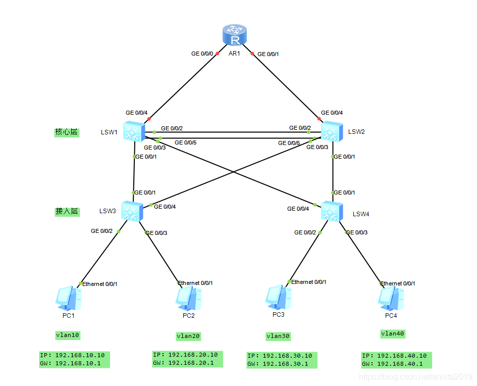

# VRRP+MSTP典型组网配置


VRRP是一种容错协议，它保证当主机的下一跳路由器出现故障时，由另一台路由器来代替出现故障的路由器进行工作，从而保持网络通信的连续性和可靠性。

MSTP：多生成树协议，通过生成多个生成树，来解决以太网环路问题。

## 实验拓扑




## 一、VLAN配置

### SW3配置

```bash
sy sw3
un in en
vlan batch 10 20 30 40 
```

```bash
interface g0/0/2
 port link-type access
 port default vlan 10
 q
interface g0/0/3
 port link-type access
 port default vlan 20
```

### SW4配置

```bash
sy sw4
un in en
vlan batch 10 20 30 40
interface g0/0/2
 port link-type access
 port default vlan 30
 q
interface g0/0/3
 port link-type access
 port default vlan 40
 q
```

## 二、Trunk配置

### SW3配置

```bash
interface g0/0/1
 port link-type trunk
 port trunk allow-pass vlan 10 20
 
interface g0/0/4
 port link-type trunk
 port trunk allow-pass vlan 10 20
```


### SW4配置

```bash
interface g0/0/1
 port link-type trunk
 port trunk allow-pass vlan 30 40
 q
interface g0/0/4
 port link-type trunk
 port trunk allow-pass vlan 30 40
 q
```


### SW1配置

```bash
sy sw1
un in en
vlan batch 10 20 30 40

interface GigabitEthernet0/0/1
 port link-type trunk
 port trunk allow-pass vlan 10 20
 
interface GigabitEthernet0/0/3
 port link-type trunk
 port trunk allow-pass vlan 30 40
```

### SW2配置

```bash
sy sw2
un in en
vlan batch 10 20 30 40

interface GigabitEthernet0/0/1
 port link-type trunk
 port trunk allow-pass vlan 30 40
 
interface GigabitEthernet0/0/3
 port link-type trunk
 port trunk allow-pass vlan 10 20
```

## 三、链路聚合

SW1和SW2之间我们用两根网线，做成链路聚合。

SW1配置

```bash
[hxsw1]int Eth-Trunk 1
[hxsw1-Eth-Trunk1]mode lacp-static
[hxsw1-Eth-Trunk1]trunkport g0/0/2
Info: This operation may take a few seconds. Please wait for a moment...done.
[hxsw1-Eth-Trunk1]trunkport g0/0/5
Info: This operation may take a few seconds. Please wait for a moment...done.
```

SW2配置

```bash
[hxsw2]int Eth-Trunk 1
[hxsw2-Eth-Trunk1]mode lacp-static 	
[hxsw2-Eth-Trunk1]trunkport g0/0/2
Info: This operation may take a few seconds. Please wait for a moment...done.
[hxsw2-Eth-Trunk1]trunkport g0/0/5
Info: This operation may take a few seconds. Please wait for a moment...done.
[hxsw2-Eth-Trunk1]
```

验证查看：

```bash
[hxsw1]dis eth-trunk 
Eth-Trunk1's state information is:
Local:
LAG ID: 1                   WorkingMode: STATIC                               
Preempt Delay: Disabled     Hash arithmetic: According to SIP-XOR-DIP         
System Priority: 32768      System ID: 4c1f-cc6a-6dff                         
Least Active-linknumber: 1  Max Active-linknumber: 8                          
Operate status: up          Number Of Up Port In Trunk: 2                     
--------------------------------------------------------------------------------
ActorPortName          Status   PortType PortPri PortNo PortKey PortState Weight
GigabitEthernet0/0/2   Selected 1GE      32768   3      305     10111100  1     
GigabitEthernet0/0/5   Selected 1GE      32768   6      305     10111100  1     

Partner:
--------------------------------------------------------------------------------
ActorPortName          SysPri   SystemID        PortPri PortNo PortKey PortState
GigabitEthernet0/0/2   32768    4c1f-ccb4-3bac  32768   3      305     10111100
GigabitEthernet0/0/5   32768    4c1f-ccb4-3bac  32768   6      305     10111100
    
[hxsw1]
```

配置trunk，允许所有vlan通过

sw1

```bash
[sw1]int Eth-Trunk 1
[sw1-Eth-Trunk1]port link-type trunk 
[sw1-Eth-Trunk1]port trunk allow-pass vlan 10 20 30 40
```

sw2

```bash
[sw2]int Eth-Trunk 1
[sw2-Eth-Trunk1]port link-type trunk
[sw2-Eth-Trunk1]port trunk allow-pass vlan 10 20 30 40
```


## 四、MSTP配置

###  公共配置
以下步骤必须在所有的有冗余的交换机上做，我们没有汇聚就算了，但是我们接入交换机有冗余所以要做。

```bash
stp region-configuration
 region-name pokes01    #域名pokes01
 revision-level 1       #修订好统一为1
 instance 1 vlan 10 20  #将vlan10/20映射到实例1里面
 instance 2 vlan 30 40
 active region-configuration  #激活才能生效
 q
```
纯净版便于复制
```bash
stp region-configuration
 region-name pokes01
 revision-level 1
 instance 1 vlan 10 20
 instance 2 vlan 30 40
 active region-configuration
 q
```

### SW1配置

```bash
stp instance 1 root primary 	 #将SW1作为实例1的根桥
stp instance 2 root secondary    #将SW1作为实例2的备份根桥
```

### SW2配置

```bash
stp instance 1 root secondary
stp instance 2 root primary
```


### 分别在SW3、SW4上面验证

SW3配置

在下面的查看中，我们看不到实例2，那是因为我们在SW3的trunk没有允许VLAN30/40通过

```bash
[sw3]dis stp brief
 MSTID  Port                        Role  STP State     Protection
   0    GigabitEthernet0/0/1        DESI  FORWARDING      NONE
   0    GigabitEthernet0/0/2        DESI  DISCARDING      NONE
   0    GigabitEthernet0/0/3        DESI  FORWARDING      NONE
   0    GigabitEthernet0/0/4        DESI  FORWARDING      NONE
   1    GigabitEthernet0/0/1        ROOT  FORWARDING      NONE
   1    GigabitEthernet0/0/2        DESI  DISCARDING      NONE
   1    GigabitEthernet0/0/3        DESI  FORWARDING      NONE
   1    GigabitEthernet0/0/4        ALTE  DISCARDING      NONE
   2    GigabitEthernet0/0/1        DESI  FORWARDING      NONE
   2    GigabitEthernet0/0/4        DESI  FORWARDING      NONE
```

SW4配置

在下面的查看中，我们看不到实例1，那是因为我们在SW3的trunk没有允许VLAN10/20通过

```bash
[sw4]dis stp brief
 MSTID  Port                        Role  STP State     Protection
   0    GigabitEthernet0/0/1        ALTE  DISCARDING      NONE
   0    GigabitEthernet0/0/2        DESI  FORWARDING      NONE
   0    GigabitEthernet0/0/3        DESI  FORWARDING      NONE
   0    GigabitEthernet0/0/4        ROOT  FORWARDING      NONE
   1    GigabitEthernet0/0/1        DESI  FORWARDING      NONE
   1    GigabitEthernet0/0/4        DESI  FORWARDING      NONE
   2    GigabitEthernet0/0/1        ROOT  FORWARDING      NONE
   2    GigabitEthernet0/0/2        DESI  FORWARDING      NONE
   2    GigabitEthernet0/0/3        DESI  FORWARDING      NONE
   2    GigabitEthernet0/0/4        ALTE  DISCARDING      NONE
```

## 五、VRRP配置

### sw1配置

```bash
interface Vlanif10
 ip address 192.168.10.253 255.255.255.0
 vrrp vrid 10 virtual-ip 192.168.10.1
 vrrp vrid 10 priority 120

interface Vlanif20
 ip address 192.168.20.253 255.255.255.0
 vrrp vrid 20 virtual-ip 192.168.20.1
  vrrp vrid 20 priority 120
 
 interface Vlanif30
 ip address 192.168.30.253 255.255.255.0
 vrrp vrid 30 virtual-ip 192.168.30.1
 
 interface Vlanif40
 ip address 192.168.40.253 255.255.255.0
 vrrp vrid 40 virtual-ip 192.168.40.1
 
```

### sw2配置

```bash
interface Vlanif10
 ip address 192.168.10.254 255.255.255.0
 vrrp vrid 10 virtual-ip 192.168.10.1

interface Vlanif20
 ip address 192.168.20.254 255.255.255.0
 vrrp vrid 20 virtual-ip 192.168.20.1
 
interface Vlanif30
 ip address 192.168.30.254 255.255.255.0
 vrrp vrid 30 virtual-ip 192.168.30.1
 vrrp vrid 30 priority 120
 
interface Vlanif40
 ip address 192.168.40.254 255.255.255.0
 vrrp vrid 40 virtual-ip 192.168.40.1
 vrrp vrid 40 priority 120
```

检测验证

```bash
<sw1>dis vrrp brief
VRID  State        Interface                Type     Virtual IP     
----------------------------------------------------------------
10    Master       Vlanif10                 Normal   192.168.10.1   
20    Master       Vlanif20                 Normal   192.168.20.1   
30    Backup       Vlanif30                 Normal   192.168.30.1   
40    Backup       Vlanif40                 Normal   192.168.40.1   
----------------------------------------------------------------
Total:4     Master:2     Backup:2     Non-active:0 
```

```bash
[sw2]dis vrrp brief 
VRID  State        Interface                Type     Virtual IP     
----------------------------------------------------------------
10    Backup       Vlanif10                 Normal   192.168.10.1   
20    Backup       Vlanif20                 Normal   192.168.20.1   
30    Master       Vlanif30                 Normal   192.168.30.1   
40    Master       Vlanif40                 Normal   192.168.40.1   
----------------------------------------------------------------
Total:4     Master:2     Backup:2     Non-active:0   
```


## 六、VRRP+MSTP的注意事项

- 拓扑图中所有的交换机都要创建vlan10/20/30/40
- sw1和sw2之间的聚合链路，两头都要配置。

## 八、路由器配置
SW1

```bash
[sw1]vlan 800
[sw1-vlan800]q
[sw1]int vlanif800
[sw1-Vlanif800]ip add 192.168.12.2 24
[sw1-Vlanif800]q
```
SW2

```bash
[sw2]vlan 801
[sw2-vlan801]q	
[sw2]int Vlanif 801
[sw2-Vlanif801]ip add 192.168.23.2 24
[sw2-Vlanif801]q
```
R1

```bash
[Huawei]sysname R1
[R1]un in en
[R1]in g0/0/0
[R1-GigabitEthernet0/0/0]ip add 192.168.12.1 24

[R1]in g0/0/1
[R1-GigabitEthernet0/0/1]ip add 192.168.23.1 24
[R1-GigabitEthernet0/0/1]q
[R1]q
```
## 九、BGP跟踪的配置
作用：当设备假死的时候，我们使它能够自动切换。

```bash
[sw1]bfd      #启用
[sw1-bfd]q
[sw1]bf	
[sw1]bfd szpr01 bind peer-ip 192.168.12.1 source-ip 192.168.12.2 auto   
[sw1-bfd-session-szpr01]com	
[sw1-bfd-session-szpr01]commit 
```
- szpr01是我起的名字
- peer-ip是对端地址
- source-ip是本地地址

```bash
[R1]bfd
[R1-bfd]q	
[R1]bfd szpr01 bind peer-ip 192.168.12.2 source-ip 192.168.12.1 auto 
[R1-bfd-session-szpr02]commit 
```
==注意：在这里szpr01的名字，要和SW1上一致。==

查看

```bash
[sw1]dis bfd session all
--------------------------------------------------------------------------------
Local Remote     PeerIpAddr      State     Type        InterfaceName            
--------------------------------------------------------------------------------

8192  0          192.168.12.1    Down      S_AUTO_PEER       -                  
--------------------------------------------------------------------------------
Total UP/DOWN Session Number : 0/1
```
