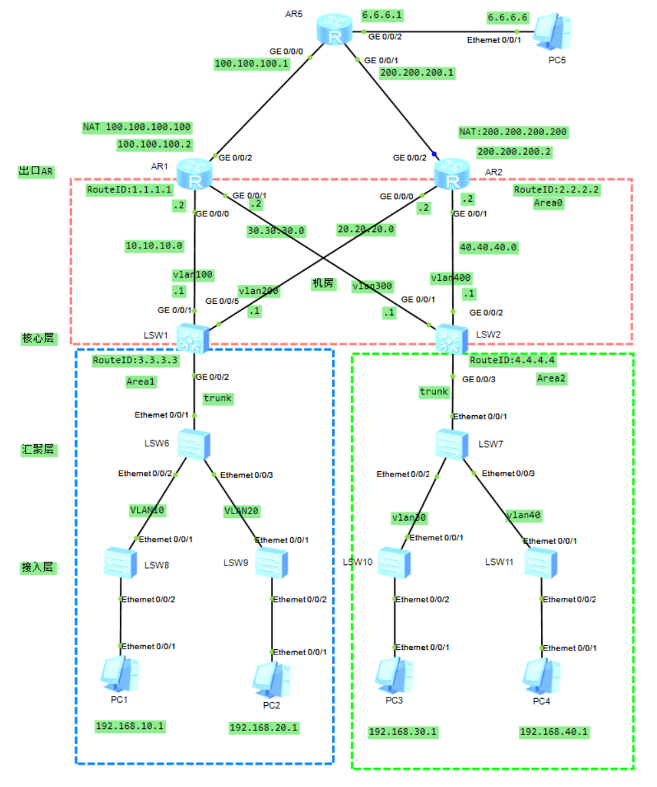

# 企业或学校OSPF组网实例


## 实验背景

某学校有两栋教学楼，和一个中心数据机房。每栋楼有10层，每栋客户端大概100台，要求最少划分两个VLAN，每栋的负一层有一个小机房可以放置汇聚交换机。要求使用OSPF协议组网。

学校有两条专线，一条电信 公网IP：100.100.100.100。联通：200.200.200.200。现要求形成分担负载和主备切换。




我们由下往上配置

## 基础部分的配置

### VLAN的配置

这个我们在汇聚层划分VLAN

sw6

```
interface Ethernet0/0/1
 port link-type trunk
 port trunk allow-pass vlan 2 to 4094
#
interface Ethernet0/0/2
 port link-type access
 port default vlan 10
#
interface Ethernet0/0/3
 port link-type access
 port default vlan 20
```

sw7

```
interface Ethernet0/0/1
 port link-type trunk
 port trunk allow-pass vlan 2 to 4094
#
interface Ethernet0/0/2
 port link-type access
 port default vlan 30
#
interface Ethernet0/0/3
 port link-type access
 port default vlan 40
```

### VLAN间的通信

sw1

```

interface GigabitEthernet0/0/1
 port link-type access
 port default vlan 100
#
interface GigabitEthernet0/0/2
 port link-type trunk
 port trunk allow-pass vlan 2 to 4094
#

interface GigabitEthernet0/0/5
 port link-type access
 port default vlan 200
 
interface Vlanif10
 ip address 192.168.10.254 255.255.255.0
#
interface Vlanif20
 ip address 192.168.20.254 255.255.255.0
#
interface Vlanif100
 ip address 10.10.10.1 255.255.255.0
#
interface Vlanif200
 ip address 20.20.20.1 255.255.255.0

```

sw2

```
vlan batch 30 40 300 400

interface GigabitEthernet0/0/1
 port link-type access
 port default vlan 300
#
interface GigabitEthernet0/0/2
 port link-type access
 port default vlan 400
#
interface GigabitEthernet0/0/3
 port link-type trunk
 port trunk allow-pass vlan 2 to 4094
 
interface Vlanif30
 ip address 192.168.30.254 255.255.255.0
#
interface Vlanif40
 ip address 192.168.40.254 255.255.255.0
#
interface Vlanif300
 ip address 30.30.30.1 255.255.255.0
#
interface Vlanif400
 ip address 40.40.40.1 255.255.255.0

```


### 路由器接口IP

AR1

接口IP的配置

```
interface GigabitEthernet0/0/0
 ip address 10.10.10.2 255.255.255.0 
#
interface GigabitEthernet0/0/1
 ip address 30.30.30.2 255.255.255.0 
#
interface GigabitEthernet0/0/2
 ip address 100.100.100.2 255.255.255.0 
```

AR2

```
interface GigabitEthernet0/0/0
 ip address 20.20.20.2 255.255.255.0 
#
interface GigabitEthernet0/0/1
 ip address 40.40.40.2 255.255.255.0 
#
interface GigabitEthernet0/0/2
 ip address 200.200.200.2 255.255.255.0
```


## OSPF的配置

AR1

```
ospf 1 router-id 1.1.1.1 
 area 0.0.0.0 
  network 10.10.10.0 0.0.0.255 
  network 30.30.30.0 0.0.0.255
```

AR2

```
ospf 1 router-id 2.2.2.2 
 area 0.0.0.0 
  network 20.20.20.0 0.0.0.255 
  network 40.40.40.0 0.0.0.255
```

SW1

```
ospf 1 router-id 3.3.3.3
 area 0.0.0.0
  network 10.10.10.0 0.0.0.255
  network 20.20.20.0 0.0.0.255
 area 0.0.0.1
  network 192.168.10.0 0.0.0.255
  network 192.168.20.0 0.0.0.255
```


SW2

```
ospf 1 router-id 4.4.4.4
 area 0.0.0.0
  network 30.30.30.0 0.0.0.255
  network 40.40.40.0 0.0.0.255
 area 0.0.0.2
  network 192.168.30.0 0.0.0.255
  network 192.168.40.0 0.0.0.255
```

## 加入浮动路由

默认路由

sw1

```
ip route-static 0.0.0.0 0.0.0.0 10.10.10.2
ip route-static 0.0.0.0 0.0.0.0 20.20.20.2 preference 61
```

sw2

```
ip route-static 0.0.0.0 0.0.0.0 40.40.40.2
ip route-static 0.0.0.0 0.0.0.0 30.30.30.2 preference 61
```

## NAT转换

AR1

```
nat address-group 1 100.100.100.100 100.100.100.100

acl number 2000  
 rule 5 permit source 192.168.0.0 0.0.255.255

interface GigabitEthernet0/0/2
 ip address 100.100.100.2 255.255.255.0 
 nat outbound 2000 address-group 1
 
 
ip route-static 6.6.6.0 255.255.255.0 100.100.100.1
```

AR2

```
nat address-group 1 200.200.200.200 200.200.200.200

acl number 2000  
 rule 5 permit source 192.168.0.0 0.0.255.255

interface GigabitEthernet0/0/2
 ip address 200.200.200.2 255.255.255.0 
 nat outbound 2000 address-group 1 
 
 
ip route-static 6.6.6.0 255.255.255.0 200.200.200.1
```

## 公网部分的配置

出口路由加入去往6.6.6.6的路由

```
AR1
ip route-static 6.6.6.0 255.255.255.0 100.100.100.1

AR2
ip route-static 6.6.6.0 255.255.255.0 200.200.200.1
```

AR5

```
配置IP地址然后加入路由

ip route-static 0.0.0.0 0.0.0.0 100.100.100.1
ip route-static 0.0.0.0 0.0.0.0 100.100.100.2
ip route-static 192.168.0.0 255.255.0.0 100.100.100.2
ip route-static 192.168.0.0 255.255.0.0 200.200.200.2
```

