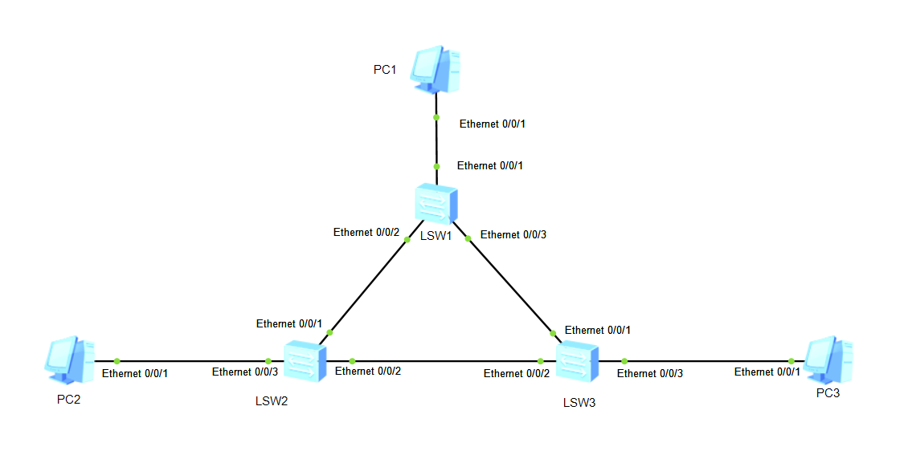
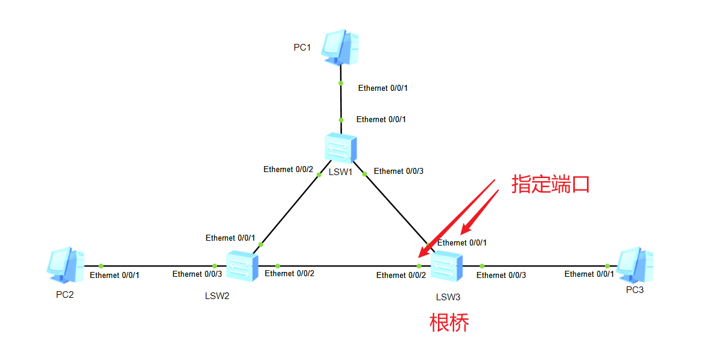
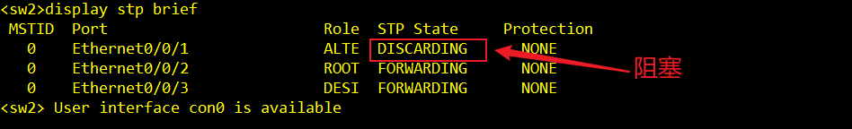
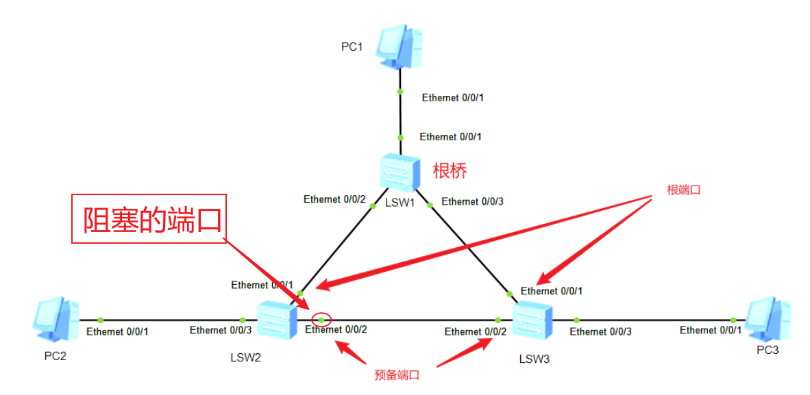
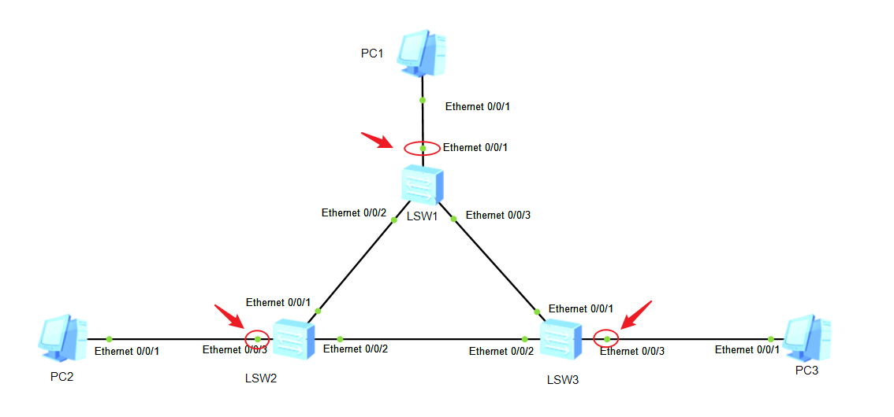

# 05.STP协议的详解

## 一、STP概述

### 1、STP定义

> 为了<font color='orange'>提高网络可靠性</font>，交换网络中通常会使用<font color='orange'>冗余链路</font>。然而，<font color='orange'>冗余链路会给交换网络带来环路风险</font>，并导致<font color='orange'>广播风暴以及MAC地址表不稳定</font>等问题，进而会影响到用户的通信质量。
>
> STP可以在<font color='red'>提高可靠性的同时又能避免环路带来的各种问题</font>，<font color='orange'>**STP（Spanning Tree Protocol）是生成树协议**</font>的英文缩写。该协议可应用于在网络中建立树形拓扑，消除网络中的环路，并且可以通过一定的方法实现路径冗余，但不是一定可以实现路径冗余。
>

### 2、冗余链路的问题

> * 冗余链路互相广播，无限转发，产生广播风暴。
> * 多帧复制：发送方经多条链路送达接收方，接受方收到多次数据帧。
> * MAC地址紊乱：发送方经多条链路送达接收方，其中多条链路产生交换机有环路，交换机多次绑定同一mac地址。
>

### 3、STP分为三个版本

> * 802.1D普通生成树STP
> * 802.1W快速生成树RSTP
> * 802.1S多生成树MSTP
>

### 4、STP的作用

> * 通过阻塞端口来消除环路
> * 实现链路备份的目的
>

## 二、STP的实验

实验目的：==寻找根桥、寻找根端口、指定根桥==

‍



‍


> 注意：华为交换机默认stp模式为mstp模式，本实验三个交换机都先改为stp模式。更改命令`stp mode stp`

### ‍1、查看stp详细信息（寻找根桥）

使用命令查看stp详细信息：display stp

```bash
<sw1>display stp
-------[CIST Global Info][Mode STP]-------
CIST Bridge         :32768.4c1f-cc68-2c90      #本地网桥ID,格式：优先级.MAC。默认优先级：32768，本地MAC：4c1f-cc68-2c90
Config Times        :Hello 2s MaxAge 20s FwDly 15s MaxHop 20
Active Times        :Hello 2s MaxAge 20s FwDly 15s MaxHop 20
CIST Root/ERPC      :32768.4c1f-cc38-2ab6 / 200000    #根桥：32768.4c1f-cc38-2ab6 开销值：200000
CIST RegRoot/IRPC   :32768.4c1f-cc68-2c90 / 0
CIST RootPortId     :128.3
BPDU-Protection     :Disabled
TC or TCN received  :366
TC count per hello  :0
STP Converge Mode   :Normal 
Time since last TC  :0 days 0h:2m:46s
Number of TC        :37
Last TC occurred    :Ethernet0/0/3
...
```

> ‍Bridge ID：优先级+MAC，默认优先级32768
>

本地网桥ID：32768.4c1f-cc68-2c90，根桥32768.4c1f-cc38-2ab6，两者不同说明SW1不是根桥

```bash
<sw2>dis stp
-------[CIST Global Info][Mode STP]-------
CIST Bridge         :32768.4c1f-ccf2-2eb3
Config Times        :Hello 2s MaxAge 20s FwDly 15s MaxHop 20
Active Times        :Hello 2s MaxAge 20s FwDly 15s MaxHop 20
CIST Root/ERPC      :32768.4c1f-cc38-2ab6 / 200000
CIST RegRoot/IRPC   :32768.4c1f-ccf2-2eb3 / 0
CIST RootPortId     :128.2
BPDU-Protection     :Disabled
```

同理sw2也不是根桥。既然sw1和sw2都不是，那sw3肯定是，如下图


判断根桥的方法1：<font color='red'>本地Bridge ID=根桥Bridge ID</font>

### 2、查看stp简要信息（寻找根端口）

查询STP简要信息


对比看一下：sw3为根桥，根桥上面没有根端口

```bash
<sw1>display stp brief 
 MSTID  Port                        Role  STP State     Protection
   0    Ethernet0/0/1               DESI  FORWARDING      NONE
   0    Ethernet0/0/2               DESI  FORWARDING      NONE
   0    Ethernet0/0/3               ROOT  FORWARDING      NONE        #角色为ROOT，则为根端口


<sw2>display stp brief
 MSTID  Port                        Role  STP State     Protection
   0    Ethernet0/0/1               ALTE  DISCARDING      NONE
   0    Ethernet0/0/2               ROOT  FORWARDING      NONE		   #根端口
   0    Ethernet0/0/3               DESI  FORWARDING      NONE


<sw3>display stp brief
 MSTID  Port                        Role  STP State     Protection
   0    Ethernet0/0/1               DESI  FORWARDING      NONE
   0    Ethernet0/0/2               DESI  FORWARDING      NONE
   0    Ethernet0/0/3               DESI  FORWARDING      NONE
```

‍判断根桥的方法2：<font color='red'>STP接口信息中，角色一列没有root的设备就是跟桥</font>

在拓扑图上看就如下图：


根据上述实验一，我们了解如何判断跟桥和根端口。接下来结合上面的实验来看几个概念。

## 三、STP的角色

### 跟桥的优先级

Bridge ID（BID）：网桥优先级+MAC地址

网桥优先级，优先级的值越小，越优先。默认32768  
如果优先级一致，就去看网桥MAC地址，值越小，越优先。

优先级的修改，修改命令如下：

```bash
stp priority 优先级值
```

优先级值必须是==4096的倍数==

指定某个设备为跟桥

```bash
stp root primary    #使用这条命令，则优先级会变成0
```

### 根端口

根端口，简称RP

到根桥最小的路径成本，即：网桥到根网桥的路径上所有链路的成本之和。

直连网桥ID值：cost值，带宽越低，成本越高，带宽越大，成本越低

端口ID值：端口优先级+端口号

### 选择指定端口

指定端口，简称DP

根网桥上的端口都不是根端口，而是指定端口



现在问题来了：<font color='red'>为什么SW2的E0/0/1不是指定端口？</font> SW1和SW2都不是跟桥，他们被称为非根网桥

### 非根桥的指定端口选择顺序

* 1.根路径成本较低（两者相同）
* 2.所在的交换机的网桥ID值较小
* 3.端口ID的值较小

我们接着来解决上面提出的问题：  
	- SW1：32768.4c1f-cc68-2c90  
	- SW2：32768.4c1f-ccf2-2eb3  
前面都是32768，那就比MAC大小。最简单的MAC地址大小比较方法：

> MAC地址是由16进制表示组成的，因此熟悉和了解16进制的表示方法就可比较MAC的地址大小了，更好了解网络协议例如STP 等。
>
> 16进制表示方法 1 2 3 4 5 6 7 8 9 (10--A) (11--B) (12--C) (13--D) (14--E) (15--F) 这样就可以比较大小了。

32768.4c1f都相同，很明显cc68< ccf2，所以SW1的网桥ID值较小（必出高下之后就不在往下比了。）  
SW1的网桥ID值较小，就意味着优先级比SW2高。那么SW1的E0/0/2会成为指定端口，被比下去的会成为预备端口。

### 预备端口

预备端口，简称AP。排除根端口和指定端口，剩下的就是预备端口，==预备端口会被阻塞==。如下图：


预备端口将会被阻塞

​

## 四、STP状态

|状 态|用 途|
| -----------------------------| -----------------------------------------------|
|转发（Forwarding）|发送/接受用户数据|
|学习（Learning）|构建网桥表 （会确定根网桥、根端口与阻塞端口）|
|侦听（Listening）|构建活动拓扑|
|阻塞（Blocking/Discarding）|只接受BPDU|
|禁用（Disabled）|强制关闭|

我们结合STP的接口来研究一下：

```bash
<sw1>display stp brief 
 MSTID  Port                        Role  STP State     Protection
   0    Ethernet0/0/1               DESI  FORWARDING      NONE
   0    Ethernet0/0/2               DESI  FORWARDING      NONE
   0    Ethernet0/0/3               ROOT  FORWARDING      NONE        #角色为ROOT，则为根端口


<sw2>display stp brief
 MSTID  Port                        Role  STP State     Protection
   0    Ethernet0/0/1               ALTE  DISCARDING      NONE		   #阻塞
   0    Ethernet0/0/2               ROOT  FORWARDING      NONE		   #根端口
   0    Ethernet0/0/3               DESI  FORWARDING      NONE


<sw3>display stp brief
 MSTID  Port                        Role  STP State     Protection
   0    Ethernet0/0/1               DESI  FORWARDING      NONE
   0    Ethernet0/0/2               DESI  FORWARDING      NONE
   0    Ethernet0/0/3               DESI  FORWARDING      NONE
```

‍

## 五、修改根桥的优先级控制阻塞端口

根据下图现状预备端口SW2 E0/0/1被阻塞，现在我们想让PC1和PC2互访，那么PC1和PC2互访势必会经过SW3。现在我们想<font color='red'>让SW1变为根桥</font>，保证阻塞端口为SW3的E0/0/2口


### SW1变为根桥

分析思路：由端口选举规则可以判断，需要进行对比Bridge ID，越小越优先。我们将SW1的Bridge ID改小即可

```bash
[sw1]stp priority 0  或者  stp root primary
```

我们看到sw2的Ethernet0/0/2被阻塞。

```bash
[sw2]dis stp brief 
 MSTID  Port                        Role  STP State     Protection
   0    Ethernet0/0/1               ROOT  FORWARDING      NONE
   0    Ethernet0/0/2               ALTE  DISCARDING      NONE
   0    Ethernet0/0/3               DESI  FORWARDING      NONE
```

‍

此时拓扑变为：


但是阻塞的端口为SW2的E0/0/2,我们需要的是阻塞SW3的E0/0/2



修改SW2的优先级

```bash
[sw2]stp priority 4096
```

‍

此时三个交换机之间的优先级是：==SW1&gt;SW2&gt;SW3。==

### PC的端口快速转发

思路：只有配置为边缘端口的交换端口不需要参与STP计算；



交换端口不需要参与STP计算

```bash
[sw1]int e0/0/1
[sw1-Ethernet0/0/1]stp edged-port enable #端口不需要参与STP计算

[sw2]int e0/0/3
[sw2-Ethernet0/0/3]stp edged-port enable

[sw3]int e0/0/3
[sw3-Ethernet0/0/3]stp edged-port enable 
```

‍

## 六、各状态之间的时间关系

端口状态之间的延时时间：

* 阻塞状态到转发状态 50S（后面实验我们是验证）
* 阻塞状态到侦听状态 20S
* 侦听状态到学习状态 15S
* 学习状态到转发状态 15S

‍普通生成树STP不能实现快速收敛,但是在STP中诸如 Hello [Time](https://so.csdn.net/so/search?q=Time&spm=1001.2101.3001.7020)定时器、Max Age定时器、Forward Delay定时器、未收到上游的BPDU就重新开始生成树计算的超时时间等参数会影响其收敛速度。通过配置合适的系统参数,可以使STP实现最快的拓扑收敛。

==配置STP定时器实验==

https://blog.csdn.net/weixin_43773979/article/details/139566054

‍

‍
