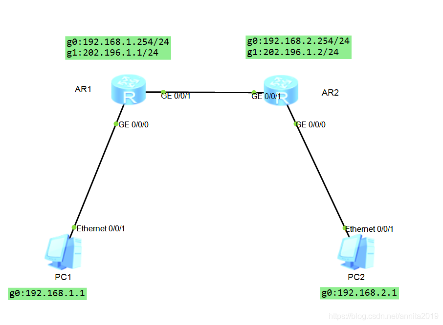

## 一、动态路由概述

动态路由协议是路由器之间用于自动交换路由信息、实时更新路由表的网络协议，它能让路由器根据网络拓扑的变化（如链路故障、新增设备）动态调整最佳转发路径，无需管理员手动配置每一条路由条目。

- 自动化路由学习：路由器通过与相邻路由器交换路由信息，自动构建全网的拓扑结构，并计算出到达各目标网络的最优路径。
- 拓扑自适应能力：当网络拓扑发生变化（如某条链路断开），路由器会快速感知并向全网广播变化信息，所有路由器同步更新路由表，避免数据转发失败。
- 减少人工运维成本：相比于静态路由（需管理员手动逐条配置），动态路由协议在大型网络中能大幅降低配置和维护的工作量。

### 1. 按**路由算法**分类

| 类型             | 核心原理                                                     | 代表协议    | 适用场景           |
| ---------------- | ------------------------------------------------------------ | ----------- | ------------------ |
| **距离矢量协议** | 路由器向邻居发送**自身路由表的副本**，基于 “跳数” 等指标计算最优路径 | RIP、IGRP   | 小型、扁平网络     |
| **链路状态协议** | 路由器向全网发送**自身直连链路的状态信息**，基于全网拓扑计算最短路径 | OSPF、IS-IS | 中大型、分层网络   |
| **路径矢量协议** | 基于距离矢量改进，增加**路径属性**（如 AS 号），避免路由环路 | BGP         | 互联网级别的广域网 |

### 2. 按**适用范围**分类

- **内部网关协议（IGP）**：用于**自治系统（AS）内部**的路由交换，如 RIP、OSPF、IS-IS。
- **外部网关协议（EGP）**：用于**不同自治系统之间**的路由交换，主流协议为 BGP。

### 3、关键术语

1. **自治系统（AS）**：由同一管理机构控制的一组路由器和网络的集合，是路由协议的重要边界。
2. **度量值（Metric）**：路由协议判断路径优劣的指标，不同协议的度量标准不同（如 RIP 用跳数，OSPF 用链路带宽 / 延迟）。
3. **路由环路**：数据包在网络中循环转发的现象，动态路由协议通过**水平分割**、**毒性反转**等机制避免此问题。

### 4、典型应用场景

- 企业园区网、数据中心内部网络：常用 **OSPF** 协议，支持分层设计和快速收敛。
- 互联网骨干网：依赖 **BGP** 协议，实现不同运营商之间的路由互通。
- 小型办公网络：可使用 **RIP** 协议，配置简单、资源消耗低。

## 二、Rip协议的介绍

### RIP定义

RIP(Routing information Protocol)是一种用于自治系统AS（`AUtonomous System`）内部的一种动态路由协议。它是一种较为简单的内部网关协议（`interior Gageway protocol,IGP`）

RIP是一种基于距离矢量（`Distance-Vector`）算法的协议，它通过<font color='red'>UDP报文</font>进行路由信息的交换，使用的<font color='red'>端口号为520</font>

- 直连网络的跳数为 `0`。
- 每经过一个路由器，跳数加 `1`。
- RIP规定<font color='red'>最大跳数为15</font>，跳数为 `16` 时被视为不可达网络，这也决定了 RIP 仅适用于小型网络。

RIP定时器

> - `update`为更新周期，RIP路由器会按照该周期定时发送路由更新报文；`Age`为**老化时间**，若RIP路由器在老化时间内未收到某条路由的更新报文，则判定该路由不可达。
> - `Suppress`是抑制时间，在这段时间内最佳路由信息的发布被抑制。如果Garbage-Collect超时，且不可达路由没有收到来自同一领导的更新，则该路由被从路由表中彻底删除。

### 1.RIP协议如何工作？

在路由器上开启RIP协议，并将路由器的直连网段宣告进RIP后，RIP会将这些直连网段信息封装成RIP协议报文，发送给邻居路由器。这样邻居路由器间就可以相互学习对方的网段信息，实现网络的互通。

### 2.如何配置基本的RIP网络？

- 开启RIP协议
- 将路由器的直连网段宣告进RIP协议。

### 3.RIP如何计算开销值？

- RIP是基于跳数来计算的开销值。所谓跳数即是跨越网段的数量。
- RIP路由的最大网络跳数为15，如果一条RIP路由的跳数到达16，路由器则认为该路由不可达。

## 实验环境
实验注意事项：AR1和AR2直连的地址段必须是没有任何子网的网络地址。



## R1配置

```bash
<Huawei>sys
Enter system view, return user view with Ctrl+Z.
[Huawei]sys R1
[R1]int g0/0/0
[R1-GigabitEthernet0/0/0]ip add	
[R1-GigabitEthernet0/0/0]ip address 192.168.1.254 24
[R1-GigabitEthernet0/0/0]q

[R1]int g0/0/1
[R1-GigabitEthernet0/0/1]
[R1-GigabitEthernet0/0/1]ip address 202.196.1.1 24
[R1-GigabitEthernet0/0/1]q

[R1]rip 1         #rip的ID为1
[R1-rip-1]ver 2   #版本为2
[R1-rip-1]undo summary   #关闭路由自动聚合（即所有路由信息都会按照IP地址分类归类）
[R1-rip-1]network 192.168.1.0    #宣告网段
[R1-rip-1]network 202.196.1.0    #宣告网段
[R1-rip-1]q
[R1]
```

## R2配置

```bash
[R2]int g0/0/1
[R2-GigabitEthernet0/0/1]ip address 202.196.1.2 24
[R2-GigabitEthernet0/0/1]q

[R2-GigabitEthernet0/0/0]
[R2-GigabitEthernet0/0/0]ip address 192.168.2.254 24
[R2-GigabitEthernet0/0/0]q
[R2]rip 1
[R2-rip-1]ver 2
[R2-rip-1]undo summary
[R2-rip-1]network 192.168.2.0
[R2-rip-1]network 202.196.1.0
[R2-rip-1]
```

## 验证结果

在PC1上`ping`PC2

```bash
PC>ping 192.168.2.1

Ping 192.168.2.1: 32 data bytes, Press Ctrl_C to break
Request timeout!
From 192.168.2.1: bytes=32 seq=2 ttl=126 time=16 ms
From 192.168.2.1: bytes=32 seq=3 ttl=126 time=16 ms
From 192.168.2.1: bytes=32 seq=4 ttl=126 time=15 ms
From 192.168.2.1: bytes=32 seq=5 ttl=126 time=16 ms

--- 192.168.2.1 ping statistics ---
  5 packet(s) transmitted
  4 packet(s) received
  20.00% packet loss
  round-trip min/avg/max = 0/15/16 ms

```