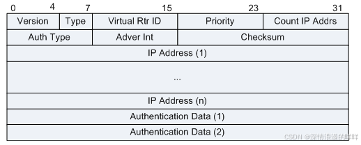
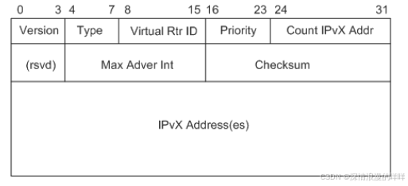
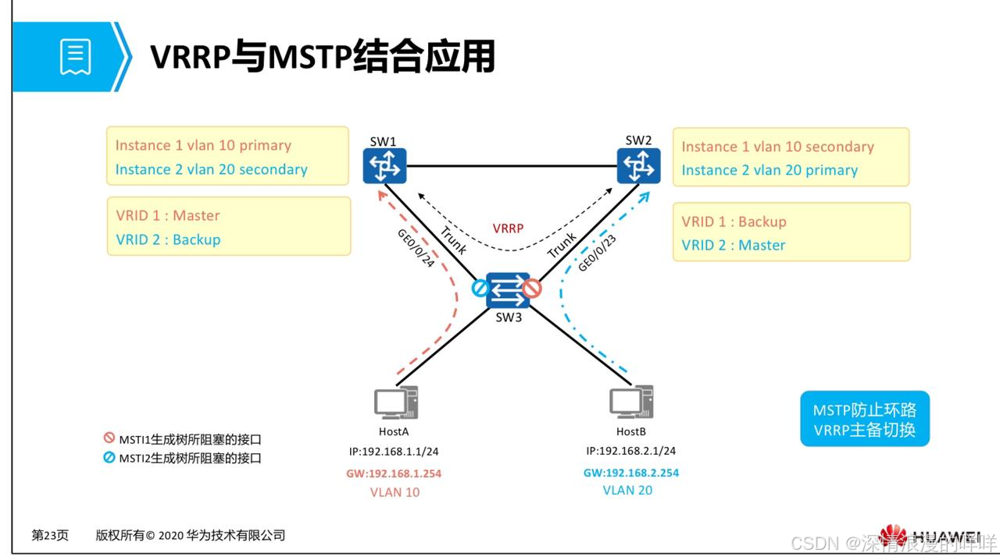

# VRRP协议的深度剖析

一、VRRP简介
---------

VRRP报文通告是通过组播来通告的，组播地址：<font color='red'>224.0.0.18</font>，组播 MAC：01-00-5e-00-00-12，VRRP是三层协议，通过 IP协议承载，协议号<font color='red'>112</font>。同时 IP 包中的 TTL 值为 255。

VRRP 需要通过VRRP报文来选举 Master 和 Backup，只有 Master 才能装发数据，而 backup 不装发数据，收到数据帧后丢弃。

### 1. 定义

虚拟路由冗余协议VRRP（Virtual Router Redundancy Protocol）通过<font color='orange'>把几台路由设备联合组成一台虚拟的路由设备</font>，<font color='red'>将虚拟路由设备的 IP 地址作为用户的默认网关实现与外部网络通信。</font>当网关设备发生故障时，VRRP机制能够选举新的网关设备承担数据流量，从而保障网络的可靠通信。

### 2. 目的

VRRP能够在不改变组网的情况下，采用将多台路由设备组成一个虚拟路由器，通过配置虚拟路由器的 IP 地址为默认网关，实现默认网关的备份。当网关设备发生故障时，VRRP 机制能够选举新的网关设备承担数据流量，从而保障网络的可靠通信。

### 3. 优点

- 简化网络管理。在具有多播或广播能力的局域网（如以太网）中，借助 VRRP 能在网关设备出现故障时仍然提供<font color='red'>高可靠的缺省链路</font>，无需修改主机及网关设备的配置信息便可<font color='red'>有效避免单一链路发生故障（单点故障）</font>后的网络中断问题。

- 适应性强：VRRP报文封装在IP报文中，支持各种上层协议。

- 网络开销小：VRRP只定义了一种报文——VRRP通告报文，并且只有处于Master状态的路由器可以发送VRRP报文。

二、VRRP原理描述
-----------

### 1.VRRP 概述

*   VRRP路由器（VRRP Router）：运行VRRP协议的设备，它可能属于一个或多个虚拟路由器。
    
*   虚拟路由器（Virtual Router）：又称VRRP备份组，由一个Master设备和多个Backup设备组成，被当作一个共享局域网内主机的缺省网关。
    
*   Master路由器（Virtual Router Master）：承担转发报文任务的 VRRP 设备。
    
*   Backup路由器（Virtual Router Backup）：一组没有担转发任务的 VRRP 设备，当 Master 设备出现故障时，它们将通过竞选成为新的 Master 设备。
    
*   VRID：虚拟路由器的标识。
    
*   虚拟IP地址 (Virtual IP Address)：虚拟路由器的 IP 地址，一个虚拟路由器可以有一个或多个 IP 地址，由用户配置。
    
*   IP地址拥有者（IP Address Owner）：如果一个VRRP设备将虚拟路由器IP地址作为真实的接口地址，则该设备被称为 IP 地址拥有者。如果IP地址拥有者是可用的，通常它将成为Master
    
*   虚拟MAC地址（Virtual MAC Address）：虚拟路由器根据虚拟路由器 ID 生成的 MAC 地址。一个虚拟路由器拥有一个虚拟MAC地址。<font color='orange'>当虚拟路由器回应ARP请求时，使用虚拟MAC地址，而不是接口的真实MAC地址。</font>
    

### 2.VRRP 报文

*   VRRP 协议报文用来将 Master 设备的优先级和状态通告给同一备份组的所有 Backup 设备。
    
*   VRRP 协议报文封装在 IP 报文中，发送到分配给 VRRP 的 IP 组播地址。在 IP 报文头中，源地址为发送报文接口的主 IP 地址（不是虚拟 IP 地址），目的地址是 224.0.0.18，TTL是 255，协议号是 112。
    
*   VRRP 报文的 IP 头中，TTL 必须为 255。当 VRRP 路由器收到 TTL 不等于 255 的 VRRP 协议报文后，必须丢弃。
    
*   主 IP 地址（Primary IP Address）：从接口的真实 IP 地址中选出来的一个主用 IP 地址，通常选择配置的第一个 IP 地址。
    
*   目前，VRRP 协议包括两个版本：VRRPv2 和 VRRPv3。VRRPv2 仅适用于 IPv4 网络，VRRPv3 适用于 IPv4 和 IPv6 两种网络。
    
*   基于不同的网络类型，VRRP 可以分为 VRRP for IPv4 和 VRRP for IPv6（简称 VRRP6）。VRRP for IPv4 支持 VRRPv2 和 VRRPv3，而 VRRP for IPv6 仅支持 VRRPv3。
    

### 3.VRRP 报文结构

VRRPv2：



VRRPv3：



### 4. 字段解释

<table><tbody><tr><td>字段</td><td>长度</td><td>描述</td></tr><tr><td>Version</td><td>4 比特</td><td>指 VRRP 协议版本，VRRPv2 此字段为 2，VRRPv3 此字段为 3。</td></tr><tr><td>Type</td><td>4 比特</td><td>定义了 VRRP 报文的类型。本版本的协议仅定义了一个报文类型：1：ADVERTISEMENT 带有未知类型的报文必须被丢弃。</td></tr><tr><td>Virtual Rtr ID8</td><td>8 比特</td><td>虚拟路由器标识（VRID）字段标识了此报文所报告状态的虚拟路由器。可配置的范围是 1–255。没有缺省值。</td></tr><tr><td>Priority</td><td>8 比特</td><td>Priority 字段申明了发送此报文的 VRRP 路由器的优先级。值越高优先级越高。该字段为 8 位无符号整型。如果 VRRP 路由器是虚拟路由器地址的 IP 地址所有者，那么其优先级必须为 255。起备用作用的 VRRP 路由器的优先级必须在 1–254 之间。缺省优先级为 100。优先级值 0 用于指示当前虚拟路由器的主路由器停止参与 VRRP 组。主要用于触发备用路由器快速地迁移到主路由器，而不用等待当前主路由器超时。</td></tr><tr><td>Count IP Addrs</td><td>8 比特</td><td>在此 VRRP 通告中包含的 IP 地址的数量。</td></tr><tr><td>Auth Type</td><td>8 比特</td><td>认证类型字段用于标识要用到的认证方法。在一个虚拟路由器组内认证类型是唯一的。认证类型字段是一个 8 位无符号整型。如果报文携带未知的认证类型或者该认证类型和本地配置的认证方法不匹配，那么该报文必须被丢弃。目前定义的认证方法有：0 : No Authentication 不认证该认证类型表明 VRRP 协议报文的交换不需要认证。在发送 VRRP 协议报文时，Authentication Data 字段将被置为 0；而在接收协议报文时，Authentication Data 字段被忽略。 1 : Simple Text Password，表示明文认证方式。2: IP Authentication Header，表示 MD5 认证方式。</td></tr><tr><td>Adver Int</td><td>8 比特</td><td>VRRP 通告间隔时间，单位为秒。缺省为 1 秒。这个字段主要用于错误配置路由器时的故障定位和解决。</td></tr><tr><td>Checksum</td><td>16 比特</td><td>16 位校验和，用于检测 VRRP 报文中的数据破坏情况。</td></tr><tr><td>IP Address</td><td>32 比特</td><td>VRRP 备份组的虚拟 IPv4 地址 或者虚拟 IPv6 地址</td></tr><tr><td>Authentication Data</td><td>32 比特</td><td>VRRP 报文的认证字。目前只有明文认证和 MD5 认证才用到该部分，对于其它认证方式，一律填 0。</td></tr></tbody></table>

### 5.VRRPv2 和 v3 的区别

*   支持的网络类型不同。VRRPv3 适用于 IPv4 和 IPv6 两种网络，而 VRRPv2 仅适用于 IPv4 网络。
    
*   认证功能不同。VRRPv3 不支持认证功能，而 VRRPv2 支持认证功能。
    
*   VRRPv2 版本保留报文的认证字段，是为了兼容早期版本（RFC2338），VRRP 认证并不能提高安全性。
    
*   发送通告报文的时间间隔的单位不同。VRRPv3 支持的是厘秒级，而 VRRPv2 支持的是秒级。
    

### 6.VRRP 认证

*   无认证方式：设备对要发送的 VRRP 通告报文不进行任何认证处理，收到通告报文的设备也不进行任何认证，认为收到的都是真实的、合法的 VRRP 报文。
    
*   简单字符（Simple）认证方式：发送 VRRP 通告报文的设备将认证方式和认证字填充到通告报文中，而收到通告报文的设备则会将报文中的认证方式和认证字与本端配置的认证方式和认证字进行匹配。如果相同，则认为接收到的报文是合法的 VRRP 通告报文；否则认为接收到的报文是一个非法报文，并丢弃这个报文。
    
*   MD5 认证方式：发送 VRRP 通告报文的设备利用 MD5 算法对认证字进行加密，**加密后保存在 Authentication Data 字段**中。收到通告报文的设备会对报文中的认证方式和解密后的认证字进行匹配，检查该报文的合法性。
    

### 7.VRRP 报文抓包示例

VRRPv2：


VRRPv3：


## 三、VRRP 工作原理

### 1.VRRP 状态机

VRRP 协议中定义了三种状态机：初始状态（Initialize）、活动状态（Master）、备份状态（Backup）。其中，只有处于 Master 状态的设备才可以转发那些发送到虚拟 IP 地址的报文。

#### Initialize：

*   该状态为 VRRP 不可用状态，在此状态时设备不会对 VRRP 报文做任何处理。
    
*   通常刚配置 VRRP 时或设备检测到故障时会进 Initialize 状态。
    
*   收到接口 Up 的消息后，如果设备的优先级为 255，则直接成为 Master 设备；如果设备的优先级小于 255，则会先切换至 Backup 状态。
    

#### Master：

*   定时（Advertisement Interval）发送 VRRP 通告报文。
    
*   以虚拟 MAC 地址响应对虚拟 IP 地址的 ARP 请求。
    
*   转发目的 MAC 地址为虚拟 MAC 地址的 IP 报文。
    
*   如果它是这个虚拟 IP 地址的拥有者，则接收目的 IP 地址为这个虚拟 IP 地址的 IP 报文。否则，丢弃这个 IP 报文。
    
*   如果收到比自己优先级大的报文，立即成为 Backup。
    
*   如果收到与自己优先级相等的 VRRP 报文且本地接口 IP 地址小于对端接口 IP，立即成为 Backup。
    

#### Backup：

*   接收 Master 设备发送的 VRRP 通告报文，判断 Master 设备的状态是否正常。
    
*   对虚拟 IP 地址的 ARP 请求，不做响应。
    
*   丢弃目的 IP 地址为虚拟 IP 地址的 IP 报文。
    
*   如果收到优先级和自己相同或者比自己大的报文，则重置 Master_Down_Interval 定时器，不进一步比较 IP 地址。
    
*   Master_Down_Interval 定时器：Backup 设备在该定时器超时后仍未收到通告报文，则会转换为 Master 状态。计算公式如下：Master_Down_Interval=(3*Advertisement_Interval) + Skew_time。其中，Skew_Time=(256–Priority)/256。
    
*   如果收到比自己优先级小的报文且该报文优先级是 0 时，定时器时间设置为 Skew_time（偏移时间），如果该报文优先级不是 0，丢弃报文，立刻成为 Master。
    

### 2.VRRP 工作过程

1.  VRRP 备份组中的设备根据优先级选举出 Master。Master 设备通过发送免费 ARP 报文，将虚拟 MAC 地址通知给与它连接的设备或者主机，从而承担报文转发任务。
    
2.  Master 设备周期性向备份组内所有 Backup 设备发送 VRRP 通告报文，以公布其配置信息（优先级等）和工作状况。
    
3.  如果 Master 设备出现故障，VRRP 备份组中的 Backup 设备将根据优先级重新选举新的 Master。
    
4.  VRRP 备份组状态切换时，Master 设备由一台设备切换为另外一台设备，新的 Master 设备会立即发送携带虚拟路由器的虚拟 MAC 地址和虚拟 IP 地址信息的免费 ARP 报文，刷新与它连接的主机或设备中的 MAC 表项，从而把用户流量引到新的 Master 设备上来，整个过程对用户完全透明。
    
5.  原 Master 设备故障恢复时，若该设备为 IP 地址拥有者（优先级为 255），将直接切换至 Master 状态。若该设备优先级小于 255，将首先切换至 Backup 状态，且其优先级恢复为故障前配置的优先级。
    
6.  Backup 设备的优先级高于 Master 设备时，由 Backup 设备的工作方式（抢占方式和非抢占方式）决定是否重新选举 Master。
    
    1.  抢占模式：在抢占模式下，如果 Backup 设备的优先级比当前 Master 设备的优先级高，则主动将自己切换成 Master。
        
    2.  非抢占模式：在非抢占模式下，只要 Master 设备没有出现故障，Backup 设备即使随后被配置了更高的优先级也不会成为 Master 设备。
        

### 3.Master 设备的选举

VRRP 根据优先级来确定虚拟路由器中每台设备的角色（Master 设备或 Backup 设备）。优先级越高，则越有可能成为 Master 设备。

*   如果 VRRP 报文中 Master 设备的优先级高于或等于自己的优先级，则 Backup 设备保持 Backup 状态。
    
*   如果 VRRP 报文中 Master 设备的优先级低于自己的优先级，采用抢占方式的 Backup 设备将切换至 Master 状态，采用非抢占方式的 Backup 设备仍保持 Backup 状态。
    
*   如果多个 VRRP 设备同时切换到 Master 状态，通过 VRRP 通告报文的交互进行协商后，优先级较低的 VRRP 设备将切换成 Backup 状态，优先级最高的 VRRP 设备成为最终的 Master 设备；优先级相同时，VRRP 设备上 VRRP 备份组所在接口主 IP 地址较大的成为 Master 设备。
    
*   如果创建的 VRRP 设备为 IP 地址拥有者，收到接口 Up 的消息后，将会直接切换至 Master 状态。
    

### 4.Master 设备状态的通告

*   当 Master 设备主动放弃 Master 地位（如 Master 设备退出备份组）时，会发送优先级为 0 的通告报文，用来使 Backup 设备快速切换成 Master 设备，而不用等到 Master_Down_Interval 定时器超时。这个切换的时间称为 Skew time，计算方式为：（256－Backup 设备的优先级）/256，单位为秒。
    
*   当 Master 设备发生网络故障而不能发送通告报文的时候，Backup 设备并不能立即知道其工作状况。等到 Master_Down_Interval 定时器超时后，才会认为 Master 设备无法正常工作，从而将状态切换为 Master。其中，Master_Down_Interval 定时器取值为：3×Advertisement_Interval＋Skew_time，单位为秒。
    

> 在性能不稳定的网络中，网络堵塞可能导致 Backup 设备在 Master_Down_Interval 期间没有收到 Master 设备的报文，Backup 设备则会主动切换为 Master。如果此时原 Master 设备的报文又到达了，新 Master 设备将再次切换回 Backup。如此则会出现 VRRP 备份组成员状态频繁切换的现象。为了缓解这种现象，可以配置抢占延时，使得 Backup 设备在等待了 Master_Down_Interval 后，再等待抢占延迟时间。如在此期间仍没有收到通告报文，Backup 设备才会切换为 Master 设备。

### 5.VRRP 负载分担

负载分担是指多个 VRRP 备份组同时承担业务，VRRP 负载分担与 VRRP 主备备份的基本原理和报文协商过程都是相同的。同样对于每一个 VRRP 备份组，都包含**一个 Master 设备和若干 Backup 设备**。与主备备份方式不同点在于：负载分担方式需要建立多个 VRRP 备份组，各备份组的 Master 设备可以不同；同一台 VRRP 设备可以加入多个备份组，在不同的备份组中具有不同的优先级。


### 6. **多网关负载分担**

通过创建多个带虚拟 IP 地址的 VRRP 备份组，为不同的用户指定不同的 VRRP 备份组作为网关，实现负载分担。

### 7. 如何选举 Master 和 Backup？

1.  比较优先级，默认情况下优先级为 100，最大可以配置的优先级为 1-254，优先级越大越优。优先级如果为 0，说明退出 Master（Master 离组，例如在 Master 的接口下删除 VRRP 配置）
    
2.  如果优先级一样，IP 地址大的一端成为 Master。
    

> Master：
> 
> 1.  可以装发报文。
>     
> 2.  应答 ARP 请求。
>     
> 3.  通告基于 VIP 的免费 ARP。
>     
> 4.  master 定时通告 VRRP 报文。
>     
> 
> Backup：
> 
> 1.  如果 backup 接收到目标 mac 为虚拟 mac 地址的数据帧，丢弃不转发。
>     
> 2.  backup 被动接收 vrrp 报文，不通告。
>     

### 8. 影响 VRRP 协商的条件

1.  IP 包头中的 TTL 值必须为 255.
    
2.  版本必须一致。
    
3.  VRRP 报文中的字段必须一致。（Authen date）
    
4.  VRID 必须一致。
    
5.  认证类型和认证必须一致。
    
6.  VIP（Count ip address）列表必须一致。
    
7.  VRRP 报文通告间隔必须一致（华为 Backup 会使用 master 端的通告间隔）
    
8.  checksum 必须一致。
    

四、VRRP 应用
---------

### 1.VRRP 与接口状态联动监视上行接口

VRRP 备份组只能感知其所在接口状态的变化，当 VRRP 设备上行接口或直连链路发生故障时，VRRP 无法感知，此时会引起业务流量中断。通过部署 VRRP 与接口状态联动监视上行接口可以有效地解决上述问题，当 Master 设备的上行接口或直连链路发生故障时，通过调整自身优先级，触发主备切换，确保流量正常转发。

*   如果 VRRP 设备上配置以 Increased 方式监视一个接口，当被监视的接口状态变成 Down 后，该 VRRP 设备的优先级增加指定值。
    
*   如果 VRRP 设备上配置以 Reduced 方式监视一个接口，当被监视的接口状态变为 Down 后，该 VRRP 设备的优先级降低指定值。
    


### 2.VRRP与BFD/NQA/路由联动监视上行链路

VRRP 只能感知 VRRP 备份组之间的故障，而配置 VRRP 监视上行接口仅能感知 Master 设备上行接口或直连链路的故障，当 Master 设备上行非直连链路故障时，VRRP 无法感知，此时会导致用户流量丢失。通过部署 VRRP 与 BFD/NQA / 路由联动监视上行链路，可以有效地解决上述问题。通过配置 BFD/NQA / 路由检测 Master 上行链路的连通状况，当 Master 设备的上行链路发生故障时，BFD/NQA / 路由可以快速检测故障并通知 Master 设备调整自身优先级，触发主备切换，确保流量正常转发。

VRRP支持与静态的BFD会话类型或静态标识符自协商的BFD会话类型的联动。

### 3.VRRP与MSTP结合应用

*   MSTP 是将一个或多个 VLAN 映射到一个生成树的实例，若干个 VLAN 共用一个生成树，MSTP 可以实现负载均衡。
    
*   VRRP 配置网关可以灵活根据网络拓扑变化而自动切换，提高网络可靠性。
    
*   VRRP+MSTP 可以保证网络冗余备份。
    



## 五、VRRP 配置
### 1. 配置注意事项

- 不同备份组之间的虚拟 IP 地址不能重复，并且必须和接口的 IP 地址在同一网段。
- 保证同一备份组的设备上配置相同的备份组号（_virtual-router-id_）。
- 不同接口上可以绑定相同 _virtual-router-id_ 的 VRRP 备份组。
- 在设备上同时配置 VRRP 和静态 ARP 时，需要注意：当在 Dot1q 终结子接口、QinQ 终结子接口或者 VLANIF 接口下配置 VRRP 时，不能将与这些接口相关的静态 ARP 表项对应的映射 IP 地址作为 VRRP 的虚拟地址。否则会生成错误的主机路由，影响设备之间的正常转发。
-  如果 VRRP 备份组内各路由器上配置的 VRRP 协议版本不同，可能导致 VRRP 报文不能互通。
   

<table><tbody><tr><td>参数</td><td>缺省值</td></tr><tr><td>设备在 VRRP 备份组中的优先级</td><td>100</td></tr><tr><td>抢占方式</td><td>立即抢占</td></tr><tr><td>通告报文发送间隔</td><td>1 秒</td></tr><tr><td>发送免费 ARP 报文时间间隔</td><td>120 秒</td></tr></tbody></table>

### 2. 配置基于 IPv4 的 VRRP 基本功能

#### 1. 创建VRRP备份组

```bash
[接口视图] vrrp vrid 1 virtual-ip 192.168.1.1
//创建VRRP备份组并给备份组配置虚拟IP地址。
```

*   多网关负载分担
    
*   实现多网关负载分担，需要重复执行上述 “主备备份” 的操作步骤，在接口上配置两个或多个 VRRP 备份组，各备份组之间以备份组号（_virtual-router-id_）区分。
    

#### 2. 配置设备在备份组中的优先级

```bash
[接口视图] vrrp vrid 1 priority 100
//配置路由器在备份组中的优先级。
//缺省情况下，优先级的取值是100。数值越大，优先级越高。
```

> *   优先级 0 被系统保留作为特殊用途；优先级值 255 保留给 IP 地址拥有者。通过命令可以配置的优先级取值范围是 1～254。
>     
> *   IP 地址拥有者的优先级固定为 255，用户不能手动修改。但是，用户可以通过 **vrrp** **vrid virtual-router-id priority priority-value** 为 IP 地址拥有者配置一个非 255 的优先级（该优先级不会取代 255，不生效），当 VRRP 备份组不再是 IP 地址拥有者时，其优先级为配置的优先级。
>     
> *   优先级取值相同的情况下，同时竞争 Master 时，备份组所在接口的主 IP 地址较大的成为 Master 设备；VRRP 备份组中先切换至 Master 状态的设备为 Master 设备，其余 Backup 设备不再进行抢占。
>     

#### 3. 配置VRRP协议的版本

基于 IPv4 的 VRRP 支持 VRRPv2 和 VRRPv3 两个版本。如果 VRRP 备份组内各路由器上配置的协议版本不同，可能导致 VRRP 报文不能互通。

```bash
vrrp version { v2 | v3 }
//配置当前设备的VRRP协议版本号。 默认v2。
 
vrrp version-3 send-packet-mode { v2-noly | v3-only | v2v3-both }
//配置VRRPv3发送通告报文的模式。
//缺省情况下，VRRPv3版本备份组发送通告报文的模式为v3-only。
```

#### 4. 配置VRRP的时间参数

| 功能                                        | 应用场景                                                     |
| ------------------------------------------- | ------------------------------------------------------------ |
| 配置 VRRP 通告报文的发送间隔                | Master 设备定时（Advertisement_Interval）向组内的 Backup 设备发送 VRRP 通告报文，通告自己工作正常。如果 Backup 设备在 Master_Down_Interval 定时器超时后仍未收到 VRRP 通告报文，则重新选举 Master。网络流量过大或设备的定时器差异等因素会导致 Backup 设备无法及时接收到 VRRP 报文而发生状态转换，当原 Master 发送的报文到达新 Master 时，新 Master 将再次发生状态切换。通过延长 Master 设备发送 VRRP 报文的时间间隔可以解决此类问题。 |
| 配置路由器在 VRRP 备份组中的抢占延时        | 在不稳定的网络中，可能存在 VRRP 备份组监测的 BFD 等状态频繁振荡或 Backup 设备不能及时收到 VRRP 通告报文的情况，导致 VRRP 发生频繁切换而造成网络振荡。通过调整路由器在 VRRP 备份组中的抢占延时，使 Backup 设备在指定的时间后再进行抢占，有效避免了 VRRP 备份组状态的频繁切换。 |
| 配置 Master 设备发送免费 ARP 报文的超时时间 | VRRP 备份组中，为了确保下游交换机的 MAC 表项正确，Master 设备会定时发送免费 ARP 报文，用来刷新下游交换机上的 MAC 地址表项。说明： 为避免 VRRP 协议震荡，请不要在 VRRP 备用设备上把系统 MAC 或 VRRP 虚 MAC 等一些特殊的 MAC 地址配置成黑洞 MAC。 |
| 配置 VRRP 备份组的状态恢复延迟时间          | 在不稳定的网络中，VRRP 备份组监测的 BFD 或接口等状态频繁振荡会导致 VRRP 备份组状态频繁切换。通过配置 VRRP 备份组的状态恢复延迟时间，VRRP 备份组在接收到接口或 BFD 会话的 Up 事件时不会立刻响应，而是等待配置的状态恢复的延迟时间后，再进行相应的处理，防止因接口或 BFD 会话的频繁震荡而导致的 VRRP 状态的频繁切换。 |


```bash
[接口视图] vrrp vrid 1 timer advertise 1
  //置发送VRRP通告报文的时间间隔。 
  //缺省情况下，发送VRRP通告报文的时间间隔是1秒。
  
 [接口视图] vrrp vrid 1 preempt-mode timer delay 0
 //配置备份组中路由器的抢占延迟时间。 
 //缺省情况下，抢占延迟时间为0，即立即抢占。
 vrrp vrid 1 preempt-mode disable
 //设置备份组中路由器采用非抢占方式。
 
 vrrp gratuitous-arp timeout 120
//配置Master发送免费ARP报文的超时时间。 
//缺省情况下，Master每隔120秒发送一次免费ARP报文。
vrrp gratutious-arp timeout disable
//禁止发送免费ARP
 
vrrp recover-deley 0
//配置VRRP备份组的状态恢复延迟时间。 
//缺省情况下，VRRP备份组状态恢复延迟时间为0秒。
```

*   在配置 VRRP 备份组内各路由器的延迟方式时，建议 Backup 设备配置为立即抢占，Master 设备配置为延时抢占，指定一定的延迟时间。这样配置的目的是为了在网络环境不稳定时，为上下行链路的状态恢复一致性等待一定时间，以免出现双 Master 设备或由于主备双方频繁抢占导致用户设备学习到错误的 Master 设备地址。
    
*   配置的 Master 设备发送免费 ARP 报文超时时间应小于用户侧设备的 MAC 地址表项老化时间。
    

#### 5. 配置VRRP报文在 Sub-VLAN 中的发送方式

当 VRRP 备份组配置在 VLAN 聚合时，用户可以通过命令行配置，使 VRRP 报文在指定的 Sub-VLAN 中传输，避免 VRRP 通告报文在所有 Sub-VLAN 内广播，以节约网络带宽。

```bash
vrrp advertise send-mode { sub-vlan | all}
//配置VRRP通告报文在Super-VLAN中的发送方式。
```

缺省情况下，Master 设备向 Super-VLAN 中状态为 Up 且 VLAN ID 最小的 Sub-VLAN 发送 VRRP 通告报文。

*   如果指定参数 _sub-vlan-id_，VRRP 通告报文只发送给指定 ID 的 Sub-VLAN。
    
*   如果指定参数 **all**，VRRP 通告报文发送给本 Super-VLAN 的所有 Sub-VLAN。
    

#### 6. 配置禁止检测VRRP报文跳数

系统对收到的 VRRP 通告报文的 TTL 值进行检测，如果 TTL 值不等于 255，则丢弃这个报文。在不同设备制造商的设备配合使用的组网环境中，检测 VRRP 报文的 TTL 值可能导致错误地丢弃合法报文，此时用户可以配置系统不检测 VRRP 报文的 TTL 值，以实现不同设备制造商设备之间的互通。

```bash
vrrp un-check ttl
//禁止检测VRRP报文的TTL值。
```

#### 7. 配置VRRP报文的认证方式

VRRPv2 支持在通告报文中设定不同的认证方式和认证字。

> 注：目前仅 VRRPv2 版本支持认证，VRRPv3 版本不支持认证。VRRPv2 版本保留报文的认证字段，是为了兼容早期版本（RFC2338），VRRP 认证并不能提高安全性。

```bash
vrrp vrid 1 authentication-mode { simple {key | plain key | cipher cipher-key} | md5 md5-key}
//配置VRRP报文认证方式。
```

#### 8. 使能虚拟IP地址Ping功能

路由器支持对虚拟 IP 地址的 Ping 功能，可用于：

*   检测备份组中的 Master 设备是否起作用。
    
*   检测是否能通过使用某虚拟 IP 地址作为默认网关与外部通信。
    

```bash
vrrp virtual-ip ping enable
//使能虚拟地址可达性功能。 
//缺省情况下，该功能处于使能状态，Master设备响应对本备份组虚拟IP地址的Ping报文。
 
vrrp arp send-mode simple
//使能Master设备使用QinQ终结子接口下配置的外层Tag
//的VLAN和内层Tag段内的第一个VLAN发送免费ARP报文。
```

## 六、VRRP配置综合实验示例

如下图拓扑，AR1，AR2 为内网路由器，配置 VRRP 虚拟 IP 实现备份。同时在 AR1 与 AR2 之间配置了 BFD，使它们之间可以快速检测链路故障。

- AR3，4，5 为外网路由器。在 AR1 与 AR3 上配置了上行接口检测，当上行接口 GE1/0/0 状态 Down 时，VRRP 备份组能够及时感知并进行主备切换，由 AR2 接替作为网关继续承担业务转发，以减小接口状态 Down 对业务传输的影响。
- 在 AR2 和上还配置了 IP 检测，检测到 4.4.4.4 的链路是否有故障。 配置 VRRP 与路由联动监视上行链路。当非直连上行链路 Down 时，VRRP 优先级自动降低，实现主备快速切换。
- 在 AR1 和 AR2 上还配置了负载分担。现在内网流量通过不同网关走不同路由器。
- 在 AR2 上配置的检测到 4.4.4.4 网段的 NQA，ICMP 直连检测，当传输质量低于百分之八十时，VRRP vrid 2 优先级自动降低，实现主备快速切换。


**配置文件：**

AR1：

```bash
<AR1>dis current-configuration 
#
 sysname AR1
#
vrrp gratuitous-arp timeout 100
//配置免费ARP发送时间间隔为100s
vrrp version v3
//VRRP选择版本v3
vrrp recover-delay 3
//VRRP 恢复延迟3s
#
bfd
#
acl number 2000  
 rule 5 permit source 192.168.1.0 0.0.0.255 
 rule 10 permit source 192.168.2.0 0.0.0.255 
 rule 15 deny 
#
interface GigabitEthernet0/0/0
 ip address 13.1.1.1 255.255.255.0 
 nat outbound 2000 
  //nat ，easy IP，实现内网到外网的地址转换
#
interface GigabitEthernet0/0/1
 ip address 192.168.1.1 255.255.255.0 
 vrrp vrid 1 virtual-ip 192.168.1.254
 vrrp vrid 1 priority 110
 vrrp vrid 1 timer advertise 2
 vrrp vrid 1 track interface GigabitEthernet0/0/0 reduced 30
 vrrp vrid 1 version-3 send-packet-mode v2v3-both
 vrrp vrid 1 track ip route 4.4.4.4 255.255.255.0 reduced 30
 vrrp vrid 1 authentication-mode md5 %$%$[U*W7Y)upJ3N*0#HA_x~~A=8%$%$
 //VRRP vrid 1 认证密码 huawei
 vrrp vrid 2 virtual-ip 192.168.1.253
 vrrp vrid 2 version-3 send-packet-mode v2v3-both
#
bfd 1 bind peer-ip 192.168.1.2 source-ip 192.168.1.1 auto
 commit
#
rip 1
 version 2
 network 13.0.0.0
#
```

AR2：

```bash
<AR2>display current-configuration 
#
 sysname AR2
#
bfd
#
acl number 2000  
 rule 5 permit source 192.168.1.0 0.0.0.255 
 rule 10 permit source 192.168.2.0 0.0.0.255 
 rule 15 deny 
#
interface GigabitEthernet0/0/0
 ip address 25.1.1.2 255.255.255.0 
 nat outbound 2000
#
interface GigabitEthernet0/0/1
 ip address 192.168.1.2 255.255.255.0 
 vrrp vrid 1 virtual-ip 192.168.1.254
 vrrp vrid 1 preempt-mode timer delay 3
 vrrp vrid 1 authentication-mode md5 %$%$)vYYTI4Nv=@M5_0,Yx^/~BLU%$%$
 vrrp vrid 2 virtual-ip 192.168.1.253
 vrrp vrid 2 track nqa vrrp test reduced 20
#
interface GigabitEthernet0/0/2
#
interface NULL0
#
bfd 1 bind peer-ip 192.168.1.1 source-ip 192.168.1.2 auto
 commit
#
rip 1
 version 2
 network 25.0.0.0
#
nqa test-instance vrrp test 
 test-type icmp
 destination-address ipv4 4.4.4.4
 fail-percent 80
 frequency 20
 probe-count 5
 start now
#
```

AR3：

```bash
<AR3>dis current-configuration 
#
 sysname AR3
#
interface GigabitEthernet0/0/0
 ip address 13.1.1.3 255.255.255.0 
#
interface GigabitEthernet0/0/1
 ip address 23.1.1.3 255.255.255.0 
#
interface GigabitEthernet0/0/2
 ip address 34.1.1.3 255.255.255.0 
#
rip 1
 version 2
 network 34.0.0.0
 network 13.0.0.0
#
```

AR4：

```bash
<AR4>dis current-configuration 
#
 sysname AR4
#
interface GigabitEthernet0/0/0
 ip address 34.1.1.4 255.255.255.0 
#
interface GigabitEthernet0/0/1
 ip address 45.1.1.4 255.255.255.0 
#
interface LoopBack0
 ip address 4.4.4.4 255.255.255.255 
#
rip 1
 version 2
 network 34.0.0.0
 network 45.0.0.0
 network 4.0.0.0
#
```

AR5：

```bash
[AR5]dis current-configuration 
#
 sysname AR5
#
interface GigabitEthernet0/0/0
 ip address 45.1.1.5 255.255.255.0 
#
interface GigabitEthernet0/0/1
 ip address 25.1.1.5 255.255.255.128 
#
rip 1
 version 2
 network 25.0.0.0
 network 45.0.0.0
```

## 七、VRRP VS HSRP

区别：

1、两个都支持认证
2、两个都支持抢占，VRRP 抢占默认开启
3、都可以做负载均衡（不同组之间）
4、HSRP 中路由状态有 6 中，VRRP 有 3 种
5、HSRP 中叫做 active 路由器和 standby 路由器，VRRP 叫做 master 路由器和 backup 路由器
6、HSRP  standby 路由器也主动发送 hello 包，这样 HSRP 活动路由器可以发现网络当中的备份路由器。

> VRRP   backup 路由器不主动发送 hello 包，所以 master 路由器不可以主动发现网络当中的 backup 路由器。

7、HSRP 虚拟路由器的 IP 不能是活动路由器接口的 IP，VRRP 可以
8、HSRP 是 cisco 私有，VRRP 公有
9、HSRP 支持追踪, VRRP 不支持追踪
10、HSRP 的 standby 路由器选举只有优先级起作用，ip 地址不起作用。
>VRRP 的活动路由器选举优先级和 ip 地址都起作用

11、HSRP 的 hello 时间为 3 秒，间隔 hold 时间为 10 秒
>VRRP 中失效间隔时间是通告间隔时间的 3 倍，通告间隔时间默认 1 秒

12、VRRP 支持辞职，HSRP 不支持辞职 (辞职是指将接口优先级改为 0 后不参加活动路由器的选举)
13、MAC：00-00-5e-00-01-01   VRRP   组播地址 224.0.0.18
>00-00-0c-07-ac-01    HSRP  组播地址 224.0.0.2

## 八、VGMP 组控制 VRRP 备份组状态（防火墙）
华为交换机或路由器设备上，VRRP 备份组的状态是由 VRRP 优先级大小决定。同一个 VRRP 备份组中，VRRP 优先级最大的设备的 VRRP 备份组状态为 Master，其他设备的 VRRP 备份组状态为 Backup。FW 的 VRRP 备份组状态则不是由 VRRP 优先级大小决定。实际上，FW 的 VRRP 优先级是不可配置的。FW 启用双机热备功能后，VRRP 优先级固定为 120。

在FW上，接口故障时，接口下 VRRP 备份组状态为 **Initialize**。接口无故障时，接口下 VRRP 备份组状态由 VGMP 组的状态决定，具体如下：

*   当 VGMP 组状态为 **active** 时，VRRP 备份组的状态都是 **Master**。
    
*   当 VGMP 组状态为 **standby** 时，VRRP 备份组的状态都是 **Backup**。
    
*   当 VGMP 组状态为 **load-balance** 时，VRRP 备份组状态由 VRRP 备份组的配置决定。
    

### VRRP备份组的配置

命令如下：

```
vrrp vrid _virtual-router-id_ virtual-ip _virtual-address_ { active | standby }
```

其中，**active** 表示指定 VRRP 备份组的状态为 **Master**，**standby** 表示指定 VRRP 备份组的状态为 **Backup**。

### HRP心跳线配置

指定心跳口

```plaintext
hrp interface interface-type interface-number [ remote { ip-address | ipv6-address } ]
```

启用 HRP 备份功能

```plaintext
hrp enable
```

启用允许配置备用设备的功能

```plaintext
hrp standby config enable
```

启用命令与状态信息的自动备份

```plaintext
hrp auto-sync [ config | connection-status ]
```

启用会话快速备份

```plaintext
hrp mirror session enable
```

**心跳线和心跳接口的配置建议：**

> *   心跳接口的连线方式可以是直连，也可以通过交换机或路由器连接。建议将组成双机热备的两台 FW 安装在同一个机架或者相邻的机架上，心跳接口使用网线或者光纤直连。
>     
> *   建议规划专门的接口作为心跳接口，该接口只用来发送心跳报文、备份报文等双机热备功能相关的报文，不要将业务报文引导到该接口上转发。同时，建议将多个以太网接口绑定成 Eth-Trunk 接口，使用 Eth-Trunk 作为心跳接口。这样既提高了链路的可靠性，又可以增加备份通道的带宽。
>     
> *   对于 USG9000V 系列设备，vLPU 上的接口均可作为心跳接口。请安装多个 vLPU，并将不同接口板上的以太网接口绑定成 Eth-Trunk 接口，使用该 Eth-Trunk 接口作为心跳接口。
>     
> *   心跳接口需要发送业务相关的表项备份报文，心跳接口的流量大小与业务流量大小有关。心跳接口的带宽建议不低于峰值业务流量的 30%。
>     
> *   建议至少配置 2 个心跳接口。一个心跳接口作为主用，另一个心跳接口作为备份。
>     
>

**心跳线和心跳接口的配置注意事项：**

> *   MGMT 接口（GigabitEthernet0/0/0）不能作为心跳接口。
>     
> *   配置了 **vrrp** **virtual-mac enable** 命令的接口不能用作心跳接口。
>     
> *   两台 FW 心跳接口的类型、接口编号、链路协议类型必须相同。如果使用 Eth-Trunk 接口作为心跳接口，Eth-Trunk 接口的成员接口也要相同。如果使用 VLAN 接口（VLANIF）作为心跳接口，实际收发报文的二层物理接口也必须相同。
>     
> *   两台 FW 心跳接口必须加入相同的安全区域。
>     
> *   接口 MTU 值小于 1500 的接口不能作为心跳接口
>     
>

**VRRP** Virtual Router Redundancy Protocol 虚拟路由器冗余协议
**NQA** Network Quality Analyzer 网络质量分析
**BFD** Bidirectional Forwarding Detection 双向转发检测
**IRDP** ICMP Router Discovery Protocol ICMP 路由发现协议
**VRID** Virtual Router ID 虚拟路由器号