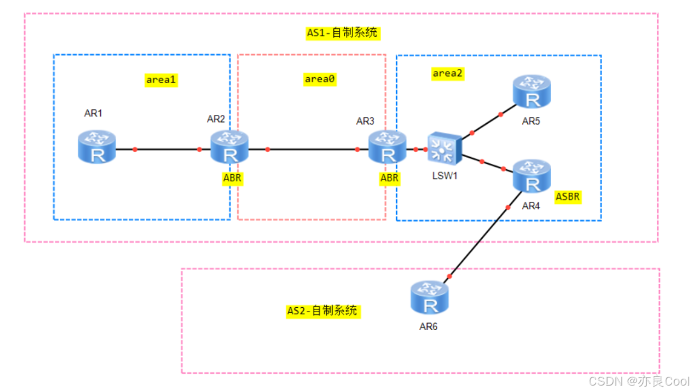
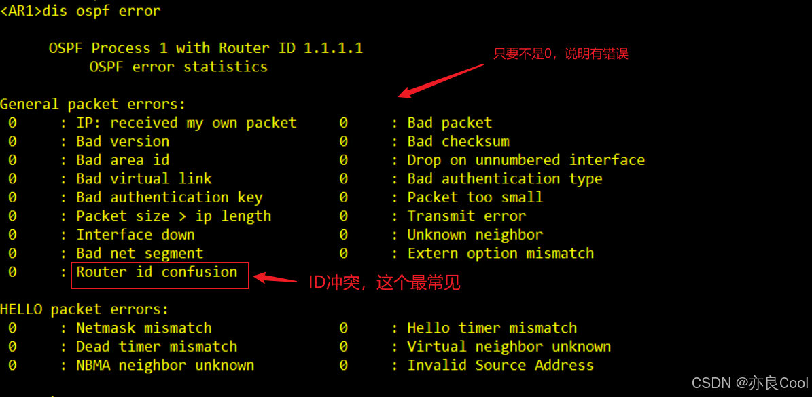

# 一、OSPF基本概念

## OSPF协议概述

OSPF全称是<font color='red'>**开放式最短路径优先**</font>。是IETF开发的一种<font color='red'>链路状态路由协议</font>，使用基于带宽的<font color='red'>度量值</font>。采用<font color='red'>SPF算法</font>计算路由，<font color='orange'>从算法上保证了无环路。</font>

协议号是<font color='red'>**89**</font>，<font color='red'>以组播地址**224.0.0.5**发送协议包</font>。

<font color='cornflowerblue'>版本2给IPV4用的，版本3是给IPV6用的</font>。通过邻居关系维护路由，避免定期更新对带宽进行的消耗。路由更新效率高，网络收敛快，适用大中型网络。

> 基本思想：每个路由器将其已知的链路状态信息告诉邻居，收敛以后，网络上每个路由器对全网的链路状态有相同的认识。然后，每台路由器根据了解到的全网链路状态，独立计算路由。

## 与rip协议相比

>  - OSPF使用基于带宽的度量值，选路更加科学。
>  - 当路由条目更新时，仅发送更新路由减小了线路带宽的消耗，收敛速度快。
>  - rip发送整个路由表，且每隔30秒发送一次。此处收敛是指当网络发生变化时的收敛，网络刚运行OSPF时，网络中的各个路由器学习到路由的时间可能要多于RIP，原因是路由器间选举DR，BDR需要40s，所以如果想加快网络初始化收敛速度，我们常常把线路配置成点到点线路。

## OSPF的三个阶段

 - 邻居建立阶段：OSPF路由器发送HELLO报文，建立和维护邻居关系。
 - 路由交换阶段：OSPF路由器发送`DBD`报文描述自己的`LSDB`，再用`LSR`（请求特定的LSA的报文 ），`LSU`（承载LSA的报文）交换自己缺少的`LSA`，使得双方的`LSDB`达到一致，即所有路由器知道网络的全局拓扑关系图。双方`LSDB`一致的标志是邻居达到`FULL`状态。
 - 路由计算阶段：通过SPF算法计算出去往各个网段的最佳路由。并添加到路由表中。

## OSPF的七种状态机

- down：初始状态。
- init：互相发送Hello报文，hello报文中包含`Router ID，AreaID，各种定时器，认证，DR信息，接口优先级`等等。初始化状态即单向通信，A收到B的hello（或B收到A的hello）。
- tow way：路由器收到对方的Hello包，网络中非DR，BDR路由器之间就是这种状态，也是一种稳态。 双方互相通信状态，彼此收到对方的hello，并且从hello包中读取信息，建立邻居关系。
- exstart：确立主从关系，RID高的路由器成为主路由器，如果MTU值不匹配，将停留在此阶段。就是将要开始发送DBD，在发送之前确认谁先发，谁后发，他们自动协商，依靠router id，越大越优先。
- exchange：主从关系确立后，开始交换DBD报文，LSDB同步的第一个阶段，主要建立LSDB的总体框架。
- lading：加载DBD，发送LSR，通过更新LSU，LSA报文，交换相互缺少的DD报文，完成LSDB的同步。第二个阶段。收到DBD后进行比较是否相同（比较依据查看序列号），然后进行LSR、LSU的请求和更新;
- full：同步完成后，建立邻接关系。以后LSA的交换，用过LSU报文进行。

## OSPF的三张表

>  - 邻居表（neighbortable）：OSPF用邻居机制来发现和维持路由的存在，邻居表存储了双向通信的邻居关系OSPF路由器列表的信息。
>  - 拓扑表（topology table）：OSPF用LSA（link state Advertisement链路状态通告）来描述网络拓扑信息，然后OSPF路由器用拓扑数据库来存储网络的这些LSA。
>  - OSPF路由表（routingtable）：一对链路状态数据库进行SPF（Dijkstra）计算，而得出的OSPF路由表。


## OSPF的基本运行步骤

- 建立邻接关系（Establish router adjacencies）
- 必要的时候进行DR的选举（Elect the DR/BDR）
- 发现路由（Discover routes）
- 选择合适的路由器（Select appropriate routes）
- 维护路由信息（Maintain routing information）


## 初级阶段无法建立邻居的原因

原因其实有很多，我们暂时学到的两个：

```bash
> - 两台路由器router id 相同导致冲突；
> - 两台路由器中间直连的网段必须宣告到相同的area区域；
```

### 基本配置

```bash
ospf 1 router-id 1.1.1.1    //1为进程号，router-id 为1.1.1.1
area 0 		// 区域为0
network 10.10.10.0 0.255.255.255   //宣告网段，注意是反掩码
```

### RouterID

router id 标识允许ospf的路由器的身份ID。身份ID不能重复

router id的选举规则

>  - 手动指定最为优先，如果没有指定则选举环回口，如果没有环回口则选择物理接口。
>  - 接口地址越大越优先。
>  - 华为设备：手动指定最优先，最先UP的接口最优先。
>  - 手动指定方法：全局 router id 2.2.2.2 给动态路由协议指定router id


# 二、区域的划分

## 划分多区域的目的（面试重点）

>  - 减小了LSDB，降低了路由器的内存消耗并减轻了CPU SPF计算负担。
>  - 减小了LSA洪泛范围，有效地把拓扑变化控制在区域内,提高了 网络的稳定性。
>  - 在区域边界可以做路由汇总，减小了路由表，减轻了设备的数据转发负担。
>  - 提高了网络的拓展性，有利于组件大规模网络。


- area 0   骨干区域（核心区域）；
- area 1、2...其他都是常规区域；
- 常规区域必须和骨干区域直接相连。

## OSPF中路由器的角色（重点）

> - `ABR`：区域边界路由器。R2 R3位于两个区域的中间，我们称之为`区域边界路由器` ；他用来链接骨干区域和普通区域。
> - `ASBR` ：自制系统边界路由器。进行了重新分布操作的路由器。例如上图中的R5链接着两个自制系统，我们把R5称作`自制系统边界路由器`，自制系统边界路由器用来链接ospf的AS与外部其他的路由。
> - `Internet Router` ：内部路由器，所有接口都处于同一个区域的路由器被称为`区域内部路由器`。它的LSDB只有本区域的所有LSA.



## OSPF的LSA类型

- LSA1：每个OSPF路由器都会针对本区域产生一个LSA1，描述拓扑信息。
- LSA2 ：由DR产生的，补充说明类型LSA1，描述多路访问架构。描述一条链路上有哪些路由器。
- LSA3：网络汇总。描述OSPF的区域间路由（在路由表中以 O IA 标识）。原LSA 1所描述的路由信息会由所在区域的ABR将其转换为LSA3。LSA3可以传播到整个OSPF的所有区域（特殊区域除外）。由ABR通告。注意：LSA 3每穿越一个ABR，其ADVRouter都会发生改变，ADV Router转变为最后一次穿越的ABR路由器。
- LSA4:由ABR产生，当ASBR产生一个LSA5时，ABR会产生一个LSA4，指明ASBR区域。
- LSA5： 自治系统外部LSA 。LSA 5描述的是OSPF区域以外的路由（RIP、EIGRP、BGP等等）。由ASBR所通告，LSA 5可以传播到整个OSPF的所有区域（特殊区域除外）。注意：LSA 5的通告路由器在穿越ABR的时候是不会改变的。
- LSA7：只有在NSSA中存在，可以理解为LSA5的重发布变种。

详细讲解请点击这里：[OSPF的七种LSA类型详解](https://pokes.blog.csdn.net/article/details/138076090)

# 三、OSPF防环机制

### 区域内防环
- 区域内使用SPF算法，算法上防止出现环路。
### 区域间防环

- 所有非骨干区域必须与骨干区域直接相连，区域间路由需经由骨干区域中转。ABR从非骨干区域收到的Type-3 LSA不能用于区域间路由的计算。
- 区域间的水平分割： ABR不会将描述一个Area内部的路由信息的Type-3 LSA再注入回该区域中。

### 外部路由防环

- LSA3和LSA4
  - 由于 LSA4 类的产生以及泛洪范围与 LSA3 一致，所以 LSA4 的防环 规则与 LSA3 一致。LSA3五环，则LSA4无环

- LSA5和LSA7

  - 当 FA 地址为全零，根据 LSA4 类防环；如果 LSA4 无环，那么 LSA5， 7 也无环。

  - 当 FA 地址为非全零，根据 LSA1-3 类防环；如果 LSA1-3 无环，那么 LSA5，7 也无环。

# 四、常用的查看命令

### ospf协议常用的查看命令

```bash
display ospf peer brief  #显示OSPF中各区域邻居的信息，最常用的
display ospf lsdb        #显示OSPF的链路状态数据库（LSDB）信息
display ospf interface   #显示OSPF的接口信息
dis ip routing-table protocol ospf    #显示ospf协议的路由表
```

ospf 排错命令（非常有用）
```bash
dis ospf error
```

