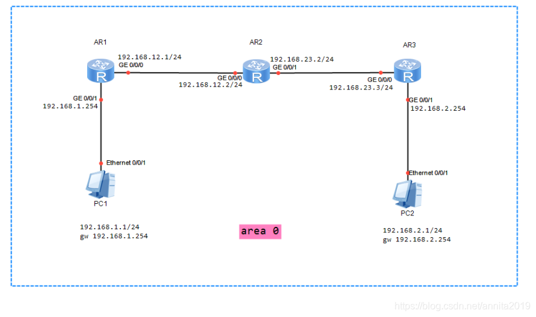
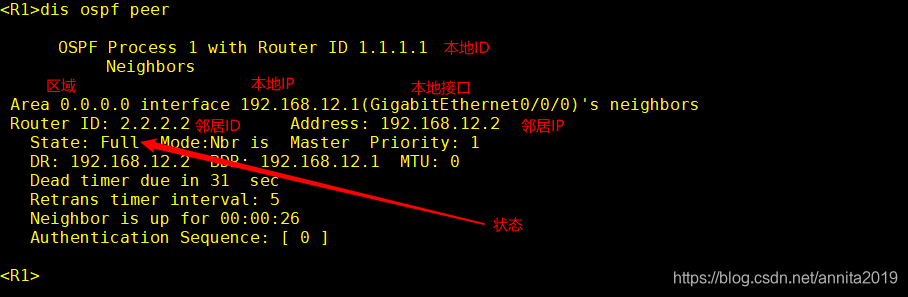

# OSPF单区域实验

## 实验拓扑



## OSPF配置

```bash
#R1的配置
[R1]ospf 1 router-id 1.1.1.1
[R1-ospf-1]area 0
[R1-ospf-1-area-0.0.0.0]network 192.168.1.0 0.0.0.255
[R1-ospf-1-area-0.0.0.0]network 192.168.12.0 0.0.0.255
[R1-ospf-1-area-0.0.0.0]q

#R2的配置
[R2]ospf 1 router-id 2.2.2.2	
[R2-ospf-1]area 0
[R2-ospf-1-area-0.0.0.0]network 192.168.12.0 0.0.0.255	
[R2-ospf-1-area-0.0.0.0]network 192.168.23.0 0.0.0.255
[R2-ospf-1-area-0.0.0.0]q

#R3的配置
[R3]ospf 1 router-id 3.3.3.3	
[R3-ospf-1]area 0
[R3-ospf-1-area-0.0.0.0]network 192.168.23.0 0.0.0.255
[R3-ospf-1-area-0.0.0.0]network 192.168.2.0 0.0.0.255
[R3-ospf-1-area-0.0.0.0]q
```

## 测试结果

PC1pingPC2

```bash
PC>ping 192.168.2.254

Ping 192.168.2.254: 32 data bytes, Press Ctrl_C to break
From 192.168.2.254: bytes=32 seq=1 ttl=253 time=78 ms
From 192.168.2.254: bytes=32 seq=2 ttl=253 time=15 ms
From 192.168.2.254: bytes=32 seq=3 ttl=253 time=16 ms
From 192.168.2.254: bytes=32 seq=4 ttl=253 time=31 ms
From 192.168.2.254: bytes=32 seq=5 ttl=253 time=31 ms

--- 192.168.2.254 ping statistics ---
  5 packet(s) transmitted
  5 packet(s) received
  0.00% packet loss
  round-trip min/avg/max = 15/34/78 ms

PC>
```

## OSPF查看
### 邻居表查看
```bash
dis ospf peer   #邻居表查看
```
查看方法如图：

具体信息

```bash
#R1的配置
<R1>dis ospf peer 

	 OSPF Process 1 with Router ID 1.1.1.1
		 Neighbors 

 Area 0.0.0.0 interface 192.168.12.1(GigabitEthernet0/0/0)'s neighbors
 Router ID: 2.2.2.2          Address: 192.168.12.2    
   State: Full  Mode:Nbr is  Master  Priority: 1
   DR: 192.168.12.2  BDR: 192.168.12.1  MTU: 0    
   Dead timer due in 31  sec 
   Retrans timer interval: 5 
   Neighbor is up for 00:00:26     
   Authentication Sequence: [ 0 ] 

<R1>


#R2的配置
<R2>dis ospf peer

	 OSPF Process 1 with Router ID 2.2.2.2
		 Neighbors 

 Area 0.0.0.0 interface 192.168.12.2(GigabitEthernet0/0/0)'s neighbors
 Router ID: 1.1.1.1          Address: 192.168.12.1    
   State: Full  Mode:Nbr is  Slave  Priority: 1
   DR: 192.168.12.2  BDR: 192.168.12.1  MTU: 0    
   Dead timer due in 32  sec 
   Retrans timer interval: 5 
   Neighbor is up for 00:16:05     
   Authentication Sequence: [ 0 ] 

		 Neighbors 

 Area 0.0.0.0 interface 192.168.23.2(GigabitEthernet0/0/1)'s neighbors
 Router ID: 3.3.3.3          Address: 192.168.23.3    
   State: Full  Mode:Nbr is  Master  Priority: 1
   DR: 192.168.23.2  BDR: 192.168.23.3  MTU: 0    
   Dead timer due in 35  sec 
   Retrans timer interval: 5 
   Neighbor is up for 00:01:06     
   Authentication Sequence: [ 0 ] 

-------------------------------------------------

#R3的配置
[R3]dis ospf peer

	 OSPF Process 1 with Router ID 3.3.3.3
		 Neighbors 

 Area 0.0.0.0 interface 192.168.23.3(GigabitEthernet0/0/0)'s neighbors
 Router ID: 2.2.2.2          Address: 192.168.23.2    
   State: Full  Mode:Nbr is  Slave  Priority: 1
   DR: 192.168.23.2  BDR: 192.168.23.3  MTU: 0    
   Dead timer due in 37  sec 
   Retrans timer interval: 5 
   Neighbor is up for 00:00:43     
   Authentication Sequence: [ 0 ] 
```


### 邻居表接口查看
```bash
#R1的配置
<R1>dis ospf peer brief 

	 OSPF Process 1 with Router ID 1.1.1.1
		  Peer Statistic Information
 ----------------------------------------------------------------------------
 Area Id          Interface                        Neighbor id      State    
 0.0.0.0          GigabitEthernet0/0/0             2.2.2.2          Full        
 ----------------------------------------------------------------------------

#R2的配置
<R2>dis ospf peer brief

	 OSPF Process 1 with Router ID 2.2.2.2
		  Peer Statistic Information
 ----------------------------------------------------------------------------
 Area Id          Interface                        Neighbor id      State    
 0.0.0.0          GigabitEthernet0/0/0             1.1.1.1          Full        
 0.0.0.0          GigabitEthernet0/0/1             3.3.3.3          Full        
 ----------------------------------------------------------------------------
<R2>

#R3的配置
<R3>dis ospf peer brief 

	 OSPF Process 1 with Router ID 3.3.3.3
		  Peer Statistic Information
 ----------------------------------------------------------------------------
 Area Id          Interface                        Neighbor id      State    
 0.0.0.0          GigabitEthernet0/0/0             2.2.2.2          Full        
 ----------------------------------------------------------------------------
```