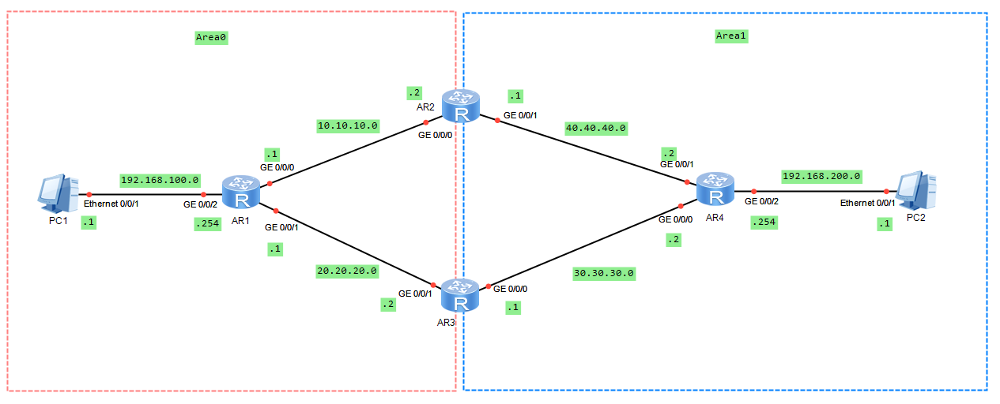

# 通过修改ospf的COST值来控制路由选路


附件下载：<a href="doc/huawei/fujian/通过修改ospf的COST值来控制路由选路.zip" download="通过修改ospf的COST值来控制路由选路.zip">实验文件下载</a>




配置好OSPF之后，发现默认走的是上面 
```bash
PC1>tracert 192.168.200.1

traceroute to 192.168.200.1, 8 hops max
(ICMP), press Ctrl+C to stop
 1  192.168.100.254   16 ms  <1 ms  16 ms
 2  10.10.10.2   15 ms  <1 ms  16 ms
 3  40.40.40.2   31 ms  16 ms  15 ms
 4  192.168.200.1   16 ms  31 ms  16 ms
```
我们现在来通过修改COST值让他走下面
```bash
[ar1-GigabitEthernet0/0/0]ospf cost 100

[ar1]dis ospf interface g0/0/0

	 OSPF Process 1 with Router ID 1.1.1.1
		 Interfaces 


 Interface: 10.10.10.1 (GigabitEthernet0/0/0)
 Cost: 100     State: DR        Type: Broadcast    MTU: 1500  
 Priority: 1
 Designated Router: 10.10.10.1
 Backup Designated Router: 10.10.10.2
 Timers: Hello 10 , Dead 40 , Poll  120 , Retransmit 5 , Transmit Delay 1 

```

查询路由表验证
```bash
[ar1]dis ip routing-table 192.168.200.254
Route Flags: R - relay, D - download to fib
------------------------------------------------------------------------------
Routing Table : Public
Summary Count : 1
Destination/Mask    Proto   Pre  Cost      Flags NextHop         Interface

  192.168.200.0/24  OSPF    10   3           D   20.20.20.2      GigabitEthernet
0/0/1
```