# OSPF 全网最详解（理论及配置）

> 本文由 [简悦 SimpRead](http://ksria.com/simpread/) 转码， 原文地址 [blog.csdn.net](https://blog.csdn.net/Lxyand1/article/details/143869020?ops_request_misc=%257B%2522request%255Fid%2522%253A%2522a65e647c1c530ef91df8e7433d586e2d%2522%252C%2522scm%2522%253A%252220140713.130102334..%2522%257D&request_id=a65e647c1c530ef91df8e7433d586e2d&biz_id=0&utm_medium=distribute.pc_search_result.none-task-blog-2~blog~top_positive~default-1-143869020-null-null.nonecase&utm_term=ospf&spm=1018.2226.3001.4450)

## 一. 简介

---

- 纵观全站关于 OSPF 介绍，众说纷纭，作为传统最核心的动态路由协议之一，我欲 “究天人之际，通古今之变，成一家之言”，写出全网最详细的 OSPF 介绍。
- 本文为结合了华为技术和新华三技术的大成，即结合了 HCIA，HCIP，HCIE Datacom 和 H3CNE-RS+，H3CSE-RS+，H3CIE-RS+。本文将分为 **OSPF 基础概念、OSPF 路由计算、OSPF 特殊区域及其它特性、OSPF 高阶特性、OSPF 的详细配置** 五个大模块进行详细介绍。

## 二. OSPF 基础概念

---

### 1. 前言

- 路由器根据路由表转发数据包，路由表项可通过手动配置和动态路由协议生成。
- 静态路由比动态路由使用更少的带宽，并且不占用 CPU 资源来计算和分析路由更新。当网络结构比较简单时，只需配置静态路由就可以使网络正常工作。但是当网络发生故障或者拓扑发生变化后，静态路由不会自动更新，必须手动重新配置。
- 相比较于静态路由，动态路由协议具有更强的可扩展性，具备更强的应变能力。
- OSPF(Open Shortest Path First，开放式最短路径优先) 具有扩展性强，收敛速度快等特点，作为优秀的内部网关协议被广泛使用。
- 该模块主要介绍 OSPF 的基本概念，OSPF 的邻接关系的建立。

### 2. 动态路由协议简介

#### （1）动态路由协议分类

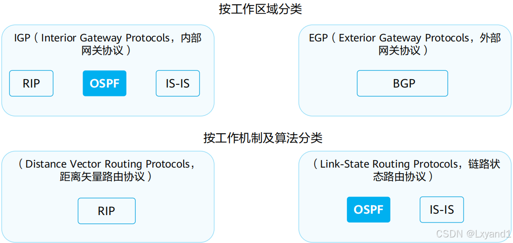

##### 【1】距离矢量协议

运行==距离矢量路由协议==的路由器周期性地泛洪自己的路由表。通过路由的交互，每台路由器都从相邻的路由器学习到路由，并且加载进自己的路由表中，然后再通告给其他相邻路由器。
对于网络中的所有路由器而言，路由器并不清楚网络的拓扑，只是简单的知道要去往某个目的网段方向在哪里，开销有多大。
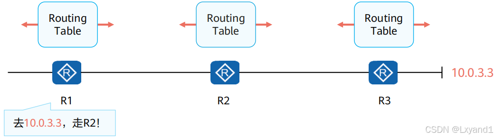

##### 【2】链路状态路由协议 - LSA 泛洪

链路状态路由协议通告的的是链路状态而不是路由信息。
运行链路状态路由协议的路由器之间首先会建立邻居关系，然后彼此之间开始交互 **LSA(LinkState Advertisement，链路状态通告)。** 
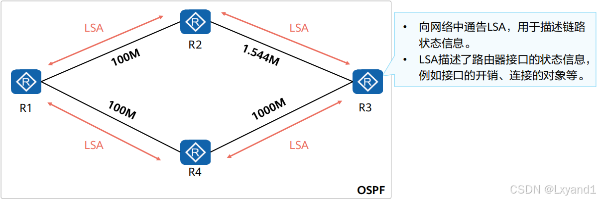

##### 【3】链路状态路由协议 - LSDB 维护

每台路由器都会产生 LSA，路由器将接收到的 LSA 放入自己的 **LSDB(Link State DataBase，链路状态数据库)** 。路由器通过对 LSDB 中所存储的 LSA 进行解析，进而了解全网拓扑。
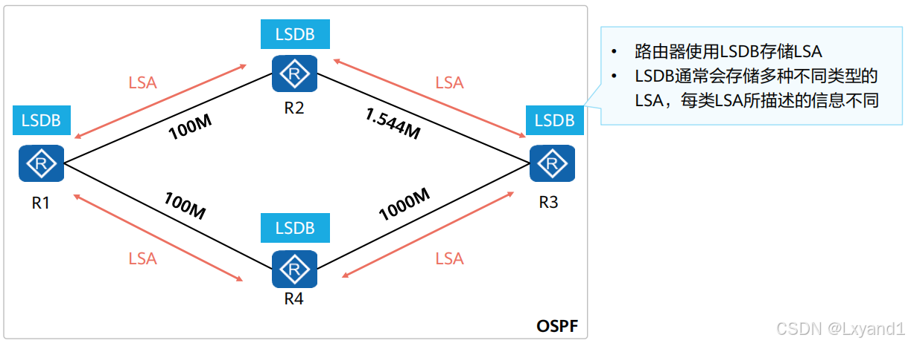

##### 【4】链路状态协议 - SPF 计算

每台路由器基于 LSDB，使用 **SPF(Shortest Path first，最短路径优先)**  算法进行计算。每台路由器都计算出一棵以自己为根的、无环的、拥有最短路径的 “树”。有了这棵 “树”，路由器就已经知道了到达所有网段的优选路径。

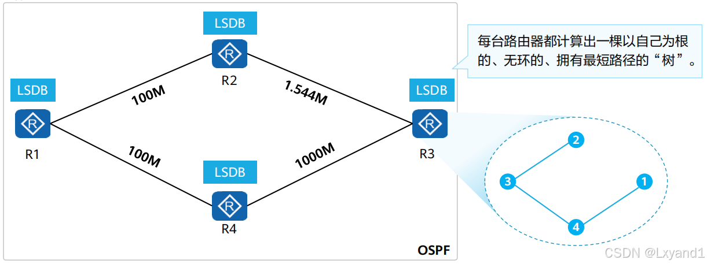

##### 【5】链路状态路由协议 - [路由表](https://so.csdn.net/so/search?q=%E8%B7%AF%E7%94%B1%E8%A1%A8&spm=1001.2101.3001.7020)生成

路由器将计算出来的优选路径，加载进自己的路由表  **(Routing Table)** 。

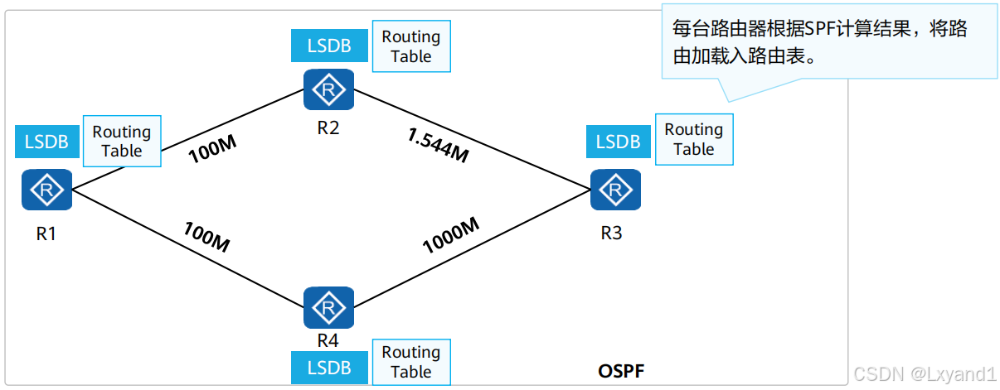

##### 【6】小总结

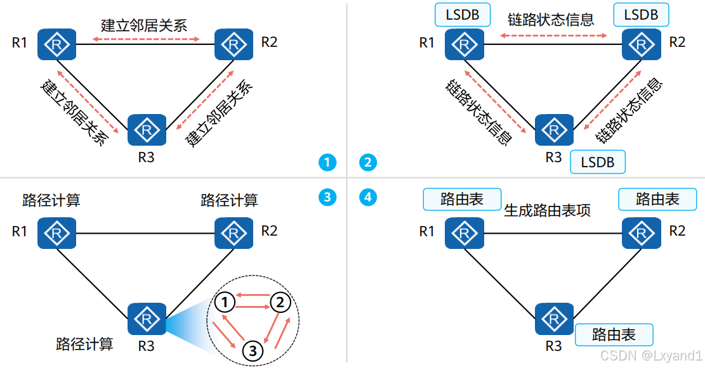

### 3.OSPF 简介

#### （1）OSPF 概述

OSPF 是 IETF 定义的一种基于链路状态的内部网关路由协议。目前针对 IPv4 协议使用的是 OSPFVersion 2(RFC2328)；针对 IPv6 协议使用 OSPF Version 3(RFC2740)。
OSPF 有以下优点:

- 基于 SPF 算法，以 “累计链路开销” 作为选路参考值
- 采用组播形式收发部分协议报文
- 支持区域划分
- 支持对等价路由进行负载分担
- 支持报文认证

#### （2）OSPF 基础术语

##### 【1】Router ID

Router lD 用于在自治系统中唯一标识一台运行 OSPF 的路由器，它是一个 32 位的无符号整数。
Router lD 选举规则如下:

- 手动配置 OSPF 路由器的 Router ID(建议手动配置)
- 如果没有手动配置 Router ID，则路由器使用 Loopback 接口中最大的 IP 地址作为 Router ID
- 如果没有配置 Loopback 接口，则路由器使用物理接口中最大的 IP 地址作为 Router ID

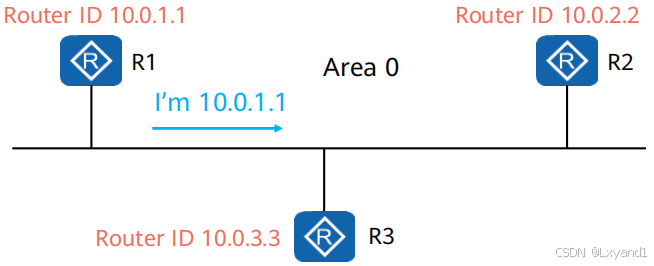

##### 【2】区域

- OSPF Area 用于标识一个 OSPF 的区域。
- 区域是从逻辑上将设备划分为不同的组，每个组用区域号 (AreaID) 来标识。
- OSPF 的区域 ID 是一个 32bit 的非负整数，按点分十进制的形式 (与 IPv4 地址的格式一样) 呈现例如 Area0.0.0.1。为了简便起见，我们也会采用十进制的形式来表示。

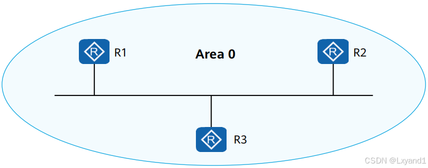

##### 【3】度量值

- OSPF 使用 Cost(开销) 作为路由的度量值。每一个激活了 OSPF 的接口都会维护一个接口 Cost 值，缺省的 **Cost =100 Mbits / 接口带宽**。其中 100 Mbit/s 为 OSPF 指定的缺省参考值，该值是可配置的。
- OSPF 以 “累计 cost” 为开销值，也就是流量从源网络到目的网络所经过所有路由器的出接口的 cost 总和。

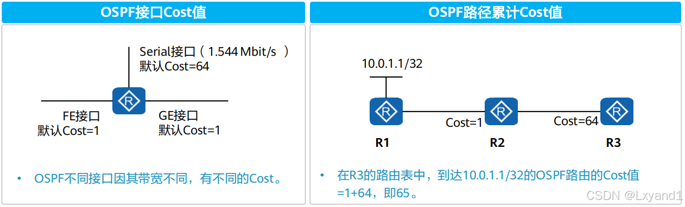

##### 【4】度量值修改举例

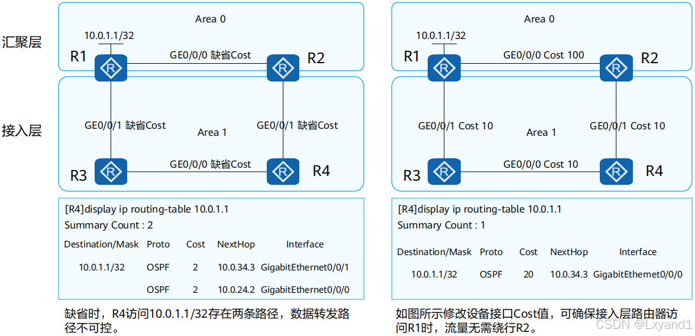

#### （3）OSPF 三大表项

##### 【1】邻居表

OSPF 有三张重要的表项，OSPF 邻居表、LSDB 和 OSPF 路由表。对于 OSPF 的邻居表，需要了解:

- OSPF 在传递链路状态信息之前，需先建立 OSPF 邻居关系。
- OSPF 的邻居关系通过交互 Hello 报文建立。
- OSPF 邻居表显示了 OSPF 路由器之间的邻居状态，使用 display ospf peer 查看。

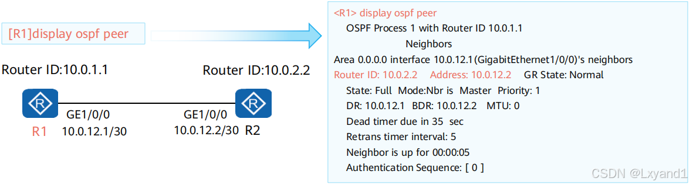

##### 【2】LSDB

对于 OSPF 的 LSDB，需要了解:

- LSDB 会保存自己产生的及从邻居收到的 LSA 信息，本例中 R1 的 LSDB 包含了三条 LSA。
- Type 标识 LSA 的类型，AdvRouter 标识发送 LSA 的路由器。
- 使用命令行 display ospf lsdb 查看 LSDB 表。

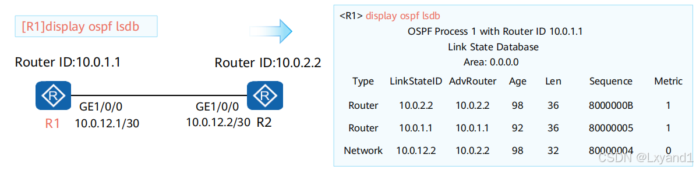

##### 【3】OSPF 路由表

对于 OSPF 的路由表，需要了解:

- OSPF 路由表和路由器路由表是两张**不同的表**。本例中 OSPF 路由表有三条路由。
- OSPF 路由表包含 Destination、Cost 和 NextHop 等指导转发的信息。
- 使用命令 display ospf routing 查看 OSPF 路由表。

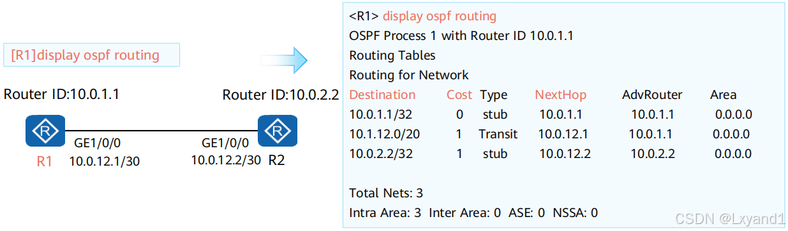

#### （4）OSPF 报文格式 

- OSPF 一共定义了 5 种类型的报文，不同类型的 OSPF 报文有相同的头部格式。
- OSPF 报文直接采用 IP 封装，在报文的 IP 头部中，协议号为 89。
- 后文会有详细介绍

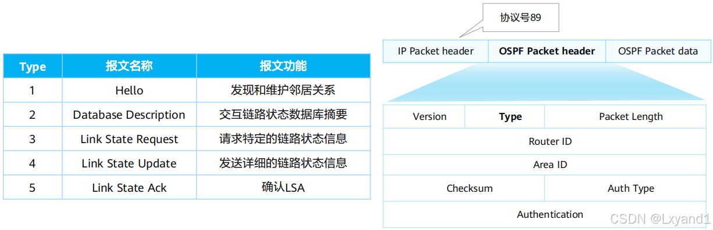

### 4.OSPF 工作过程

#### （1）建立邻居关系

##### 【1】OSPF 工作工程概览

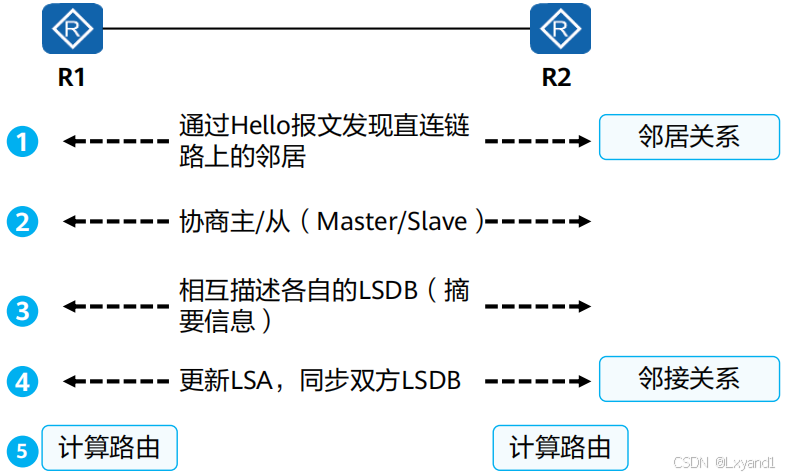

##### 【2】建立邻居

- OSPF 使用 Hello 报文发现和建立邻居关系。
- 在以太网链路上，缺省时，OSPF 采用组播的形式发送 Hello 报文 (目的地址 224.0.0.5）。
- OSPF Hello 报文中包含了路由器的 Router ID、邻居列表等信息。

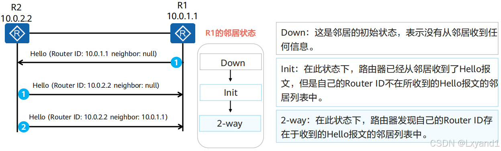

##### 【3】hello 报文

Hello 报文的主要作用：

- 邻居发现: 自动发现邻居路由器，
- 邻居建立: 完成 Hello 报文中的参数协商，建立邻居关系。
- 邻居保持: 通过周期性发送和接收，检测邻居运行状态。

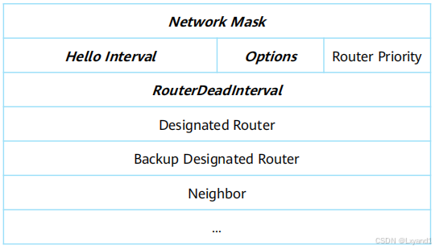

重要字段解释

- Network Mask: 发送 Hello 报文的接口的网络掩码。
- Hello lnterval: 发送 Hello 报文的时间间隔。通常为 10s
- Router Dead lnterval: 失效时间。如果在此时间内未收到邻居发来的 Hello 报文，则认为邻居失效。通常为 40s。
- Neighbor: 邻居，以 Router ID 标识。

其它字段解释

- Options:

> E: 是否支持外部路由
> MC: 是否支持转发组播数据包
> N/P: 是否为 NSSA 区域

- Router Priority:DR 优先级。默认为 1。如果设置为 0，则路由器不能参与 0DR 或 BDR 的选举。
- Designated Router: DR 的接囗地址。
- Backup Designated Router: BDR 的接囗地址。

#### （2）建立邻接关系

##### 【1】建立邻接阶段一

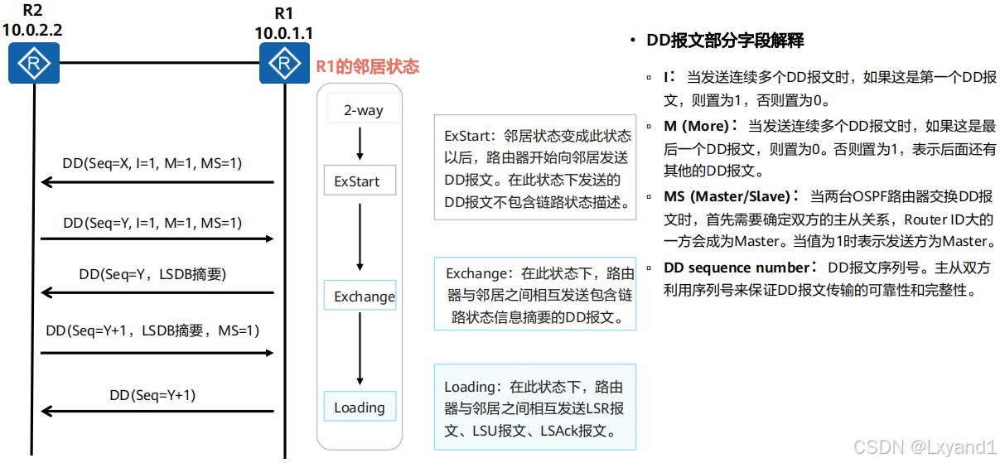

- R1 和 R2 的 Router ID 分别为 10.0.1.1 和 10.0.2.2 并且二者已建立了邻居关系。当 R1 的邻居状态变为 ExStart 后，R1 会发送第一个 DD 报文。此报文中，M-bit 设置为 1，表示后续还有 DD 报文要发送，MS-bit 设置为 1，表示 R1 宣告自己为 Master。DD 序列号被随机设置为 X，I-bit 设置为 1，表示这是第一个 DD 报文。
- 同样当 R2 的邻居状态变为 ExStart 后，R2 也会发送第一个 DD 报文。此报文中，DD 序列号被随机设置为 Y(1-bit=1，M-bit=1，MS-bit=1，含义同上)。由于 R2 的 Router ID 较大，所以 R2 将成为真正的 Master。收到此报文后，R1 会产生一个 Negotiation-Done 事件，并将邻居状态从 ExStart 变为 Exchange。
- 当 R1 的邻居状态变为 Exchange 后，R1 会发送一个新的 DD 报文，此报文中包含了 LSDB 的摘要信息，序列号设置为 R2 在步骤 2 中使用的序列号 Y，I-bit=0，表示这不是第一个 DD 报文，M-bit=0，表示这是最后一个包含 LSDB 摘要信息的 DD 报文，MS-bit=0，表示 R1 宣告自己为 Slave。收到此报文后，R2 将邻居状态从 ExStart 变为 Exchange。
- 当 R2 的邻居状态变为 Exchange 后，R2 会发送一个新的 DD 报文，此报文包含了 LSDB 的摘要信息。DD 序列号设置为 Y+1,MS-bit=1，表示 R2 宣告自己为 Master。
- 虽然 R1 不需要发送新的包含 LSDB 摘要信息的 DD 报文，但是作为 Slave，R1 需要对 Master 发送的每一个 DD 报文进行确认。所以，R1 向 R2 发送一个新的 DD 报文，序列号为 Y+1，该报文内容为空。发送完此报文后，R1 产生一个 Exchange-Done 事件，将邻居状态变为 Loading。R2 收到此报文后，会将邻居状态变为 Full(假设 R2 的 LSDB 是最新最全的，不需要向 R1 请求更新)。

##### 【2】DD 报文

DD 报文包含 LSA 头部信息。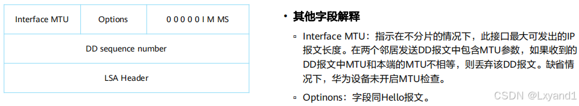

【3】建立邻接阶段二

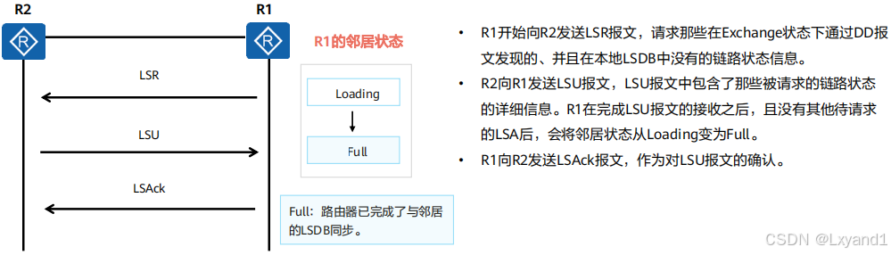

#### （3）DR 与 BDR 的作用

##### 【1】作用

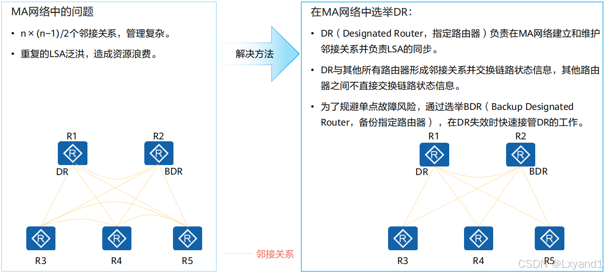

- MA(Multiple Access，多路访问) 分为 BMA( Broadcast Multi-Access, 广播多路访问）和 NBMA(Non-Broadcast Multiple Access，非广播多路访问)。以太网链路组成的网络是典型的 BMA 网络。帧中继链路通过逻辑上的划分组成典型的 NBMA 网络。
- DRother: 既不是 DR 也不是 BDR 的路由器就是 DRother 路由器

##### 【2】DR 与 BDR 的选举规则

DR/BDR 的选举是非抢占式的。
DR/BDR 的选举是基于接口的。

- 接口的 DR 优先级越大越优先。
- 接口的 DR 优先级相等时，RouterID 越大越优先。

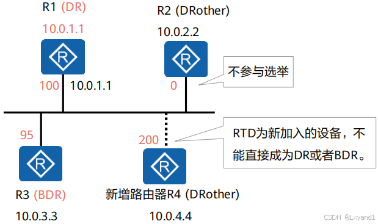

广播链路或者 NBMA 链路上 DR 和 BDR 的选举过程如下：

- 接口 UP 后，发送 Hello 报文，同时进入到 Waiting 状态。在 Waiting 状态下会有一个 WaitingTimer，该计时器的长度与 DeadTimer 是一样的。默认值为 40 秒，用户不可自行调整。
- 在 WaitingTimer 触发前，发送的 Hello 报文是没有 DR 和 BDR 字段的。在 Waiting 阶段如果收到 Hello 报文中有 DR 和 BDR，那么直接承认网络中的 DR 和 BDR，而不会触发选举。直接离开 Waiting 状态，开始邻居同步。
- 假设网络中已经存在一个 DR 和一个 BDR，这时新加入网络中的路由器，不论它的 Router ID 或者 DR 优先级有多大，都会承认现网中已有的 DR 和 BDR。
- 当 DR 因为故障 Down 掉之后，BDR 会继承 DR 的位置，剩下的优先级大于 0 的路由器会竞争成为新的 BDR。
- 只有当不同 Router ID，或者配置不同 DR 优先级的路由器同时起来，在同一时刻进行 DR 选举才会应用 DR 选举规则产生 DR。

##### 【3】不同网络类型中 DR 与 BDR 的选举操作

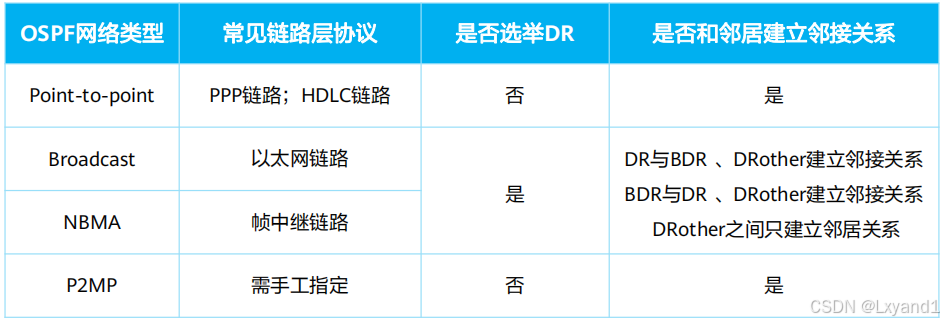

##### 【4】可按需调整设备接口的 OSPF 网络类型

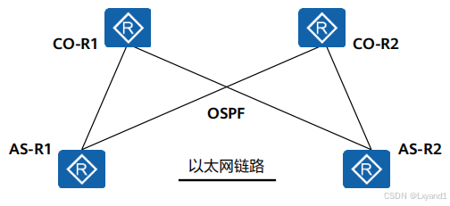

- OSPF 的网络类型是根据接口的数据链路层封装自动设置的。
- 图中的路由器采用以太网接口互联，因此这些接口的网络类型缺省均为 Broadcast。
- 每段链路实际上都是点对点链路，因此在链路上选举 DR 与 BDR 是没有必要的。
- 为了提高 OSPF 的工作效率，加快邻接关系的建立过程，可以把这些互联接口的网络类型都修改为 P2P。
- 在接口视图使用 ospf network-type p2p 即可修改接口网络类型。

### 5. 模块总结

如果您认真学完以上模块，您将能够：

- 描述 OSPF 路由计算的整体过程
- 阐明 DR 与 BDR 的作用
- 描述 OSPF 报文类型和作用
- 区分 OSPF 邻居关系和邻接关系

## 三. OSPF 路由计算

---

### 1. 前言

- 同一区域内的 OSPF 路由器拥有完全一致的 LSDB，在区域内部，OSPF 采用 SPF 算法完成路由计算。
- 随着网络规模不断扩大，路由器为了完成路由计算所消耗的内存、CPU 资源也越来越多通过区域划分可以在一定程度上缓解路由器的压力。
- 在大规模网络中除了 OSPF 之外，还可能存在其它路由协议，OSPF 支持外部路由引入，从而使得 OSPF 路由器知晓到达域外的路由。
- 该模块主要介绍 OSPF 路由计算原理，包括区域内部路由、区域间路由及外部路由的计算过程。

### 2. 区域内路由计算

#### （1）LSA 概述

##### 【1】LSA 的基本概念

- LSA 是 OSPF 进行路由计算的关键依据。
- OSPF 的 LSU 报文可以携带多种不同类型的 LSA。
- 各种类型的 LSA 拥有相同的报文头部。

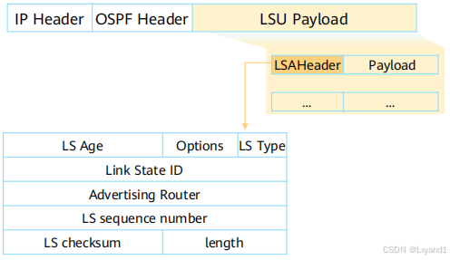

重要字段解释：

- LS Age(链路状态老化时间)：此字段表示 LSA 已经生存的时间，单位是秒。
- Options(可选项)：每一个 bit 都对应了 OSPF 所支持的某种特性。
- LS Type(链路状态类型)：指示本 LSA 的类型。
- Link state lD(链路状态 ID)：不同的 LSA，对该字段的定义不同。
- Advertising Router(通告路由器)：产生该 LSA 的路由器的 Router ID，
- LS Sequence Number(链路状态序列号)：当 LSA 每次有新的实例产生时，序列号就会增加。
- LS Checksum(校验和)：用于保证数据的完整性和准确性。
- Length：是一个包含 LSA 头部在内的 LSA 的总长度值。

> 链路状态类型、链路状态 ID、通告路由器三元组唯一地标识了一个 LSA。
>
> 链路状态老化时间 、链路状态序列号 、校验和用于判断 LSA 的新旧。

> LS Age：当 LSA 被始发时，该字段为 0，随着 LSA 在网络中被泛洪，该时间逐渐累加，当到达 MaxAge(缺省值为 3600s) 时，LSA 不再用于路由计算。
>
> LS Sequence Number：该字段用于判断 LSA 的新旧或是否存在重复的实例。席列号范围是 0x80000001-0x7FFFFFFF，路由器始发一个 LSA，序列号为 0x80000001，之后每次更新序列号加 1，当 LSA 达到最大序列号时，重新产生该 LSA，并且把序列号设置为 0x80000001。

##### 【2】常见 LSA 类型

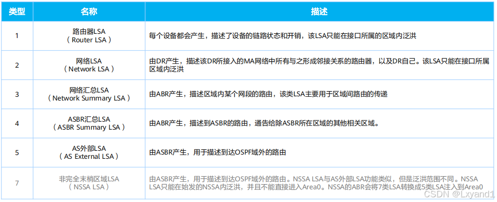

在许多场合中，我们习惯使用类型值来称呼对应的 LSA，例如 1 类 LSA 等同于 Router LSA，2 类 LSA 等同于 Network LSA，以此类推。

#### （2）Router-LSA

##### 【1】Router-LSA 详解 1

- Router LSA(1 类 LSA): 每台 OSPF 路由器都会产生。它描述了该路由器直连接口的信息。
- Router LSA 只能在所属的区域内泛洪。

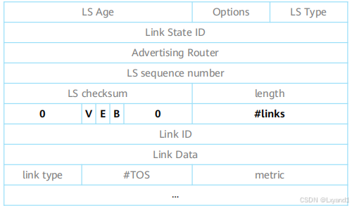

- V(Virtual Link): 如果产生此 LSA 的路由器是虚连接的端点，则置为 1。
- E(External): 如果产生此 LSA 的路由器是 ASBR，则置为 1
- B(Border): 如果产生此 LSA 的路由器是 ABR，则置为 1.
- links: LSA 中的 Link(链路) 数量。Router LSA 使用 Link 来承载路由器直连接口的信息。

Link State lD:1 类 LSA 的 Link State lD 为 OSPF 的 Rouer lD 。

##### 【2】Router-LSA 详解 2

- Router LSA 使用 Link 来承载路由器直连接口的信息。
- 每条 Link 均包含 “链路类型”、“链路 ID”、“链路数据” 以及 “度量值” 这几个关键信息。
- 路由器可能会采用一个或者多个 Link 来描述某个接口。

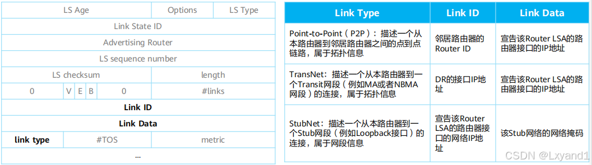

#### （3）Network-LSA

##### 【1】Network-LSA 详解

- Network LSA(2 类 LSA): 由 DR 产生，描述本网段的链路状态，在所属的区域内传播。
- Network LSA 记录了该网段内所有与 DR 建立了邻接关系的 OSPF 路由器，同时携带了该网段的网络掩码。

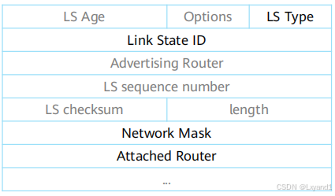

- Link state lD :DR 的接囗 IP 地址。
- Network Mask:MA 网络的子网掩码。
- Attached Router: 连接到该 MA 网络的路由器的 Router-ID(与该 DR 建立了邻接关系的邻居的 Router-ID，以及 DR 自己的 RouterID)，如果有多台路由器接入该 MA 网络，则使用多个字段描述。

#### （4）SPF 计算过程

##### 【1】SPF 算法 1

Phase 1: 构建 SPF 树。

- 路由器将自己作为最短路径树的树根，根据 Router-LSA 和 Network-LSA 中的拓扑信息，依次将 Cost 值最小的路由器添加到 SPF 树中。路由器以 Router ID 或者 DR 标识。
- 广播网络中 DR 和其所连接路由器的 Cost 值为 0。
- SPF 树中只有单向的最短路径，保证了 OSPF 区域内路由计算不会出现环路。

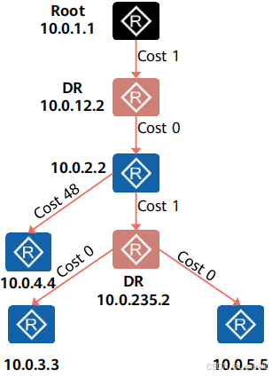

##### 【2】SPF 算法 2

Phase 2: 计算最优路由。

-  将 Router-LSA、Network-LSA 中的路由信息以叶子节点形式附加在对应的 OSPF 路由器上，计算最优路由。
- 已经出现的路由信息不会再添加到 SPF 树干上。

 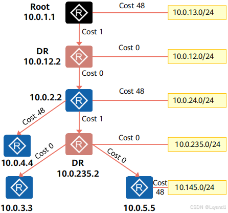

##### 【3】SPF 算法举例

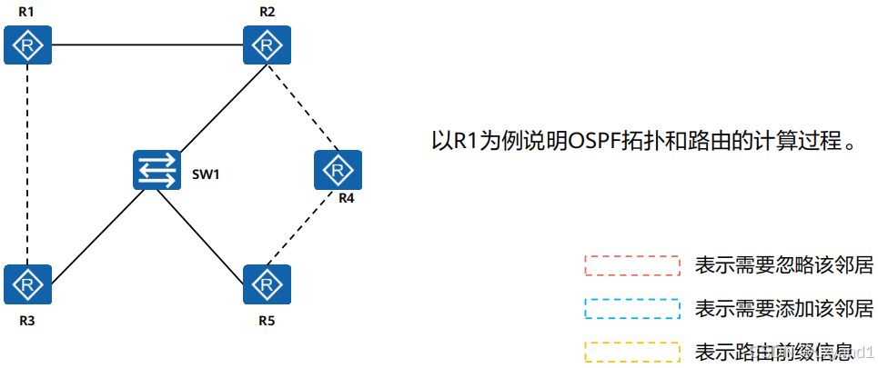

###### a. 构建 SPF 树阶段 1

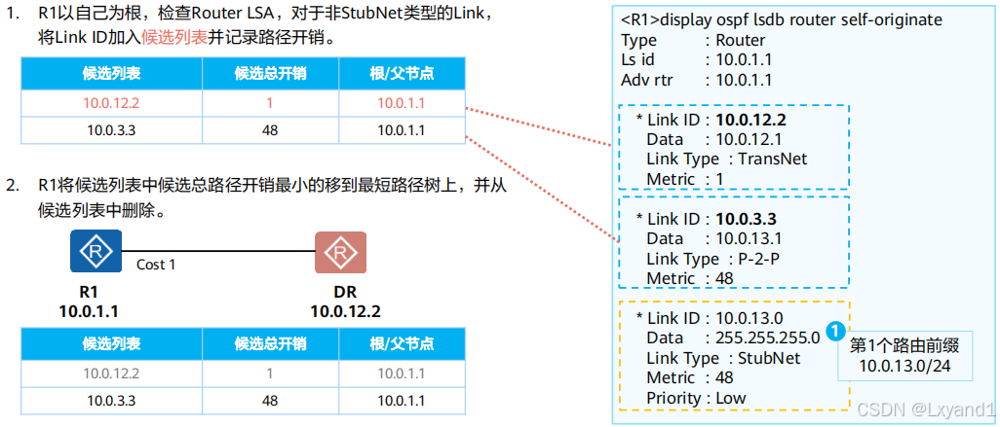

###### b. 构建 SPF 树阶段 2

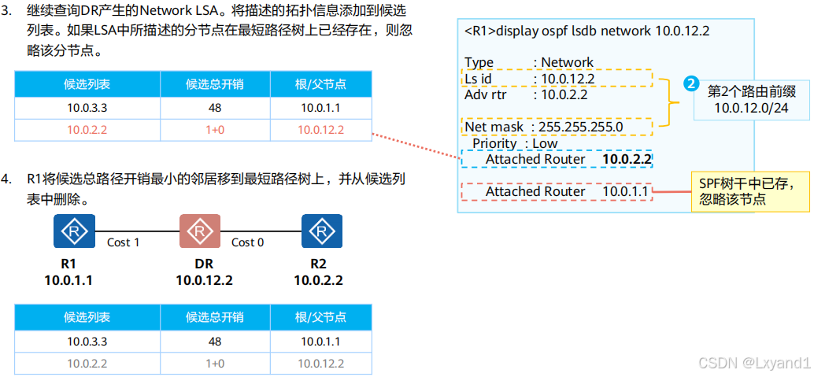

###### c. 构建 SPF 树阶段 3

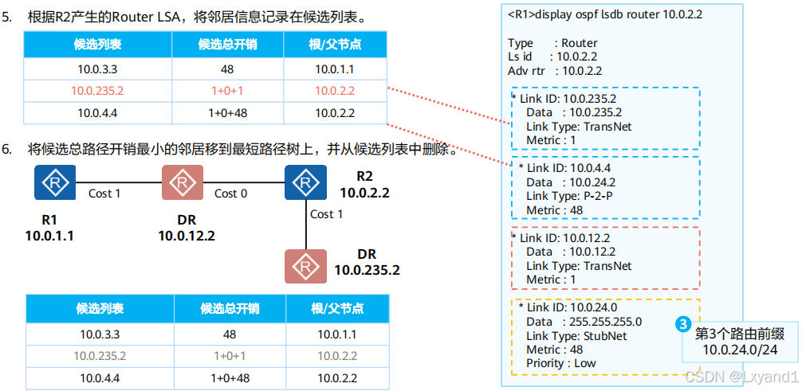

###### d. 构建 SPF 树阶段 4

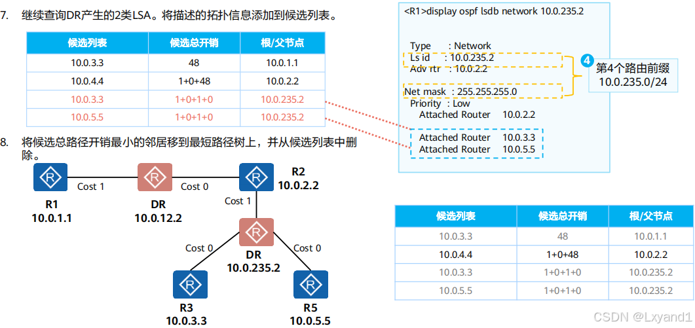

###### e. 构建 SPF 树阶段 5

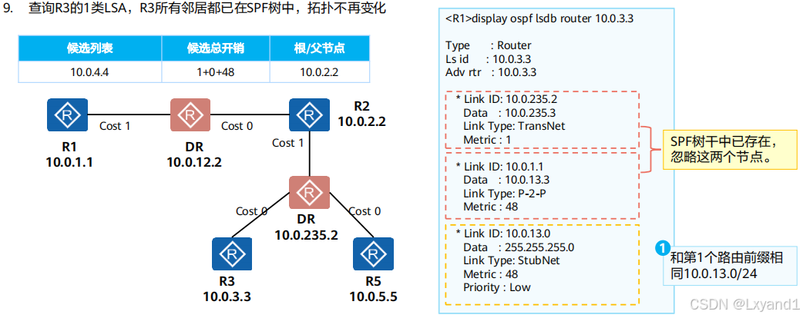

###### f. 构建 SPF 树阶段 6

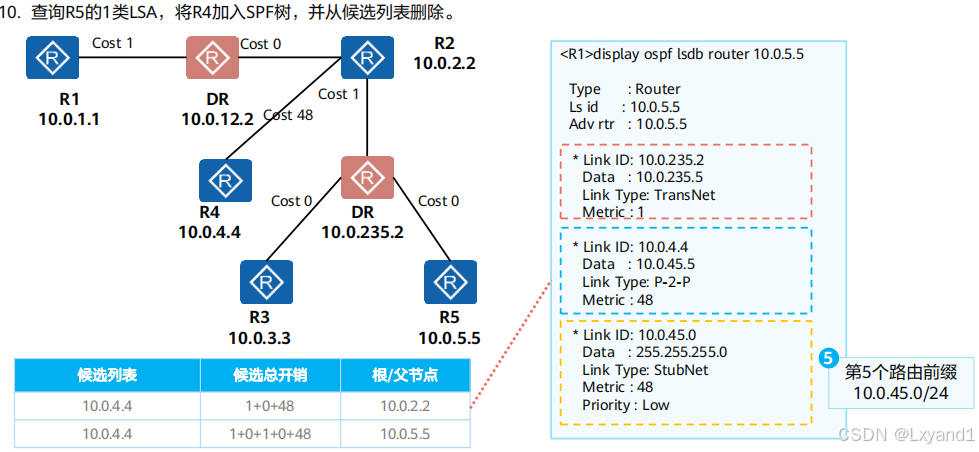

g. 构建 SPF 树阶段 7

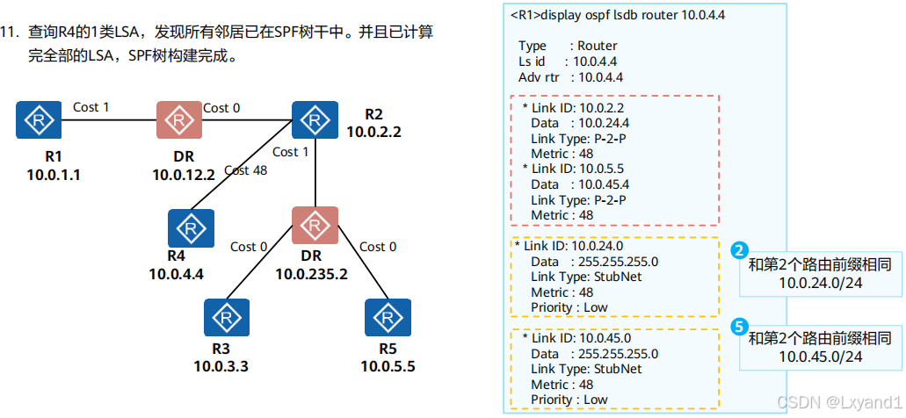

##### 【4】计算最优路由

- 从根节点开始依次添加各节点 LSA 中的路由信息。
- 添加顺序为各节点加入 SPF 树的顺序，已经出现的忽略。

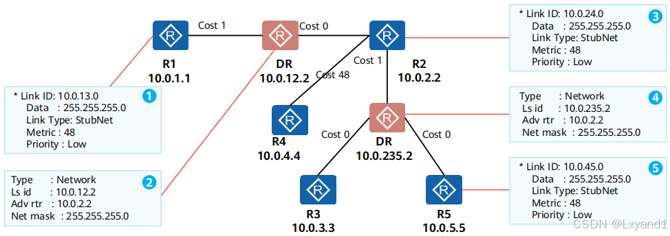

根据 Router LSA 中的 Stub、Network LSA 中的路由信息，完成最优路由的计算。

从根节点开始，依次添加 LSA 中的路由信息 (添加顺序按照每个节点加入 SPF 树的顺序)：

- 10.0.1.1(R1) 的 Router LSA 中，共 1 个 Stub 连接，网络号 / 子网掩码 10.0.13.0/24，Metric=48;
- 10.0.12.2(DR) 的 Network LSA 中，网络号 / 子网掩码 10.0.12.0/24，Metric=1+0=1;
- 10.0.2.2(R2) 的 Router LSA 中，共 1 个 Stub 连接，网络号 / 子网掩码 10.0.24.0/24，Metric=1+0+48=49;
- 10.0.235.2(DR) 的 Network LSA 中，网络号 / 子网掩码 10.0.235.0/24Metric=1+0+1=2;
- 10.0.3.3(R3) 的 Router LSA 中，共 1 个 Stub 连接，网络号 / 子网掩码 10.0.13.0/24，已在 R1 上，忽略
- 10.0.5.5(R5) 的 Router LSA 中，共 1 个 Stub 连接，网络号 / 子网掩码 10.0.45.0/24Metric=1+0+0+1+48=50;
- 10.0.4.4(R4) 的 Router LSA 中，共 2 个 Stub 连接，网络号 / 子网掩码 10.0.24.0/24，已在 R2 上，忽略; 网络号 / 子网掩码 10.0.45.0/24，已在 R5 上，忽略。

##### 【5】结果验证

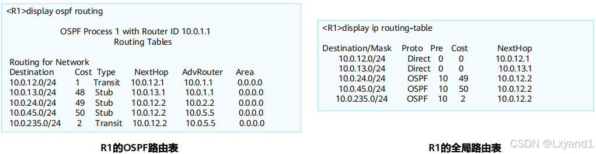

### 3. 区域间路由计算

#### （1）区域间路由计算过程

##### 【1】大型网络中单 OSPF 区域存在的问题

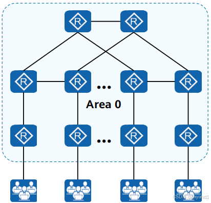

- 一系列连续的 OSPF 路由器构成的网络称为 OSPF 域 (Domain)。
- OSPF 要求网络内的路由器同步 LSDB，实现对于网络的一致认知。
- 当网络规模越来越大时，LSDB 将变得非常臃肿，设备基于该 LSDB 进行路由计算，其负担也极大地增加了，此外路由器的路由表规模也变大了，这些无疑都将加大路由器的性能损耗。
- 当网络拓扑发生变更时，这些变更需要被扩散到整个网络，并可能引发整网的路由重计算。
- 单区域的设计，使得 OSPF 无法部署路由汇总。

##### 【2】区域划分

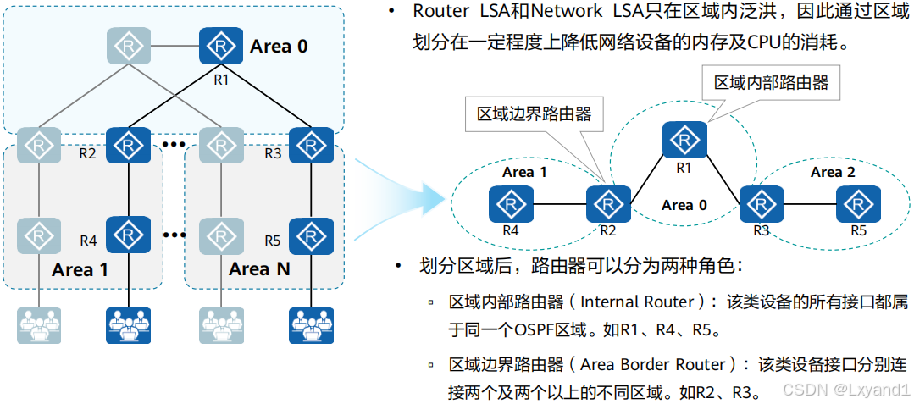

##### 【3】区域间信息传递

OSPF 区域间路由信息传递是通过 ABR 产生的 NetworkSummary LSA(3 类 LSA) 实现的。
以 192.168.1.0/24 路由信息为例:

- R2 依据 Area 1 内所泛洪的 Router LSA 及 Network LSA 计算得出 192.168.1.0/24 路由 (区域内路由)，并将该路由通过 DNetwork Summary LSA 通告到 Area 0。R3 根据该 LSA 可计算出到达 192.168.1.0/24 的区域间路由、
- R3 重新生成一份 Network summary LSA 通告到 Area 2 中，至此所有 OSPF 区域都能学习到去往 192.168.1.0/24 的路由。

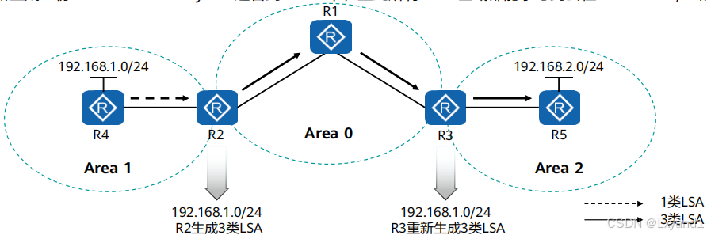

##### 【4】Network Summary LSA 详解

Network Summary LSA(3 类 LSA) 由 ABR 产生，用于向一个区域通告到达另一个区域的路由。

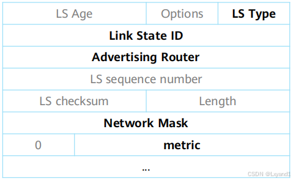

重要字段解释：

- LS Type: 取值 3，代表 Network Summary LSA.
- Link State lD: 路由的目的网络地址。
- Advertising Router: 生成 LSA 的 Router lD。
- Network Mask: 路由的网络掩码。
- metric: 到目的地址的路由开销。

##### 【5】Network Summary LSA 示例

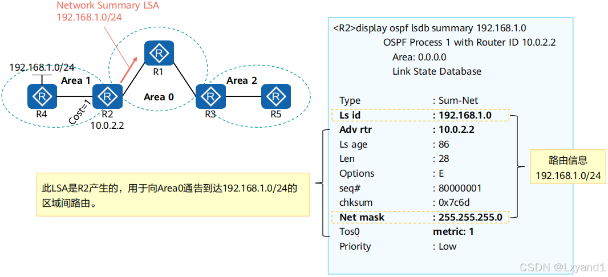

###### a.R1 和 R3 的路由计算

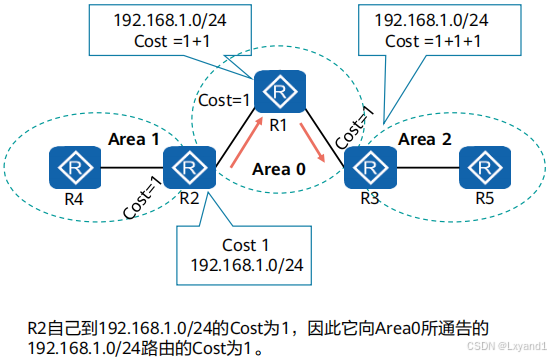

通过区域内 SPF 的计算，R1 到达 R2 的 Cost 值为 1，R3 到达 R2 的 Cost 值为 2。
R1 和 R3 根据收到的 Network Summary LSA 进行路由计算:

- R1 将到达 R2 和 Cost 值和 Network Summary LSA 所携带的 Cost 值相加，因此 R1 到达 192.168.1.0/24 的 Cost 值为 2。
- R3 将到达 R2 和 Cost 值和 Network Summary LSA 所携带的 Cost 值相加，因此 R3 到达 192.168.1.0/24 的 Cost 值为 3。

###### **b.R5 的路由计算**

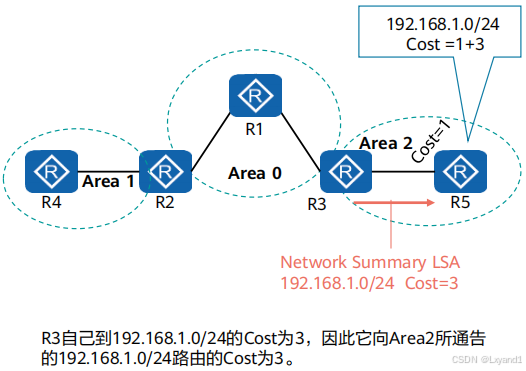

- R3 作为 ABR，它通过 Area 0 内泛洪的 Network Summary LSA 计算出到达 192.168.1.0/24 的路由，然后重新向 Area 2 注入到达该网段的 Network SummaryLSA，其中包含自己到达该网段的 Cost(值为 3)。
- R5 在 SPF 中计算得知到达 R3 的 Cost 为 1，因此 R5 到达 192.168.1.0/24 的 Cost 为 4.

###### **c. 结果验证**

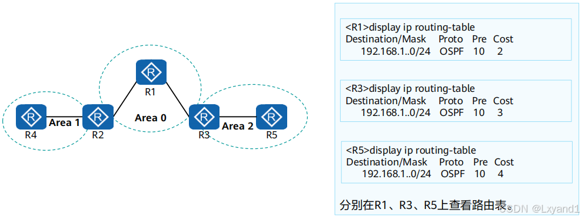

#### （2）区域间路由防环机制

##### 【1】域间环路的产生

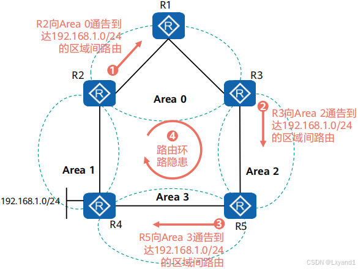

- OSPF 区域间路由的传播过程与距离矢量路由协议的路由传播过程非常相似。
- 对于区域间路由的传递，OSPF 也需要一定的防环机制。

##### 【2】区域间路由防环机制 1

- OSPF 要求所有的非骨干区域必须与 Area 0 直接相连，区域间路由需经由 Area 0 中转。
- 区域间的路由传递不能发生在两个非骨干区域之间，这使得 OSPF 的区域架构在逻辑上形成了一个类似星型的拓扑。

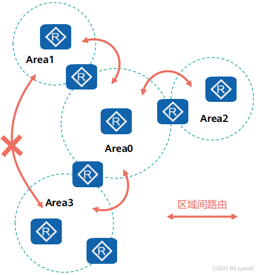

##### 【3】区域间路由防环机制 2

ABR 不会将描述到达某个区域内网段路由的 3 类 LSA 再注入回该区域。

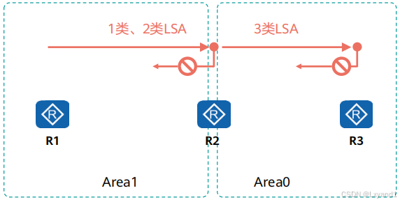

##### 【4】区域间路由防环机制 3

ABR 从非骨干区域收到的 3 类 LSA 不能用于区域间路由的计算。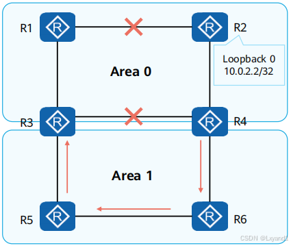

R1 和 R2、R3 和 R4 之间的链路中断导致骨干区域不连续。

- R4 将 10.0.2.2/32 路由以 3 类 LSA 的形式发送到 Area1。
- R5 和 R6 可以根据上述 3 类 LSA 计算出 10.0.2.2/32 路由。
- R3 从非骨干区域收到 3 类 LSA，不进行路由计算，也不会将此 3 类 LSA 发送到其他区域。
- 此时，R1 和 R3 都无法和 10.0.2.2/32 通信。

#### （3）虚连接的作用及配置

- OSPF 要求骨干区域必须是连续的，但是并不要求物理上连续，可以使用虚连接使骨干区域在逻辑上连续。
- 虚连接可以在任意两个 ABR 上建立，但是要求这两个 ABR 都有端口连接到一个相同的非骨干区域。

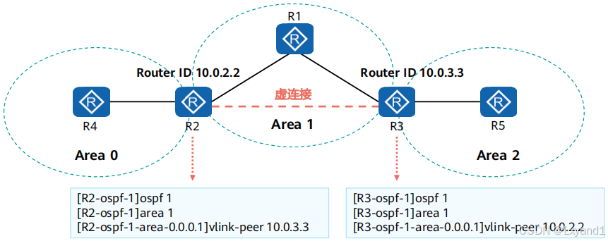

- 注意: 虚连接的创建使 OSPF 协议可以通过非骨干区域通信，违背了 OSPF 区域间的防环规则在某些场景下会导致路由环路的产生，因此不建议部署 OSPF 虚连接。

### 4. 外部路由计算

#### （1）OSPF 外部路由引入背景

网络中存在部分链路未开启 OSPF 协议如:

- 路由器连接外部网络使用静态路由或者 BGP 协议；
- 服务器直连的链路未开启 OSPF 协议。

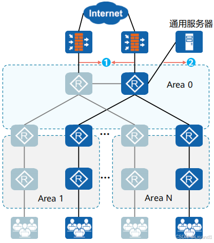

#### （2）外部路由引入基本概念

- ASBR(AS Boundary Router): 自治系统边界路由器。只要一台 OSPF 设备引入了外部路由，它就成为了 ASBR。如图中的 R1。
- ASBR 将外部路由信息以 AS-external LSA(5 类 LSA) 的形式在 OSPF 网络内泛洪。

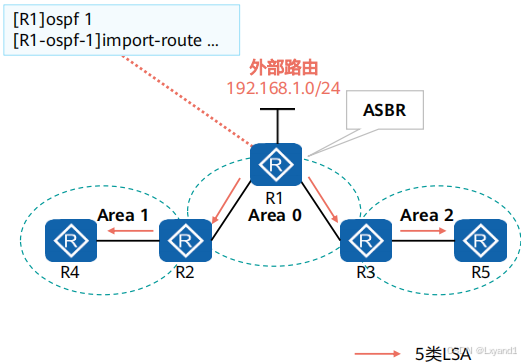

#### （3）AS-external LSA 详解

AS-external LSA(5 类 LSA): 由 ASBR 产生，描述到达 AS 外部的路由，该 LSA 会被通告到所有的区域 (除了 Stub 区域和 NSSA 区域)。

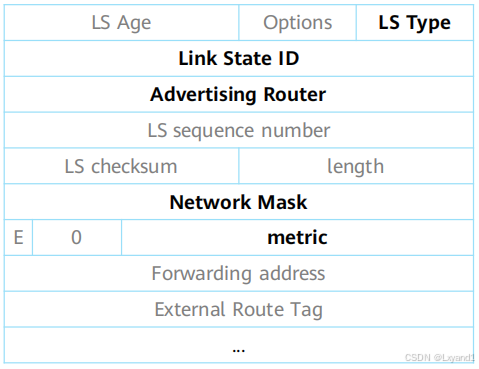

重要字段解释：

- LS Type: 取值 5，代表 AS-external-LSA。
- Link State lD: 外部路由的目的网络地址。
- Advertising Router: 生成该 LSA 的 Router lD。
- Network Mask: 网络掩码。
- E: 该外部路由所使用的度量值类型
- metric: 到目的网络的路由开销。
- Forwarding Address(FA): 到所通告的目的地址的报文将被转发到这个地址。

> Forwarding Address：当 FA 为 0.0.0.0 时，则到达该外部网段的流量会被发往引入这条外部路由的 ASBR。而如果 FA 不为 0.0.0.0，则流量会被发往这个转发地址。FA 这一概念的引入，使得 OSPF 在某些特殊的场景中得以规避次优路径问题。
> External Route Tag(外部路由标记)：这是一个只有外部路由才能够携带的标记，常被用于部署路由策略。

##### 【1】AS-external LSA 示例

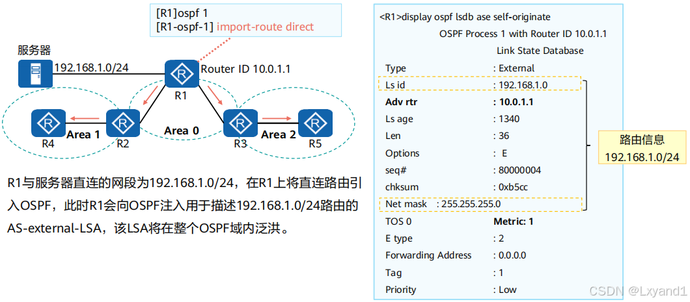

##### 【2】R3 的路由计算过程

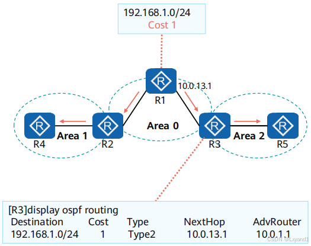

- 外部路由信息以叶子节点形式挂载在 R1 上。
- 根据 5 类 LSA 的 Advertising Router，R3 判断到达外部路由，需要先经过 R1。
- R3 经过区域内 SPF 计算，已经将 R1 添加到 SPF 树干，R3 将到达外部路由的下一跳路由器设置为 R1。
- R2 的计算方式和 R3 类似。

#### （4）ASBR-Summary LSA

ASBR-Summary LSA(4 类 LSA): 由 ABR 产生，描述到 ASBR 的路由，通告给除 ASBR 所在区域的其他相关区域。

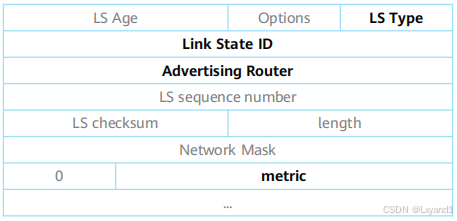

重要字段解释：

- LS Type: 取值 4，代表 ASBR-Summary LSA。
- Link State lD : ASBR 的 Router lD。
- Advertising Router: 生成 LSA 的 Router ID。
- Network Mask: 仅保留，无意义。
- metric: 到目的地址的路由开销。

##### 【1】ASBR-Summary LSA 实例

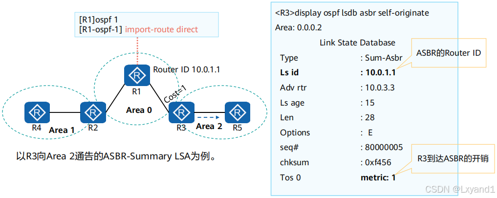

##### 【2】R5 的路由计算过程

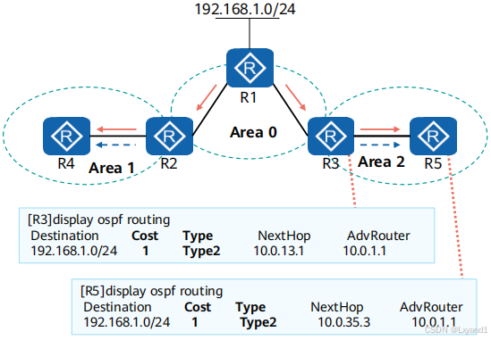

- 外部路由信息以叶子节点形式挂载在 R1 上。
- 根据 5 类 LSA 的 Advertising Router，R5 判断 5 类 LSA 是由 R1 产生的，但是在 R5 的 SPF 树干中并不存在 R1。
- 根据 R3 产生的 4 类 LSA，R5 将到达外部网络的下一跳路由设置为 R3。
- R4 的路由计算方式和 R5 类似。

> 从物理组网上，R3 和 R5 到达外部路由的 Cost 值不同，但是并未在路由表中真实体现。下面给出解释

##### 【3】整体效果

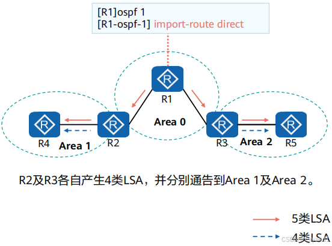

#### （5）区分 OSPF 外部路由的 2 种度量值类型

Metric-Type-1

- 当外部路由的开销与自治系统内部的路由开销相当，并且和 OSPF 自身路由的开销具有可比性时，可以认为这类路由的可信程度较高，将其配置成 Metric-Type-1。
- Metric-Type-1 外部路由的开销为 AS 内部开销 (路由器到 ASBR 的开销) 与 AS 外部开销之和。

Metric-Type-2

- 当 ASBR 到 AS 之外的开销远远大于在 AS 之内到达 ASBR 的开销时，可以认为这类路由的可信程度较低，将其配置成 0Metric-Type-2。
- Metric-Type-2 外部路由的开销等于 AS 外部开销。

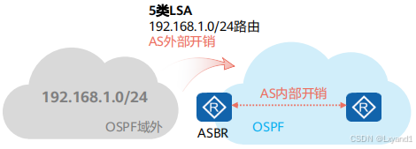

举个栗子：

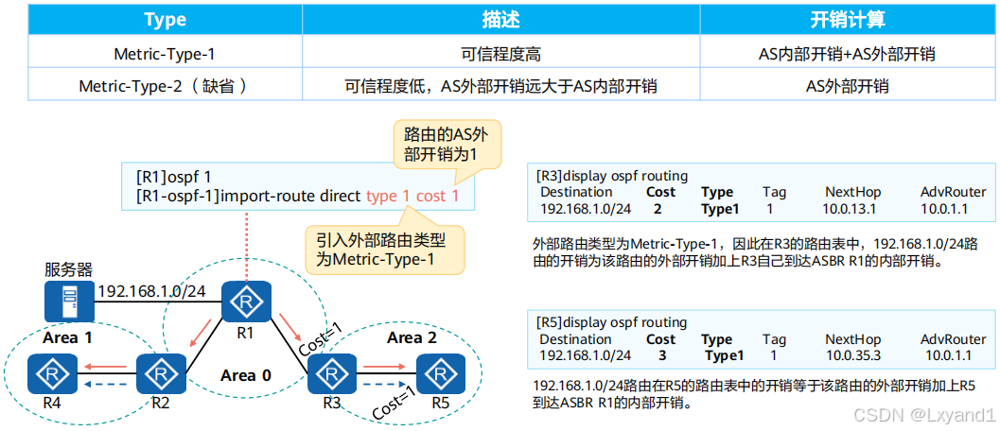

### 5. 模块总结

如果您认真学完本模块后，您将能够:

- 解释 LSA 关键字段的作用;
- 描述常见的 LSA 类型及其功能:
- 阐明 SPF 算法;
- 描述 OSPF 区域内路由、区域间路由计算原理；
- 描述 OSPF 区域间路由的防环机制;
- 描述 OSPF 外部路由计算原理。

## 四. OSPF 特殊区域及其他特性

---

### 1. 前言

- 在一个大型网络中，OSPF 路由器通常需要同时维护由域内路由、域间路由、外部路由构成的数据库。当网络规模不断扩大时，LSDB 规模也不断增长。如果某区域不需要为其他区域提供流量中转服务，那么该区域内的路由器就没有必要维护本区域外的链路状态信息。
- OSPF 通过划分区域可以减小区域内路由器 LSDB 的规模，对于那些位于自治系统 (AS）边界的非骨干区域的低端路由器来说仍然无法承受，通过 OSPF 的特殊区域特性可以进一步减少 LSA 数量和路由表规模。
- 该模块主要介绍 OSPF 特殊区域，以及 OSPF 协议相关特性。

### 2.Stub 区域和 Totally Stub 区域

#### （1）网络规模变大引发的问题

OSPF 路由器计算区域内、区域间、外部路由都需要依靠网络中的 LSA，当网络规模变大时，设备的 LSDB 规模也变大，设备的路由计算变得更加吃力，造成设备性能浪费。

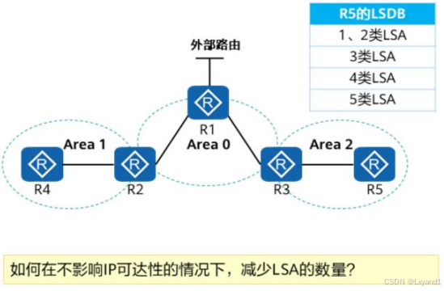

#### （2）传输区域和末端区域

OSPF 的区域可分为两种类型:

- 传输区域 (Transit Area): 除了承载本区域发起的流量和访问本区域的流量外，还承载了源 IP 和目的 IP 都不属于本区域的流量，即 “穿越型流量”，如本例中的 Area0。
- 末端区域 (Stub Area): 只承载本区域发起的流量和访问本区域的流量，如本例中的 Area 1 和 Area 2。

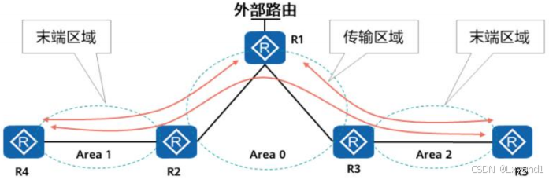

#### （3）Stub 区域

- Stub 区域的 ABR 不向 Stub 区域内传播它接收到的 AS 外部路由，Stub 区域中路由器的 LSDB、路由表规模都会大大减小。
- 为保证 Stub 区域能够到达 AS 外部，Stub 区域的 ABR 将生成一条缺省路由 (使用 3 类 LSA 描述)。

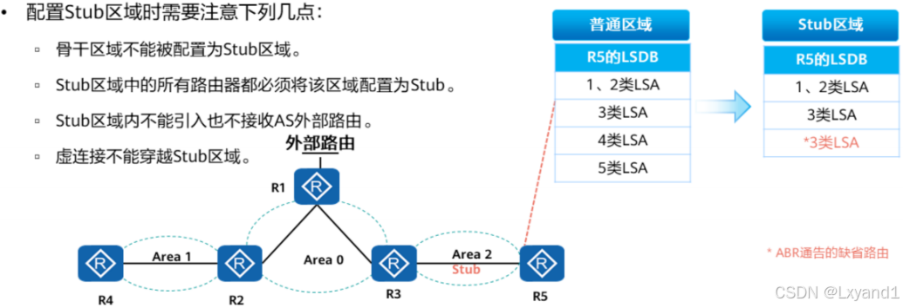

#### （4）Totally Stub 区域

- Totally Stub 区域既不允许 AS 外部路由在本区域内传播，也不允许区域间路由在本区域内传播。
- Totally Stub 区域内的路由器通过本区域 ABR 下发的缺省路由 (使用 3 类 LSA 描述) 到达其他区域，以及 AS 外部。
- 配置 Totally Stub 区域时需要注意:
  与 Stub 区域配置的区别在于，在 ABR 上需要追加 no-summary 关键字。
- Totally Stub 区域访问其他区域及 AS 外部是通过默认路由实现的。
- AS 外部、其他 OSPF 区域的拓扑及路由变化不会导致 Totally Stub 区域内的路由器进行路由重计算，减少了设备性能浪费。

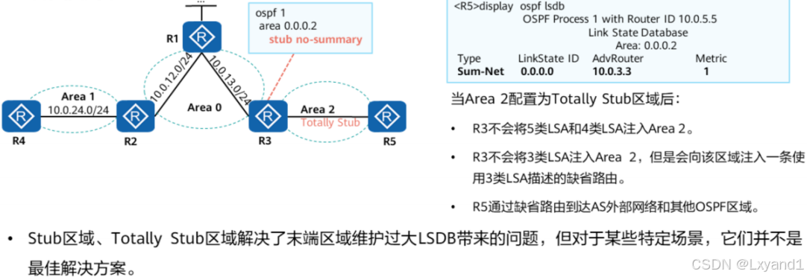

### 3.NSSA 区域和 Totally NSSA 区域

#### （1）Stub 区域和 Totally Stub 区域存在的问题

- OSPF 规定 Stub 区域是不能引入外部路由的，这样可以避免大量外部路由引入造成设备资源消耗。
- 对于既需要引入外部路由又要避免外部路由带来的资源消耗的场景，Stub 和 Totally Stub 区域就不能满足需求了。

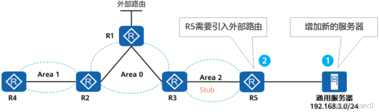

#### （2）NSSA 区域和 Totally NSSA 区域

- NSSA 区域能够引入外部路由，同时又不会学习来自 OSPF 网络其它区域引入的外部路由。
- Totally NSSA 与 NSSA 区域的配置区别在于前者在 ABR 上需要追加 no-summary 关键字。

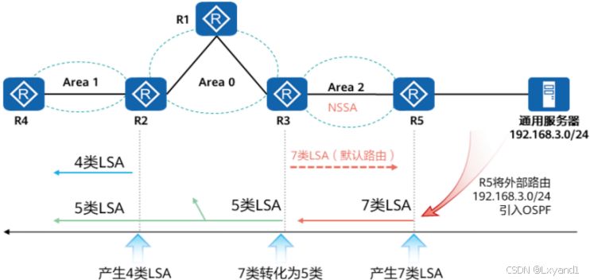

- NSSA 区域能够引入外部路由，同时又不会学习来自 OSPF 网络其它区域的外部路由
- 7 类 LSA 是为了支持 NSSA 区域而新增的一种 LSA 类型，用于描述 NSSA 区域引入的外部路由信息。NSSA 区域的 ASBR 将外部路由引入该区域后，使用 7 类 LSA 描述这些路由。
- 7 类 LSA 的扩散范围仅限于始发 NSSA 区域，7 类 LSA 不会被注入到普通区域
- NSSA 区域的 ABR 会将 7 类 LSA 转化为 5 类 LSA，并将该 LSA 注入到骨干区域，从而在整个 OSPF 域内泛洪。
- NSSA 区域的 ABR 会阻挡其他区域引入的外部路由引入本区域，即 NSSA 区域内不会存在 4 类及 5 类 LSA，为了让 NSSA 区域内的路由器能够通过骨干区域到达 AS 外部，NSSA 区域的 ABR 会自动向该区域注入一条缺省路由，该路由采用 7 类 LSA 描述。

#### （3）NSSA 区域和 Totally NSSA 区域的 LSDB

- 场景 1(将 Area 2 配置为 NSSA 区域): 当 R5 将外部路由 192.168.3.0/24 引入 NSSA 区域时 R5 作为 ASBR 生成 7 类 LSA 在 Area 2 内泛洪; R3 生成使用 7 类 LSA 描述的缺省路由注入 Area2Area 2 内的路由器依然会收到 R3 注入的 3 类 LSA，并计算出到达其他区域的区域间路由。
- 场景 2(将 Area2 配置为 Totally NSSA 区域):Totally NSSA 区域和 NSSA 区域类似，只是 Totally NSSA 区域的 ABR 会阻挡 3 类 LSA 进入该区域，因此在场景 2 中，R3 不会将区域间路由注入 Area 2，故而在 R5 的 LSDB 中，仅会看到一条描述缺省路由的 3 类 LSA。

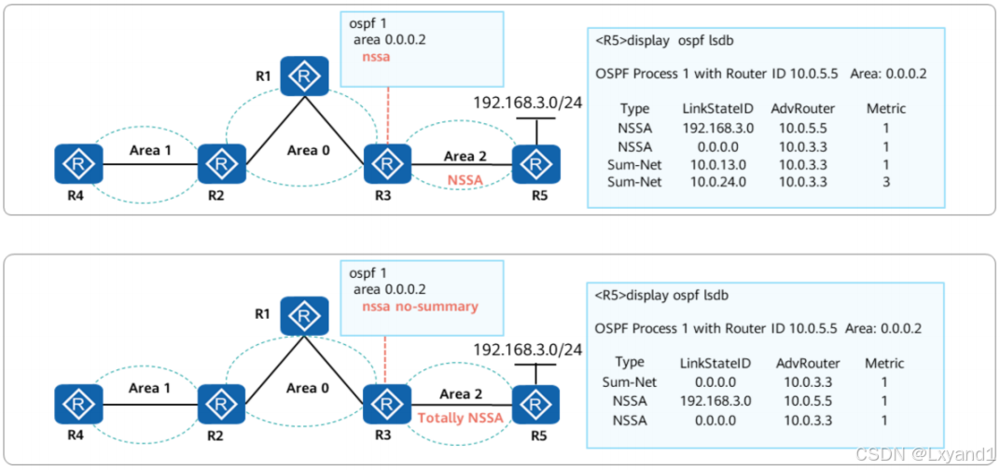

#### （4）OSPF LSA 回顾

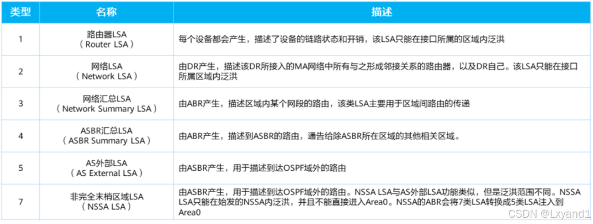

#### （5）路由器对 LSA 的处理原则

OSPF 通过交互 LSA 实现链路状态数据库同步，路由器收到 LSA 后，按照以下原则处理:

- 如果收到的 LSA 本地没有，则更新 LSDB 并泛洪该 LSA。
- 如果本地 LSDB 已存在该 LSA，但是收到的更新，则更新 LSDB 并泛洪该 LSA。
- 如果收到的 LSA 和 LSDB 中相同，则忽略，并终止泛洪。
- 如果收到的 LSA 损坏，例如 Checksum 错误，则不接收该 LSA。

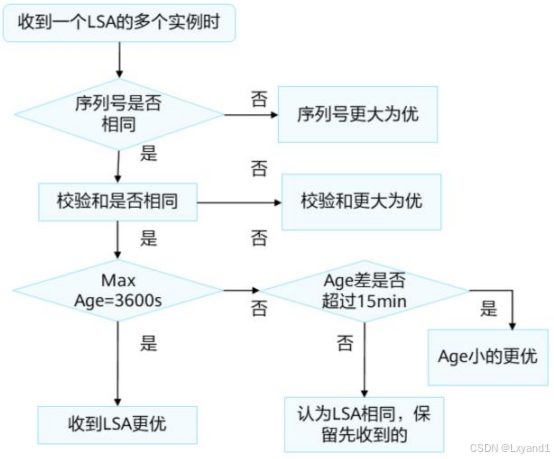

### 4. 区域间路由汇总和外部路由汇总

#### （1）在 ABR 执行路由汇总

- 路由汇总又被称为路由聚合，即是将一组前缀相同的路由汇聚成一条路由，从而达到减小路由表规模以及优化设备资源利用率的目的，我们把汇聚之前的这组路由称为精细路由或明细路由，把汇聚之后的这条路由称为汇总路由或聚合路由。

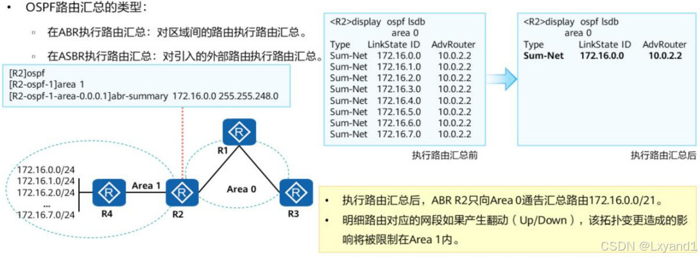

#### （2）在 ABSR 执行路由汇总

- 在 ASBR 配置路由汇总后，ASBR 将对自己所引入的外部路由进行汇总。
- NSSA 区域的 ASBR 也可以对引入 NSSA 区域的外部路由进行汇总。
- 在 NSSA 区域中，ABR 执行 7 类 LSA 转化成 5 类 LSA 动作，此时它也是 ASBR。若配置路由汇总，则对由 7 类 LSA 转化成的 5 类 LSA 进行汇总。

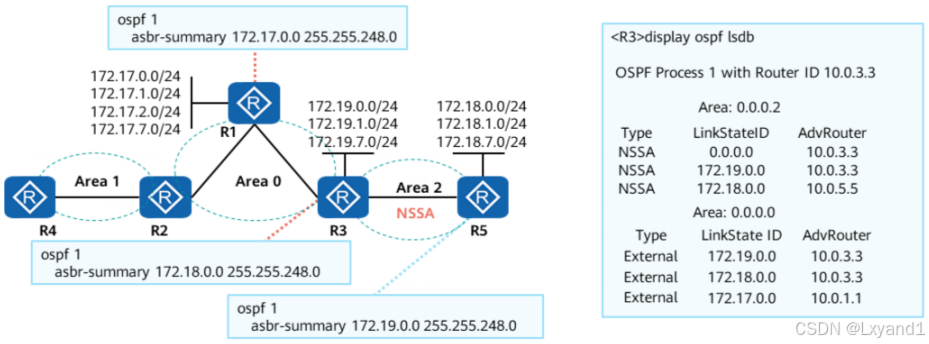

-  R1、R3、R5 分别对引入的外部路由执行路由汇总。

### 5.OSPF 协议特性

#### （1）Silent-Interface

通过 Silent-Interface 的配置，增强 OSPF 的组网适应能力，减少系统资源的消耗。

Silent-Interface 有以下特性:

- Silent-Interface 不会接收和发送 OSPF 报文。
- Silent-Interface 的直连路由仍可以发布出去。

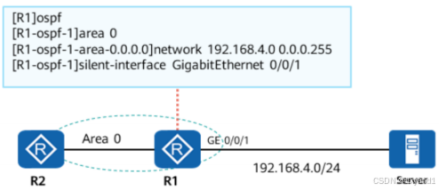

- R1 的 GE0/0/1 接口在 OSPFnetwork 命令的网段范围内。
- 到达该接口的路由将被通告到 OSPF，使得其他设备能够访问 Server。
- 由于该接口上未连接任何其他 OSPF 路由器，因此管理员将该接口配置为 Silent-Interface，该接口将不再收发 Hello 报文，从而避免了对 Server 的性能降低。

#### （2）OSPF 报文认证

OSPF 支持报文认证功能，只有通过认证的 OSPF 报文才能被接收。

路由器支持两种 OSPF 报文认证方式，当两种认证方式都存在时，优先使用接口认证方式:

- 区域认证方式: 一个 OSPF 区域中所有的路由器在该区域下的认证模式和口令必须一致。
- 接口认证方式: 相邻路由器直连接口下的认证模式和口令必须一致。

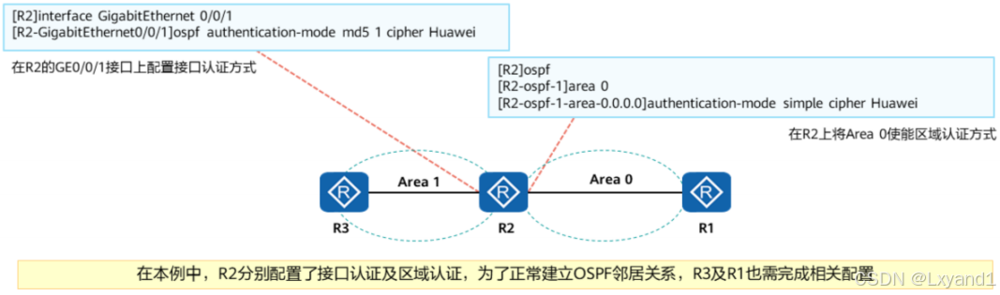

### 6. 模块总结

如果您认真学完本模块后，您将能够:

- 描述 OSPF 特殊区域类型及相关特征
- 阐明 OSPF 路由汇总的应用场景及功能优势
- 实现 OSPF 报文认证的配置

## 五.OSPF高阶特性

---

### 1. 前言

- OSPF 都是基于链路状态的内部网关路由协议，运行这两种协议的路由器通过同步 LSDB，采用 SPF 算法计算最优路由。
- 当网络拓扑发生变化时，OSPF 支持多种快速收敛和保护机制，能够降低网络故障导致的流量丢失。
- 为了实现对路由表规模的控制，OSPF 支持路由选路及路由信息的控制，能够减少特定路由器路由表的大小。
- 本模块将介绍 OSPF 的高阶特性，包括: 快速收敛机制、路由控制、其他特性等。

### 2.OSPF 快速收敛

#### （1）概述

- OSPF 快速收敛是为了提高路由的收敛速度而做的扩展特性，包括: PRC(Partial Route Calculation，部分路由计算) 和智能定时器。
- 同时，OSPF 支持故障恢复快速收敛，例如通过 OSPF IP FRR (Fast ReRoute，快速重路由) 实现备份链路的快速切换，也可以与 BFD 联动实现对故障的快速感知。

#### （2）PRC

- PRC 的工作原理: 当网络上路由发生变化的时候，只对发生变化的路由进行重新计算。
- PRC 不计算节点路径，而是根据 SPF 算法算出来的最短路径树来更新路由。

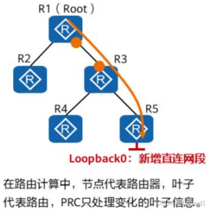

> 场景介绍:
>
> - 某网络运行 OSPF，网络收敛后，左图是以 R1 为根的最短路径树。此时 R1 访问节点 R5 时，通过 [R1 下行链路的出接口，R3 上行链路接口的 IP 地址] 到达该目的地。
> - R5 将环回口 Loopback0 开启 OSPF，即 OSPF 网络内有新增网段。
>
> PRC 计算:
>
> - R5 全网泛洪新增 LSA。
> - R1 收到该 LSA 后会创建新的路由，继承原有访问节点 R5 的路径及下一跳，即最短路径树不变，只在节点 R5 上新增叶子。
> - 因此 R1 访问 R5 的 Loopback0 时，通过 [R1 下行链路的出接口，R3 上行链路接口的 IP 地址] 到达该目的地。
>
> 价值:
>
> - OSPF 网络新增网段时，只关注发生变化的路由，加快了路由的计算。

#### （3）智能定时器

智能定时器是在进行 SPF 计算和产生 LSA 的时候用到的一种定时器，
智能定时器既可以对少量的外界突发事件进行快速响应，又可以避免过度地占用 CPU。

##### 【1】控制 LSA 的生成与接收

OSPF 通过如下两个规定来避免网络连接或者路由频繁动荡引起的过多占用设备资源的情况。

- 同一条 LSA 在 1 秒内不能再次生成，即 LSA 的更新时间间隔 5 秒。
- LSA 被接收的时间间隔为 1 秒。

> · 在网络相对稳定、对路由收敛时间要求较高的组网环境中，可以通过智能定时器指定 LSA 的更新时间间隔为 0 来取消 LSA 的更新时间间隔，使得拓扑或者路由的变化可以立即通过 LSA 发布到网络中，或者立即被感知到，从而加快网络中路由的收敛速度。

##### 【2】控制路由计算

- 当网络发生变化时，OSPF 的 LSDB 会发生改变，需要重新计算最短路径。如果网络频繁变化，由于不断地计算最短路径，会占用大量系统资源，影响设备的效率。
- 通过配置智能定时器，设置合理的 SPF 计算的间隔时间，可以避免占用过多的路由器内存和带宽资源。

##### 【3】智能定时器的基础命令

#### （4）OSPF IP FRR

##### 【1】概述

- OSPF IP FRR 是动态 IP FRR，利用 LFA(Loop-Free Alternates) 算法预先计算出备份路径，保存在转发表中，以备在故障时将流量快速切换到备份链路上，保证流量不中断，从而达到流量保护的目的，该功能可将故障恢复时间降低到 50 ms 以内。
- LFA 计算备份链路的基本思路是:
- 以可提供备份链路的邻居为根节点，利用 SPF 算法计算出到目的节点的最短距离。然后，按照不等式计算出开销最小且无环的备份链路

##### 【2】OSPF IP FRR 组网应用

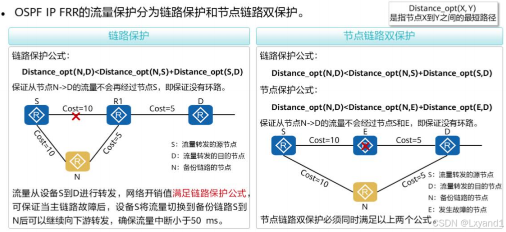

##### 【3】OSPF IP FRR 的基础命令

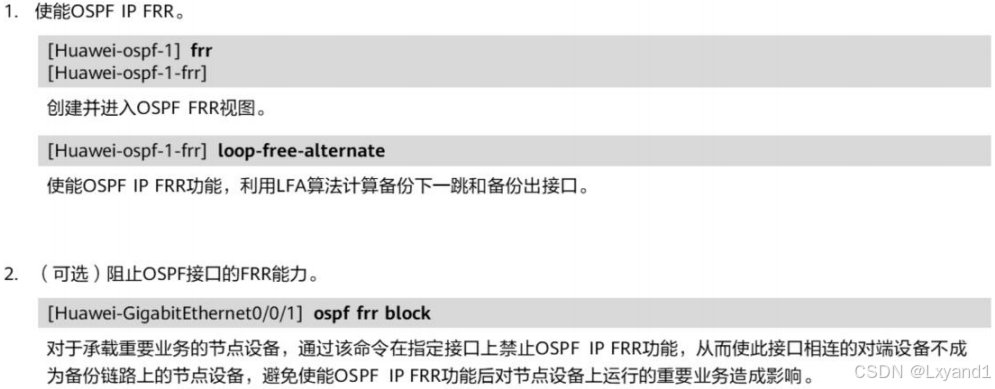

##### 【4】OSPF IP FRR 配置举例

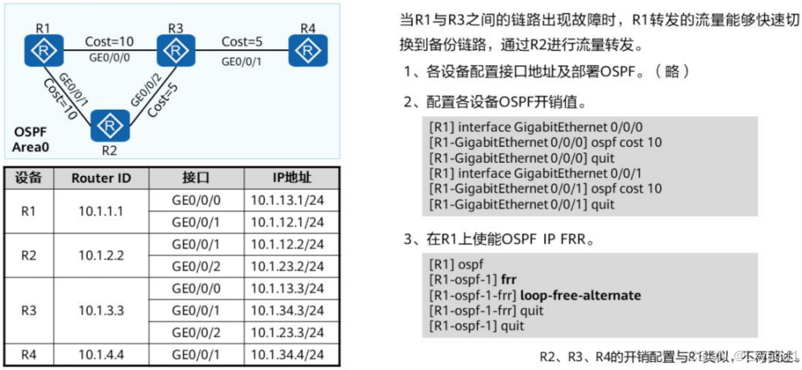

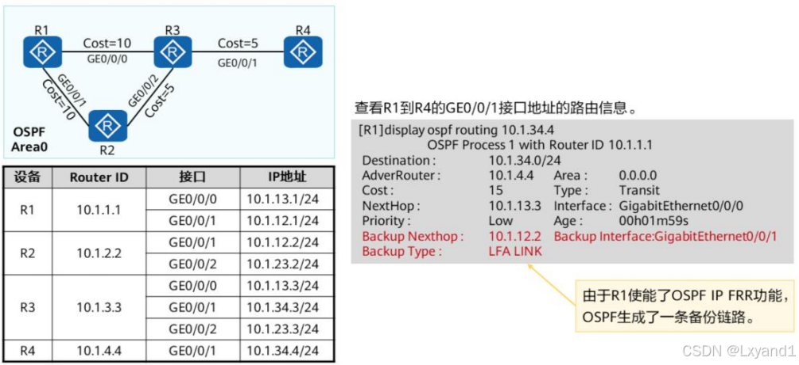

#### （5）OSPF 与 BFD 联动

##### 【1】概述

- 网络上的链路故障或拓扑变化都会导致设备重新进行路由计算，所以缩短路由协议的收敛时间对于提高网络的性能是非常重要的。
- OSPF 与 BFD 联动就是将 BFD 和 OSPF 关联起来，一旦与邻居之间的链路出现故障，BFD 对链路故障的快速感应能够加快 OSPF 对于网络拓扑变化的响应。

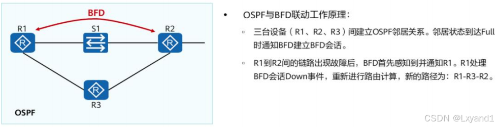

##### 【2】OSPF 与 BFD 联动的基础配置命令

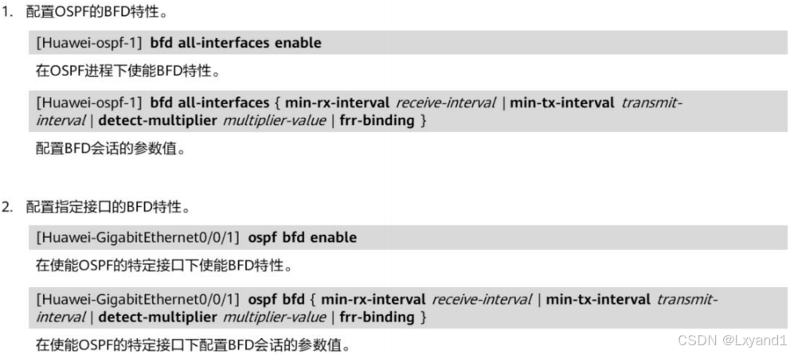

### 3.OSPF 路由控制

#### （1）等价路由

##### 【1】概述

- 当路由表中存在到达同一目的地址，且同一路由协议发现的多条路由时，若这几条路由的开销值也相同，那么这些路由就是等价路由，可以实现负载分担。
- 设备将按照负载分担的方式从多条等价路由发送报文到同一目的地址。

##### 【2】等价路由配置举例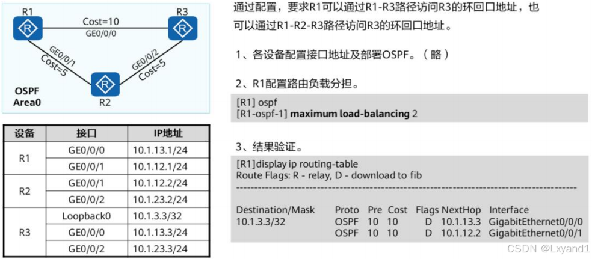

#### （2）缺省路由

##### 【1】概述

OSPF 实际组网应用中，区域边界和自治系统边界通常都是由多个路由器组成的多出口冗余备份或者负载分担。此时，为了减少路由表的容量，可以配置缺省路由，保证网络的高可用性。

OSPF 缺省路由通常应用于下面两种情况:

- 由区域边界路由器 (ABR) 发布 Type3 LSA，用来指导区域内路由器进行区域之间报文的转发。
- 由自治系统边界路由器 (ASBR) 发布 Type5 LSA 或 Type7 LSA，用来指导 OSPF 路由域内路由器进行域外报文的转发。

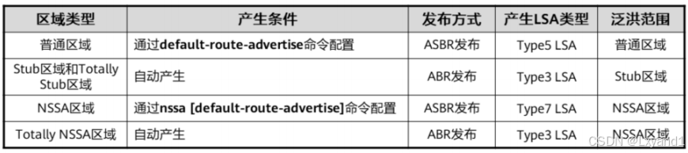

##### 【2】将缺省路由通告到 OSPF 路由区域

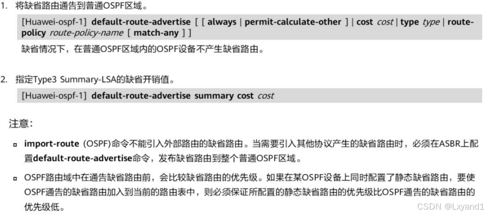

#### （3）过滤 LSA

##### 【1】概述

- 当两台路由器之间存在多条链路时，可以在某些链路上通过对发送的 LSA 进行过滤，减少不必要的重传，节省带宽资源。
- 通过对 OSPF 接口出方向的 LSA 进行过滤可以不向邻居发送无用的 LSA，从而减少邻居 LSDB 的大小提高网络收敛速度。

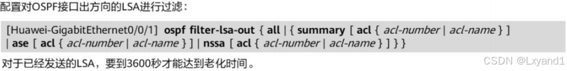

##### 【2】对 ABR Type3 LSA 进行过滤

- 对区域内出、入方向 ABR Type3 LSA(Summary LSA) 设置过滤条件，只有通过过滤的 LSA 才能被发布和接收。
- 通过对区域内的 LSA 进行过滤可以不向邻居发送无用的 LSA，从而减少 LSDB 的大小，提高网络收敛速度。

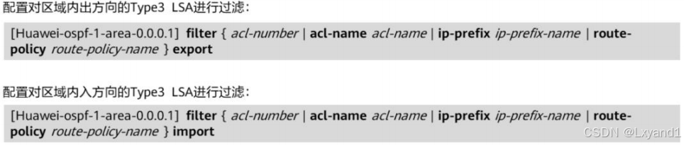

#### （4）配置举例

##### 【1】OSPF 路由控制案例分析

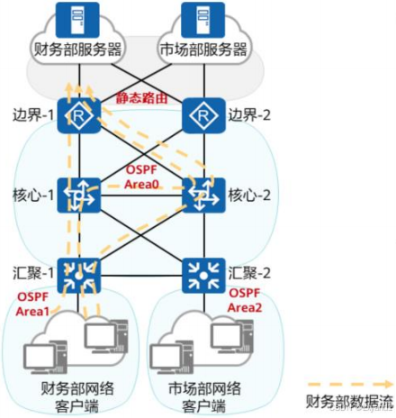

网络部署:

- 某企业网络内有财务部和市场部两张网络。
- 该企业网络通过 OSPF 实现内部网络的互联互通，其中骨干网络部署在 Area0，财务部网络客户端部署在 Area1，市场部网络客户端部署在 Area2。
- 边界设备通过静态路由访问各部门服务器，并在 OSPF 进程内引入该静态路由。

需求:

- 只要边界 - 1 路由器及其上联链路正常运行，财务部数据流就只会通过边界 - 1 路由器进行数据转发。
- 只要核心 - 1 路由器及其上联链路正常运行，财务部数据流就只会通过核心 - 1 路由器进行数据转发。
- 本案例以分析财务部数据转发路径为例，市场部相关内容不再赘述。

##### 【2】需求分析

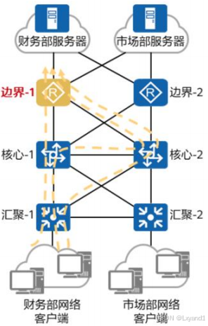

1. 控制数据转发的网络出口:

- 财务部数据始终向边界 - 1 的方向进行转发;
- 市场部数据始终向边界 - 2 的方向进行转发。

> 要保证网络会选择固定的 ASBR 执行数据转发，要求忽略内部网络变化，即不计算内部路由开销。
>  **-- 使用 OSPF 的 Type2 外部路由**

2. 控制数据流在内部的精确路径:

- 不出现负载分担路径。

> 要在网络内部按照规划路径将数据发往特定的 ASBR。
>  **-- 调整内部路径开销**

##### 【3】控制流量出口

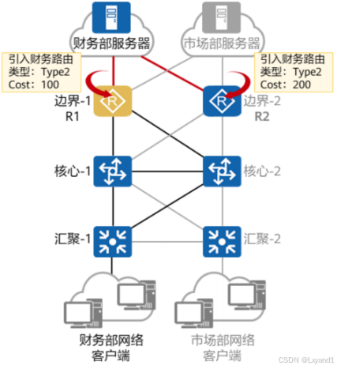

实现方式:

- 在 R1(边界 - 1) 和 R2(边界 - 2) 的 OSPF 进程内引入去往财务部服务器的静态路由，实现出口备份 (可以通过路由策略实现);
- 设置引入外部路由类型为 Type2;
- 在 R1 上设置外部路由开销为 100，在 R2 上设置外部路由开销为 200。

配置结果:

- 网络中存在 2 条同一网段不同开销的 Type2 外部路由时: 网络设备会优选开销较小的路由。此时，网络中各设备会优选 R1 作为出口。

##### 【4】控制内部路径

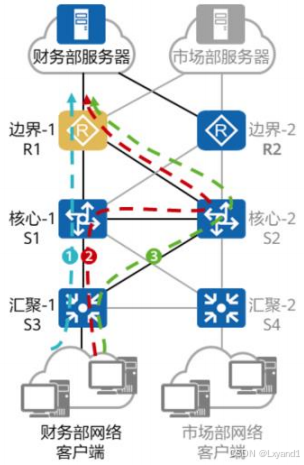

网络需求分析:

- 若网络正常运行，则 S3(汇聚 - 1) 会选择路径 1。
- 若 S1(核心 - 1) 与 R1 间链路故障，则 S3 会选择路径 2。
- 若 S1 设备故障，则 S3 会选择路径 3。

实现方式:

- 路径 1-Cost < 路径 2-Cost < 路径 3-Cost。

##### 【5】调整汇聚到核心开销

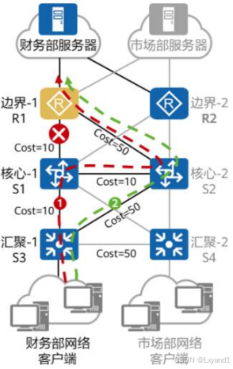

若 S1 与 R1 间链路故障，由于 S1 运行正常，则要求 S3 优选路径 1，次选路径 2。
实现方式:

- 路径 1-Cost <路径 2-Cost，即 [Cost(S3-51)+Cost(S1-S2)+Cost(S2-R1)]<[Cost(S3-S2)+ Cost(S2-R1)]
- 通过调整汇聚到核心设备间的路径开销可以实现路径 1。

【6】调整核心到边界开销

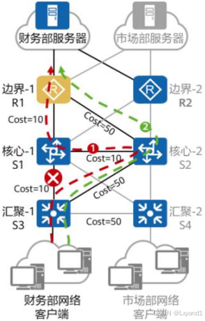

若 S1 与 R1 间链路故障，由于 S1 运行正常，则要求 S3 优选路径 1，次选路径 2。
实现方式:

- 路径 1-Cost <路径 2-Cost，即 [Cost(S3-51)+Cost(S1-S2)+Cost(S2-R1)]<[Cost(S3-S2)+ Cost(S2-R1)]
- 通过调整汇聚到核心设备间的路径开销可以实现路径 1。

##### 【6】主要配置命令

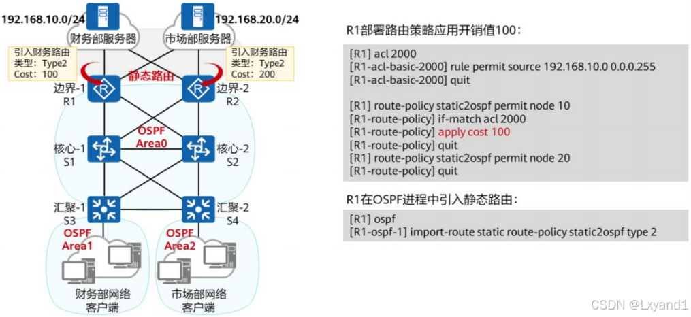

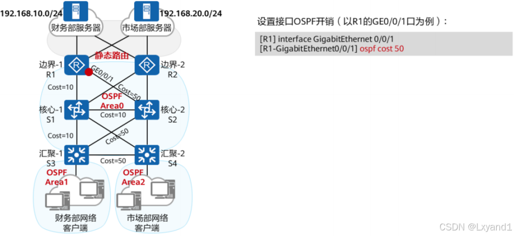

### 4.OSPF 其它特性

#### （1）OSPF 多进程

- OSPF 支持多进程，在同一台路由器上可以运行多个不同的 OSPF 进程，它们之间互不影响，彼此独立。不同 OSPF 进程之间的路由交互相当于不同路由协议之间的路由交互。
- 路由器的一个接口只能属于某一个 OSPF 进程。

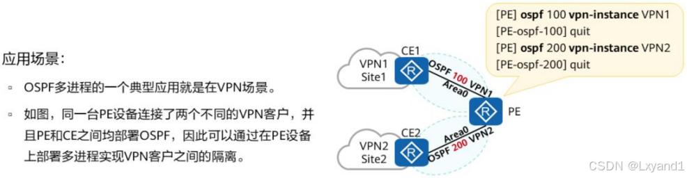

#### （2）OSPF 与 BGP 联动

当有新的设备加入到网络中，或者设备重启时，可能会出现在 BGP 收敛期间内网络流量丢失的现象。这是 IGP 收敛速度比 BGP 快造成的。
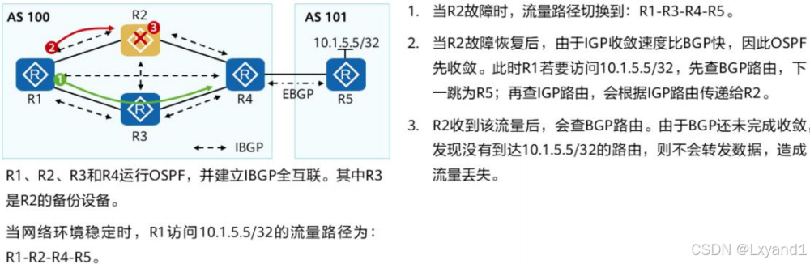

- 通过使能 OSPF 与 BGP 联动特性，可以解决流量丢失问题。
- 使能了 OSPF 与 BGP 联动特性的设备会在设定的联动时间内保持为 Stub 路由器，也就是说，该设备发布的 LSA 中的链路度量值为最大值 (65535)，从而告知其它 OSPF 设备不要使用这个路由器来转发数据。

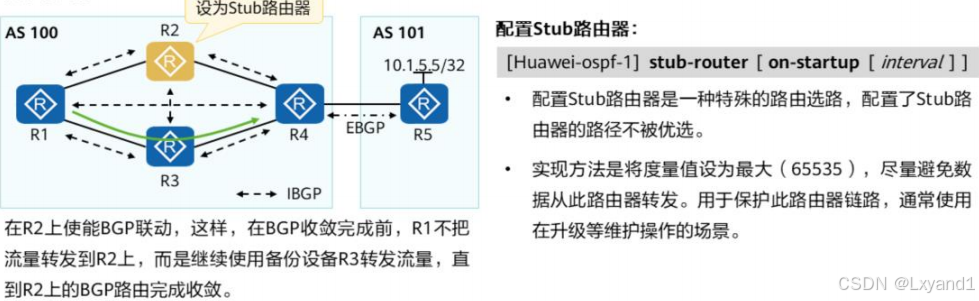

#### （3）OSPF 转发地址

##### 【1】概述

FA(ForwardingAddress，转发地址)：

- 到达所通告的目的地的数据包应该被转发到的地址，如果转发地址为 0.0.0.0，那么数据包将被转发到始发 ASBR 上。

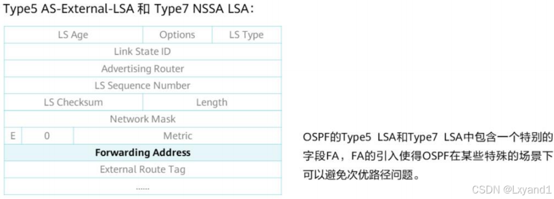

##### 【2】没有 FA 引发的问题

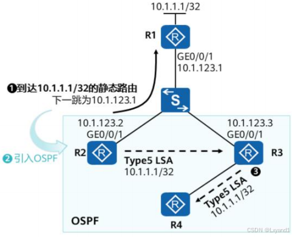

R2、R3 和 R4 运行 OSPF，均部署在 Area0 中。其中 R2 和 R3 的 GE0/0/1 接口都激活 OSPF 并建立邻接关系但是两者与外部路由器 R1 并不建立 OSPF 邻接关系。

- R2 配置到达 10.1.1.1/32 的静态路由，下一跳为 10.1.123.1.
- R2 将静态路由引入 OSPF，产生 Type5LSA 在区域内泛洪。
- R3 接收到 R2 产生的 5 类 LSA，计算出到达 10.1.1.1/32 的外部路由，并且将路由的下一跳指定为 R2(10.1.123.2)。

OSPF 域内的路由器如 R4 到达 10.1.1.1/32 的路径是:

- R4-R3-R2-R1，该路径是次优路径的。

##### 【3】利用 FA 解决次优路径问题

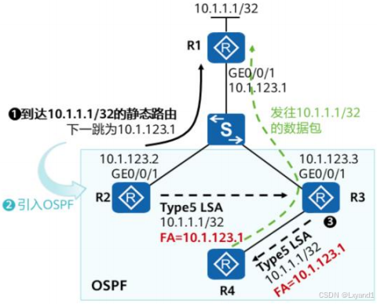

- R2 向 OSPF 域内通告到达 10.1.1.1/32 的外部路由时为对应的 Type5 LSA 设置 FA，值为其自己到达该外部路由的下一跳: 10.1.123.1。
- 当 R3 收到该 LSA 后，计算到达 10.1.1.1/32 的路由时发现 FA 为非 0，因此它认为到达目标地址 10.1.1.1/32 的下一跳为 FA 所指定的地址，即: 10.1.123.1。

##### 【4】FA 的取值

当 ASBR 引入外部路由时，若 Type5 LSA 中的 FA 字段为 0，表示路由器认为到达目的网段的数据包应该发往该 ASBR; 若 Type5 LSA 中的 FA 字段不为 0，表示路由器认为到达目的网段的数据包应该发往这个 FA 所标识的设备。

当以下条件全部满足时，FA 字段才可以被设置为非 0:

- ASBR 在其连接外部网络的接口 (外部路由的出接口) 上激活了 OSPF;
- 该接口没有被配置为 Silent-Interface;9
- 该接口的 OSPF 网络类型为 Broadcast 或 NBMA;8
- 该接口的 IP 地址在 OSPF 配置的 network 命令指定的网段范围内;
- 到达 FA 地址的路由必须是 OSPF 区域内部路由或区域间路由，这样接收到该外部 LSA 的路由器才能够加载该 LSA 进入路由表。加载的外部 LSA 生成的路由条目下一跳与到达 FA 地址的下一跳相同。

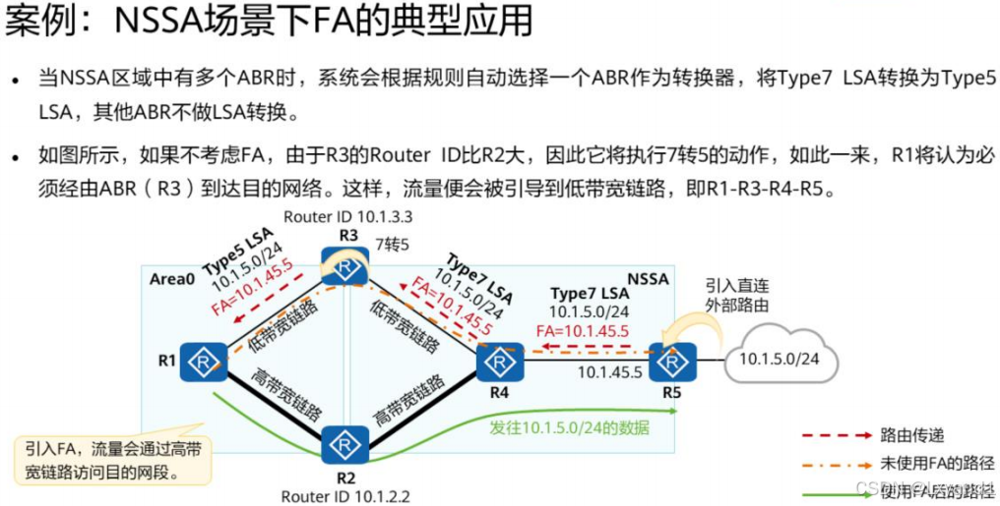

### 5. 模块总结

如果您认真学完本模块后，您将能够:

- 描述 OSPF 的各种快速收敛的技术
- 实现 OSPF 等价路由的配置
- 实现 OSPF 发布缺省路由
- 描述 OSPF 多进程使用场景
- 描述 OSPF 转发地址的使用场景

## 六.OSPF的详细配置

---

### 1. 观察 OSPF 报文交互过程

#### （1）实验目的

配置基本的 OSPF，观察其建立邻居关系时的报文交互过程。

#### （2）IP 地址规划

- 互联地址采用 10.1.XY.X/24 位，比如 AR1 与 AR2 的互联接口地址分别为 10.1.12.1/24 和 10.1.12.2/24，以此类推。
- 每台设备都有一个测试用的 loopback0 口, 地址为 10.1.X.X/32, 比如 AR1 的 loopback0 口地址为 10.1.1.1/32，以此类推。

#### （3）实验拓扑

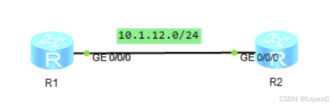

#### （4）实验步骤

【1】基本的 IP 地址配置（本步骤省略）

【2】在 AR1 和 AR2 上配置 OSPF，配置之前先在链路上开启抓包

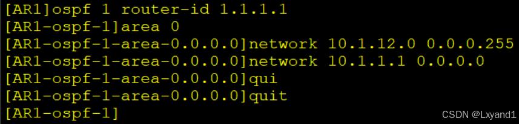

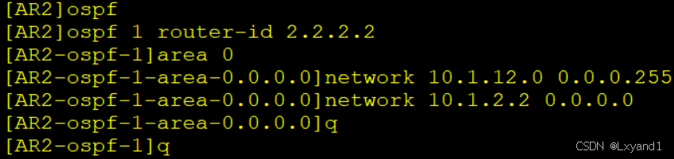

> 这里先复习一下 OSPF 报文类型及作用：
>
> - hello 报文: type 类型为 1。作用是自动发现邻居路由器，协商参数并维护邻居关系
> - Database(DD 报文):type 类型为 2。作用是交互链路状态数据库摘要信息，并完成 Master Slave 的选举。
> - Link State Request(LSR 报文):type 类型为 3。作用是请求特定的链路状态信息
> - Link State Update(LSU 报文):type 类型为 4。作用是发送详细的链路状态信息
> - Link State Ack(LSA 报文):type 类型为 5。作用是对 LSU 报文的确认。

打开 Wireshark 查看 OSPF 邻居建立过程中的报文交互过程，如图所示

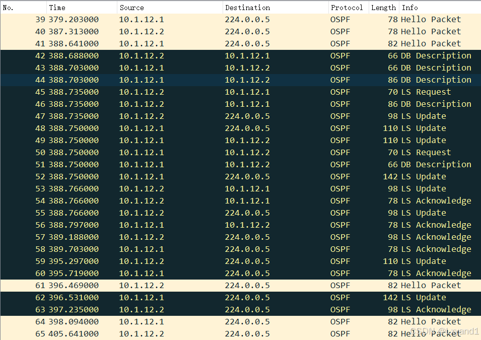

**从上图可以看出，在 OPSF 邻居建立过程中，涉及到了所有 OSPF 报文的交互，接下来分析整体的 OSPF 邻居关系的建立过程及报文内容。**

a. 先打开 AR1 与 AR2 发出的 OSPF hello 报文，报文如下：

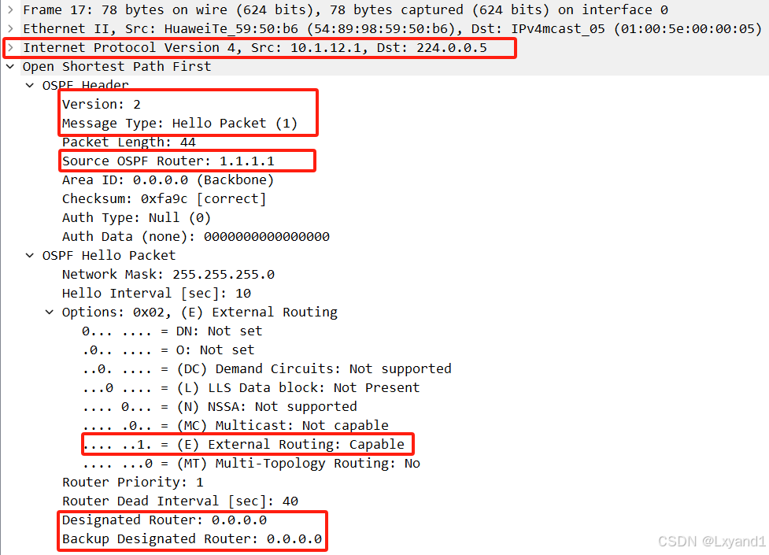

在 AR1 的初始 hello 包中，可以得到以下信息：

- 发送源地址为 AR1 的接口地址 10.1.12.1，目的 IP 为组播 IP 地址 224.0.0.5
- OSPF 协议版本为 V2，信息类型为 1 hello packet。
- 源 OSPF 的 router id 为 1.1.1.1。属于区域 0。
- 掩码信息为 255.255.255.0，hello 间隔为 10S。
- Options Ebit 置位，表示本区域可以支持外部路由的泛洪。
- DR BDR 尚未选举。

b. 打开 AR2 发给 AR1 的 hello 报文：

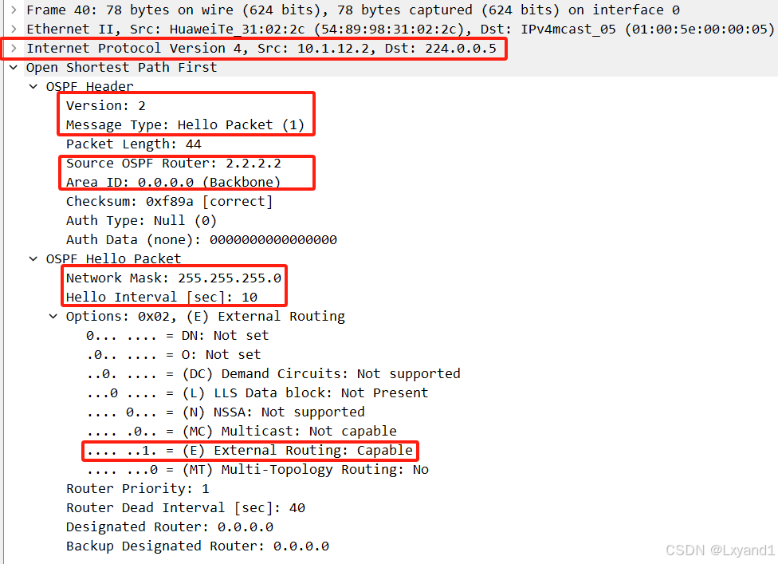

- 与 AR1 发出的初始报文类似，目的就是探测邻居路由器。当两台设备互相收到邻居的 hello 包后，就可以进行协商参数了。协商通过后开始发送 DD 报文。

c. 打开 AR1 发给 AR2 的 DD 报文：

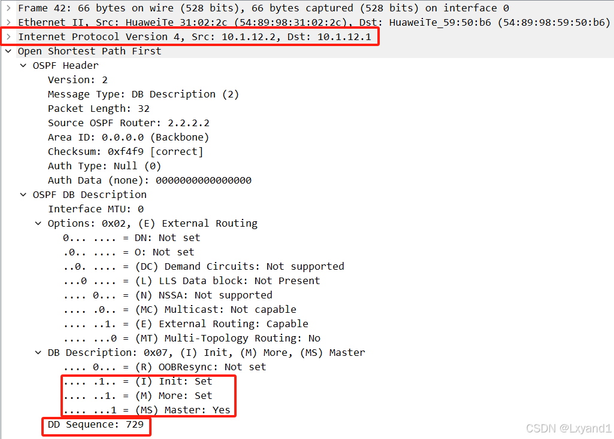

从 AR1 发出的 DD 报文得到以下信息

- DD 报文在 MA 网络中通过单播发送。
- 初始的 DD 报文中三个 bit 全部置 1。(I: 表示是初始化的 firstDD 报文，M: 表示 AR1 后面还有更多的 DD 报文，MS: 表示要竞选 Master。)
- DD 序列号: 729

d. 打开 AR2 发送给 AR1 的 DD 报文：

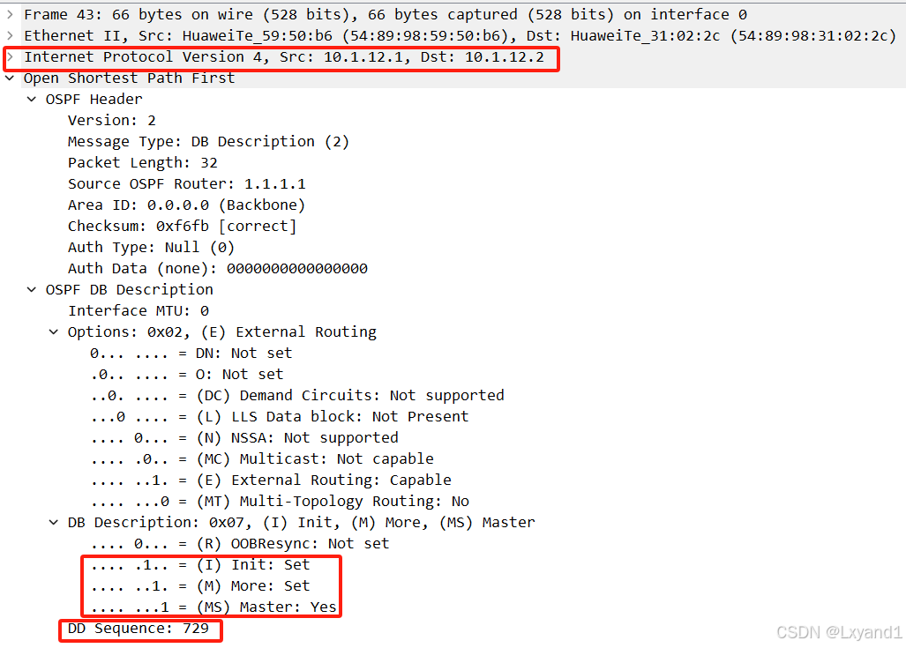

从 AR2 的初始化 DD 报文中可以得到以下信息：

- 依旧使用单播发送。
- DD 报文中的 3 个 bit 位全部置 1, 表示此 DD 为 first DD, 同时后面有更多的 DD 报文，同时 AR2 也要竞选 Master 角色。
- DD 序列号: 729

通过上面两个初始化的 DD 报文，可以看出，此 DD 报文只有一个头部信息，没有具体的数据库摘要信息，作用就是为了选举 Master 和 Slave。选举 Master 和 Slave 的目的是为了控制序列号的顺序，以此保证后期 DD 报文的可靠性。

Master 和 Slave 的选举采用 routerid,routerid 大的获胜。所以在本实验中 AR2 会作为 Master，AR1 会作为 Slave。当角色选定后，由 slave 先发送真正的 DD 报文，同时使用 Master 初始 DD 报文的序列号作为初始序列号。

e. 如下图所示：

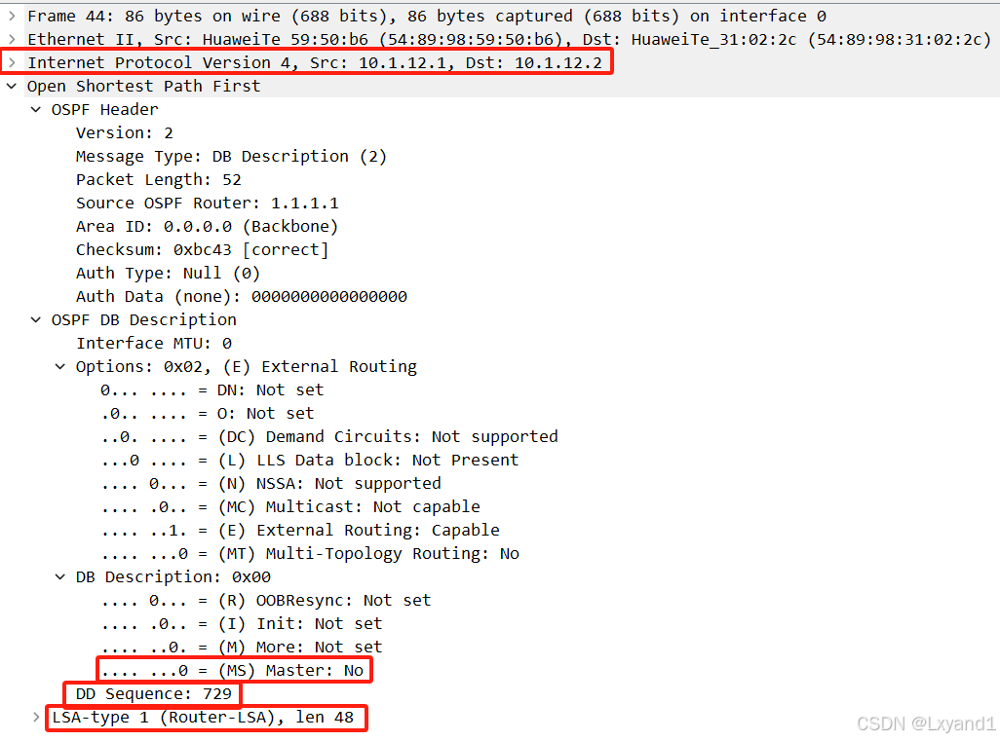

- 此时 AR1 为 Slave 设备，同时 DD 报文序列号使用了 Master 的初始序列号，并且携带了 LSA 的摘要信息。

f. 继续查看下一个 AR2 发出的 DD 报文，内容如下图所示：

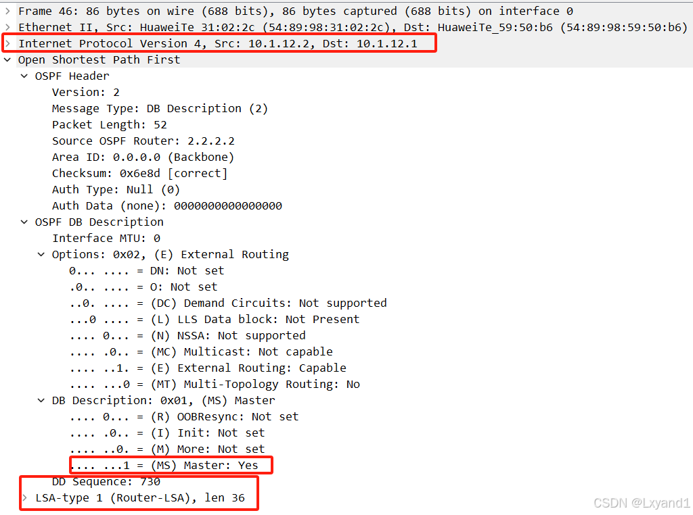

- AR2 发送的 DD 报文，角色为 Master，序列号加 1 为 730。并且携带了摘要信息。

> 当 DD 报文交互完毕后，设备相互了解到了各自设备所具有的 LSA，此时设备会互相发送 LSR 报文进行 LSA 请求。

g.AR2 向 AR1 发送 1 类 LSA 请求报文如下：

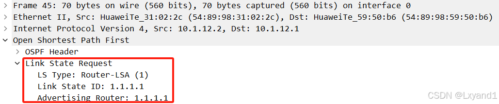

h. 当 AR1 收到 AR2 的 LSA 请求后，立即发送 LSU 报文，LSU 报文内容如下：

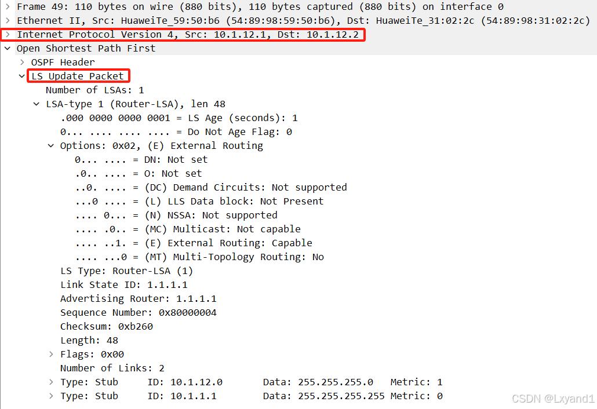

i. 当 AR2 收到 LSU 后，AR2 回复 LSACK 进行确认，LSACK 报文内容如下所示：

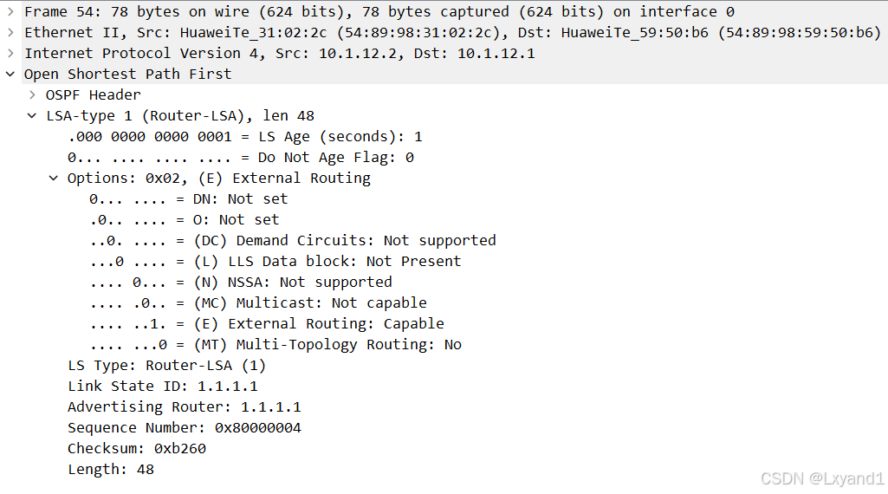

- 同理，AR1 也会向着 AR2 发送 LSR 请求，AR2 回复 LSU，以此同步数据库。

### 2. 观察 OSPF 状态机变迁

#### （1）实验目的

配置基本的 OSPF，观察其建立邻居关系时的状态变化。

#### （2）IP 地址规划

- 互联地址采用 10.1.XY.X/24 位，比如 AR1 与 AR2 的互联接口地址分别为 10.1.12.1/24 和 10.1.12.2/24，以此类推。
- 每台设备都有一个测试用的 loopback0 口, 地址为 10.1.X.X/32, 比如 AR1 的 loopback0 口地址为 10.1.1.1/32，以此类推。

#### （3）实验拓扑

#### （4）实验步骤

【1】配置基本的 IP 地址及基本的 OSPF 配置。（本步骤省略）

【2】在 AR1 上开启以下命令来查看 OSFP 的状态变迁：

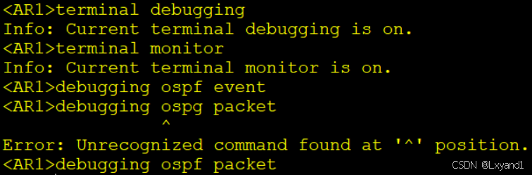

【3】在 AR2 上查看 OSPF 信息，如下：

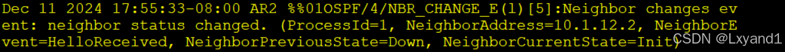

- 从邻居那收到了 hello 包，邻居状态由 down 进入 init

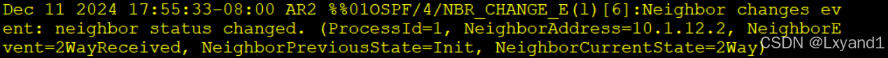

- 再次收到邻居发来的 hello 包，同时在 hello 包中包含自己的 router-id，此时状态由 init 进入到 2way

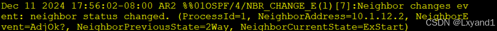

- 发送 DD 报文进入 Exstart 状态

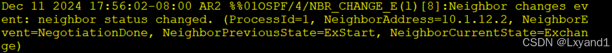

- 交互 DD 报文并发送 LSR 请求 LSU，并进入 Exchange 状态

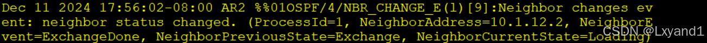

- 交互完毕进入 Loading 状态

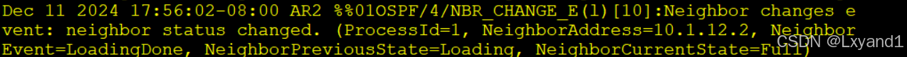

- 最后邻居状态为 Full

### 3. 观察 OSPF 各类 LSA

#### （1）实验目的

通过基础实验，观察各类 LSA 的内容，并理解每种 LSA 的作用。

#### （2）IP 地址规划

- 互联地址采用 10.1.XY.X/24 位，比如 AR1 与 AR2 的互联接口地址分别为 10.1.12.1/24 和 10.1.12.2/24，以此类推。
- 每台设备都有一个测试用的 loopback0 口, 地址为 10.1.X.X/32, 比如 AR1 的 loopback0 口地址为 10.1.1.1/32，以此类推。

#### （3）实验拓扑

#### （4）实验步骤

【1】根据以下需求独立完成基础配置

- 在 AR5 与 AR1 之间配置 RIPv2, 关闭自动汇总, 将 AR5 的所有接口及 AR1 的 G0/0/1 口宣告进入 RIP。
- 将 AR1 的 G0/0/0 口、loopback0 口、AR2 的 G0/0/0 口宣告进入 OSPF 的区域 1。
- 将 AR2 的 G0/0/1 口、loopback0 口、AR3 的 G0/0/1 口、AR3 的 loopback0 口宣告进入区域 0。
- 将 AR3 的 G0/0/0 口及 AR4 的所有接口宣告进入 OSPF 区域 2。

【2】完成基础配置后，在 AR1 上通过以下命令检查路由学习情况。

- 在 AR1 上查看从 RIP 学习到的路由

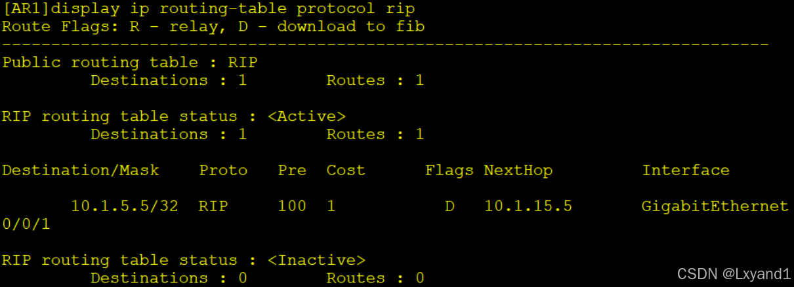

- 在 AR1 上查看从 OSPF 学习到的路由

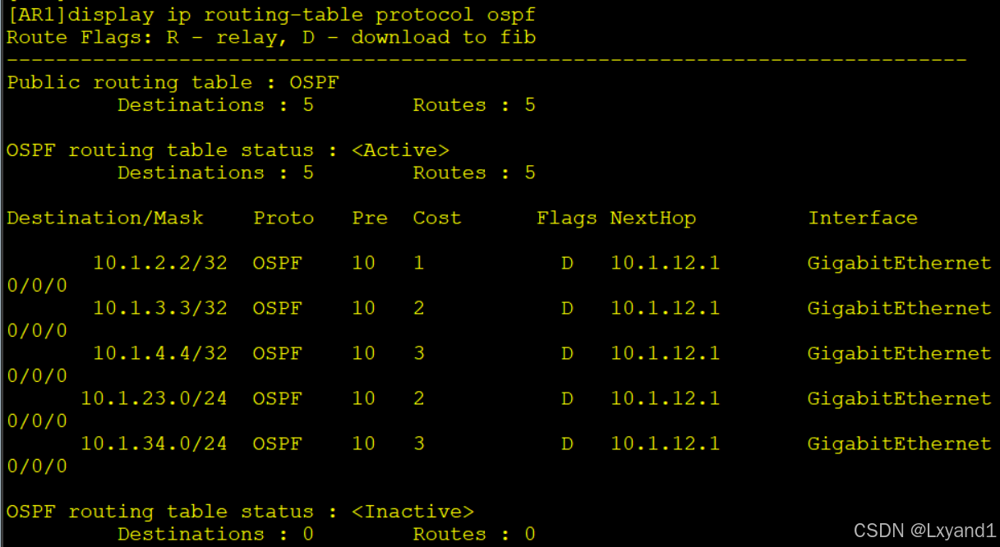

【3】在 AR1 上执行 RIP 与 OSPF 的双向引入

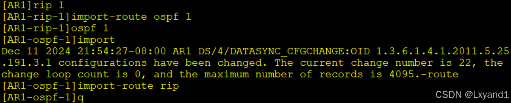

【4】在 AR2 上查看引入的外部路由是否存在

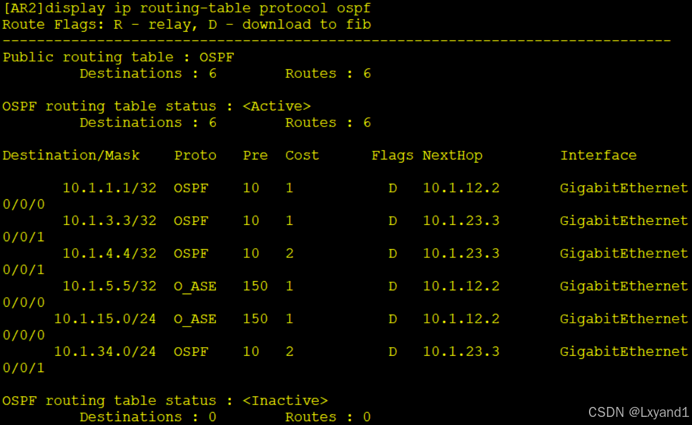

【5】接下来观察各类 LSA。首先在 AR1 上观察 1 类 LSA（Router LSA）。

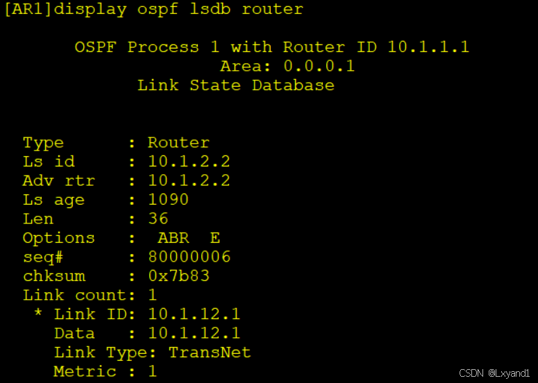

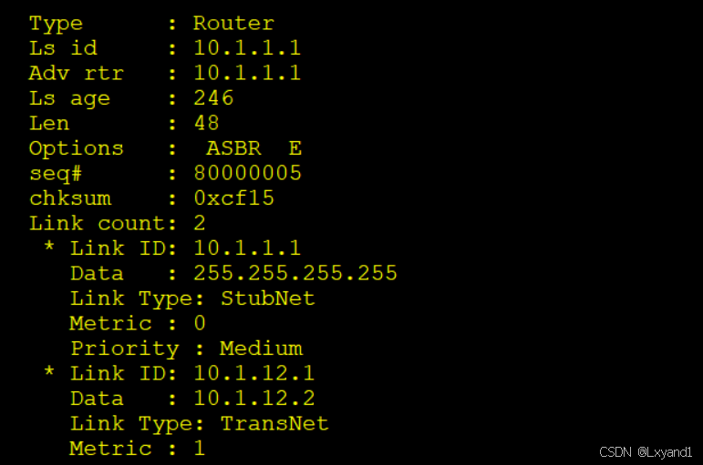

- 通过命令可以看到在区域 1 中只有两个 1 类 LSA，分别由 AR1 和 AR2 产生。作业就是为了描述本区域的拓扑数据库及传递路由信息，只能在所属区域内泛红。在该区域 1 中，AR1 的 loopback0 口在 LSA 中携带了其掩码信息，但是两台路由器互联网段没有包含掩码信息。此时需要在此处查看 2 类 LSA。

【6】对于 2 类 LSA 是由 DR 产生的，通过以下命令查看实际内容。

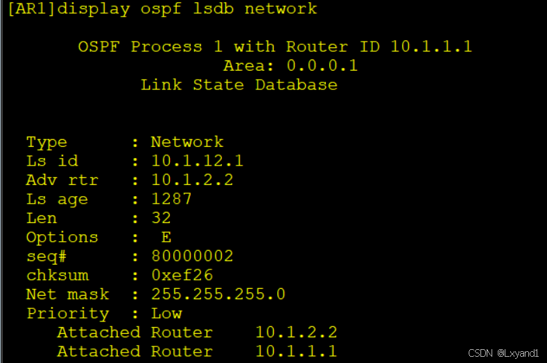

- 通过以上信息得知，2 类 LSA 只能在所属区域泛洪，通告者为 DR，传递的内容为 transit 网络掩码及拓扑信息。
- 实际 1 类和 2 类结合起来就是用来传递区域内的网络拓扑及域内路由信息。

【7】接下来查看 3 类 LSA，在 AR4 上输入以下命令查看 3 类 LSA;

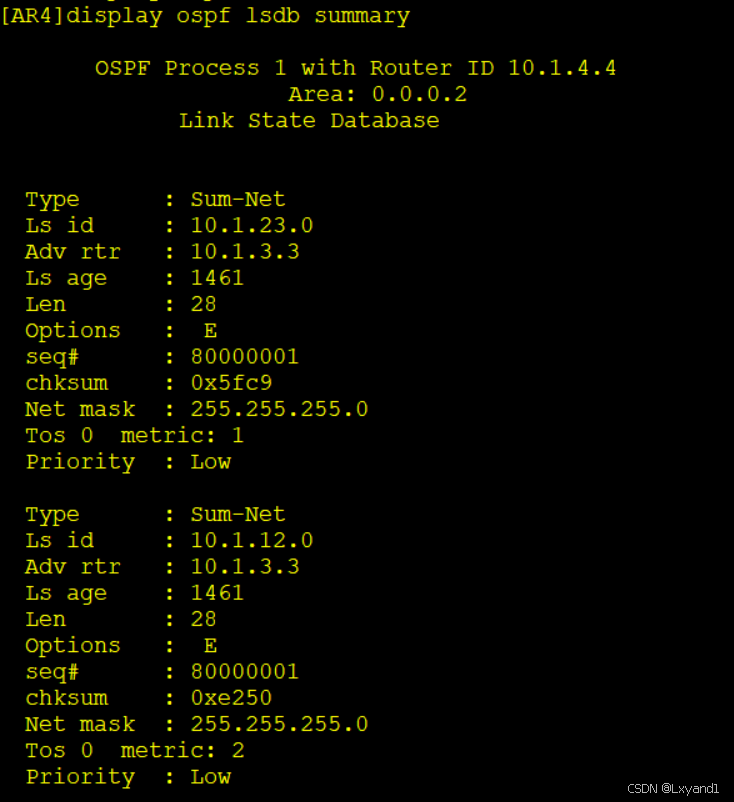

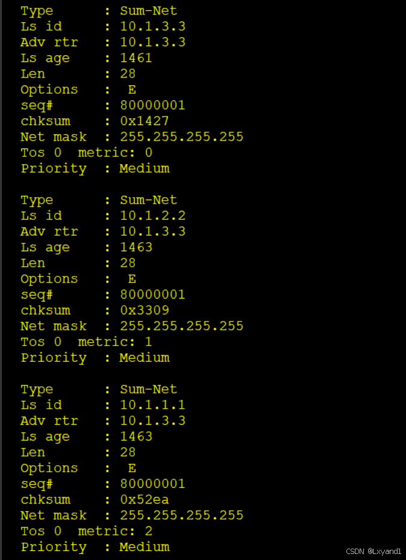

- 在 AR4 上看到大量的 3 类 LSA,3 类 LSA 全部属于区域 2, 表示这些 3 类 LSA 传递范围为区域 2。通过 3 类 LSA 的内容可以得知, 3 类 LSA 就是传递的其他区域的路由信息 (域间路由)，由本区域的 ABR AR3 进行了通告。
- 在 OSPF 区域中引入了外部路由，就会产生 5 类 LSA，同时也会伴随 4 类 LSA 的产生在本实验中区域 1 中的 AR1 上引入了外部路由，此时 AR1 为 ASBR 路由器。

【8】所以在 AR1 上输入以下命令可以查看自身是否产生了 5 类 LSA。

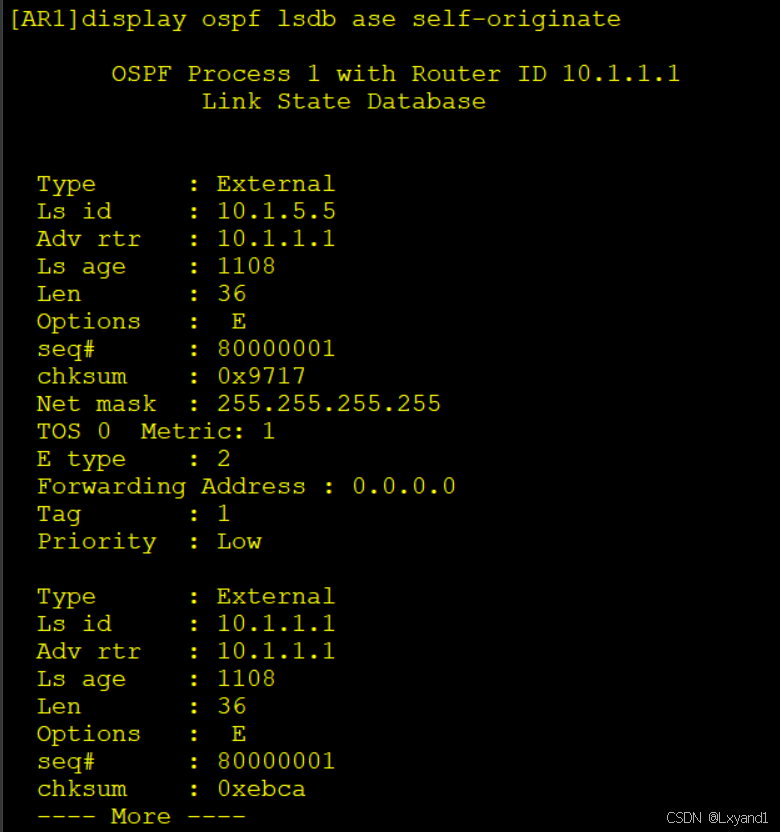

- 从 5 类 LSA 中可以看到, 5 类 LSA 主要用来传递外部路由，并且它不像 1 类、2 类、3 类有区域所属，它不属于任何一个区域，所有 5 类 LSA 的泛洪范围为整个 OSPF 区域，并且在整个 OSPF 区域中进行泛洪时所有信息保持不变，那么此时其他区域就无法知道通告者是谁，无法知道通告者也就无法进行路由计算。(本区域有本区域的完整的数据库，很清楚的知道通告者 1.1.1.1 是谁，但是其他区域，比如区域 0、区域 2 不知道谁是 1.1.1.1，此时就需要使用 4 类 LSA。)

【9】所以在本实验拓扑中在区域 0 或者区域 2 中可以观察看到 4 类 LSA，区域 1 中是没有四类 LSA。

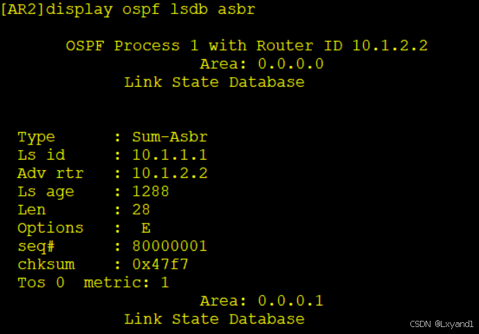

- 此 4 类 LSA 表达的意思为可以通过 AR2 设备, 到达目标设备 ASBR 1.1.1.1, 且开销为此时其他区域有了 4 类 LSA 的指引，就知道了 5 类 LSA 的方向，就可以计算外部路由。接下来将区域 1 配置为 NSSA 区域。(本基本配置省略)

【10】配置完毕后在 AR2 上查看 7 类 LSA 如下：

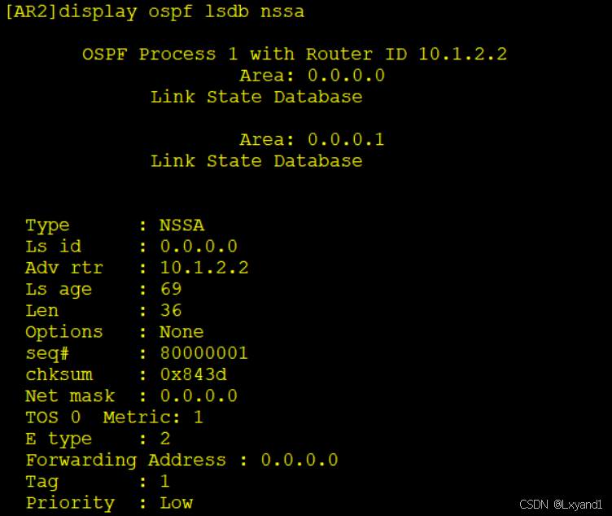

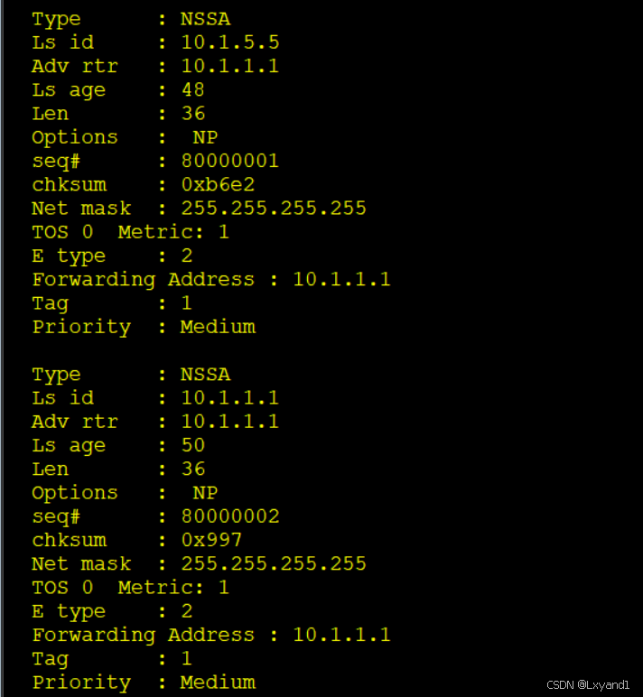

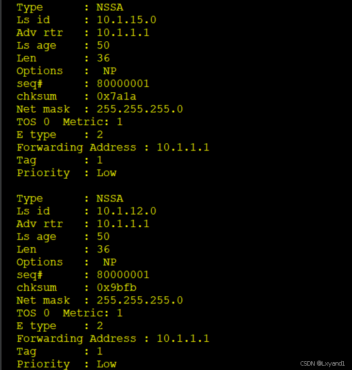

- 其实 7 类 LSA 和 5 类 LSA 基本保持一致，只不过 7 类 LSA 只能在 ASBR 所在区域泛洪当需要泛洪到其他区域的时候，由 ASBR 所在区域的 ABR 进行 7 转 5 的操作。

【11】所以在本实验环境中，在 AR2、AR3、AR4 上看到的会是 5 类 LSA。

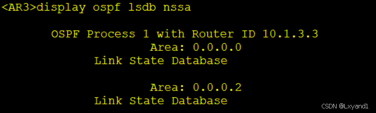

- 在 AR3 上是看不到 nssa 的 LSA 的。

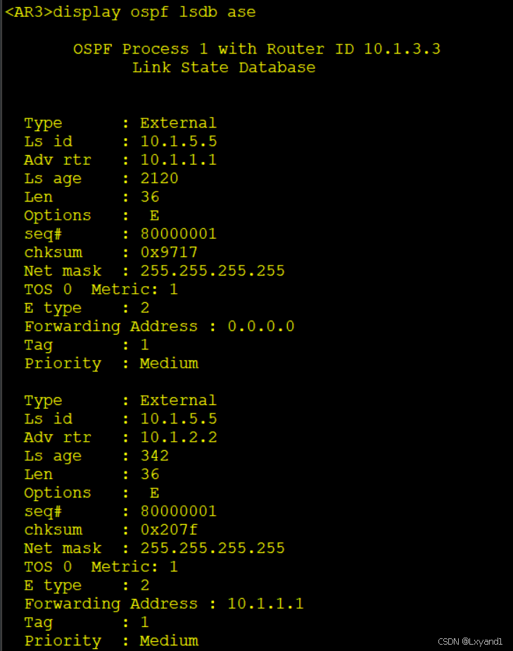

### 4. 配置 OSPF 汇总

#### （1）实验目的

理解并掌握 OSPF 汇总的配置

#### （2）IP 地址规划

- 互联地址采用 10.1.XY.X/24 位，比如 AR1 与 AR2 的互联接口地址分别为 10.1.12.1/24 和 10.1.12.2/24，以此类推。
- 每台设备都有一个测试用的 loopback0 口, 地址为 10.1.X.X/32, 比如 AR1 的 loopback0 口地址为 10.1.1.1/32，以此类推。

#### （3）实验拓扑

#### （4）实验步骤

在实验三的基础之上完成 OSPF 汇总实验。

> 对于 OSPF 的汇总，有两种汇总：
>
> - 在 ABR 上对域间路由进行汇总。
> - 在 ASBR 上对外部路由进行汇总。

【1】在 AR4 上查看 AR2 的环回口路由，显示如下：

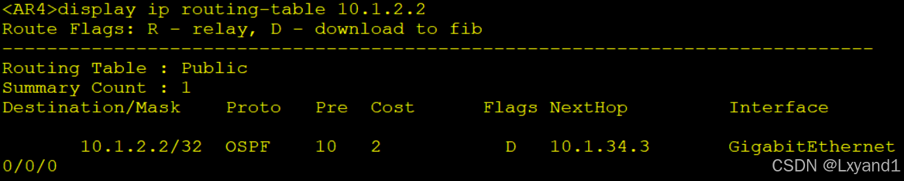

【2】现在需要对 AR4 收到的这条 AR2 的路由进行汇总，此时需要再本区域中的 ABR 设备 AR3 上进行汇总，命令如下：

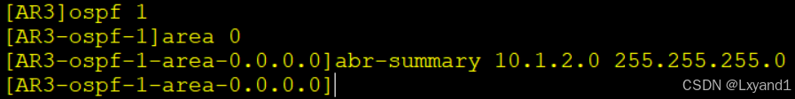

- 继续在 AR4 上查看 AR2 的 Lookback 路由：

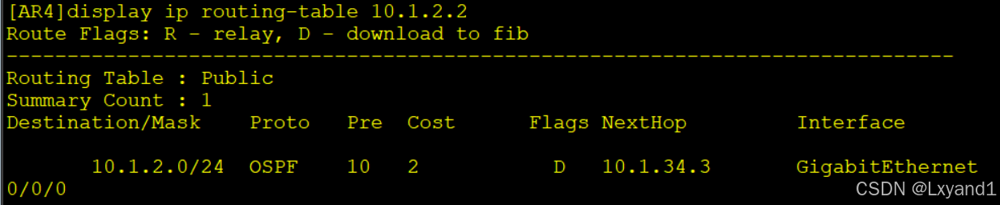

【3】在 AR4 上查看 AR5 的 lookback0 的路由：

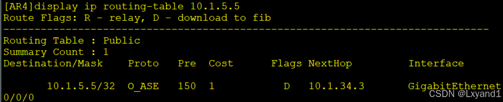

【4】在 AR1 上进行外部路由的汇总，在 AR1 上配置以下命令：

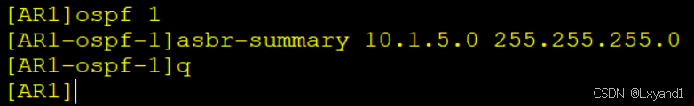

【5】在 AR4 上继续查看 AR5 的 lookaback0 的路由：

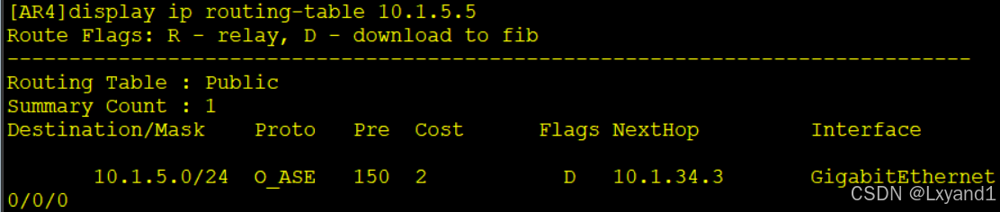

### 5. 配置 OSPF 认证并查看认证报文

#### （1）实验目的

能够熟练的配置 OSPF 认证，并掌握 OSPF 认证报文的封装格式。

#### （2）IP 地址规划

- 互联地址采用 10.1.XY.X/24 位，比如 AR1 与 AR2 的互联接口地址分别为 10.1.12.1/24 和 10.1.12.2/24，以此类推。
- 每台设备都有一个测试用的 loopback0 口, 地址为 10.1.X.X/32, 比如 AR1 的 loopback0 口地址为 10.1.1.1/32，以此类推。

#### （3）实验拓扑

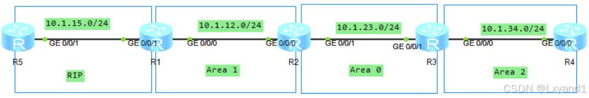

#### （4）实验步骤

> OSPF 认证有以下三种类型：
>
> - 接口认证，直接配置在接口，通过本接口发出的 OSPF 报文都会携带认证信息。
> - 区域认证, 配置在某个区域, 在本设备上属于本区域的接口发出的 OSPF 报文都会携带认证信息。
> - 虚链路认证，在虚链路上配置的认证。本质属于接口认证，在虚链路上配置了认证，在虚链路上发出的 OSPF 报文都会携带认证信息。

【1】首先在 AR1 与 AR2 互联链路上配置接口认证，配置命令如下:

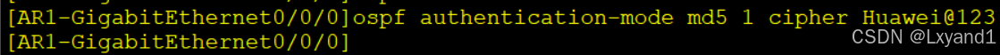

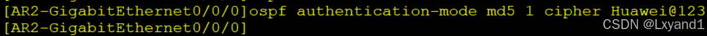

【2】在 AR1 的 G0/0/0 开启抓包，OSPF 认证信息如下：

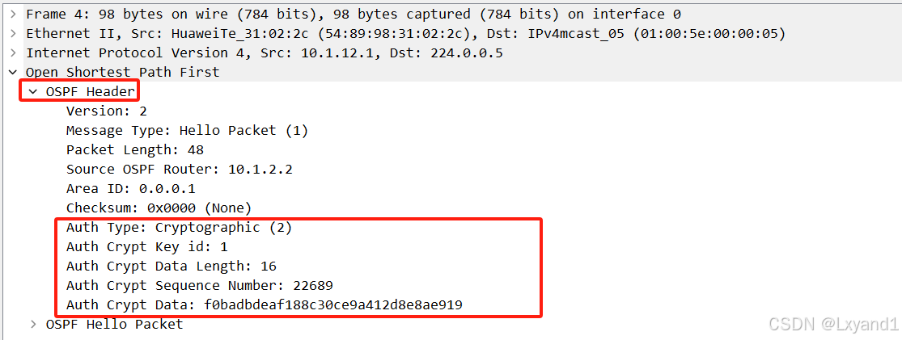

所以 OSPF 的认证信息是封装在 OSPF 报头中, 而不是说封装在 OSPF 的 hello 包、LSR、LSU 等报文。

- Auth Type: 认证类型，此处为 MD5。
- Auth Crypt Key ID: 配置的 ID 号
- Auth Crypt Data Length: 数据长度为 16
- Auth Crypt Data: 经过 HMAC-MD5 哈希得到的字符串

【3】接下来在 Area0 中配置区域认证，要求区域 0 所有设备都必须配置，配置命令如下：

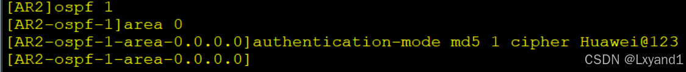

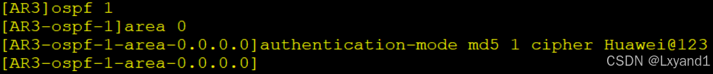

### 6.OSPF IP FRR 实验

#### （1）实验目的

配置并观察 OSPF IP FRR

#### （2）IP 地址规划

- 互联地址采用 10.1.XY.X/24 位，比如 AR1 与 AR2 的互联接口地址分别为 10.1.12.1/24 和 10.1.12.2/24，以此类推。
- 每台设备都有一个测试用的 loopback0 口, 地址为 10.1.X.X/32, 比如 AR1 的 loopback0 口地址为 10.1.1.1/32，以此类推。

#### （3）实验拓扑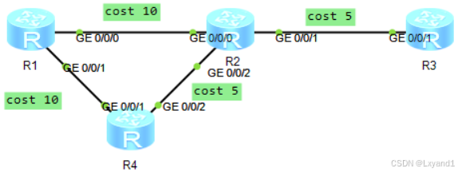

#### （4）实验步骤

- 完成拓扑的底层配置，配置接口的 IP 地址，每台路由器都运行 OSPF，全部宣告到区域 1 中。R3 新建环回口 10.1.3.3 也宣告到区域 1 中, 修改链路上的 OSPF 开销值为上图中的数值。
- 这时候我们如果将 R2 上的 0 口 Down 掉，因为是直连的缘故，所以 R1 很快能将路线从下一跳 R2 切换到下一跳 R4。我们这中间是重新经历了一次 SPF 计算, 在这个拓扑中我们网络规模不大，所以 OSPF 很快就可以完成收敛，没有发生丢包现象，但如果网络规模变大，OSPF 链路状态数据库中存在上万条或者数万条链路状态信息，可能就会导致收敛非常缓慢。

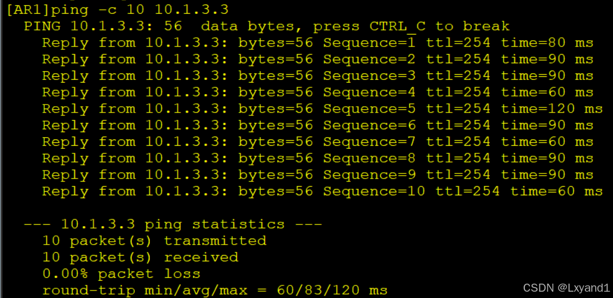

- 所以，在生产中我们可能会运用到一项技术就是 OSPF IP FRR，这项技术的原理是在主链路正常的时候就将备用链路提前计算好，方便如果主链路产生故障的时候在 50 毫秒内切换到备用链路上，保证通信的正常进行，但是配置 FRR 后，被选成备用链路是有条件的，必须要满足链路保护公式：就是图中  **R4 到 R3 的开销 &lt; R4 到 R1+R1 到 R3 的。** 这样可以保证没有环路产生。
- 打开 R2 的 0 口，然后在 R1 上查看 R3 的路由，可以看到是没有备份路由的。

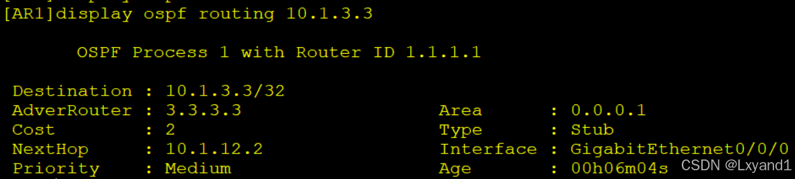

- 这时候我们去使能 FRR，然后开启 LFA 计算

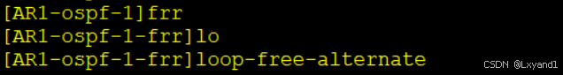

- 然后我们再看去往 R3 的路由

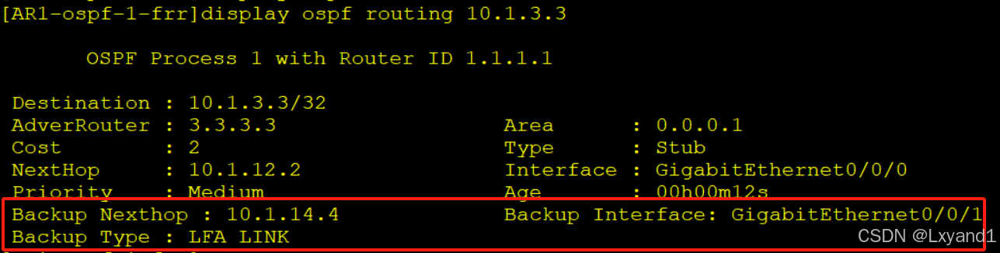

可以看到是有备份链路的，如果主链路发生故障，切换到备份链路会在 50ms 内完成。

至此，本文结束，一共两万四千余字，既然您能看到这里，请留下您的点赞再走呗！有任何问题可私信博主。
