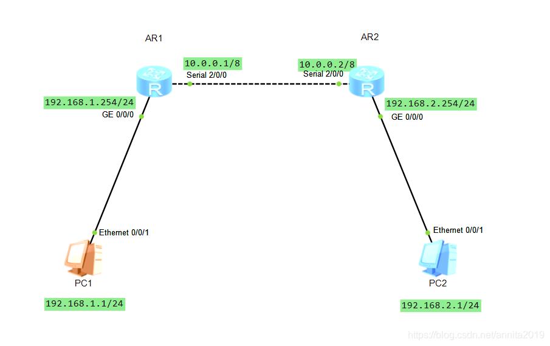

## 一、PPP协议的概述

==PPP(Point-to-Point Protocol)，链路层协议==。PPP是为了在点对点物理链路(例如RS232串口链路、电话ISDN线路等)上传输OSI模型中的网络层报文而设计的，它改进了之前的一个点对点协议-SLIP协议–只能同时运行一个网络协议、无容错控制、无授权等许多缺陷，PPP是现在最流行的点对点链路控制协议。这种连接提供了同时的双向的全双工操作，并且假定数据包是按顺序投递的。PPP连接提供了一种广泛的解决办法，方便地将多种多样不同的值作为最大接收单元的值。

帧格式与HDLC相似，不同的是PPP是面向字符，HDLC是面向位的。PPP属于广域网范畴，MAC是局域网范畴，按实际情况和环境就选用不同的协议，PPP支持的网络结构只能是点对点，MAC支持多点对多点。 这类广域网协议，其帧的结构与以太网的完全不同，当然，PPPOE除外，因为PPPOE是基于以太网上的，而其它的如PPP，FR，X.25等却并不是。 PPP协议是目前广域网上应用最广泛的协议之一，它的优点在于简单、具备用户验证能力、可以解决IP分配等。

## 二、PPP协议实验




### R1

```bash
The device is running!

<Huawei>
<Huawei>sys
Enter system view, return user view with Ctrl+Z.
[Huawei]
[Huawei]sys R1
[R1]int g0/0/0
[R1-GigabitEthernet0/0/0]ip address 192.168.1.254 24

[R1-GigabitEthernet0/0/0]int s2/0/0
[R1-Serial2/0/0]ip address 10.0.0.1 8
[R1-Serial2/0/0]q

[R1]aaa         #启用aaa配置管理
[R1-aaa]local-user pokes password cipher 123456       #在数据库中创建1个以pokes为用户名，密码为ppp的本地账户
[R1-aaa]local-user pokes service-type ppp            
[R1-aaa]q

[R1]int s2/0/0
[R1-Serial2/0/0]ppp authentication-mode pap       #在主认证端上指明ppp的认证方式pap
[R1-Serial2/0/0]q
[R1]ip route-static 0.0.0.0 0.0.0.0 10.0.0.2
[R1]
```

### R2

```bash
The device is running!

<Huawei>sys
Enter system view, return user view with Ctrl+Z.
[Huawei]sys R2

[R2]int g0/0/0
[R2-GigabitEthernet0/0/0]ip add 192.168.2.254 24
[R2-GigabitEthernet0/0/0]
[R2-GigabitEthernet0/0/0]int s2/0/0
[R2-Serial2/0/0]ip add 10.0.0.2 8
[R2-Serial2/0/0]
[R2-Serial2/0/0]ppp pap local-user pokes password cipher 123456    #使用pap认证方式，用户名为pokes,密码为123456（与主认证端一致）
[R2-Serial2/0/0]q
[R2]ip route-static 0.0.0.0 0.0.0.0 10.0.0.1
[R2]
```
查看ppp链路状态

```bash
[R2]display interface s2/0/0
Serial2/0/0 current state : UP
Line protocol current state : UP
Last line protocol up time : 2020-10-21 12:25:12 UTC-08:00
Description:HUAWEI, AR Series, Serial2/0/0 Interface
Route Port,The Maximum Transmit Unit is 1500, Hold timer is 10(sec)
Internet Address is 10.0.0.2/8
Link layer protocol is PPP
LCP opened, IPCP opened    #这里LCP子层和IPCP子层都open，ppp链路正常建立了
Last physical up time   : 2020-10-21 12:13:33 UTC-08:00
Last physical down time : 2020-10-21 12:13:27 UTC-08:00
Current system time: 2020-10-21 12:46:19-08:00
Physical layer is synchronous, Virtualbaudrate is 64000 bps
Interface is DTE, Cable type is V11, Clock mode is TC
Last 300 seconds input rate 6 bytes/sec 48 bits/sec 0 packets/sec
Last 300 seconds output rate 2 bytes/sec 16 bits/sec 0 packets/sec

Input: 427 packets, 13992 bytes
  Broadcast:              0,  Multicast:              0
  Errors:                 0,  Runts:                  0
  Giants:                 0,  CRC:                    0

  Alignments:             0,  Overruns:               0
  Dribbles:               0,  Aborts:                 0
  No Buffers:             0,  Frame Error:            0
  ---- More ----
```

查看端口

```bash
[R2]display ip interface brief
*down: administratively down
^down: standby
(l): loopback
(s): spoofing
The number of interface that is UP in Physical is 3
The number of interface that is DOWN in Physical is 2
The number of interface that is UP in Protocol is 3
The number of interface that is DOWN in Protocol is 2

Interface                         IP Address/Mask      Physical   Protocol  
GigabitEthernet0/0/0              192.168.2.254/24     up         up        
GigabitEthernet0/0/1              unassigned           down       down      
NULL0                             unassigned           up         up(s)     
Serial2/0/0                       10.0.0.2/8           up         up      #被认证端的接口自动获取到了ip地址   
Serial2/0/1                       unassigned           down       down  
```

### 验证结果
PC1 ping PC2

```bash
Welcome to use PC Simulator!

PC>ping 192.168.2.1

Ping 192.168.2.1: 32 data bytes, Press Ctrl_C to break
Request timeout!
From 192.168.2.1: bytes=32 seq=2 ttl=126 time=15 ms
From 192.168.2.1: bytes=32 seq=3 ttl=126 time=32 ms
From 192.168.2.1: bytes=32 seq=4 ttl=126 time=15 ms
From 192.168.2.1: bytes=32 seq=5 ttl=126 time=31 ms

--- 192.168.2.1 ping statistics ---
  5 packet(s) transmitted
  4 packet(s) received
  20.00% packet loss
  round-trip min/avg/max = 0/23/32 ms

PC>
```


@[TOC](PPPOE配置模拟实验及NAT配置)

## 三、PPP和PPPoE关系

首先说明一个事情：ppp和pppoe是什么关系？？？
PPP 是底层点对点协议；PPPoE = PPP over Ethernet，就是【把 PPP 报文封装在以太网帧里面传输】。

### 1.为什么需要 PPPoE？

PPP 自带强大能力：
账号认证（PAP/CHAP）、动态分配 IP、计费、链路控制。
但是 PPP**天生不支持以太网这种广播网络**。
运营商小区、家庭宽带都是以太网布线，想要用上 PPP 的认证计费功能 → 诞生 PPPoE。


### 2. 层级视角

1. 原始场景：`IP报文 → PPP → 串行链路（Modem/E1串口）`
2. 宽带 PPPoE 场景：`IP报文 → PPP → PPPoE头部 → 以太网帧 → 光纤/网线`

> 
> PPPoE 相当于一个 “载体”，负责把 PPP 包装进以太网帧。

### 3. 为什么需要 PPPoE？

PPP 自带强大能力：
账号认证（PAP/CHAP）、动态分配 IP、计费、链路控制。
但是 PPP**天生不支持以太网这种广播网络**。
运营商小区、家庭宽带都是以太网布线，想要用上 PPP 的认证计费功能 → 诞生 PPPoE。

### 4. 两者包含关系

✅ PPPoE **承载 PPP**
PPPoE 会话建立之后，内部传输的净载荷就是完整 PPP 报文（LCP、认证、IPCP 协商全都不变）。
PPP 所有协商流程（LCP→认证→IPCP）原样保留，只是外面套一层以太网封装。

### 5. 考试简答背诵版

PPPoE（PPP over Ethernet）是在以太网之上承载 PPP 报文的二层封装技术。
PPP 是点对点协议，原生工作在点到点链路；以太网是广播网络，无法直接运行 PPP。
PPPoE 在以太网环境中提供 PPP 的全部能力（认证、地址协商、计费），家庭宽带拨号就是典型应用。

