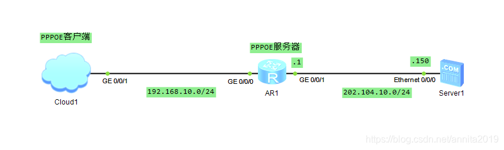
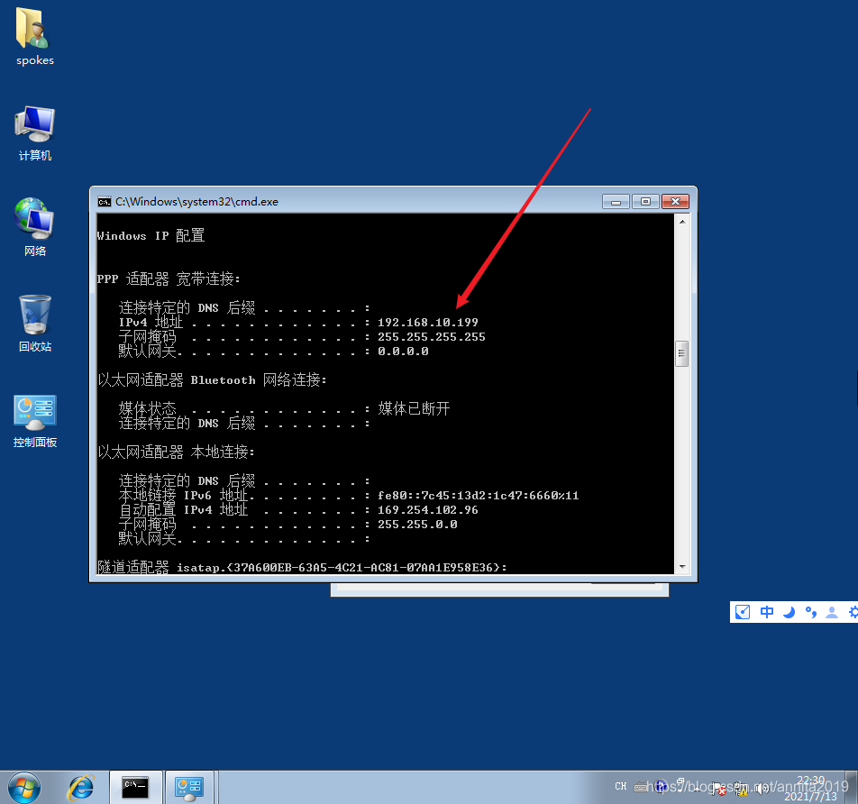
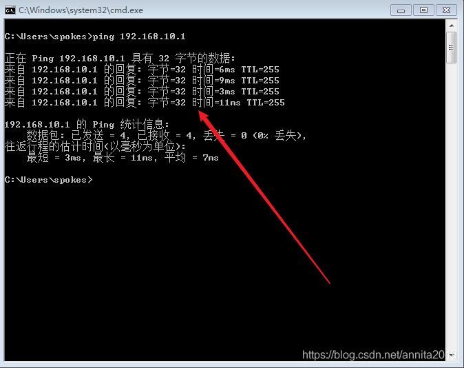

- 华为路由器：PPPoE实验(本篇)
- [PPPOE模拟实验2：PPPOE模拟内外网实验及NAT配置](./21、PPPoE模拟拨号实验.assets/PPPOE模拟实验2：PPPOE模拟内外网实验及NAT配置.md)


## 华为路由器：PPPoE实验


PPPoE协议是基于C/S架构的一种网络拨号协议。分为客户端和服务器两部分，它的建立过程分为discovery和session两个阶段。本次实验的目标：掌握PPPoE拨号技术；

实验拓扑：




本实验结合虚拟机进行：

首先，必须在虚拟机的网络配置中加以设置，我新建了VM6，去掉了DHCP的钩。这个时候会在你的网卡界面多出来一个虚拟的VM6的网卡。但是当你打开ensp时，会出现检测不到VM6的情况，这个时候你==重启一下电脑==，就可以了。


Cloud1的设置如下图：


##  1、基本的IP配置 

```bash
[pppoe-server]dis ip in b
*down: administratively down
^down: standby
(l): loopback
(s): spoofing
The number of interface that is UP in Physical is 4
The number of interface that is DOWN in Physical is 1
The number of interface that is UP in Protocol is 2
The number of interface that is DOWN in Protocol is 3

Interface                         IP Address/Mask      Physical   Protocol  
GigabitEthernet0/0/0              unassigned           up         down      
GigabitEthernet0/0/1              202.104.10.1/24      up         up        
GigabitEthernet0/0/2              unassigned           down       down      
NULL0                             unassigned           up         up(s)     
Virtual-Template1                 192.168.10.1/24      up         down      
[pppoe-server]
```

##  2、配置虚拟模板 

配置虚拟模板用来承载多种同层协议

```bash
[pppoe-server]int Virtual-Template 1                            #创建虚拟模板，编号为1
[pppoe-server-Virtual-Template1]ppp authentication-mode chap    #PPP认证为chap
[pppoe-server-Virtual-Template1]remote address pool pokes       #指定使用地址池名为pokes
[pppoe-server-Virtual-Template1]ip add 192.168.10.1 24          #配置作为用户上网的网关IP
[pppoe-server-Virtual-Template1]q
```

## 3、创建地址池

```bash
[pppoe-server]ip pool pokes                                            #创建地址池pokes
Info: It's successful to create an IP address pool.
[pppoe-server-ip-pool-pokes]gateway-list 192.168.10.1                  #配置网关地址
[pppoe-server-ip-pool-pokes]network 192.168.10.0 mask 255.255.255.0    #配置给用户分配的ip网段
[pppoe-server-ip-pool-pokes]
[pppoe-server-ip-pool-pokes]excluded-ip-address 192.168.10.200 192.168.10.254    #排除地址
[pppoe-server-ip-pool-pokes]lease day 8 hour 0 minute 0     #租约配置8小时
[pppoe-server-ip-pool-pokes]dns-list 114.114.114.114        #DNS
[pppoe-server-ip-pool-pokes]dis th
[V200R003C00]
#
ip pool pokes
 gateway-list 192.168.10.1 
 network 192.168.10.0 mask 255.255.255.0 
 excluded-ip-address 192.168.10.200 192.168.10.254 
 lease day 8 hour 0 minute 0 
 dns-list 114.114.114.114
#
return
[pppoe-server-ip-pool-pokes]
```

## 4、创建PPPoE用户

```bash
[pppoe-server]aaa
[pppoe-server-aaa]local-user user1 password cipher 123456
Info: Add a new user.
[pppoe-server-aaa]local-user user1 service-type ppp
[pppoe-server-aaa]dis th
[V200R003C00]
#
aaa 
 authentication-scheme default
 authorization-scheme default
 accounting-scheme default
 domain default 
 domain default_admin 
 local-user admin password cipher %$%$K8m.Nt84DZ}e#<0`8bmE3Uw}%$%$
 local-user admin service-type http
 local-user user1 password cipher %$%$aLq+.xS\rBJXJ}V|dJw'eZry%$%$
 local-user user1 service-type ppp
#
return
[pppoe-server-aaa]

```

## 5、绑定接口

将虚拟模板接口与物理接口绑定提供服务

```bash
[pppoe-server]int g0/0/0
[pppoe-server-GigabitEthernet0/0/0]pppoe-server bind virtual-template 1  #将虚拟模板1绑定在物理接口上
```

至此，服务器端的配置基本完成，如果想对PPPoE的访问流量进行控制，还可以配置ACL。







虽然已经拨号成功，也能ping通网关192.168.10.1，但是因为没有nat所以无法ping通202.104.10.150的服务器

## 6、NAT配置

```bash
[pppoe-server]acl number 2000
[pppoe-server-acl-basic-2000]rule permit source 192.168.10.0 0.0.0.255
[pppoe-server-acl-basic-2000]int g0/0/1
[pppoe-server-GigabitEthernet0/0/1]nat outbound 2000
[pppoe-server-GigabitEthernet0/0/1]q
```

说明：这里ACL的含义就是允许哪些网段可以上网，这里为192.168.10.0/24这个网段，然后调用在拨号接口下。

现在就可以ping通服务器了

