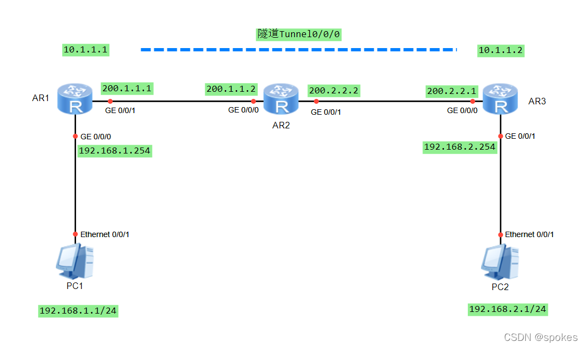
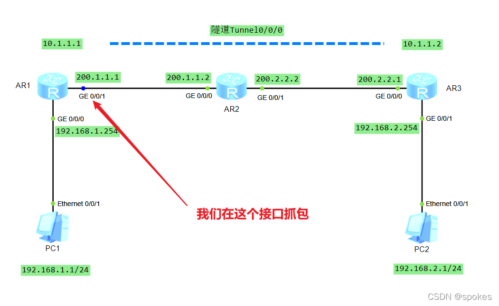
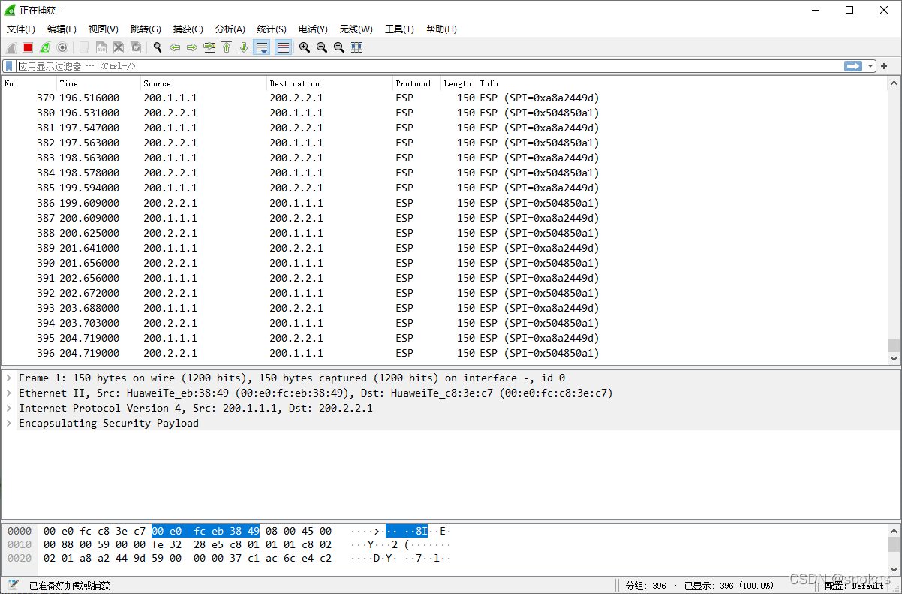

# VPN技术1-IPsec加密GRE隧道

## 一、两种模式介绍

由于GRE隧道不提供安全性保障，使用ipsec加密gre隧道是现网中比较常用的VPN部署，它的加密方式分为两种：

- IPsec over GRE（先隧道，后加密）
- GRE over IPsec（先加密，后隧道）

### **两种模式的核心区别**

|         特性         |         **IPsec over GRE**         |           **GRE over IPsec**           |
| :------------------: | :--------------------------------: | :------------------------------------: |
|     **封装顺序**     |     先 GRE 封装，后 IPsec 加密     |       先 IPsec 加密，后 GRE 封装       |
|     **加密对象**     |     加密的是 **GRE 报文整体**      |      加密的是 **原始业务数据流**       |
|     **隧道角色**     | GRE 作为外层隧道，IPsec 仅负责加密 |   IPsec 作为加密层，GRE 作为外层隧道   |
| **对路由协议的支持** |   支持（GRE 可承载多协议、组播）   |   不支持（IPsec 通常只承载单播 IP）    |
|     **适用场景**     |    跨公网传输路由协议、组播流量    | 普通单播业务的加密传输，追求更高安全性 |

## 二、详细原理与传输流程

#### 1.  IPsec over GRE（先隧道，后加密）

**核心逻辑**：先把多协议的业务数据封装成 GRE 报文，再对整个 GRE 报文做 IPsec 加密。

- **传输流程**
  1. 内网主机发送业务数据包（可以是 IP、IPX、组播等多种协议）。
  2. 网关对数据包进行 **GRE 封装**：添加 GRE 头 + 公网 IP 头，形成 GRE 报文。
  3. 网关对 **整个 GRE 报文** 进行 IPsec 加密（ESP/AH 协议），生成 IPsec 加密报文。
  4. 加密后的报文通过公网传输到对端网关。
  5. 对端网关先做 IPsec 解密，再解 GRE 封装，还原原始业务数据。
  
- **核心优势**

  - GRE 可以承载 **多协议流量**（如 IPX、AppleTalk）和 **组播 / 广播流量**，适合需要传输路由协议（OSPF、EIGRP）的场景。
  - 公网中只看到加密后的 IPsec 报文，隐藏了 GRE 隧道的存在。

- **局限性**

  - 加密的是 GRE 报文整体，**包头开销更大**（GRE 头 + IPsec 头 + 公网 IP 头）。
  - 安全性略低于 GRE over IPsec（因为 GRE 头本身未加密，但影响很小）。

#### 2.  GRE over IPsec（先加密，后隧道）

**核心逻辑**：先对原始 IP 业务数据做 IPsec 加密，再把加密后的 IPsec 报文封装到 GRE 隧道中传输。

- **传输流程**

  1. 内网主机发送单播 IP 业务数据包。
  2. 网关对数据包进行 **IPsec 加密**：添加 ESP/AH 头，生成加密的 IPsec 报文。
  3. 网关对 **IPsec 加密报文** 进行 GRE 封装：添加 GRE 头 + 公网 IP 头。
  4. 封装后的报文通过公网传输到对端网关。
  5. 对端网关先解 GRE 封装，再做 IPsec 解密，还原原始业务数据。

- **核心优势**

  - 先加密再封装，**业务数据的安全性更高**（原始数据直接加密，无暴露风险）。
  - 适用于只传输单播 IP 流量的场景，包头开销相对可控。

- **局限性**

  - GRE 隧道承载的是 IPsec 加密后的单播报文，**不支持组播 / 多协议流量**。
  - 公网中可以看到 GRE 隧道的公网 IP 头，隧道存在性相对明显。


## 三、现网部署的选择建议

1. **选 IPsec over GRE**：当需要跨公网部署动态路由协议（如 OSPF 组播 hello 包）、传输组播视频流或多协议流量时，这是唯一选择。
2. **选 GRE over IPsec**：当仅传输普通单播 IP 业务（如办公内网访问、文件传输），且对安全性要求更高时，优先选择这种方式。
3. **简化替代方案**：如果不需要承载多协议 / 组播流量，**纯 IPsec VPN**（无需 GRE）是更轻量的选择，可减少 GRE 头的开销。

## 四、关键注意事项

- **MTU 与分片问题**：两种方式都存在多层封装，容易导致报文超过公网 MTU（通常 1500），建议在网关配置 **TCP MSS 调整** 或 **DF 位清除**，避免分片丢包。
- **IPsec 安全协议**：优先使用 **ESP 协议**（同时加密 + 认证），AH 协议仅做认证，安全性不足，现网很少使用。
- **隧道端点配置**：两种方式的 IPsec 策略和 GRE 隧道的端点 IP 必须一一对应，否则会出现协商失败或报文无法解密的问题。

## 五、实验部分

下面将配置一个简单的IPsec over GRE实验。



### 1、搭建模拟环境

首先我们先搭建环境，先根据拓扑图把基本的IP地址配好，然后分别在AR1、AR3加两条静态路由，使得两个公网互通。

```bash
[AR1]in g0/0/0
[AR1-GigabitEthernet0/0/0]ip add 192.168.1.254 24 
[AR1-GigabitEthernet0/0/0]q
[AR1]in g0/0/1
[AR1-GigabitEthernet0/0/1]ip add 200.1.1.1 24
[AR1-GigabitEthernet0/0/1]q
[AR1]ip route-static 200.2.2.0 24 200.1.1.2


[AR2]in g0/0/0
[AR2-GigabitEthernet0/0/0]ip add 200.1.1.2 24
[AR2-GigabitEthernet0/0/0]q
[AR2]in g0/0/1
[AR2-GigabitEthernet0/0/1]ip add 200.2.2.2 24
[AR2-GigabitEthernet0/0/1]q


[AR3]in g0/0/0
[AR3-GigabitEthernet0/0/0]ip add 200.2.2.1 24
[AR3-GigabitEthernet0/0/0]q
[AR3]in g0/0/1
[AR3-GigabitEthernet0/0/1]ip add 192.168.2.254 24
[AR3-GigabitEthernet0/0/1]q
[AR3]ip route-static 200.1.1.0 24 200.2.2.2

验证结果：

[AR1]ping -a 200.1.1.1 200.2.2.1
  PING 200.2.2.1: 56  data bytes, press CTRL_C to break
    Reply from 200.2.2.1: bytes=56 Sequence=1 ttl=254 time=60 ms
    Reply from 200.2.2.1: bytes=56 Sequence=2 ttl=254 time=20 ms
    Reply from 200.2.2.1: bytes=56 Sequence=3 ttl=254 time=40 ms
    Reply from 200.2.2.1: bytes=56 Sequence=4 ttl=254 time=10 ms
    Reply from 200.2.2.1: bytes=56 Sequence=5 ttl=254 time=30 ms

  --- 200.2.2.1 ping statistics ---
    5 packet(s) transmitted
    5 packet(s) received
    0.00% packet loss
    round-trip min/avg/max = 10/32/60 ms
```

### 2、GRE的配置

> 注意：description，这个是描述，不是目标地址，这里自动补全会坑人

```bash
AR1

interface Tunnel0/0/0   #新建隧道
 description zongbu     #这个是描述，不是目标地址，需要注意
 ip address 10.1.1.1 255.255.255.0   #给隧道配置地址
 tunnel-protocol gre    #隧道协议
 source 200.1.1.1       #源地址，注意这里是公网地址
 destination 200.2.2.1  #目标地址，注意这里是公网地址

AR3
 
interface Tunnel0/0/0
 description fengongsi
 ip address 10.1.1.2 255.255.255.0 
 tunnel-protocol gre
 source 200.2.2.1
 destination 200.1.1.1


两边各加1条静态路由

[AR1]ip route-static 192.168.2.0 24 Tunnel 0/0/0   #这里我们用隧道接口，也可以用隧道IP
[AR1]ip route-static 192.168.2.0 24 ?              #这里除了加接口还可以直接IP
  IP_ADDR<X.X.X.X>  Gateway address
  GigabitEthernet   GigabitEthernet interface
  NULL              NULL interface
  Tunnel            Tunnel interface
  vpn-instance      Destination VPN-Instance for Gateway address


[AR3]ip route-static 192.168.1.0 24 Tunnel 0/0/0


验证一下：PC1 > PC2

PC>ping 192.168.2.1

Ping 192.168.2.1: 32 data bytes, Press Ctrl_C to break
From 192.168.2.1: bytes=32 seq=1 ttl=126 time=31 ms
From 192.168.2.1: bytes=32 seq=2 ttl=126 time=16 ms
From 192.168.2.1: bytes=32 seq=3 ttl=126 time=31 ms
From 192.168.2.1: bytes=32 seq=4 ttl=126 time=15 ms
From 192.168.2.1: bytes=32 seq=5 ttl=126 time=16 ms

--- 192.168.2.1 ping statistics ---
  5 packet(s) transmitted
  5 packet(s) received
  0.00% packet loss
  round-trip min/avg/max = 15/21/31 ms
```

### 3、配置IPSec加密
```bash
#创建IKE提议
ike proposal 1   
 encryption-algorithm 3des-cbc  #指定加密算法
 authentication-algorithm md5   #认证算法

#配置IKE对等体 
ike peer 1 v2   
 pre-shared-key simple 123456   #共享密钥
 ike-proposal 1
 
#配置IPSec提议
ipsec proposal 1  
 esp encryption-algorithm 3des   #esp的加密算法
 
#配置IPSec文件,其实也就是调用上面的IKE提议和IPSec提议
ipsec profile gre    
 ike-peer 1
 proposal 1
 
 
interface Tunnel0/0/0
 ipsec profile gre

 
interface Tunnel0/0/0
 description zongbu
 ip address 10.1.1.1 255.255.255.0 
 tunnel-protocol gre
 source 200.1.1.1
 destination 200.2.2.1
 ipsec profile gre

####以上配置AR1、AR3完全一样
```


### 4、加密验证

我们选择下图中AR1的g0/0/1接口抓包




然后用PC1去pingPC2的抓包效果



