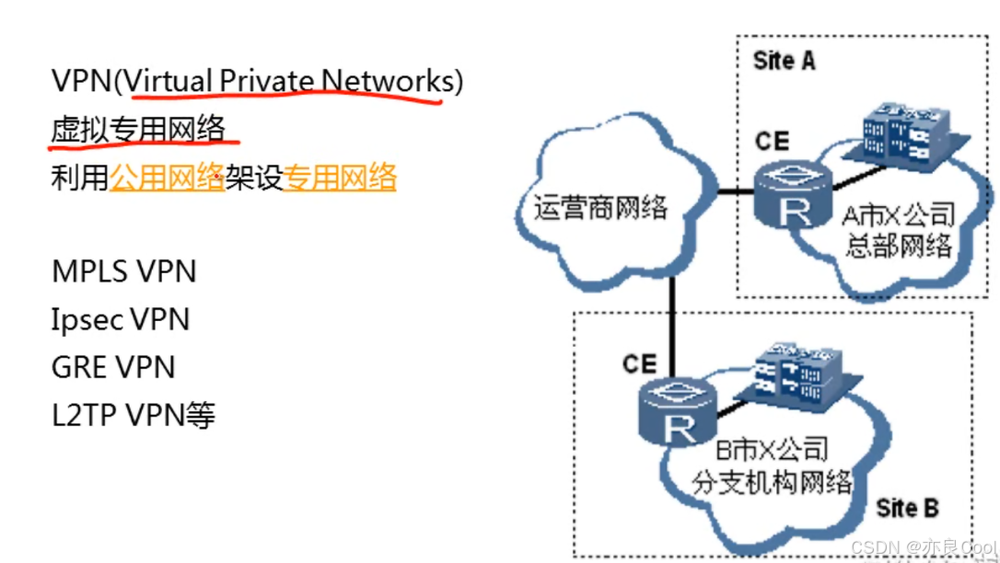
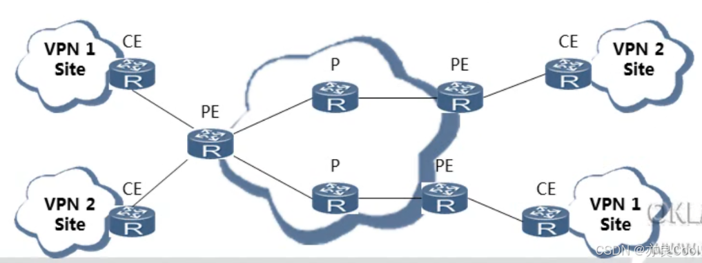
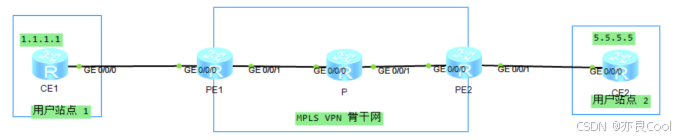

# 前言
首先,MPLS VPN技术是属于VPN(Virtual Private Network，虚拟专用网络)技术领域的一种。而相较于传统的VPN技术，MPLS VPN把MPLS与VPN结合在一起，将多个远程站点连接在一起，形成一个安全、可靠、高效的通信网络。MPLS VPN 技术使得企业可以使用公用互联网作为传输网络，而在互联网上建立一条私密的、模拟的、安全的 VPN 通道，从而实现远程站点之间的加密通信和数据传输。

MPLS VPN使用BGP在服务提供商骨干网上发布VPN路由，使用MPLS在服务提供商骨干网上转发VPN报文
使用基于MPLS的IP网络作为骨干网的VPN（MPLSVPN）成为在IP网络运营商提供增值业务的重要手段。

# MPLS VPN介绍

## VPN基本介绍

# MPLS VPN的网络架构
MPLS VPN的网络架构由以下三个部分组成


* CE（CustomerEdge）：用户网络边缘设备
* PE（ProviderEdge）：服务提供商网络的边缘设备
* P（Provider）：服务提供商网络中的骨干设备


Site：指相互之间具备IP连通性的一组IP系统，且该系统IP连通性不需通过ISP实现

## MPLS VPN特点
* 隧道承建：客户设备透明运营商设备维护
* 路由维护：客户设备维护\运营商设备维护
* VPN数据封装：MPLS标签报头

## MPLS VPN遇到的问题

* 如何做到同一台PE设备的不同客户CE设备之间的隔离？
* 如何PE设备与CE设备之间维护路由信息？
* 如何在公网上传递客户私有路由？
* 如何容许通告重叠的客户私有路由？
* 如何在公网上转发客户数据？

## VRF
**PE本地如何区分本地不同VPN客户的相同私网路由？**
即不同CE,可能存在相同的地址空间，就会导致PE的路由表冲突。
解决方法：建立多个独立的==VRF==路由表，各个站点的路由表信息隔离，不会互相影响。

VRF：负责PE的VPN用户管理。不同公司的多个站点，难免会出现地址冲突等情况，于是为了区分这些服务，我们用对应的设备上创建VRF,可以理解为在同一台设备上创建了多个虚拟设备，同属于一个VRF的数据使用相同的服务。

>VPN实例，把一个物理设备虚拟成很多逻辑设备，逻辑设备之间==相互隔离==，用来让LER下方连接的私网之间进行==隔离虚拟路由转发表==


>==每一个VRF：拥有专属于该VRF的路由表，拥有专属于该VRF的接口，拥有专属于该VRF的IP。==

特点：
- 不同实例之间不能互通！！！
- 多个接口可以学习到同一个MAC（处于不同的VLAN_广播域）；
- 一个接口可以学到多个MAC！！！
## RT（route-target）

**远端PE如何知道路由属于哪一个VPN客户端？**
PE1将路由发送到PE2，PE2如何决定传给那个CE？

解决方法：通过RT属性
>RT（路由标记，route-target，扩展团体属性），可以携带多个和接收多个不同的RT。拥有灵活的组网方式。
>源端PE发送路由携带RT属性，接收端PE可以根据RT执行接收。

PE收到1个数据包只看目标IP，无法判断该把数据包交给哪个CE？通过mpls标签确定从那个口发出，PE会给不同VPN实例的报文，打上不同的标签，标签可以指导正确转发。

>RT称为VPN的Target、BGP扩展团体属性、==控制VPN路由信息的加载==、每个VPN实例关联一个或多个VPN Targer 属性
>接受的RT叫 IRT，发送的RT叫 ERT

## 远端PE如何区分不同VPN客户端的相同私网路由？
RD（路由区分器，route distinguishers），64bit的RD + 32bit的IPv4地址就是96bit的VPNv4。
建议一个VPN客户的所有站点配置相同RD。

```bash
route-distinguisher 1:1
```

# MPLS VPN包含的技术
- MP-BGP：负责在PE与PE之间传递站点内的路由信息。普通的BGP无法承担VPN-IPV4的路由，因此我们需要使用该技术来支持VPN-IPV4路由
- MPLS LDP：负责PE与PE之间的隧道建立。
- VRF：负责PE的VPN用户管理。不同公司的多个站点，难免会出现地址冲突等情况，于是为了区分这些服务，我们用对应的设备上创建VRF,可以理解为在同一台设备上创建了多个虚拟设备，同属于一个VRF的数据使用相同的服务。


# MPLS VPN实现流程
## 路由转发流程

 1. PE收到CE传来的IPV4路由；
 2. PE设备针对不同的VRF,加上不同的RD值及RT属性，形成VPN-IPV4路由，并由MP-BGP 为其  分发内层标签（私网标签），用于区分数据所属的VPN；
 3. PE之间建立了MP-BGP,形成了IBGP对等体，发送VPN-IPV4L路由给远端的BPG对等体,并由MPLS LDP 为VPNV4路由分发公网标签（外部标签）；
 4. PE--P--PE通过公网标签转发路由；
 5. 对方的PE收到从远端传来的VPNV4路由，需要执行私网路由交叉和隧道迭代来选择 路由。          检查其RT属性是否有交集，满足条件后则注入对应的VRF当中，剥离RD值， 形成IPV4路由；
 6. 最后将该路由告知另一站点的CE

## 报文转发流程
 

 1. 以上图为例，CE1要与CE2通信，发送了目的ip为5.5.5.5，源ip为1.1.1.1的ipv4报文给PE1设备；
 2. PE设备根据绑定的VPN实例的RD查找对应VPN的转发表，然后根据Tunnel-ID找到 隧道，并打上对应的内层标签（I-L）；
 3. 将报文从隧道发送出去，即打上公网（外层）MPLS标签头（O-L1）；
 4. PE2设备收到该携带两层标签的报文，交给MPLS处理，MPLS协议将去掉外层标签；
 5. PE2设备继续处理内层标签：将内层标签剥离后，以纯IPv4报文的形式发送给CE1；
 6. CE2收到该IPv4报文后，进行常规的IPv4报文处理流程。