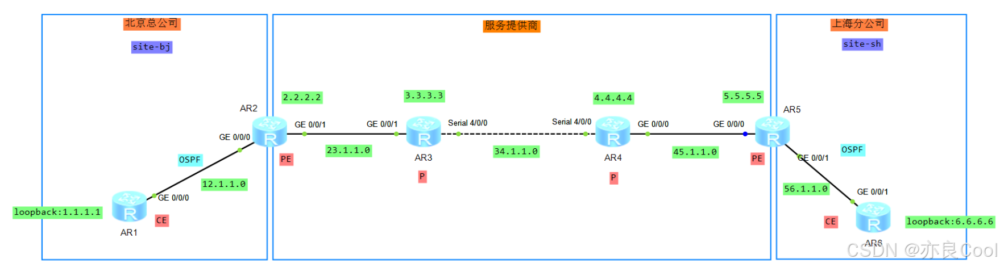

# 一、实验环境

## 实验环境

1、公司XX，北京总公司和上海分公司
2、要实现通过MPLS VPN将总公司和分公司连接起来
3、AR2、AR5为服务商的PE设备，AR1、AR6为公司CE设备
4、ISP内部IGP为osPf，EGP为BGP
5、CE与PE设备如图所示

## 实验要求
使用MPLS VPN实现AR1上的`loopback0:1.1.1.1`能和AR6上的`loopback0:6.6.6.6`互访

## 实验拓扑

# 二、服务商部分
## 配置服务商OSPF部分

- 配置各个接口的地址和loopback接口，注意：各个网段从左往右分别是1、2
- 配置服务商部分，AR2——AR5之间底层使用OSPF协议，OSPF进程选择1，宣告网段（此步骤配置忽略）
- 注意：==12.1.1.0和56.1.1.0不需要宣告==

配置完成后达到的效果
```bash
[ar2]ping -a 2.2.2.2 5.5.5.5
  PING 5.5.5.5: 56  data bytes, press CTRL_C to break
    Reply from 5.5.5.5: bytes=56 Sequence=1 ttl=253 time=40 ms
    Reply from 5.5.5.5: bytes=56 Sequence=2 ttl=253 time=30 ms
    Reply from 5.5.5.5: bytes=56 Sequence=3 ttl=253 time=40 ms
    Reply from 5.5.5.5: bytes=56 Sequence=4 ttl=253 time=30 ms
    Reply from 5.5.5.5: bytes=56 Sequence=5 ttl=253 time=20 ms
```
## 配置服务商LDP部分
在AR2与AR5之间配置LDP，使其使用MPLS标签转发。
具体做法：开启全局mpls和mpls ldp，开启接口mpls和mpls ldp

```bash
[ar2]mpls ls	
[ar2]mpls lsr-id 2.2.2.2
[ar2]mpls
Info: Mpls starting, please wait... OK!
[ar2-mpls]q
[ar2]mpls ldp
[ar2-mpls-ldp]q
[ar2]int g0/0/1
[ar2-GigabitEthernet0/0/1]mpls
[ar2-GigabitEthernet0/0/1]mpls ld	
[ar2-GigabitEthernet0/0/1]mpls ldp 
```

```bash
[ar3]mpls ls	
[ar3]mpls lsr-id 3.3.3.3
[ar3]mpls
Info: Mpls starting, please wait... OK!
[ar3-mpls]q
[ar3]
[ar3]
[ar3]mpls ld	
[ar3]mpls ldp 
[ar3-mpls-ldp]q
[ar3]int g0/0/1
[ar3-GigabitEthernet0/0/1]mpls
[ar3-GigabitEthernet0/0/1]mpls ldp
[ar3-GigabitEthernet0/0/1]q
[ar3]int s	
[ar3]int Serial 4/0/0
[ar3-Serial4/0/0]mpls
[ar3-Serial4/0/0]mpls ldp
[ar3-Serial4/0/0]q
```

```bash
[ar4]mpls ls	
[ar4]mpls lsr-id 4.4.4.4
[ar4]mpls
Info: Mpls starting, please wait... OK!
[ar4-mpls]q
[ar4]mpls ldp
[ar4-mpls-ldp]q
[ar4]int g0/0/0
[ar4-GigabitEthernet0/0/0]mpls
[ar4-GigabitEthernet0/0/0]mpls ldp
[ar4-GigabitEthernet0/0/0]q
[ar4]
[ar4]
[ar4]int s	
[ar4]int Serial 4/0/0
[ar4-Serial4/0/0]mpls
[ar4-Serial4/0/0]mpls ldp
[ar4-Serial4/0/0]q
[ar4]
```

```bash
[ar5]mpls ls	
[ar5]mpls lsr-id 5.5.5.5
[ar5]mpls
Info: Mpls starting, please wait... OK!
[ar5-mpls]q
[ar5]mpls ldp
[ar5-mpls-ldp]q
[ar5]
[ar5]int g0/0/0
[ar5-GigabitEthernet0/0/0]mpls
[ar5-GigabitEthernet0/0/0]mpls ldp
[ar5-GigabitEthernet0/0/0]q
```
完成之后建议检测LDP邻居关系

```bash
[ar3]dis mpls ldp peer 
 
 LDP Peer Information in Public network
 A '*' before a peer means the peer is being deleted.
 ------------------------------------------------------------------------------
 PeerID                 TransportAddress   DiscoverySource
 ------------------------------------------------------------------------------
 2.2.2.2:0              2.2.2.2            GigabitEthernet0/0/1
 4.4.4.4:0              4.4.4.4            Serial4/0/0
 ------------------------------------------------------------------------------
 TOTAL: 2 Peer(s) Found.
```

```bash
[ar4]dis mpls ldp peer 
 
 LDP Peer Information in Public network
 A '*' before a peer means the peer is being deleted.
 ------------------------------------------------------------------------------
 PeerID                 TransportAddress   DiscoverySource
 ------------------------------------------------------------------------------
 3.3.3.3:0              3.3.3.3            Serial4/0/0
 5.5.5.5:0              5.5.5.5            GigabitEthernet0/0/0
 ------------------------------------------------------------------------------
 TOTAL: 2 Peer(s) Found.
```
## 配置PE间的MP-BGP协议
对于本次实验而言，就是AR2与AR5之间跨跳建立对等体关系，和BGP不同的是所使用的是MP-BGP。
AR2
```bash
[ar2]bgp 100
[ar2-bgp]undo default ipv4-unicast    //将BGP承载IPV4的单播能力关掉，我们只传播vpnv4的信息，IPV4的信息完全不要
[ar2-bgp]peer 5.5.5.5 as-number 100
[ar2-bgp]peer 5.5.5.5 connect-interface LoopBack0
[ar2-bgp]ipv4-family vpnv4 	  //激活vpnv4
[ar2-bgp-af-vpnv4]peer 5.5.5.5 enable
```
AR5
```bash
[ar5]bgp 100
[ar5-bgp]undo default ipv4-unicast 	
[ar5-bgp]peer 2.2.2.2 as-number 100
[ar5-bgp]peer 2.2.2.2 connect-interface LoopBack 0	
[ar5-bgp]ipv4-family vpnv4
[ar5-bgp-af-vpnv4]peer 2.2.2.2 enable 
```
配置完查看BGP的peer，注意：我们以前是这样看的`dis bgp peer`  ,现在在mpls vpn中这样是看不到的。如下查看：

```bash
<ar2>dis bgp vpnv4 all peer

 BGP local router ID : 2.2.2.2
 Local AS number : 100
 Total number of peers : 1		  Peers in established state : 1

  Peer            V          AS  MsgRcvd  MsgSent  OutQ  Up/Down       State Pre
fRcv

  5.5.5.5         4         100       11       13     0 00:09:49 Established    
   0
```
状态是Established，说明MP-BGP配置OK

此时，对于本次实验来说服务商部分就已经配置完毕。在现实中以上步骤是不需要配置，服务商部分本来就属于公网，直接就可以通的。

# 三、配置PE上的VPN实例

配置PE上的VPN实例，并将对应的接口划分进入VPN实例中。

我们从左往右配置，先配置AR2

```bash
[ar2]ip vpn	
[ar2]ip vpn-instance bjtosh    //北京to上海	，名字自己起
[ar2-vpn-instance-bjtosh]route-distinguisher 100:1   //注意：不同VPN实例必须不一样，相同的可以一样
[ar2-vpn-instance-bjtosh-af-ipv4]vpn-target 100:25   //注意：100:25两段必须相同，我的习惯：100是bgp的AS,25是AR2-AR5
 IVT Assignment result: 
Info: VPN-Target assignment is successful.
 EVT Assignment result: 
Info: VPN-Target assignment is successful.

[ar2]int g0/0/0
[ar2-GigabitEthernet0/0/0]ip binding vpn-instance bjtosh   	//将此接口和vpn-instance bjtosh绑定
Jan  8 2025 11:39:00-08:00 ar2 %%01IFNET/4/LINK_STATE(l)[0]:The line protocol IP
 on the interface GigabitEthernet0/0/0 has entered the DOWN state. 
Info: All IPv4 related configurations on this interface are removed!   //绑定之后此接口的配置信息会被删除，后面需要补IP地址
Info: All IPv6 related configurations on this interface are removed!

//补IP地址
[ar2-GigabitEthernet0/0/0]ip add 12.1.1.2 24
[ar2-GigabitEthernet0/0/0]q
```
此处有三个注意事项：

- 1.`route-distinguisher 100:1 `中的100:1，==不同VPN实例必须不同==，相同VPN实例可以一样。
- 2.`vpn-target 100:25`,两端必须完全相同，我的习惯：100是bgp的AS,25是AR2-AR5，切记！千万不能配置成100:52，不然就悲剧了！
- 3.`ip binding vpn-instance bjtosh`,这段命令的意思是：将此接口和vpn-instance bjtosh绑定！绑定瞬间会将接口的配置信息移除，需要在补一下IP，不要忘了！


配置对端AR5

```bash
[ar5]ip vpn-instance bjtosh	
[ar5-vpn-instance-bjtosh]route-distinguisher 100:1
[ar5-vpn-instance-bjtosh-af-ipv4]vpn-target 100:25    //注意：100:25两段必须相同
 IVT Assignment result: 
Info: VPN-Target assignment is successful.
 EVT Assignment result: 
Info: VPN-Target assignment is successful.
[ar5-vpn-instance-bjtosh-af-ipv4]q
[ar5-vpn-instance-bjtosh]q

[ar5]int g0/0/1
[ar5-GigabitEthernet0/0/1]ip binding vpn-instance bjtosh
Jan  8 2025 11:54:44-08:00 ar5 %%01IFNET/4/LINK_STATE(l)[0]:The line protocol IP
 on the interface GigabitEthernet0/0/1 has entered the DOWN state. 
Info: All IPv4 related configurations on this interface are removed!
Info: All IPv6 related configurations on this interface are removed!
[ar5-GigabitEthernet0/0/1]ip add 56.1.1.1 24 
[ar5-GigabitEthernet0/0/1]q
```
配置完之后会出现“奇怪”的现象：

我们发现AR2上的直连地址：12.1.1.2不见了！

```bash
[ar2]dis ip routing-table protocol direct 
Route Flags: R - relay, D - download to fib
------------------------------------------------------------------------------
Public routing table : Direct
         Destinations : 8        Routes : 8        

Direct routing table status : <Active>
         Destinations : 8        Routes : 8

Destination/Mask    Proto   Pre  Cost      Flags NextHop         Interface

        2.2.2.2/32  Direct  0    0           D   127.0.0.1       LoopBack0
       23.1.1.0/24  Direct  0    0           D   23.1.1.1        GigabitEthernet
0/0/1
       23.1.1.1/32  Direct  0    0           D   127.0.0.1       GigabitEthernet
0/0/1
     23.1.1.255/32  Direct  0    0           D   127.0.0.1       GigabitEthernet
0/0/1
      127.0.0.0/8   Direct  0    0           D   127.0.0.1       InLoopBack0
      127.0.0.1/32  Direct  0    0           D   127.0.0.1       InLoopBack0
127.255.255.255/32  Direct  0    0           D   127.0.0.1       InLoopBack0
255.255.255.255/32  Direct  0    0           D   127.0.0.1       InLoopBack0

Direct routing table status : <Inactive>
         Destinations : 0        Routes : 0
```
此时AR2的g0/0/0接口被纳入了VPN实例中，即：此接口已经不属于AR2了，只属于此VPN实例

# 四、PE与CE之间配置OSPF
对于本次实验而言，貌似是AR1和AR2之间，AR5和AR6之间配置OSPF协议，其实不然。实际上是AR1、AR6分别与此VPN实例之间配置OSPF。

```bash
[ar1]ospf 1 router-id 1.1.1.1
[ar1-ospf-1]area 1      //注意：此时区域不能是区域0了，因为我们服务商配置的区域是0
[ar1-ospf-1-area-0.0.0.1]network 12.1.1.0 0.0.0.255

[ar2]ospf 2 vpn-instance bjtosh	
[ar2-ospf-2]area 1
[ar2-ospf-2-area-0.0.0.1]network 12.1.1.2 0.0.0.0    //注意：此时此接口只有1个IP,所以配置32位反掩码
```
注意事项：
- 因为我们在服务商部分配置OSPF时所使用的是area0，此时PE与CE之间不能再使用area0了。
- `network 12.1.1.2 0.0.0.0`这里为了安全期间只宣告一个地址，而不是一个网段！

```bash
[ar5]ospf 2 vpn-instance bjtosh
[ar5-ospf-2]area 1
[ar5-ospf-2-area-0.0.0.1]network 56.1.1.1 0.0.0.0 
[ar5-ospf-2-area-0.0.0.1]q

[ar6]ospf 1 router-id 6.6.6.6 
[ar6-ospf-1]area 1
[ar6-ospf-1-area-0.0.0.1]network 6.6.6.6 0.0.0.0 
[ar6-ospf-1-area-0.0.0.1]network 56.1.1.0 0.0.0.255
[ar6-ospf-1-area-0.0.0.1]q
```
验证结果

```bash
[ar2]dis ospf peer brief

	 OSPF Process 1 with Router ID 2.2.2.2     //服务商
		  Peer Statistic Information
 ----------------------------------------------------------------------------
 Area Id          Interface                        Neighbor id      State    
 0.0.0.0          GigabitEthernet0/0/1             3.3.3.3          Full        
 ----------------------------------------------------------------------------

	 OSPF Process 2 with Router ID 12.1.1.2    //PE与CE之间的OSPF
		  Peer Statistic Information
 ----------------------------------------------------------------------------
 Area Id          Interface                        Neighbor id      State    
 0.0.0.1          GigabitEthernet0/0/0             1.1.1.1          Full        
 ----------------------------------------------------------------------------
```

```bash
[ar5]dis ospf peer brief 

	 OSPF Process 1 with Router ID 5.5.5.5
		  Peer Statistic Information
 ----------------------------------------------------------------------------
 Area Id          Interface                        Neighbor id      State    
 0.0.0.0          GigabitEthernet0/0/0             4.4.4.4          Full        
 ----------------------------------------------------------------------------

	 OSPF Process 2 with Router ID 56.1.1.1
		  Peer Statistic Information
 ----------------------------------------------------------------------------
 Area Id          Interface                        Neighbor id      State    
 0.0.0.1          GigabitEthernet0/0/1             6.6.6.6          Full        
 ----------------------------------------------------------------------------
```
状态都达到了Full，说明配置OK

验证PE与CE之间的OSPF

注意：这样`<ar2>ping 1.1.1.1`是不通的。必须如下ping

```bash
<ar2>ping -vpn-instance bjtosh 1.1.1.1
  PING 1.1.1.1: 56  data bytes, press CTRL_C to break
    Reply from 1.1.1.1: bytes=56 Sequence=1 ttl=255 time=30 ms
    Reply from 1.1.1.1: bytes=56 Sequence=2 ttl=255 time=20 ms
    Reply from 1.1.1.1: bytes=56 Sequence=3 ttl=255 time=20 ms
    Reply from 1.1.1.1: bytes=56 Sequence=4 ttl=255 time=30 ms
    Reply from 1.1.1.1: bytes=56 Sequence=5 ttl=255 time=20 ms

[ar5]ping -vpn-instance bjtosh 6.6.6.6
  PING 6.6.6.6: 56  data bytes, press CTRL_C to break
    Reply from 6.6.6.6: bytes=56 Sequence=1 ttl=255 time=40 ms
    Reply from 6.6.6.6: bytes=56 Sequence=2 ttl=255 time=20 ms
    Reply from 6.6.6.6: bytes=56 Sequence=3 ttl=255 time=20 ms
    Reply from 6.6.6.6: bytes=56 Sequence=4 ttl=255 time=30 ms
    Reply from 6.6.6.6: bytes=56 Sequence=5 ttl=255 time=20 ms
```


接下来我们在查看一下路由

```bash
<ar2>dis ip routing-table vpn-instance bjtosh
Route Flags: R - relay, D - download to fib
------------------------------------------------------------------------------
Routing Tables: bjtosh
         Destinations : 5        Routes : 5        

Destination/Mask    Proto   Pre  Cost      Flags NextHop         Interface

        1.1.1.1/32  OSPF    10   1           D   12.1.1.1        GigabitEthernet
0/0/0
       12.1.1.0/24  Direct  0    0           D   12.1.1.2        GigabitEthernet
0/0/0
       12.1.1.2/32  Direct  0    0           D   127.0.0.1       GigabitEthernet
0/0/0
     12.1.1.255/32  Direct  0    0           D   127.0.0.1       GigabitEthernet
0/0/0
255.255.255.255/32  Direct  0    0           D   127.0.0.1       InLoopBack0


[ar5]dis ip routing-table vpn-instance bjtosh
Route Flags: R - relay, D - download to fib
------------------------------------------------------------------------------
Routing Tables: bjtosh
         Destinations : 5        Routes : 5        

Destination/Mask    Proto   Pre  Cost      Flags NextHop         Interface

        6.6.6.6/32  OSPF    10   1           D   56.1.1.2        GigabitEthernet
0/0/1
       56.1.1.0/24  Direct  0    0           D   56.1.1.1        GigabitEthernet
0/0/1
       56.1.1.1/32  Direct  0    0           D   127.0.0.1       GigabitEthernet
0/0/1
     56.1.1.255/32  Direct  0    0           D   127.0.0.1       GigabitEthernet
0/0/1
255.255.255.255/32  Direct  0    0           D   127.0.0.1       InLoopBack0
```
此时，没有路由。1.1.1.1还是无法ping通6.6.6.6，我们还需要引入路由。

# 五、引入路由

* 将本端site里的路由引入到MP-BGP上传递
* 到站后要将MP-BGP路由转递给对端site

对于本次实验而言，从左往右就是将北京总公司的路由从AR2引入到公网，到达上海分公司再将MP-BGP路由传递给AR5,进入到上海分公司内部。反向则相反。

```bash
# 引入site-bj路由到bgp
[ar2]bgp 100
[ar2-bgp]ipv4-family vpn-instance bjtosh
[ar2-bgp-bjtosh]import-route ospf 2    //注意：这里的ospf进程是PE与CE的进程

#引入bgp路由到site-sh
[ar5]ospf 2 vpn-instance bjtosh
[ar5-ospf-2]import-route bgp
```
注意事项：`import-route ospf 2`中的2是==PE与CE的进程==


```bash
[ar5]bgp 100
[ar5-bgp]ipv4-family vpn-instance bjtosh
[ar5-bgp-bjtosh]import-route ospf 2

[ar2]ospf 2 vpn-instance bjtosh
[ar2-ospf-2]import-route bgp
```

查看路由

```bash
[ar2]dis bgp vpnv4 all routing-table 


 BGP Local router ID is 2.2.2.2 
 Status codes: * - valid, > - best, d - damped,
               h - history,  i - internal, s - suppressed, S - Stale
               Origin : i - IGP, e - EGP, ? - incomplete


 Total number of routes from all PE: 4
 Route Distinguisher: 100:1 


      Network            NextHop        MED        LocPrf    PrefVal Path/Ogn

 *>   1.1.1.1/32         0.0.0.0         2                     0      ?
 *>i  6.6.6.6/32         5.5.5.5         2          100        0      ?
 *>   12.1.1.0/24        0.0.0.0         0                     0      ?
 *>i  56.1.1.0/24        5.5.5.5         0          100        0      ?

 VPN-Instance bjtosh, Router ID 2.2.2.2:

 Total Number of Routes: 4
      Network            NextHop        MED        LocPrf    PrefVal Path/Ogn

 *>   1.1.1.1/32         0.0.0.0         2                     0      ?
 *>i  6.6.6.6/32         5.5.5.5         2          100        0      ?
 *>   12.1.1.0/24        0.0.0.0         0                     0      ?
 *>i  56.1.1.0/24        5.5.5.5         0          100        0      ?
```

```bash
[ar5]dis bgp vpnv4 all routing-table 


 BGP Local router ID is 5.5.5.5 
 Status codes: * - valid, > - best, d - damped,
               h - history,  i - internal, s - suppressed, S - Stale
               Origin : i - IGP, e - EGP, ? - incomplete


 Total number of routes from all PE: 4
 Route Distinguisher: 100:1 


      Network            NextHop        MED        LocPrf    PrefVal Path/Ogn

 *>i  1.1.1.1/32         2.2.2.2         2          100        0      ?
 *>   6.6.6.6/32         0.0.0.0         2                     0      ?
 *>i  12.1.1.0/24        2.2.2.2         0          100        0      ?
 *>   56.1.1.0/24        0.0.0.0         0                     0      ?

 VPN-Instance bjtosh, Router ID 5.5.5.5:

 Total Number of Routes: 4
      Network            NextHop        MED        LocPrf    PrefVal Path/Ogn

 *>i  1.1.1.1/32         2.2.2.2         2          100        0      ?
 *>   6.6.6.6/32         0.0.0.0         2                     0      ?
 *>i  12.1.1.0/24        2.2.2.2         0          100        0      ?
 *>   56.1.1.0/24        0.0.0.0         0                     0      ?
```

```bash
[ar2]dis ip routing-table vpn-instance bjtosh
Route Flags: R - relay, D - download to fib
------------------------------------------------------------------------------
Routing Tables: bjtosh
         Destinations : 7        Routes : 7        

Destination/Mask    Proto   Pre  Cost      Flags NextHop         Interface

        1.1.1.1/32  OSPF    10   1           D   12.1.1.1        GigabitEthernet
0/0/0
        6.6.6.6/32  IBGP    255  2          RD   5.5.5.5         GigabitEthernet
0/0/1
       12.1.1.0/24  Direct  0    0           D   12.1.1.2        GigabitEthernet
0/0/0
       12.1.1.2/32  Direct  0    0           D   127.0.0.1       GigabitEthernet
0/0/0
     12.1.1.255/32  Direct  0    0           D   127.0.0.1       GigabitEthernet
0/0/0
       56.1.1.0/24  IBGP    255  0          RD   5.5.5.5         GigabitEthernet
0/0/1
255.255.255.255/32  Direct  0    0           D   127.0.0.1       InLoopBack0
```

```bash
<ar5>dis ip routing-table vpn-instance bjtosh
Route Flags: R - relay, D - download to fib
------------------------------------------------------------------------------
Routing Tables: bjtosh
         Destinations : 7        Routes : 7        

Destination/Mask    Proto   Pre  Cost      Flags NextHop         Interface

        1.1.1.1/32  IBGP    255  2          RD   2.2.2.2         GigabitEthernet
0/0/0
        6.6.6.6/32  OSPF    10   1           D   56.1.1.2        GigabitEthernet
0/0/1
       12.1.1.0/24  IBGP    255  0          RD   2.2.2.2         GigabitEthernet
0/0/0
       56.1.1.0/24  Direct  0    0           D   56.1.1.1        GigabitEthernet
0/0/1
       56.1.1.1/32  Direct  0    0           D   127.0.0.1       GigabitEthernet
0/0/1
     56.1.1.255/32  Direct  0    0           D   127.0.0.1       GigabitEthernet
0/0/1
255.255.255.255/32  Direct  0    0           D   127.0.0.1       InLoopBack0
```
# 六、验证最终结果

```bash
<ar1>ping 6.6.6.6
  PING 6.6.6.6: 56  data bytes, press CTRL_C to break
    Reply from 6.6.6.6: bytes=56 Sequence=1 ttl=251 time=50 ms
    Reply from 6.6.6.6: bytes=56 Sequence=2 ttl=251 time=60 ms
    Reply from 6.6.6.6: bytes=56 Sequence=3 ttl=251 time=60 ms
    Reply from 6.6.6.6: bytes=56 Sequence=4 ttl=251 time=40 ms
    Reply from 6.6.6.6: bytes=56 Sequence=5 ttl=251 time=40 ms
```