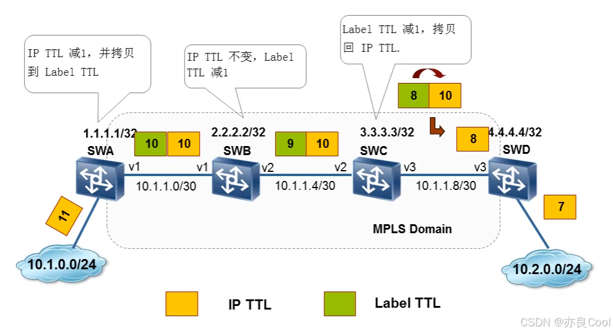
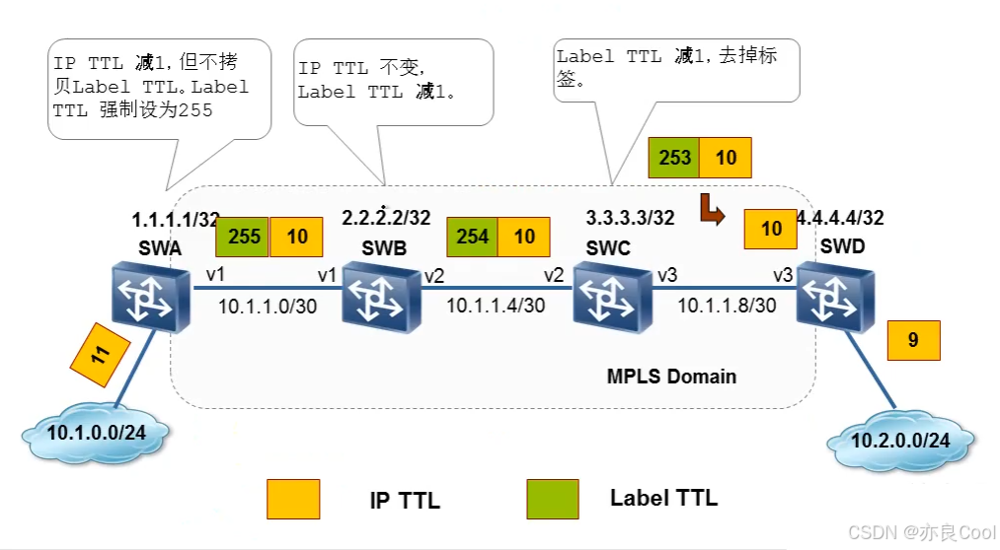

# MPLS环路检测机制

## IGP环路检测机制
通过动态路由协议学到路由信息，MPLS在创建LSP时所采用的标签的路由前缀是由IGP给出的下一跳所生成的，因此创建出的LSP是否有环路，完全决定与IGP是否有环路，我们一般使用的IGP大部分是OSPF。OSPF从算法上就是放环的，因此是不可能有环路的。
那我们就可以这样说：IGP无环，则生成的LSP也是无环的。
## TTL值
如果在传输途中因为某种原因出现了环路，则还有第二道关卡TTL值，传一跳减1。

## MPLS对TTL的处理
### 处理1：
如下图所示，四个三层交换机都运行了MPLS

- 当10.1.0.0/24进入SWA时，IP的TTL值为11。离开SWA时，IP的TTL=11-1=10，打上标签，标签的TTL是拷贝IP的TTL=10
- 当10.1.0.0/24进入SWB时，IP的TTL=10，标签TTL=10。离开SWB时，IP的TTL=10保持不变，标签TTL=10-1=9；
- 当10.1.0.0/24进入SWC时，IP的TTL=10，标签TTL=9。离开SWC时，此时标签TTL=9-1=8，覆盖IP的TTL=10=8后，弹出标签。
- 当10.1.0.0/24进入SWD时，IP的TTL=8，离开SWD时TTL=8-1=7。

### 处理2：
如下图所示，四个三层交换机都运行了MPLS

- 当10.1.0.0/24进入SWA时，IP的TTL值为11。离开SWA时，IP的TTL=11-1=10，打上标签，并且标签的值强制设置为TTL=255
- 当10.1.0.0/24进入SWB时，IP的TTL=10，标签TTL=255。离开SWB时，IP的TTL=10保持不变，标签TTL=255-1=254；
- 当10.1.0.0/24进入SWC时，IP的TTL=10，标签TTL=254。离开SWC时，IP的TTL=10保持不变，此时标签TTL=254-1=253，弹出标签。
- 当10.1.0.0/24进入SWD时，IP的TTL=10，离开SWD时TTL=10-1=9。

帧模式的MPLS中使用TTL，我们现在所使用的MPLS都是帧模式 。信元模式的MPLS中无TTL