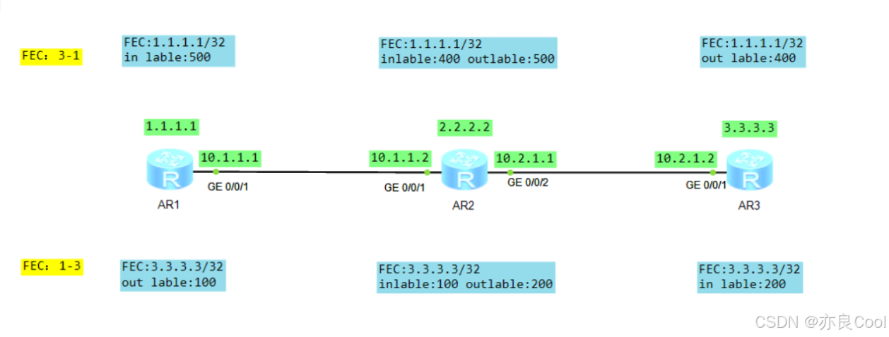

## 1、 实验 环境

要求：使用mpls静态 LSP ，实现AR1上的回环接口1.1.1.1能ping通AR3上的回环接口3.3.3.3  


## 2、基础配置

- 配置各个路由器的接口地址，回环接口LoopBack0掩码为32，其他网段子掩码为24
- 运行ospf协议使全网互通，回环接口也需要宣告

验证基础环境：

```bash
<ar1>ping -a 1.1.1.1 3.3.3.3
  PING 3.3.3.3: 56  data bytes, press CTRL_C to break
    Reply from 3.3.3.3: bytes=56 Sequence=1 ttl=254 time=40 ms
    Reply from 3.3.3.3: bytes=56 Sequence=2 ttl=254 time=20 ms
    Reply from 3.3.3.3: bytes=56 Sequence=3 ttl=254 time=20 ms
    Reply from 3.3.3.3: bytes=56 Sequence=4 ttl=254 time=20 ms
    Reply from 3.3.3.3: bytes=56 Sequence=5 ttl=254 time=20 ms
bash1234567
```

此时之所以能通是因为ospf协议。接下来我们配置mpls部分

#### 开启 全局mpls

```bash
[ar1]mpls lsr-id 1.1.1.1
[ar1]mpls

[ar2]mpls lsr-id 2.2.2.2
[ar2]mpls

[ar3]mpls lsr-id 3.3.3.3
[ar3]mpls
bash12345678
```

#### 接口下开启mpls

```bash
[ar1]int g0/0/1
[ar1-GigabitEthernet0/0/1]mpls

[ar2]int g0/0/1
[ar2-GigabitEthernet0/0/1]mpls
[ar2-GigabitEthernet0/0/1]q
[ar2]int g0/0/2
[ar2-GigabitEthernet0/0/2]mpls

[ar3]int g0/0/1
[ar3-GigabitEthernet0/0/1]mpls
bash1234567891011
```

注意：loopback不用开启

### 配置静态LSP

#### 配置FEC从1.1.1.1到3.3.3.3

```bash
[ar1]static-lsp ingress 1-3 destination 3.3.3.3 32 outgoing-interface GigabitEthernet 0/0/1 
        nexthop 10.1.1.2 out-label 100
bash12
```

注释 信息

- ingress入站，进入mpls域压入标签
- 1-3 自己起的名称，作为标识
- destination 3.3.3.3 32，目标地址
- outgoing-interface GigabitEthernet 0/0/1，出接口
- nexthop 10.1.1.2，下一条路由
- out-label 100，出标签
```bash
[ar2]static-lsp transit 1-3 incoming-interface GigabitEthernet0/0/1 in-label 100 
        outgoing-interface GigabitEthernet0/0/2 nexthop 10.2.1.2 out-label 200
bash12
```

注释信息

- transit 中转，在mpls域内标签置换，将数据转发到下游
- 1-3 自己起的名称，作为标识
- incoming-interface GigabitEthernet0/0/1，入接口
- in-label 100，入标签
- outgoing-interface GigabitEthernet0/0/2，出接口
- nexthop 10.2.1.2，下一条路由
- out-label 200，出标签
```bash
[ar3]static-lsp egress 1-3 incoming-interface GigabitEthernet0/0/1 in-label 200
bash1
```

注释信息

- egress 出站，弹出标签
- 1-3 自己起的名称，作为标识
- incoming-interface GigabitEthernet0/0/1，入接口
- in-label 200，入标签

这样FEC:1.1.1.1-3.3.3.3就配置完毕。

需要注意的是lsp是单向的，此时虽然 `ping -a 1.1.1.1 3.3.3.3` 可以通，但是回包使用的是OSPF协议。所以实验还没有完。还必须配置  
FEC:3.3.3.3-1.1.1.1。

#### 配置FEC从3.3.3.3到1.1.1.1

```bash
[ar3]static-lsp ingress 3-1 destination 1.1.1.1 32 outgoing-interface 
        GigabitEthernet 0/0/1 nexthop 10.2.1.1 out-label 400

[ar2]static-lsp transit 3-1 incoming-interface GigabitEthernet0/0/2 in-label 400 
        outgoing-interface GigabitEthernet0/0/1 nexthop 10.1.1.1 out-label 500
        
[ar1]static-lsp egress 3-1 incoming-interface GigabitEthernet0/0/1 in-label 500
bash1234567
```

### 3、信息查看

#### 查看LFIB表（标签转发信息表）

```bash
<ar1>dis mpls lsp
-------------------------------------------------------------------------------
                 LSP Information: STATIC LSP
-------------------------------------------------------------------------------
FEC                In/Out Label  In/Out IF                      Vrf Name       
-/-                500/NULL      GE0/0/1/-                                     
3.3.3.3/32         NULL/100      -/GE0/0/1  

<ar2>dis mpls lsp
-------------------------------------------------------------------------------
                 LSP Information: STATIC LSP
-------------------------------------------------------------------------------
FEC                In/Out Label  In/Out IF                      Vrf Name       
-/-                100/200       GE0/0/1/GE0/0/2                               
-/-                400/500       GE0/0/2/GE0/0/1      

<ar3>dis mpls lsp
-------------------------------------------------------------------------------
                 LSP Information: STATIC LSP
-------------------------------------------------------------------------------
FEC                In/Out Label  In/Out IF                      Vrf Name       
-/-                200/NULL      GE0/0/1/-                                     
1.1.1.1/32         NULL/400      -/GE0/0/1   

bash1234567891011121314151617181920212223242526
```

#### 查看FIB表（转发信息表）

==查看TunnelID==

- 如果转发信息表的tunnelld为 0x0，则转发路径走ipv4
- 如果不是不是0X0，就走LSP隧道封装标签在进行转发

下表中AR1和 AR3 的3.3.3.3/32最后一列0x1表明走LSP隧道封装标签在进行转发。AR2在域内部则是ospf转发

```bash
<ar1>dis fib
Route Flags: G - Gateway Route, H - Host Route,    U - Up Route
             S - Static Route,  D - Dynamic Route, B - Black Hole Route
             L - Vlink Route
--------------------------------------------------------------------------------
 FIB Table:
 Total number of Routes : 11 
 
Destination/Mask   Nexthop         Flag  TimeStamp     Interface      TunnelID
3.3.3.3/32         10.1.1.2        DGHU  t[60]         GE0/0/1        0x1
2.2.2.2/32         10.1.1.2        DGHU  t[55]         GE0/0/1        0x0
10.1.1.255/32      127.0.0.1       HU    t[12]         InLoop0        0x0
10.1.1.1/32        127.0.0.1       HU    t[12]         InLoop0        0x0
1.1.1.1/32         127.0.0.1       HU    t[4]          InLoop0        0x0
255.255.255.255/32 127.0.0.1       HU    t[4]          InLoop0        0x0
127.255.255.255/32 127.0.0.1       HU    t[4]          InLoop0        0x0
127.0.0.1/32       127.0.0.1       HU    t[4]          InLoop0        0x0
127.0.0.0/8        127.0.0.1       U     t[4]          InLoop0        0x0
10.1.1.0/24        10.1.1.1        U     t[12]         GE0/0/1        0x0
10.2.1.0/24        10.1.1.2        DGU   t[59]         GE0/0/1        0x0

<ar2>dis fib
Route Flags: G - Gateway Route, H - Host Route,    U - Up Route
             S - Static Route,  D - Dynamic Route, B - Black Hole Route
             L - Vlink Route
--------------------------------------------------------------------------------
 FIB Table:
 Total number of Routes : 13 
 
Destination/Mask   Nexthop         Flag  TimeStamp     Interface      TunnelID
3.3.3.3/32         10.2.1.2        DGHU  t[56]         GE0/0/2        0x0
1.1.1.1/32         10.1.1.1        DGHU  t[52]         GE0/0/1        0x0
10.2.1.255/32      127.0.0.1       HU    t[12]         InLoop0        0x0
10.2.1.1/32        127.0.0.1       HU    t[12]         InLoop0        0x0
10.1.1.255/32      127.0.0.1       HU    t[8]          InLoop0        0x0
10.1.1.2/32        127.0.0.1       HU    t[8]          InLoop0        0x0
2.2.2.2/32         127.0.0.1       HU    t[4]          InLoop0        0x0
255.255.255.255/32 127.0.0.1       HU    t[4]          InLoop0        0x0
127.255.255.255/32 127.0.0.1       HU    t[4]          InLoop0        0x0
127.0.0.1/32       127.0.0.1       HU    t[4]          InLoop0        0x0
127.0.0.0/8        127.0.0.1       U     t[4]          InLoop0        0x0
10.1.1.0/24        10.1.1.2        U     t[8]          GE0/0/1        0x0
10.2.1.0/24        10.2.1.1        U     t[12]         GE0/0/2        0x0

<ar3>dis fib
Route Flags: G - Gateway Route, H - Host Route,    U - Up Route
             S - Static Route,  D - Dynamic Route, B - Black Hole Route
             L - Vlink Route
--------------------------------------------------------------------------------
 FIB Table:
 Total number of Routes : 11 
 
Destination/Mask   Nexthop         Flag  TimeStamp     Interface      TunnelID
1.1.1.1/32         10.2.1.1        DGHU  t[53]         GE0/0/1        0x1
2.2.2.2/32         10.2.1.1        DGHU  t[52]         GE0/0/1        0x0
10.2.1.255/32      127.0.0.1       HU    t[9]          InLoop0        0x0
10.2.1.2/32        127.0.0.1       HU    t[9]          InLoop0        0x0
3.3.3.3/32         127.0.0.1       HU    t[4]          InLoop0        0x0
255.255.255.255/32 127.0.0.1       HU    t[4]          InLoop0        0x0
127.255.255.255/32 127.0.0.1       HU    t[4]          InLoop0        0x0
127.0.0.1/32       127.0.0.1       HU    t[4]          InLoop0        0x0
127.0.0.0/8        127.0.0.1       U     t[4]          InLoop0        0x0
10.2.1.0/24        10.2.1.2        U     t[9]          GE0/0/1        0x0
10.1.1.0/24        10.2.1.1        DGU   t[52]         GE0/0/1        0x0
bash123456789101112131415161718192021222324252627282930313233343536373839404142434445464748495051525354555657585960616263646566
```

#### 查看详细FFIB表

dis mpls lsp+verbose可以查看详细的标签转发信息表

```bash
<ar1>dis mpls lsp verbose
-------------------------------------------------------------------------------
                 LSP Information: STATIC LSP
-------------------------------------------------------------------------------

  No                  :  1
  Name                :  3-1
  Fec                 :  -------/--
  Nexthop             :  -------
  In-Label            :  500
  Out-Label           :  NULL
  In-Interface        :  GigabitEthernet0/0/1
  Out-Interface       :  ----------
  LspIndex            :  0
  Token               :  0x0
  LsrType             :  Egress
  Mpls-Mtu            :  ------
  TimeStamp           :  4412sec

  No                  :  2
  Name                :  1-3
  Fec                 :  3.3.3.3/32
  Nexthop             :  10.1.1.2
  In-Label            :  NULL
  Out-Label           :  100
  In-Interface        :  ----------
  Out-Interface       :  GigabitEthernet0/0/1
  LspIndex            :  1
  Token               :  0x1
  LsrType             :  Ingress
  Mpls-Mtu            :  1500
  TimeStamp           :  4365sec

<ar2>dis mpls lsp verbose
-------------------------------------------------------------------------------
                 LSP Information: STATIC LSP
-------------------------------------------------------------------------------

  No                  :  1
  Name                :  1-3
  Fec                 :  -------/--
  Nexthop             :  10.2.1.2
  In-Label            :  100
  Out-Label           :  200
  In-Interface        :  GigabitEthernet0/0/1
  Out-Interface       :  GigabitEthernet0/0/2
  LspIndex            :  0
  Token               :  0x1
  LsrType             :  Transit
  Mpls-Mtu            :  1500
  TimeStamp           :  4444sec

  No                  :  2
  Name                :  3-1
  Fec                 :  -------/--
  Nexthop             :  10.1.1.1
  In-Label            :  400
  Out-Label           :  500
  In-Interface        :  GigabitEthernet0/0/2
  Out-Interface       :  GigabitEthernet0/0/1
  LspIndex            :  1
  Token               :  0x2
  LsrType             :  Transit
  Mpls-Mtu            :  1500
  TimeStamp           :  4444sec
  
  

<ar3>dis mpls lsp verbose
-------------------------------------------------------------------------------
                 LSP Information: STATIC LSP
-------------------------------------------------------------------------------

  No                  :  1
  Name                :  1-3
  Fec                 :  -------/--
  Nexthop             :  -------
  In-Label            :  200
  Out-Label           :  NULL
  In-Interface        :  GigabitEthernet0/0/1
  Out-Interface       :  ----------
  LspIndex            :  0
  Token               :  0x0
  LsrType             :  Egress
  Mpls-Mtu            :  ------
  TimeStamp           :  4449sec

  No                  :  2
  Name                :  3-1
  Fec                 :  1.1.1.1/32
  Nexthop             :  10.2.1.1
  In-Label            :  NULL
  Out-Label           :  400
  In-Interface        :  ----------
  Out-Interface       :  GigabitEthernet0/0/1
  LspIndex            :  1
  Token               :  0x1
  LsrType             :  Ingress
  Mpls-Mtu            :  1500
  TimeStamp           :  4406sec

bash123456789101112131415161718192021222324252627282930313233343536373839404142434445464748495051525354555657585960616263646566676869707172737475767778798081828384858687888990919293949596979899100101102103
```

#### tracert lsp ip

可以根据下面的 类 型确认是否走的是MPLS

```bash
<ar1>tracert lsp ip 3.3.3.3 32
  LSP Trace Route FEC: IPV4 PREFIX 3.3.3.3/32 , press CTRL_C to break.
  TTL   Replier            Time    Type      Downstream 
  0                                Ingress   10.1.1.2/[100 ]
  1     10.1.1.2           30 ms   Transit   10.2.1.2/[200 ]
  2     3.3.3.3            40 ms   Egress   
  
  AR2和AR3上是没有lsp ip 3.3.3.3 32
  但是AR3上有回来的lsp ip 1.1.1.1 32
  
<ar3>tracert lsp ip 1.1.1.1 32
  LSP Trace Route FEC: IPV4 PREFIX 1.1.1.1/32 , press CTRL_C to break.
  TTL   Replier            Time    Type      Downstream 
  0                                Ingress   10.2.1.1/[400 ]
  1     10.2.1.1           20 ms   Transit   10.1.1.1/[500 ]
  2     1.1.1.1            30 ms   Egress 

bash123456789101112131415161718
```

#### tracert -v

可以根据信息判断是否走了LSP隧道转发 ：10.1.1.2\[MPLS Label=100 Exp=0 S=1 TTL=1\] 20 ms 20 ms 10 ms

```bash
<ar1>tracert -v 3.3.3.3

 traceroute to  3.3.3.3(3.3.3.3), max hops: 30 ,packet length: 40,press CTRL_C t
o break 

 1 10.1.1.2[MPLS Label=100 Exp=0 S=1 TTL=1] 20 ms  20 ms  10 ms 

 2 10.2.1.2 20 ms  30 ms  30 ms 
 
 -----------------------------------------------------------------------------------
<ar2>tracert -v 3.3.3.3

 traceroute to  3.3.3.3(3.3.3.3), max hops: 30 ,packet length: 40,press CTRL_C t
o break 

 1 10.2.1.2 20 ms  20 ms  10 ms 
 
--------------------------------------------------------------------------------------
<ar3>tracert -v 3.3.3.3

 traceroute to  3.3.3.3(3.3.3.3), max hops: 30 ,packet length: 40,press CTRL_C t
o break 

 1 127.0.0.1 10 ms  1 ms  1 ms

bash12345678910111213141516171819202122232425
```

#### ping lsp ip

```bash
<ar1>ping lsp ip 3.3.3.3 32
  LSP PING FEC: IPV4 PREFIX 3.3.3.3/32/ : 100  data bytes, press CTRL_C to break

    Reply from 3.3.3.3: bytes=100 Sequence=1 time=10 ms
    Reply from 3.3.3.3: bytes=100 Sequence=2 time=20 ms
    Reply from 3.3.3.3: bytes=100 Sequence=3 time=30 ms
    Reply from 3.3.3.3: bytes=100 Sequence=4 time=40 ms
    Reply from 3.3.3.3: bytes=100 Sequence=5 time=30 ms

  --- FEC: IPV4 PREFIX 3.3.3.3/32 ping statistics ---
    5 packet(s) transmitted
    5 packet(s) received
    0.00% packet loss
    round-trip min/avg/max = 10/26/40 ms
bash1234567891011121314
```

### 4、抓包验证

---

在AR1上 `ping -a 1.1.1.1 3.3.3.3` ，在AR2的g0/0/2口抓包  

在AR3上 `ping -a 3.3.3.3 1.1.1.1` ，在AR2的g0/0/2口抓包  

此时1.1.1.1和3.3.3.3之间的通信，发出和回包都是视频MPLS