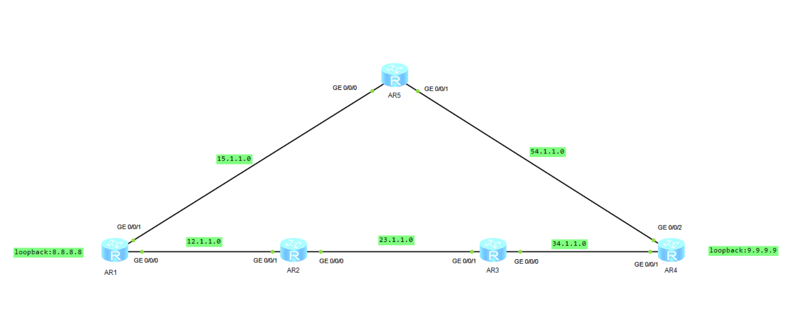
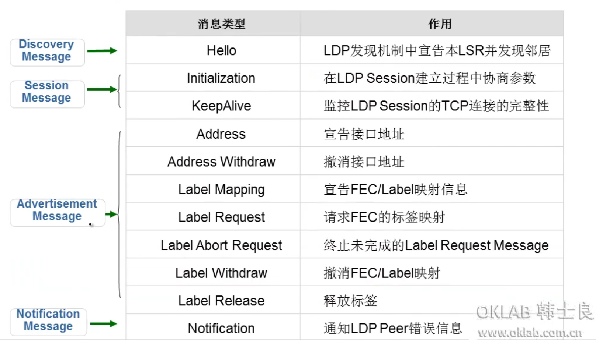
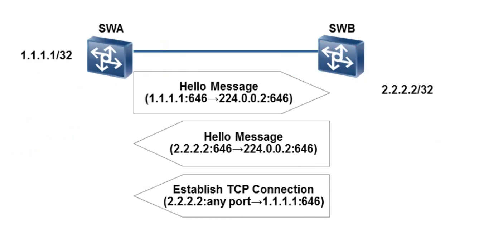
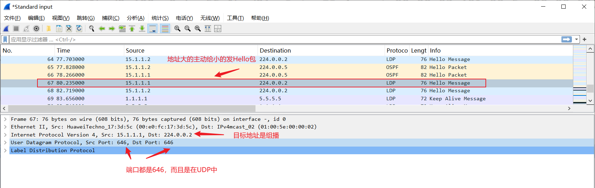
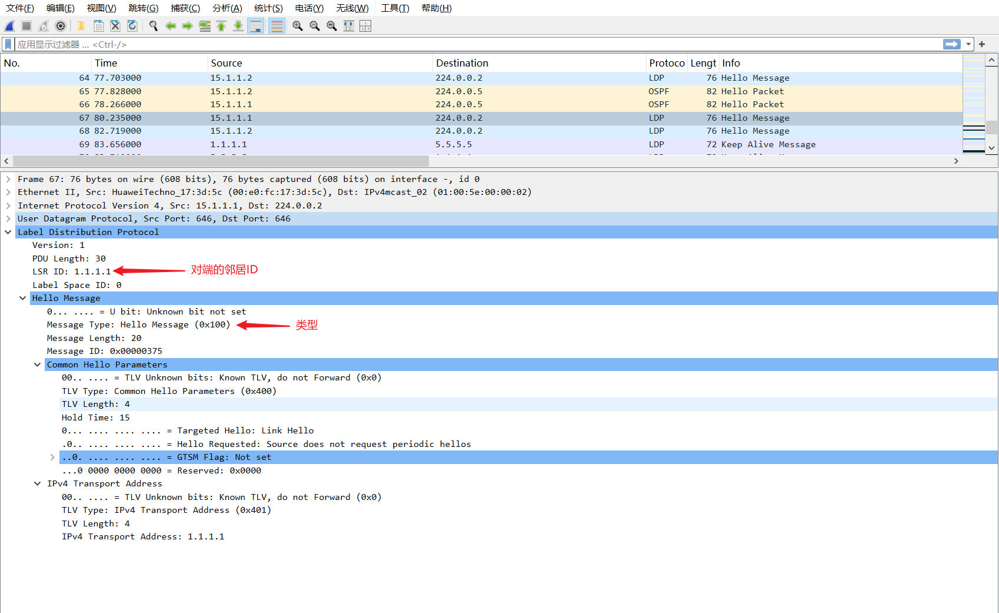
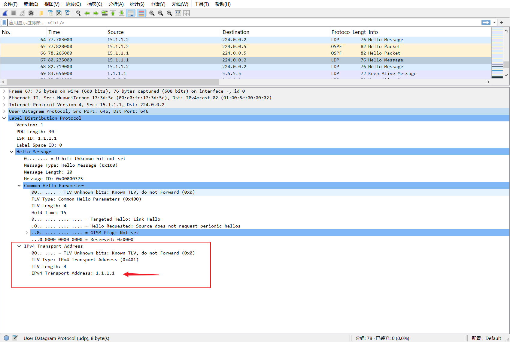
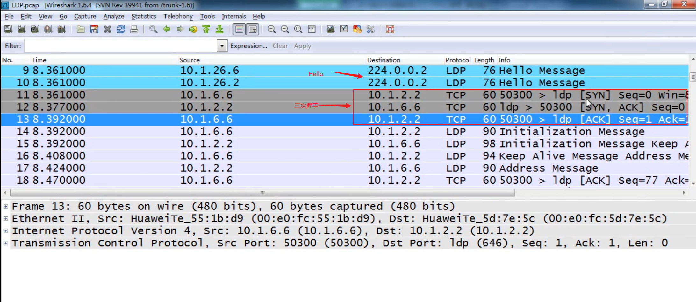
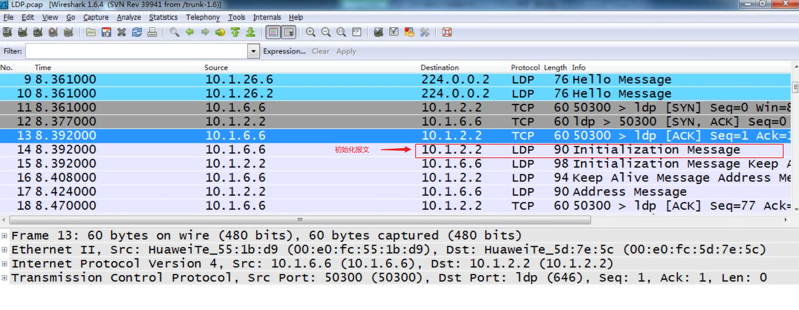
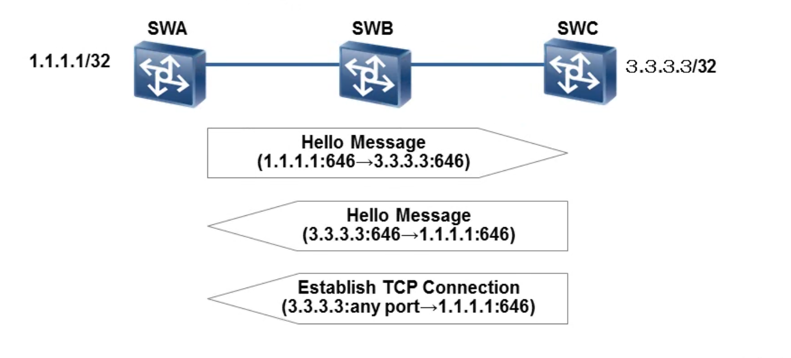
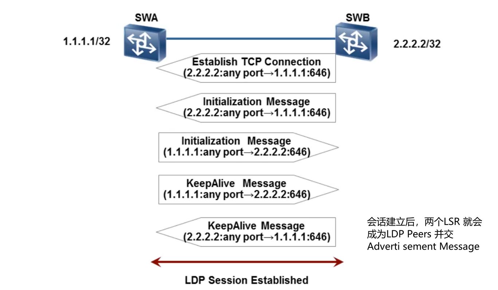

# MPLS动态LSP配置实验

## 实验拓扑




## 配置OSPF部分

配置全网互通，省略！注意：8.8.8.8和9.9.9.9也要宣告

## MPLS部分

```bash
[ar1]mpls lsr-id 1.1.1.1
[ar1]mpls
Info: Mpls starting, please wait... OK!
[ar1-mpls]mpls ldp
[ar1-mpls-ldp]q

[ar1]int g0/0/0
[ar1-GigabitEthernet0/0/0]mpls
[ar1-GigabitEthernet0/0/0]mpls ldp

[ar1-GigabitEthernet0/0/0]int g0/0/1
[ar1-GigabitEthernet0/0/1]mpls	
[ar1-GigabitEthernet0/0/1]mpls ldp 
[ar1-GigabitEthernet0/0/1]q


[ar2]mpls lsr	
[ar2]mpls lsr-id 2.2.2.2
[ar2]mpls
Info: Mpls starting, please wait... OK!
[ar2-mpls]q
[ar2]mpls ldp 

[ar2]int g0/0/1
[ar2-GigabitEthernet0/0/1]mpls	
[ar2-GigabitEthernet0/0/1]mpls ldp 
[ar2-GigabitEthernet0/0/1]q

[ar2]int g0/0/1
[ar2-GigabitEthernet0/0/1]mpls
[ar2-GigabitEthernet0/0/1]mpls ldp
[ar2-GigabitEthernet0/0/1]q

[ar2]int g0/0/0
[ar2-GigabitEthernet0/0/0]mpls
[ar2-GigabitEthernet0/0/0]mpls ldp 
[ar2-GigabitEthernet0/0/0]q


[ar3]mpls ls	
[ar3]mpls lsr-id 3.3.3.3
[ar3]mpls
Info: Mpls starting, please wait... OK!
[ar3-mpls]mpls ldp
[ar3-mpls-ldp]q

[ar3]int g0/0/1
[ar3-GigabitEthernet0/0/1]mpls
[ar3-GigabitEthernet0/0/1]mpls ldp
[ar3-GigabitEthernet0/0/1]q
[ar3]int g0/0/0
[ar3-GigabitEthernet0/0/0]mpls
[ar3-GigabitEthernet0/0/0]mpls ldp
[ar3-GigabitEthernet0/0/0]q

[ar4]mpls ls	
[ar4]mpls lsr-id 4.4.4.4
[ar4]mpls
Info: Mpls starting, please wait... OK!
[ar4-mpls]mpls ldp
[ar4-mpls-ldp]q
[ar4]int g0/0/1
[ar4-GigabitEthernet0/0/1]mpls
[ar4-GigabitEthernet0/0/1]mpls ldp
[ar4-GigabitEthernet0/0/1]q
[ar4]int g0/0/2
[ar4-GigabitEthernet0/0/2]mpls
[ar4-GigabitEthernet0/0/2]mpls ldp
[ar4-GigabitEthernet0/0/2]q

[ar5]mpls ls	
[ar5]mpls lsr-id 5.5.5.5
[ar5]mpls
Info: Mpls starting, please wait... OK!
[ar5-mpls]mpls ldp
[ar5-mpls-ldp]q
[ar5]
[ar5]int g0/0/0
[ar5-GigabitEthernet0/0/0]mpls
[ar5-GigabitEthernet0/0/0]mpls ldp
[ar5-GigabitEthernet0/0/0]q
[ar5]int g0/0/1
[ar5-GigabitEthernet0/0/1]mpls
[ar5-GigabitEthernet0/0/1]mpls ldp
[ar5-GigabitEthernet0/0/1]q

```

需要注意的是：环回口不需要开启mpls和mpls ldp 

## 查看信息

配置完之后，我们来查看

```bash
<ar1>dis mpls ldp session

 LDP Session(s) in Public Network
 Codes: LAM(Label Advertisement Mode), SsnAge Unit(DDDD:HH:MM)
 A '*' before a session means the session is being deleted.
 ------------------------------------------------------------------------------
 PeerID             Status      LAM  SsnRole  SsnAge      KASent/Rcv
 ------------------------------------------------------------------------------
 2.2.2.2:0          Operational DU   Passive  0000:02:59  719/719
 5.5.5.5:0          Operational DU   Passive  0000:01:22  332/332
 ------------------------------------------------------------------------------
 TOTAL: 2 session(s) Found.

#注释：
PeerID：是邻居的ID
Operational：状态，配置成功的标志Operational状态
Passive：说明是被动，主动是Active


[ar5]dis mpls ldp session 

 LDP Session(s) in Public Network
 Codes: LAM(Label Advertisement Mode), SsnAge Unit(DDDD:HH:MM)
 A '*' before a session means the session is being deleted.
 ------------------------------------------------------------------------------
 PeerID             Status      LAM  SsnRole  SsnAge      KASent/Rcv
 ------------------------------------------------------------------------------
 1.1.1.1:0          Operational DU   Active   0000:00:03  13/13
 4.4.4.4:0          Operational DU   Active   0000:00:03  13/13
 ------------------------------------------------------------------------------
 TOTAL: 2 session(s) Found.
 
 
 详细信息：
 <ar1>display mpls ldp session verbose

 LDP Session(s) in Public Network
 ------------------------------------------------------------------------------
 Peer LDP ID     : 2.2.2.2:0          Local LDP ID   : 1.1.1.1:0
 TCP Connection  : 1.1.1.1 <- 2.2.2.2
 Session State   : Operational        Session Role   : Passive
 Session FT Flag : Off                MD5 Flag       : Off
 Reconnect Timer : ---                Recovery Timer : ---
 Keychain Name   : ---

 Negotiated Keepalive Hold Timer   : 45 Sec
 Configured Keepalive Send Timer   : ---
 Keepalive Message Sent/Rcvd       : 730/730 (Message Count)
 Label Advertisement Mode          : Downstream Unsolicited
 Label Resource Status(Peer/Local) : Available/Available
 Session Age                       : 0000:03:02 (DDDD:HH:MM)
 Session Deletion Status           : No

 Capability:
   Capability-Announcement         : Off
   P2MP Capability                 : Off

 Outbound&Inbound Policies applied : NULL

 Addresses received from peer: (Count: 3)
 2.2.2.2             12.1.1.2            23.1.1.1           
 ------------------------------------------------------------------------------
 Peer LDP ID     : 5.5.5.5:0          Local LDP ID   : 1.1.1.1:0
 TCP Connection  : 1.1.1.1 <- 5.5.5.5
 Session State   : Operational        Session Role   : Passive
 Session FT Flag : Off                MD5 Flag       : Off
 Reconnect Timer : ---                Recovery Timer : ---
 Keychain Name   : ---

 Negotiated Keepalive Hold Timer   : 45 Sec
 Configured Keepalive Send Timer   : ---
 Keepalive Message Sent/Rcvd       : 344/344 (Message Count)
 Label Advertisement Mode          : Downstream Unsolicited
 Label Resource Status(Peer/Local) : Available/Available
 Session Age                       : 0000:01:25 (DDDD:HH:MM)
 Session Deletion Status           : No

 Capability:
   Capability-Announcement         : Off
   P2MP Capability                 : Off

 Outbound&Inbound Policies applied : NULL

 Addresses received from peer: (Count: 3)
 5.5.5.5             15.1.1.2            54.1.1.1           
 ------------------------------------------------------------------------------
 
 
 
 <ar5>display mpls ldp session verbose

 LDP Session(s) in Public Network
 ------------------------------------------------------------------------------
 Peer LDP ID     : 1.1.1.1:0          Local LDP ID   : 5.5.5.5:0
 TCP Connection  : 5.5.5.5 -> 1.1.1.1
 Session State   : Operational        Session Role   : Active
 Session FT Flag : Off                MD5 Flag       : Off
 Reconnect Timer : ---                Recovery Timer : ---
 Keychain Name   : ---

 Negotiated Keepalive Hold Timer   : 45 Sec
 Configured Keepalive Send Timer   : ---
 Keepalive Message Sent/Rcvd       : 351/351 (Message Count)
 Label Advertisement Mode          : Downstream Unsolicited
 Label Resource Status(Peer/Local) : Available/Available
 Session Age                       : 0000:01:27 (DDDD:HH:MM)
 Session Deletion Status           : No

 Capability:
   Capability-Announcement         : Off
   P2MP Capability                 : Off

 Outbound&Inbound Policies applied : NULL

 Addresses received from peer: (Count: 3)
 1.1.1.1             12.1.1.1            15.1.1.1           
 ------------------------------------------------------------------------------
 Peer LDP ID     : 4.4.4.4:0          Local LDP ID   : 5.5.5.5:0
 TCP Connection  : 5.5.5.5 -> 4.4.4.4
 Session State   : Operational        Session Role   : Active
 Session FT Flag : Off                MD5 Flag       : Off
 Reconnect Timer : ---                Recovery Timer : ---
 Keychain Name   : ---

 Negotiated Keepalive Hold Timer   : 45 Sec
 Configured Keepalive Send Timer   : ---
 Keepalive Message Sent/Rcvd       : 714/714 (Message Count)
 Label Advertisement Mode          : Downstream Unsolicited
 Label Resource Status(Peer/Local) : Available/Available
 Session Age                       : 0000:02:58 (DDDD:HH:MM)
 Session Deletion Status           : No

 Capability:
   Capability-Announcement         : Off
   P2MP Capability                 : Off

 Outbound&Inbound Policies applied : NULL

 Addresses received from peer: (Count: 3)
 4.4.4.4             34.1.1.2            54.1.1.2           
 ------------------------------------------------------------------------------
 
 
```

当状态为==Operational==，标志着ldp session建立成功。

我们看到AR5和AR1、AR4形成邻居关系。


## LDP五种消息类型





## LDP发现机制

LDP基本发现机制：发现直接连接在同一链路上的LSR邻居。例如上面的实验。

LDP扩展发现机制：发现非直连的LSR邻居，即跨跳建立邻居。这个需要手动建立


### 基本发现机制



1、首先由接口地址大的主动发送hello包。


LSR通过周期性（5S）地发送HelloMessage表明自己的存在。这个消息是封装在==UDP报文==中的，目的端口号为==646==。在LDP基本发现机制中，该消息的目的IP地址为组播IP地址==224.0.0.2==;

==知识补漏：224.0.0.2这个地址，是所有路由器和三层交换机都要监听的。并且只能在直连网段上传播。不能跨跳==






2、收到hello包之后，要使用（hello包——LDP——Transport）Transport 地址和对端进行TCP三次握手

注意：==默认情况下Transport地址和LSR ID相同，由Transport地址大的发起TCP连接==



很遗憾这里没有自己抓到包，就用别人的图了




3.三次握手成功之后，开始发送初始化报文Initialization Message，初始化报文协商参数，建立连接。

很遗憾这里没有自己抓到包，就用别人的图了



### 扩展发现机制


扩展发现机制，其实就是跨跳建立邻居，发现机制和基本机制是一样的，但是由于组播IP地址==224.0.0.2==它只能在直连网段传播不能跨跳，所以扩展发现机制建立邻居使用的是==单播==。



## LDP Session建立和维护

- 首先由直连地址大的主动发送hello包，对端收到hello包之后比较Transport 地址大小，由Transport 地址大的发起 TCP三次握手。

- 三次握手成功之后，开始==相互发送==初始化报文Initialization Message协商参数建立连接。

- 相互发送KeepAlive Message确认。




