# BGP基础概念

## BGP在企业中的应用

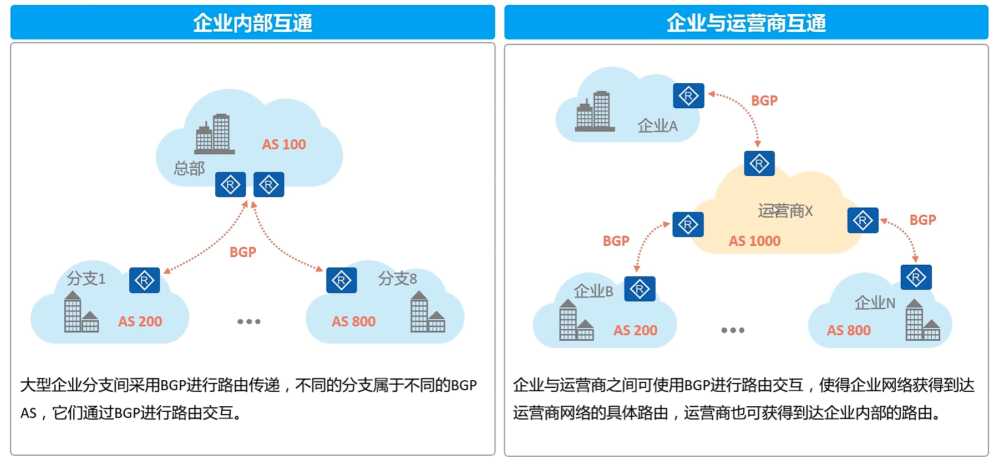​

> 为方便管理规模不断扩大的网络，网络被分成了不同的As（AutonomousSystem，自治系统）。早期，EGP（Exterior Gateway Protocol，<font color='red'>外部网关协议</font>）被用于实现在AS之间动态交换路由信息。但是EGP设计得比较简单，只发布网络可达的路由信息，而不对路由信息进行优选，同时也没有考虑环路避免等问题，很快就无法满足网络管理的要求。BGP是为取代最初的EGP而设计的另一种外部网关协议。不同于最初的EGP，<font color='orange'>BGP能够进行路由优选、避免路由环路、更高效率的传递路由和维护大量的路由信息。</font>
>

‍

## BGP概述

> BGP是一种实现自治系统AS之间的路由可达，并选择最佳路由的矢量性协议。早期发布的三个版本分别是BGP-1（RFC1105）、BGP-2（RFC1163）和BGP-3（RFC1267），1994年开始使用BGP-4（RFC1771），2006年之后单播IPv4网络使用的版本是BGP-4（RFC4271），其他网络（如IPv6等）使用的版本是MP-BGP（RFC4760）。
>

‍

## BGP的特点

> BGP使用<font color='red'>TCP</font>作为其传输层协议（端口号为<font color='red'>179</font>），使用触发式路由更新，而不是周期性路由更新。
>
> BGP能够<font color='orange'>承载大批量的路由信息</font>，能够支撑大规模网络。
>
> BGP提供了<font color='orange'>丰富的路由策略</font>，能够灵活的进行路由选路，并能指导对等体按策略发布路由。
>
> BGP能够支撑MPLS/VPN的应用，传递客户VPN路由。
>
> BGP提供了路由聚合和路由衰减功能用于防止路由振荡，通过这两项功能有效地提高了网络稳定性。
>

## 基本配置

### 单区域配置

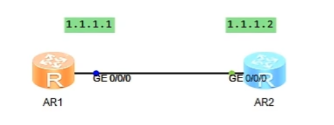

```
[Huawei]bgp 100
[Huawei-bgp]peer 1.1.1.2 as 100
```

注意：peer 1.1.1.2 as 100 是对端的

### 抓包观察

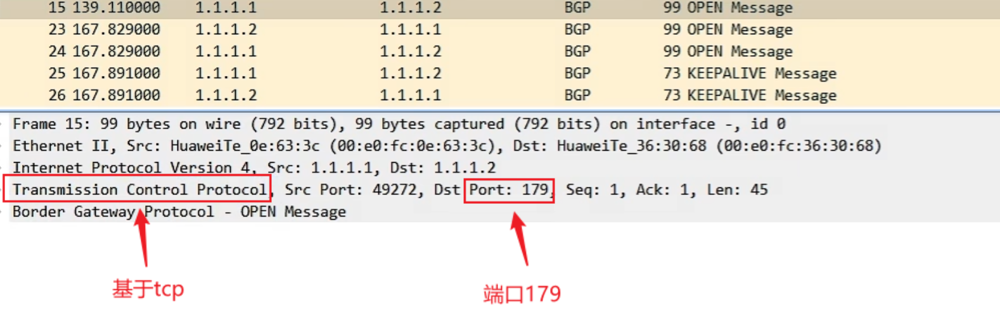

### bgp的特征

#### BGP特征1

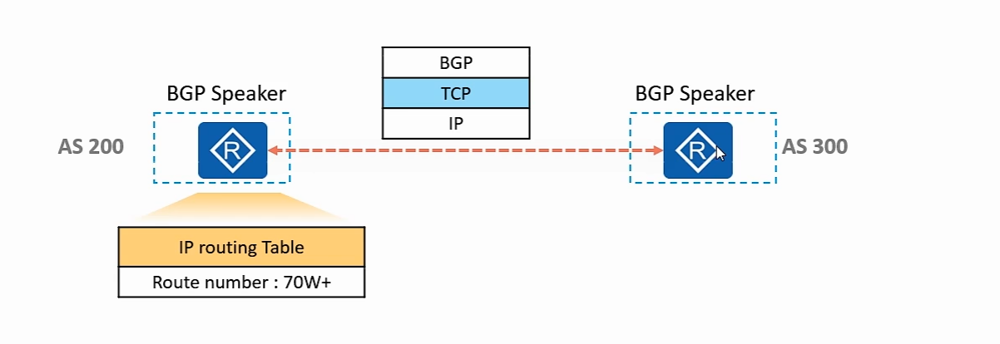​

* BGP使用<font color='red'>TCP为传输层协议</font>，TCP端口号<font color='red'>179</font>。路由器之间的BGP会话基于TCP连接而建立

* 运行BGP的路由器被称为BGP发言者（BGP Speaker），或BGP路由器。

* 两个建立BGP会话的路由器互为<font color='red'>对等体（Peer）</font>，BGP对等体之间交换BGP路由表。

* BGP路由器<font color='red'>只发送增量</font>的BGP路由更新，或进行<font color='red'>触发式更新</font>（==不会周期性更新==）。

* BGP能够承载大批量的路由前缀，可在大规模网络中应用。

#### BGP特征2

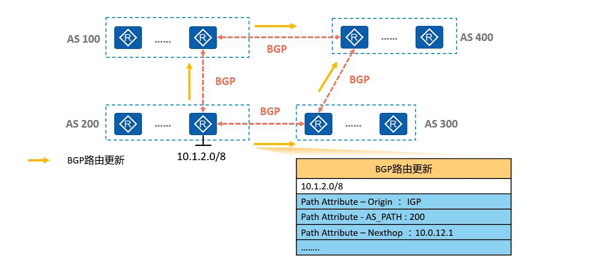​

* BGP通常被称为<font color='red'>路径矢量路由协议</font>（Path-Vector Routing Protocol）。
* 每条BGP路由都携带多种<font color='red'>路径属性</font>（Path attribute），BGP可以通过这些路径属性控制路径选择，而不像IS-IS、OSPF只能通过Cost控制路径选择，因此在路径选择上，BGP具有丰富的可操作性，可以在不同场景下选择最合适的路径控制方式。

## BGP对等体关系

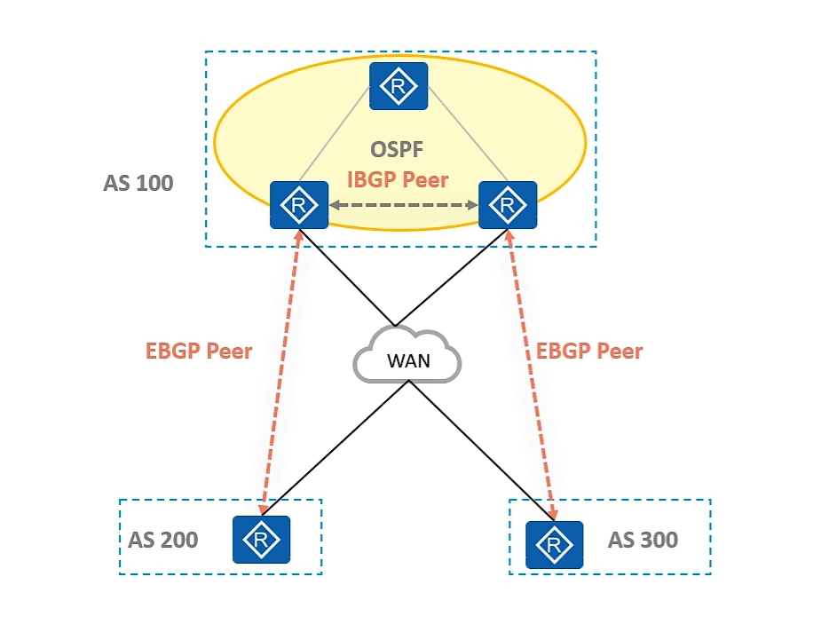​

与OSPF、IS-IS等协议不同，BGP的会话是基于TCP建立的。建立BGP对等体关系的两台路由器<font color='orange'>并不要求必须直连</font>。这就意味着，<font color='orange'>bgp可以跨跳建立邻居。</font>

BGP存在两种对等体关系类型：

* EBGP：位于<font color='orange'>不同自治系统</font>的BGP路由器之间的BGP对等体关系。两台路由器之间要建立EBGP对等体关系，必须满足两个条件：两个路由器所属AS不同（即AS号不同）。在配置EBGP时，Peer命令所指定的对等体IP地址<font color='orange'>要求路由可达</font>，并且TCP连接能够正确建立。

* IBGP：位于<font color='orange'>相同自治系统</font>的BGP路由器之间的BGP邻接关系。

### bgp的工作过程

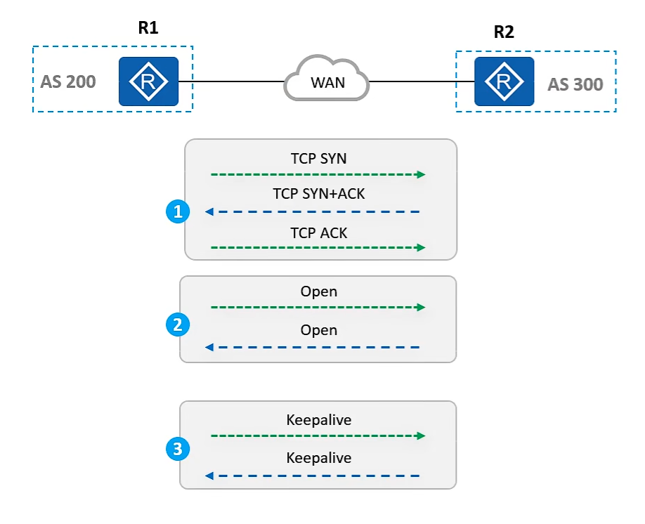​

先启动BGP的一端先发起TCP连接，如上图所示，R1先启动 BGP，R1使用随机端口号向R2的179端口发起TCP连接，完成TCP连接的建立。

三次握手建立完成之后，R1、R2之间相互发送<font color='orange'>Open报文</font>，携带参数用于对等体建立，参数协商正常之后双方相互发送keepalive报文，收到对端发送的Keepalive报文之后对等体建立成功，同时双方定期发送<font color='orange'>keepalive报文</font>用于保持连接。

知识补漏：

==ospf是每隔10秒发送hello报文，40秒没有收到则邻居失效。==

bgp建立对等体的时间为32秒，三次握手成功32秒之后发送bgp报文

#### Open报文

其中Open报文中携带：

* My Autonomous System：自身AS号
* Hold Time：用于协商后续Keepalive报文发送时间
* BGP Identifier：自身RouterID

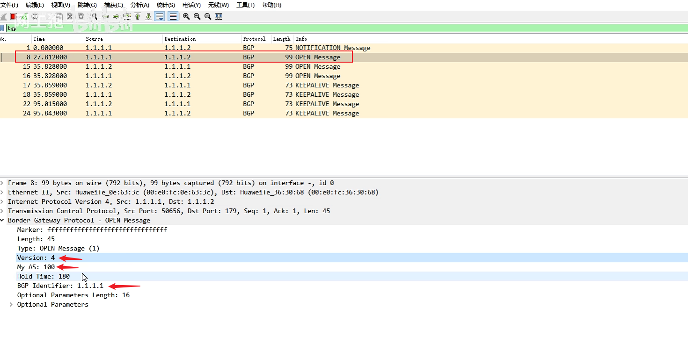​

#### Update报文

BGP对等体关系建立之后，BGP路由器发送BGP Update（更新）报文通告路由到对等体

​

采用network引入路由

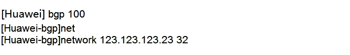​

抓包看看

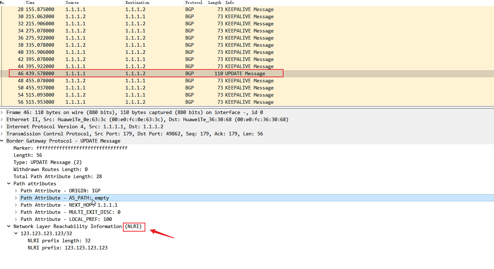​

## bgp报文

### bgp报文类型

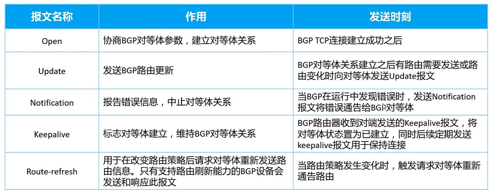​

### BGP报文格式-报文头格式

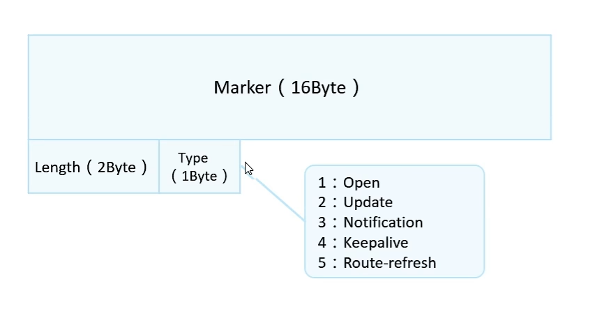​

BGP五种报文都拥有相同的报文头，格式如左侧所示，主要字段解释如下：  
Marker：16Byte，用于标明BGP报文边界，所有bit均为"1"。  
Length：2Byte，BGP报文总长度（包括报文头在内），以Byte为单位。  
Type：1Byte，BGP报文的类型。其取值从1到5，分别表示Open、Update、Notification、Keepalive和Route refresh 报文。

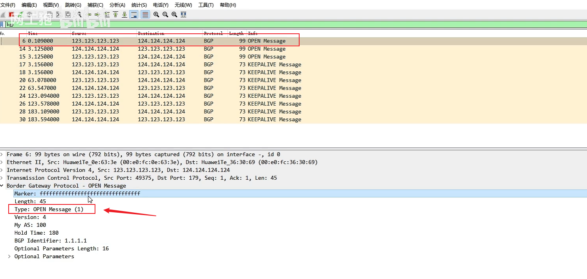​

#### Open报文格式

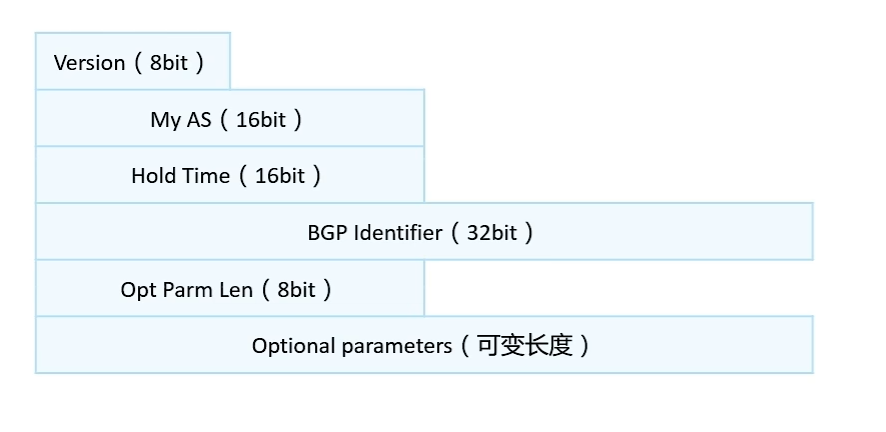​

Open报文是TCP连接建立之后发送的第一个报文，用于建立BGP对等体之间的连接关系，报文格式如左侧所示，主要字段解释如下：

* Version：BGP的版本号。对于BGP 4来说，其值为4。

* My AS（autonomous system）：本地As号。通过比较两端的AS号可以判断对端是否和本端处于相同AS。

* Hold Time：保持时间。在建立对等体关系时两端要协商HoldTime，并保持一致。如果在这个时间内未收到对端发来的Keepalive报文或Update报文，则认为BGP连接中断。

* BGP Identifier：BGP标识符，以IP地址的形式表示，用来识别BGP路由器。

#### Update报文格式

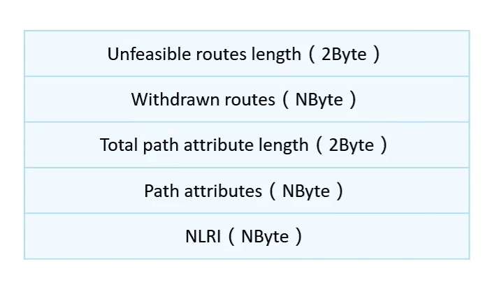​

Update报文用于在对等体之间传递路由信息，可以用于发布、撤销路由。一个Update报文可以通告具有相同路径属性的多条路由，这些路由保存在NLRl（NetworkLayerReachableInformation，网络层可达信息）中。同时Update还可以携带多条不可达路由，用于告知对方撤销路由，这些保存在Withdrawn Routes字段中。报文格式如左侧所示，主要字段解释如下：

* Withdrawn routes：不可达路由的列表。

* Path attributes：与NLRi相关的所有路径属性列表，每个路径属性由一个TLV（Type-Length-Value）三元组构成。。

* NLRI：可达路由的前缀和前缀长度二元组。

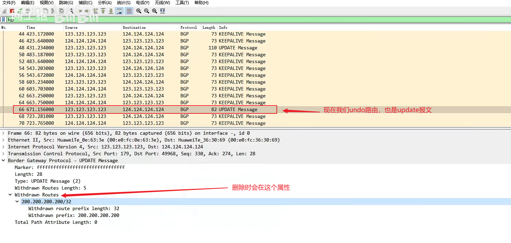​

#### Notification报文格式

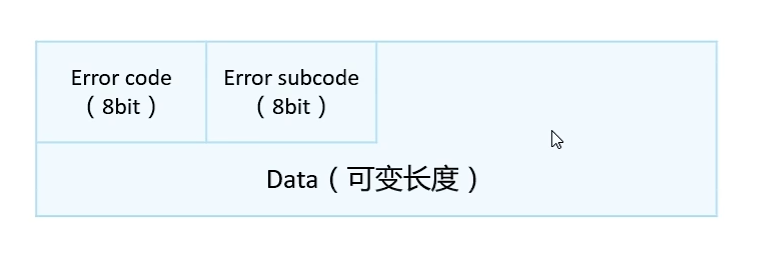​

当BGP检测到错误状态时（对等体关系建立时、建立之后都可能发生），就会向对等体发送Notification，告知对端错误原因。之后BGP连接将会立即中断。

* ErrorCode、Error subcode：差错码、差错子码，用于告知对端具体的错误类型。

* Data：用于辅助描述详细的错误内容，长度并不固定。

人为undo掉的报错：

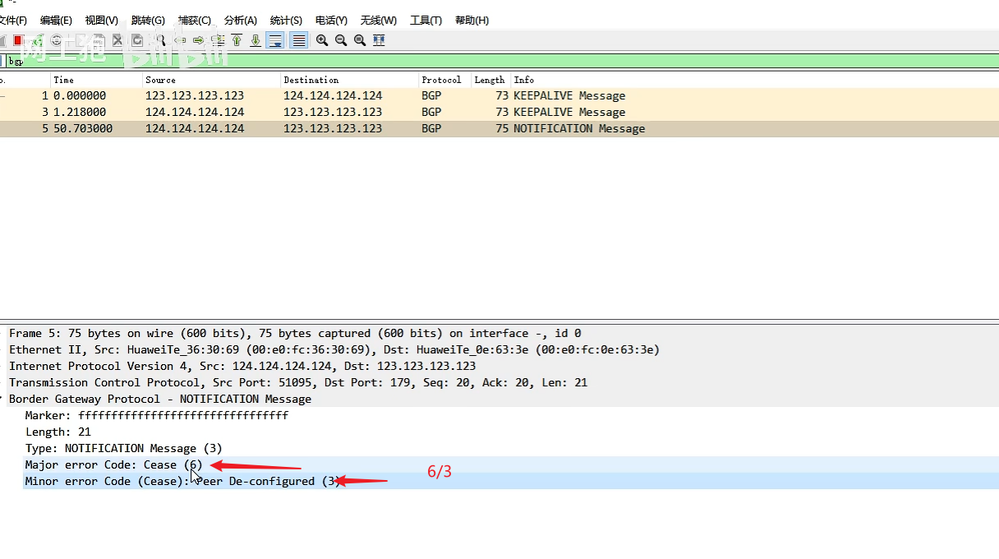​

错误代码：

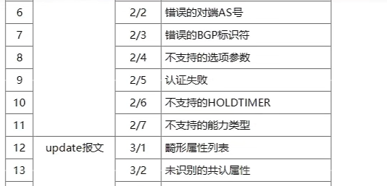​

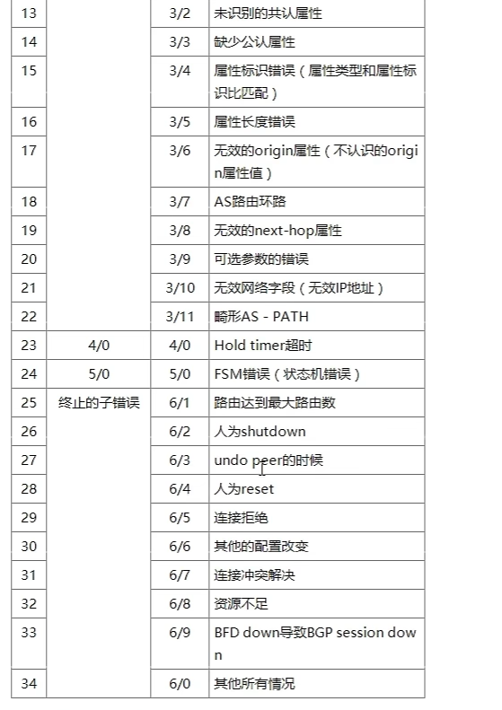​

#### Route-refresh报文格式

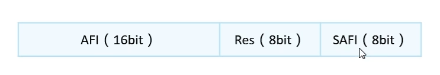​

Route-refresh报文用来要求对等体重新发送指定地址族的路由信息，一般为本端修改了相关路由策略之后让对方重新发送Update报文，本端执行新的路由策略重新计算BGP路由。

相关字段内容如下：

* AFl：AddressFamilyIdentifier，地址族标识，如iPv4。

* Res.：保留，8个bit必须置0。

* SAFl：SubsequentAddressFamilyIdentifier，子地t址族标识。

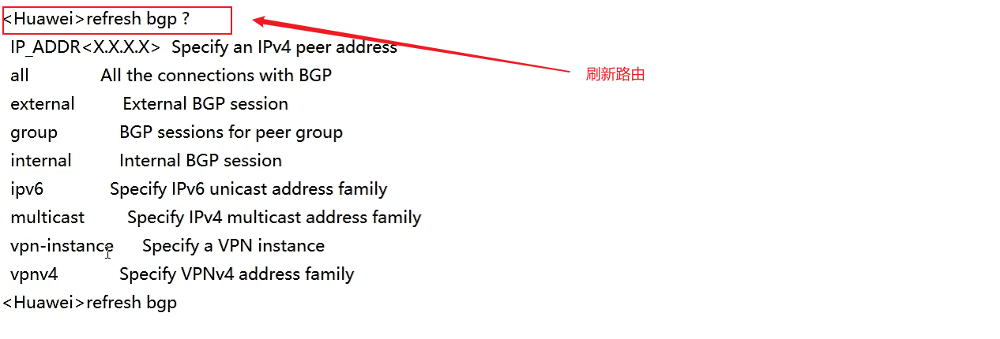​

## BGP状态机

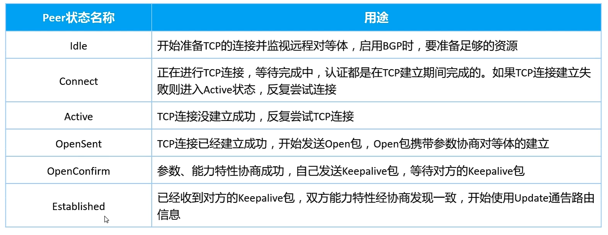​

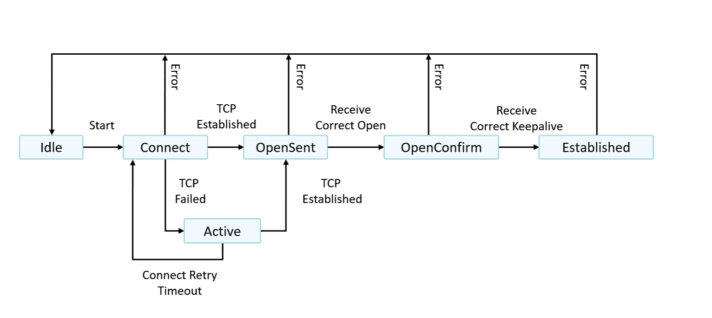​

### Idle状态

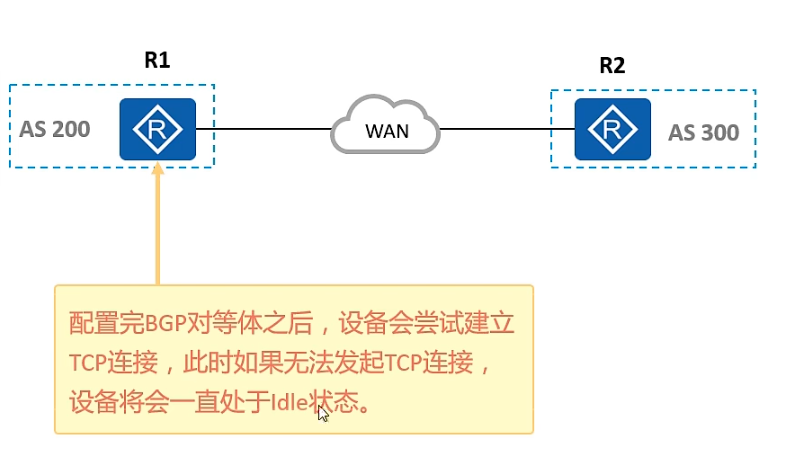​

缺乏去往BGP对等体的路由是导致BGP路由器其状态机一直处于idle状态的常见原因。

### Connect、 Active

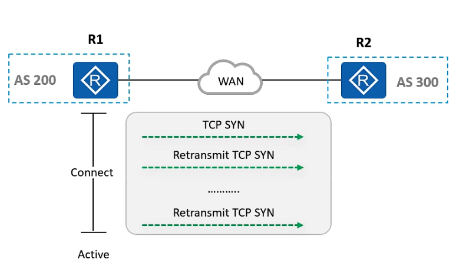​

配置完BGP对等体并成功查找到去往对等体地址的路由之后，会发起 TCP三次握手，TCP三次握手建立过程中处于connect状态，如果TCP连接长期无法建立则进入Active状态。

### Open Sent、Open Confirm

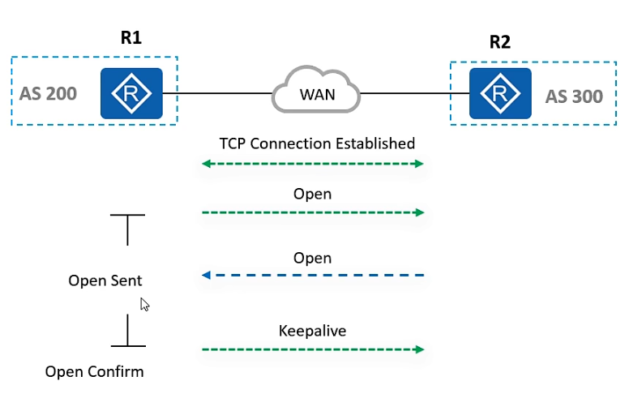​

TCP三次握手建立完成之后，发送Open报文建立对等体关系，此时进入OpenSent 状态，当收到对端回应的open报文，并且参数检查无误，在发送keepalive报文之后进入OpenConfirm状态。

### Established

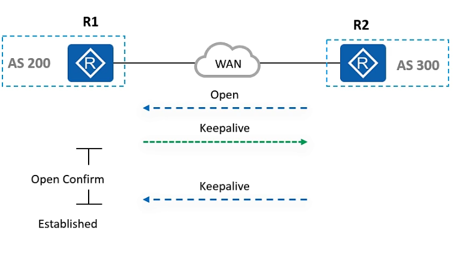​

进入OpenConfirm状态之后，BGP路由器如果收到了对端发送的 Keeaplive报文，则进入Established状态，对等体关系建立过程就此完成。

## BGP对等体表

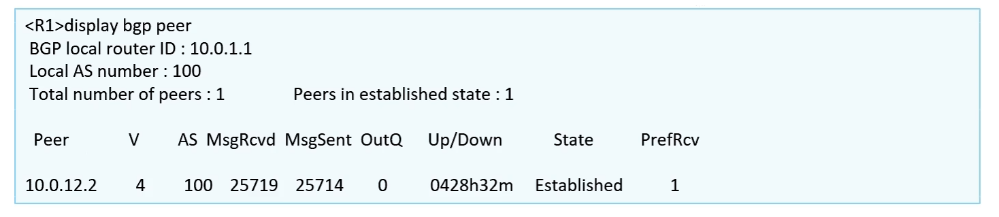​

在设备上通过<font color='red'>display bgp peer</font>命令查看BGP对等体表，其中主要参数含义：

* Peer：对等体地址
* V：version，版本号
* AS：对等体AS号

* Up/Down：该对等体已经存在up或者down的时间口

* State：对等体状态，这里显示的为BGP状态机的状态口

* PrefRcv：prefixreceived，从该对等体收到的路由前缀数目

‍

## BGP路由表

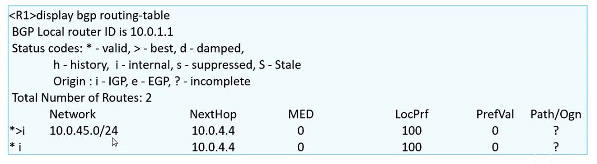​

在设备上通过<font color='red'>display bgp routing-table</font>查看BGP路由表：

* Network：路由的目的网络地址以及网络掩码。
* NextHop：下一跳地址

如果想要查看某条路由更加详细的信息，可以通过

```shell
display bgp routing-table ipv4-address{mask|mask-length}
```

查看，该命令会将匹配的BGP路由信息详细展示。

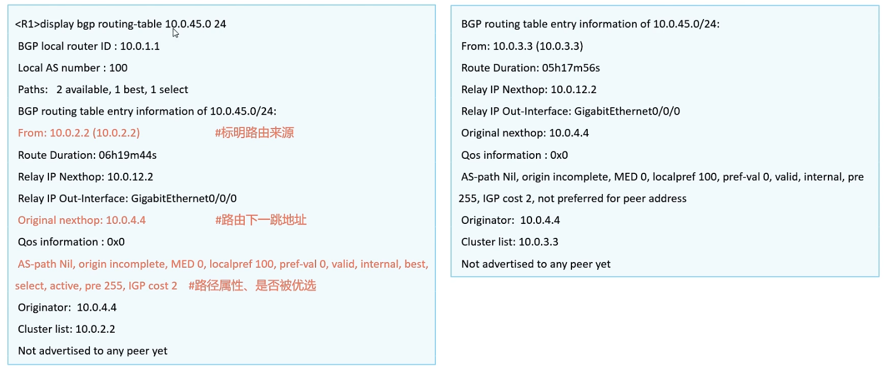​

## BGP聚合路由

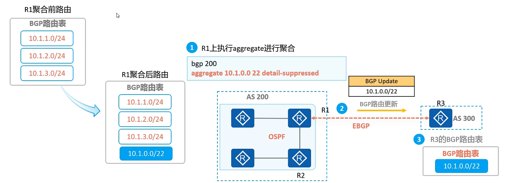​

与众多IGP协议相同，BGP同样支持路由的手工聚合，在BGP配置视图中使用aggregate命令可以执行BGP路由手工聚合，在BGP 已经学习到相应的明细路由情况下，设备会向BGP注入指定的聚合路由。

例如：将ospf的192.168.1.0，192.168.2.0，192.168.3.0，192.168.4.0聚合成一条路由

```bash
[Huawei-bgp]aggregate 192.168.0.0 16 detail-suppressed
```

## BGP通告原则（重点）

BGP通过network、import-route、aggregate聚合方式生成BGP路由后，通过Update报文将BGP路由传递给对等体。  
BGP通告遵循以下原则：

### 通告原则一

<font color='red'>**第一条原则：只发布最优且有效路由。**</font>

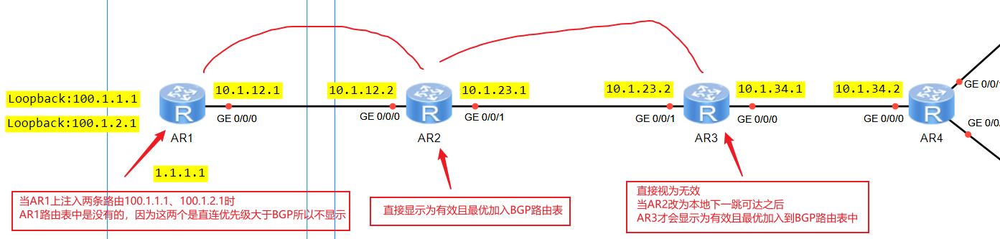​

```shell
dis bgp rou
die bgp peer  
dis ip routing-table protocol bgp   查询BGP路由表
```

> 星号表示有效，大于号表示最优 ，BGP路由表的查询
>

通过`display bgp routing-table`​命令可以查看BGP路由表。

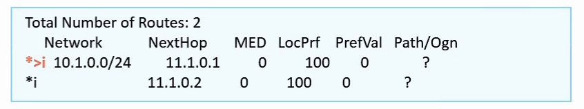​

### 通告原则二

<font color='red'>**通告原则二：从EBGP对等体获取的路由，会发布给所有对等体。**</font>


从外部学到的发给内部的所有对等体。==当发给IBGP时需要更改下一跳为本地源地址==

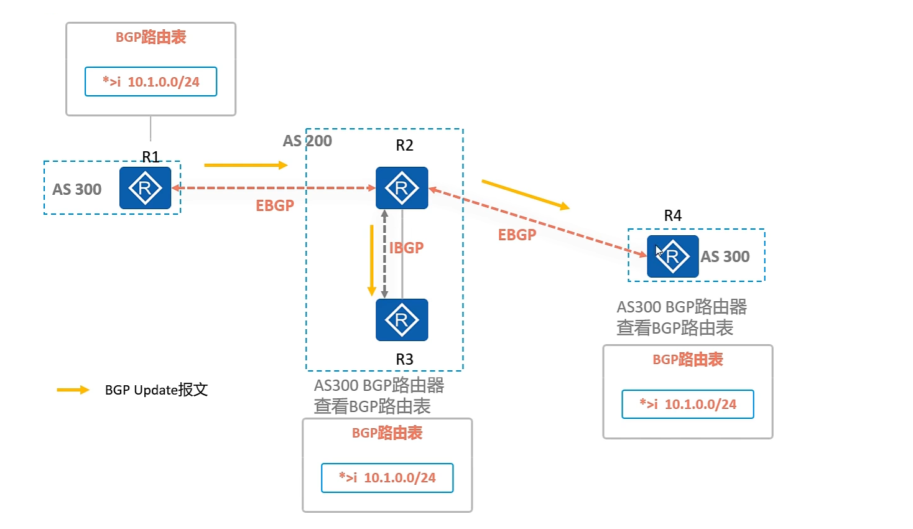​

案例1：AR3-AR1通过OSPF协议互联,，AR1通过import引入OSPF的路由192.168.1/2/3/3/4/5.0，然后通过路由聚合成为192.168.0.0/16注入bgp 。此时AR2、AR4、AR5会学到此条路由，但是在AR5中192.168.0.0/16这条路由会显示无效，因为下一跳172.16.1.1不可达。此时就需要在AR4中配置将从EBGP学到的路由下一跳改为本地源地址。配置完之后有时需要：

in方向

```bash
<AR2>refresh bgp all export
```

出方向

```
<AR2>refresh bgp all import
```

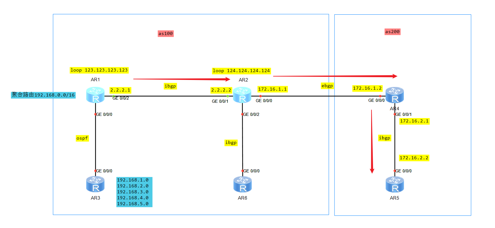​

案例2：使其可达，使其变的有效

​

‍

### 通告原则三

<font color='red'>**第三条原则：从IBGP对等体获取的BGP路由，不会再发送给其他IBGP对等体。该条原则也被称为“IBGP水平分割”。**</font>

案例1：如下图所示

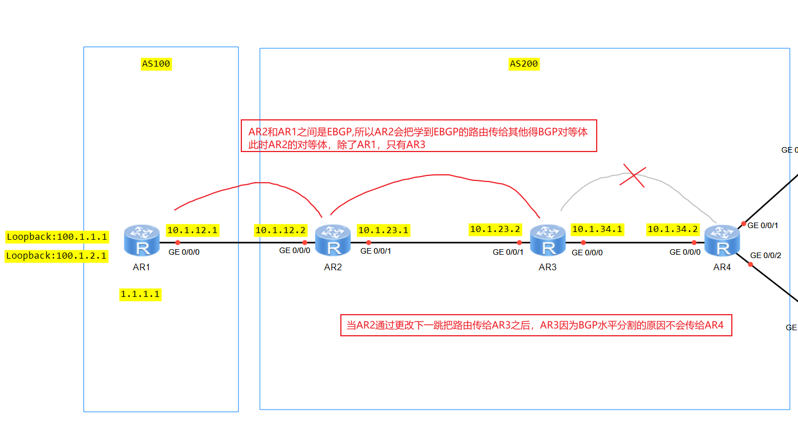​

如果要传给AR4,有两种比较合理的方法：

* 全互联，即：在上图的基础上让AR2和AR4跨跳建立对等体
* 反射器：后面单独列出来说。

### BGP同步规则

> BGP同步规则指的是当一台路由器从自己的IBGP对等体学习到一条BGP路由时（这类路由被称为IBGP路由），它将不能使用该条路由或把这条路由通告给自己的EBGP对等体，除非它又从IGP协议（例如OSPF等，此处也包含静态路由）学习到这条路由，也就是要求IBGP路由与IGP路由同步。同步规则主要用于规避 BGP路由黑洞问题。

<font color='red'>注意：在华为的设备中被强行关闭掉，手动也无法启动。</font>

## BGP路由属性

### 路径属性分类

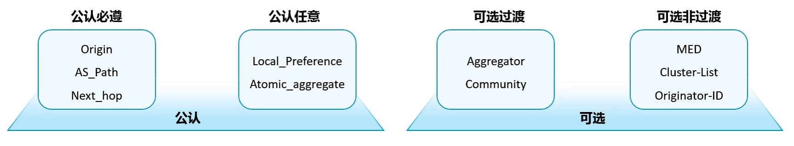​

#### 公认属性

公认属性是所有BGP路由器都必须能够识别的属性

公认属性可以分为两类：

* 公认必遵（Well-knownMandatory）：必须包括在每个 Update消息里。
* 公认任意（Well-knownDiscretionary）：可能包括在某些 Update消息里。

##### Origin属性（重点）

Origin 属性，也称为起源属性，定义路径信息的来源，标记一条路由是怎么成为BGP路由的。

Origin查看：

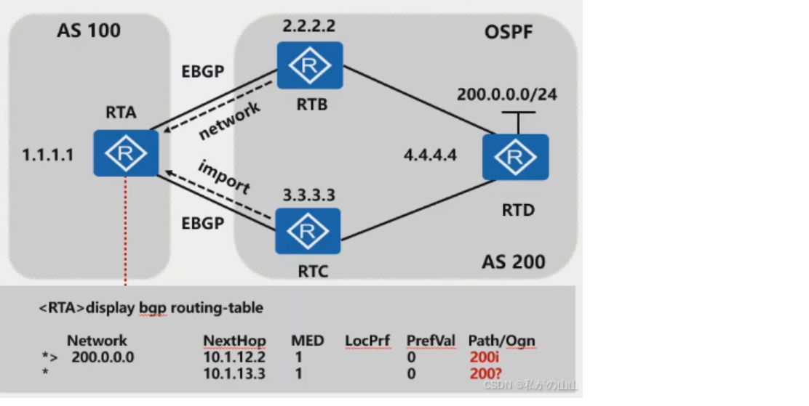​

BGP路由的三种起源属性：

|符号|表示|说明|备注|
| ------| ------------| -----------------------------------| -------------|
|i|IGP|表明BGP路由是由network命令发起的||
|?|incomplete|表明BGP路由是由import-route产生的||
|e|EGP|明BGP路由是从EGP协议引入的|EGP协议目前==已经全面退出网络==|

起源属性可以被修改，一般起源属性是一种BGP选路属性，可以用于BGP路径的选择，==通过修改起源属性可以控制BGP路径== 。

三种起源属性的优先级：==i &gt; e &gt; incomplete，也就是IGP&gt;EGP&gt;Incomplete==

##### AS\_Path（重点）

AS路径属性，主要用来进行路由防环、路由选路。

**具体原理如下**

* 从EBGP邻居得到路由时，会检查该路由的AS\_Path属性，如果此属性存在自身的AS号，则丢弃此路由——用于AS之间防环
* 经过AS数量越少的路径越优——用于BGP路由选路

例如：AR1和AR2建立EBGP邻居关系，AR2和AR4建立EBGP邻居关系，此时AR4将自己的环回接口地址宣告到BGP中。

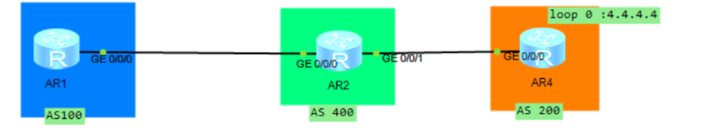​

在AR2收到的4.4.4.4的AS_Path 为200

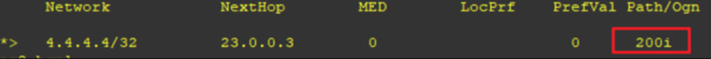​

在AR1收到的4.4.4.4的AS_Path为400 200

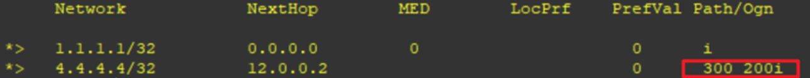​

注意：

AS_Path属性更新

* EBGP在传递路由时会更新AS_Path，会将自己的AS号添加到AS_Path属性的最前面；

* IBGP在传递路由时，不会更新AS_Path

AS_Path属性检测

* EBGP邻居之间进行AS_Path检测，IBGP邻居之间不进行AS_Path检测；

* 可以通过命令来使得EBGP邻居可以忽略AS_Path属性的检查，主要用在==MPLS Hub-Spoke场景==（华为设备命令 ）  
  
* AS_Path属性中的AS号替换
  
  在某些场景下，可以根据需要进行AS号替换

```shell
华为设备
peer 邻居地址 allow-as-loop 1      接收AS号与自身AS号重复1次的路由 
bestroute as-path-ignor           在选择最优路由时忽略AS_Path检测
as-path-limit 10                  AS_Path属性中AS号最多10个
 
锐捷设备
neighbor 邻居地址 allowas-in 1    接收AS号与自身AS号重复1次的路由 
```

‍

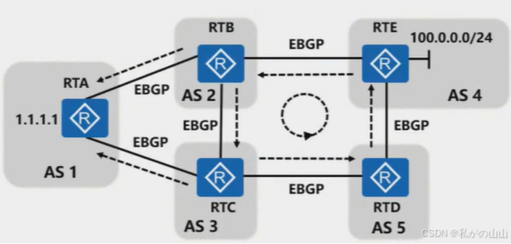​

AS\_Path用于选路，经过AS数量少的路径最优  
当BGP路由传递给EBGP邻居时会将自己的AS号添加到AS\_PATH属性的最前面  
当BGP路由传递给IBGP邻居时不会添加自己的AS号  
在AS之间实现BGP环路的防范（AS内部防环，IBGP水平分割），从EBGP邻居得到路由时，  
检查该路由的AS\_PATH属性，如果AS\_PATH中存在自身的AS号，则丢弃该路由。  
防环的检测机制

* EBGP邻居之间进行AS\_PATH检查
* IBGP 邻居之间不做AS\_PATH检查

AS\_PATH属性可以被修改，==华为可以在IBGP和EBGP邻居之间修改，思科只允许在EBGP邻居之间修改==

‍

##### Next\_hop（重点）

Next\_hop定义了到达目的地下一跳设备的IP地址。该属性是一个公认必遵属性

华为BGP路由下—跳特点

默认情况下，传给EBGP邻居的BGP路由的下一跳设置为自身向这个EBGP邻居发送BGP报文的源地址。从EBGP邻居得到的BGP路由再传给IBGP邻居时，此BGP路由的下—跳默认不变。当然，我们可以使用peer 邻居地址 next-hop-local 修改下一跳，保证修改后的下一跳可达。凡是自身起源的BGP路由在传给任何BGP邻居时，总是把此路由的下一跳设置为向BGP邻居发送BGP报文的源地址。

当路由器学习到BGP路由后，需对BGP路由的Next_Hop属性值进行检查，该属性值（IP地址）必须在本地路由可达，如果不可达，则这条BGP路由不可用。  
在不同的场景中，设备对BGP路由的缺省Next_Hop属性值的设置规则如下：

* 路由器将BGP路由通告给自己的EBGP对等体时，将该路由的Next_Hop设置为自己的更新源IP地址。

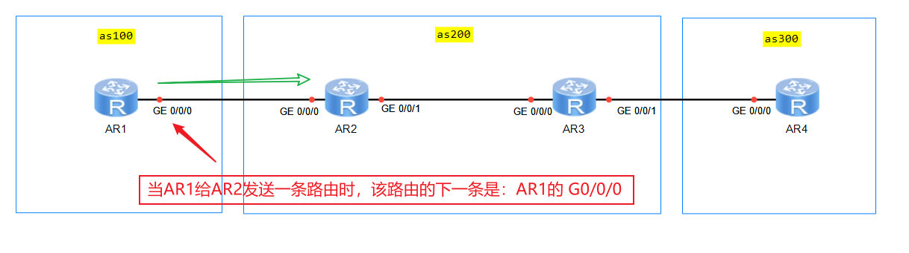​

* 路由器在收到EBGP对等体所通告的BGP路由后，在将路由传递给自己的IBGP对等体时，会保持路由的 Next_Hop属性值不变。

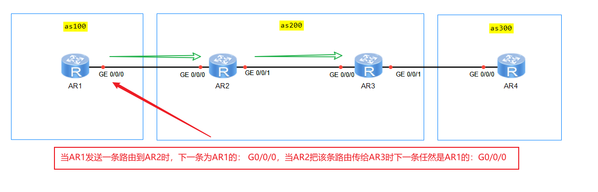​

如上图所示，==此时AR3虽然已经收到了该条路由，但是因为AR1的g0/0/0地址不可达，所以该路由是无效的==。

为了修复此问题，我们在AR2上配置时必须使用下面的命令来解决此问题：

```shell
bgp 200
peer x.x.x.x next-hop-local   #意思就是，传给AR3时下一条使用本地的源地址，即AR2的G0/0/1
```

* 如果路由器收到某条BGP路由，该路由的Next_Hop属性值与EBGP对等体（更新对象）同属一个网段，那么该条路由的Next_Hop地址将保持不变并传递给它的BGP对等体。

‍

#### 可选属性

可选属性不需要都被BGP路由器所识别。

可选属性可以分为两类：

* 可选过渡（OptionalTransitive）：BGP设备不识别此类属性依然会接受该类属性并通告给其他对等体。
* 可选非过渡（OptionalNon-transitive）：BGP设备不识别此类属性会忽略该属性，且不会通告给其他对等体。

##### Local_Preference

Local_Pref属性表明路由器的BGP优先级，用于判断流量离开AS时的最佳路由。该属性为公认任意

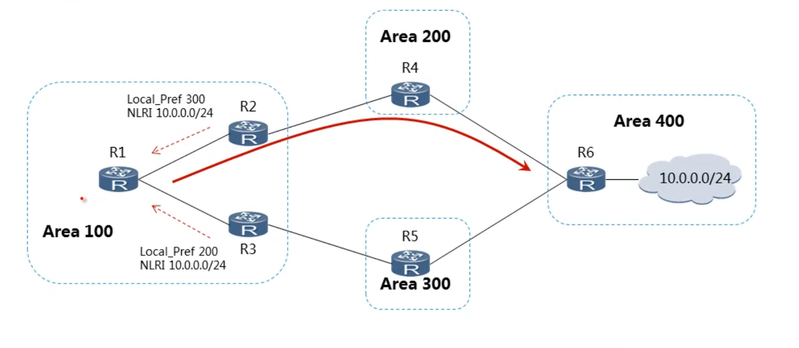​

例如上图，当数据离开R1时，可以通过修改Local_Pref的值来调整路由的选路，数值越大越优先。

#### 可选非过度

##### MED

MED属性相当于IGP的代价值，用于判断流量进入AS时的最佳路由，即用来影响邻居AS流量进入本AS的最佳路径，该属性为可选非过渡

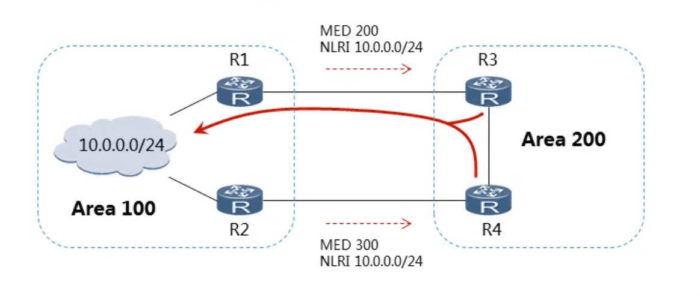​

如上图所示，有一条路由10.0.0.0./24，通告到AS100中，当AS200中R3、R4学到10.0.0.0./24这条路由之后，给AS100发送数据包时，就可以通过MED值来控制选路，MED值越小越优先。

### 可选过度

##### 团体属性

团体属性用于标识具有相同特征的BGP路由，该属性为可选过渡

团体属性分为：

* 自定义团体属性

* 公共团体属性

  * Internet
  * No_Advertise
  * No_Export
  * No_Export_Subconfed

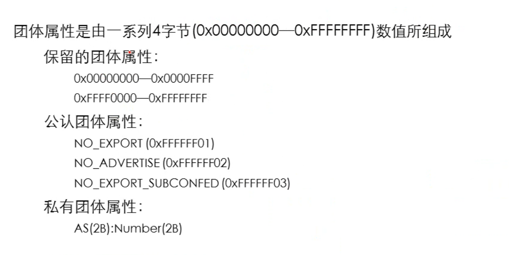​

公认团体属性是公认的，具有全球意义。公认的团体有：

* NO_ADVERTISE(OxFFFFFFFO2)：路由器收到带有这一团体值的路由后，不应把该路由通告给  
  任何的BGP对等体。
* NO_EXPORT(OxFFFFFFFO1)：路由器收到带有这一团体值的路由后，不应把该路由通告给一个联盟之外的对等体(本AS传递)。
* NO_EXPORT_SUBCONFED(OxFFFFFFFO3)：路由器收到带有这一团体值的路由后，可以把该路由通告给它的IBGP对等体，但不应通告给任何的EBGP对等体（包括联盟内的EBGP对等体，本小AS传递）。

## BGP的选路规则

当到达同一目的地存在多条路由时，BGP采取如下策略进行路由选择：

* 如果此路由的下一跳不可达，忽略此路由
* 优选协议首选值（PrefVal）最高的路由
* 优选本地优先级（Local_Pref）最高的路由
* 优选本地生成的路由
* 优选AS路径（AS_Path）最短的路由
* 比较Origin属性，依次优选Origin类型为IGP、EGP、Incomplete的路由
* 优选MED值最低的路由
* ==优选从EBGP邻居学来的路由（EBGP路由优先级高于IBGP路由）==​
* 优选到BGP下一跳IGPMetric较小的路由
* 当以上全部相同，则为等价路由，可以负载分担  
  ==注：AS_PATH必须一致；当负载分担时，以下3条原则无效==
* 优选Cluster_List最短的路由
* 优选Originator_ID或者RouterID最小的路由器发布的路由
* 比较对等体的IP Address，优选从具有较小IP Address的对等体学来的路由。

‍
