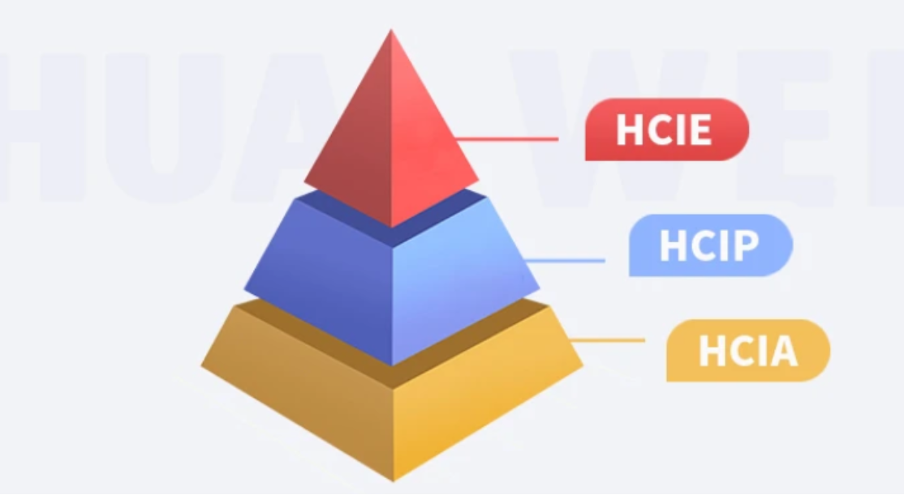

> 》doc 》huawei
>

学习网络技术，核心是掌握理论。思科、华为、H3C三家的底层原理相通，精通其中一家，另外两家自然一通百通。目前华为的教程和资料最多，建议选华为作为起点。至于是否考证，看个人需求——考试费大约相当于一个月的工资，自己权衡就好。

华为认证体系是华为公司凭借多年ICT人才培养经验及对行业发展的深刻理解，覆盖路由交换、安全、无线局域网、SDN、存储、云计算、大数据、数据中心、云服务等16个技术领域，由低到高分为HCIA、HCIP、HCIE三个等级，是唯一的ICT全技术领域认证体系。

| 课程阶段                          | 课程内容                                     |
| --------------------------------- | -------------------------------------------- |
| **HCIA（14天0基础入门班）**       | 数据封装与解封装                             |
|                                   | 静态路由和动态路由协议                       |
|                                   | 交换机基本工作原理及环路避免                 |
|                                   | 小型园区网络运维                             |
| **HCIP（45天实战进阶班）**        | 交换机高级特性与链路聚合                     |
|                                   | 高级路由协议及其特性（OSPF、IS-IS、BGP）     |
|                                   | MPLS协议及MPLS VPN                           |
|                                   | 组播及QoS                                    |
|                                   | 中小型企业网络规划设计、部署和运维           |
| **HCIE（30天网络架构理论班）**    | IPv4路由协议的高级特性                       |
|                                   | IPv6技术及双栈的应用                         |
|                                   | MPLS VPN跨域及SDN技术                        |
|                                   | 大中型企业应用独立规划设计、部署、运维和优化 |
| **实验与面试（120天原厂实战班）** | HCIE排错真题演练                             |
|                                   | HCIE诊断真题演练                             |
|                                   | HCIE实验真题演练                             |
|                                   | HCIE真题模拟面试                             |

## 知识点/学习路线

* [01.华为HCIE的考证机制](doc/huawei/01.华为HCIE的考证机制)
* [02.OSI七层与TCP-IP协议栈](doc/huawei/02.OSI七层与TCP-IP协议栈)
* [03.IP地址分类及子网划分详解](doc/huawei/03.IP地址分类及子网划分详解)
* [04.常用网络命令](doc/huawei/04.常用网络命令)
* [05.华为设备入门基本配置](doc/huawei/05.华为设备入门基本配置)
* [06.VLAN划分与通信](doc/huawei/06.VLAN划分与通信)
* [07.给予接口的DHCP](doc/huawei/07.给予接口的DHCP)
* [08.ACL访问控制列表详解](doc/huawei/08.ACL访问控制列表详解)
* [09.链路聚合](doc/huawei/09.链路聚合)
* [10.STP协议的详解](doc/huawei/10.STP协议的详解)
* [11.MSTP多区域生成树协议](doc/huawei/11.MSTP多区域生成树协议)
* [12.默认路由与静态路由](doc/huawei/12.默认路由与静态路由)
* [13.二三层接口转换](doc/huawei/13.二三层接口转换)
* [14.企业内部DHCP中继实验](doc/huawei/14.企业内部DHCP中继实验)
* [15.RIP动态路由协议](doc/huawei/15.RIP动态路由协议)
* [16.IPv6基础](doc/huawei/16.IPv6基础)
* [17.NAT核心知识点梳理](doc/huawei/17.NAT核心知识点梳理)
* [18.VRRP协议的深度剖析](doc/huawei/18.VRRP协议的深度剖析)
* [19-01.ospf基础概念](doc/huawei/19-01.ospf基础概念)
* [19-02.OSPF的基本配置实验](doc/huawei/19-02.OSPF的基本配置实验)
* [19-05.通过修改ospf的COST值来控制路由选路](doc/huawei/19-05.通过修改ospf的COST值来控制路由选路)
* [19-09.CSDN-OSPF全网最详解-理论及配置](doc/huawei/19-09.CSDN-OSPF全网最详解-理论及配置)
* [20.ppp协议](doc/huawei/20.ppp协议)
* [21-1.PPPoE模拟拨号实验](doc/huawei/21-1.PPPoE模拟拨号实验)
* [21-2.PPPOE模拟内外网实验及NAT配置](doc/huawei/21-2.PPPOE模拟内外网实验及NAT配置)
* [22.ISIS协议的基本原理与配置](doc/huawei/22.ISIS协议的基本原理与配置)
* [23.Wlan无线技术](doc/huawei/23.Wlan无线技术)
* [24.AP上线实验](doc/huawei/24.AP上线实验)
* [25-VPN技术2-GREoverIPsec先加密后隧道VPN](doc/huawei/25-VPN技术2-GREoverIPsec先加密后隧道VPN)
* [25-VPN技术3-纯IPSecVPN](doc/huawei/25-VPN技术3-纯IPSecVPN)
* [25.VPN技术1-IPsec加密GRE隧道VPN](doc/huawei/25.VPN技术1-IPsec加密GRE隧道VPN)
* [26.组播](doc/huawei/26.组播)
* [27.虚拟路由冗余协议VRRP](doc/huawei/27.虚拟路由冗余协议VRRP)
* [28.MSTP+VRRP组网实验](doc/huawei/28.MSTP+VRRP组网实验)
* [29.BGP](doc/huawei/29.BGP)
* [30-1.MPLS-VPN基础理论部分](doc/huawei/30-1.MPLS-VPN基础理论部分)
* [30-2.MPLS-VPN配置实验与思路](doc/huawei/30-2.MPLS-VPN配置实验与思路)
* [30-3.MPLS环路检测机制](doc/huawei/30-3.MPLS环路检测机制)
* [30-4.MPLS动态LSP配置实验](doc/huawei/30-4.MPLS动态LSP配置实验)
* [30-5.MPLS静态LSP配置实验](doc/huawei/30-5.MPLS静态LSP配置实验)
* [31.堆叠](doc/huawei/31.堆叠)
* [32.华为防火墙](doc/huawei/32.华为防火墙)
* [33.中恒普瑞与集团VPN对接项目](doc/huawei/33.中恒普瑞与集团VPN对接项目)
* [50.MPLS动态LSP配置实验](doc/huawei/50.MPLS动态LSP配置实验)
* [51.BGP基础笔记](doc/huawei/51.BGP基础笔记)
* [9998.企业内部华为核心交换机的常用限速方法](doc/huawei/9998.企业内部华为核心交换机的常用限速方法)
* [9999..ENSP和HCI共存方法](doc/huawei/9999..ENSP和HCI共存方法)

## 实验部分

## 项目实战

- [33、中恒普瑞与集团VPN对接项目](doc/huawei/33、中恒普瑞与集团VPN对接项目)

