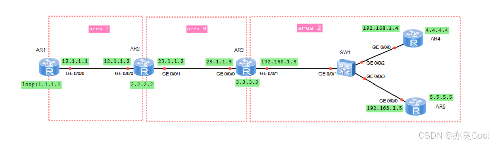

# 华为路由器：多区域OSPF协议实验

## 一、划分区域的作用
（面试重点）
### 1.为什么要划分区域？
对于一个单区域的OSPF网络，随着网络规模的扩大，会导致如下问题：

> LSDB过于庞大，占用大量的存储空间 SPF算法运行的复杂度增加，加重CPU的负担 路由器之间同步的时间变长
> 网络拓扑可能变化的几率增大，占用网络带宽，降低了路由的准确性。
> 那么如何解决以上的问题呢？==减少LSA的数量== 减少网络变换波及的范围 而划分区域就是用来解决上面的一系列问题。

### 2.划分区域有什么好处？
减少LSA泛洪从而减少LSDB负载，可通过ABR进行路由汇总，减少路由条目信息，减少路由器资源。

> 怎么划分区域？划分区域需要注意什么？ 非骨干区域必须要和骨干区域直连； 骨干区域不能分离
> 区域是基于链路或者说是基于接口的
> 划分区域减少了哪些LSA？部分数据库仅在区域内部同步， 划分区域减少了区域内部路由器数据库条目，因为LSA-1和2仅在本区域内泛洪，实现了故障隔离，本区域网络故障不会再其他区域路由收敛；
> 方便扩充网络便于管理及维护

## 二、多区域实验

对于新手而言，要想不迷糊，就得先把图画好。该标的都标在图上，这样才会减少出错的几率。


注意：我们给每个路由器配置一个`LoopBack`接口，用来做`routeID`.

### 1.基础配置
先安装拓扑图把IP配置好，后面我们在进行OSPF的配置。为了测试效果，我们给每个路由器上面再配置一个`LoopBack`

AR1
```bash
<Huawei>sy
Enter system view, return user view with Ctrl+Z.
[Huawei]sy ar1

[ar1]int g0/0/0
[ar1-GigabitEthernet0/0/0]ip add 12.1.1.1 24
Jul 12 2022 15:58:20-08:00 ar1 %%01IFNET/4/LINK_STATE(l)[0]:The line protocol IP
 on the interface GigabitEthernet0/0/0 has entered the UP state. 
[ar1-GigabitEthernet0/0/0]q
[ar1]int lo 0
[ar1-LoopBack0]ip add 1.1.1.1 24
[ar1-LoopBack0]q
```

AR2
```bash
[Huawei]sy ar2
[ar2]int g0/0/0
[ar2-GigabitEthernet0/0/0]
[ar2-GigabitEthernet0/0/0]ip add 12.1.1.2 24
Jul 12 2022 16:01:15-08:00 ar2 %%01IFNET/4/LINK_STATE(l)[0]:The line protocol IP
 on the interface GigabitEthernet0/0/0 has entered the UP state. 
[ar2-GigabitEthernet0/0/0]q

[ar2]int g0/0/1
[ar2-GigabitEthernet0/0/1]ip add 23.1.1.2 24
Jul 12 2022 16:01:45-08:00 ar2 %%01IFNET/4/LINK_STATE(l)[1]:The line protocol IP
 on the interface GigabitEthernet0/0/1 has entered the UP state. 
[ar2-GigabitEthernet0/0/1]q
```

AR3

```bash
<Huawei>sy
Enter system view, return user view with Ctrl+Z.
[Huawei]sy ar3
[ar3]

[ar3]int g0/0/0
[ar3-GigabitEthernet0/0/0]ip add 23.1.1.3 24
Jul 12 2022 16:10:30-08:00 ar3 %%01IFNET/4/LINK_STATE(l)[0]:The line protocol IP
 on the interface GigabitEthernet0/0/0 has entered the UP state. 
[ar3-GigabitEthernet0/0/0]q

[ar3]int g0/0/1
[ar3-GigabitEthernet0/0/1]ip add 192.168.1.3 24
Jul 12 2022 16:10:49-08:00 ar3 %%01IFNET/4/LINK_STATE(l)[1]:The line protocol IP
 on the interface GigabitEthernet0/0/1 has entered the UP state. 
[ar3-GigabitEthernet0/0/1]q
[ar3]
[ar3]int LoopBack 0
[ar3-LoopBack0]ip add 3.3.3.3 24
[ar3-LoopBack0]q

```
AR4

```bash
<Huawei>
<Huawei>sy
Enter system view, return user view with Ctrl+Z.
[Huawei]sy ar4
[ar4]
[ar4]int g0/0/0
[ar4-GigabitEthernet0/0/0]ip add 192.168.1.4 24
Jul 12 2022 16:17:49-08:00 ar4 %%01IFNET/4/LINK_STATE(l)[0]:The line protocol IP
 on the interface GigabitEthernet0/0/0 has entered the UP state. 
[ar4-GigabitEthernet0/0/0]q

[ar4]int LoopBack 0
[ar4-LoopBack0]ip add 4.4.4.4 24
[ar4-LoopBack0]q
[ar4]
[ar4]

```
AR5

```bash
<Huawei>sy
Enter system view, return user view with Ctrl+Z.
[Huawei]sy ar5
[ar5]in g0/0/0
[ar5-GigabitEthernet0/0/0]ip add 192.168.1.5 24
Jul 12 2022 16:20:30-08:00 ar5 %%01IFNET/4/LINK_STATE(l)[0]:The line protocol IP
 on the interface GigabitEthernet0/0/0 has entered the UP state. 
[ar5-GigabitEthernet0/0/0]q

[ar5]int LoopBack 0
[ar5-LoopBack0]ip add 5.5.5.5 24
[ar5-LoopBack0]q

[ar5]int LoopBack 1
[ar5-LoopBack1]ip add 8.8.8.8 24
[ar5-LoopBack1]q
[ar5]
```
### 2.OSPF的配置
配置之前我们先复习一下OSPF的语法：

```bash
ospf 1 router-id x.x.x.x     #自治区域ID和router-id
area 1                       #区域ID：1、0、2
network 12.1.1.0 0.0.0.255   #宣告网段
q
```

AR1
```bash
[ar1]ospf router-id 1.1.1.1
[ar1-ospf-1]area 1
[ar1-ospf-1-area-0.0.0.1]network 12.1.1.0 0.0.0.255	
[ar1-ospf-1-area-0.0.0.1]network 1.1.1.0 0.0.0.255
[ar1-ospf-1-area-0.0.0.1]
```
AR2

```bash
[ar2]ospf router-id 2.2.2.2
[ar2-ospf-1]area 1
[ar2-ospf-1-area-0.0.0.1]network 12.1.1.0 0.0.0.255
[ar2-ospf-1-area-0.0.0.1]q
[ar2-ospf-1]

[ar2-ospf-1]area 0
[ar2-ospf-1-area-0.0.0.0]network 23.1.1.0 0.0.0.255
[ar2-ospf-1-area-0.0.0.0]network 2.2.2.0 0.0.0.255
[ar2-ospf-1-area-0.0.0.0]q
[ar2-ospf-1]

```
AR3

```bash
[ar3]ospf router-id 3.3.3.3
[ar3-ospf-1]area 0	
[ar3-ospf-1-area-0.0.0.0]network 23.1.1.0 0.0.0.255	
[ar3-ospf-1-area-0.0.0.0]network 3.3.3.0 0.0.0.255
[ar3-ospf-1-area-0.0.0.0]q

[ar3-ospf-1]area 2
[ar3-ospf-1-area-0.0.0.2]network 192.168.1.0 0.0.0.255
[ar3-ospf-1-area-0.0.0.2]
[ar3-ospf-1-area-0.0.0.2]

```
AR4

```bash
[ar4]ospf router-id 4.4.4.4
[ar4-ospf-1]area 2	
[ar4-ospf-1-area-0.0.0.2]network 192.168.1.0 0.0.0.255 

[ar4-ospf-1-area-0.0.0.2]network 4.4.4.0 0.0.0.255
[ar4-ospf-1-area-0.0.0.2]
```
AR5
```bash
[ar5]ospf router-id 5.5.5.5
[ar5-ospf-1]area 2
[ar5-ospf-1-area-0.0.0.2]network 192.168.1.0 0.0.0.255
[ar5-ospf-1-area-0.0.0.2]network 5.5.5.0 0.0.0.255
[ar5-ospf-1-area-0.0.0.2]q
[ar5-ospf-1]q
[ar5]q
```
##  三、查看OSPF
### 查看R1的整个路由表
```bash
<ar1>dis ip routing-table
Route Flags: R - relay, D - download to fib
------------------------------------------------------------------------------
Routing Tables: Public
         Destinations : 16       Routes : 16       

Destination/Mask    Proto   Pre  Cost      Flags NextHop         Interface

        1.1.1.0/24  Direct  0    0           D   1.1.1.1         LoopBack0
        1.1.1.1/32  Direct  0    0           D   127.0.0.1       LoopBack0
      1.1.1.255/32  Direct  0    0           D   127.0.0.1       LoopBack0
        2.2.2.2/32  OSPF    10   1           D   12.1.1.2        GigabitEthernet0/0/0
        3.3.3.3/32  OSPF    10   2           D   12.1.1.2        GigabitEthernet0/0/0
        4.4.4.4/32  OSPF    10   3           D   12.1.1.2        GigabitEthernet0/0/0
        5.5.5.5/32  OSPF    10   3           D   12.1.1.2        GigabitEthernet0/0/0
       12.1.1.0/24  Direct  0    0           D   12.1.1.1        GigabitEthernet0/0/0
       12.1.1.1/32  Direct  0    0           D   127.0.0.1       GigabitEthernet0/0/0
     12.1.1.255/32  Direct  0    0           D   127.0.0.1       GigabitEthernet0/0/0
       23.1.1.0/24  OSPF    10   2           D   12.1.1.2        GigabitEthernet0/0/0
      127.0.0.0/8   Direct  0    0           D   127.0.0.1       InLoopBack0
      127.0.0.1/32  Direct  0    0           D   127.0.0.1       InLoopBack0
127.255.255.255/32  Direct  0    0           D   127.0.0.1       InLoopBack0
    192.168.1.0/24  OSPF    10   3           D   12.1.1.2        GigabitEthernet0/0/0
255.255.255.255/32  Direct  0    0           D   127.0.0.1       InLoopBack0
```

### 仅查看ospf的路由
```bash
<ar1>dis ip routing-table protocol ospf
Route Flags: R - relay, D - download to fib
------------------------------------------------------------------------------
Public routing table : OSPF
         Destinations : 6        Routes : 6        

OSPF routing table status : <Active>
         Destinations : 6        Routes : 6

Destination/Mask    Proto   Pre  Cost      Flags NextHop         Interface

        2.2.2.2/32  OSPF    10   1           D   12.1.1.2        GigabitEthernet0/0/0
        3.3.3.3/32  OSPF    10   2           D   12.1.1.2        GigabitEthernet0/0/0
        4.4.4.4/32  OSPF    10   3           D   12.1.1.2        GigabitEthernet0/0/0
        5.5.5.5/32  OSPF    10   3           D   12.1.1.2        GigabitEthernet0/0/0
       23.1.1.0/24  OSPF    10   2           D   12.1.1.2        GigabitEthernet0/0/0
    192.168.1.0/24  OSPF    10   3           D   12.1.1.2        GigabitEthernet0/0/0

OSPF routing table status : <Inactive>
         Destinations : 0        Routes : 0
```

### 查看R1邻居表
```bash
<ar1>dis ospf peer brief

	 OSPF Process 1 with Router ID 1.1.1.1
		  Peer Statistic Information
 ----------------------------------------------------------------------------
 Area Id          Interface                        Neighbor id      State    
 0.0.0.1          GigabitEthernet0/0/0             2.2.2.2          Full        
 ----------------------------------------------------------------------------
```

