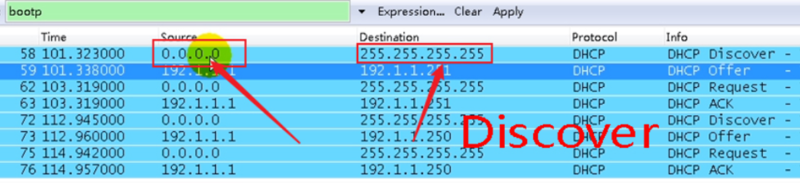
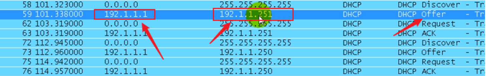
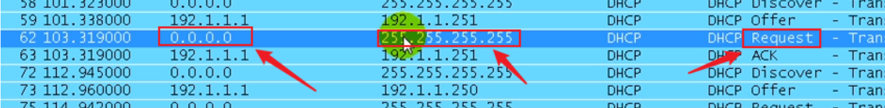
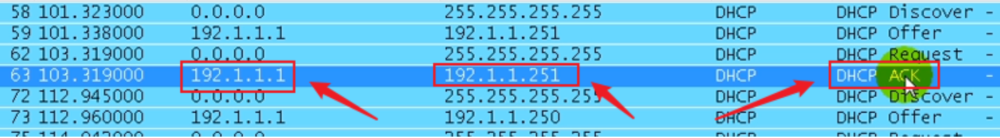
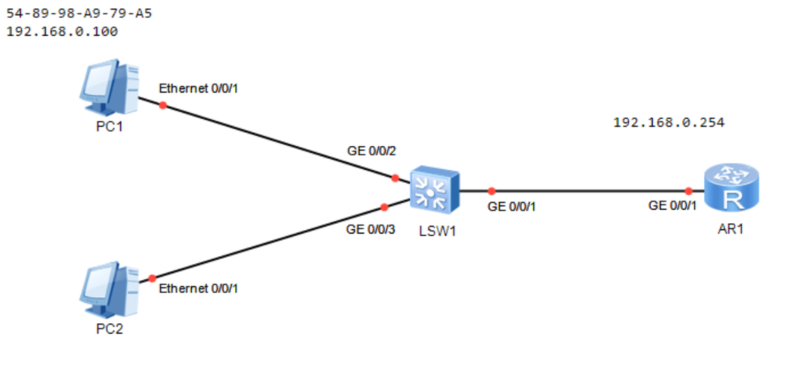

# DHCP详解、配置及实验


## 定义

DHCP也叫动态主机配置协议，负责管理和分配IP。

安装了DHCP协议的主机被称为DHCP服务器，服务器控制一段IP地址范围，其他主机可以从DHCP服务器自动获取IP地址、默认网关、DNS服务器地址等信息。

提示：DHCP协议是Windows Server 系统的一个服务组件，需要管理员手动安装和配置。

## 架构

DHCP是C/S架构（客户机/服务器）架构

DHCP服务器对应传输层的UDP协议，因为是C/S架构，所以DHCP服务器分为：

- 客户机占用UDP，67端口，
- DHCP服务器占用UDP 68号端口

在DHCP的中，有这么三个概念：

- DHCP服务器：负责分配IP地址的设备。
- DHCP客户端：想要获取IP地址的终端或设备。。
- DHCP中继：当服务器与客户端不在同一个网段时，需要DHCP中继。


## DHCP的报文

1. DHCP Discover 通过广播寻找DHCP服务器
2. DHCP Offer 服务器用来响应客户端的DHCP Discover报文，并指定相应的配置参数；
3. DHCP Request 由客户端发送给服务器的广播报文，目的是用来通知其他服务器是否使用了服务器分配的地址，同时该报文还有续租的作用；
4. DHCP ACK 由服务器到客户端，含有配置参数，包含IP地址；


## 抓包分析

<font color='red'>抓包工具过滤需要敲入bootp 输入DHCP是无法识别的</font>

### Discover

源地址0.0.0.0 ，目标地址：255.255.255.255 可见其使用的是广播。




### Offer

源地址：192.1.1.1 就是DHCP服务器地址，目标地址：192.168.1.254 就是给客户端分配的地址



### Request

源地址依然是0.0.0.0 ，目标地址依然是：255.255.255.255 好像觉得这一步优点多余，其实不是的，这一步就是跟服务器确认.告诉dhcp服务器，你给我分配的地址我到底有没有用。如果局域网中有多台dhcp服务器，那就必须告诉服务器，我用的是哪一个地址。对于服务器来说，你如果用了我分配给你的地址那就给你用，如果你没用，我就收回。



### ACK

源地址：192.1.1.1 目标地址：192.1.1.251 意思就是说：路由器确认你要了192.1.1.1这台DHCP的地址192.1.1.251，其他的服务器分配给我的，我没要。并且开始计时。




## DHCP租期

租期的目的：合理有效的使用IP地址

假如DHCP给你的租期是10小时，当你用到5个小时的时候，DHCP会主动询问客户端你还要不要使用这个地址，如果你回应说还要用，那么DHCP会将你之前的使用时间清零，重新计时，租期任然10小时；如果你没有回应，则收回该地址。如果你一直续租则会永远循环下去，每隔5小时问你一次。

```
[R1-ip-pool-pokes]lease ?
day        Day, from 0 to 999   #按天计算
unlimited  Unlimited            #不限期限
[R1-ip-pool-pokes]lease day 1     #租约1天
[R1-ip-pool-pokes]lease day 0 hour 20    #租约20小时
```

## 绑定MAC分配静态IP地址

```
[R1-ip-pool-pokes]static-bind ip-address 192.168.0.100 mac-add 5489-98A9-79A5
Error:The static-MAC is exist in this IP-pool.   #说这个MAC已经在地址池中了
[R1-ip-pool-pokes]static-bind ip-address 192.168.0.100 mac-add 5489-98A9-79A5
```

## 释放地址

```
ipconfig /release
```


## DHCP的基本配置

案例1：R1路由器开启DHCP功能，为PC1和PC2分配IP地址，租约20小时，其中PC1固定获取：192.168.0.100。网关192.168.0.254，DNS：8.8.8.8



```
<Huawei>sys
Enter system view, return user view with Ctrl+Z.
[Huawei]sys R1
[R1]un in en

[R1]int g0/0/1
[R1-GigabitEthernet0/0/1]ip add 192.168.0.1 24
[R1]dhcp enable                     #开启dhcp
[R1]ip pool pokes                   #创建一个pokes的地址池
[R1-ip-pool-pokes]network 192.168.0.0 mask 24    #网段是192.168.0.0/24
[R1-ip-pool-pokes]gateway-list 192.168.0.254     #网关
[R1-ip-pool-pokes]dns-list 8.8.8.8               #DNS
[R1-ip-pool-pokes]lease day 0 hour 20            #租约20小时
[R1-ip-pool-pokes]static-bind ip-address 192.168.0.100 mac-add 5489-98A9-79A5   #绑定mac和IP
[R1-ip-pool-pokes]q


[R1]int g0/0/1
[R1-GigabitEthernet0/0/1]dhcp select ?    #我们看到后面可以跟三个选项，后面我们会说明
  global     Local server                 #global 全局地址池，全局本地服务器
  interface  Interface server pool        #interface 接口接口服务器池
  relay      DHCP relay                   #DHCP中继
[R1-GigabitEthernet0/0/1]dhcp select global   #global是全局的意思，暂时选则global参数
[R1-ip-pool-pokes]excluded-ip-address 192.168.0.250 192.168.0.253   #排除192.168.0.250-253，保留

Warning:Some of addresses not be excluded are not idle,or not in the pool.  
#说是这个范围已经有设备占用，不用理会。这里只是一个警告不是报错，下次自动获取就好了。
```


## DHCP中继

当服务器与客户端不在同一个网段时，就需要DHCP中继。

### 案例2：DHCP中继

https://blog.csdn.net/annita2019/article/details/109586076

### 案例3：DHCP在大企业中的应用

部署Server2008-DHCPserver为局域网的客户端跨vlan分配IP地址。

https://pokes.blog.csdn.net/article/details/124699699

### 案例4：核心交换机基于接口的DHCP

https://pokes.blog.csdn.net/article/details/118639767