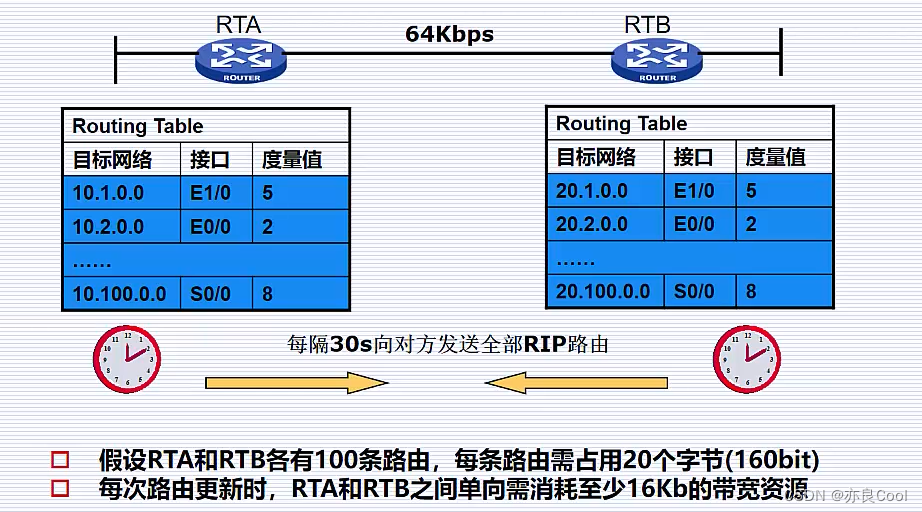
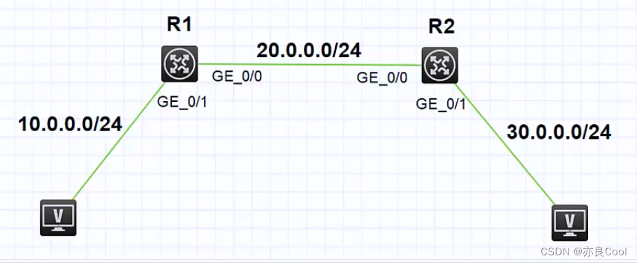
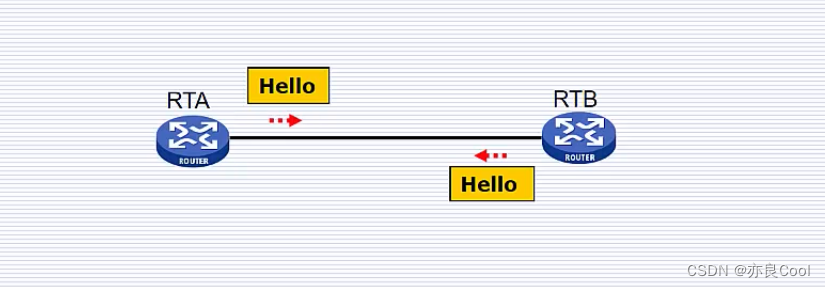
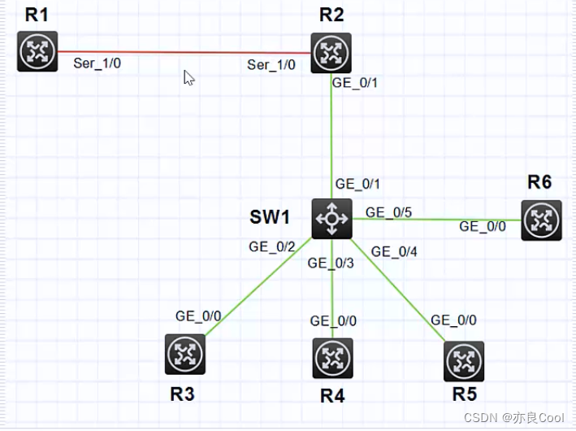
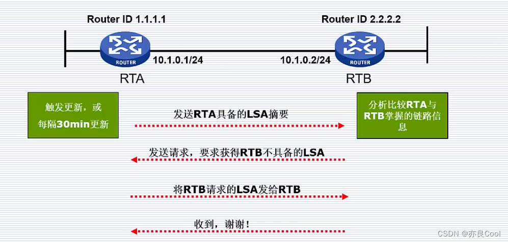
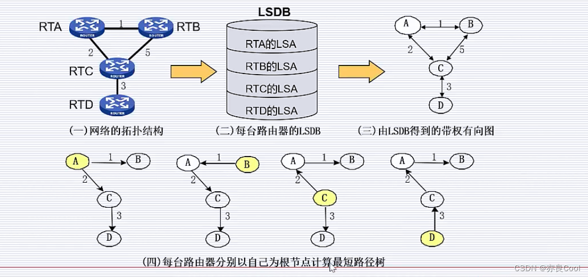
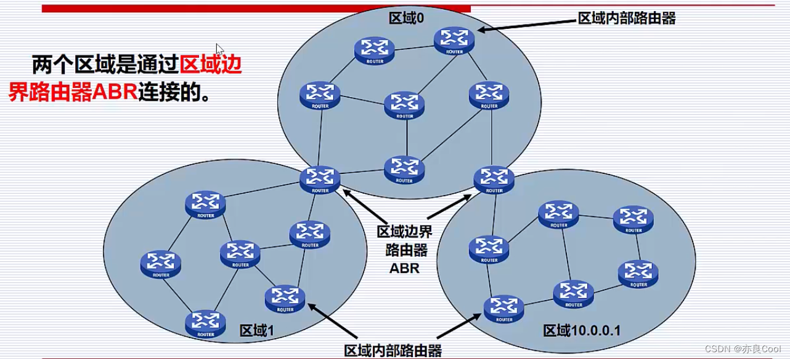

# 十分钟理解OSPF路由协议

源视频：https://www.bilibili.com/video/BV1YV41127U5/?spm_id_from=333.337.search-card.all.click&vd_source=9dc23d072b0edbf78ffed52f1fcb2318

有 RIP 协议，为什么还需要 OSPF？

### 1.RIP 的缺陷

#### 以跳数为度量值

在开始之前我们先回忆一下 RIP 协议，RIP 协议是以跳数作为度量值，这是它的缺陷。如下图：RIP 协议会从上面 64Kbs 到达 10.2.0.0，但是很明显下面的带宽 1Gbps，下面应该更快，但是因为下面有 3 跳，上面只有 2 跳。

#### 最大跳数为 15

#### 更新路由表采用全更新

#### 收敛速度慢

### 2.RIP 与 OSPF 比较

<table><thead><tr><th>摘要</th><th>RIP</th><th>OSPF</th></tr></thead><tbody><tr><td>协议</td><td>距离矢量路由协议</td><td>链路状态路由协议</td></tr><tr><td>度量值</td><td>基于跳数选择最优路径</td><td>基于链路开销选择最优路径</td></tr><tr><td>路由表更新</td><td>每隔 30s 向邻居广播自己的整个 RIP 路由表</td><td>触发更新或每隔 30 分钟向邻接路由器发送链路状态信息的摘要，增量更新机制</td></tr></tbody></table>
### OSPF 概述

*   工作于 IP 层之上，IP 协议号为 89
    
*   以组播地址 224.0.0.5 发送协议包
    
*   基本思想：每个路由器将其已知的链路状态信息告诉邻居，收敛以后，网络上每个路由器对全网的链路状态有相同的认识。然后，每台路由器根据了解到的全网链路状态，独立计算路由。
    

如下图：R1 和 R2 之间运行了 OSPF

#### 运行 OSPF 协议之前

1.  对于 R1 来说，R1 知道自己有两个直连接口，分别是：GE/0/1，10.0.0.0/24，开销是 1G。GE/0/0，20.0.0.0/24，开销是 1G。R1 最初也只知道这么多信息。
2.  对于 R2 来说也是一样的，R2 知道自己有两个直连接口网段分别是：GE/0/1，30.0.0.0/24，开销是 1G。GE/0/0，20.0.0.0/24，开销是 1G，R2 最初也只知道这么多信息。

#### 运行 OSPF 协议之后

R1 和 R2 会相互交流，交流方式是 R1 会问 R2 我知道的链路信息是 GE/0/1-10.0.0.0/24 和 GE/0/0-20.0.0.0/24，你对哪个感兴趣？

R2 查看自己的链路信息，20 和 30 段我已经有了，但是我不知道 10 段，我想知道 10 段的信息，于是 R1 就把 10 段完整的信息发给了 R2。这样 R2 就会学到 10 段的链路信息。同样的 R1 对 R2 说我想知道 30 段完整的信息，于是 R2 就把 10 段的信息发给了 R1，这样 R1 就会学到 30 段的链路信息。

最终的结果就是：R1 就会知道在这个网络中还有一个路由器 R2，并且这个网络中有 3 个网段分别是 10，20，30，30 段直连在 R2 上面。同样 R2 也会知道全网信息。

### 3.OSPF 协议工作过程

#### 1. 发现邻居

*   通过组播发送 hello 包
*   所有邻居都可能跟自己交换链路状态信息

相互发送 hello 包，hello 包中有他们建立邻居所需的必要参数，相互收到 hello 包确认参数符合之后，那他们会相互认定对方是自己的邻居。并且把自己的邻居信息存到自己的邻居表。那邻居有什么作用呢？正如我们上面所说的第二点所有邻居都可能跟自己交换链路状态信息。**那为什么是可能？**接着往下看

#### 2. 建立邻接关系

*   只有建立邻接关系的邻居路由器才会交换链路状态信息
*   不是跟所有邻居都建立邻接关系
*   在网络中选举 DR 和 BDR，网络内所有路由器只与 DR 和 BDR 建立邻接关系
*   广播型网络中会选 DR 和 B DR，PPP 网络中不会选举 DR 和 BDR

**为什么要选 DR 和 BDR？**

如下左图，5 台设备两两交换链路信息，需要交换 10 次。这种效率太低。

如下右图中我们可以选举一个组长，只需要将所有的链路信息教给组长 DR，组长进行汇总然后下发汇总后的路由表即可。一个组长单点故障，我们再选一个副组长 BDR，组长挂了副组长来顶替，这样就更可靠。目的是啥？**“只与 DR 和 BDR 建立邻接关系”** 尽可能的减少邻接关系的数量，说白了就是交换的次数，从而提高了交换链路状态信息的效率。

第四点：广播型网络中会选 DR 和 B DR，PPP 网络中不会选举 DR 和 BDR

我们普通的网络一般都是广播型的网络，如下图：R1 和 R2 之间使用的串口相连，我确定了 R1 和 R2 之间的广播域只有两个接口，不会有第三个接口出现，所以这种点对点的网络是不需要 DR 和 BDR 的。

#### 3. 传递链路状态信息

*   每台设备都有一个 LSDB（Link State Database, 链路状态数据库）
    
*   LSDB 中每一条就是 LSA（Link State Advertisement，链路状态公告）：描述链路状态信息，例如网络中某台路由器的编号是什么，其直连的网段是什么，开销是多少等
    

**如何交换链路状态信息？**

*   触发更新或每隔 30 分钟更新一次。触发更新：如果网络发生变化，不需要等到 30 分钟周期，立刻向邻居发送信息。
*   增量更新机制，只发邻居需要的 LSA
*   收敛以后，区域内所有路由器具有相同的 LSDB。这个 LSDB 能体现全网的链路状态（该网络中有哪些路由器，各自编号是什么，每台路由器直连的网段是什么，开销是多少）

#### 4. 计算路由

如下图：刚开始所有路由器都只知道自己直连的信息，当他们通过交换信息收敛之后，所有路由器上的 LSDB 都是相同的，所有的路由器都知道全网的信息，相当于上帝视角。

### 4.OSPF 分区域管理

**为什么要分区域管理？**

因为 OSPF 在收敛的时候，每个路由器的 LSDB 都是相同的，并且这个 LSDB 可以体现出全网的状态 。当全网中路由器的数量增多，链路增多，每台设备需要维护的 LSDB 数量就非常多，会占用设备大量的内存，并且在收敛时占用大量的带宽资源，所以在这种情况下采用了分区域管理。

*   区域内的路由器只需要学到区域内的路由信息，即同一个区域内路由器才会建立邻居关系，交换 LSA。收敛后同一个区域内所有设备具有相同的 LSDB，这个 LSDB 反映了本区域内的链路状态，再计算区域内的路由；
    
*   区域边界路由器同时具备所在多个区域的路由信息，不同区域之间，由区域边界路由器 ABR 直接转发路由；
    
*   每个区域有一个 ID,ID 是 32 位二进制，可以表示为一个十进制数，也可以表示为点分十进制形式。例如：区域 0 等价于区域 0.0.0.0; 区域 1 等价于区域 0.0.0.1。
    
*   骨干区域——区域 0。
    
*   所有非骨干区域间通信都要通过骨干区域 0 转发。
    
*   如果网络中有不同的 ospf 区域，肯定有个区域是区域 0.