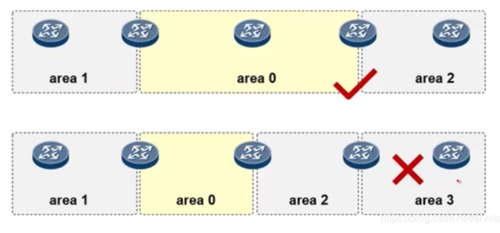
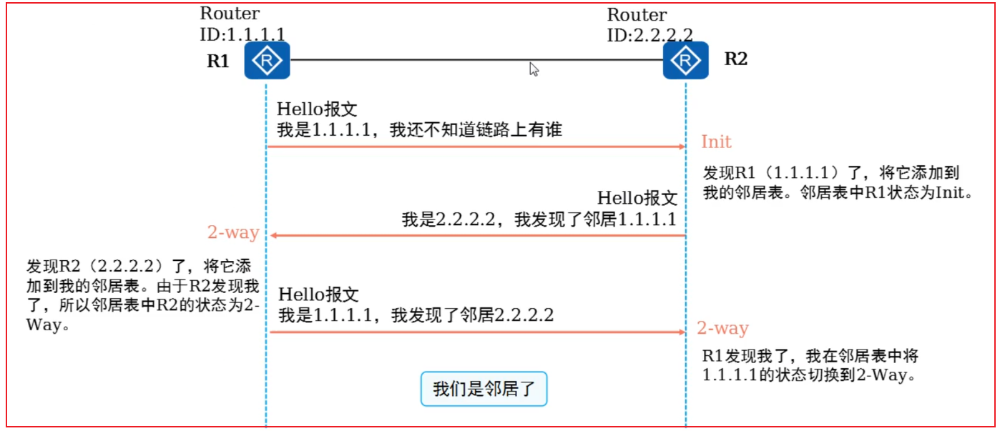
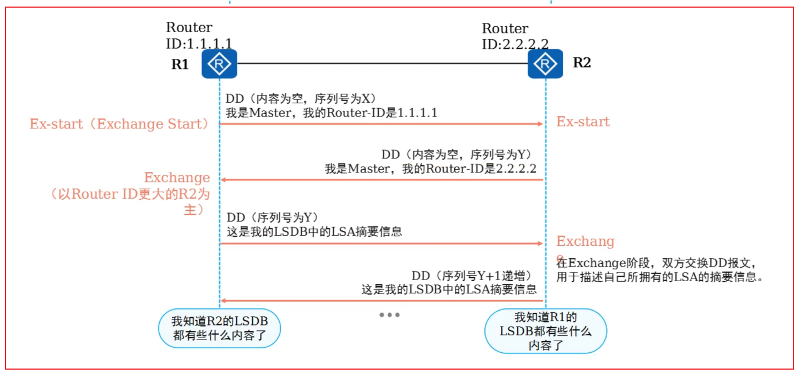
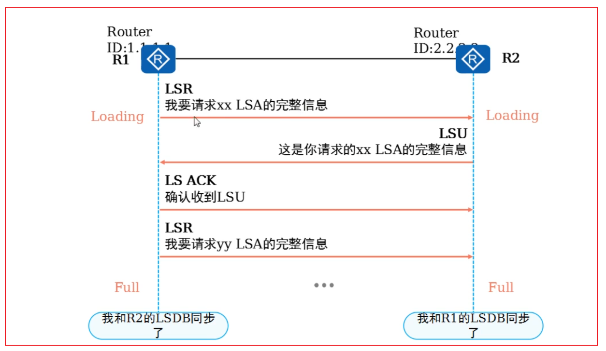
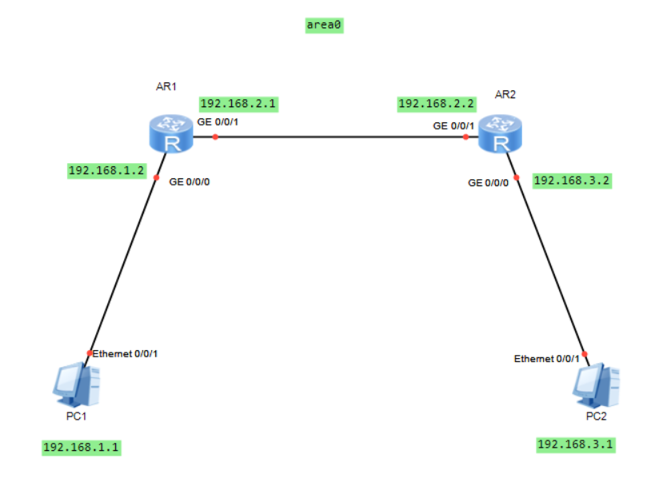

## 1.OSPF定义

开放式最短路径优先（Open Shortest Path First，OSPF）协议是一种为IP网络开发的内部网关路由选择协议。OSPF是典型得链路状态路由协议，是目前业内使用得非常广泛得IGP协议之一。OSPF全称是开放式最短路径优先。是IETF开发的一种链路状态路由协议，使<font color='red'>用基于带宽的度量值</font>。采用SPF算法计算路由，从算法上保证了无路由环路。通过邻居关系维护路由，避免定期更新对带宽进行的消耗。路由更新效率高，网络收敛快，适用大中型网络。

OSPF工作于IP层之上，<font color='red'>IP协议号为89</font>，以<font color='red'>组播</font>地址<font color='red'>224.0.0.5</font>发送协议包，每个路由器将其已知的链路状态信息告诉邻居，收敛以后，网络上每个路由器对全网的链路状态有相同的认识。然后，每台路由器根据了解到的全网链路状态，独立计算路由。<font color='red'>OSPF有两个版本，V2针对IPV4，V3针对IPV6</font>

## 2.Router-ID

Router-ID（Routerldentifier，路由器标识符），用于在 一个OSPF域中唯一地标识一台路由器。Router-ID的设定可 以通过手工配置的方式，或使用系统自动配置的方式。OSPFArea用于标识一个OSPF的区域。 区域是从逻辑上将设备划分为不同的组，每个组用区域 号（Area ID）来标识。

```
ospf 1 router-id 1.1.1.1 
area 0.0.0.0 
```

- 1为进程号，每运行一个OSPF就必须有一个进程号

- router-id是以IP地址得格式，并不是真真存在得IP地址

## 3.Area区域

### 划分区域的目的

- 减小了LSDB，降低了路由器的内存消耗并减轻了CPU SPF计算负担。
- 减小了LSA洪泛范围，有效地把拓扑变化控制在区域内,提高了 网络的稳定性。
- 在区域边界可以做路由汇总，减小了路由表，减轻了设备的数据转发负担。
- 提高了网络的拓展性，有利于组件大规模网络。

### 区域的分类

- area 0 骨干区域（核心区域）；
- area 1、2…其他都是常规区域；


<font color='red'>知识点：常规区域必须和主干区域直连</font>




## 4.OSPF原理

OSPF的工作过程分为3个大步骤：

1. 邻居建立阶段：OSPF路由器发送HELLO报文，建立和维护邻居关系。
2. 路由交换阶段：OSPF路由器发送DBD报文描述自己的LSDB，再用LSR（请求特定的LSA的报文 ），LSU（承载LSA的报文）交换自己缺少的LSA，使得双方的LSDB达到一致，即所有路由器知道网络的全局拓扑关系图。双方LSDB一致的标志是邻居达到FULL状态。
3. 路由计算阶段：通过SPF算法计算出去往各个网段的最佳路由。并添加到路由表中。


第一步：发送hello包建立邻居




第二部：相互获取感兴趣得LSA摘要信息

<font color='red'>什么是感兴趣得LSA？</font>

我自己已经知道的我不感兴趣，陌生的我感兴趣，即：和自己直连的不感兴趣，不直连的感兴趣。





相互请求或发送获取完整的LSA信息，直至LSDB相同，状态达到full




**邻居和邻接区别**

看完上面的图我们可以总结一句话描述：发现邻居，建立邻居关系，交换数据，交换数据完成之后才叫邻接关系，而且一直要保持邻接关系，每隔几秒钟会相互发送hello包确认对方还在不在。

## 5.ospf三张表

完成这3个大步骤，分别会形成3张表：

- 邻居表（neighbortable）：OSPF用邻居机制来发现和维持路由的存在，邻居表存储了双向通信的邻居关系OSPF路由器列表的信息。
- LSDB表，也叫拓扑表（topology table）：通过从邻居发送的LSA（link state Advertisement链路状态通告）筛选出自己感兴趣的LSA ，通过同步获取到完整的LSA，存储到自己得链路状态数据库中，形成LSDB
- OSPF路由表（routingtable）：一对链路状态数据库进行SPF（最短路径树算法）计算，而得出的OSPF路由表。

## 6.单区域实验

我们用一个单区域实验来验证一下上面所学的OSPF知识。

拓扑图如下图，要求PC1能够ping通PC2，AR1和AR2之间使用OSPF协议。




### OSPF配置

```
ar1
ospf 1 router-id 1.1.1.1                  //1为进程，router-id 1.1.1.1
area 0.0.0.0                                   //区域0
network 192.168.1.0 0.0.0.255    //宣告自己的直连网段
network 192.168.2.0 0.0.0.255

ar2
ospf 1 router-id 2.2.2.2
area 0.0.0.0
network 192.168.2.0 0.0.0.255
network 192.168.3.0 0.0.0.255
```

### 查看邻居表

```
[ar1]display ospf peer brief 

     OSPF Process 1 with Router ID 1.1.1.1
          Peer Statistic Information
 ----------------------------------------------------------------------------
 Area Id          Interface                        Neighbor id      State    
 0.0.0.0          GigabitEthernet0/0/1             2.2.2.2          Full        
 ----------------------------------------------------------------------------
```

### 查看LSDB

```
[ar1]dis ospf lsdb 

     OSPF Process 1 with Router ID 1.1.1.1
         Link State Database 

                 Area: 0.0.0.0
 Type      LinkState ID    AdvRouter          Age  Len   Sequence   Metric
 Router    2.2.2.2         2.2.2.2            207  36    80000007       1
 Router    1.1.1.1         1.1.1.1            210  48    80000007       1
 Network   192.168.2.2     2.2.2.2            207  32    80000002       0
 
 
 查看链路状态信息（后面详细讲解）
 [ar1]dis ospf lsdb router 

     OSPF Process 1 with Router ID 1.1.1.1
                 Area: 0.0.0.0
         Link State Database 


  Type      : Router
  Ls id     : 2.2.2.2
  Adv rtr   : 2.2.2.2  
  Ls age    : 275 
  Len       : 36 
  Options   :  E  
  seq#      : 80000007 
  chksum    : 0x4022
  Link count: 1
   * Link ID: 192.168.2.2  
     Data   : 192.168.2.2  
     Link Type: TransNet     
     Metric : 1

  Type      : Router
  Ls id     : 1.1.1.1
  Adv rtr   : 1.1.1.1  
  Ls age    : 278 
  Len       : 48 
  Options   :  E  
  seq#      : 80000007 
  chksum    : 0xc926
  Link count: 2
   * Link ID: 192.168.1.0  
     Data   : 255.255.255.0 
     Link Type: StubNet      
     Metric : 1 
     Priority : Low
   * Link ID: 192.168.2.2  
     Data   : 192.168.2.1  
     Link Type: TransNet     
     Metric : 1
 
```

### ospf的路由表

```
[ar1]display ip routing-table protocol ospf
Route Flags: R - relay, D - download to fib
------------------------------------------------------------------------------
Public routing table : OSPF
         Destinations : 1        Routes : 1        

OSPF routing table status : <Active>
         Destinations : 1        Routes : 1

Destination/Mask    Proto   Pre  Cost      Flags NextHop         Interface

    192.168.3.0/24  OSPF    10   2           D   192.168.2.2     GigabitEthernet0/0/1
翻译：去往192.168.3.0使用的协议是OSPF，优先级是10，标记为D ,开销是2，下一条为192.168.2.2 ，接口为GigabitEthernet0/0/1

OSPF routing table status : <Inactive>
         Destinations : 0        Routes : 0
```

## 7.OSPF的五种报文

- Hello 周期性发送，用来发现和维护OSPF邻居关系。（和对方打招呼，建立邻居）
- Database Description 描述本地LSDB的摘要信息，用于两台设备进行数据库同步。（查看对方摘要信息过滤出自己感兴趣得摘要信息）
- Link State Request 用于向对方请求所需要的LSA。（向对方索要感兴趣得链路信息）设备只有在OSPF邻居双方成功交换DD报文后才会向对方发出LSR报文。
- Link State Update 用于向对方发送其所需要的LSA。（我方发送对方索要感兴趣得链路信息，当链路发生改变，也用于更新）
- Link State ACK 用来对收到的LSA进行确认。（我方确认）


## 8.OSPF状态机

==OSPF邻居的八种状态==

OSPF在邻居路由器之间创建邻接体关系来交换路由信息，其邻居的建立过程一共可能出现八种状态，每种状态代表的具体含义如下：

1. Down，没有从邻居处收到hello数据包。
2. Attempt，用于NBMA网络的连接，并表明没有新的信息从这个邻居处收到。
3. Init，从另外的路由器收到hello报文，但是在此hello报文中没有看到自己的router ID。
4. 2way，从邻居处接收到的hello报文的邻居字段中包含有自己的router ID。这个状态下选举DR和BDR。
5. ExStart，建立主/从关系并决定初始的DD序号以便准备交换DD报文。带有最高router ID的路由器将成为主路由器。
6. Exchange，路由器通过发送DD报文向邻居描述它自己的完整的链路状态数据库，同时，路由器也可以发送LSR报文来请求更新的LSA。
7. Loading，路由器将发送LSR给邻居请求在Exchange状态下发现的新的LSA，并接收对请求的LSA的响应报文（LSU）。
8. Full，建立起邻接的邻居中所有LSA信息都是同步的。


## 9.DR和BDR

- DR和BDR作用：减少邻接关系，降低ospf协议流量
- DR主要负责在MA网络中建立和维护邻接关系并负责LSA的同步，
- DR（指定路由器）的选举过程及时间：首先所有的路由器都会成为DR-other，先选举BDR，BDR发现没有DR，会自动成为DR，DR-other发现没有BDR，在选举出来一个BDR，DR的选举时间等于Deadtime，只有在广播网络中才会选举DR和BDR，并且DR和BDR不能被抢占
- DR和BDR的选举规则：是基于接口选举的接口的DR优先级越大越优先、接口DR优先级相同时，Router-id越大越优先