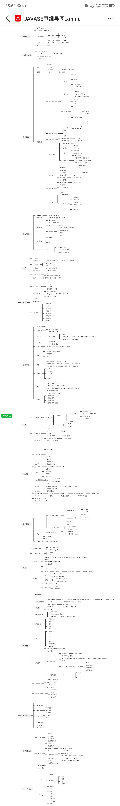

# 00.JAVASE思维导图


## 一、java学习思维导图

场景：是根据狂神的Java总结课整理成的大纲。非常详细，值得学习





## 二、JAVA基础语法-精简版

以下是精简后的Java学习指南核心内容，保留关键知识点和结构：适合复盘、或者快速过一遍！

### 1. Java基础
- **特点**：跨平台（JVM实现）、面向对象
- **开发环境**：JDK（含JRE+工具）配置PATH变量
- **第一个程序**：
  ```java
  public class HelloWorld {
      public static void main(String[] args) {
          System.out.println("Hello World");
      }
  }
  ```
  编译：`javac HelloWorld.java`  
  运行：`java HelloWorld`

### 2. 基础语法
- **注释**：`// 单行`、`/* 多行 */`、`/** 文档 */`
- **数据类型**：
  - 基本类型：`int`/`double`/`boolean`/`char`等
  - 类型转换：自动（小转大）和强制（大转小）
- **变量**：先声明后使用，如 `int a = 10;`
- **运算符**：
  - 算术：`+ - * / %`
  - 逻辑：`&& || !`
  - 三元：`a > b ? a : b`

### 3. 流程控制
- **分支**：
  ```java
  if (条件) {...} 
  else if {...} 
  else {...}
  
  switch (变量) {
      case 值1: ... break;
      default: ...
  }
  ```
- **循环**：
  ```java
  for (int i=0; i<10; i++) {...}
  while (条件) {...}
  do {...} while (条件);
  ```

### 4. 数组
- **定义**：
  ```java
  int[] arr = new int[5];  // 动态
  int[] arr = {1,2,3};     // 静态
  ```
- **操作**：
  - 遍历：`for (int num : arr)`
  - 最值：循环比较
  - 反转：首尾交换

### 5. 方法
- **定义**：
  ```java
  public static 返回值类型 方法名(参数) {
      // 方法体
      return 数据;
  }
  ```
- **重载**：同名方法，参数不同（类型/数量）
- **参数传递**：
  - 基本类型：值传递（不影响原值）
  - 引用类型：地址传递（影响原值）

### 6. 实用工具

- **Scanner**：键盘输入
  ```java
  Scanner sc = new Scanner(System.in);
  int num = sc.nextInt();
  ```
- **Random**：生成随机数
  ```java
  Random r = new Random();
  int num = r.nextInt(100); // 0-99
  ```

### 7. 调试与练习
- **Debug模式**：断点调试观察流程
- **经典案例**：
  - 数组求和/最值
  - 猜数字游戏
  - 百钱百鸡问题
  - 评委打分（去掉最高最低分）

---

**精简说明**：
1. 移除冗余示例，保留核心语法和典型应用
2. 合并相似主题（如循环/分支结构）
3. 用代码片段替代长篇解释
4. 保留必要注释和实用提示

如需特定章节的详细展开或练习答案，可告知具体需求进一步优化。
