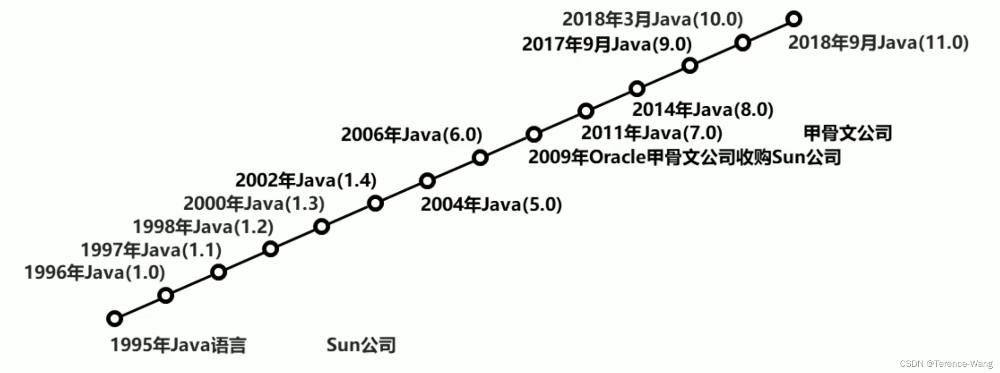
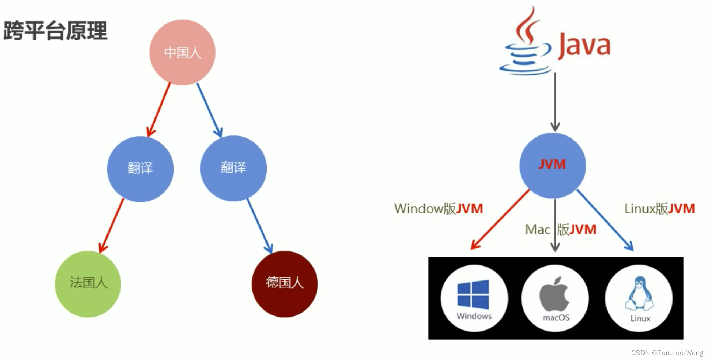
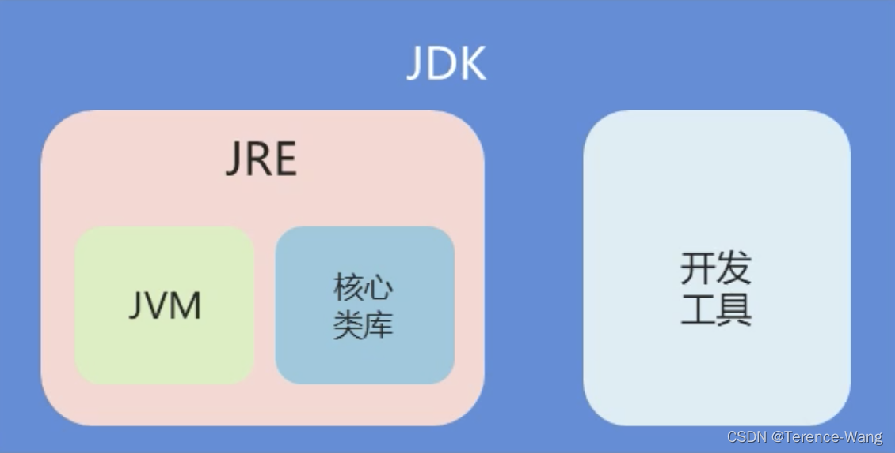
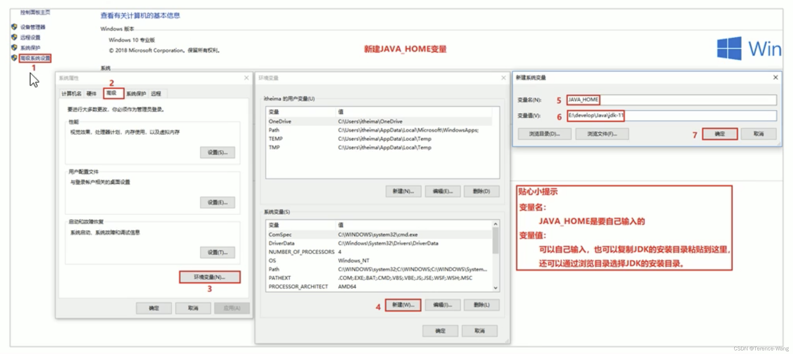
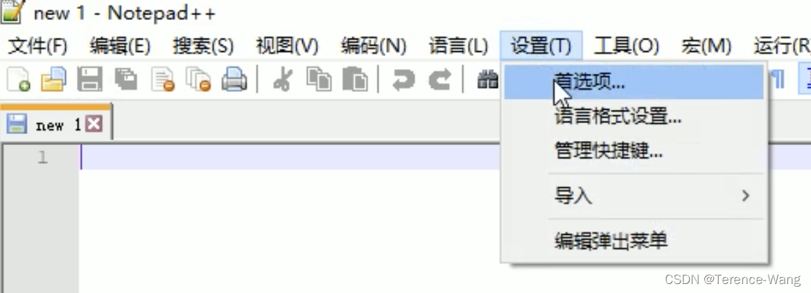
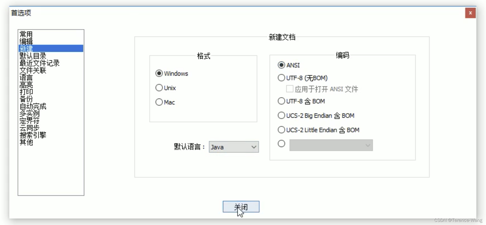

# Java基础语法

> 本文由 [简悦 SimpRead](http://ksria.com/simpread/) 转码， 原文地址 [blog.csdn.net](https://blog.csdn.net/qq_39997939/article/details/123449889?ops_request_misc=%257B%2522request%255Fid%2522%253A%2522F414ED57-BB2C-498E-9FA5-5F013062A090%2522%252C%2522scm%2522%253A%252220140713.130102334..%2522%257D&request_id=F414ED57-BB2C-498E-9FA5-5F013062A090&biz_id=0&utm_medium=distribute.pc_search_result.none-task-blog-2~all~top_positive~default-2-123449889-null-null.142^v100^pc_search_result_base5&utm_term=java%E5%9F%BA%E7%A1%80&spm=1018.2226.3001.4187)

1. Java 概述

---

## 1.1 Java 语言发展史

**语言**: 人与人交流沟通的表达方式
**计算机语言**: 人与计算机之间进行信息交流沟通的一种特殊语言
Java 语言是美国 **Sun** 公司 (**Stanford University Network**) 在 1995 年推出的计算机语言
Java 之父: 詹姆斯 · 高斯林 (James Gosling)
2009 年，Sun 公司被甲骨文公司收购，所以我们现在访问 oracle 官网即可: https://www.oracle.com
当前，我们课程使用的 JDK 版本: 11.0



## 1.2 Java 语言跨平台原理

Java 程序并非是直接运行的，Java 编译器将 Java 源程序编译成与平台无关的字节码文件 (class 文件)，然后由 Java 虚拟机(JVM) 对字节码文件解释执行。所以在不同的操作系统下，只需安装不同的 Java 虚拟机即可实现 java 程序的跨平台。


## 1.3 JRE 和 JDK

JVM(Java Virtual Machine)，Java 虚拟机
JRE(Java Runtime Environment)，Java 运行环境，包含了 JVM 和 Java 的核心类库 (Java API) JDK(Java Development Kit) 称为 Java 开发工具，包含了 JRE 和开发工具
总结: 我们只需安装 JDK 即可，它包含了 java 的运行环境和虚拟机。


## 1.4 JDK 的下载和安装

### 1.4.1 下载

通过官方网站获取 JDK
[http://www.oracle.com](http://www.oracle.com)
**注意**: 针对不同的操作系统，需要下载对应版本的 JDK。

### 1.4.2 安装

傻瓜式安装，下一步即可。但默认的安装路径是在 C:\Program Files 下，为方便统一管理建议修改安装路径，将与开发相关的软件都安装到一个目录下，例如: E:\develop。
**注意**: 安装路径不要包含中文或者空格等特殊字符 (使用纯英文目录)。

### 1.4.3 JDK 的安装目录介绍

<div>
<table data-relingo-block="true"><thead data-relingo-block="true"><tr data-relingo-block="true"><th data-relingo-block="true">目录名称</th><th data-relingo-block="true">说明</th></tr></thead><tbody data-relingo-block="true"><tr data-relingo-block="true"><td data-relingo-block="true" data-relin-paragraph="15">bin</td><td data-relingo-block="true">该路径下存放了 JDK 的各种工具命令。javac 和 java 就放在这个目录。</td></tr><tr data-relingo-block="true"><td data-relingo-block="true" data-relin-paragraph="16">conf</td><td data-relingo-block="true">该路径下存放了 JDK 的相关配置文件。</td></tr><tr data-relingo-block="true"><td data-relingo-block="true" data-relin-paragraph="17">include</td><td data-relingo-block="true">该路径下存放了一些平台特定的头文件。</td></tr><tr data-relingo-block="true"><td data-relingo-block="true" data-relin-paragraph="18">jmods</td><td data-relingo-block="true">该路径下存放了 JDK 的各种模块。</td></tr><tr data-relingo-block="true"><td data-relingo-block="true" data-relin-paragraph="19"><relin-hc data-id="91"><relin-highlight data-relin-meta="unstarred-5"><relin-origin>legal</relin-origin><relin-target data-text="(法律)"></relin-target></relin-highlight></relin-hc></td><td data-relingo-block="true">该路径下存放了 JDK 各模块的授权文档。</td></tr><tr data-relingo-block="true"><td data-relingo-block="true" data-relin-paragraph="20">lib</td><td data-relingo-block="true">该路径下存放了 JDK 工具的一些补充 JAR 包。</td></tr></tbody></table>
</div>

2. 第一个演示程序

---

## 2.1 常用 DOS 命令

在接触集成开发环境之前，我们需要使用命令行窗口对 java 程序进行编译和运行，所以需要知道一些常用 DOS 命令。
1、打开命令行窗口的方式: win + r 打开运行窗口，输入 cmd，回车。
2、常用命令及其作用

<div>
<table data-relingo-block="true"><thead data-relingo-block="true"><tr data-relingo-block="true"><th data-relingo-block="true">操作</th><th data-relingo-block="true">说明</th></tr></thead><tbody data-relingo-block="true"><tr data-relingo-block="true"><td data-relingo-block="true">盘符名称:</td><td data-relingo-block="true">盘符切换。E: 回车，表示切换到 E 盘。</td></tr><tr data-relingo-block="true"><td data-relingo-block="true" data-relin-paragraph="21">dir</td><td data-relingo-block="true">查看当前路径下的内容。</td></tr><tr data-relingo-block="true"><td data-relingo-block="true">cd 目录</td><td data-relingo-block="true" data-relin-paragraph="22">进入单级目录。cd itterence</td></tr><tr data-relingo-block="true"><td data-relingo-block="true">cd ..</td><td data-relingo-block="true">回退到上一级目录。</td></tr><tr data-relingo-block="true"><td data-relingo-block="true">cd 目录 1 \ 目录 2…</td><td data-relingo-block="true" data-relin-paragraph="23">进入多级目录。cd itterence\JavaSE</td></tr><tr data-relingo-block="true"><td data-relingo-block="true" data-relin-paragraph="24">cd \</td><td data-relingo-block="true">回退到盘符目录。</td></tr><tr data-relingo-block="true"><td data-relingo-block="true" data-relin-paragraph="25">cls</td><td data-relingo-block="true">清屏。</td></tr><tr data-relingo-block="true"><td data-relingo-block="true" data-relin-paragraph="26">exit</td><td data-relingo-block="true">退出命令提示符窗口。</td></tr></tbody></table>
</div>

## 2.2 Path 环境变量的配置

#### 2.2.1 为什么配置环境变量

开发 Java 程序，需要使用 JDK 提供的开发工具 (比如 javac.exe、java.exe 等命令)，而这些工具在 JDK 的安装目录的 bin 目录下，如果不配置环境变量，那么这些命令只可以在该目录下执行。我们不可能把所有的 java 文件都放到 JDK 的 bin 目录下，所以配置环境变量的作用就是可以使 bin 目录下的 java 相关命令可以在任意目录下使用。

#### 2.2.2 配置环境变量步骤



**如果命令提示符窗口是配合环境变量前打开的, 需要关闭该窗口, 重新打开一个窗口测试**

## 2.3 HelloWorld 案例

HelloWorld 案例是指在计算机屏幕上输出 “HelloWorld” 这行文字。各种计算机语言都习惯使用该案例作为第一个演示案例。

### 2.3.1 Java 程序开发运行流程

开发 Java 程序，需要三个步骤: 编写程序，编译程序，运行程序。

### 2.3.2 HelloWorld 案例的编写

1、新建文本文档文件，修改名称为 HelloWorld.java。
2、用记事本打开 HelloWorld.java 文件，输写程序内容。

```java
public class HelloWorld {
    public static void main(String[] args) {
        System.out.println("HelloWorld");
    }
}
```

### 2.3.3 HelloWorld 案例的编译和运行

存文件，打开命令行窗口，将目录切换至 java 文件所在目录，编译 java 文件生成 class 文件，运行 class 文件。

> 编译: javac 文件名. java
> 范例: javac HelloWorld.java
> 执行: java 类名
> 范例: java HelloWorld

## 2.4 HelloWorld 案例常见问题 (理解)

### 2.4.1 BUG

在电脑系统或程序中，隐藏着的一些未被发现的缺陷或问题统称为 bug(漏洞)。

### 2.4.2 BUG 的解决

1、具备识别 BUG 的能力: 多看
2、具备分析 BUG 的能力: 多思考，多查资料
3、具备解决 BUG 的能力: 多尝试，多总结

### 2.4.3 HelloWorld 案例常见问题

1、非法字符问题。Java 中的符号都是英文格式的。
2、大小写问题。Java 语言对大小写敏感 (区分大小写)。
3、在系统中显示文件的扩展名，避免出现 HelloWorld.java.txt 文件。
4、编译命令后的 java 文件名需要带文件后缀. java
5、运行命令后的 class 文件名 (类名) 不带文件后缀. class …

## 2.5 Notepad++ 软件的安装和使用

### 2.5.1 什么要使用 Notepad++ 软件

Notepad++ 功能比 windows 中的自带记事本功能强大，除了可以用来制作一般的纯文字说明文件，也十分适合编写计算机程序代码。Notepad++ 有行号，能够快速定位问题位置，还有语法高亮度显示、代码折叠等功能。而且它是免费的。

### 2.5.2 Notepad++ 软件安装

安装: 傻瓜式安装，一直下一步即可。建议也安装到统一的开发软件目录下，比如 E:\develop。

### 2.5.3Notepad++ 软件配置

安装完毕之后，为了使用方便，做一个简单的配置: 修改默认语言和编码。



## 3.0 java基础语法

---

### 3.1 注释

注释是对代码的解释和说明文字，可以提高程序的可读性，因此在程序中添加必要的注释文字十分重要。Java 中的 注释分为三种:
单行注释。单行注释的格式是使用 //，从 // 开始至本行结尾的文字将作为注释文字。

```java
// 这是单行注释文字
```

多行注释。多行注释的格式是使用 /* 和 */ 将一段较长的注释括起来。

```java
/*
  这是多行注释文字 这是多行注释文字 这是多行注释文字
*/
```

**注意**: 多行注释不能嵌套使用。

文档注释。文档注释以 /** 开始，以 */ 结束。(以后讲)

### 3.2 关键字

关键字是指被 java 语言赋予了特殊含义的单词。
关键字的特点: 关键字的字母全部小写。
常用的代码编辑器对关键字都有高亮显示，比如现在我们能看到的 public、class、static 等。