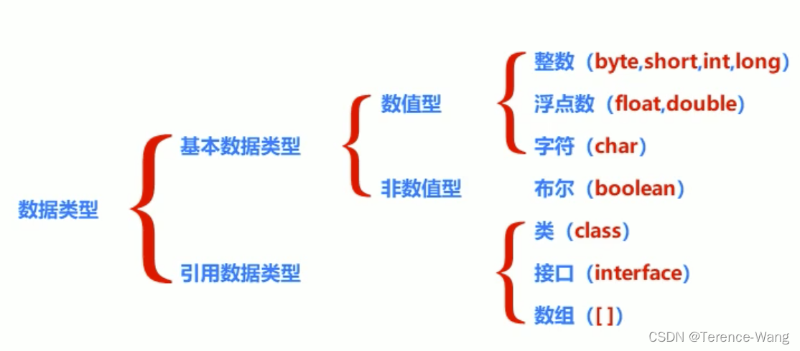
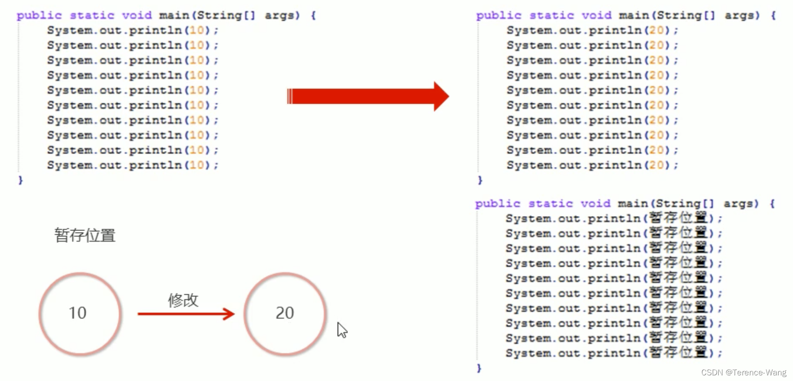
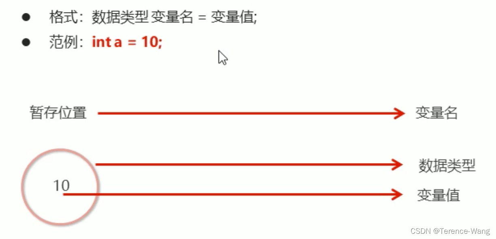
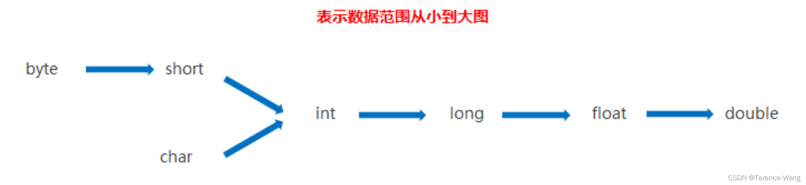

# 常量、数据类型、变量、数据类型的转换

## 3.3 常量

常量: 在程序运行过程中，其值不可以发生改变的量。
Java 中的常量分类:
字符串常量 用双引号括起来的多个字符 (可以包含 0 个、一个或多个)，例如 "a"、“abc”、"中国" 等

- 整数常量 整数，例如:-10、0、88 等
- 小数常量 小数，例如:-5.5、1.0、88.88 等
- 字符常量 用单引号括起来的一个字符，例如:‘a’、‘5’、‘B’、'中’等
- 布尔常量 布尔值，表示真假，只有两个值 true 和 false
- 空常量 一个特殊的值，空值，值为 null

> 除空常量外，其他常量均可使用输出语句直接输出。
>

```java
public class Demo {
    public static void main(String[] args) {
        System.out.println(10); // 输出一个整数
        System.out.println(5.5); // 输出一个小数
        System.out.println('a'); // 输出一个字符
        System.out.println(true); // 输出boolean值true
        System.out.println("欢迎来到黑马程序员"); // 输出字符串
    }
}
```

## 3.4 数据类型

#### 3.4.1 计算机存储单元

我们知道计算机是可以用来存储数据的，但是无论是内存还是硬盘，计算机存储设备的最小信息单元叫 “位 (bit)”，我们又称之为“比特位”，通常用小写的字母”b” 表示。而计算机中最基本的存储单元叫“字节(byte)”，
通常用大写字母”B” 表示，字节是由连续的 8 个位组成。
除了字节外还有一些常用的存储单位，其换算单位如下:
1B(字节) = 8bit
1KB = 1024B
1MB = 1024KB
1GB = 1024MB
1TB = 1024GB

#### 3.4.2 Java 中的数据类型

Java 是一个强类型语言，Java 中的数据必须明确数据类型。在 Java 中的数据类型包括基本数据类型和引用数据类型两种。

Java 中的基本数据类型:

<div>
<table data-relingo-block="true"><thead data-relingo-block="true"><tr data-relingo-block="true"><th data-relingo-block="true">数据类型</th><th data-relingo-block="true">关键字</th><th data-relingo-block="true">内存占用</th><th data-relingo-block="true">取值范围</th></tr></thead><tbody data-relingo-block="true"><tr data-relingo-block="true"><td data-relingo-block="true">整数类型</td><td data-relingo-block="true" data-relin-paragraph="29">byte</td><td data-relingo-block="true">1</td><td data-relingo-block="true">-128~127</td></tr><tr data-relingo-block="true"><td data-relingo-block="true"></td><td data-relingo-block="true" data-relin-paragraph="30">short</td><td data-relingo-block="true">2</td><td data-relingo-block="true">-32768~32767</td></tr><tr data-relingo-block="true"><td data-relingo-block="true"></td><td data-relingo-block="true">int(默认)</td><td data-relingo-block="true">4</td><td data-relingo-block="true">-2 的 31 次方到 2 的 31 次方 - 1</td></tr><tr data-relingo-block="true"><td data-relingo-block="true"></td><td data-relingo-block="true" data-relin-paragraph="31">long</td><td data-relingo-block="true">8</td><td data-relingo-block="true">-2 的 63 次方到 2 的 63 次方 - 1</td></tr><tr data-relingo-block="true"><td data-relingo-block="true">浮点类型</td><td data-relingo-block="true" data-relin-paragraph="32">float</td><td data-relingo-block="true">4</td><td data-relingo-block="true">负数:-3.402823E+38 到 - 1.401298E-45 正数: 1.401298E-45 到 3.402823E+38</td></tr><tr data-relingo-block="true"><td data-relingo-block="true"></td><td data-relingo-block="true" data-relin-paragraph="33">double(默认)</td><td data-relingo-block="true">8</td><td data-relingo-block="true">负数:-1.797693E+308 到 - 4.9000000E-324 正数: 4.9000000E-324 到 1.797693E+308</td></tr><tr data-relingo-block="true"><td data-relingo-block="true">字符类型</td><td data-relingo-block="true" data-relin-paragraph="34">char</td><td data-relingo-block="true">2</td><td data-relingo-block="true">0-65535</td></tr><tr data-relingo-block="true"><td data-relingo-block="true">布尔 类型</td><td data-relingo-block="true" data-relin-paragraph="35">boolean</td><td data-relingo-block="true">1</td><td data-relingo-block="true" data-relin-paragraph="36">true，false</td></tr><tr data-relingo-block="true"><td data-relingo-block="true">说明: e+38 表示是乘以 10 的 38 次方，同样，e-45 表示乘以 10 的负 45 次方。在 java 中整数默认是 int 类型，浮点数默认是 double 类型。</td><td data-relingo-block="true"></td><td data-relingo-block="true"></td><td data-relingo-block="true"></td></tr></tbody></table>
</div>


## 3.5 变量

### 3.5.1 变量的定义

变量: 在程序运行过程中，其值可以发生改变的量。
从本质上讲，变量是内存中的一小块区域，其值可以在一定范围内变化。


变量的定义格式:


> 数据类型 变量名 = 初始化值; // 声明变量并赋值
> int age = 18;
> System.out.println(age);

或者

> // 先声明，后赋值 (使用前赋值即可) 数据类型 变量名;
> 变量名 = 初始化值;
> double money;
> money = 55.5;
> System.out.println(money);

还可以在同一行定义多个同一种数据类型的变量，中间使用逗号隔开。但不建议使用这种方式，降低程序的可读性。

```java
int a = 10, b = 20; // 定义int类型的变量a和b，中间使用逗号隔开
System.out.println(a);
System.out.println(b);
int c,d; // 声明int类型的变量c和d，中间使用逗号隔开
c = 30;
d = 40;
System.out.println(c);
System.out.println(d);
```

变量的使用: 通过变量名访问即可。

### 3.5.2 使用变量时的注意事项

1. 在同一对花括号中，变量名不能重复。
2. 变量在使用之前，必须初始化 (赋值)。
3. 定义 long 类型的变量时，需要在整数的后面加 L(大小写均可，建议大写)。因为整数默认是 int 类型，整数太大可能超出 int 范围。
4. 定义 float 类型的变量时，需要在小数的后面加 F(大小写均可，建议大写)。因为浮点数的默认类型是 double， double 的取值范围是大于 float 的，类型不兼容。

## 3.6 标识符

标识符是用户编程时使用的名字，用于给类、方法、变量、常量等命名。
Java 中标识符的组成规则:
由字母、数字、下划线 “_”、美元符号“$” 组成，第一个字符不能是数字。
不能使用 java 中的关键字作为标识符。
标识符对大小写敏感 (区分大小写)。
Java 中标识符的命名约定:
小驼峰式命名: 变量名、方法名
首字母小写，从第二个单词开始每个单词的首字母大写。
大驼峰式命名: 类名
每个单词的首字母都大写。
另外，标识符的命名最好可以做到见名知意
例如: username、studentNumber 等。

## 3.7 类型转换

在 Java 中，一些数据类型之间是可以相互转换的。分为两种情况: 自动类型转换和强制类型转换。 自动类型转换:
把一个表示数据范围小的数值或者变量赋值给另一个表示数据范围大的变量。这种转换方式是自动的，直接书写即可。例如:

```java
 double num = 10; // 将int类型的10直接赋值给double类型
 System.out.println(num); // 输出10.0
```

强制类型转换:
把一个表示数据范围大的数值或者变量赋值给另一个表示数据范围小的变量。
强制类型转换格式: 目标数据类型 变量名 = (目标数据类型) 值或者变量;
例如:

```java
double num1 = 5.5;
int num2 = (int) num1; // 将double类型的num1强制转换为int类型
System.out.println(num2); // 输出5(小数位直接舍弃)
```


说明:

1. char 类型的数据转换为 int 类型是按照码表中对应的 int 值进行计算的。比如在 ASCII 码表中，'a’对应 97。

```java
 int a = 'a';
 System.out.println(a); // 将输出97
```

2. 整数默认是 int 类型，byte、short 和 char 类型数据参与运算均会自动转换为 int 类型。

```java
byte b1 = 10;
byte b2 = 20;
byte b3 = b1 + b2;
// 第三行代码会报错，b1和b2会自动转换为int类型，计算结果为int，int赋值给byte需要强制类型转换。
// 修改为:
int num = b1 + b2;
// 或者:
byte b3 = (byte) (b1 + b2);
```

3. boolean 类型不能与其他基本数据类型相互转换。