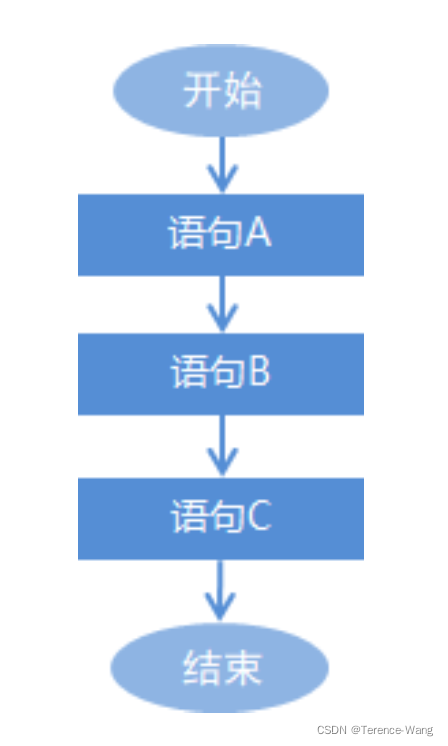
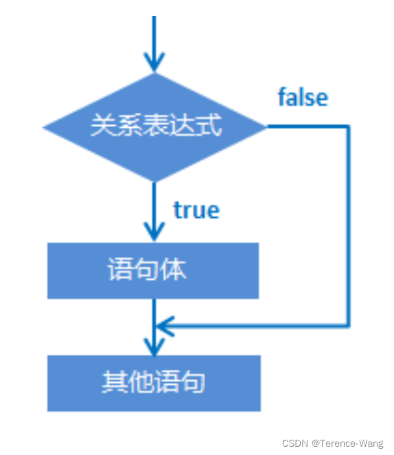
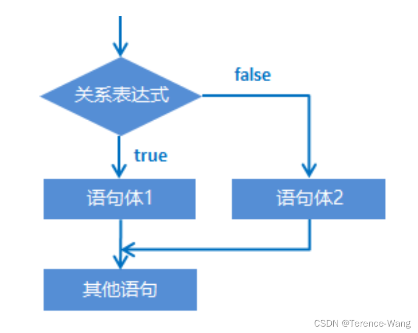
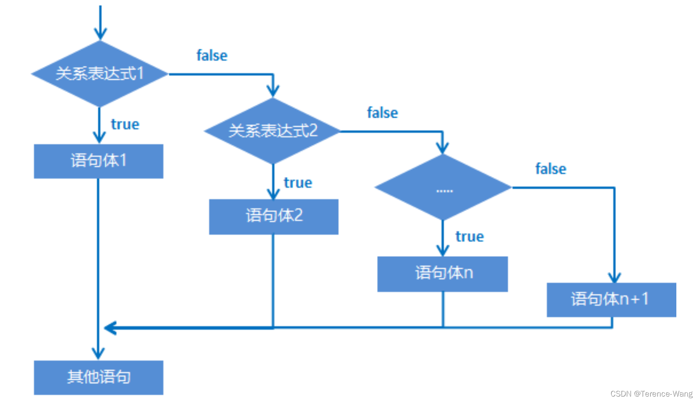
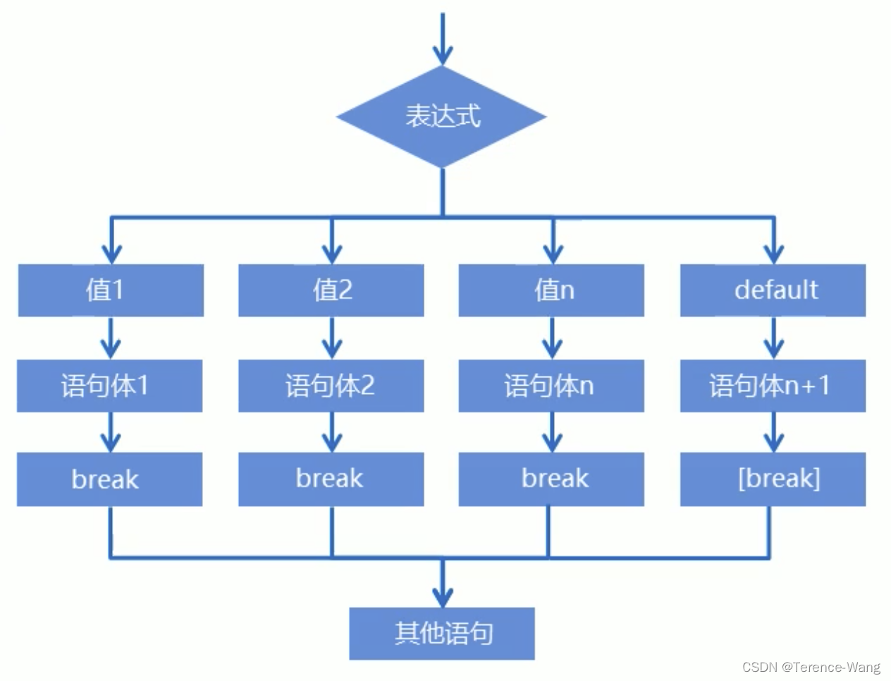

# 数据接收、if语句、switch语句、for循环、while循环


## 5.9 数据输入

我们可以通过 Scanner 类来获取用户的输入。使用步骤如下:
1、导包。Scanner 类在 java.util 包下，所以需要将该类导入。导包的语句需要定义在类的上面。

> import java.util.Scanner;

2、创建 Scanner 对象。

> Scanner sc = new Scanner(System.in);// 创建 Scanner 对象，sc 表示变量名，其他均不可变

3、接收数据

> int i = sc.nextInt(); // 表示将键盘录入的值作为 int 数返回。

示例:

```java
import java.util.Scanner;

public class ScannerDemo {
	public static void main(String[] args) { //创建对象
		Scanner sc = new Scanner(System.in); //接收数据
		int x = sc.nextInt();
		//输出数据
        System.out.println("x:" + x);
    }
}
```

改写三个和尚案例，数据使用键盘录入。

```java
import java.util.Scanner;

public class ScannerTest {
	public static void main(String[] args) {
		//身高未知，采用键盘录入实现。首先导包，然后创建对象。
		Scanner sc = new Scanner(System.in);

		//键盘录入三个身高分别赋值给三个变量。
		System.out.println("请输入第一个和尚的身高：");
		int height1 = sc.nextInt();

		System.out.println("请输入第二个和尚的身高：");
		int height2 = sc.nextInt();

		System.out.println("请输入第三个和尚的身高：");
		int height3 = sc.nextInt();

		//用三元运算符获取前两个和尚的较高身高值，并用临时身高变量保存起来。
		int tempHeight = height1 > height2 ? height1 : height2;

		//用三元运算符获取临时身高值和第三个和尚身高较高值，并用最大身高变量保存。
		int maxHeight = tempHeight > height3 ? tempHeight : height3;

		//输出结果。
		System.out.println("这三个和尚中身高最高的是：" + maxHeight +"cm");
	}
}
```

## 6.0 流程控制语句

---

在一个程序执行的过程中，各条语句的执行顺序对程序的结果是有直接影响的。所以，我们必须清楚每条语句的执行流程。而且，很多时候要通过控制语句的执行顺序来实现我们想要的功能。

## 6.1 流程控制语句分类

顺序结构
分支结构 (if, switch)
循环结构 (for, while, do…while)

## 6.2 顺序结构

顺序结构是程序中最简单最基本的流程控制，没有特定的语法结构，按照代码的先后顺序，依次执行，程序中大多数的代码都是这样执行的。
顺序结构执行流程图:


## 6.3 分支结构之 if 语句

### 6.3.1 if 语句格式 1

> 格式:
> if (关系表达式) {
> 语句体;
> }

执行流程:
1 首先计算关系表达式的值
2 如果关系表达式的值为 true 就执行语句体
3 如果关系表达式的值为 false 就不执行语句体
4 继续执行后面的语句内容



示例:

```java
public class IfDemo {
	public static void main(String[] args) {
		System.out.println("开始");

		//定义两个变量
		int a = 10;
		int b = 20;

		//需求：判断a和b的值是否相等，如果相等，就在控制台输出：a等于b
		if(a == b) {
			System.out.println("a等于b");
		}

		//需求：判断a和c的值是否相等，如果相等，就在控制台输出：a等于c
		int c = 10;
		if(a == c) {
			System.out.println("a等于c");
		}

		System.out.println("结束");
	}
}
```

### 6.3.2 if 语句格式 2

> 格式:
> if (关系表达式) {
> 语句体 1;
> } else {
> 语句体 2;
> }

执行流程:

1. 首先计算关系表达式的值
2. 如果关系表达式的值为 true 就执行语句体 1
3. 如果关系表达式的值为 false 就执行语句体 2
4. 继续执行后面的语句内容
   
   示例:

```java
public class IfDemo02 {
	public static void main(String[] args) {
		System.out.println("开始");

		//定义两个变量
		int a = 10;
		int b = 20;
		b = 5;

		//需求：判断a是否大于b，如果是，在控制台输出：a的值大于b，
		//如果不是，在控制台输出：a的值不大于b
		if(a > b) {
			System.out.println("a的值大于b");
		} else {
			System.out.println("a的值不大于b");
		}

		System.out.println("结束");
	}
}
```

if 语句案例: 奇偶数
需求: 任意给出一个整数，请用程序实现判断该整数是奇数还是偶数，并在控制台输出该整数是奇数还是偶数。
分析:

1. 为了体现任意给出一个整数，采用键盘录入一个数据
2. 判断整数是偶数还是奇数要分两种情况进行判断，使用 if…else 结构
3. 判断是否偶数需要使用取余运算符实现该功能 number % 2 == 0
4. 根据判定情况，在控制台输出对应的内容

```java
 
import java.util.Scanner;

public class IfTest01 {
	public static void main(String[] args) {
		//为了体现任意给出一个整数，采用键盘录入一个数据。(导包，创建对象，接收数据)
		Scanner sc = new Scanner(System.in);

		System.out.println("请输入一个整数：");
		int number = sc.nextInt();

		//判断整数是偶数还是奇数要分两种情况进行判断，使用if..else结构
		//判断是否偶数需要使用取余运算符实现该功能 number % 2 == 0
		//根据判定情况，在控制台输出对应的内容
		if(number%2 == 0) {
			System.out.println(number + "是偶数");
		} else {
			System.out.println(number + "是奇数");
		}

	}
}
```

### 6.3.3 if 语句格式 3

> 格式:
> if (关系表达式 1) {
> 语句体 1;
> } else if (关系表达式 2) {
> 语句体 2;
> }
> …
> else {
> 语句体 n+1;
> }

执行流程:

1. 首先计算关系表达式 1 的值
2. 如果值为 true 就执行语句体 1; 如果值为 false 就计算关系表达式 2 的值
3. 如果值为 true 就执行语句体 2; 如果值为 false 就计算关系表达式 3 的值
4. …
5. 如果没有任何关系表达式为 true，就执行语句体 n+1。
   

示例:
键盘录入一个星期数 (1,2,…7)，输出对应的星期一，星期二，… 星期日

```java
import java.util.Scanner;

public class IfDemo03 {
	public static void main(String[] args) {
		System.out.println("开始");

		//需求：键盘录入一个星期数(1,2,...7)，输出对应的星期一，星期二，...星期日
		Scanner sc = new Scanner(System.in);

		System.out.println("请输入一个星期数(1-7)：");
		int week = sc.nextInt();

		if(week == 1) {
			System.out.println("星期一");
		} else if(week == 2) {
			System.out.println("星期二");
		} else if(week == 3) {
			System.out.println("星期三");
		} else if(week == 4) {
			System.out.println("星期四");
		} else if(week == 5) {
			System.out.println("星期五");
		} else if(week == 6) {
			System.out.println("星期六");
		} else {
			System.out.println("星期日");
		}

		System.out.println("结束");
	}
}
```

if 语句格式 3 案例:
需求: 小明快要期末考试了，小明爸爸对他说，会根据他不同的考试成绩，送他不同的礼物，假如你可以控制小明的得分，请用程序实现小明到底该获得什么样的礼物，并在控制台输出。
分析:

1. 小明的考试成绩未知，可以使用键盘录入的方式获取值
2. 由于奖励种类较多，属于多种判断，采用 if…else…if 格式实现
3. 为每种判断设置对应的条件
4. 为每种判断设置对应的奖励

```java
import java.util.Scanner;

public class IfTest02 {
	public static void main(String[] args) {
		//小明的考试成绩未知，可以使用键盘录入的方式获取值
		Scanner sc = new Scanner(System.in);

		System.out.println("请输入一个分数：");
		int score = sc.nextInt();

		//由于奖励种类较多，属于多种判断，采用if...else...if格式实现
		//为每种判断设置对应的条件
		//为每种判断设置对应的奖励

		//数据测试：正确数据，边界数据，错误数据
		if(score>100 || score<0) {
			System.out.println("你输入的分数有误");
		} else if(score>=95 && score<=100) {
			System.out.println("山地自行车一辆");
		} else if(score>=90 && score<=94) {
			System.out.println("游乐场玩一次");
		} else if(score>=80 && score<=89) {
			System.out.println("变形金刚玩具一个");
		} else {
			System.out.println("胖揍一顿");
		}
	}
}
```

7. switch 语句

---

## 7.1 switch 语句结构

格式

```java
switch (表达式) {
	case 1:
		语句体1;
		break;
	case 2:
		语句体2;
		break;
	...
	default:
		语句体n+1;
		break;
}
```

格式说明：

* 表达式：取值为 byte、short、int、char，JDK5 以后可以是枚举，JDK7 以后可以是 String。
* case：后面跟的是要和表达式进行比较的值。
* break：表示中断，结束的意思，用来结束 switch 语句。
* default：表示所有情况都不匹配的时候，就执行该处的内容，和 if 语句的 else 相似。

执行流程：

* 首先计算出表达式的值
* 其次，和 case 依次比较，一旦有对应的值，就会执行相应的语句，在执行的过程中，遇到 break 就会结 束。
* 最后，如果所有的 case 都和表达式的值不匹配，就会执行 default 语句体部分，然后程序结束掉。
  

## 7.2 switch 语句练习 - 春夏秋冬（应用）

* 需求：一年有 12 个月，分属于春夏秋冬 4 个季节，键盘录入一个月份，请用程序实现判断该月份属于哪个季节，并输出。
* 运行结果：

```java
春：3、4、5
夏：6、7、8
秋：9、10、11
冬：1、2、12
```

* 示例代码：

```java
import java.util.Scanner;

public class SwitchTest {
	public static void main(String[] args) {
		//键盘录入月份数据，使用变量接收
		Scanner sc = new Scanner(System.in);

		System.out.println("请输入一个月份：");
		int month = sc.nextInt();

		//多情况判断，这里采用switch语句实现
		//在每种情况中，完成输出对应的季节
		/*
		switch(month) {
			case 1:
				System.out.println("冬季");
				break;
			case 2:
				System.out.println("冬季");
				//break;
			case 3:
				System.out.println("春季");
				break;
			case 4:
				System.out.println("春季");
				break;
			case 5:
				System.out.println("春季");
				break;
			case 6:
				System.out.println("夏季");
				break;
			case 7:
				System.out.println("夏季");
				break;
			case 8:
				System.out.println("夏季");
				break;
			case 9:
				System.out.println("秋季");
				break;
			case 10:
				System.out.println("秋季");
				break;
			case 11:
				System.out.println("秋季");
				break;
			case 12:
				System.out.println("冬季");
				break;
			default:
				System.out.println("你输入的月份有误");
				//break;
		}
		*/

		//case穿透
		switch(month) {
			case 1:
			case 2:
			case 12:
				System.out.println("冬季");
				break;
			case 3:
			case 4:
			case 5:
				System.out.println("春季");
				break;
			case 6:
			case 7:
			case 8:
				System.out.println("夏季");
				break;
			case 9:
			case 10:
			case 11:
				System.out.println("秋季");
				break;
			default:
				System.out.println("你输入的月份有误");
		}
	}
}
```

* 注意：如果 switch 中得 case，没有对应 break 的话，则会出现 case 穿透的现象。

8. for 循环

---

## 8.1 for 循环结构（掌握）

* 循环：
  循环语句可以在满足循环条件的情况下，反复执行某一段代码，这段被重复执行的代码被称为循环体语句，当反复 执行这个循环体时，需要在合适的时候把循环判断条件修改为 false，从而结束循环，否则循环将一直执行下去，形 成死循环。
* for 循环格式：

```java
for (初始化语句;条件判断语句;条件控制语句) {
	循环体语句;
}
```

* 格式解释：

  * 初始化语句： 用于表示循环开启时的起始状态，简单说就是循环开始的时候什么样
  * 条件判断语句：用于表示循环反复执行的条件，简单说就是判断循环是否能一直执行下去
  * 循环体语句： 用于表示循环反复执行的内容，简单说就是循环反复执行的事情
  * 条件控制语句：用于表示循环执行中每次变化的内容，简单说就是控制循环是否能执行下去
* 执行流程：

  ①执行初始化语句

  ②执行条件判断语句，看其结果是 true 还是 false

   如果是 false，循环结束

   如果是 true，继续执行

  ③执行循环体语句

  ④执行条件控制语句

  ⑤回到②继续

```java
public class ForDemo {
	public static void main(String[] args) {
		//需求：在控制台输出5次"HelloWorld"
		System.out.println("HelloWorld");
		System.out.println("HelloWorld");
		System.out.println("HelloWorld");
		System.out.println("HelloWorld");
		System.out.println("HelloWorld");
		System.out.println("--------");

		//用循环改进
		for(int i=1; i<=5; i++) {
			System.out.println("HelloWorld");
		}

	}
}
```

## 8.2 for 循环练习 - 输出数据（应用）

* 需求：在控制台输出 1-5 和 5-1 的数据
* 示例代码：

```java
public class ForTest01 {
	public static void main(String[] args) {
		//需求：输出数据1-5
		for(int i=1; i<=5; i++) {
			System.out.println(i);
		}
		System.out.println("--------");

		//需求：输出数据5-1
		for(int i=5; i>=1; i--) {
			System.out.println(i);
		}

	}
}

```

## 8.3 for 循环练习 - 求和

* 需求：求 1-5 之间的数据和，并把求和结果在控制台输出
* 示例代码：

```java
public class ForTest02 {
	public static void main(String[] args) {
		//求和的最终结果必须保存起来，需要定义一个变量，用于保存求和的结果，初始值为0
		int sum = 0;

		//从1开始到5结束的数据，使用循环结构完成
		for(int i=1; i<=5; i++) {
			//将反复进行的事情写入循环结构内部，此处反复进行的事情是将数据 i 加到用于保存最终求和的变量 sum 中
			sum += i;
			/*
				sum += i;	sum = sum + i;
				第一次：sum = sum + i = 0 + 1 = 1;
				第二次：sum = sum + i = 1 + 2 = 3;
				第三次：sum = sum + i = 3 + 3 = 6;
				第四次：sum = sum + i = 6 + 4 = 10;
				第五次：sum = sum + i = 10 + 5 = 15;
			*/
		}

		//当循环执行完毕时，将最终数据打印出来
		System.out.println("1-5之间的数据和是：" + sum);
	}
}
```

* 本题要点：
  * 今后遇到的需求中，如果带有求和二字，请立即联想到求和变量
  * 求和变量的定义位置，必须在循环外部，如果在循环内部则计算出的数据将是错误的

## 8.4 for 循环练习 - 求偶数和

* 需求：求 1-100 之间的偶数和，并把求和结果在控制台输出 }
* 示例代码：

```java
public class ForTest03 {
	public static void main(String[] args) {
		//求和的最终结果必须保存起来，需要定义一个变量，用于保存求和的结果，初始值为0
		int sum = 0;

		//对1-100的数据求和与1-5的数据求和几乎完全一样，仅仅是结束条件不同
		for(int i=1; i<=100; i++) {
			//对1-100的偶数求和，需要对求和操作添加限制条件，判断是否是偶数
			if(i%2 == 0) {
				sum += i;
			}
		}

		//当循环执行完毕时，将最终数据打印出来
		System.out.println("1-100之间的偶数和是：" + sum);
	}
}
```

## 8.5 for 循环练习 - 水仙花

* 需求：在控制台输出所有的 “水仙花数”
* 解释：什么是水仙花数？
  * 水仙花数，指的是一个三位数，个位、十位、百位的数字立方和等于原数
    * 例如`153 3*3*3 + 5*5*5 + 1*1*1 = 153`
* 思路：
  1. 获取所有的三位数，准备进行筛选，最小的三位数为 100，最大的三位数为 999，使用 for 循环获取
  2. 获取每一个三位数的个位，十位，百位，做 if 语句判断是否是水仙花数
* 示例代码

```
public class ForTest04 {
	public static void main(String[] args) {
		//输出所有的水仙花数必然要使用到循环，遍历所有的三位数，三位数从100开始，到999结束
		/*
		for(int i=100; i<=999; i++) {

		}
		*/
		for(int i=100; i<1000; i++) {
			//在计算之前获取三位数中每个位上的值
			int ge = i%10;
			int shi = i/10%10;
			int bai = i/10/10%10;

			//判定条件是将三位数中的每个数值取出来，计算立方和后与原始数字比较是否相等
			if(ge*ge*ge + shi*shi*shi + bai*bai*bai == i) {
				//输出满足条件的数字就是水仙花数
				System.out.println(i);
			}
		}
	}
}


```

## 8.6 for 循环练习 - 统计水仙花数个数

* 需求：统计 “水仙花数” 一共有多少个，并在控制台输出个数
* 示例代码：

```
public class ForTest05 {
	public static void main(String[] args) {
		//定义变量count，用于保存“水仙花数”的数量，初始值为0
		int count = 0;

		//输出所有的水仙花数必然要使用到循环，遍历所有的三位数，三位数从100开始，到999结束
		for(int i=100; i<1000; i++) {
			//在计算之前获取三位数中每个位上的值
			int ge = i%10;
			int shi = i/10%10;
			int bai = i/10/10%10;

			//在判定水仙花数的过程中，满足条件不再输出，更改为修改count的值，使count+1
			if(ge*ge*ge + shi*shi*shi + bai*bai*bai == i) {
				count++;
			}
		}

		//打印输出最终结果
		System.out.println("水仙花共有：" + count + "个");
	}
}


```

* 本题要点：
  * 今后如果需求带有统计 xxx，请先想到计数器变量
  * 计数器变量定义的位置，必须在循环外部

9. while 循环

---

## 9.1 while 结构

* while 循环完整格式：

  ```
  初始化语句;
  while (条件判断语句) {
  	循环体语句;
      条件控制语句;
  }


  ```
* while 循环执行流程：

  ①执行初始化语句

  ②执行条件判断语句，看其结果是 true 还是 false

   如果是 false，循环结束

   如果是 true，继续执行

  ③执行循环体语句

  ④执行条件控制语句

  ⑤回到②继续
* 示例代码：

  ```
public class WhileDemo {
	public static void main(String[] args) {
		//需求：在控制台输出5次"HelloWorld"
		//for循环实现
		for(int i=1; i<=5; i++) {
			System.out.println("HelloWorld");
		}
		System.out.println("--------");

		//while循环实现
		int j = 1;
		while(j<=5) {
			System.out.println("HelloWorld");
			j++;
		}
	
	}
}


```

### 9.2 while 循环练习 - 珠穆朗玛峰

* 需求：世界最高山峰是珠穆朗玛峰 (8844.43 米 = 8844430 毫米)，假如我有一张足够大的纸，它的厚度是 0.1 毫米。请问，我折叠多少次，可以折成珠穆朗玛峰的高度?
* 示例代码：

```
public class WhileTest {
	public static void main(String[] args) {
		//定义一个计数器，初始值为0
		int count = 0;

		//定义纸张厚度
		double paper = 0.1;
	
		//定义珠穆朗玛峰的高度
		int zf = 8844430;
	
		//因为要反复折叠，所以要使用循环，但是不知道折叠多少次，这种情况下更适合使用while循环
		//折叠的过程中当纸张厚度大于珠峰就停止了，因此继续执行的要求是纸张厚度小于珠峰高度
		while(paper <= zf) {
			//循环的执行过程中每次纸张折叠，纸张的厚度要加倍
			paper *= 2;
	
			//在循环中执行累加，对应折叠了多少次
			count++;
		}
	
		//打印计数器的值
		System.out.println("需要折叠：" + count + "次");
	}
}


```

10. 循环细节

---

### 10.1 do…while 循环结构

* 完整格式：

```
  初始化语句;
  do {
  	循环体语句;
  	条件控制语句;
  }while(条件判断语句);


  ```
* 执行流程：

  ① 执行初始化语句

  ② 执行循环体语句

  ③ 执行条件控制语句

  ④ 执行条件判断语句，看其结果是 true 还是 false

  如果是 false，循环结束

  如果是 true，继续执行

  ⑤ 回到②继续
* 示例代码：

  ```
public class DoWhileDemo {
	public static void main(String[] args) {
		//需求：在控制台输出5次"HelloWorld"
		//for循环实现
		for(int i=1; i<=5; i++) {
			System.out.println("HelloWorld");
		}
		System.out.println("--------");

		//do...while循环实现
		int j = 1;
		do {
			System.out.println("HelloWorld");
			j++;
		}while(j<=5);
	
	}
}


```

### 10.2 三种循环的区别

* 三种循环的区别
  * for 循环和 while 循环先判断条件是否成立，然后决定是否执行循环体（先判断后执行）
  * do…while 循环先执行一次循环体，然后判断条件是否成立，是否继续执行循环体（先执行后判断）
* for 循环和 while 的区别
  * 条件控制语句所控制的自增变量，因为归属 for 循环的语法结构中，在 for 循环结束后，就不能再次被访问到了
  * 条件控制语句所控制的自增变量，对于 while 循环来说不归属其语法结构中，在 while 循环结束后，该变量还可以继续使用
* 死循环（无限循环）的三种格式
  1. for(;;){}
  2. while(true){}
  3. do {} while(true);

### 10.3 跳转控制语句

* 跳转控制语句（break）
  * 跳出循环，结束循环
* 跳转控制语句（continue）
  * 跳过本次循环，继续下次循环
* 注意： continue 只能在循环中进行使用！

### 10.4 循环嵌套

* 循环嵌套概述：在循环中，继续定义循环
* 示例代码：

```
public class ForForDemo {
	public static void main(String[] args) {
		for(int hour=0; hour<24; hour++) {
			for(int minute=0; minute<60; minute++) {
				System.out.println(hour + "时" + minute + "分");
			}
			System.out.println("--------");
		}
	}
}


```

* 理解：

  * 请反复理解这句话（整个内循环，就是外循环的一个循环体，内部循环体没有执行完毕，外循环是不会继续向下执行的）
* 结论：

  * 外循环执行一次，内循环执行一圈

11. Random

---

### 11.1 Random 产生随机数

* 概述：

  * Random 类似 Scanner，也是 Java 提供好的 API，内部提供了产生随机数的功能
    * API 后续课程详细讲解，现在可以简单理解为 Java 已经写好的代码
* 使用步骤：

  1. 导入包

     import java.util.Random;
  2. 创建对象

     Random r = new Random();
  3. 产生随机数

     int num = r.nextInt(10);

     解释： 10 代表的是一个范围，如果括号写 10，产生的随机数就是 0-9，括号写 20，参数的随机数则是 0-19
* 示例代码：

```
import java.util.Random;

public class RandomDemo {
	public static void main(String[] args) {
		//创建对象
		Random r = new Random();

		//用循环获取10个随机数
		for(int i=0; i<10; i++) {
			//获取随机数
			int number = r.nextInt(10);
			System.out.println("number:" + number);
		}
	
		//需求：获取一个1-100之间的随机数
		int x = r.nextInt(100) + 1;
		System.out.println(x);
	}
}


```

### 11.2 Random 练习 - 猜数字

* 需求：

  程序自动生成一个 1-100 之间的数字，使用程序实现猜出这个数字是多少？

  当猜错的时候根据不同情况给出相应的提示

  A. 如果猜的数字比真实数字大，提示你猜的数据大了

  B. 如果猜的数字比真实数字小，提示你猜的数据小了

  C. 如果猜的数字与真实数字相等，提示恭喜你猜中了
* 示例代码：

```
import java.util.Random;
import java.util.Scanner;

public class RandomTest {
	public static void main(String[] args) {
		//要完成猜数字的游戏，首先需要有一个要猜的数字，使用随机数生成该数字，范围1到100
		Random r = new Random();
		int number = r.nextInt(100) + 1;

		while(true) {
			//使用程序实现猜数字，每次均要输入猜测的数字值，需要使用键盘录入实现
			Scanner sc = new Scanner(System.in);
	
			System.out.println("请输入你要猜的数字：");
			int guessNumber = sc.nextInt();
	
			//比较输入的数字和系统产生的数据，需要使用分支语句。这里使用if..else..if..格式，根据不同情况进行猜测结果显示
			if(guessNumber > number) {
				System.out.println("你猜的数字" + guessNumber + "大了");
			} else if(guessNumber < number) {
				System.out.println("你猜的数字" + guessNumber + "小了");
			} else {
				System.out.println("恭喜你猜中了");
				break;
			}
		}
	}
}


```