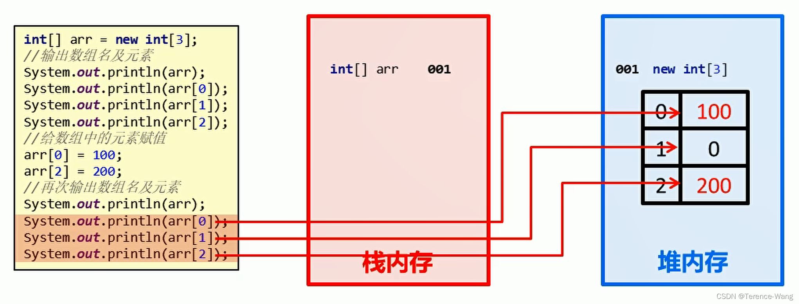
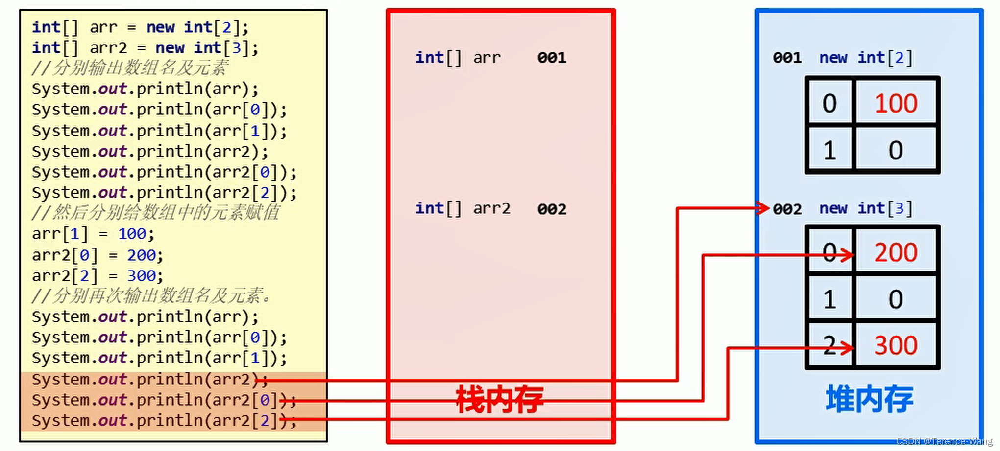
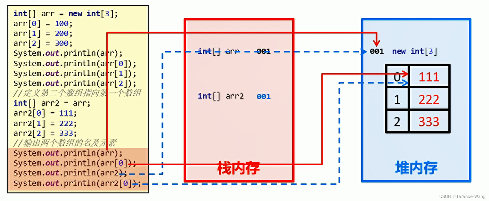

## 12.0 IDEA 开发工具

百度一大把

## 13.0 数组

### 13.1 什么是数组

数组 (array) 是一种用于存储多个相同类型数据的存储模型

### 13.2 数组定义格式

#### 13.2.1 第一种

 数据类型 [] 数组名

 示例：

```java
int[] arr;        
double[] arr;      
char[] arr;
```

定义了一个 int 类型的数组, 数组名是 arr

#### 13.2.2 第二种 (不推荐)

 数据类型 数组名 []

 示例：

```java
int arr[];
double arr[];
char arr[];
```

定义了一个 int 类型的变量, 变量名是 arr 数组

### 13.3 数组动态初始化

#### 13.3.1 什么是动态初始化

 数组动态初始化就是只给定数组的长度，由系统给出默认初始化值

#### 13.3.2 动态初始化格式

```java
数据类型[] 数组名 = new 数据类型[数组长度];
```

```java
int[] arr = new int[3];
```

#### 13.3.3 动态初始化格式详解

* 等号左边：

  * int: 数组的数据类型
  * []: 代表这是一个数组
  * arr: 代表数组的名称
* 等号右边：

  * new: 为数组开辟内存空间
  * int: 数组的数据类型
  * []: 代表这是一个数组
  * 3: 代表数组的长度

### 13.4 数组元素访问

#### 13.4.1 什么是索引

 每一个存储到数组的元素，都会自动的拥有一个编号，从 0 开始。

 这个自动编号称为数组索引 (index)，可以通过数组的索引访问到数组中的元素。

#### 13.4.2 访问数组元素格式

```java
数组名[索引];
```

#### 13.4.3 示例代码

```java
public class ArrayDemo {
    public static void main(String[] args) {
        int[] arr = new int[3];

        //输出数组名
        System.out.println(arr); //[I@880ec60
    
        //输出数组中的元素
        System.out.println(arr[0]);
        System.out.println(arr[1]);
        System.out.println(arr[2]);
    }
}
```

## 13.5 内存分配

#### 13.5.1 内存概述

 内存是计算机中的重要原件，临时存储区域，作用是运行程序。

 我们编写的程序是存放在硬盘中的，在硬盘中的程序是不会运行的。

 必须放进内存中才能运行，运行完毕后会清空内存。

 Java 虚拟机要运行程序，必须要对内存进行空间的分配和管理。

#### 13.5.2 java 中的内存分配

* 目前我们只需要记住两个内存，分别是：栈内存和堆内存

<div>
<table data-relingo-block="true"><thead data-relingo-block="true"><tr data-relingo-block="true"><th data-relingo-block="true">区域名称</th><th data-relingo-block="true">作用</th></tr></thead><tbody data-relingo-block="true"><tr data-relingo-block="true"><td data-relingo-block="true">寄存器</td><td data-relingo-block="true">给 CPU 使用，和我们开发无关。</td></tr><tr data-relingo-block="true"><td data-relingo-block="true">本地方法栈</td><td data-relingo-block="true">JVM 在使用操作系统功能的时候使用，和我们开发无关。</td></tr><tr data-relingo-block="true"><td data-relingo-block="true">方法区</td><td data-relingo-block="true">存储可以运行的 class 文件。</td></tr><tr data-relingo-block="true"><td data-relingo-block="true">堆内存</td><td data-relingo-block="true">存储对象或者数组，new 来创建的，都存储在堆内存。</td></tr><tr data-relingo-block="true"><td data-relingo-block="true">方法栈</td><td data-relingo-block="true">方法运行时使用的内存，比如 main 方法运行，进入方法栈中执行。</td></tr></tbody></table>
</div>

## 13.6 单个数组的内存图



## 13.7 多个数组的内存图



## 13.8 多个数组指向相同内存图



## 13.9 数组静态初始化

### 13.9.1 什么是静态初始化

 在创建数组时，直接将元素确定

### 13.9.2 静态初始化格式

* 完整版格式

```java
数据类型[] 数组名 = new 数据类型[]{元素1,元素2,...};
```
* 简化版格式

```java
数据类型[] 数组名 = {元素1,元素2,...};
```

### 13.9.3 示例代码

  ```java
public class ArrayDemo {
    public static void main(String[] args) {
        //定义数组
        int[] arr = {1, 2, 3};

        //输出数组名
        System.out.println(arr);
    
        //输出数组中的元素
        System.out.println(arr[0]);
        System.out.println(arr[1]);
        System.out.println(arr[2]);
    }
}


  ```

## 13.10 数组操作的两个常见小问题

### 13.10.1 索引越界异常

* 出现原因

```java
public class ArrayDemo {
    public static void main(String[] args) {
        int[] arr = new int[3];
		System.out.println(arr[3]);
    }
}
```

数组长度为 3，索引范围是 0~2，但是我们却访问了一个 3 的索引。

程序运行后，将会抛出 ArrayIndexOutOfBoundsException 数组越界异常。在开发中，数组的越界异常是不能出现的，一旦出现了，就必须要修改我们编写的代码。

* 解决方案

  将错误的索引修改为正确的索引范围即可！

### 13.10.2 空指针异常

* 出现原因

```java
public class ArrayDemo {
    public static void main(String[] args) {
        int[] arr = new int[3];
		//把null赋值给数组
        arr = null;
        System.out.println(arr[0]);
    }
}


```

arr = null 这行代码，意味着变量 arr 将不会在保存数组的内存地址，也就不允许再操作数组了，因此运行的时候会抛出 NullPointerException 空指针异常。在开发中，数组的越界异常是不能出现的，一旦出现了，就必须要修改我们编写的代码。

* 解决方案

  给数组一个真正的堆内存空间引用即可！

## 13.11 数组遍历

* 数组遍历：就是将数组中的每个元素分别获取出来，就是遍历。遍历也是数组操作中的基石。

```java
  public class ArrayTest01 {
  	public static void main(String[] args) {
  		int[] arr = { 1, 2, 3, 4, 5 };
  		System.out.println(arr[0]);
  		System.out.println(arr[1]);
  		System.out.println(arr[2]);
  		System.out.println(arr[3]);
  		System.out.println(arr[4]);
  	}
  }


```

  以上代码是可以将数组中每个元素全部遍历出来，但是如果数组元素非常多，这种写法肯定不行，因此我们需要改造成循环的写法。数组的索引是 0 到 lenght-1 ，可以作为循环的条件出现。

```Java
public class ArrayTest01 {
    public static void main(String[] args) {
        //定义数组
        int[] arr = {11, 22, 33, 44, 55};

        //使用通用的遍历格式
        for(int x=0; x<arr.length; x++) {
            System.out.println(arr[x]);
        }
    }
}
```

## 13.12 数组最值

* 最大值获取：从数组的所有元素中找出最大值。
* 实现思路：

  * 定义变量，保存数组 0 索引上的元素
  * 遍历数组，获取出数组中的每个元素
  * 将遍历到的元素和保存数组 0 索引上值的变量进行比较
  * 如果数组元素的值大于了变量的值，变量记录住新的值
  * 数组循环遍历结束，变量保存的就是数组中的最大值
* 代码实现：

```Java
public class ArrayTest02 {
    public static void main(String[] args) {
        //定义数组
        int[] arr = {12, 45, 98, 73, 60};

        //定义一个变量，用于保存最大值
        //取数组中第一个数据作为变量的初始值
        int max = arr[0];

        //与数组中剩余的数据逐个比对，每次比对将最大值保存到变量中
        for(int x=1; x<arr.length; x++) {
            if(arr[x] > max) {
                max = arr[x];
            }
        }

        //循环结束后打印变量的值
        System.out.println("max:" + max);

    }
}
```