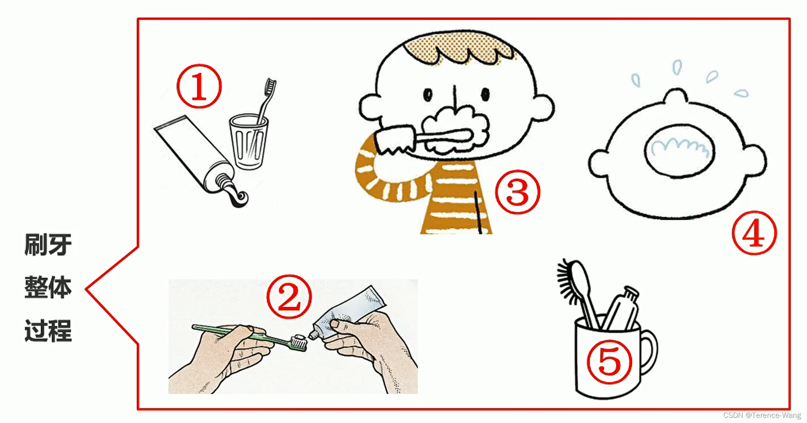
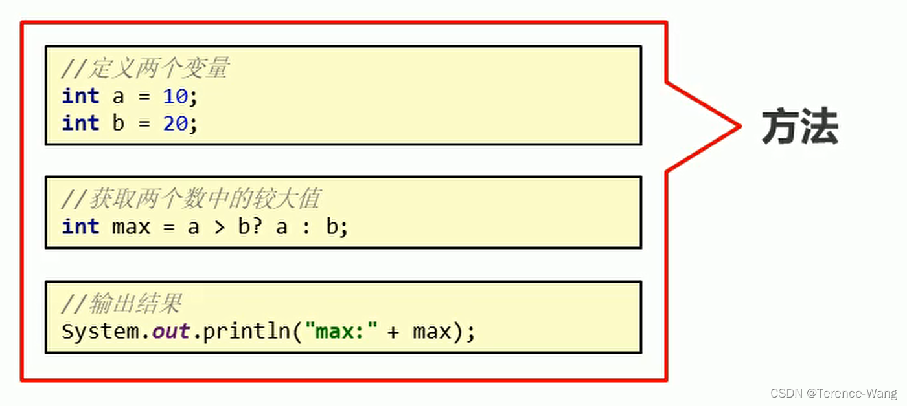

# 方法概述

---

## 14.1 方法的概念

 方法（method）是将具有独立功能的代码块组织成为一个整体，使其具有特殊功能的代码集



* 注意：
  * 方法必须先创建才可以使用，该过程成为方法定义
  * 方法创建后并不是直接可以运行的，需要手动使用后，才执行，该过程成为方法调用

## 14.2. 方法的定义和调用

### 14.2.1 无参数方法定义和调用

* 定义格式：

```java
public static void 方法名 (   ) {
	// 方法体;
}
```

* 范例：
```java
public static void method (    ) {
	// 方法体;
}
```
* 调用格式：
```java
方法名();

* 范例：
method();
```


> 注意：方法必须先定义，后调用，否则程序将报错
>

### 14.2.2 方法调用过程图解


* 总结：每个方法在被调用执行的时候，都会进入栈内存，并且拥有自己独立的内存空间，方法内部代码调用完毕之后，会从栈内存中弹栈消失。

### 14.2.3 无参数方法的练习

* 需求：设计一个方法用于打印两个数中的较大数
* 思路：
  * ①定义一个方法，用于打印两个数字中的较大数，例如 getMax()
  * ②方法中定义两个变量，用于保存两个数字
  * ③使用分支语句分两种情况对两个数字的大小关系进行处理
  * ④在 main() 方法中调用定义好的方法
* 代码：

```java
public class MethodTest {
    public static void main(String[] args) {
        //在main()方法中调用定义好的方法
        getMax();
    }

    //定义一个方法，用于打印两个数字中的较大数，例如getMax()
    public static void getMax() {
        //方法中定义两个变量，用于保存两个数字
        int a = 10;
        int b = 20;
    
        //使用分支语句分两种情况对两个数字的大小关系进行处理
        if(a > b) {
            System.out.println(a);
        } else {
            System.out.println(b);
        }
    }
}


```

## 14.3 带参数方法定义和调用

### 14.3.1 带参数方法定义和调用

* 定义格式：

  参数：由数据类型和变量名组成 - 数据类型 变量名

  参数范例：int a

```java
  public static void 方法名 (参数1) {
  	方法体;
  }

  public static void 方法名 (参数1, 参数2, 参数3...) {
  	方法体;
  }
```
* 范例：

```java
public static void isEvenNumber(int number){
  ...
}
public static void getMax(int num1, int num2){
  ...
}
```

  > 注意：
  >
  >   方法定义时，参数中的数据类型与变量名都不能缺少，缺少任意一个程序将报错
  >
  >   方法定义时，多个参数之间使用逗号( ，)分隔
* 调用格式：

```
方法名(参数)；
方法名(参数1,参数2);

* 范例：
isEvenNumber(10);
getMax(10,20);
```
> 方法调用时，参数的数量与类型必须与方法定义中的设置相匹配，否则程序将报错
>


### 14.3.2 形参和实参

1. 形参：方法定义中的参数

 等同于变量定义格式，例如：int number

2. 实参：方法调用中的参数

 等同于使用变量或常量，例如： 10 number

### 14.3.3 带参数方法练习

需求：设计一个方法用于打印两个数中的较大数，数据来自于方法参数 }

思路：

- 定义一个方法，用于打印两个数字中的较大数，例如 getMax()
- 为方法定义两个参数，用于接收两个数字
- 使用分支语句分两种情况对两个数字的大小关系进行处理
- 在 main() 方法中调用定义好的方法（使用常量）
- 在 main() 方法中调用定义好的方法（使用变量）
- 代码：

```java
public class MethodTest {
    public static void main(String[] args) {
        //在main()方法中调用定义好的方法（使用常量）
        getMax(10,20);
        //调用方法的时候，人家要几个，你就给几个，人家要什么类型的，你就给什么类型的
        //getMax(30);
        //getMax(10.0,20.0);

    //在main()方法中调用定义好的方法（使用变量）
    int a = 10;
    int b = 20;
    getMax(a, b);
}

//定义一个方法，用于打印两个数字中的较大数，例如getMax()
//为方法定义两个参数，用于接收两个数字
public static void getMax(int a, int b) {
    //使用分支语句分两种情况对两个数字的大小关系进行处理
    if(a > b) {
        System.out.println(a);
    } else {
        System.out.println(b);
    }
}

}
```


### 14.4 带返回值方法的定义和调用

#### 14.4.1 带返回值方法定义和调用

 ```java
 //定义格式
  
 public static 数据类型 方法名 ( 参数 ) { 
 	return 数据 ;
 }
  
 //范例
  
 public static boolean isEvenNumber( int number ) {           
 	return true ;
 }
 public static int getMax( int a, int b ) {
 	return  100 ;
 }
 ```

>  注意：方法定义时 return 后面的返回值与方法定义上的数据类型要匹配，否则程序将报错
>


* 调用格式

```java
方法名 (参数) ;
数据类型 变量名 = 方法名 ( 参数 ) ;

//范例

isEvenNumber ( 5 ) ;
boolean  flag =  isEvenNumber ( 5 ); 
```

> 注意：方法的返回值通常会使用变量接收，否则该返回值将无意义

#### 14.4.2 带返回值方法练习

需求：设计一个方法可以获取两个数的较大值，数据来自于参数

思路：

* 定义一个方法，用于获取两个数字中的较大数
* 使用分支语句分两种情况对两个数字的大小关系进行处理
* 根据题设分别设置两种情况下对应的返回结果
* 在 main() 方法中调用定义好的方法并使用变量保存
* 在 main() 方法中调用定义好的方法并直接打印结果

* 代码：

```java
public class MethodTest {
      public static void main(String[] args) {
          //在main()方法中调用定义好的方法并使用变量保存
          int result = getMax(10,20);
          System.out.println(result);

     //在main()方法中调用定义好的方法并直接打印结果
      System.out.println(getMax(10,20));
  }

  //定义一个方法，用于获取两个数字中的较大数
public static int getMax(int a, int b) {
      //使用分支语句分两种情况对两个数字的大小关系进行处理
      //根据题设分别设置两种情况下对应的返回结果
      if(a > b) {
          return a;
      } else {
          return b;
      }
  }

  }
```


## 14.5 方法的注意事项

### 14.5.1 方法的注意事项

方法不能嵌套定义，示例代码：

```java
public class MethodDemo {
    public static void main(String[] args) {

    }

    public static void methodOne() {
		public static void methodTwo() {
       		// 这里会引发编译错误!!!
    	}
    }
}
```

void 表示无返回值，可以省略 return，也可以单独的书写 return，后面不加数据，示例代码：

```java
public class MethodDemo {
    public static void main(String[] args) {

    }
    public static void methodTwo() {
        //return 100; 编译错误，因为没有具体返回值类型
        return;
        //System.out.println(100); return语句后面不能跟数据或代码
    }
}
```


### 14.5.2 方法的通用格式

格式：

```java
public static 返回值类型 方法名(参数) {
   方法体; 
   return 数据 ;
}
```

解释：

> * public static 修饰符，目前先记住这个格式
>
>   返回值类型 方法操作完毕之后返回的数据的数据类型
>
>    如果方法操作完毕，没有数据返回，这里写 void，而且方法体中一般不写 return
>
>   方法名 调用方法时候使用的标识
>
>   参数 由数据类型和变量名组成，多个参数之间用逗号隔开
>
>   方法体 完成功能的代码块
>
>   return 如果方法操作完毕，有数据返回，用于把数据返回给调用者
>
> * 定义方法时，要做到两个明确
>
>   * 明确返回值类型：主要是明确方法操作完毕之后是否有数据返回，如果没有，写 void；如果有，写对应的数据类型
>   * 明确参数：主要是明确参数的类型和数量
> * 调用方法时的注意：
>
>   * void 类型的方法，直接调用即可
>   * 非 void 类型的方法，推荐用变量接收调用

## 14.6 方法重载

### 14.6.1 方法重载

方法重载概念

方法重载指同一个类中定义的多个方法之间的关系，满足下列条件的多个方法相互构成重载

* 多个方法在同一个类中
* 多个方法具有相同的方法名
* 多个方法的参数不相同，类型不同或者数量不同

> 注意：
>
> * 重载仅对应方法的定义，与方法的调用无关，调用方式参照标准格式
> * 重载仅针对同一个类中方法的名称与参数进行识别，与返回值无关，换句话说不能通过返回值来判定两个方法是否相互构成重载

正确范例：

```java
public class MethodDemo {
	public static void fn(int a) {
    	//方法体
    }
    public static int fn(double a) {
    	//方法体
    }
}

public class MethodDemo {
	public static float fn(int a) {
    	//方法体
    }
    public static int fn(int a , int b) {
    	//方法体
    }
}
```


```java
//错误范例：
 public class MethodDemo {
  	public static void fn(int a) {
      	//方法体
      }
      public static int fn(int a) { 	/*错误原因：重载与返回值无关*/
      	//方法体
      }
  }

  public class MethodDemo01 {
      public static void fn(int a) {
          //方法体
      }
  } 
  public class MethodDemo02 {
      public static int fn(double a) { /*错误原因：这是两个类的两个fn方法*/
          //方法体
      }
  }
```


#### 14.6.2 方法重载练习

> 需求：使用方法重载的思想，设计比较两个整数是否相同的方法，兼容全整数类型（byte,short,int,long）

思路：

* 定义比较两个数字的是否相同的方法 compare() 方法，参数选择两个 int 型参数
* 定义对应的重载方法，变更对应的参数类型，参数变更为两个 long 型参数
* 定义所有的重载方法，两个 byte 类型与两个 short 类型参数
* 完成方法的调用，测试运行结果

代码：

```java
public class MethodTest {
      public static void main(String[] args) {
          //调用方法
          System.out.println(compare(10, 20));
          System.out.println(compare((byte) 10, (byte) 20));
          System.out.println(compare((short) 10, (short) 20));
          System.out.println(compare(10L, 20L));
      }

  //int
  public static boolean compare(int a, int b) {
      System.out.println("int");
      return a == b;
  }

  //byte
  public static boolean compare(byte a, byte b) {
      System.out.println("byte");
      return a == b;
  }

  //short
  public static boolean compare(short a, short b) {
      System.out.println("short");
      return a == b;
  }

  //long
  public static boolean compare(long a, long b) {
      System.out.println("long");
      return a == b;
  }

  }
```


## 14.7 方法的参数传递

### 14.7.1 方法参数传递基本类型

测试代码：

```java
public class ArgsDemo01 {
  public static void main(String[] args) {
      int number = 100;
      System.out.println("调用change方法前：" + number);
      change(number);
      System.out.println("调用change方法后：" + number);
  }

public static void change(int number) {
  number = 200;
}

}
```


* 结论：基本数据类型的参数，形式参数的改变，不影响实际参数

* 结论依据：每个方法在栈内存中，都会有独立的栈空间，方法运行结束后就会弹栈消失


### 14.7.2 方法参数传递引用类型

测试代码：

```java
public class ArgsDemo02 {
  public static void main(String[] args) {
      int[] arr = {10, 20, 30};
      System.out.println("调用change方法前：" + arr[1]);
      change(arr);
      System.out.println("调用change方法后：" + arr[1]);
  }

public static void change(int[] arr) {
  arr[1] = 200;
}

}
```


* 结论：对于引用类型的参数，形式参数的改变，影响实际参数的值

* 结论依据：引用数据类型的传参，传入的是地址值，内存中会造成两个引用指向同一个内存的效果，所以即使方法弹栈，堆内存中的数据也已经是改变后的结果


### 14.7.3 数组遍历

* 需求：设计一个方法用于数组遍历，要求遍历的结果是在一行上的。例如：[11, 22, 33, 44, 55]

* 思路：

  * 因为要求结果在一行上输出，所以这里需要在学习一个新的输出语句 `System.out.print(“内容”)`;

    `System.out.println(“内容”);` 输出内容并换行

    `System.out.print(“内容”);` 输出内容不换行

    `System.out.println();` 起到换行的作用
  * 定义一个数组，用静态初始化完成数组元素初始化
  * 定义一个方法，用数组遍历通用格式对数组进行遍历
  * 用新的输出语句修改遍历操作
  * 调用遍历方法

代码：
```java
public class MethodTest01 {
      public static void main(String[] args) {
          //定义一个数组，用静态初始化完成数组元素初始化
          int[] arr = {11, 22, 33, 44, 55};

      //调用方法
      printArray(arr);
  }

  //定义一个方法，用数组遍历通用格式对数组进行遍历
  /*
      两个明确：
          返回值类型：void
          参数：int[] arr
   */
  public static void printArray(int[] arr) {
      System.out.print("[");
      for(int x=0; x<arr.length; x++) {
          if(x == arr.length-1) {
              System.out.print(arr[x]);
          } else {
              System.out.print(arr[x]+", ");
          }
      }
      System.out.println("]");
  }

  }
```


### 14.7.4 数组最大值

* 需求：设计一个方法用于获取数组中元素的最大值
* 思路：

  * 定义一个数组，用静态初始化完成数组元素初始化
  * 定义一个方法，用来获取数组中的最大值，最值的认知和讲解我们在数组中已经讲解过了
  * 调用获取最大值方法，用变量接收返回结果
  * 把结果输出在控制台

代码：

```java
public class MethodTest02 {
      public static void main(String[] args) {
          //定义一个数组，用静态初始化完成数组元素初始化
          int[] arr = {12, 45, 98, 73, 60};

      //调用获取最大值方法，用变量接收返回结果
      int number = getMax(arr);

      //把结果输出在控制台
      System.out.println("number:" + number);
  }

  //定义一个方法，用来获取数组中的最大值
  /*
      两个明确：
          返回值类型：int
          参数：int[] arr
   */
  public static int getMax(int[] arr) {
      int max = arr[0];

      for(int x=1; x<arr.length; x++) {
          if(arr[x] > max) {
              max = arr[x];
          }
      }
      return max;
  }

  }
```


## 15.0 Debug模式

### 15.1 什么是 Debug 模式

是供程序员使用的程序调试工具，它可以用于查看程序的执行流程，也可以用于追踪程序执行过程来调试程序。

### 15.2 Debug 模式操作流程【应用】

如何加断点

选择要设置断点的代码行，在行号的区域后面单击鼠标左键即可


如何运行加了断点的程序

在代码区域右键 Debug 执行


看哪里

看 Debugger 窗口


看 Console 窗口


点哪里

点 Step Into (F7) 这个箭头，也可以直接按 F7


如何删除断点

选择要删除的断点，单击鼠标左键即可


如果是多个断点，可以每一个再点击一次。也可以一次性全部删除


## 16.基础练习

---

### 16.1 减肥计划 if 版本

#### 16.1.1 案例需求

>  输入星期数，显示今天的减肥活动
>  周一：跑步
>  周二：游泳
>  周三：慢走
>  周四：动感单车
>  周五：拳击
>  周六：爬山
>  周日：好好吃一顿

#### 16.1.2 代码实现

```java
/*
    思路：
        1:键盘录入一个星期数，用一个变量接收
        2:对星期数进行判断，这里用 if 语句实现
        3:在对应的语句控制中输出对应的减肥活动
 */
public class Test01 {
    public static void main(String[] args) {
        //键盘录入一个星期数，用一个变量接收
        Scanner sc = new Scanner(System.in);

    System.out.println("请输入一个星期数：");
    int week = sc.nextInt();

   //对星期数进行判断，这里用 if 语句实现
    if (week < 1 || week > 7) {
        System.out.println("你输入的星期数有误");
    } else if (week == 1) {
        System.out.println("跑步");
    } else if (week == 2) {
        System.out.println("游泳");
    } else if (week == 3) {
        System.out.println("慢走");
    } else if (week == 4) {
        System.out.println("动感单车");
    } else if (week == 5) {
        System.out.println("拳击");
    } else if (week == 6) {
        System.out.println("爬山");
    } else {
        System.out.println("好好吃一顿");
    }
}

}
```


### 16.2 减肥计划 switch 版本

#### 16.2.1 案例需求

>  输入星期数，显示今天的减肥活动
>  周一：跑步
>  周二：游泳
>  周三：慢走
>  周四：动感单车
>  周五：拳击
>  周六：爬山
>  周日：好好吃一顿

#### 16.2.2 代码实现

```java
/*
    思路：
        1:键盘录入一个星期数，用一个变量接收
        2:对星期数进行判断，这里用 switch 语句实现
        3:在对应的语句控制中输出对应的减肥活动

导包：
    1:手动导包  import java.util.Scanner;
    2:快捷键导包 Alt+Enter
    3:自动导包

 */
public class Test02 {
    public static void main(String[] args) {
        //键盘录入一个星期数，用一个变量接收
        Scanner sc = new Scanner(System.in);

    System.out.println("请输入一个星期数：");
    int week = sc.nextInt();

    //对星期数进行判断，这里用 switch 语句实现
    switch (week) {
        case 1:
            System.out.println("跑步");
            break;
        case 2:
            System.out.println("游泳");
            break;
        case 3:
            System.out.println("慢走");
            break;
        case 4:
            break;
        case 5:
            System.out.println("拳击");
            break;
        case 6:
            System.out.println("爬山");
            break;
        case 7:
            System.out.println("好好吃一顿");
            break;
        default:
            System.out.println("你输入的星期数有误");
    }
}

}
```


### 16.3 逢七跳过

#### 16.3.1 案例需求

>  朋友聚会的时候可能会玩一个游戏：逢七过。
>  规则是：从任意一个数字开始报数，当你要报的数字包含 7 或者是 7 的倍数时都要说：过。
>  为了帮助大家更好的玩这个游戏，这里我们直接在控制台打印出 1-100 之间的满足逢七必过规则的数据。
>  这样，大家将来在玩游戏的时候，就知道哪些数据要说：过。

#### 16.3.2 代码实现

```java
/*
    思路：
        1:数据在1-100之间，用for循环实现数据的获取
        2:根据规则，用if语句实现数据的判断：要么个位是7，要么十位是7，要么能够被7整除
        3:在控制台输出满足规则的数据
 */
public class Test03 {
    public static void main(String[] args) {
        //数据在1-100之间，用for循环实现数据的获取
        for(int x=1; x<=100; x++) {
            //根据规则，用if语句实现数据的判断：要么个位是7，要么十位是7，要么能够被7整除
            if(x%10==7 || x/10%10==7 || x%7==0) {
                //在控制台输出满足规则的数据
                System.out.println(x);
            }
        }
    }
}
```


### 16.4 不死神兔

#### 16.4.1 案例需求

>  有一对兔子，从出生后第 3 个月起每个月都生一对兔子，小兔子长到第三个月后每个月又生一对兔子，
>  假如兔子都不死，问第二十个月的兔子对数为多少？

#### 16.4.2 代码实现

```java
/*
   思路：
        1:为了存储多个月的兔子对数，定义一个数组，用动态初始化完成数组元素的初始化，长度为20
        2:因为第1个月，第2个月兔子的对数是已知的，都是1，所以数组的第1个元素，第2个元素值也都是1
        3:用循环实现计算每个月的兔子对数
        4:输出数组中最后一个元素的值，就是第20个月的兔子对数
 */
public class Test04 {
    public static void main(String[] args) {
        //为了存储多个月的兔子对数，定义一个数组，用动态初始化完成数组元素的初始化，长度为20
        int[] arr = new int[20];

    //因为第1个月，第2个月兔子的对数是已知的，都是1，所以数组的第1个元素，第2个元素值也都是1
    arr[0] = 1;
    arr[1] = 1;

    //用循环实现计算每个月的兔子对数
    for(int x=2; x<arr.length; x++) {
        arr[x] = arr[x-2] + arr[x-1];
    }

    //输出数组中最后一个元素的值，就是第20个月的兔子对数
    System.out.println("第二十个月兔子的对数是：" + arr[19]);
}

}
```


### 16.5 百钱白鸡

#### 16.5.1 案例需求

>  我国古代数学家张丘建在《算经》一书中提出的数学问题：鸡翁一值钱五，鸡母一值钱三，鸡雏三值钱一。
>  百钱买百鸡，问鸡翁、鸡母、鸡雏各几何？

#### 16.5.2 代码实现

```java
/*
    思路：
        1:第1层循环，用于表示鸡翁的范围，初始化表达式的变量定义为 x=0，判断条件是x<=20
        2:第2层循环，用于表示鸡母的范围，初始化表达式的变量定义为 y=0，判断条件是y<=33
        3:这个时候，用于表示鸡雏的变量 z = 100 – x – y
        4:判断表达式 z%3==0 和表达式 5*x + 3*y + z/3 = 100 是否同时成立，如果成立，输出对应的 x，y，z 的值，就是对应的鸡翁，鸡母，鸡雏的值
 */
public class Test05 {
    public static void main(String[] args) {
        //第1层循环，用于表示鸡翁的范围，初始化表达式的变量定义为 x=0，判断条件是x<=20
        for(int x=0; x<=20; x++) {
            //第2层循环，用于表示鸡母的范围，初始化表达式的变量定义为 y=0，判断条件是y<=33
            for(int y=0; y<=33; y++) {
                //这个时候，用于表示鸡雏的变量 z = 100 – x – y
                int z = 100 - x - y;

            //判断表达式 z%3==0 和表达式 5*x + 3*y + z/3 = 100 是否同时成立
            if(z%3==0 && 5*x+3*y+z/3==100) {
                System.out.println(x+","+y+","+z);
            }
        }
    }
}

}
```


### 16.6 数组元素求和

#### 16.6.1 案例需求

>  有这样的一个数组，元素是 {68,27,95,88,171,996,51,210}。求出该数组中满足要求的元素和，
>  要求是：求和的元素个位和十位都不能是 7，并且只能是偶数

#### 16.6.2 代码实现

```java
/*
   思路：
        1:定义一个数组，用静态初始化完成数组元素的初始化
        2:定义一个求和变量，初始值是0
        3:遍历数组，获取到数组中的每一个元素
        4:判断该元素是否满足条件，如果满足条件就累加
        5:输出求和变量的值
 */
public class Test06 {
    public static void main(String[] args) {
        //定义一个数组，用静态初始化完成数组元素的初始化
        int[] arr = {68, 27, 95, 88, 171, 996, 51, 210};

    //定义一个求和变量，初始值是0
    int sum = 0;

    //遍历数组，获取到数组中的每一个元素
    for(int x=0; x<arr.length; x++) {
        //判断该元素是否满足条件，如果满足条件就累加
        if(arr[x]%10!=7 && arr[x]/10%10!=7 && arr[x]%2==0) {
            sum += arr[x];
        }
    }

    //输出求和变量的值
    System.out.println("sum:" + sum);
}

}
```


### 16.7 判断两个数组是否相同

#### 16.7.1 案例需求

 定义一个方法，用于比较两个数组的内容是否相同

#### 16.7.2 代码实现

```java
/*
    思路：
        1:定义两个数组，分别使用静态初始化完成数组元素的初始化
        2:定义一个方法，用于比较两个数组的内容是否相同
        3:比较两个数组的内容是否相同，按照下面的步骤实现就可以了
            首先比较数组长度，如果长度不相同，数组内容肯定不相同，返回false
            其次遍历，比较两个数组中的每一个元素，只要有元素不相同，返回false
            最后循环遍历结束后，返回true
        4:调用方法，用变量接收
        5:输出结果
 */
public class Test07 {
    public static void main(String[] args) {
        //定义两个数组，分别使用静态初始化完成数组元素的初始化
        int[] arr = {11, 22, 33, 44, 55};
        //int[] arr2 = {11, 22, 33, 44, 55};
        int[] arr2 = {11, 22, 33, 44, 5};

    //调用方法，用变量接收
    boolean flag = compare(arr,arr2);
    //输出结果
    System.out.println(flag);
}

//定义一个方法，用于比较两个数组的内容是否相同
/*
    两个明确：
        返回值类型：boolean
        参数：int[] arr, int[] arr2
 */
public static boolean compare(int[] arr, int[] arr2) {
    //首先比较数组长度，如果长度不相同，数组内容肯定不相同，返回false
    if(arr.length != arr2.length) {
        return false;
    }

    //其次遍历，比较两个数组中的每一个元素，只要有元素不相同，返回false
    for(int x=0; x<arr.length; x++) {
        if(arr[x] != arr2[x]) {
            return false;
        }
    }

    //最后循环遍历结束后，返回true
    return true;
}

}
```


### 16.8 查找元素在数组中出现的索引位置

#### 16.8.1 案例需求

>  已知一个数组 arr = {19, 28, 37, 46, 50}; 键盘录入一个数据，查找该数据在数组中的索引。
>
>  并在控制台输出找到的索引值。如果没有查找到，则输出 - 1
>

#### 16.8.2 代码实现

```java
/*
    思路：
        1:定义一个数组，用静态初始化完成数组元素的初始化
        2:键盘录入要查找的数据，用一个变量接收
        3:定义一个索引变量，初始值为-1
        4:遍历数组，获取到数组中的每一个元素
        5:拿键盘录入的数据和数组中的每一个元素进行比较，如果值相同，就把该值对应的索引赋值给索引变量,并结束循环
        6:输出索引变量
 */
public class Test08 {
    public static void main(String[] args) {
        //定义一个数组，用静态初始化完成数组元素的初始化
        int[] arr = {19, 28, 37, 46, 50};

    //键盘录入要查找的数据，用一个变量接收
    Scanner sc = new Scanner(System.in);
    System.out.println("请输入要查找的数据：");
    int number = sc.nextInt();

    //调用方法
    int index = getIndex(arr, number);

    //输出索引变量
    System.out.println("index: " + index);
}

//查找指定的数据在数组中的索引
/*
    两个明确：
        返回值类型：int
        参数：int[] arr, int number
 */
public static int getIndex(int[] arr, int number) {
    //定义一个索引变量，初始值为-1
    int index = -1;

    //遍历数组，获取到数组中的每一个元素
    for(int x=0; x<arr.length; x++) {
        //拿键盘录入的数据和数组中的每一个元素进行比较，如果值相同，就把该值对应的索引赋值给索引变量,并结束循环
        if(arr[x] == number) {
            index = x;
            break;
        }
    }

    //返回索引
    return index;
}

}
```


## 16.9 数组元素反转

### 16.9.1 案例需求

>  已知一个数组 arr = {19, 28, 37, 46, 50}; 用程序实现把数组中的元素值交换，
>  交换后的数组 arr = {50, 46, 37, 28, 19}; 并在控制台输出交换后的数组元素。

### 16.9.2 代码实现

```java
/*
    思路：
        1:定义一个数组，用静态初始化完成数组元素的初始化
        2:循环遍历数组，这一次初始化语句定义两个索引变量，判断条件是开始索引小于等于结束索引
        3:变量交换
        4:遍历数组
 */
public class Test09 {
    public static void main(String[] args) {
        //定义一个数组，用静态初始化完成数组元素的初始化
        int[] arr = {19, 28, 37, 46, 50};

    //调用反转的方法
    reverse(arr);

    //遍历数组
    printArray(arr);
}

/*
    两个明确：
        返回值类型：void
        参数：int[] arr
 */
public static void reverse(int[] arr) {
    //循环遍历数组，这一次初始化语句定义两个索引变量，判断条件是开始索引小于等于结束索引
    for (int start = 0, end = arr.length - 1; start <= end; start++, end--) {
        //变量交换
        int temp = arr[start];
        arr[start] = arr[end];
        arr[end] = temp;
    }
}

/*
    两个明确：
        返回值类型：void
        参数：int[] arr
 */
public static void printArray(int[] arr) {
    System.out.print("[");

    for (int x = 0; x < arr.length; x++) {
        if (x == arr.length - 1) {
            System.out.print(arr[x]);
        } else {
            System.out.print(arr[x] + ", ");
        }
    }

    System.out.println("]");
}

}
```


## 16.10 评委打分

### 16.10.1 案例需求

>  在编程竞赛中，有 6 个评委为参赛的选手打分，分数为 0-100 的整数分。
>  选手的最后得分为：去掉一个最高分和一个最低分后 的 4 个评委平均值 (不考虑小数部分)。

### 16.10.2 代码实现

```java
/*
    思路：
        1:定义一个数组，用动态初始化完成数组元素的初始化，长度为6
        2:键盘录入评委分数
        3:由于是6个评委打分，所以，接收评委分数的操作，用循环改进
        4:定义方法实现获取数组中的最高分(数组最大值)，调用方法
        5:定义方法实现获取数组中的最低分(数组最小值) ，调用方法
        6:定义方法实现获取数组中的所有元素的和(数组元素求和) ，调用方法
        7:按照计算规则进行计算得到平均分
        8:输出平均分
 */
public class Test10 {
    public static void main(String[] args) {
        //定义一个数组，用动态初始化完成数组元素的初始化，长度为6
        int[] arr = new int[6];

    //键盘录入评委分数
    Scanner sc = new Scanner(System.in);

    //由于是6个评委打分，所以，接收评委分数的操作，用循环改进
    for(int x=0; x<arr.length; x++) {
        System.out.println("请输入第" + (x + 1) + "个评委的打分：");
        arr[x] = sc.nextInt();
    }

    //printArray(arr);

    //定义方法实现获取数组中的最高分(数组最大值)，调用方法
    int max = getMax(arr);

    //定义方法实现获取数组中的最低分(数组最小值) ，调用方法
    int min = getMin(arr);

    //定义方法实现获取数组中的所有元素的和(数组元素求和) ，调用方法
    int sum = getSum(arr);

    //按照计算规则进行计算得到平均分
    int avg = (sum - max - min) / (arr.length - 2);

    //输出平均分
    System.out.println("选手的最终得分是：" + avg);

}

/*
    两个明确：
        返回值类型：int
        参数：int[] arr
 */
public static int getSum(int[] arr) {
    int sum = 0;

    for(int x=0; x<arr.length; x++) {
        sum += arr[x];
    }

    return sum;
}

/*
    两个明确：
        返回值类型：int
        参数：int[] arr
 */
public static int getMin(int[] arr) {
    int min = arr[0];

    for(int x=1; x<arr.length; x++) {
        if(arr[x] < min) {
            min = arr[x];
        }
    }

    return min;
}

/*
    两个明确：
        返回值类型：int
        参数：int[] arr
 */
public static int getMax(int[] arr) {
    int max = arr[0];

    for(int x=1; x<arr.length; x++) {
        if(arr[x] > max) {
            max = arr[x];
        }
    }

    return max;
}

//遍历数组
public static void printArray(int[] arr) {
    System.out.print("[");

    for (int x = 0; x < arr.length; x++) {
        if (x == arr.length - 1) {
            System.out.print(arr[x]);
        } else {
            System.out.print(arr[x] + ", ");
        }
    }

    System.out.println("]");
}

}
```


