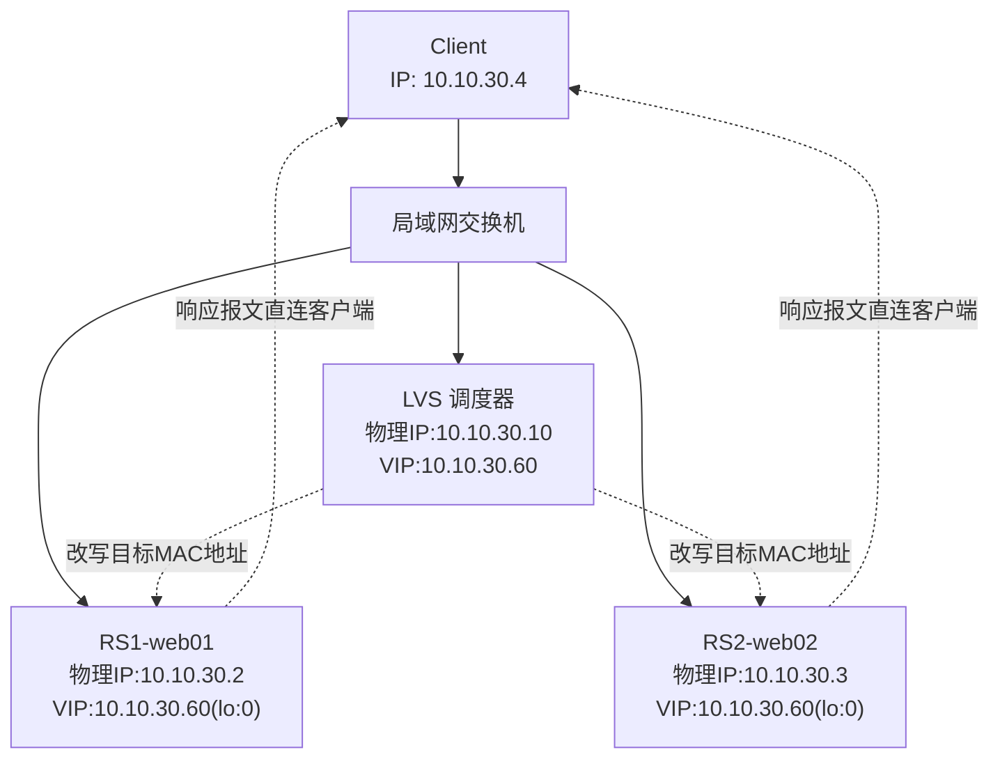
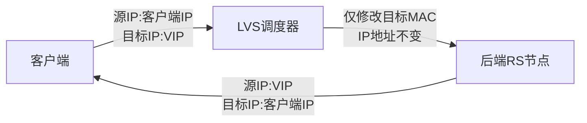

# LVS-DR 模式部署详解（轮询调度）
## 一、环境规划
### 1. 主机IP信息
| 角色 | 主机名 | 物理网卡IP | 虚拟IP(VIP) |
| ---- | ---- | ---- | ---- |
| 客户端 | Client | 10.10.30.4 | - |
| LVS调度器 | LVS Server | 10.10.30.10 | 10.10.30.60 |
| 后端节点1 | RS1-web01 | 10.10.30.2 | 10.10.30.60 |
| 后端节点2 | RS2-web02 | 10.10.30.3 | 10.10.30.60 |

### 2. 环境说明
- 集群模式：**LVS-DR（直接路由模式）**
- 调度算法：**rr 轮询调度**
- 所有主机处于同一局域网，通过交换机互通

## 二、网络拓扑图
### 1. 整体架构拓扑


### 2. 数据包流转流程
DR 模式核心特点：**请求报文经LVS转发，响应报文由后端RS直接返回客户端**，不经过调度器，性能损耗极低。


## 三、前置配置（所有后端RS节点）
DR 模式要求所有后端节点绑定相同VIP到**回环网卡 lo:0**，并关闭ARP广播，防止IP冲突。

### 1. 配置虚拟IP（lo:0）
```bash
# 临时生效，重启失效
ifconfig lo:0 10.10.30.60 netmask 255.255.255.255 broadcast 10.10.30.60 up
```

### 2. 关闭ARP响应（关键配置）
```bash
# 临时关闭ARP
echo 1 > /proc/sys/net/ipv4/conf/lo/arp_ignore
echo 2 > /proc/sys/net/ipv4/conf/lo/arp_announce
echo 1 > /proc/sys/net/ipv4/conf/all/arp_ignore
echo 2 > /proc/sys/net/ipv4/conf/all/arp_announce
```

> 参数说明：
> - `arp_ignore=1`：仅当请求目标IP是本机入站网卡IP时，才响应ARP
> - `arp_announce=2`：使用最佳网卡地址对外宣告ARP，避免VIP被抢占

## 四、LVS 调度器配置
### 1. 绑定VIP到物理网卡
```bash
ifconfig ens33:0 10.10.30.60 netmask 255.255.255.255 broadcast 10.10.30.60 up
```

### 2. 开启内核转发（可选，DR模式非必需）
```bash
echo 1 > /proc/sys/net/ipv4/ip_forward
```

### 3. 使用 ipvsadm 配置LVS规则
```bash
# 1. 清空原有规则
ipvsadm -C

# 2. 添加虚拟服务，指定VIP、端口、DR模式、轮询调度
ipvsadm -A -t 10.10.30.60:80 -s rr

# 3. 添加后端真实服务器
ipvsadm -a -t 10.10.30.60:80 -r 10.10.30.2:80 -g
ipvsadm -a -t 10.10.30.60:80 -r 10.10.30.3:80 -g
```

> 参数释义：
> - `-A`：创建虚拟集群服务
> - `-t`：使用TCP协议
> - `-s rr`：指定调度算法为轮询
> - `-a`：添加后端真实节点
> - `-r`：指定后端RS IP与端口
> - `-g`：指定工作模式为 **DR（直接路由）**

### 4. 查看LVS规则
```bash
ipvsadm -Ln
```

## 五、后端RS节点部署Web服务
两台后端节点部署Nginx/Apache等Web服务，监听80端口，用于测试负载均衡效果。
```bash
# 以Nginx为例
yum install nginx -y
systemctl start nginx
systemctl enable nginx
```

可修改默认页面内容，区分两台节点，直观看到轮询效果。

## 六、功能测试
1. 客户端浏览器/访问工具直接访问 `http://10.10.30.60`
2. 多次刷新页面，观察页面内容交替变化，验证**轮询调度**生效
3. 在LVS调度器执行 `ipvsadm -Ln --stats` 查看连接数，确认两台RS均被分配请求

## 七、持久化配置（防止重启失效）
### 1. LVS规则持久化
```bash
# 保存规则
ipvsadm -S > /etc/sysconfig/ipvsadm

# 开机加载规则
echo "ipvsadm -R < /etc/sysconfig/ipvsadm" >> /etc/rc.local
chmod +x /etc/rc.local
```

### 2. RS节点ARP与VIP开机自启
将VIP配置、ARP内核参数写入 `/etc/rc.local`，实现开机自动生效。

---
### 补充说明
1. Mermaid 绘图在 CSDN、掘金、GitBook、Typora 等主流 Markdown 编辑器/平台均兼容，无需额外上传图片；
2. DR 模式是LVS三种模式中**性能最优**的方案，适用于同网段大规模Web集群；
3. 所有节点必须保证VIP掩码为 `255.255.255.255`（32位掩码），否则会出现路由异常。