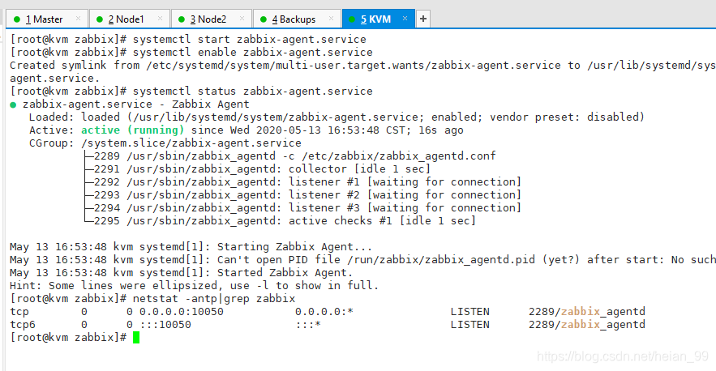
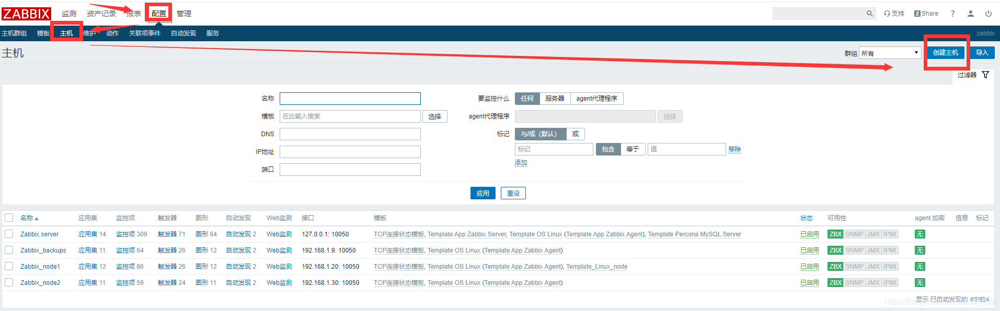
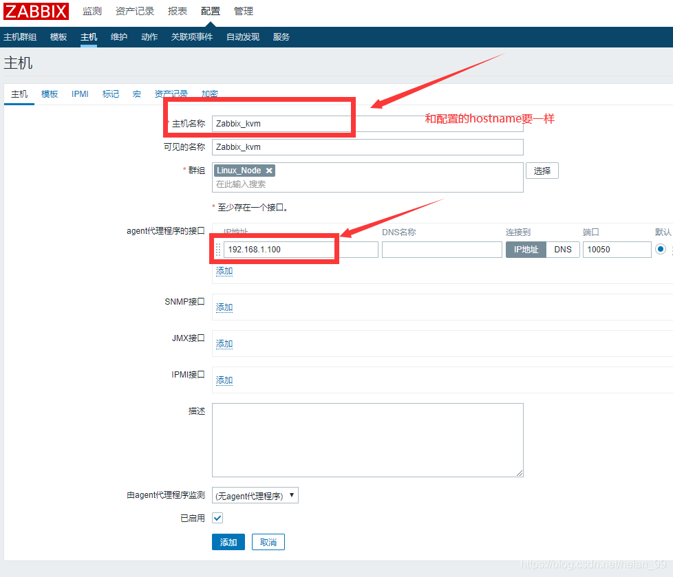
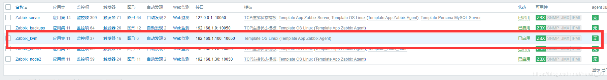
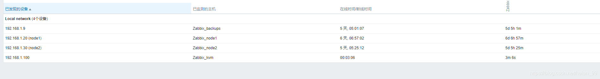
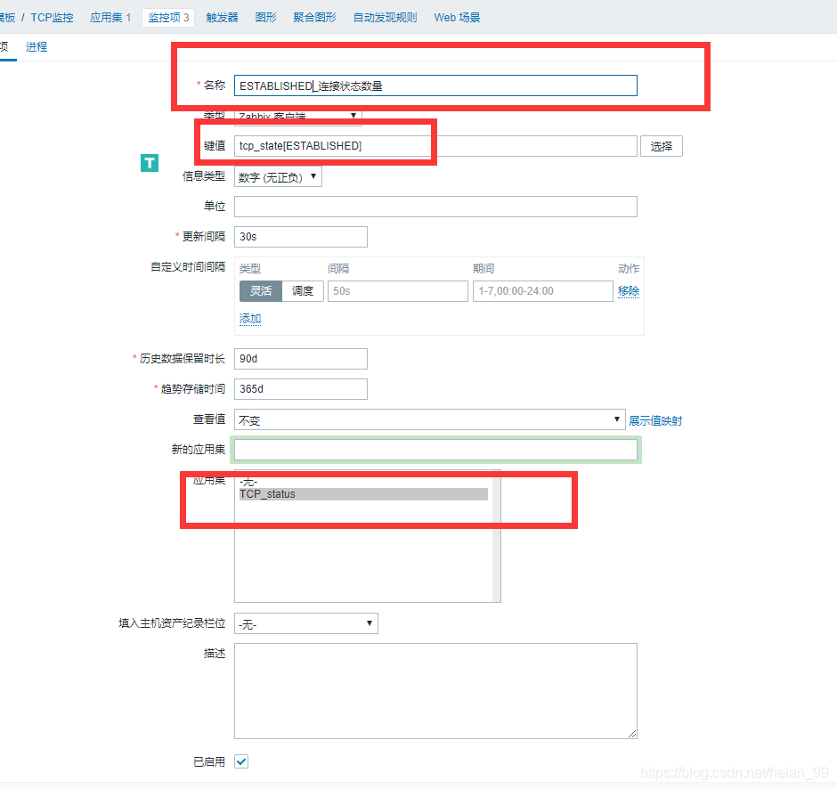
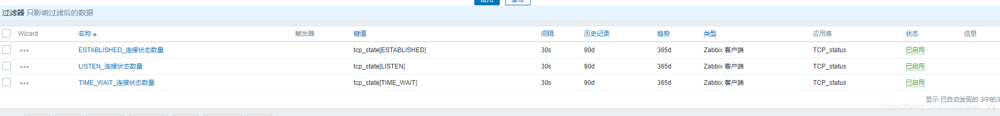
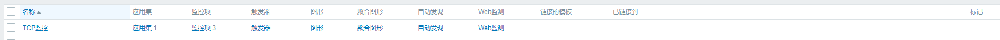
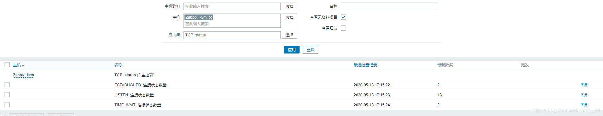
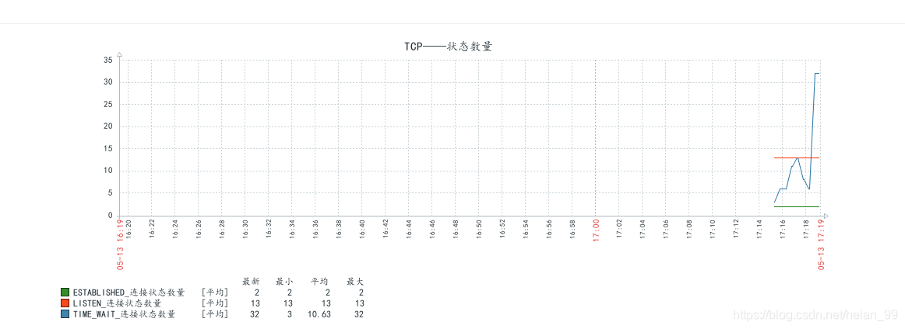

### 前言

**[Centos7安装Zabbix服务端、Zabbix客户端和Win客户端配置（源码编译安装）](https://blog.csdn.net/heian_99/article/details/106023595)**

前面介绍怎么源码编译安装Zabbix和主机添加。下面要介绍怎么添加模板和自定义监控

### 如何入手监控

> 1.硬件监控 路由器、交换机、防火墙
>
> 2.系统监控 CPU、内存、磁盘、网络、进程、 TCP
>
> 3.服务监控 nginx、 php、 tomcat、 redis、 memcache、 mysql
>
> 4.WEB 监控 请求时间、响应时间、加载时间、
>
> 5.日志监控 ELk（收集、存储、分析、展示） 日志易
>
> 6.安全监控 Firewalld、 WAF(Nginx+lua)、安全宝、牛盾云、安全狗
>
> 7.网络监控 smokeping 多机房
>
> 8.业务监控 活动引入多少流量、产生多少注册量、带来多大价值

### 一、zabbix 快速监控主机

#### **1.安装zabbix-agent**

```
rpm -ivh https://mirror.tuna.tsinghua.edu.cn/zabbix/zabbix/4.0/rhel/7/x86_64/zabbix-agent-4.0.4-1.el7.x86_64.rpm
```

#### **2.配置zabbix-agent(修改配置)**

```
[root@kvm zabbix]# grep "^[a-Z]" /etc/zabbix/zabbix_agentd.conf
PidFile=/var/run/zabbix/zabbix_agentd.pid
LogFile=/var/log/zabbix/zabbix_agentd.log
LogFileSize=0
Server=192.168.1.10
ServerActive=192.168.1.10
Hostname=Zabbix_kvm
Include=/etc/zabbix/zabbix_agentd.d/*.conf
```

#### **3.启动zabbix-agent并检查**



#### **4.zabbix-web界面，添加主机**







**这边配置自动发现和自动注册（可以自动发现和添加主机和模板）**



### 二、自定义监控主机小试身手

#### 1.监控需求

监控TCP3种状态集

#### 2.命令行实现

```bash
[root@kvm zabbix]#  netstat -ant|grep -c TIME_WAIT
1
[root@kvm zabbix]#  netstat -ant|grep -c LISTEN
13
```

#### 3.编写zabbix监控文件(传参形式)

```bash
[root@kvm zabbix]# cat /etc/zabbix/zabbix_agentd.d/tcp_status.conf
UserParameter=tcp_state[*],netstat -ant|grep -c $1
[root@kvm zabbix]# systemctl restart zabbix-agent.service
```

#### 4.server端进行测试

```bash
[root@master zabbix]# /data/zabbix/bin/zabbix_get -s 192.168.1.100  -k tcp_state[TIME_WAIT]
6
[root@master zabbix]# /data/zabbix/bin/zabbix_get -s 192.168.1.100  -k tcp_state[LISTEN]
13
```

#### 5.web端添加








数据出来了




