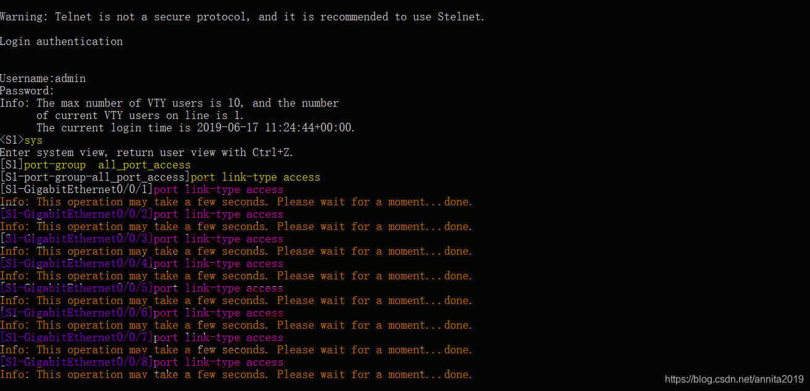

# 06.三层交换机VLAN间的通信及访问外网


## 本节重点

- VLAN划分

```bash
[sw1]int g0/0/1
[sw1-GigabitEthernet0/0/1]port link-type access 
[sw1-GigabitEthernet0/0/1]port default vlan 10
[sw1-GigabitEthernet0/0/1]q
```

- Trunk的配置

```bash
port link-type trunk
 port trunk allow-pass vlan all 
 port trunk allow-pass vlan 10 20 30
```

- 三层交换机VLAN间的通信
- 端口组的配置

## VLAN间的通信实验

### 实验拓扑


### 拓扑分析

* Access交换机配置直接可以当作二层交换机，只需要划分`vlan10、vlan20`两个vlan即可。
* SW2 `g0/0/22` 不需要配IP地址，配置成trunk类型。并且创建vlan10 vlan20 ，分别给这两个vlan配置虚接口IP：`Vlanif10 192.168.10.254 24`，`Vlanif20 192.168.20.254 24`
* SW2 `g0/0/24` 不需要配IP地址，只能把G0/0/24加入到vlan99，vlan99配置IP地址接口类型Access，同样需要给vlan99配置虚接口：`Vlanif99 192.168.99.1`，用于和路由器(R1)的`g0/0/0`通讯。

### 配置步骤

PC配置IP、子掩码、网关  
SW1上二层交换机上划分VLAN，并把相应的PC接口加入  
SW1、SW2之间的两个端口配置Trunk  
SW2上面配置创建VLAN10/20/99，配置VTP，并把24口加入到vlan99，最后加一条静态路由指向网关。  
R1配置接口信息，添加静态路由  
R2配置接口信息，添加静态路由

### SW1 Access接入交换机配置

Access交换机我们可以当他是二层交换机

```bash
The device is running!

<Huawei>
<Huawei>sys
Enter system view, return user view with Ctrl+Z.
[Huawei]sys Access
[Access]undo info-center enable    #关闭消息提示，这个很烦人
Info: Information center is disabled.
[Access]vlan batch 10 20
Info: This operation may take a few seconds. Please wait for a moment...done.

[Access]int g0/0/1
[Access-GigabitEthernet0/0/1]	
[Access-GigabitEthernet0/0/1]port link-type access 
[Access-GigabitEthernet0/0/1]port default vlan 10
[Access-GigabitEthernet0/0/1]int g0/0/2
[Access-GigabitEthernet0/0/2]port link-type access
[Access-GigabitEthernet0/0/2]port default vlan 20
[Access-GigabitEthernet0/0/2]q

[Access]int g0/0/22
[Access-GigabitEthernet0/0/22]port link-type trunk   #配置22为trunk
[Access-GigabitEthernet0/0/22]port trunk allow-pass vlan 10 20    #允许vlan10和20通过
[Access-GigabitEthernet0/0/22]q
[Access] User interface con0 is available
```

### SW2三层交换机的配置

```bash
The device is running!

<Huawei>
<Huawei>sys
Enter system view, return user view with Ctrl+Z.
[Huawei]sys sw2
[sw2]
[sw2]undo info-center enable    #关闭消息提示
Info: Information center is disabled.

[sw2]
[sw2]vlan batch 10 20
Info: This operation may take a few seconds. Please wait for a moment...done.
[sw2]int g0/0/22
[sw2-GigabitEthernet0/0/22]port link-type trunk
[sw2-GigabitEthernet0/0/22]port tr all vlan 10 20
[sw2-GigabitEthernet0/0/22]port trunk allow-pass  vlan 10 20
[sw2-GigabitEthernet0/0/22]q

[sw2]interface Vlanif 10                 #进入vlan10
[sw2-Vlanif10]ip add 192.168.10.254 24   #给vlan10虚接口配置IP 192.168.10.254
[sw2-Vlanif10]q

[sw2]interface Vlanif 20
[sw2-Vlanif20]ip add 192.168.20.254 24  #给vlan20虚接口配置IP 192.168.20.254
[sw2-Vlanif20]q


[sw2]vlan 99                            #创建vlan99
[sw2-vlan99]q
[sw2]int g0/0/24	
[sw2-GigabitEthernet0/0/24]port link-type access     #g0/0/24需要配成access
[sw2-GigabitEthernet0/0/24]port default vlan 99      #g0/0/24加入vlan99
[sw2-GigabitEthernet0/0/24]q

[sw2]interface Vlanif 99
[sw2-Vlanif99]ip add 192.168.99.1 24    #给Vlan99虚接口配置IP 192.168.99.1
[sw2-Vlanif99]q
[sw2]ip route-static 0.0.0.0 0.0.0.0 192.168.99.2   #加入默认路由指向网关
```

### R1路由器配置

```bash
The device is running!
<Huawei>sys
Enter system view, return user view with Ctrl+Z.
[Huawei]sys R1
[R1]undo info-center enable
Info: Information center is disabled.

[R1]int g0/0/0
[R1-GigabitEthernet0/0/0]ip add 192.168.99.2 24
[R1-GigabitEthernet0/0/0]q
[R1]ip route-static 192.168.10.0 24 192.168.99.1   #加入静态路由
[R1]ip route-static 192.168.20.0 24 192.168.99.1   #加入静态路由
[R1]ip route-static 192.168.30.0 24 10.10.30.2     #加入静态路由


[R1]display ip routing-table                       #查看路由表
Route Flags: R - relay, D - download to fib
------------------------------------------------------------------------------
Routing Tables: Public
         Destinations : 13       Routes : 13       

Destination/Mask    Proto   Pre  Cost      Flags NextHop         Interface

     10.10.30.0/24  Direct  0    0           D   10.10.30.1      GigabitEthernet0/0/1
     10.10.30.1/32  Direct  0    0           D   127.0.0.1       GigabitEthernet0/0/1
   10.10.30.255/32  Direct  0    0           D   127.0.0.1       GigabitEthernet0/0/1
      127.0.0.0/8   Direct  0    0           D   127.0.0.1       InLoopBack0
      127.0.0.1/32  Direct  0    0           D   127.0.0.1       InLoopBack0
127.255.255.255/32  Direct  0    0           D   127.0.0.1       InLoopBack0
 `192.168.10.0/24`  Static  60   0          RD   192.168.99.1    GigabitEthernet0/0/0   
 `192.168.20.0/24`  Static  60   0          RD   192.168.99.1    GigabitEthernet0/0/0  
 `192.168.30.0/24`  Static  60   0          RD   10.10.30.2      GigabitEthernet0/0/1
   #上面这3条是我们加的
   192.168.99.0/24  Direct  0    0           D   192.168.99.2    GigabitEthernet0/0/0
   192.168.99.2/32  Direct  0    0           D   127.0.0.1       GigabitEthernet0/0/0
 192.168.99.255/32  Direct  0    0           D   127.0.0.1       GigabitEthernet0/0/0
255.255.255.255/32  Direct  0    0           D   127.0.0.1       InLoopBack0

[R1]
```

### R2路由器配置

```bash
<Huawei>sys
Enter system view, return user view with Ctrl+Z.
[Huawei]sys R2
[R2]
[R2]int g0/0/0
[R2-GigabitEthernet0/0/0]ip add 10.10.30.2 24
[R2-GigabitEthernet0/0/0]q
[R2]ip route-static 0.0.0.0 0.0.0.0 10.10.30.1
[R2]
[R2]int g0/0/1
[R2-GigabitEthernet0/0/1]ip add 192.168.30.254 24
[R2-GigabitEthernet0/0/1]
```

### 验证结果

用PC1`ping` PC3

```bash
PC>ping 192.168.30.1

Ping 192.168.30.1: 32 data bytes, Press Ctrl_C to break
Request timeout!
From 192.168.30.1: bytes=32 seq=2 ttl=125 time=63 ms
From 192.168.30.1: bytes=32 seq=3 ttl=125 time=47 ms
From 192.168.30.1: bytes=32 seq=4 ttl=125 time=62 ms
From 192.168.30.1: bytes=32 seq=5 ttl=125 time=47 ms

--- 192.168.30.1 ping statistics ---
  5 packet(s) transmitted
  4 packet(s) received
  20.00% packet loss
  round-trip min/avg/max = 0/54/63 ms
```

用PC2`ping` PC3

```bash
PC>ping 192.168.30.1

Ping 192.168.30.1: 32 data bytes, Press Ctrl_C to break
From 192.168.30.1: bytes=32 seq=1 ttl=125 time=62 ms
From 192.168.30.1: bytes=32 seq=2 ttl=125 time=47 ms
From 192.168.30.1: bytes=32 seq=3 ttl=125 time=62 ms
From 192.168.30.1: bytes=32 seq=4 ttl=125 time=47 ms
From 192.168.30.1: bytes=32 seq=5 ttl=125 time=63 ms

--- 192.168.30.1 ping statistics ---
  5 packet(s) transmitted
  5 packet(s) received
  0.00% packet loss
  round-trip min/avg/max = 47/56/63 ms
```

‍

## 端口组

端口组-批量配置端口详解，华为交换机中的批量处理端口的配置(思科中叫端口组配置)，即快速配置具有相同配置的接口。

#### 1、创建端口组名称

```bash
port-group name       #命令用来创建Port Group名称。
undo port-group name  #命令用来删除Port Group名称。
display port-group    #命令用来查看永久端口组的成员接口信息。
```


#### 2、在端口组里面添加成员

```bash
group-member        #命令将指定的以太网接口添加到端口组中。
```


#### 2、查看端口组里面成员

```bash
[Huawei-port-group-all_port_access]dis this
#
port-group all_port_access
 group-member GigabitEthernet0/0/1
 group-member GigabitEthernet0/0/2
#
return
[Huawei-port-group-all_port_access]
```

#### 3、在端口组里面删除成员

```bash
undo group-member    #命令将指定的以太网接口从端口组中删除。
```


#### 4、给端口组配置命令

例如：将all\_port\_access端口组中的接口模式设置为access模式。  
进入端口组后命令：

```bash
port link-type access
```



‍