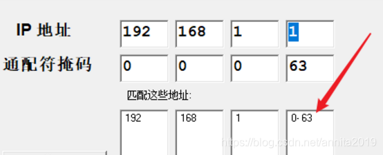

# ACL访问控制列表详解及配置示例

## 一、ACL介绍
**ACL的定义**

<font color='red'>访问控制列表（Access Control Lists，ACL）</font>是<font color='orange'>应用在路由器接口的指令列表</font>。

这些指令列表用来告诉路由器哪些数据包可以收、哪些数据包需要拒绝。至于数据包是被接收还是拒绝，可以由类似于源地址、目的地址、端口号等的特定指示条件来决定。

**ACL作用**

访问控制是网络安全防范和保护的主要策略，它的主要任务是保证网络资源不被非法使用和访问。它是保证网络安全最重要的核心策略之一。访问控制涉及的技术也比较广，包括入网访问控制、网络权限控制、目录级控制以及属性控制等多种手段。

**应用设备—路由器**

访问控制列表（`Access Control Lists,ACL`）是应用在<font color='red'>路由器接口</font>的指令列表。这些指令列表用来告诉路由器哪些数据包可以收、哪些数据包需要拒绝。至于数据包是被接收还是拒绝，可以由类似于源地址、目的地址、端口号等的特定指示条件来决定。

访问控制列表不但可以起到控制网络流量、流向的作用，而且在很大程度上起到保护网络设备、服务器的关键作用。作为外网进入企业内网的第一道关卡，路由器上的访问控制列表成为保护内网安全的有效手段。

> [!CAUTION]
>
> 注意：这里的路由器也包含三层交换机.

**ACL的工作原理**

基本原理：ACL使用包<font color='red'>过滤</font>技术，在路由器上读取第三层及第四层包头中的信息如源地址、目的地址、源端口、目的端口等，根据预先定义好的规则对包进行过滤，从而达到访问控制的目的。

**ACL的功能**

功能：网络中的节点有资源节点和用户节点两大类，其中资源节点提供服务或数据，用户节点访问资源节点所提供的服务与数据。ACL的主要功能就是一方面保护资源节点，阻止非法用户对资源节点的访问，另一方面限制特定的用户节点所能具备的访问权限。

**ACL的方向**

ACL是一组规则的集合，它应用在路由器的某个接口，对路由器接口而言，ACL有两个方向。

- 出：已经过路由器的处理，正离开路由器的数据包。
- 入：已到达路由器接口的数据包，将被路由器处理，


**ACL步长**

> - 步长是指在交换机自动为ACL规则分配编号的时候，每个相邻规则编号之间的差值。例如，如果将步长设定为5，规则编号分配是按照0、5、10、15…这样的规律分配的。缺省情况下，步长为5。
> - 当步长改变后，ACL中的规则编号会自动重新排列。例如，原来规则编号为0、5、10、15，当通过命令把步长改为2后，则规则编号变成0、2、4、6。
> - 当使用命令将步长恢复为缺省值后，交换机将立刻按照缺省步长调整ACL规则的编号。例如：ACL 3001，步长为2，下面有4个规则，编号为0、2、4、6。如果此时使用命令将步长恢复为缺省值，则ACL规则编号变成0、5、10、15，步长为5。
> - 设置适当的步长，有助于用户对ACL的管理，如方便在规则之间插入新的规则。例如配置好了4个规则，规则编号为：0、5、10、15。此时如果用户希望能在第一条规则之后插入一条规则，则可以使用命令在0和5之间插入一条编号为1的规则。
> - 另外，在定义一条ACL规则的时候，用户可以不指定规则编号，这时，系统会从0开始，按照步长，自动为规则分配一个大于现有最大编号的最小编号。假设现有规则的最大编号是28，步长是5，那么系统分配给新定义的规则的编号将是30。

## 二、ACL分类配置及前缀列表

### 1、ACL分类

```bash
[sw1]acl ?
  INTEGER<2000-2999>基本访问列表     	  Basic access-list(add to current using rules)
  INTEGER<3000-3999>高级访问列表      	  Advanced access-list(add to current using rules)
  INTEGER<4000-4999>指定L2 acl组       	  Specify a L2 acl group
  INTEGER<5000-5999>用户定义的访问列表 	  User defined access-list
  ipv6                ACL IPv6 
  name                Specify a named ACL
  number              Specify a numbered ACL
```


| 分类    | 编号范围  | 参数                                               |
| ------- | --------- | -------------------------------------------------- |
| 基本ACL | 2000~2999 | 源IP地址等                                         |
| 高级ACL | 3000~3999 | 源IP地址，目的IP地址，源端口，目的端口，协议类型等 |
| 二层ACL | 4000~4999 | 源MAC地址，目的MAC地址，以太帧协议类型等           |
| 用户ACL | 6000~6031 | 源IP地址，目的IP地址，源端口，目的端口，协议类型等 |


> - 一个ACL可以由多条“deny | permit”语句组成，每一条语句描述了一条规则。
> - 设备收到数据流量后，会逐条匹配ACL规则，看其是否匹配。如果不匹配，则匹配下一条。一旦匹配，则执行规则中定义的动作，并不再继续与后续规则进行匹配。如果找不到匹配的规则，则设备不对报文进行任何处理。
> - 规则的匹配顺序决定了规则的优先级，ACL通过设置规则的优先级来处理规则之间重复或矛盾的情形。
> - ARG3系列路由器支持两种匹配顺序：配置顺序和自动排序。配置顺序按ACL规则编号（rule-id）从小到大的顺序进行匹配。通过设置步长，使规则之间留有一定的空间。默认步长是5。路由器匹配规则时默认采用配置顺序。自动排序使用“深度优先”的原则进行匹配，即根据规则的精确度排序。

通配符掩码：0 ---表示匹配，1 ---表示忽略，ACL 用于匹配流量默认隐含一条permit any， 用于匹配路由默认隐含一条deny any。

### 2、基本 ACL（2000-2999）

**特点**：仅匹配源 IP、分片信息、生效时间段，常用于简单的源地址过滤。

**配置示例**：

```plaintext
# 创建基本ACL 2000，拒绝源IP为192.168.1.0/24的报文，允许其他
acl number 2000  
 rule 5 deny source 192.168.1.0 0.0.0.255 
 rule 10 permit  
# 绑定生效时间段（需先创建时间段）
time-range worktime 08:00 to 18:00 working-day  
acl number 2001  
 rule 5 deny source 10.0.0.0 0.255.255.255 time-range worktime  
```

> 默认会拒绝其他，所以不要忘记第二条：允许其他
>
> rule 10 permit   允许其他

### 3、二层 ACL（4000-4999）

**特点**：基于以太网帧头信息（源 MAC、目的 MAC、二层协议类型如 ARP、IP）。

**配置示例**：

```plaintext
# 拒绝源MAC为00e0-fc12-3456的报文
acl number 4000  
 rule 5 deny l2-protocol source-mac 00e0-fc12-3456 ffff-ffff-ffff  
# 允许ARP协议报文
 rule 10 permit l2-protocol arp  
```

> `ffff-ffff-ffff`，MAC地址的**掩码**（也叫通配符），``表示精确匹配前面的源 MAC 地址`00e0-fc12-3456`（掩码全为 1 时，要求 MAC 地址每一位都完全一致）。

### 4、高级 ACL（3000-3999）

**特点**：支持源 / 目的 IP、协议类型（TCP/UDP/ICMP）、端口号、时间段，功能最全面。

**配置示例**：

```plaintext
# 拒绝TCP协议目的端口80（HTTP）的报文
acl number 3000  
 rule 5 deny tcp destination-port eq 80  
# 允许ICMP协议（ping），限制源IP
 rule 10 permit icmp source 192.168.2.0 0.0.0.255  
# 拒绝特定IP段的UDP报文
 rule 15 deny udp source 172.16.0.0 0.15.255.255 destination 10.1.1.1 0.0.0.0  
```

### 5、用户 ACL（6000-6031）

**特点**：类似高级 ACL，但编号范围更小，适用于用户自定义精细规则。

**配置示例**：

```plaintext
acl number 6000  
 rule 5 permit tcp source 192.168.3.0 0.0.0.255 destination-port eq 22（SSH）  
 rule 10 deny ip source any destination 10.0.0.1 0.0.0.0  
```

### 6、前缀列表（ip-prefix）

**特点**：精确匹配网络号和前缀长度，多用于路由策略（如OSPF/BGP路由过滤），**不用于数据包过滤**。这里是需要了解即可！

**配置示例**：

```plaintext
# 匹配192.168.0.0/24和10.0.0.0/8网段
ip ip-prefix ROUTE_PERMIT index 10 permit 192.168.0.0 24  
ip ip-prefix ROUTE_PERMIT index 20 permit 10.0.0.0 8  
# 在路由协议中调用（如OSPF）
ospf 1  
 filter-policy ip-prefix ROUTE_PERMIT import  
```

### 7、关键区别总结

| 类型     | 匹配维度                         | 典型应用场景               |
| -------- | -------------------------------- | -------------------------- |
| 基本 ACL | 源 IP、分片、时间段              | 简单源地址过滤             |
| 二层 ACL | MAC 地址、二层协议               | 交换机端口 MAC 过滤        |
| 高级 ACL | 源 / 目的 IP、协议、端口、时间段 | 复杂流量控制（如端口封禁） |
| 用户 ACL | 同高级 ACL，编号范围小           | 用户级精细规则             |
| 前缀列表 | 网络号 + 前缀长度                | 路由过滤                   |

### 8、注意事项

1. ACL 规则按**编号从小到大**匹配，匹配即停止，需合理规划规则顺序。
2. 高级 ACL 建议部署在**靠近目的端**的设备，减少无效流量转发。
3. 前缀列表支持**前缀长度范围**（如`permit 10.0.0.0 8 less-equal 24`），灵活性高于 ACL。

接下来让我们看几个实验，历练一下！！！！

## 三、实验1：三层交换机直连过滤

实验要求：PC1不允许访问PC3，PC3可以访问PC1


分析问题：

PC1不允许访问PC3，问题中含有`“目标地址”`则我们需要设置目标地址，这样基本ACL是不行的，必须使用高级ACL


```bash 
[sw1]acl ? 
  INTEGER<2000-2999>基本访问列表   源IP地址等  
  INTEGER<3000-3999>高级访问列表   源IP地址，目的IP地址，源端口，目的端口，协议类型等
  INTEGER<4000-4999>指定L2 acl组   源MAC地址，目的MAC地址，以太帧协议类型等  
  INTEGER<5000-5999>用户自定义     源IP地址，目的IP地址，源端口，目的端口，协议类型等

  ipv6                ACL IPv6  
  name                Specify a named ACL    
  number              Specify a numbered ACL 
```
这里我选择了高级ACL，并且可以自定义名称的。
```bash  
[sw1]acl name not10to30 advance	  #advance高级，not10to30我起的名字
[sw1-acl-adv-not10to30]rule deny ip source 192.168.10.0 0.0.0.255 destination 192.168.30.0 0.0.0.255	  #禁止192.168.10.0访问192.168.30.0
[sw1-acl-adv-not10to30]rule permit ip source any   #允许其他
[sw1-acl-adv-not10to30]q  

[sw1]int g0/0/1	  
[sw1-GigabitEthernet0/0/1]traffic-filter inbound acl name not10to30  #挂到接口
```

## 四、实验2：源地址整网段

### 实验要求

> <font color='red'>禁止源地址为192.168.2.0段访问server1</font>

### 过滤的位置

> 针对源地址，靠近目的端配置，AR2的g0/0/1接口，为什么不在g0/0/0？
>
> 那是因为：假如AR2还有另一个分支的话，就会干扰这个分支.


### 基本ACL的语法
```bash
[R1]acl ?
  INTEGER<2000-2999>  Basic access-list(add to current using rules)
  INTEGER<3000-3999>  Advanced access-list(add to current using rules)
  INTEGER<4000-4999>  Specify a L2 acl group
  ipv6                ACL IPv6 
  name                Specify a named ACL
  number              Specify a numbered ACL
[R1]acl 2000
[R1-acl-basic-2000]?
acl-basic interface view commands:
  arp-ping     ARP-ping
  backup       Backup  information
  clear        Clear
  description  Specify ACL description
  dialer       Dialer
  display      Display information
  mtrace       Trace route to multicast source
  ping         <Group> ping command group
  quit         Exit from current mode and enter prior mode
  reset        <Group> reset command group
  return       Enter the privileged mode
  rule         Specify an ACL rule
  step         Specify step of ACL sub rule ID
  test-aaa     Accounts test
  tracert      <Group> tracert command group
  undo         Negate a command or set its defaults
[R1-acl-basic-2000]ru	
[R1-acl-basic-2000]rule ?
  INTEGER<0-4294967294>  ID of ACL rule
  deny                   Specify matched packet deny
  permit                 Specify matched packet permit
  
#不允许源地址为192.168.1.0整段通过
[R1-acl-basic-2000]rule deny source 192.168.1.0 0.0.0.255   

#把上面这条应用到接口GigabitEthernet0/0/0
[R1-acl-basic-2000]int g0/0/0
[R1-GigabitEthernet0/0/0]traffic-filter  inbound acl 2000  
```


## 四、实验3：非整个网段的过滤
### 实验说明
> 说明：拓扑如下图，两个路由器之间已经加了静态路由，已经是全网互通状态。
> 要求：不允许192.168.1.1到192.168.1.100这100个主机和PC3的通信


### 过滤的位置
选在如图红色箭头所指AR1的g0/0/0接口。像这种中间没有分支的拓扑，<font color='red'>**数据包越早丢弃越好**</font>。

### 分析通配符分析
要求的源地址是：192.168.1.1-192.168.1.100，这里不能设置范围所以必须用通配符把源地址范围过滤出来。

这里我们利用了一个<font color='red'>**掩码计算器**</font>，简单实用。

先过滤掉192.168.1.0~63，箭头所指最好是连续的

再过滤掉192.168.1.64~95


再过滤掉192.168.1.96~100

根据上面的分析，ACL规则如下：
```bash
acl number 2000  
 rule 5 deny source 192.168.1.0 0.0.0.63 
 rule 10 deny source 192.168.1.64 0.0.0.31 
 rule 15 deny source 192.168.1.96 0.0.0.4
```
将规则应用到AR1的g0/0/0接口
```bash
int g0/0/0
traffic-filter  inbound acl 2000
```


