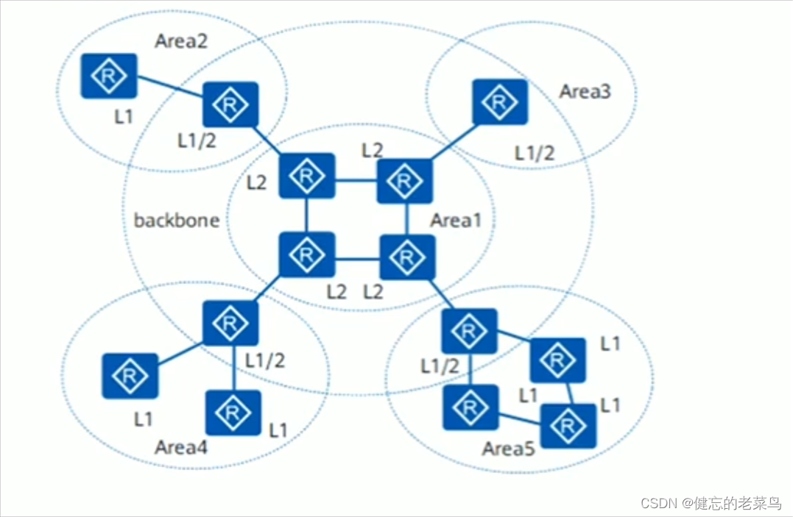
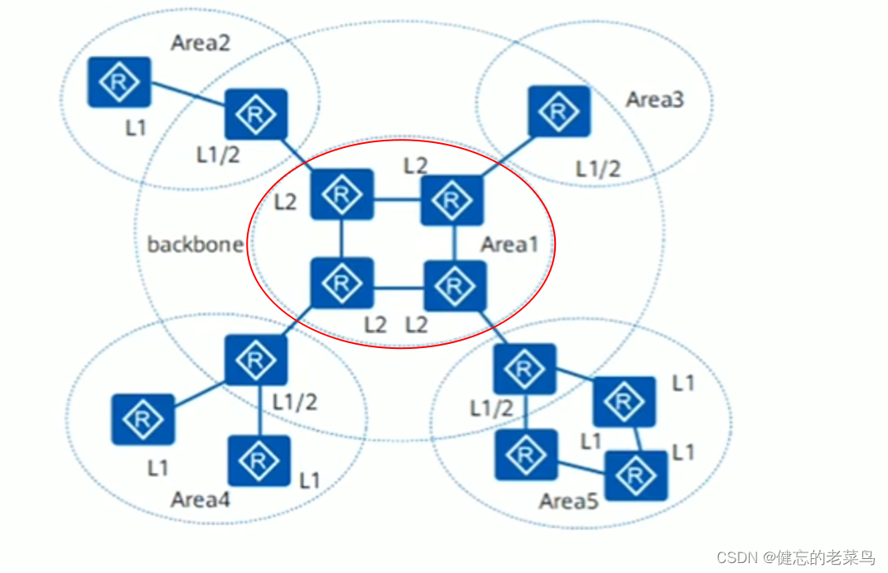
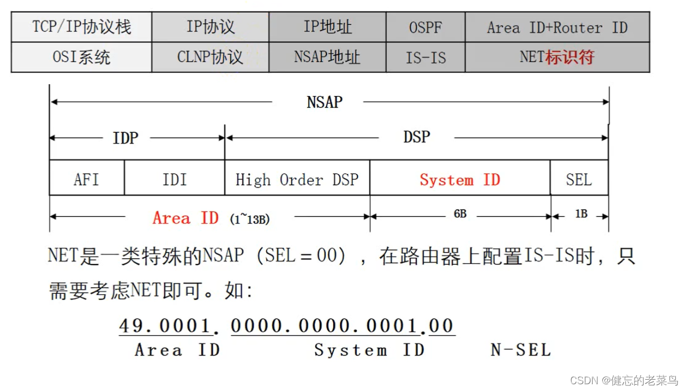

# 一、概述
>IS-IS（Intermediate System-to-Intermediate System，==中间系统到中间系统==）路由协议最初是ISO（国际标准化组织）为CLNP（Connection Less Network Protocol，无连接网络协议）设计的一种==动态路由协议==，也是一种==基于链路状态并使用最短路径优先算法（SPF）进行路由计算的一种IGP协议==。

>IS-IS是一种链路状态路由协议，每一台路由器都会生成一个LSP，它是该路由器所有使能IS-IS协议接口的链路状态信息的集合。通过跟相邻设备建立IS-IS邻接关系，互相更新本地的LSDB，使LSDB与整个IS-IS网络其他设备的LSDB同步，然后根据LSDB运用SPF算法计算出IS-IS路由。如果此IS-IS路由是到目的地址的最优路由，则此路由会记录到IP路由表中，并指导报文的转发。

# 二、网络类型
- 点对点（P2P）网络类型
- 广播型（MA）网络类型

# 三、拓扑结构
IS-IS在自治系统内采用骨干区域与非骨干区域两级的分层结构。

一般来说，将Level-1路由器部署在非骨干区域，将Level-2路由器部署在骨干区域，每一个非骨干区域都通过Level-1-2路由器与骨干区域相连。

==IS-IS 的一个路由器的所有接口肯定在同一个区域==




# 四、路由器类型
## Level-1路由器
Level-1路由器负责区域内的路由，它只与属于同一区域的Level-1和Level-1-2路由器形成邻居关系，属于不同区域的Level-1路由器不能形成邻居关系。Level-1路由器只负责维护Level-1的链路状态数据库LSDB（Link State Database），该LSDB包含本区域的路由信息，到本区域外的报文转发给最近的Level-1-2路由器。


## Level-2路由器
Level-2路由器负责区域间的路由，它可以与同一或者不同区域的Level-2路由器或者其它区域的Level-1-2路由器形成邻居关系。Level-2路由器维护一个Level-2的LSDB，该LSDB包含区域间的路由信息。

所有Level-2级别（即形成Level-2邻居关系）的路由器组成路由域的骨干网，负责在不同区域间通信。路由域中Level-2级别的路由器必须是物理连续的，以保证骨干网的连续性。只有Level-2级别的路由器才能直接与区域外的路由器交换数据报文或路由信息。




## Level-1-2路由器
同时属于Level-1和Level-2的路由器称为Level-1-2路由器，它可以与同一区域的Level-1和Level-1-2路由器形成Level-1邻居关系，也可以与其他区域的Level-2和Level-1-2路由器形成Level-2的邻居关系。Level-1路由器必须通过Level-1-2路由器才能连接至其他区域。


# 五、ISIS路由器作用
概念：
- L2路由器，骨干区域里的路由器
- L1路由器，非骨干区域里的路由器
- L1/2路由器，其实就是OSPF中的区域边界路由器

作用：
- Level-1-2路由器维护两个LSDB
- Level-1的LSDB用于区域内路由
- Level-2的LSDB用于区域间路由。


# 六、单区域实验
概念这么多，相信大家还未理解，我们做一个小实验。老规矩，对于新手而言，刚开始学习某个协议，不要把拓扑搞的那么复杂，先从最简单的开始。我们先学习单区域，做实验之前，先把拓扑画好。


## AR1配置

```bash
[Huawei]sy ar1
[ar1]int g0/0/0
[ar1-GigabitEthernet0/0/0]ip add 1.1.1.1 24
[ar1-GigabitEthernet0/0/0]q
[ar1]isis 1
[ar1-isis-1]network-entity 10.0000.0000.0001.00
Jul 19 2022 17:22:05-08:00 ar1 %%01ISIS/4/START_ENABLE_ISIS(l)[1]:ISIS 256 enabled all ISIS modules. 
[ar1-isis-1]
[ar1-isis-1]int g0/0/0
[ar1-GigabitEthernet0/0/0]isis enable 1
[ar1-GigabitEthernet0/0/0]q

[ar1]int g0/0/1
[ar1-GigabitEthernet0/0/1]ip add 192.168.10.1 24
[ar1-GigabitEthernet0/0/1]isis enable 1
[ar1-GigabitEthernet0/0/1]

```

## AR2配置

```bash
[Huawei]sy ar2
[ar2]int g0/0/0
[ar2-GigabitEthernet0/0/0]ip add 1.1.1.2 24
[ar2-GigabitEthernet0/0/0]q
[ar2]isis 1
[ar2-isis-1]network-entity 10.0000.0000.0002.00

[ar2-isis-1]int g0/0/0
[ar2-GigabitEthernet0/0/0]isis enable 1
[ar2-GigabitEthernet0/0/0]q

[ar2]int g0/0/1
[ar2-GigabitEthernet0/0/1]ip add 192.168.20.1 24
[ar2-GigabitEthernet0/0/1]isis enable  1
[ar2-GigabitEthernet0/0/1]q
[ar2]dis isis peer         

                          Peer information for ISIS(1)

  System Id     Interface          Circuit Id       State HoldTime Type     PRI
-------------------------------------------------------------------------------
0000.0000.0001  GE0/0/0            0000.0000.0002.01 Up   25s      L1(L1L2) 64 
0000.0000.0001  GE0/0/0            0000.0000.0002.01 Up   21s      L2(L1L2) 64 

Total Peer(s): 2
```

## 验证结果

PC1  ping  PC2
```bash
PC>ping 192.168.20.2

Ping 192.168.20.2: 32 data bytes, Press Ctrl_C to break
Request timeout!
From 192.168.20.2: bytes=32 seq=2 ttl=126 time=15 ms
From 192.168.20.2: bytes=32 seq=3 ttl=126 time=16 ms
From 192.168.20.2: bytes=32 seq=4 ttl=126 time=16 ms
From 192.168.20.2: bytes=32 seq=5 ttl=126 time=16 ms

--- 192.168.20.2 ping statistics ---
  5 packet(s) transmitted
  4 packet(s) received
  20.00% packet loss
  round-trip min/avg/max = 0/15/16 ms

PC>
```

# 七、网络实体名称的基本概念
## 网络实体名称——NET地址
**network-entity 10.0000.0000.0001.00是什么？**

> - 10表示区域号area 10；
> - 0000.0000.0001 是system ID,必须是12个字符，用的是16进制；
> - 00表示isis用来承载的网络协议，00代表IP协议，只要是IP协议都是00.





## 观察ISIS的路由
```bash
<ar1>dis ip routing-table protocol isis 
Route Flags: R - relay, D - download to fib
------------------------------------------------------------------------------
Public routing table : ISIS
         Destinations : 2        Routes : 2        

ISIS routing table status : <Active>
         Destinations : 2        Routes : 2

Destination/Mask    Proto   Pre  Cost      Flags NextHop         Interface

   192.168.20.0/24  ISIS-L1 15   20          D   1.1.1.2         GigabitEthernet0/0/0

ISIS routing table status : <Inactive>
         Destinations : 0        Routes : 0
```

> - 优先级为：15
> - 开销是：20
> - 下一跳：1.1.1.2


# 八、isis和OSPF对比


区域规划

1、ospf的骨干区域，必须area0,isis随便
2、ospf的abr,一个路由器同时属于2个区域，isis,一个路由器只属于1个区域
3、ospf建立邻居，两台设备必须相同区域。isis建立邻居，L2的邻居，可以不同区域


# 九、isis多区域实验


## AR1

```bash
[Huawei]SY AR1

[AR1]in g0/0/0
[AR1-GigabitEthernet0/0/0]ip add 10.1.1.2 24
[AR1-GigabitEthernet0/0/0]q

[AR1]
[AR1]isis 1
[AR1-isis-1]network-entity 10.0000.0000.0001.00
[AR1-isis-1]is-level level-1

[AR1-isis-1]int g0/0/0
[AR1-GigabitEthernet0/0/0]isis enable 1
[AR1-GigabitEthernet0/0/0]q
[AR1]
```
## AR2

```bash
[Huawei]sy AR2
[AR2]int g0/0/2
[AR2-GigabitEthernet0/0/2]ip add 10.1.2.2 24
[AR2-GigabitEthernet0/0/2]q
[AR2]isis 1
[AR2-isis-1]network-entity 10.0000.0000.0002.00
[AR2-isis-1]is-level level-1

[AR2-isis-1]int g0/0/2
[AR2-GigabitEthernet0/0/2]isis enable 1
[AR2-GigabitEthernet0/0/2]
```
## AR3

```bash
[Huawei]SY AR3
[AR3]

[AR3]int g0/0/0
[AR3-GigabitEthernet0/0/0]ip add 10.1.1.1 24
[AR3-GigabitEthernet0/0/0]q
[AR3]int g0/0/1
[AR3-GigabitEthernet0/0/1]ip add 192.168.0.1 24
[AR3-GigabitEthernet0/0/1]q
[AR3]
[AR3]int g0/0/2
[AR3-GigabitEthernet0/0/2]ip add 10.1.2.1 24

[AR3]isis 1
[AR3-isis-1]network-entity 10.0000.0000.0003.00	
[AR3-isis-1]is-level level-1-2 
[AR3-isis-1]q

[AR3]int g0/0/0
[AR3-GigabitEthernet0/0/0]isis enable 1
[AR3-GigabitEthernet0/0/0]q
[AR3]
[AR3]int g0/0/1
[AR3-GigabitEthernet0/0/1]isis enable 1
[AR3-GigabitEthernet0/0/1]q
[AR3]
[AR3]int g0/0/2
[AR3-GigabitEthernet0/0/2]isis enable 1
[AR3-GigabitEthernet0/0/2]q
[AR3]

```
## AR4

```bash
[Huawei]SY AR4
[AR4]
[AR4]int g0/0/1
[AR4-GigabitEthernet0/0/1]ip ad 192.168.0.2 24
[AR4-GigabitEthernet0/0/1]q
[AR4]
[AR4]int g0/0/0
[AR4-GigabitEthernet0/0/0]ip add 172.16.1.1 16
[AR4]
[AR4]isis 1
[AR4-isis-1]network-entity 20.0000.0000.0004.00	
[AR4-isis-1]is-level level-2
[AR4-isis-1]q
[AR4]
[AR4]int g0/0/1
[AR4-GigabitEthernet0/0/1]isis enable 1
[AR4-GigabitEthernet0/0/1]q
[AR4]int g0/0/0
[AR4-GigabitEthernet0/0/0]isis enable 1
[AR4-GigabitEthernet0/0/0]q
[AR4]
```
## 验证结果

```bash
PC>ping 10.1.1.2

Ping 10.1.1.2: 32 data bytes, Press Ctrl_C to break
From 10.1.1.2: bytes=32 seq=1 ttl=253 time=62 ms
From 10.1.1.2: bytes=32 seq=2 ttl=253 time=32 ms
From 10.1.1.2: bytes=32 seq=3 ttl=253 time=31 ms
From 10.1.1.2: bytes=32 seq=4 ttl=253 time=47 ms
From 10.1.1.2: bytes=32 seq=5 ttl=253 time=15 ms

--- 10.1.1.2 ping statistics ---
  5 packet(s) transmitted
  5 packet(s) received
  0.00% packet loss
  round-trip min/avg/max = 15/37/62 ms

```
