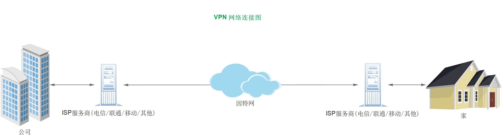
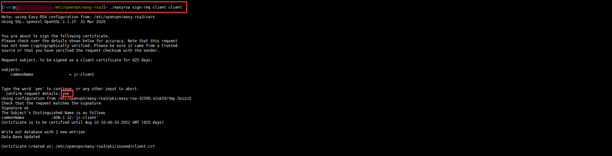
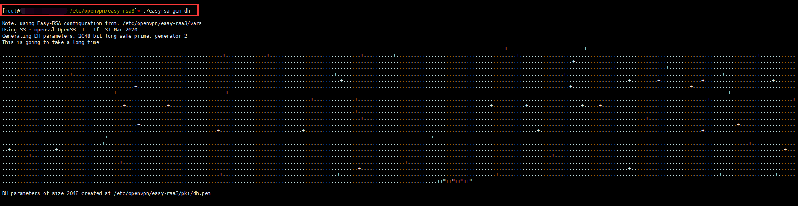
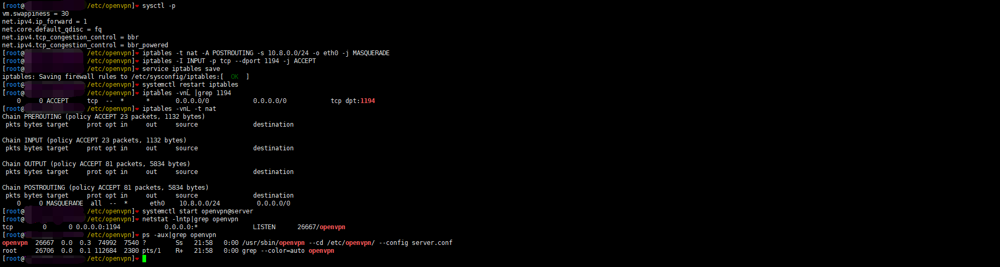
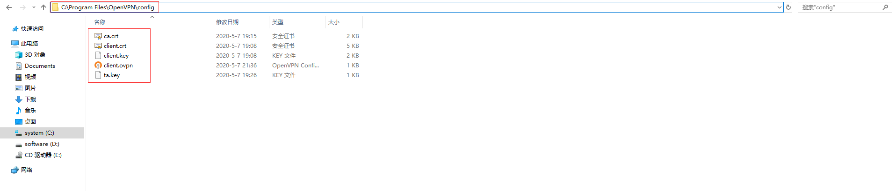
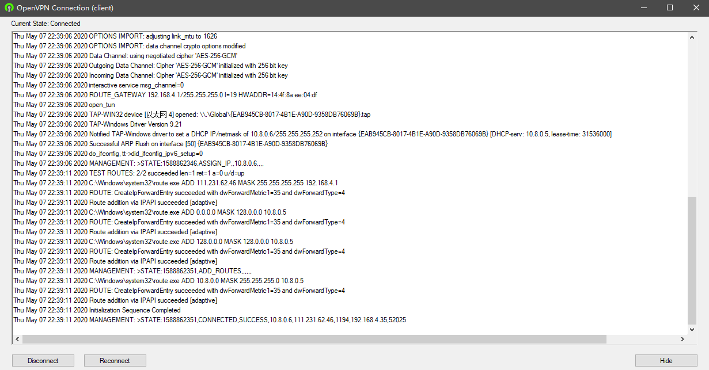
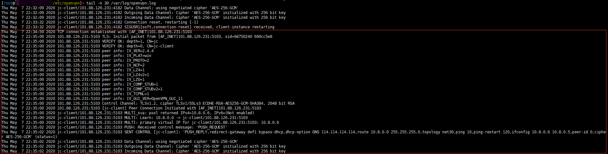
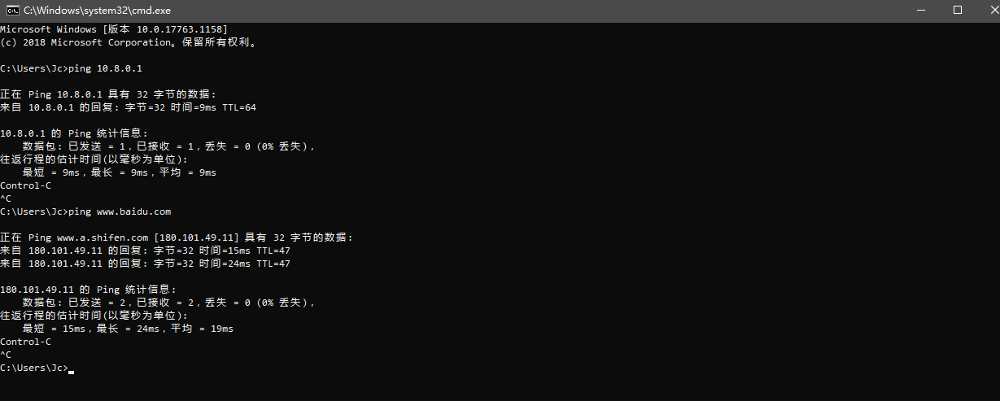
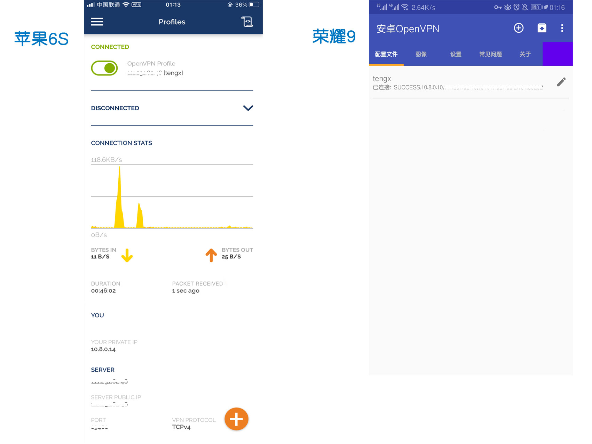

(Github)推荐使用一键脚本，一键安装配置VPN，还有很完善的使用文档 [OpenVPN 服务器一键安装脚本](https://github.com/hwdsl2/openvpn-install/blob/master/README-zh.md)  

OpenVPN是一个开源的应用程序，它允许您通过公共互联网创建一个安全的专用网络。OpenVPN实现一个虚拟专用网（VPN）来创建一个安全连接。OpenVPN使用OpenSSL库提供加密，它提供了几种身份验证机制，如基于证书的、预共享密钥和用户名/密码身份验证(windows/mac/Android/ios 都可以用客户端连接)。这里记录下基于证书的方式

[](https://wojc.cn/img/vpn/vpn.jpg)

声明：此本文仅限用于企业远程办公用途参考

OpenVPN客户端安装包下载：（每个版本都会有点变化（功能 和 支持的参数），请查看官方版本发布更新说明）  
\[安卓客户端\]： [https://jinc.lanzoui.com/b01i57pif](https://jinc.lanzoui.com/b01i57pif) 密码：etqh  
\[ Mac 客户端\]： [https://www.123912.com/s/NKhzVv-6fT63](https://www.123912.com/s/NKhzVv-6fT63) 密码：open，tar压缩包需要解压  
\[ Windows 客户端 \]： [https://jinc.lanzout.com/b01kx164b](https://jinc.lanzout.com/b01kx164b) 密码：63ku  
\[ 苹果客户端 \]： 需要注册AppStore美国地区的账号，然后搜索OpenVPN Connect安装  
\[官网下载\]: 各个系统客户端版本:[https://openvpn.net/client/](https://openvpn.net/client/)

系统环境 Centos7.x （ubuntu系统同理也是可以的）

## 安装openvpn包

```php
#临时关闭selinux

setenforce 0

#配置文件永久关闭 修改/etc/selinux/config 文件

SELINUX=disabled

#添加epel yum源

wget -O /etc/yum.repos.d/epel-7.repo http://mirrors.aliyun.com/repo/epel-7.repo

#yum安装包

yum install openvpn iptables-services -y
```

## 配置EasyRSA

```php
#下载EasyRSA 3.0.7

cd /opt/

wget https://github.com/OpenVPN/easy-rsa/releases/download/v3.0.7/EasyRSA-3.0.7.tgz

tar xf EasyRSA-3.0.7.tgz

cp -r EasyRSA-3.0.7/ /etc/openvpn/easy-rsa3

cp /etc/openvpn/easy-rsa3/vars.example /etc/openvpn/easy-rsa3/vars
```

## 创建相关证书和秘钥

```php
cd /etc/openvpn/easy-rsa3/

#初始化目录
./easyrsa init-pki

#创建根证书

#nopass 参数表示不加密；也可以不加此参数，那就需要输入密码短语
./easyrsa build-ca nopass

#创建服务端秘钥
./easyrsa gen-req server nopass
```

[](https://wojc.cn/usr/uploads/2020/05/2654942048.png)

```php
#给服务端证书签名，这里要输入yes才能完成
./easyrsa sign-req server server

##创建客户端秘钥
./easyrsa gen-req client nopass
```

[](https://wojc.cn/usr/uploads/2020/05/2643174040.png)

```php
#给客户端证书签名，这里要输入yes才能完成
./easyrsa sign-req client client
```

[](https://wojc.cn/usr/uploads/2020/05/3954235096.png)

```php
#创建Diffie-Hellman
./easyrsa gen-dh

#创建TLS认证密钥
openvpn --genkey --secret /etc/openvpn/ta.key
```

[](https://wojc.cn/usr/uploads/2020/05/295099963.png)

## 拷贝证书到目录

```php
#目录自定义，配置文件中要用到

cd /etc/openvpn/easy-rsa3/pki/
cp ca.crt dh.pem /etc/openvpn/
cp private/server.key issued/server.crt /etc/openvpn/server/
cp private/client.key issued/client.crt /etc/openvpn/client/
```

## 编辑服务端配置文件

server.conf

> 注意：这里的路径确认你的是否为2.4.8，如果不是要替换下；配置文件中除了贴出的参数，其他参数用;注释掉

```php
cd /etc/openvpn/
cp /usr/share/doc/openvpn-2.4.8/sample/sample-config-files/server.conf ./
vim server.conf

#监听本机ip地址
local 0.0.0.0
 
#监控本机端口号
port 1194
 

#指定采用的传输协议，可以选择tcp或udp
proto tcp

#指定创建的通信隧道类型，可选tun或tap
dev tun

#指定CA证书的文件路径
ca /etc/openvpn/ca.crt

 

#指定服务器端的证书文件路径
cert /etc/openvpn/server/server.crt

 

#指定服务器端的私钥文件路径
key /etc/openvpn/server/server.key

 

#指定迪菲赫尔曼参数的文件路径
dh /etc/openvpn/dh.pem

 

#指定虚拟局域网占用的IP地址段和子网掩码，此处配置的服务器自身占用.1的ip地址
server 10.8.0.0 255.255.255.0

#服务器自动给客户端分配IP后，客户端下次连接时，仍然采用上次的IP地址(第一次分配的IP保存在ipp.txt中，下一次分配其中保存的IP)。
ifconfig-pool-persist ipp.txt

 

#推送客户端可以访问的vpn路由网段
push "route 192.168.30.0 255.255.252.0"

 

#自动推送客户端上的网关及DHCP (此参数会让客户端都走vpn的网络,不加此参数可以实现正常走本地网络，访问vpn资源走vpn网络)
push "redirect-gateway def1 bypass-dhcp"

 

#OpenVPN的DHCP功能为客户端提供指定的 DNS、WINS 等
push "dhcp-option DNS 114.114.114.114"

 

#允许客户端与客户端相连接，默认情况下客户端只能与服务器相连接
#client-to-client

#允许一套证书或账户多人登录
duplicate-cn

#每10秒ping一次，连接超时时间设为120秒
keepalive 10 120

#开启TLS-auth，使用ta.key防御攻击。服务器端的第二个参数值为0，客户端的为1。
tls-auth /etc/openvpn/ta.key 0

 

#加密认证算法

cipher AES-256-CBC

#使用lzo压缩的通讯,服务端和客户端都必须配置

comp-lzo 

#最大连接用户

max-clients 100 

#定义运行的用户和组

user openvpn

group openvpn

 

#重启时仍保留一些状态
persist-key
persist-tun

 

#输出短日志,每分钟刷新一次,以显示当前的客户端
status /var/log/openvpn-status.log

 

#日志保存路径

log         /var/log/openvpn.log
log-append  /var/log/openvpn.log

 

#指定日志文件的记录详细级别，可选0-9，等级越高日志内容越详细

verb 4

#相同信息的数量，如果连续出现 20 条相同的信息，将不记录到日志中

mute 20

# 当服务器重新启动时，通知客户端，以便它可以自动重新连接。仅在上面配置UDP协议时可以用，使用TCP时要注释

;explicit-exit-notify 1
```

## 启动openvpn服务

```php
#修改文件目录权限

chown root.openvpn /etc/openvpn/* -R

#启动openvpn服务(启动失败请检查配置文件是否有写错)

systemctl start openvpn@server


#确认服务进程是否存在

netstat -lntp|grep openvpn
ps -aux|grep openvpn
```

[](https://wojc.cn/usr/uploads/2020/05/2159114475.png)

## 配置系统转发和开放端口

云服务器记得安全组要开放对应端口

```php
#/etc/sysctl.conf 配置文件中添加

net.ipv4.ip_forward=1

#生效

sysctl -p 


#清空iptables规则（如果机器第一次安装iptables-services，没有增删过规则，可以不用执行此步骤）

iptables -F
iptables -F -t nat
iptables -X
service iptables save
systemctl restart iptables

#iptables（重要一点：转发请求上网，【网段要和配置文件中一致】【注意网卡名称不是eth0的，要改成系统对应网卡名称】）

iptables -t nat -A POSTROUTING -s 10.8.0.0/24 -o eth0 -j MASQUERADE

#默认iptables是允许所有访问进入的，所以这条可以不用加（除非设置了INPUT默认是拒绝的规则）

iptables -I INPUT -p tcp --dport 1194 -j ACCEPT

#保存规则并重启

service iptables save
systemctl restart iptables
```

win10客户端使用：  
1、下载安装客户端（客户端软件在文章开头蓝奏网盘地址）  
2、找到客户端安装目录:  
3、把ca.crt、client.crt、client.key、ta.key 4个文件放到软件安装目录下config文件夹下 (或者把这几个文件内容贴到配置文件里面，格式见下方手机端配置文件格式)  
4、新建文件client.ovpn,把下面的参数粘贴到里面(文件格式是ovpn后缀)

```php
#客户端配置文件client.ovpn (文件名称是以.ovpn结尾的)

client

dev tun

proto tcp

remote 服务器ip/域名 1194

resolv-retry infinite

nobind

persist-key

persist-tun

ca ca.crt

cert client.crt

key client.key

tls-auth ta.key 1

remote-cert-tls server

cipher AES-256-CBC

comp-lzo

auth-nocache

verb 4
```


右键管理员启动OpenVPN GUI软件，点击Connect 连接(因为服务器时间慢了4分钟，截图中日志记录时间显示有偏差)

[](https://wojc.cn/usr/uploads/2020/05/2006212478.png)

  

[](https://wojc.cn/usr/uploads/2020/05/1731490544.png)

  

[](https://wojc.cn/usr/uploads/2020/05/4063935777.png)

[](https://wojc.cn/usr/uploads/2020/05/973527385.png)

连通性和上网测试

[](https://wojc.cn/usr/uploads/2020/05/441415963.png)

  

[](https://wojc.cn/usr/uploads/2020/05/1777946739.png)

  

基本上已经ok了，可以看到上网是通过openvpn的服务器代理上网的

  

（2021-04-09增加内容） 安卓、苹果手机APP使用：  
1、把ca.crt、client.crt、client.key、ta.key 4个文件内容写在client.ovpn文件中  
2、用QQ或邮件发送到手机上,然后选择用openvpn客户端打开导入文件

```php
#手机配置文件格式

client

dev tun

proto tcp

remote 服务器ip/域名 1194

resolv-retry infinite

nobind

persist-key

persist-tun

remote-cert-tls server

cipher AES-256-CBC

comp-lzo

auth-nocache

verb 4

 

<ca>

这里贴上ca.crt文件的内容

</ca>

 

<cert>

这里贴上client.crt文件的内容

</cert>

 

<key>

这里贴上client.key文件的内容

</key>

 

key-direction 1

<tls-auth>

这里贴上ta.key文件的内容

</tls-auth>
```


（2021-04-09增加内容） 安卓、苹果手机APP连接成功图例：

[](https://wojc.cn/usr/uploads/2021/04/4006791161.jpg)

  

总结(有问题请先对照文章内容步骤和文章注释说明，然后再参考下面的问题说明)  
此篇文章是以OpenVPN涉及到哪些文件和需要改动的配置进行搭建，需要有一定linux基础知识和理解  
写此篇文章是为了记录下，方便以后用到好找，并不是教程文章，参考过程中有问题就请多 百度|谷歌|搜狗|360|bing?  
如果觉得麻烦或者完全不懂的建议去网上找一键脚本安装的

1：安装openvpn和EasyRSA包  
2：创建需要的证书和秘钥  
3：修改配置文件:  
/etc/openvpn/server.conf  

连接问题：  
4：确认以上的配置文件无误  
5：确认openvpn服务和iptables启动正常  
6：确认证书文件正确  
7：确认服务端和客户端正确配置了连接参数  
8：确认你服务端的open vpn的协议和端口没有被运营商封掉  
9：确认放行使用到的tcp端口（云安全组|外网防火墙等安全策略）  

上网问题：  
10：确认iptables转发规则无误（清空iptables规则重新添加下）  
11：确认系统打开ipv4转发

[OpenVPN 官方文档用户指南](https://openvpn.net/connect-docs/user-guide.html)  
[OpenVPN win10客户端连接几个警告信息解决](https://wojc.cn/archives/573.html)  
[OpenVPN 基于用户密码方式认证](https://wojc.cn/archives/570.html)  

本文最后记录时间 2025-06-18

