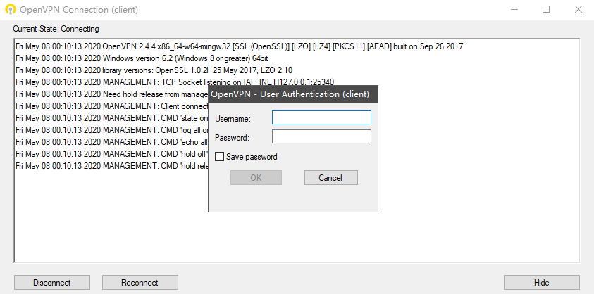
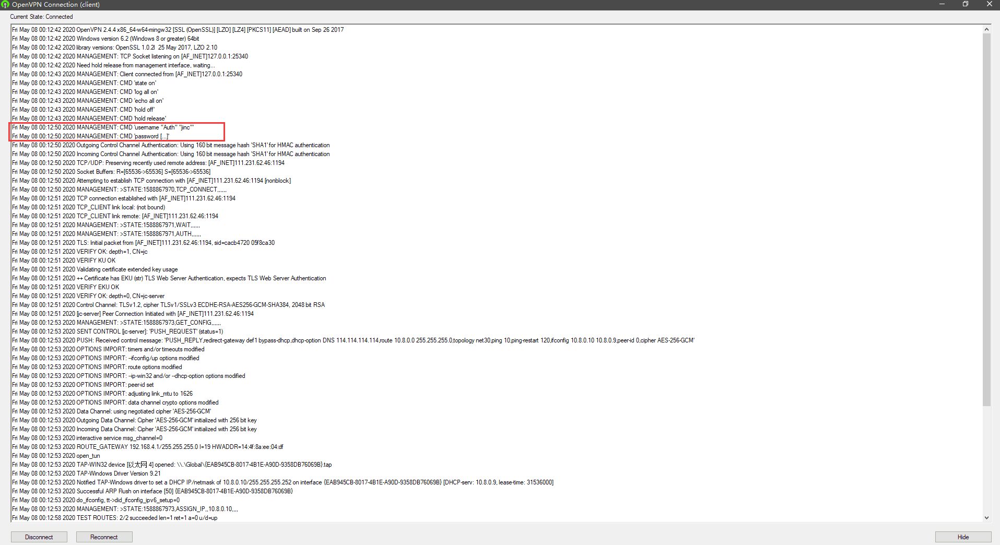

## OpenVPN基于用户密码方式认证

上篇文章写了基于证书的认证方式，这里记录下基于用户密码的认证方式

在 [Centos7 搭建Openvpn](https://wojc.cn/archives/556.html) 环境基础上修改

修改服务端 server.conf配置文件

```php
添加几个参数


#客户端不进行证书认证，如果不加将实现证书和用户密码双重认证

client-cert-not-required

 

#用户和密码验证脚本

auth-user-pass-verify /etc/openvpn/checkpsw.sh via-env

 

#使用用户名密码登录认证

username-as-common-name

 

#脚本安全级别

script-security 3
```

## 创建脚本和用户密码文件

```php
vim /etc/openvpn/checkpsw.sh

 

#!/bin/bash

###########################################################

# checkpsw.sh (C) 2004 Mathias Sundman <mathias@openvpn.se>

#

# This script will authenticate OpenVPN users against

# a plain text file. The passfile should simply contain

# one row per user with the username first followed by

# one or more space(s) or tab(s) and then the password.

 

PASSFILE="/etc/openvpn/psw-file"

LOG_FILE="/var/log/openvpn-password.log"

TIME_STAMP=\`date "+%Y-%m-%d %T"\`

 

###########################################################

 

if [ ! -r "${PASSFILE}" ]; then

    echo "${TIME_STAMP}: Could not open password file \"${PASSFILE}\" for reading." >>  ${LOG_FILE}

    exit 1

fi

 

CORRECT_PASSWORD=\`awk '!/^;/&&!/^#/&&$1=="'${username}'"{print $2;exit}' ${PASSFILE}\`

if [ "${CORRECT_PASSWORD}" = "" ]; then

    echo "${TIME_STAMP}: User does not exist: username=\"${username}\", password=\"${password}\"." >> ${LOG_FILE}

    exit 1

fi

 

if [ "${password}" = "${CORRECT_PASSWORD}" ]; then

    echo "${TIME_STAMP}: Successful authentication: username=\"${username}\"." >> ${LOG_FILE}

    exit 0

fi

 

echo "${TIME_STAMP}: Incorrect password: username=\"${username}\", password=\"${password}\"." >> ${LOG_FILE}

exit 1
```
```php
#增加执行权限  (2020-12-17标注：不加权限，连接会用户密码认证失败，因为执行不了脚本)

chmod +x /etc/openvpn/checkpsw.sh

 

#用户密码文件，格式：一行对应一个用户

vim /etc/openvpn/psw-file

jinc 123456

test 456789

 

#修改权限

chmod 777 /etc/openvpn/psw-file

chown root.openvpn /etc/openvpn/* -R

 

#重启openvpn服务

systemctl restart openvpn@server
```

## win10客户端配置文件修改

```php
#注释掉

;cert client.crt

;key client.key

 

#添加上

auth-user-pass
```

[](https://wojc.cn/usr/uploads/2020/05/380583393.png)

  

[](https://wojc.cn/usr/uploads/2020/05/1395039462.png)

  

相关文章  
[OpenVPN win10客户端连接几个警告信息解决](https://wojc.cn/archives/573.html)  
[Centos7 搭建OpenVPN 基于证书认证](https://wojc.cn/archives/556.html)

本文最后记录时间 2025-05-14  
文章链接地址： https://wojc.cn/archives/570.html  
本站文章除注明\[转载|引用|来源|来自\],均为本站原创内容,转载前请注明出处

[OpenVPN win10客户端连接几个警告信息解决](https://wojc.cn/archives/573.html)

[Centos7 搭建OpenVPN 基于证书认证](https://wojc.cn/archives/556.html)

[Centos7 搭建PPTP-VPN 服务](https://wojc.cn/archives/517.html)

[解决WIN10 VPN连接报错 "不能建立到远程计算机的连接。你可能需要更改此连接的网络设置](https://wojc.cn/archives/369.html)

[OpenVPN win10客户端连接几个警告信息解决](https://wojc.cn/archives/573.html "OpenVPN win10客户端连接几个警告信息解决")

[Centos7 搭建OpenVPN 基于证书认证](https://wojc.cn/archives/556.html "Centos7 搭建OpenVPN 基于证书认证")

