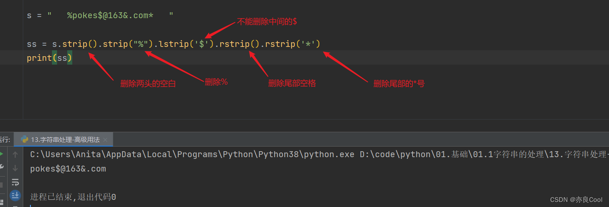

# 02.python字符串处理（合集）

‍

## 一、字符串的切片

### 1.1、通过下标及下标范围取值

```
my_str = "%pokes$@163&.com*"
value1 = my_str[2]  # 正向下标从0开始
value2 = my_str[-5]  # 反向下标从-1开始

print(value1)   #运行结果是“o”
print(value2)   #运行结果是“.”

```

[字符串分割](https://so.csdn.net/so/search?q=%E5%AD%97%E7%AC%A6%E4%B8%B2%E5%88%86%E5%89%B2&spm=1001.2101.3001.7020)，语法：[string](https://marketing.csdn.net/p/3127db09a98e0723b83b2914d9256174?pId=2782?utm_source=glcblog&spm=1001.2101.3001.7020)[end: step]

* start 头下标, 开始,，以 0 开头
* end 尾下标, 结尾
* step 步长

```
str = "abc-123-如果我是DJ你会爱我吗.mp4"
str = str[0:7]           #默认步长是1，可以不写
print(str)
# 结果：abc-123

```

```
str = "abc-123-如果我是DJ你会爱我吗.mp4"
str = str[0:-9]           #负数是从右往左截取
print(str)
# 结果：abc-123-如果我是DJ

```

```
str = "abc-123-如果我是DJ你会爱我吗.mp4"
str = str[8:]           #不写右边就是一直到结尾
print(str)
# 结果：如果我是DJ你会爱我吗.mp4

```

### 1.2、index 方法：查找特定字符串的下标索引值

```
my_str = "%pokes$@163&.com*"
value3 = my_str.index("pokes")
print(value3)   #1

#运行结果是“1”
注意：1是"pokes"起始下标，即p所在的下标位置

```

### 1.3、replace 方法：字符串替换

语法：变量. replace(“被替换的内容”，“替换后的内容”[，次数])

```
str2= "ithahahaaa and ithehehehe"
new_str2 = str2.replace("it","pokes")    #将it替换成pokes
print(new_str2)    

#运行结果：pokeshahahaaa and pokeshehehehe

```

过滤掉顿号

```
str1 = "212、Python用replace()函数删除制定  符号"
str2 = str1.replace('、', '')      #可以这样理解，把顿号替换为空
print(str2)

```

### 1.4、split 方法：分割字符串

[关键字](https://so.csdn.net/so/search?q=%E5%85%B3%E9%94%AE%E5%AD%97&spm=1001.2101.3001.7020) split，语法格式：变量. split(‘分隔符’, 次数)

```
str3= "abc-123-C-爱丽丝-遥远的故事.pdf"
new_str3 = str3.split(".")
print(new_str3)
new_str4 = str3.split("-")
print(new_str4)

```

运行结果：


```
str = "abc-123-如果我是DJ你会爱我吗.mp4"
str = str.split('-')          #次数不写，则默认为最大次数
print(str)
结果：['abc', '123', '如果我是DJ你会爱我吗.mp4']

```

### 1.5、strip方法：去除字符串两端的空格和回车符

strip 两头 ，lstrip头， rstrip尾。

去掉两头的空格，注意不包含中间的空格

```Python
str5= "     heihei hehe haha    "
new_str5=str5.strip()   #不传参数，默认去除两端的空格和回车符
print(new_str5)

```

连续的过滤字符

```Python
s = "   %pokes$@163&.com*   "

ss = s.strip().strip("%").lstrip('$').rstrip().rstrip('*')
print(ss)

```

运行结果


[详情参考：点击查看](详情参考：https://blog.csdn.net/csdn15698845876/article/details/73469234 "详情参考：点击查看")

### 1.6、count方法，统计字符串中某字符出现的次数

```Python
str6= "heihei hehe haha"
cishu = str6.count("he")
print(cishu)

#运行结果：4

```

### 1.7、len统计字符串的长度

```Python
str6= "heihei hehe haha"
num=len(str6)
print(num)

```

### 1.8、find字符串查找

find方法检测字符串中是否包含子字符串str ，如果指定 beg（开始） 和 end（结束） 范围，则检查是否包含在指定范围内，如果指定范围内如果包含指定索引值，如果不包含索引值，返回-1。返回的是需要查找的字符串的下标  
变量.find(“要查找的内容”，[开始位置，结束位置])

#### 

### 1.1、通过下标及下标范围取值

```
my_str = "%pokes$@163&.com*"
value1 = my_str[2]  # 正向下标从0开始
value2 = my_str[-5]  # 反向下标从-1开始

print(value1)   #运行结果是“o”
print(value2)   #运行结果是“.”

```

字符串分割，语法：string[end: step]

* start 头下标, 开始,，以 0 开头
* end 尾下标, 结尾
* step 步长

```Python
str = "abc-123-如果我是DJ你会爱我吗.mp4"
str = str[0:7]           #默认步长是1，可以不写
print(str)
# 结果：abc-123

```

```Python
str = "abc-123-如果我是DJ你会爱我吗.mp4"
str = str[0:-9]           #负数是从右往左截取
print(str)

# 结果：abc-123-如果我是DJ
```

```Python
str = "abc-123-如果我是DJ你会爱我吗.mp4"
str = str[8:]           #不写右边就是一直到结尾
print(str)
# 结果：如果我是DJ你会爱我吗.mp4

```

### 1.2、index 方法：查找特定字符串的下标索引值

```Python
my_str = "%pokes$@163&.com*"
value3 = my_str.index("pokes")
print(value3)   #1

#运行结果是“1”
注意：1是"pokes"起始下标，即p所在的下标位置

```

### 1.3、replace 方法：字符串替换

语法：变量. replace(“被替换的内容”，“替换后的内容”[，次数])

```Python
str2= "ithahahaaa and ithehehehe"
new_str2 = str2.replace("it","pokes")    #将it替换成pokes
print(new_str2)      

#运行结果：pokeshahahaaa and pokeshehehehe

```

过滤掉顿号

```Python
str1 = "212、Python用replace()函数删除制定  符号"
str2 = str1.replace('、', '')      #可以这样理解，把顿号替换为空
print(str2)

```

### 1.4、split 方法：分割字符串

[关键字](https://so.csdn.net/so/search?q=%E5%85%B3%E9%94%AE%E5%AD%97&spm=1001.2101.3001.7020) split，语法格式：变量. split(‘分隔符’, 次数)

```Python
str3= "abc-123-C-爱丽丝-遥远的故事.pdf"
new_str3 = str3.split(".")
print(new_str3)
new_str4 = str3.split("-")
print(new_str4)

```

运行结果：


```Python
str = "abc-123-如果我是DJ你会爱我吗.mp4"
str = str.split('-')          #次数不写，则默认为最大次数
print(str)
结果：['abc', '123', '如果我是DJ你会爱我吗.mp4']

```

### 1.5、strip 方法：去除字符串两端的空格和回车符

strip 两头 ，lstrip 头， rstrip 尾。

去掉两头的空格，注意不包含中间的空格

```Python
str5= "     heihei hehe haha    "
new_str5=str5.strip()   #不传参数，默认去除两端的空格和回车符
print(new_str5)

```

连续的过滤字符

```Python
s = "   %pokes$@163&.com*   "

ss = s.strip().strip("%").lstrip('$').rstrip().rstrip('*')
print(ss)

```

运行结果

详情参考：`https://blog.csdn.net/csdn15698845876/article/details/73469234`

### 1.6、count 方法，统计字符串中某字符出现的次数

```Python
str6= "heihei hehe haha"
cishu = str6.count("he")
print(cishu)

#运行结果：4

```

### 1.7、len 统计字符串的长度

```Python
str6= "heihei hehe haha"
num=len(str6)
print(num)

```

### 1.8、find 字符串查找

find 方法检测字符串中是否包含子字符串 str ，如果指定 beg（开始） 和 end（结束） 范围，则检查是否包含在指定范围内，如果指定范围内如果包含指定索引值，如果不包含索引值，返回 - 1。返回的是需要查找的字符串的下标
变量. find(“要查找的内容”，[开始位置，结束位置])

```Python
str = "abc-123-如果我是DJ你会爱我吗.mp4"
str = str.find('DJ')
print(str)
结果:12         #返回的是需要查找的字符串的下标,不包含则返回-1

```

## 二、字符串判断

---

### 2.1、判断字符串是否出现过

查询字母 k 是否出现，如果出现结果返回索引，没出现则返回 - 1

```Python
print("pokes".find("k"))  # 2
print("pooes".find("k"))  # -1
```

### 2.2 、判断是否以 xxx 开头

判断是否以 xxx 开头，返回布尔值

```Python
# 判断是否以k开头，返回布尔值
print("pokes".startswith("k"))  # False
print("kpokes".startswith("k"))  # True

```

### 2.3、判断是否以 xxx 结尾

```Python
# 判断是否以k结尾，返回布尔值
print("pokes".endswith("k"))  # False
print("kpokesk".endswith("k"))  # True

```

### 2.4. 判断字符串是否只包含数字

#### 内置[函数](https://marketing.csdn.net/p/3127db09a98e0723b83b2914d9256174?pId=2782?utm_source=glcblog&spm=1001.2101.3001.7020)

```Python
str_1 = "123"
str_2 = "Abc"
str_3 = "123Abc"

print(str_1.isdigit())
print(str_2.isdigit())
print(str_3.isdigit())

```

运行结果


#### txdpy 模块

这个模块不是很出名，查了都没找到结果。不过很好用
使用前先安装模块`pip install txdpy`，用法演示：

```Python
from txdpy import is_num,is_chinese,is_letter,is_Bletter,is_Sletter,is_num_letter

s1='s1'
s2='ss'
s3='s三'
s4='SSSS'
s5='测试'
s6='6666'
s7='测试777'
 
#是否为纯数字
print(is_num(s6))
print(is_num(s7))
#是否为纯汉字
print(is_chinese(s5))
print(is_chinese(s7))
#是否为纯字母
print(is_letter(s1))
print(is_letter(s2))
#是否为纯大写字母
print(is_Bletter(s4))
print(is_Bletter(s2))
#是否为纯小写字母
print(is_Sletter(s4))
print(is_Sletter(s2))
#是否为只包含字母、数字、数字字母混合，不含其他除字母和数字以外的任何字符
print(is_num_letter(s1))
print(is_num_letter(s4))

```

### 2.5. 判断字符串中包含特殊符号

```Python
input_psd = input("请输入字符串")
# 判断是否有特殊字符

string = "~!@#$%^&*()_+-*/<>,.[]\/"
for i in string:
    if i in input_psd:
        print("您的输入包含特殊字符")


```

或者导入 python 内置模块 re

```Python
import re
input_psd = input("请输入字符串")
test_str = re.search(r"\W",input_psd)
if test_str==None:
    print("没有没有真没有特殊字符")
else:
    print("该文本包含特殊字符")


```

### 2.3 连续判断过滤字符串

有时候我们需要连续的判断

```Python
if "download_zh.png" not in str:
	if "actjpgs" not in str:
		pass

```

他不能写成：

```Python
if "download_zh.png" and "actjpgs" not in str:
	pass

```

可以写成这样

```Python
if "download_zh.png" not in str and "actjpgs" not in str:
	pass

```

但是如果过滤的字符串有 N 多个，这样就很痛苦。那么你可以：

将需要过滤掉的字符串写进一个 list

```Python
filter_strings = ["download_zh.png", "actjpgs"]
	if not any(s in item for s in filter_strings):
    # 如果item不包含列表中的任何一个字符串，‌则执行这里的代码
    print("过滤条件满足")

```

#### re 模块，过滤字符

```Python
import re

str1 = "  12312313Python用replace()函数删除制定  符号  "
str2 = re.sub('([^\u4e00-\u9fa5])', '', str1)		#只保留汉字
print(str2) 

# 只保留字符串中的汉字和数字

str2 = re.sub('([^\u4e00-\u9fa5\u0030-\u0039])', '', str1)
print(str2) 

```

常用字符 unicode 的编码范围：

* 数字：\u0030-\u0039
* 汉字：\u4e00-\u9fa5
* 大写字母：\u0041-\u005a
* 小写字母：\u0061-\u007a
* 英文字母：\u0041-\u007a

注：更多的编码范围可参考另博主的整理：`https://blog.csdn.net/weixin_34206263/article/details/112031865`

### 2.3. 注意计算机提问而得到的任何回答都是字符串类型

由计算机提问而得到的任何回答都是字符串类型

```Python
age=input('你几岁了？')
print(age)
print(type(age))
age=int(age)     #数据类型转换
print(type(age))

```

### 2.4. 字符串字母大小写转换和判断

* capitalize，# 将字符串得第一个字符转换成大写
* title，每个单词得首字母大写
* istitle #判断每个单词得首字母是否大写#
* upper 全部转换成大写
* lower 全部转换成小写

```Python
message = 'zhaorui is a beautiful girl!'

# capitalize

msg = message.capitalize()   #将字符串得第一个字符转换成大写
print(msg)

# title
msg = message.title()      #每个单词得首字母大写
print(msg)


# istitle

cmd = msg.istitle()           #判断每个单词得首字母是否大写
print(cmd)

spokes = message.istitle()    #判断每个单词得首字母是否大写
print(spokes)

# upper 全部转换成大写

msg = message.upper()
print(msg)

# lower 全部转换成小写
msg = message.lower()
print(msg)
print(len(msg))          #计算字符串长度

```

## 三、字符串比较

---

```Python
s1='abc'
s2="abc"
#
# # 内容比较
print(s1 == s2)
print(s1 is s2)

pokes1 = input('请输入：')
pokes2 = input('请输入：')
#
print(pokes1 == pokes2)

```

## 四、过滤掉某个字符

---

### 过滤掉单个字符

```Python
str1 = "212、Python用replace()函数删除制定  符号"
str2 = str1.replace('、','')		#过滤掉顿号
print(str2)

```

### 过滤掉多个符号

```Python
def zifu(str, x, y, z):
    strin = str.replace(x, '') .replace(y, '').replace(z, '')
    print(strin)

zifu("pokes，@163.com,kkkkk", "，", ",", "163")
‍```·
# 五、字母大小转换

‍```python
print("POKES".lower())  #pokes,转换成小写
print("pokes".upper())  #POKES,转换成小写

```
