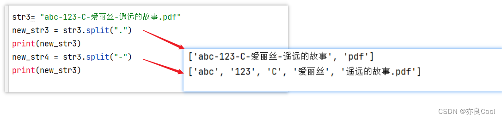
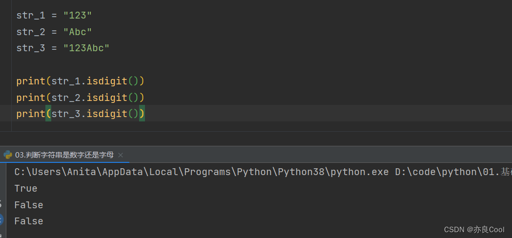

# Python字符串处理-常用思路汇总

## 一、字符串的切片

### 1.1、通过下标及下标范围取值
```python
my_str = "%pokes$@163&.com*"
value1 = my_str[2]  # 正向下标从0开始
value2 = my_str[-5]  # 反向下标从-1开始

print(value1)   #运行结果是“o”
print(value2)   #运行结果是“.”
```

字符串切片语法：`string[start:end:step]`
- start：头下标，开始位置，以 0 开头
- end：尾下标，结束位置
- step：步长（默认值为1，可省略）

```python
str = "abc-123-如果我是DJ你会爱我吗.mp4"
str = str[0:7]           #默认步长是1，可以不写
print(str)
# 结果：abc-123
```

```python
str = "abc-123-如果我是DJ你会爱我吗.mp4"
str = str[0:-9]           #负数是从右往左截取
print(str)
# 结果：abc-123-如果我是DJ
```

```python
str = "abc-123-如果我是DJ你会爱我吗.mp4"
str = str[8:]           #不写右边就是一直到结尾
print(str)
# 结果：如果我是DJ你会爱我吗.mp4
```

```python
# 拓展：倒序截取
filename = 'picture.png'
print(filename[::-1])  # -1表示倒序，结果：gnp.erutcip
name = 'pokes'
print(name[::-1])  # 结果：sekop
```

### 1.2、index 方法：查找特定字符串的下标索引值
```python
my_str = "%pokes$@163&.com*"
value3 = my_str.index("pokes")
print(value3)   #1

#运行结果是“1”
注意：1是"pokes"起始下标，即p所在的下标位置
```

### 1.3、replace 方法：字符串替换
语法：`变量.replace("被替换的内容"，"替换后的内容"[，次数])`

```python
str2= "ithahahaaa and ithehehehe"
new_str2 = str2.replace("it","pokes")    #将it替换成pokes
print(new_str2)    

#运行结果：pokeshahahaaa and pokeshehehehe
```

过滤掉指定符号（将符号替换为空）：
```python
str1 = "212、Python用replace()函数删除制定  符号"
str2 = str1.replace('、', '')      #过滤掉顿号
print(str2)

# 拓展：连续过滤多个符号
str1 = "212、Python用replace()函数删除制定  符号"
str2 = str1.replace('、', '').replace(' ', '') # 同时过滤顿号和空格
print(str2) # 结果：212Python用replace()函数删除制定符号
```

### 1.4、split 方法：分割字符串
关键字 `split`，语法格式：`变量.split('分隔符', 次数)`

```python
str3= "abc-123-C-爱丽丝-遥远的故事.pdf"
new_str3 = str3.split(".")
print(new_str3)
new_str4 = str3.split("-")
print(new_str4)
```

运行结果：


```python
str = "abc-123-如果我是DJ你会爱我吗.mp4"
str = str.split('-')          #次数不写，则默认为最大次数
print(str)
结果：['abc', '123', '如果我是DJ你会爱我吗.mp4']
```

### 1.5、strip方法：去除字符串两端的空格和回车符
- strip：去除两端的空格/回车符
- lstrip：仅去除开头的空格/回车符
- rstrip：仅去除结尾的空格/回车符

去掉两头的空格（不包含中间的空格）：
```python
str5= "     heihei hehe haha    "
new_str5=str5.strip()   #不传参数，默认去除两端的空格和回车符
print(new_str5)
```

连续的过滤字符：
```Python
s = "   %pokes$@163&.com*   "

ss = s.strip().strip("%").lstrip('$').rstrip().rstrip('*')
print(ss)
```

运行结果：


### 1.6、count方法，统计字符串中某字符出现的次数
```Python
str6= "heihei hehe haha"
cishu = str6.count("he")
print(cishu)

#运行结果：4
```

### 1.7、len统计字符串的长度
```Python
str6= "heihei hehe haha"
num=len(str6)
print(num)
```

### 1.8、find字符串查找
find方法检测字符串中是否包含子字符串str ，如果指定 beg（开始） 和 end（结束） 范围，则检查是否包含在指定范围内；包含则返回子串起始下标，不包含则返回-1。

语法：`变量.find("要查找的内容"，[开始位置，结束位置])`

```Python
str = "abc-123-如果我是DJ你会爱我吗.mp4"
str = str.find('DJ')
print(str)
结果:12         #返回的是需要查找的字符串的下标,不包含则返回-1
```

```Python
# 拓展：判断字符是否存在
print("pokes".find("k"))  # 2（存在，返回下标）
print("pooes".find("k"))  # -1（不存在）
```

## 二、字符串判断

### 2.1、判断是否以 xxx 开头/结尾（返回布尔值）
```Python
# 判断是否以k开头
print("pokes".startswith("k"))  # False
print("kpokes".startswith("k"))  # True

# 判断是否以k结尾
print("pokes".endswith("k"))  # False
print("kpokesk".endswith("k"))  # True
```

### 2.2、判断字符串是否只包含数字
#### 内置函数 isdigit()
```Python
str_1 = "123"
str_2 = "Abc"
str_3 = "123Abc"

print(str_1.isdigit())
print(str_2.isdigit())
print(str_3.isdigit())
```

运行结果：


#### txdpy 模块（需先安装：`pip install txdpy`）
```Python
from txdpy import is_num,is_chinese,is_letter,is_Bletter,is_Sletter,is_num_letter

s1='s1'
s2='ss'
s3='s三'
s4='SSSS'
s5='测试'
s6='6666'
s7='测试777'
 
#是否为纯数字
print(is_num(s6))
print(is_num(s7))
#是否为纯汉字
print(is_chinese(s5))
print(is_chinese(s7))
#是否为纯字母
print(is_letter(s1))
print(is_letter(s2))
#是否为纯大写字母
print(is_Bletter(s4))
print(is_Bletter(s2))
#是否为纯小写字母
print(is_Sletter(s4))
print(is_Sletter(s2))
#是否为只包含字母、数字、数字字母混合，不含其他除字母和数字以外的任何字符
print(is_num_letter(s1))
print(is_num_letter(s4))
```

### 2.3、判断字符串中包含特殊符号
#### 方法1：遍历匹配特殊字符
```Python
input_psd = input("请输入字符串")
# 判断是否有特殊字符
string = "~!@#$%^&*()_+-*/<>,.[]\/"
for i in string:
    if i in input_psd:
        print("您的输入包含特殊字符")
```

#### 方法2：使用re模块
```Python
import re
input_psd = input("请输入字符串")
test_str = re.search(r"\W",input_psd)
if test_str==None:
    print("没有没有真没有特殊字符")
else:
    print("该文本包含特殊字符")
```

### 2.4、连续判断过滤字符串
#### 错误写法
```Python
if "download_zh.png" and "actjpgs" not in str:
	pass
```

#### 正确写法（少量过滤项）
```Python
if "download_zh.png" not in str and "actjpgs" not in str:
	pass
```

#### 批量过滤（大量过滤项）
```Python
filter_strings = ["download_zh.png", "actjpgs"]
if not any(s in item for s in filter_strings):
    # 如果item不包含列表中的任何一个字符串，则执行这里的代码
    print("过滤条件满足")
```

#### re模块过滤指定字符（按Unicode范围）
常用字符 unicode 的编码范围：
- 数字：\u0030-\u0039
- 汉字：\u4e00-\u9fa5
- 大写字母：\u0041-\u005a
- 小写字母：\u0061-\u007a
- 英文字母：\u0041-\u007a

注：更多的编码范围可参考：`https://blog.csdn.net/weixin_34206263/article/details/112031865`

```Python
import re

# 只保留汉字
str1 = "  12312313Python用replace()函数删除制定  符号  "
str2 = re.sub('([^\u4e00-\u9fa5])', '', str1)		
print(str2) # 结果：用函数删除制定符号

# 只保留字符串中的汉字和数字
str3 = re.sub('([^\u4e00-\u9fa5\u0030-\u0039])', '', str1)
print(str3) # 结果：12312313用函数删除制定符号
```

### 2.5、注意：input获取的输入均为字符串类型
```Python
age=input('你几岁了？')
print(age)
print(type(age))  # <class 'str'>
age=int(age)     #数据类型转换
print(type(age)) # <class 'int'>
```

### 2.6、字符串字母大小写转换和判断
| 方法       | 功能                     |
|------------|--------------------------|
| capitalize | 将字符串第一个字符转大写 |
| title      | 每个单词首字母大写       |
| istitle    | 判断每个单词首字母是否大写|
| upper      | 全部转换成大写           |
| lower      | 全部转换成小写           |

```Python
message = 'zhaorui is a beautiful girl!'

# capitalize
msg = message.capitalize()   #将字符串的第一个字符转换成大写
print(msg) # Zhaorui is a beautiful girl!

# title
msg = message.title()      #每个单词的首字母大写
print(msg) # Zhaorui Is A Beautiful Girl!

# istitle
cmd = msg.istitle()           #判断每个单词的首字母是否大写
print(cmd) # True
spokes = message.istitle()    #判断每个单词的首字母是否大写
print(spokes) # False

# upper 全部转换成大写
msg = message.upper()
print(msg) # ZHAORUI IS A BEAUTIFUL GIRL!

# lower 全部转换成小写
msg = message.lower()
print(msg) # zhaorui is a beautiful girl!
print(len(msg))          #计算字符串长度，结果：28

# 快捷转换
print("POKES".lower())  # pokes（转小写）
print("pokes".upper())  # POKES（转大写）
```

## 三、字符串比较
```Python
s1='abc'
s2="abc"
# 内容比较
print(s1 == s2) # True
print(s1 is s2) # True

pokes1 = input('请输入：')
pokes2 = input('请输入：')
print(pokes1 == pokes2) # 根据输入内容返回True/False
```

## 四、过滤掉指定字符
### 4.1、过滤掉单个字符
```Python
str1 = "212、Python用replace()函数删除制定  符号"
str2 = str1.replace('、','')		#过滤掉顿号
print(str2)
```

### 4.2、过滤掉多个符号（自定义函数）
```Python
def zifu(str, x, y, z):
    strin = str.replace(x, '') .replace(y, '').replace(z, '')
    print(strin)

zifu("pokes，@163.com,kkkkk", "，", ",", "163") # 结果：pokes@.comkkkkk
```

## 五、字符串检测包含（自定义函数）
```python
def baohan(str, bh01, bh02, bh03, bh04):
    if (bh01 in str) == True:
        print("包含了：" + bh01)
    if (bh02 in str) == True:
        print("包含了：" + bh02)
    else:
        print("不包含了：" + bh02)
    if (bh03 in str) == True:
        print("包含了：" + bh03)
    if (bh04 in str) == True:
        print("包含了：" + bh04)

baohan("[韩国][我朋友的老姐].2016.Uncut.720p.HDRip.H264-ob.mp4", "韩国", "老姐", "朋友", "2016")
# 运行结果：
# 包含了：韩国
# 包含了：老姐
# 包含了：朋友
# 包含了：2016
```