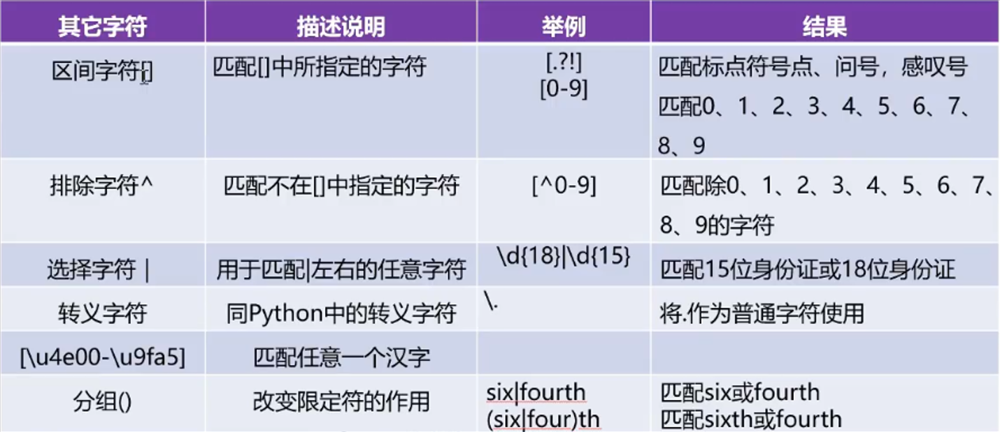

# 03.正则表达式re模块

re模块用于实现Python中的正式表达式的操作，是Python中的内置模块，不需要安装，导入即可以使用

## 功能函数

| 函数                                      | 功能描述                                                     |
| ----------------------------------------- | ------------------------------------------------------------ |
| re.match(pattern,string,flags=0)          | 用于从字符串的开始位置进行匹配，如果起始位置匹配成功，结果为Match对象，否则结果为None. |
| re.search(pattern,string,flags=0)         | 用于在整个字符串中搜索第一个匹配的值，如果匹配成功，结果为Match对象，否则结果为None。 |
| re.findall(pattern,string,flags=0)        | 用于在整个字符串搜索所有符合正则表达式的值，结果是一个列表类型。 |
| re.sub(pattern,repl,string,count,flags=0) | 用于实现对字符串中指定子串的替换                             |
| re.split(pattern,string,maxsplit,flags=0) | 字符串中的split()方法功能相同，都是分隔字符串                |

匹配字符



## match匹配开头

用于从字符串的开始位置进行匹配，如果起始位置匹配成功，结果为 Match对象，否则结果为None

```python
re.match(pattern,string,flags=0)
```

注意：`match`​是从开头开始匹配

```python
# 匹配规则，\d是数字，点是3.11的点
pattern = "\d\.\d+"
# 待匹配的字符
s1 = "I study Python 3.11 every day"
# 匹配， re.I是忽略大小写
match1 = re.match(pattern, s1, re.I)
print(match1)  # 结果：None，为什么没有找到？因为match是从头开始找

s2 = "3.11Python I study every day"
match2 = re.match(pattern, s2, re.I)   #re.I是不区分大小写
print(match2)  # 结果找到了：<re.Match object; span=(0, 4), match='3.11'>

# <re.Match object; span=(0, 4), match='3.11'>
# span=(0, 4)，是位置字符串的下标
# match='3.11'，匹配到的内容

# 那怎么拿到这些值呢？
print("匹配值的起始位置：", match2.start())  # 匹配值的起始位置： 0
print("匹配值的结束位置：", match2.end())  # 匹配值的结束位置： 4
print("匹配区间的位置元素：", match2.span())  # 匹配区间的位置元素： (0, 4)
print("待匹配的字符串：", match2.string)  # 待匹配的字符串： 3.11Python I study every day
print("匹配的数据:", match2.group())  # 匹配的数据: 3.11
```

‍

## search搜索

用于在整个字符串中搜索第一个匹配的值，如果匹配成功，如果为 match对象，否则结果为None

```python
re.search(pattern,string,flags=0)
```

注意：search只要匹配到第一个然后就结束

```python
import re

# 匹配规则，\d是数字，点是3.11的点
pattern = "\d\.\d+"
# 待匹配的字符
s1 = "I study Python 3.11 every day Python2.7 I love you"
match = re.search(pattern, s1)
print(match)    #只要匹配到第一个然后就结束，结果：<re.Match object; span=(15, 19), match='3.11'>
print(match.group())
```

‍

## findall查找所有

用于在整个字符事搜索所有符合正则表达式的值，如果为列表

```python
re.findall(pattern,string,flags=0)
```

注意：findall查找所有并返回一个列表

```python
import re

# 03、findall的使用

# 匹配规则，\d是数字，点是3.11的点
pattern = "\d\.\d+"

# 待匹配的字符
s1 = "I study Python 3.11 every day Python2.7 I love you"


list = re.findall(pattern, s1)
print(list)  # 查找所有并返回一个列表，结果：['3.11', '2.7']

for item in list:
    print(item)
```

‍

## sub替换的使用

用于实现实符串的替换

```python
re.sub (pattern,repl,string,count,flags=0)
```

案例

```python
import re

# 02、sub的使用

# 替换的词
pattern = "黑客|破解|反爬"
# 待匹配的字符
s1 = "我想学习Python，想破解一些VIP视频，Python可以实现反爬吗？"

match = re.sub(pattern, "***", s1)
print(match)  # 我想学习Python，想***一些VIP视频，Python可以实现***吗？


```

## split分割

功能与字符串的split方法相同，为分割

```python
re.split(pattern,string,maxsplit,flags=0)
```

案例：

```python
import re

# 05、split分割的使用


# 待匹配的字符
s1 = "https://www.bilibili.com/video/BV16hUaYQEsn/?spm_id_from=333.1007.tianma.1-1-1.click"

# 匹配的字符
pattern = "[?|=]"  # 以问号或者等号分割

# 返回一个list
s1List = re.split(pattern, s1)
print(s1List)  # ['https://www.bilibili.com/video/BV16hUaYQEsn/', 'spm_id_from', '333.1007.tianma.1-1-1.click']

# 遍历拿到每个值
for item in s1List:
    print(item)

```

‍
